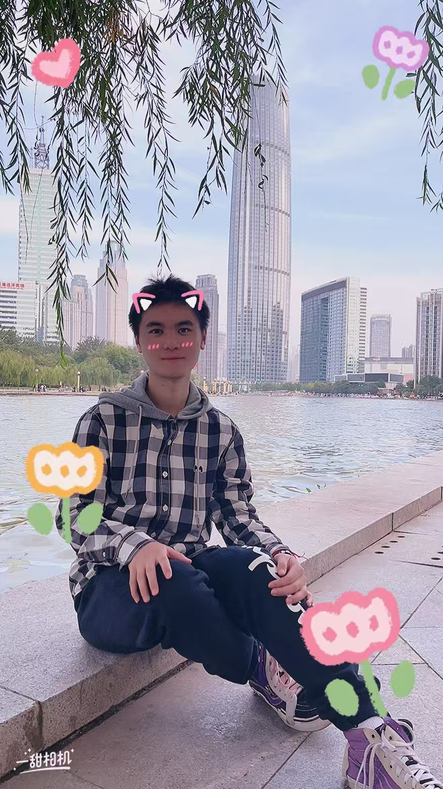
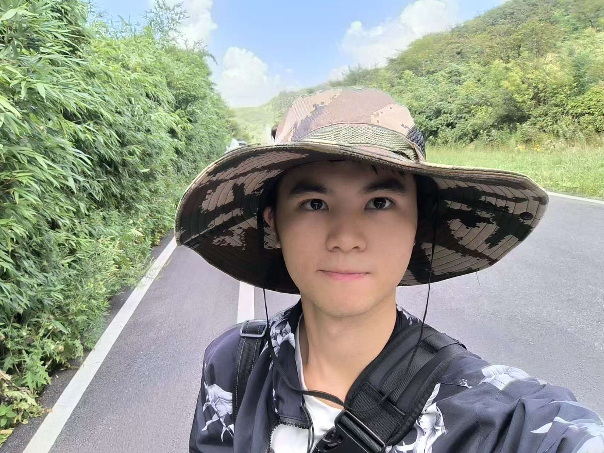
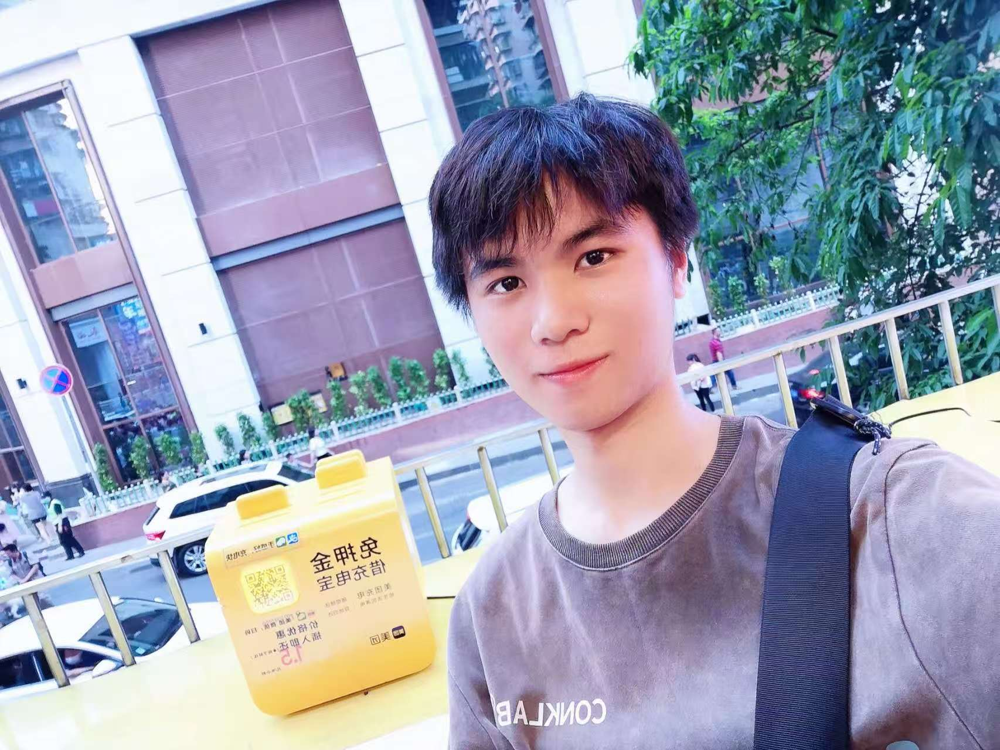
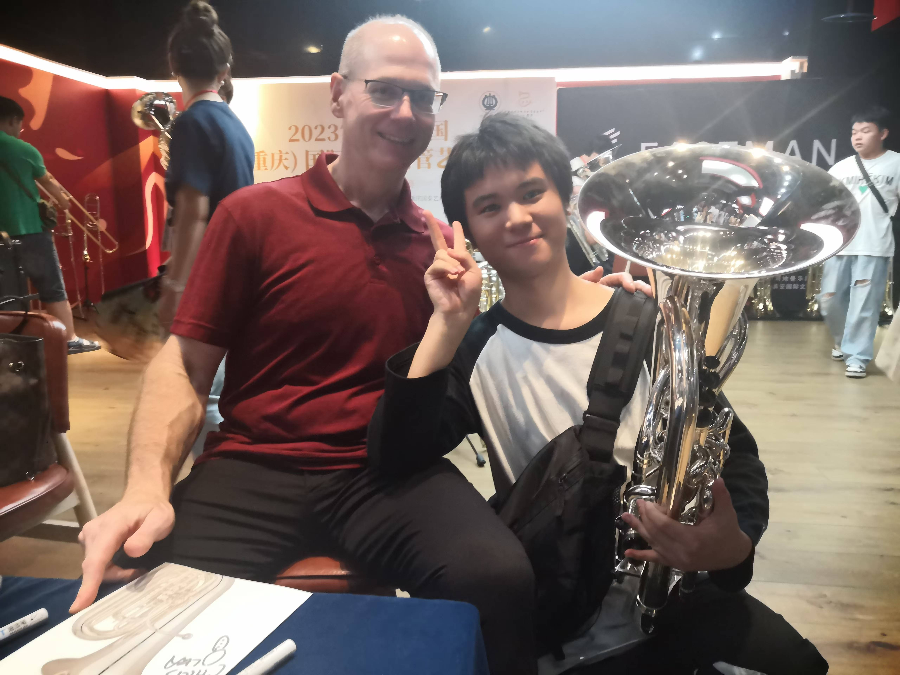
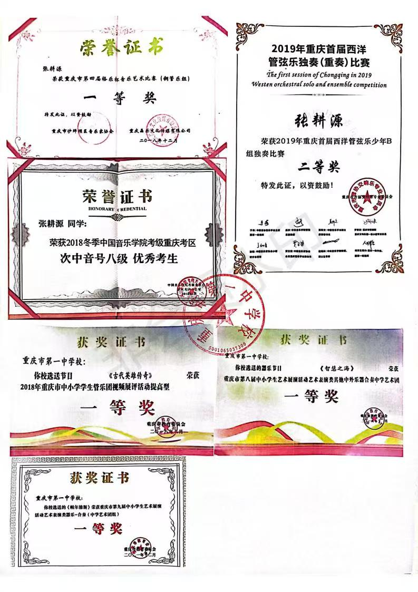

# 墨海寻珠
$\qquad${ align=right width="35%" }本项目是关于本人从大一以来学习到的知识，开始撰写的时间为2025年1月15日。

$\qquad$项目取名为<mark>墨海寻珠</mark>，“墨海” 指代知识的海洋，像墨水一样深广无边，“寻珠” 寓意在知识的海洋里探寻珍贵的智慧结晶，鼓励不断深入学习，在知识的海洋里挖掘更多的宝藏，追求更高的知识境界。希望在未来的时间里，我能够孜孜不倦地学习，同时通过本项目将我的所学知识进行总结。一则可以将我的见识进行有效地组织，收获到宝贵的学习经验；二则可以将我所学到的知识分享给大家，从而为更多的人带来帮助；三则我不希望我成为一个只会埋头苦读，一味追求成绩的人，通过撰写本项目也可以适当地抬头看看天，打发打发时间也岂不乐哉。

$\qquad$最后欢迎大家与我进行交流。祝愿读到这些文字的伙伴朋友能够从中有所收获，享受学习带来的快乐，加油！
## 关于我{ align=left width="40%" }
$\qquad$我的家乡来自重庆，现在北京学习生活。

$\qquad$我的性格比较开朗，心思比较细腻，也比较乐于助人。{ align=right width="25%" }!平日里喜欢热闹的场景，时不时会想给自己找点乐子。兴趣爱好算是广泛，但是真正深入的并不是很多。时间充裕的时候比较喜欢打一些单机游戏，比如缺氧、泰拉瑞亚等游戏。此外也比较喜欢看电影——不过都是在电脑上看，鲜有去影院看电影的。{ align=right width="25%" }电视剧也会看一些美剧，日韩剧也有一些接触。国产电视剧不太符合我的口味。{ align=left width="40%" }运动方面会打排球和羽毛球。羽毛球是小学的时候和朋友还有家人打着玩的，因此还算是熟练。排球是高二的时候体育老师教的，回想起来还是很感激我的体育老师。目前在自学蛙泳，但是现在还没有完全掌握。听歌的口味比较杂，欧美、日韩、华语都有接触。不过不会追星，因此对歌名或者歌手之类的完全不了解。

$\qquad$此外还有一门特长——上低音号。这门乐器是从小学五年级开始学习的，算到今天差不多也有9年了。参加大大小小的比赛也不胜枚举，上大学之前一年会参加2~3次。说实话起初我并不是特别喜欢这门乐器，重量又重，音色也不太行。不过我不是一个喜欢放弃的人，所以后来还是坚持下来了，慢慢也就喜欢上了。希望未来还是能多练练乐器吧，不至于荒废了。
## 学历信息
|时间|学校|学历|
|-|-|-|
|2011.9-2017.6|重庆市沙坪坝区育英小学|小学|
|2017.9-2020.6|重庆市渝北区重庆一中寄宿学校|初中|
|2020.9-2023.6|重庆市沙坪坝区重庆市第一中学校|高中|
|2023.9-2025.1|北京市北京邮电大学计算机学院(国家示范性软件学院)计算机类|大学|
|2025.2-至今|北京市北京邮电大学计算机学院(国家示范性软件学院)数据科学与大数据技术|大学|