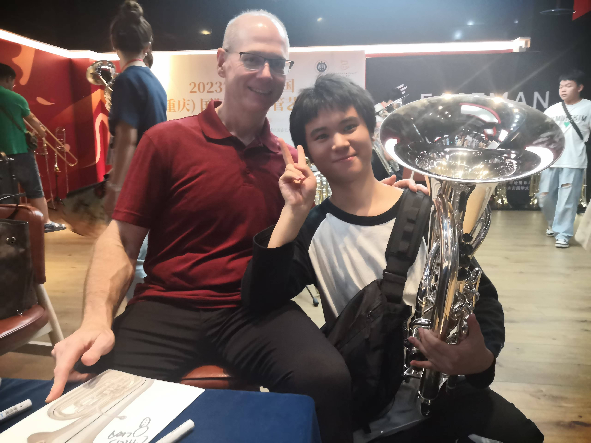

<!--
  墨海寻珠 · 首页（v2 雨天便利店街角：亮色=白天雨天，暗色=夜晚雨天）
  内容层：docs/index.md ｜ 视觉层：docs/stylesheets/extra.css
  交互层：docs/javascripts/homepage.js ｜ 背景场景：docs/javascripts/three/convenience-scene.mjs
  设计文档：.documents/首页设计方案合集.md
  结构口径：首屏只有「墨海寻珠」四字；全页无按钮；照片统一集中在「关于我」的相册里。
-->

<!--
  背景层 · 雨天街角（固定，不参与滚动；Three.js 场景从这里接管）
  import map 指向仓库内 vendored 的 three@0.160.0；convenience-scene.mjs
  正常情况下用裸标识符 "three" 加载，因此运行时不请求任何 CDN。
  路由与阶段说明见 .documents/首页设计方案合集.md 第 13 / 14.2 节。
-->

<!-- 场景画布本身带 role="img" + aria-label（设计文档 §12），因此这一层不再整体 aria-hidden -->

  

  

  

  

  

  <!-- ================= 00 · 封面（只保留标题） ================= -->
  <section class="nmd-chapter nmd-chapter-cover" data-scene="cover" aria-label="墨海寻珠">
    <h1 class="nmd-cover-title">墨海寻珠</h1>
  </section>

  <!-- ================= 01 · 项目缘起 ================= -->
  <section class="nmd-chapter" id="nmd-intro" data-scene="intro" aria-labelledby="nmd-intro-title">
    
01 · 缘起

    <h2 class="nmd-chapter-title" id="nmd-intro-title">项目缘起</h2>
    
在知识的海洋里，挖掘每一颗智慧的明珠 🦪

    

      

        

          墨海
          
指代知识像海洋一样深广无边

        

        

          寻珠
          
寓意在其中探寻珍贵的智慧结晶

        

      

      
不断深入学习，在知识的海洋里挖掘更多的宝藏 —— 这便是此项目对我的意义：<strong>百益而无一害</strong>。

    

    

      

        🌊
        <h3>组织见识</h3>
        
通过构建本项目，将我的见识进行有效地组织，收获到宝贵的学习经验。

      

      

        🤝
        <h3>分享知识</h3>
        
将所学到的知识分享给大家，为更多的人带来帮助，一起进步。

      

      

        🌤️
        <h3>仰望天空</h3>
        
不想只做一个埋头苦读、一味追求成绩的人。撰写之余抬头看看天，岂不乐哉。

      

    

    
📝 本项目开始撰写于 2025 年 1 月 15 日。希望在未来的时间里，我能够孜孜不倦地学习，努力让自己的能力更上一层楼。

  </section>

  <!-- ================= 02 · 关于我（个人信息标签 + 文字 + 相册） ================= -->
  <section class="nmd-chapter" id="nmd-about" data-scene="about" aria-labelledby="nmd-about-title">
    
02 · 关于我

    <h2 class="nmd-chapter-title" id="nmd-about-title">关于我</h2>

    

      🎓 北京邮电大学
      📊 数据科学与大数据技术
      📖 始于 2025.1.15
      🎺 上低音号 · 9 年
      🏐 排球 · 羽毛球
    

    

      
👋 你好呀

      
我的家乡来自<strong>重庆</strong>，现在<strong>北京</strong>学习生活。我的性格比较开朗，心思比较细腻，也比较乐于助人。平日里喜欢热闹的场景，时不时会想给自己找点乐子。兴趣爱好算是广泛，但真正深入的并不是很多。

      
🎬 兴趣爱好

      
看电影都是在电脑上看，鲜有去影院的；电视剧主要看美剧和日韩剧，国产剧不太符合口味；听歌口味比较杂，欧美、日韩、华语都有接触，不过不追星。

      

        🎮 单机游戏 · 缺氧 / 泰拉瑞亚
        🎬 电影（电脑党）
        📺 美剧 · 日韩剧
        🏐 排球 · 羽毛球
        🏊 自学蛙泳中
        🎧 欧美 · 日韩 · 华语
      

      
🏐 运动日常

      
运动方面会打排球和羽毛球——羽毛球是小学时和家人朋友打着玩学会的，排球则是高二时体育老师教的，至今仍很感激他。蛙泳还在自学，尚未完全掌握。

      
🎺 一门特长：上低音号

      
小学五年级开始学习，至今差不多 9 年。参加大大小小的比赛不胜枚举，上大学前一年会参加 2~3 次。起初我并不喜欢它——又重，音色也不太行；但我不喜欢放弃，坚持下来后慢慢也就喜欢上了。希望未来还是能多练练乐器，不至于荒废。

    

    

      <figure class="nmd-gallery-slide">
        
      </figure>
      <figure class="nmd-gallery-slide">
        
      </figure>
      <figure class="nmd-gallery-slide">
        
        <figcaption>与大师合影</figcaption>
      </figure>
      <figure class="nmd-gallery-slide nmd-gallery-slide--tall">
        
      </figure>
      <figure class="nmd-gallery-slide nmd-gallery-slide--tall">
        
        <figcaption>获奖证书</figcaption>
      </figure>
    

  </section>

  <!-- ================= 03 · 学历信息 ================= -->
  <section class="nmd-chapter" id="nmd-journey" data-scene="journey" aria-labelledby="nmd-journey-title">
    
03 · 旅程

    <h2 class="nmd-chapter-title" id="nmd-journey-title">学历信息</h2>

    <ol class="nmd-timeline">
      <li class="nmd-tl-item">
        

          2011.9 — 2017.6
          <h3>重庆市沙坪坝区育英小学</h3>
          
小学

        

      </li>
      <li class="nmd-tl-item">
        

          2017.9 — 2020.6
          <h3>重庆市渝北区重庆一中寄宿学校</h3>
          
初中

        

      </li>
      <li class="nmd-tl-item">
        

          2020.9 — 2023.6
          <h3>重庆市沙坪坝区重庆市第一中学校</h3>
          
高中

        

      </li>
      <li class="nmd-tl-item">
        

          2023.9 — 2025.1
          <h3>北京邮电大学 · 计算机学院（国家示范性软件学院）</h3>
          
计算机类 · 大学

        

      </li>
      <li class="nmd-tl-item current">
        

          2025.2 — 至今
          <h3>北京邮电大学 · 计算机学院（国家示范性软件学院）进行中</h3>
          
数据科学与大数据技术 · 大学

        

      </li>
    </ol>
  </section>

  <!-- ================= 04 · 尾声 ================= -->
  <section class="nmd-chapter nmd-chapter-closing" id="nmd-closing" data-scene="closing" aria-labelledby="nmd-closing-title">
    
04 · 尾声

    

      <h2 id="nmd-closing-title">愿与君同行，寻珠共拾</h2>
      
最后，欢迎大家与我交流。祝愿读到这些文字的伙伴朋友能够从中有所收获，享受学习带来的快乐 —— <strong>加油！</strong>

    

    <!-- 交互提示放在内容层，不进入 3D 画面（设计文档 §6.3：场景内不画任何 HUD） -->
    

      🖐 按住 Alt / Shift，拖动可转动模型，滚轮可拉近拉远。
      🖐 单指横向拖动可转动模型，双指可拉近拉远。
    

  </section>

