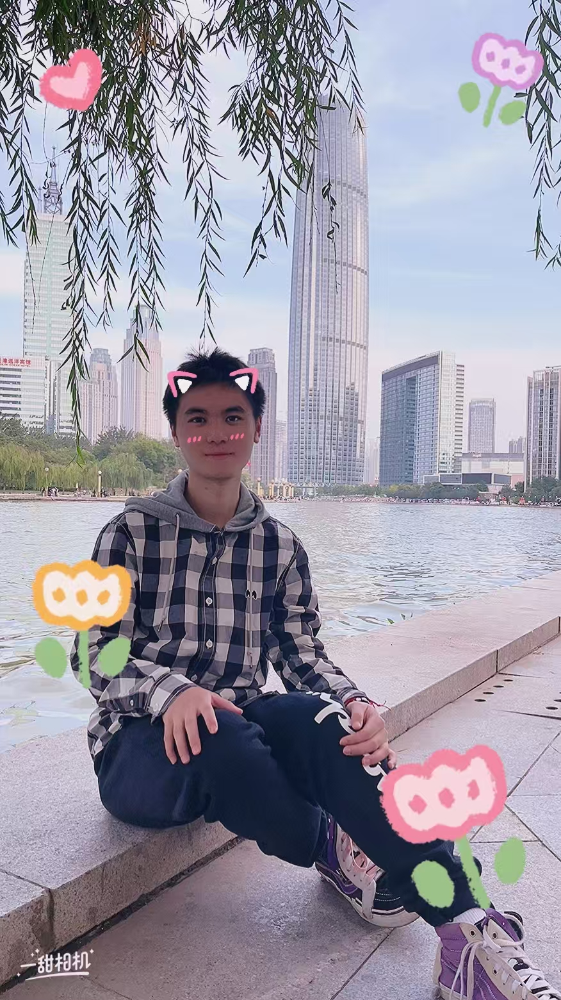
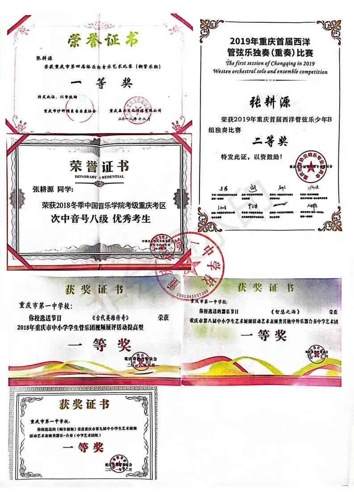
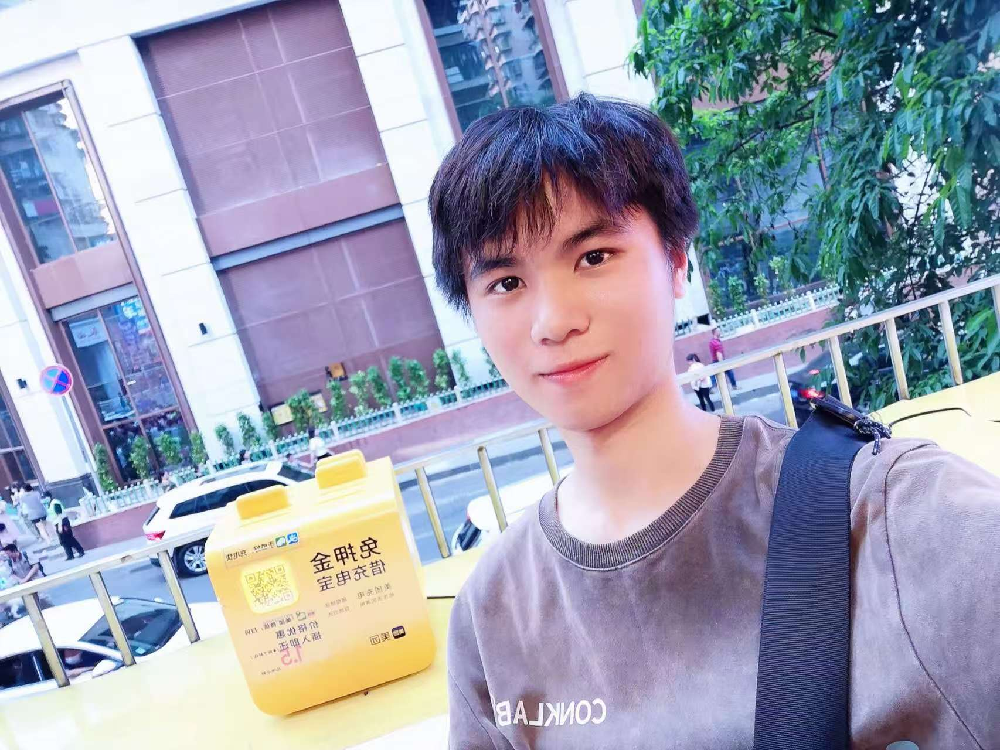

<!-- 墨海寻珠首页 · 自定义分块设计（样式: stylesheets/extra.css · 交互: javascripts/homepage.js） -->

<!-- ================= BLOCK 1 · HERO ================= -->
<section class="nmd-hero nmd-reveal" id="nmd-top" aria-label="墨海寻珠 欢迎页">
  

    
    
    
    
  

  

    

      
    

    
MY LEARNING NOTES

    <h1 class="nmd-hero-title">墨海寻珠</h1>
    

    

      🎓 北京邮电大学
      📊 数据科学与大数据技术
      📖 始于 2025.1.15
      🎺 上低音号 · 9 年
      🏐 排球 · 羽毛球
    

    

      <a class="nmd-btn nmd-btn-primary" href="读书笔记/">开始阅读 →</a>
      <a class="nmd-btn nmd-btn-ghost" href="#nmd-about">关于我</a>
    

  

  
↓

</section>

<!-- ================= BLOCK 2 · 项目缘起 ================= -->
<section class="nmd-block nmd-reveal" id="nmd-intro" aria-label="项目缘起">
  <h2 class="nmd-title">项目缘起</h2>
  <blockquote class="nmd-quote">
    项目取名为<mark><strong>墨海寻珠</strong></mark>：“墨海”指代知识像海洋一样深广无边，
    “寻珠”寓意在其中探寻珍贵的智慧结晶。不断深入学习，在知识的海洋里挖掘更多的宝藏 ——
    这便是此项目对我的意义：<strong>百益而无一害</strong>。
  </blockquote>
  

    

      🌊
      <h3>组织见识</h3>
      
通过构建本项目，将我的见识进行有效地组织，收获到宝贵的学习经验。

    

    

      🤝
      <h3>分享知识</h3>
      
将所学到的知识分享给大家，为更多的人带来帮助，一起进步。

    

    

      🌤️
      <h3>仰望天空</h3>
      
不想只做一个埋头苦读、一味追求成绩的人。撰写之余抬头看看天，岂不乐哉。

    

  

  
📝 本项目开始撰写于 2025 年 1 月 15 日。希望在未来的时间里，我能够孜孜不倦地学习，努力让自己的能力更上一层楼。

</section>

<!-- ================= BLOCK 3 · 关于我 ================= -->
<section class="nmd-block nmd-reveal" id="nmd-about" aria-label="关于我">
  <h2 class="nmd-title">关于我</h2>
  

    

      <figure class="nmd-photo nmd-photo-1"></figure>
      <figure class="nmd-photo nmd-photo-2"></figure>
      <figure class="nmd-photo nmd-photo-3"></figure>
      <figure class="nmd-photo nmd-photo-4"></figure>
    

    

      
我的家乡来自<strong>重庆</strong>，现在<strong>北京</strong>学习生活。我的性格比较开朗，心思比较细腻，也比较乐于助人。平日里喜欢热闹的场景，时不时会想给自己找点乐子。兴趣爱好算是广泛，但真正深入的并不是很多。

      

        🎮 单机游戏 · 缺氧 / 泰拉瑞亚
        🎬 电影（电脑党）
        📺 美剧 · 日韩剧
        🏐 排球 · 羽毛球
        🏊 自学蛙泳中
        🎧 欧美 · 日韩 · 华语
      

      
看电影都是在电脑上看，鲜有去影院的；电视剧主要看美剧和日韩剧，国产剧不太符合口味；听歌口味比较杂，欧美、日韩、华语都有接触，不过不追星。运动方面会打排球和羽毛球——羽毛球是小学时和家人朋友打着玩学会的，排球则是高二时体育老师教的，至今仍很感激他。蛙泳还在自学，尚未完全掌握。

      

        <h3>🎺 一门特长：上低音号</h3>
        
小学五年级开始学习，至今差不多 9 年。参加大大小小的比赛不胜枚举，上大学前一年会参加 2~3 次。起初我并不喜欢它——又重，音色也不太行；但我不喜欢放弃，坚持下来后慢慢也就喜欢上了。希望未来还是能多练练乐器，不至于荒废。

      

    

  

</section>

<!-- ================= BLOCK 4 · 学历信息 ================= -->
<section class="nmd-block nmd-reveal" id="nmd-journey" aria-label="学历信息">
  <h2 class="nmd-title">学历信息</h2>
  <ol class="nmd-timeline">
    <li class="nmd-tl-item">
      

        2011.9 — 2017.6
        <h3>重庆市沙坪坝区育英小学</h3>
        
小学

      

    </li>
    <li class="nmd-tl-item">
      

        2017.9 — 2020.6
        <h3>重庆市渝北区重庆一中寄宿学校</h3>
        
初中

      

    </li>
    <li class="nmd-tl-item">
      

        2020.9 — 2023.6
        <h3>重庆市沙坪坝区重庆市第一中学校</h3>
        
高中

      

    </li>
    <li class="nmd-tl-item">
      

        2023.9 — 2025.1
        <h3>北京邮电大学 · 计算机学院（国家示范性软件学院）</h3>
        
计算机类 · 大学

      

    </li>
    <li class="nmd-tl-item current">
      

        2025.2 — 至今
        <h3>北京邮电大学 · 计算机学院（国家示范性软件学院）进行中</h3>
        
数据科学与大数据技术 · 大学

      

    </li>
  </ol>
</section>

<!-- ================= BLOCK 5 · 寄语收尾 ================= -->
<section class="nmd-block nmd-reveal" id="nmd-closing" aria-label="寄语与交流">
  

    <h2>愿与君同行，寻珠共拾</h2>
    
最后，欢迎大家与我交流。祝愿读到这些文字的伙伴朋友能够从中有所收获，享受学习带来的快乐 —— <strong>加油！</strong>

    <a class="nmd-btn nmd-btn-primary" href="#nmd-top">回到顶部 ↑</a>
  

</section>
