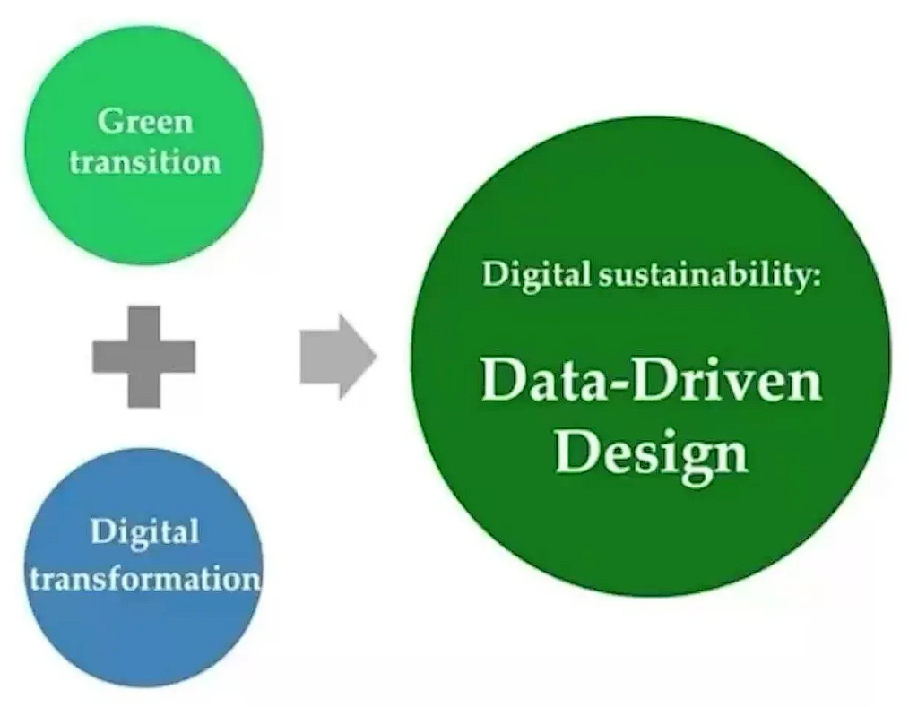
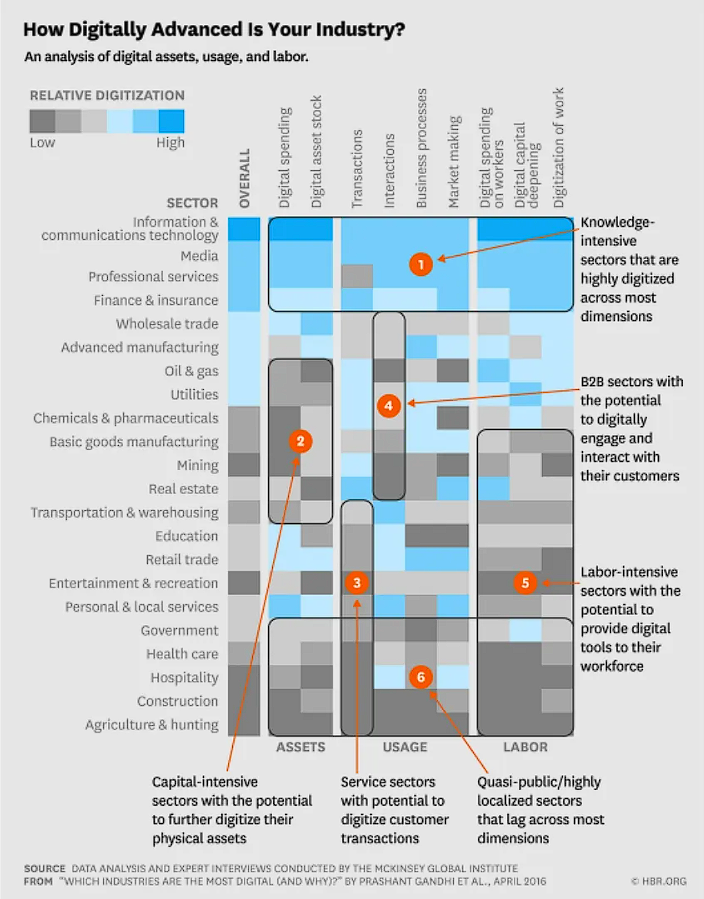

# Fourth Class: 模块一数字经济与智能金融导读
1. Digital economy 数字经济
    - 通过电子商务进行商品和服务贸易的经济活动。(OECD的定义)
    - 数字经济可分解为数字服务+数字商品贸易
    - “数字经济”一词可以追溯到上世纪90年代，当时互联网还是模拟产品和服务的附加产品。当时的焦点是新兴的数字渠道如何在更广泛的经济中影响消费者和企业。今天，数字经济本质上是指发生在网上的任何经济活动。本质上是一个数据驱动的经济，通过收集、使用和分析大量机器可读信息的能力来提供更个性化和有意义的体验。
    - 特点：数据驱动；移动性/流动性高；结合人类和机器的优点；连通性强；不断演化
2. e-commerce 电子商务
    - 电子商务是指在互联网上商品和服务的交易行为
    - 通过电脑、平板电脑、智能手机和其他智能设备进行
    - 如今几乎任何东西都可以通过电子商务购买，这使得电子商务竞争非常激烈
    - 对实体店有一定替代性，尽管一些企业选择同时保留网店和实体店
    - 电子商务在多个细分市场运营，包括企业对企业(B2B)、企业对消费者(B2C)、消费者对消费者(C2C)和消费者对企业(C2B)
3. business agility 业务敏捷性
    - 指的是为了获得和保持竞争优势而进行的快速、持续和系统的进化适应和企业创新。
    - 业务敏捷可以通过维护和调整商品和服务来满足客户需求，通过利用可用的人力资源来适应业务环境中的市场变化。
    - 是`对外`界变化的积极响应
4. business resilience 业务弹性/业务韧性
    - 指的是一个组织快速适应中断的能力，同时能够保持持续的业务运营，并保护员工以及品牌价值。
    - 为了在业务中建立和保持韧性，必须尽量减少不利因素，同时保持对可能出现在业务中的机会采取行动的能力。
    - 业务韧性包括财务、运营、战略和心理因素。
    - 是一种`内在`的特质。
5. UX & CX 用户体验和客户体验

6. Visual collaboration 视觉协作/可视化协作
    - 视觉协作由一系列相互关联的活动组成——从头脑风暴到绘制流程图、图表系统等等——将企业引向不断的创新。通过使用视觉效果，负责不同业务的团队可以有效地交流复杂的想法，并进行异步(不同时的)和实时的协作(通常是在一个无限可扩展的共享数字画布上)。
## 什么是数字经济?
### *Digital economy*
- 数字经济最重要的定义之一来自于经济合作与发展组织(OECD)，该组织每年或每六个月给出一些与世界经济有关的统计数据。
- 经合组织将*数字经济*(也就是学术界所说的互联网经济)定义为，通过互联网上的电子商务进行商品和服务贸易的那一部分经济活动。
- 值得注意的是，一些软件和游戏产品通过CD等实体商品销售，但它们仍然属于数字经济。这些游戏产品尽管是以一些实体的硬件作为载体，比如台式电脑、笔记本电脑、游戏机和游戏卡带，但它们仍然属于数字经济，因为它们产生了数字价值、数字产品和数字产出。
- *电子商务交易*是指在计算机网络上通过专门为接收或下订单而设计的渠道进行的商品和服务的销售或购买活动。任何类型的电子商务应用，比如阿里巴巴，亚马逊，Shopify，Groupon等国内外不同的电子商务平台，这些都是在线零售平台。
### *Digitalization in business*
- 商业中的数字化是指利用数字技术改变商业模式，通过价值创造机会 (value creating opportunities) 创造新的价值和收益。
## 数字经济发展现状
### *The developement of digital economy*
- 数字技术的发展速度比人类历史上任何创新都要快，仅在20年内就覆盖了全球约50%的人口，并对社会产生了重大影响。(UN report)
- 通过加强互联互通、金融包容性、贸易准入和公共服务，数字技术可以成为弥合各国发展差距的重要的均衡器。
### *The size of digital economy*
- 2021年，全球GDP达到了99.4万亿美元。
    - 数字经济的份额为14.2万亿美元，大约是全球GDP的15.5%，比过去15年全球GDP增长速度快2.5倍。
    - 2021年，全球电商销售额达到4.9万亿美元；根据预测，这个数字在未来四年还会增长50%，到2025年将达到7.4万亿美元。
### *Breakdown of digital economy*

### *Terminology*
- 业务敏捷性 Business agility
    - 指的是为了获得和保持竞争优势而进行的快速、持续和系统的进化适应和企业创新。
    - 营运敏捷可以通过维护和调整商品和服务来满足客户需求，通过利用可用的人力资源来适应业务环境中的市场变化。
- 业务韧性 Business resilience
    - 指的是一个组织快速适应中断的能力，同时能够保持持续的业务运营，并保护员工以及整体品牌的资产。
    - 为了在业务中建立和保持韧性，必须尽量减少不利因素(minimize the downside)，同时保持对可能出现在业务中的机会采取行动的能力。
    - 业务韧性包括财务、运营、战略和心理因素。
### *What happens in one minute in the world?*、

### *Data growth signs for digital economy*

### *波特五力分析模型*

**数字化迈克尔·波特的价值链分析模型**
*一、支持性活动*

首先，有关企业的基础设施方面，数字化的董事会能够实时提供销售预测和股票估值；

第二，关于人力资源管理，AI赋能的人才识别技术可以在某种程度上替代传统的人力管理方式；

第三是关于技术研发的部分，这里提到的数字孪生(Digital Twins)是充分利用物理模型、传感器更新运行历史等数据，集成多学科、多物理量、多尺度、多概率的仿真过程，在虚拟空间中完成映射，从而反映相对应的实体装备的全生命周期过程，是产品的虚拟再现;另外还提到了基于云的PLM这个概念。PLM是Product Lifecycle Management，产品生命周期管理。基于云的PLM意味着供应商直接在云中构建PLM应用程序，在这种模式下，每个客户端共享软件应用程序、单个数据库和服务器。但是，每个客户机的数据是隔离的，对其他客户机不可见；

第四是在采购环节引入区块链的概念。区块链技术是一种不依赖第三方、通过自身分布式节点进行网络数据的存储、验证、传递和交流的一种技术方案。区块链使得在整个采购-支付链中能够轻松地分配身份验证权，从而预防欺诈并增加采购到支付(PTP)过程中的保护。

*二、基本活动*

在进料后勤环节，引入无线射频识别组件跟踪的技术，并进行数据收集；

在生产环节，利用云ERP技术，云ERP是一种运行在供应商云计算平台上的企业资源规划软件，而不是运行在企业自己的数据中心;还可以引入自动化生产技术;还有一种叫Cobots的新兴技术，也就是协同机器人这些机器人具有协作性是因为它们可以安全地与人类一起工作。他们可以这样做，因为他们配备了灵敏的传感器，使机器人仿佛是有了“感觉”；

在发货后勤环节，利用仓库无人机或机器人；

在市场营销和销售环节，利用广告技术，VR购物，VR产品展示，还有AI赋能的需求预测；

在售后服务环节，可以引入机器人客服。
## 企业数字化转型
*企业进行数字化转型的原则、流程;数字化转型的几大趋势;如何将数字化概念融入到波特价值链分析模型中;第四次工业革命企业进行数字化转型的原则、流程;数字化转型的几大趋势;如何将数字化概念融入到波特价值链分析模型中;第四次工业革命*

### *Michael Porter's Five Forces Model*
## Case study
**The Miracle of Amazon's Digital Supply Chain**

**7 digital transformation trends**
1. 数字化转型的加速发展
2. 首席信息官 CIO 作用的提升
3. 更加关注用户体验(UX)和客户体验(CX)
4. 灵活的工作流程
5. 可视化协作
6. 小企业的崛起
7. 持续进行的技术栈(tech stack)评估
## 数字可持续性
### *The five dimensions of digital sustainability*

**数字化与可持续发展结合的亮点**

- 未来几年的可持续发展将极大地利用数字化
- 物联网是可持续粮食生产和地球健康的重要工具
- 人工智能可以优化能源生产和水处理
- 智能技术可以提供平等获得服务的机会，增进福祉
- 数字化可以指导应对气候变化和保护生物多样性的行动

**Pros & Cons of digital economy**
|Pros|Cons|
|---|---|
|更多的信息和选择|科技巨头的垄断力量|
|节省时间|更少的社区
|业务成本下降|技术的成瘾性|
|更低的准入门槛|隐私问题|
**Impact of digital economy on GDP impact**

- 由于数字技术具有扩大市场准入和机会的潜力，帮助各国投资于数字发展成为了世界银行减少贫困和不平等举措的重要方面。
- 据统计，数字经济相当于全球GDP的15.5%;数字经济的发展比全球GDP在过去15年间的增长速度快2.5倍。
- 研究表明，非洲的移动宽带普及率每增加10%，人均GDP就会增加2.5%
- 在后疫情时代，全球范围内的数字化工作将加速，但大多数发展中国家目前没有适当的工具和环境。

**Critical implications of digital economy**

- 从宏观上看，数字经济通过影响生产投入和产出效率来影响经济发展，具体表现为技术进步和技术溢出带来的要素投入增加、要素配置效率提高以及全要素生产率提高；
- 对于发展中国家来说，数字化被认为是经济增长的主要动力。它提高了资本和劳动生产率，降低了交易成本，促进了各国融入全球市场体系；
- 对于发达国家来说，数字经济对经济发展质量的影响主要体现在促进可持续发展和提高企业敏捷性方面。2004年至2012年，数字经济是美国经济增长的主要动力。其生产部门的自主研发投入和技术进步对全要素生产率增长具有显著的正向影响；
- 信息化对经合组织12个主要国家的全要素生产率增长具有重要的促进作用。2009-2018年欧盟15个发达经济体的数据显示，国家和行业的数字化政策能够显著促进经济增长。

**What's different today**

- 疫情到来时，许多组织争相确保员工的健康和安全，同时建设支持远程工作的基础设施。为了保持业务连续性，各家公司拼凑出解决方案，临时措施成为主流。
- 现在，这种情况在很大程度上已经结束--就数字化转型而言，**疫情还成为了推动变革的催化剂**。
- Celerity and Randstad US 的问卷调查支持了这一说法
    - 63%的公司领导表示，新冠肺炎让他们的组织比预期更快地拥抱数字化转型；
    - 63%的受访者表示，由于疫情影响，他们正在加大技术投资；
    - 49%的受访者表示，数字化转型之前并不是其战略组成部分的重要组成部分但疫情后它成为了策略中最重要的一部分。

## Project题目讨论
Please apply an appropriate business strategy model to analyze one following topic, you could use real world examples to write at lease 1000 words essay.

1) Choose a particular area in the world of digital economy (innovation, technological products, changing workforce characteristics, monetary values and currencies, socio-economic systems...etc.)

2) Analyze current trends in that area especially from a digital economy perspective Ad Words, match types, paid search...

3) Make predictions related to that area with certain applicable components (as an example, how will the logistics landscape might be shaped in the future and what might specifically change in terms of shipment, trade...etc. or how might the workforce transform and in what ways so we can see the creation of new lines of jobs in certain industries...etc.)