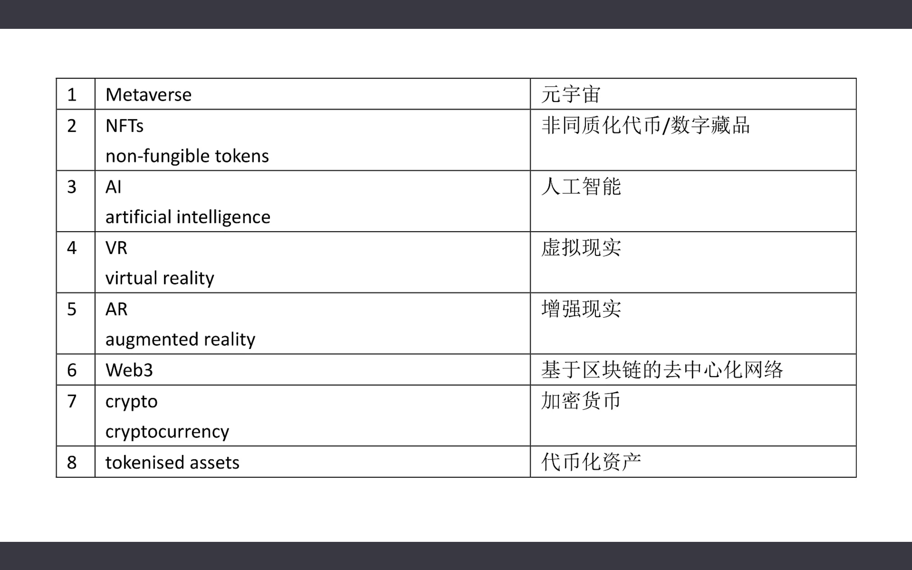
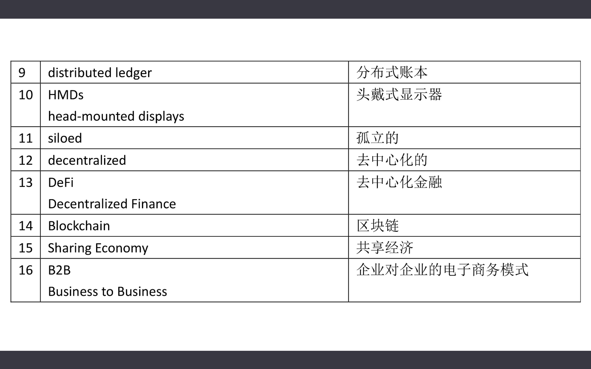
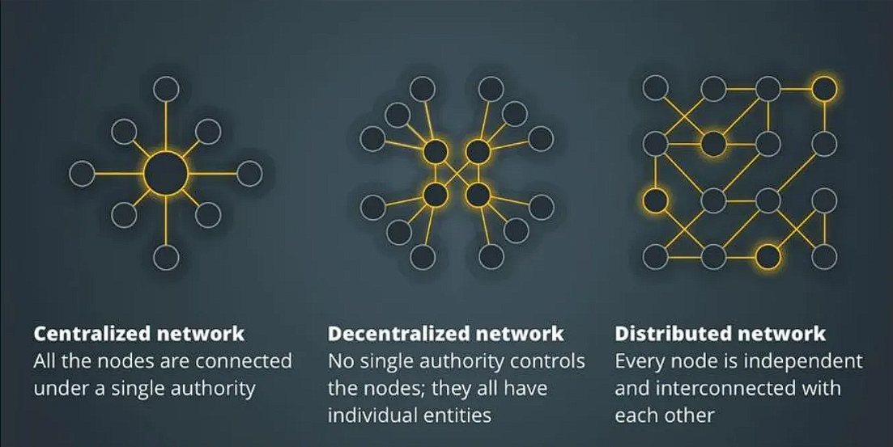
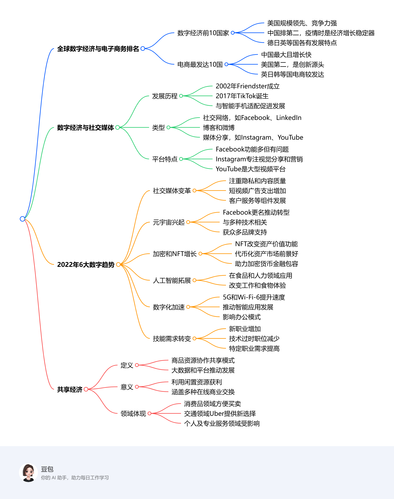

# Ninth Class: 世界数字经济排名、社交媒体与共享经济
## 基础概念

### NFT 非同质化代币
- NFT 是区块链上的加密资产（cryptographic asset），具有唯一的标识码和元数据（metadata），将它们彼此区分。
    - 它并不是资产本身，而是一种“数字凭证”。
    - 与加密货币（cryptocurrencies）不同，NFT 不能以等值进行交易或交换。
- 可以表示/标识数字或现实世界的标的物，如艺术品和房地产。将这些真实世界的有形资产“代币化”，使买卖和交易更高效，同时降低欺诈的可能性。
    - 应用：数字防伪

### tokenised assets 代币化资产
- 代币化资产是基于分布式账本技术创建的数字代币，其中每个发行的代币代表底层的传统资产。这种潜在资产几乎可以是任何东西——从黄金或交易卡等实物资产到流行歌曲或虚拟艺术品等数字资产。
- 代币化使以前缺乏流动性的资产能够更容易和更有效地进行交易。

### cryptocurrency 加密货币
- 一种由密码学保护的数字或虚拟货币，基于分布在大量计算机上的网络。这种分布式的结构使它们能够在政府和中央机构的控制之外存在。
    - 比特币是第一个去中心化的加密货币。
- 加密货币的优势：更便宜、更迅速的资金转移和去中心化的系统，这种系统不会在单点故障时崩溃。
- 加密货币的缺点：剧烈的价格波动，挖矿的高能耗以及在犯罪活动中的使用。

### distributed ledger 分布式账本
- 分布式账本是跨多个站点、机构或地理区域共享和同步的数据库，可由多人访问。
- 它允许交易有公开的“见证者”。网络的每个节点上的参与者都可以访问在该网络上共享的记录，并可以拥有它的相同副本。
- 分布式账本技术的使用可以减少网络攻击和金融欺诈。 

## 全球数字经济与相关领域发展综述
### 一、全球数字经济与电子商务排名
#### （一）数字经济排名前10的国家
数字经济依托数字技术，广泛涉及全球经济活动。美国数字经济规模居世界首位，且数字竞争力最强；中国以5.4万亿美元位列第二，在疫情期间成为经济增长的关键支撑，数字创新催生诸多新商业模式。德国、日本、英国等国也处于前列，各国数字经济发展各具特色。具体数据如下：

1. **美国**：规模达13.6万亿美元，占美国GDP的8%，对劳动生产率增长贡献率达86%。
2. **中国**：价值5.4万亿美元，规模39.2万亿元，占GDP的38.6%。
3. **德国**：规模2.54万亿美元，2021年电子商务 - 电子与媒体收入份额达21.2% 。
4. **日本**：规模2.48万亿美元，拥有教育、工业等优势，但生产率面临挑战，独角兽初创企业较少。
5. **英国**：规模1.79万亿美元，是高度发达的社会和市场经济，数字产业部分子行业企业众多。
6. **法国**：规模1.19万亿美元，积极迎接新数字经济机遇，2019年电子消费增长，政府有创新投资计划。
7. **韩国**：规模8478亿美元，是5G技术先驱，通过“数字新政”拓展优势，初创企业对东南亚关注度上升。
8. **印度**：规模5149亿美元，互联网用户增长迅速，是增长快速的数字消费市场，政府与私营部门共同推动数字化。
9. **加拿大**：规模4365亿美元，数字经济就业人数有变化，过去十年增长速度高于总体经济，政府在多领域投资。
10. **意大利**：规模3775亿美元，政府积极推动创新和技术发展，推出相关基金用于技术转让和科研。
#### （二）全球电子商务最发达的十个国家
中国是全球最大且增长迅速的电商市场；美国为第二大电商市场；英国、日本、韩国等国在电商领域也成绩突出，各国电商销售额、占比及主导企业存在差异。具体数据如下：

1. **中国**：全球最大电商市场，年增长率21%，年在线销售额2.78万亿美元 ，电商销售额占总销售额的比例为52%。
2. **美国**：第二大电商市场，年在线销售额8430亿美元，电商销售额占总销售额的比例为19%。
3. **英国**：重要电商国家，年在线销售额1690亿美元，电商销售额占总销售额的比例为4.8%。
4. **日本**：全球移动商务领先，年在线销售额1440亿美元，电商销售额占总销售额的比例为3%。
5. **韩国**：拥有快速无线互联网，年在线销售额1200亿美元，电商销售额占总销售额的比例为2.5%。
6. **德国**：欧洲第二大电商市场，年在线销售额1015亿美元，电商销售额占总销售额的比例为2.1%。
7. **法国**：拥有本地电商平台，年在线销售额800亿美元，电商销售额占总销售额的比例为1.6%。
8. **印度**：增长迅速的电商市场，年在线销售额675亿美元，电商销售额占总销售额的比例为1.4%。
9. **加拿大**：电商市场规模大但竞争少，年在线销售额440亿美元，电商销售额占总销售额的比例为1.3%。
10. **西班牙**：三家主要公司主导电商市场，年在线销售额370亿美元，电商销售额占总销售额的比例为0.72%。
### 二、数字经济与社交媒体
#### （一）社交媒体的发展历程
自2002年Friendster成立至2017年TikTok诞生，社交媒体影响力呈指数级增长，与智能手机的适配进一步推动了其发展。
#### （二）社交媒体的类型
包括社交网络（如Facebook、LinkedIn ）、博客和微博、媒体分享（照片分享如Instagram，视频分享如YouTube ）、评分网站、论坛等多种类型。
#### （三）主要社交媒体平台特点
Facebook功能丰富、用户众多但面临一些问题；Instagram专注视觉分享，在社交媒体营销方面效果显著；YouTube是大型视频平台等，各平台都有其独特优势和用户群体。
### 三、2022年6大数字趋势
### （一）社交媒体变革
各平台更加注重隐私和内容质量，会更新隐私政策并调整算法。短视频广告支出将增加，客户服务等营销组件将得到进一步发展。
#### （二）元宇宙兴起
Facebook更名为“Meta”，推动元宇宙转型。元宇宙是虚拟共享空间，与虚拟现实、增强现实等多种技术相关，预计将获得众多品牌的支持。
#### （三）crypto和NFT增长加速
NFT改变了数字资产的价值和功能，代币化资产市场前景广阔，有助于实现加密货币的金融包容性。
#### （四）人工智能拓展应用
人工智能在食品和人力资源服务领域得到应用，将改变人们的工作方式以及与食物相关的体验。
#### （五）数字化转型加速
5G和Wi-Fi - 6提升了连接速度，推动智能城市、物联网等智能应用的发展，也对办公模式产生影响。
#### （六）工作技能需求转变
新职业数量增加，技术过时的职位减少，数据分析师、软件和应用程序开发人员等职业的需求将会提高。
### 四、共享经济
#### （一）共享经济的定义
共享经济是一种商品和资源以协作方式共享的经济模式，大数据和在线平台促进了其发展。
#### （二）共享经济的意义
个人和组织可以利用闲置资源获利，共享经济涵盖多种在线商业交换，包括B2B领域。
#### （三）共享经济在各领域的体现
在消费品领域方便了商品买卖；交通运输领域，Uber等提供了不同于传统交通的新选择；个人及专业服务领域也受到共享经济的影响，医疗保健行业预计将发生变革。 
