# Second Class: PBL教学的常见形式
## One learner-centered method: Proiect-based learning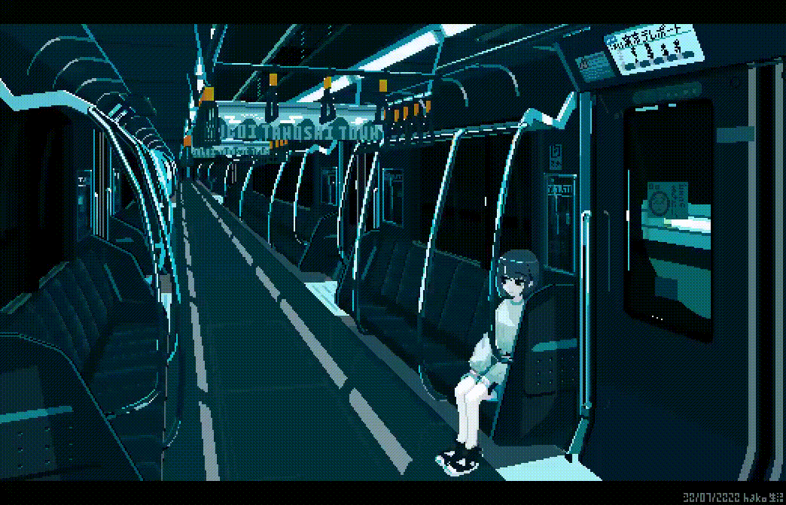{align="right" width="40%"}
$\qquad$Project Based Learning is a teaching method in which students gain knowledge and skills by working for an extended period of time to investigate and respond to anauthentic, engaging, and complex question, problem, or challenge.
## Good teachers probe student thinking
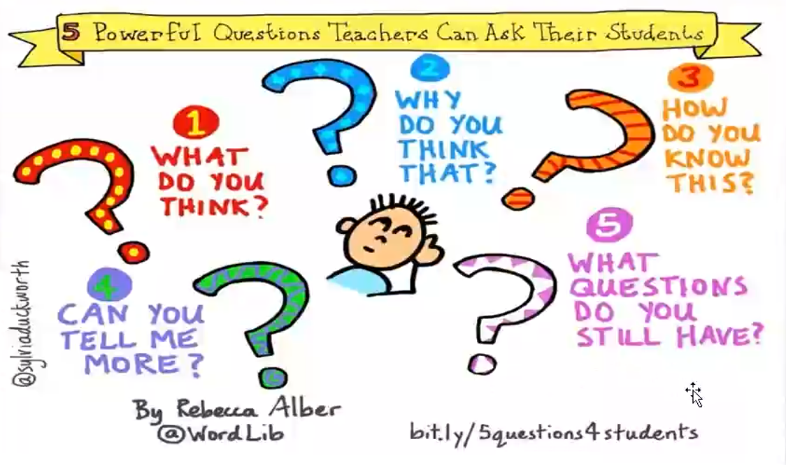
## Project and problem based learning
=== "Begin"
    Students work on a project

    * Over an extended period (from a week up to a semester)
    * That engages them in
        * Solving a real-world problem or
        * Answering a complex question

=== "Then"
    Students demonstrate their knowledge and skills by creating a public product or presentation for real audience

=== "Last"
    Students Develop

    * Deep content knowledge
    * Critical thinking
    * Collaboration
    * Creativity
    * Communication skills

## Project based learning (PBL)

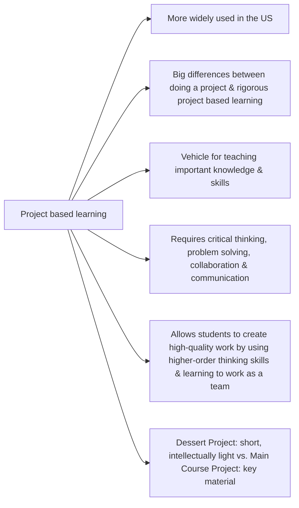
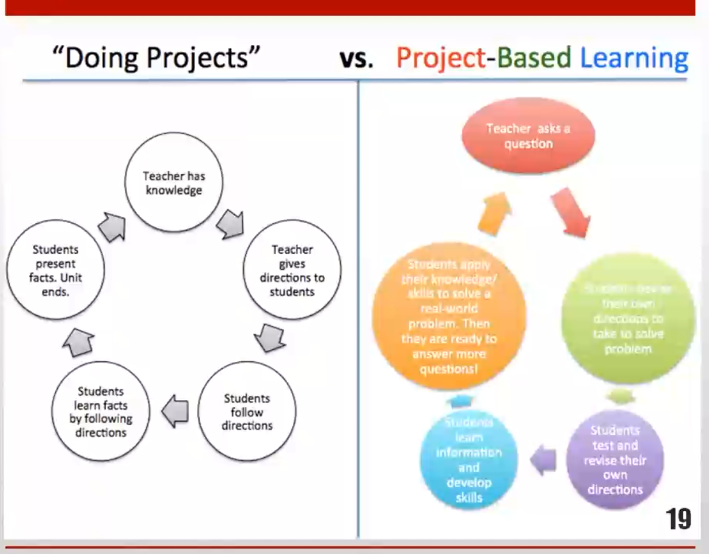
## "Dessert" project vs "main course" project
|DESSERT "DOING A PROJECT"|MAIN COURSE PROJECT BASED LEARNING|
|-|-|
|An add-on to the traditional instruction; at the end (or along side) of the unit|Instruction integrated into the project (The project is the unit!)|
|Follows direction of the teacher|Driven by student inquiry|
|Focused on product|Focused on product and process|
|Often unrelated to standards and skills|Aligned to academic standards and success skills|
|Can be completed alone and/or at home|Involves collaboration with students and in-class guidance from teacher|
|Remains within the school world|Has a real-world context and application|
|End result of project displayed in the classroom|Results of project shared beyond the classroom with a public audience|

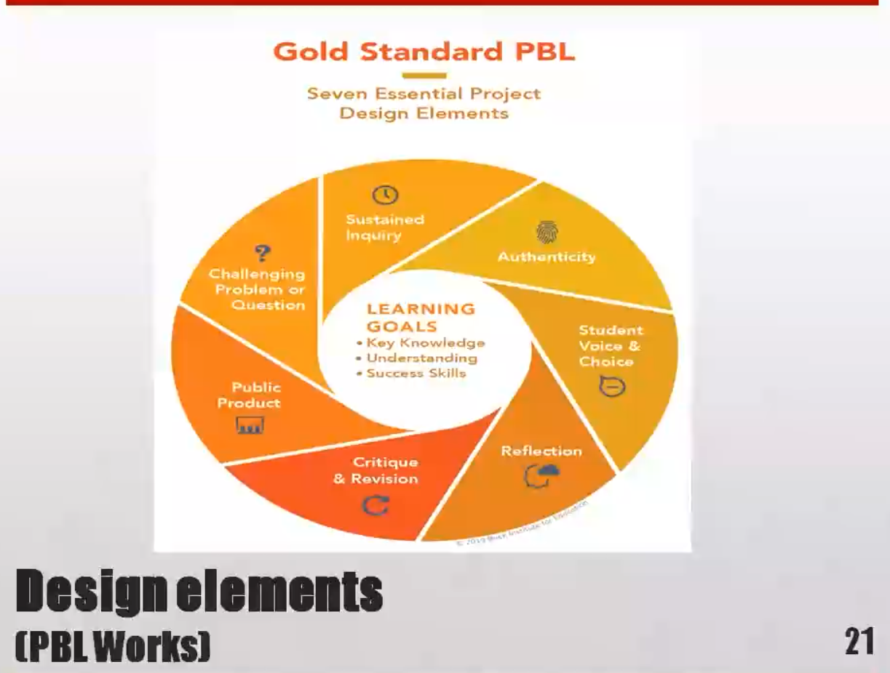

## 1. Challenging problem or question (heart of project)
- Problem to investigate/solve, or question to explore/answer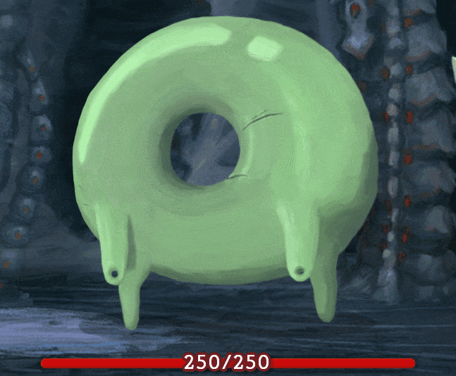{align="right" width="25%"}
    - May be concrete or abstrac
    - A problem or question that is meaningful to students
- So students need to know something to solve problem or answer a question that matters to them
    - Should have more than one right answer
    - Should challenge students without intimidating
- Central problem/question->open-ended, student-friendly "driving question" that focuses research: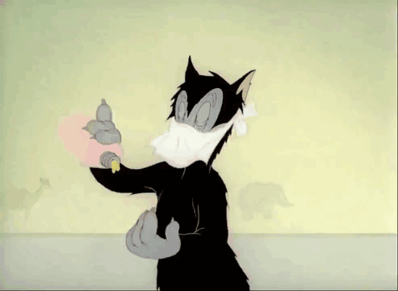{align="right" width="25%"}
    - “How can we improve our school's recycling system, so we can reduce waste?” or
    - “Should the U.S. have fought the Vietnam War?”
## 2. Sustained inquiry (to seek information or investigate)
- More active, in-depth than “looking something up"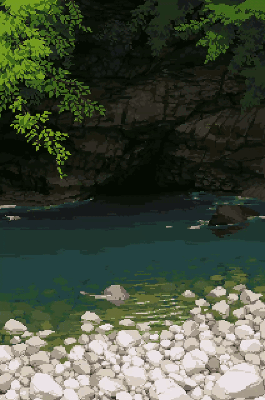{align="right" width="23%"}
- Inquiry process takes time
- Iterative
    - When confronted with challenging problem or question, students ask questions, find resources to help answer them, then ask deeper questions
    - Repeats until a satisfactory solution or answer is developed
- Can incorporate different information sources{align="right" width="35%"}
    - Traditional “research”
    - Real-world, field-based interviews with experts, service providers and users
- Driven by student-generated questions throughout the project
## 3. Authenticity (“real-world" learning or task)
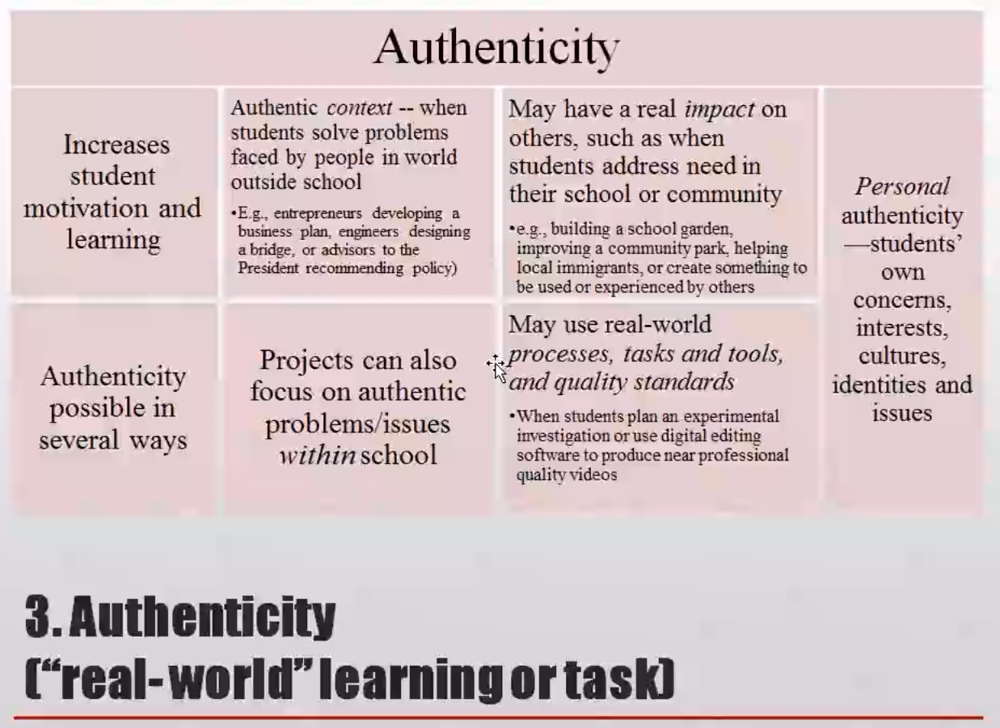
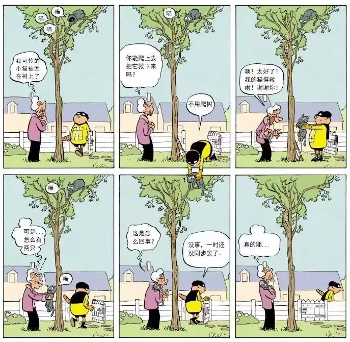{align="left" width="40%"}

* Real-life problems or tasks
* Ill-structured versus well-struetured
* Engages students in same thinking process as experts/professionals
* Personally relevant, meaningful to learner
* Multiple, maybe contradictory, but valid perspectives
* Multiple “good” outcomes
* Social-problem and project
## 4. Student voice and choice (having a say creates ownership)
* Students should be able to make their voices hear{align="right" width="35%"}
    * To speak fireely in class discussions and teamwork
    * To express themselves in products they create
    * Not trying to sound like they think their teacher wants them to
* If students cannot use their judgment, project becomes an exercise in following directions
* Student input and (some) control over
    * Questions they generate
    * Resources to find answers
    * Tasks and roles ofteam members
    * Products they will create
## 5. Reflection
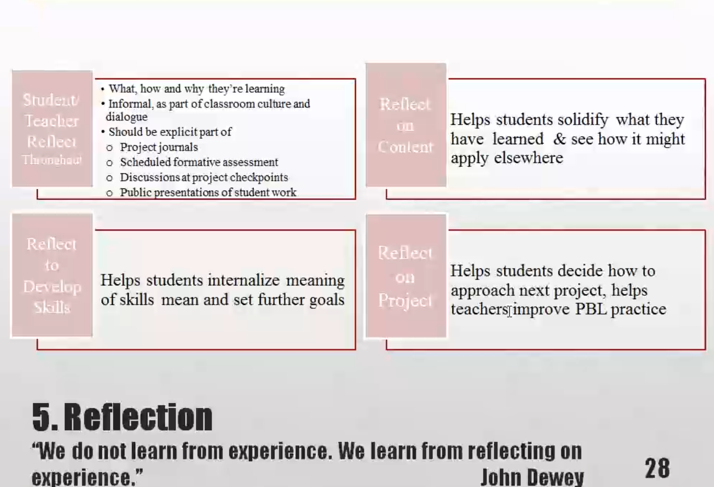
## 6. Critique and revision (to achieve high quality work)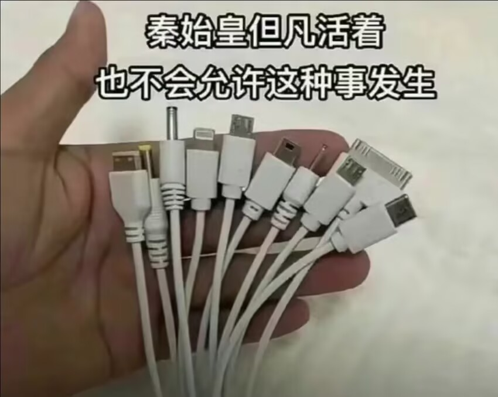{align="right" width="35%"}
* "Formative evaluation"
    * Teachers giving feedback to students
    * Students evaluating each other
    * Students evaluating themselves and results of their learning
* Students should be taught to give and receive constructive peer feedback
    * To improve projeet processes and produets
        * Guided by rubrics, models, and formal feedback/critique protocols
* Outside adults and experts can also contribute, with authentic, real-world point of view
## 7. Public product (back to the real world)
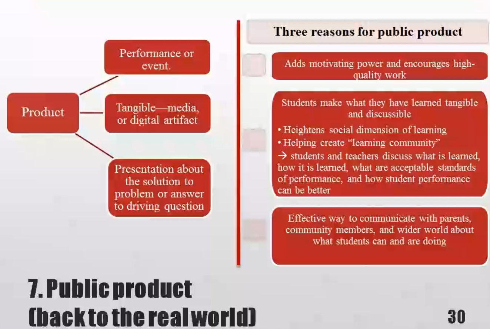
## Collaboration
{align="left" width="35%"}

* Group work
* Peer reviews
* Collaborations with experts
* Negotiations
* Conflict resolution
* Giving and receiving help
* Building communication and management skills
## Teaching practices: Project based learning
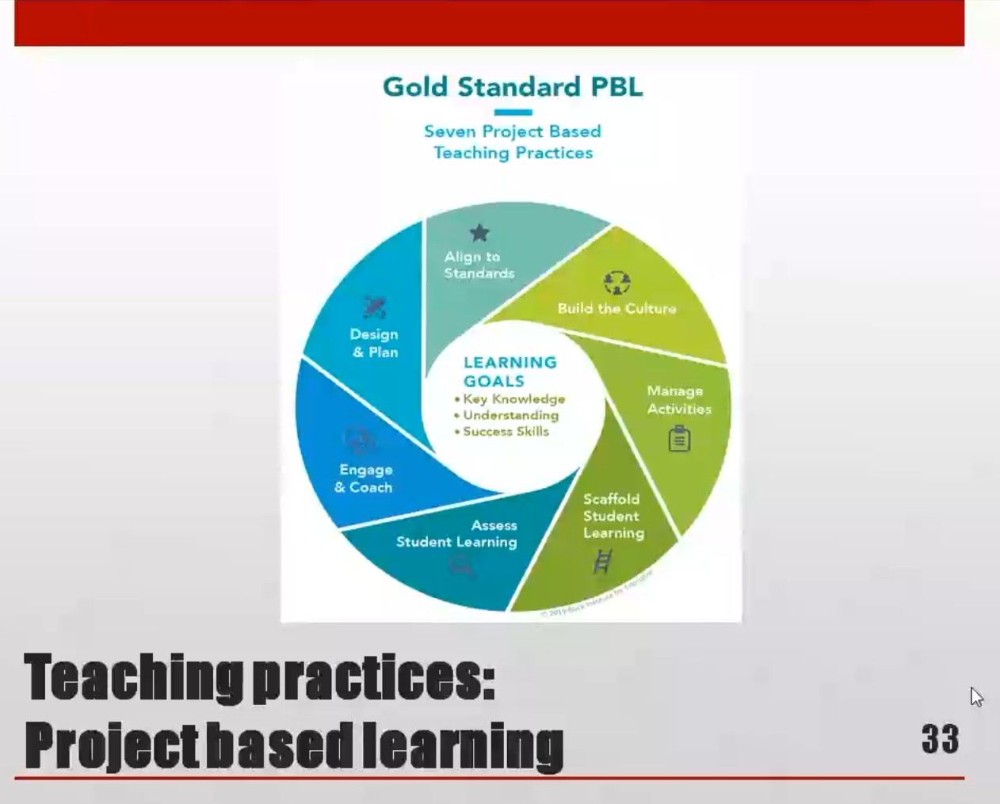
## Teaching for proiect-based learning
* Align to Standards{align="right" width="35%"}
    * Teachers use standards to plan project and make sure it addresses key knowledge and understanding from subject areas
* Build Culture
    * Teachers promote student independence and growth, open-ended inquiry, team spirit, and attention to quality
* Manage Activities
    * Teachers work with students to organize tasks and schedules, set check points and deadlines, find and use resources, create products and make them public
* Scaffold Student Learning
    * Teachers employ a variety of lessons, tools, and instructional strategies to support all students in reaching project goals
* Assess Student Learning{align="right" width="35%"}
    * Teachers use formative and summative assessments of knowledge, understanding, and msuccess skills, and include self and peer assessment of team and individual work
* Engage & Coach
    * Teachers engage students in learning and work alongside them to identify when they need skill-buildig, redirection, encouragement, and celebration
## Facilitation (roles of teacher)
{align="left" width="50%"}

* Modeling
* Coaching
* Scaffolding
* Providing resources
* Appropriate gaps in support
    ->Challenge zone: between comfort zone and panic zone
## Skills acquired in project-based learning

## Steps
