# Seventh Class: 疫情背景下发达国家的数字化转型现状；疫情对发展中国家企业和政策响应的影响
## 基础概念
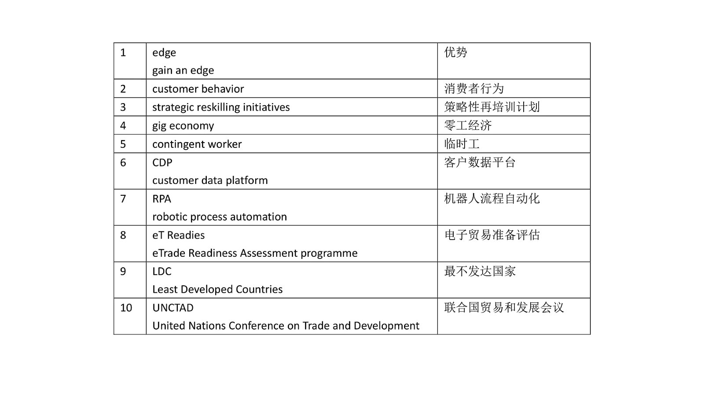
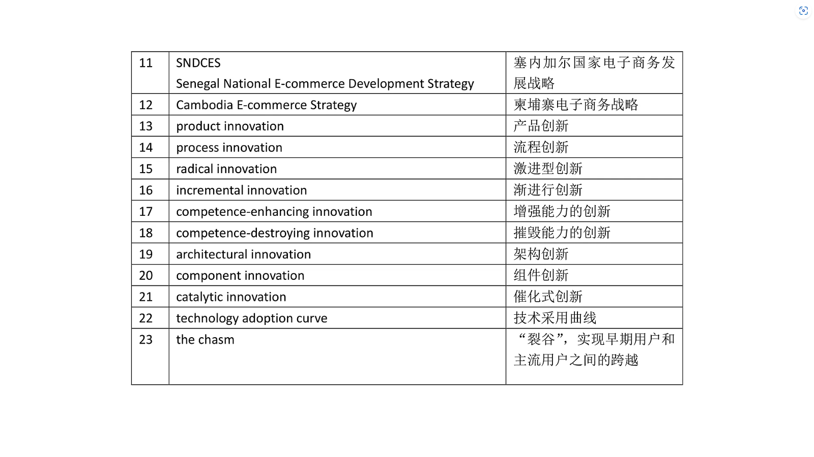
### strategic reskilling initiatives 策略性再培训计划
在当今时代，企业与员工之间的技能错位问题日益凸显。随着产业不断升级和技术飞速迭代，企业所需技能常常超出员工现有的能力范畴。

多数组织在人才评估方面存在局限性，对所招募人才的能力理解流于表面。而策略性再培训计划则成为解锁员工未开发潜力的关键钥匙。

再培训的核心是为员工提供新技能和工作职能的培训，助力他们在组织内部实现角色转换，适应企业动态变化的需求。

与之形成对比的是提升技能（upskiling），它聚焦于让学习者在当前岗位上表现更优，或是为其迈向更高职业台阶做好充分准备。 
### gig economy 零工经济
零工经济是一个劳动力市场，它严重依赖于由独立承包商和自由职业者担任的临时和兼职职位，而不是全职员工。通常涉及通过在线平台与客户建立联系。

- **零工工作者的特点**：零工（gig workers）获得了灵活性和独立性，但很少或根本没有工作保障。许多雇主为了省钱，不支付健康保险和带薪休假等福利。其他公司向零工支付一些福利，但将福利计划和其他管理任务外包给了其他机构。
- **零工经济的影响**：零工经济可以使工作更适应当下的需求和灵活的生活方式，从而使工人、企业和消费者受益。与此同时，由于工人、企业和客户之间的传统经济关系受到侵蚀，零工经济也有其不利之处。

### contingent workers 时工
- **定义**：不受工资单限制，而是为一个组织独立地提供服务的个人。
- **与公司的关系**：他们与公司的关系通常是基于短期业务需求。
- **人员构成**：临时劳动力由具有不同技能和专业知识的人组成。它包括由外部人力资源机构提供的临时雇员、自由职业者以及独立顾问等独立人才。 
### eTReadies 电子贸易准备情况评估
电子贸易准备情况评估（eTReadiness Assessments）提供发展中国家和地区电子商务生态系统的概况，旨在契合“全民电子贸易”倡议的七个支柱，这对实现数字化转型至关重要，具体包括：

 - **电子商务评估和战略制定**：对电子商务发展现状进行评估，并制定相应战略规划。
 - **信息通信技术基础设施**：涉及信息通信技术相关的硬件、软件等基础设施建设。
 - **贸易便利化和物流**：关注贸易流程简化及物流配送的高效性。
 - **支付解决方案**：提供各类电子支付方式及相关解决方案。
 - **法律和监管框架**：构建规范电子商务活动的法律法规及监管体系。
 - **技能发展**：提升人员在电子商务领域的专业技能。
 - **融资渠道**：为电子商务发展提供多样化的资金支持途径。

同时，该评估还致力于应对与性别平等、衡量电子商务和数字经济相关的挑战。

**合作伙伴**：UNCTAD

**地理范围**：
 - 非洲地区：西非、南部非洲、北非、东非
 - 大洋洲地区：美拉尼西亚、密克罗尼西亚、波利尼西亚
 - 美洲地区：南美
 - 亚洲地区：东南亚、南亚、西亚

**地区经济状况**：主要针对最不发达国家（LDCS） 
### Product innovation & process innovation 产品创新&流程创新
- **产品创新**：体现在一个组织的产出，即其产品或服务上。对多数组织而言，产品创新是研发工作的核心。尽管研发过去可能集中在组织内单独的部门或小组，但如今，它更常分布于整个公司。例如，本田开发的新型混合动力电动汽车，就是典型的产品创新实例。
- **流程创新**：指的是一个组织开展业务方式的创新，涵盖生产、营销产品或服务的技术创新等方面。其目的在于提升组织效率。例如，生物技术公司开发出一种能够快速搜索一组与疾病相关基因的遗传算法，用于确定治疗干预的目标，这一流程创新能够加快企业产品创新的速度。

两者相互成就，一个组织的产品创新，有可能成为另一个组织的流程创新。 
### radical innovation & incremental innovation 激进型创新&渐进型创新
- **创新激进性的定义**：创新的激进性可看作是新颖性与差异程度的融合，即考量新产品相较于已有旧产品的差异程度。
- **创新激进性的相对性**：创新的激进性是相对概念，其评判标准会随时间推移以及不同视角而改变。例如，同样是数码摄影技术，对于柯达而言是激进型创新，而对于索尼来说则属于渐进型创新。
- **激进型创新**：会引发工作方式的巨大变革。例如，计算机最初被引入时，改变了组织与个人处理和存储信息的方式；汽车问世时，作为一项革命性技术，极大地改变了交通方式。这类能带来巨大改变的技术，在商业与社会领域构建了全新功能与做事方式。
- **渐进型创新**：或许并非极为新颖独特，可能仅涉及对现有做法的细微调整。例如，笔记本电脑几乎每年都在朝着更轻、更便携的方向发展，这些技术变化在相对较短时间内逐步发生。因此，消费者将其视为技术的持续改进，因其并非一次性的重大变革。该创新过程致力于在不改变现有技术功能的前提下，以更低成本提升性能、功能与质量。 
### catalytic innovation 催化式创新
催化式创新属于颠覆性创新（disruptive innovation）的一个分支，它的显著特点在于重点着眼于大范围的社会变革，这种变革常常是在全国层面展开。

在医疗保健领域，与将资源投入到运用前沿技术和疗法治疗疑难患者不同，催化式创新的投资方向更侧重于开发更为简易的产品和服务，从而使更多人能够负担得起医疗服务。 
## COVID boosted the digital transformation
根据毕马威2022年的报告，新冠疫情加速了各行各业数字化的进程，企业不得不重新思考数字化策略。

因此据预测，2022年底数字化转型的投资将达到1.8万亿美元，2025年将达到2.8万亿美元。

这就意味着对于商业领袖来说，保持对新趋势和新技术的意识，并相应地适应这些变化已经变得至关重要。因为不仅基础设施发生了变化，而且公司的广泛投资也将明确地指向数字化转型。 
## Gaining a digital edge
在数字化时代和后疫情时代，企业若想获取竞争优势，就必须具备与客户、供应商以及员工进行数字化连接的能力。这意味着企业需要应对五个关键方面的挑战：

1. **数字化加速(digital acceleration)**
    - **基础设施搭建**：迅速构建数字技术基础设施，将人力资源、IT、财务、运营、采购、营销、销售和客户服务等前中后台部门连接起来。这涵盖了价值链的几乎所有环节，都需要进行数字化基础设施建设。
    - **思维模式转变**：在做战略决策时，不仅要以敏捷的方式思考，还需运用数字化思维。在数字化背景下，任命首席信息官CIO的重要性和战略意义日益凸显，同时，建设基础设施还需要专业领域专家来加快数字化进程。
2. **消费者行为(customer behavior)**
    - **商业模式构建**：打造以客户为中心的商业模式，让客户通过整合的数字渠道进行购买和参与，减少甚至无需实际接触。在数字化时代，交易和资金转账对面对面接触的需求和依赖越来越低，但客户体验至关重要，必须做到相关、个性化、差异化且有竞争力。
    - **数据驱动决策**：为了解客户需求和偏好，数据和分析应为营销、销售、服务和商业的统一前端办公室的客户战略和战术提供依据，以此实现适宜的客户体验经济。
3. **供应链和运营(supply chain and operations)**
    - **提升可靠性与响应速度**：供应链和运营必须更加可靠且响应更快。通过与供应商及服务供应商更紧密的数字连接与合作，企业能提高灵活性，以应对快速变化的客户需求。此时供应商成为业务的延伸，参与战略和产品开发，使得组织边界变得模糊。
    - **基于数据的决策与业务韧性**：随着供应链模块化程度加深，运营/供应链中不同参与者的角色会不断变化。运营/供应链领导者可利用实时内外部数据，通过分析评估服务需求和成本，获取市场预警信号并迅速行动。随着时间推移，借助更先进技术和认知能力强化决策，更强的业务韧性能够确保持续获得产品材料、人员和服务。
4. **工作方式(ways of working)**
    - **适应工作方式变革**：工作完成的方式已发生改变，组织需尽快适应，变得更灵活，能迅速扩大或缩小规模，进入新市场或退出旧市场。新冠疫情增强了对高效远程工作的需求，企业还需“重塑”劳动力，确保在需要时能获得所需技能。
    - **多元化人力资源利用**：许多企业意识到从根本上改变企业形态、规模和结构并获取新技能的重要性。通过战略再培训举措以及拥抱“零工”经济，可使工人和雇主都受益。此外，共享服务、伙伴关系、联盟和退休人员的战略运用，能在中短期内带来获取重要人才的机会，数字化使人力资源更加多元化。“未来生态系统的劳动力”越来越数字化，自动化应用和临时工人的雇佣进一步加剧了这一趋势。
    - **零工经济与临时工人**：零工经济基于灵活、临时或自由职业工作，通常通过在线平台与客户建立联系，能满足当前需求和灵活生活方式，使多方受益，但也会侵蚀传统经济关系。大量人员从事兼职、临时工作或作为独立承包商。临时工人不受工资单限制，为组织提供独立服务，包括独立承包商、自由职业者等。
5. **韧性(resilience)**
新冠疫情下的发展状况表明，“数字化”企业实际上是“有韧性的”企业。实现数字技术的组织更有能力承受疫情及其他冲击的影响，并且能通过灵活举措更快恢复正常运营。而且，这些组织受益于更强的洞察力，较少依赖人工干预、地段和市场力量。 
## Top 5 COViD-19-related priorities
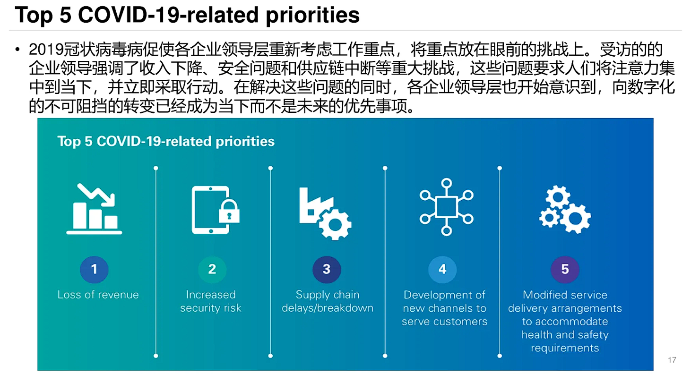
## Digital has risen up the agenda
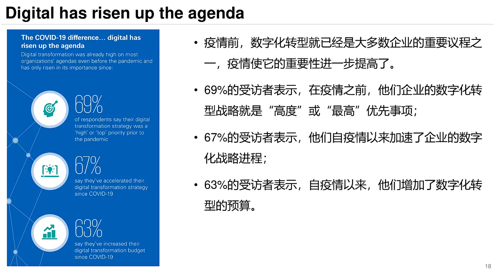
## 5 digital transformation trends in 2022
1. **重视网络安全**
疫情使得企业对数字化转型的需求变得迫切，然而这也增加了企业的脆弱性以及网络安全风险。2021年，安全漏洞数量几乎创下历史新高，这便是企业如今更加关注提升网络安全的原因。
部分公司当前正借助AI（人工智能）、ML（机器学习）和RPA（机器人过程自动化）来强化网络安全，以此减轻安全威胁。例如，在网络安全中运用人工智能和复杂算法，能够在恶意软件和勒索软件入侵系统前进行检测。
2. **为5G做准备**
5G技术凭借更快的速度、更大的设备连接量以及更高的效益，能为企业带来更多优势。公司可利用5G加速数字解决方案（digital solutions）的实施，显著优化基于互联网的软件。
3. **客户数据平台（customer data platform，CDP）的席卷**
丰富的客户数据可助力公司做出最佳决策。CDP软件是一种统一的客户数据库，能让公司便捷地实时访问客户数据。疫情推动了CDP市场的发展，预计到2025年，其市场规模将超30亿美元。
4. **AI的繁荣**
人工智能对全球各地的企业和行业都产生了重大影响。随着各类规模的公司纷纷对该技术进行投资，预计到2025年，人工智能市场规模将达到1260亿美元。
5. **商业中自动化**
自动化是正在改变全球企业的又一项技术。如今，越来越多的企业投资于RPA（机器人过程自动化），以优化自身业务流程。如图所示，全球RPA市场预计到2030年将增长至130亿美元 ，相较于2020年增长约1200%。超自动化（Hyperautomation）是另一个助力企业实现数字化转型的领域。
自动化技术在商业中的应用，能够降低成本、增加产出，进而提升边际利润。所以，自动化目前在众多企业的优先事项清单中，尤其是自动化技术相关产业的企业、制造业企业、汽车自动化企业等。 
## Current state of digital transformation
为更深入了解COVID - 19对企业数字转型战略的影响，毕马威委托弗雷斯特咨询公司，于2020年夏中下旬，针对10个国家12个行业的780名数字转型战略领导者展开调查。

调查结果显示，数字化转型的紧迫性显著提升。参与调查的企业领导者一致认为，数字化转型不仅是当下竞争的必备要素，更是关乎长期制胜的战略。为此，他们在技术领域投入了大量资金。

然而，若缺乏协调且连贯的方法，新的数字化组织可能会重蹈传统模式的覆辙，出现诸多弊端：
 - **功能孤立（siloed functions）**：各功能模块或部门之间缺乏联系，无法实现有效协作。
 - **运营/供应链反应迟缓**：面对市场变化，运营与供应链难以做出快速响应。
 - **人才竞争激烈**：为获取适配人才，企业间持续陷入激烈竞争。 
## E-commerce and digital economy in developing countries during COVID
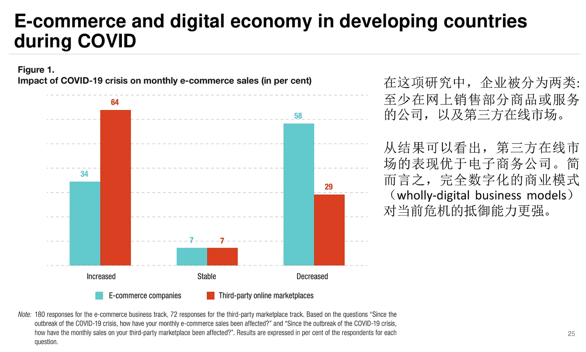
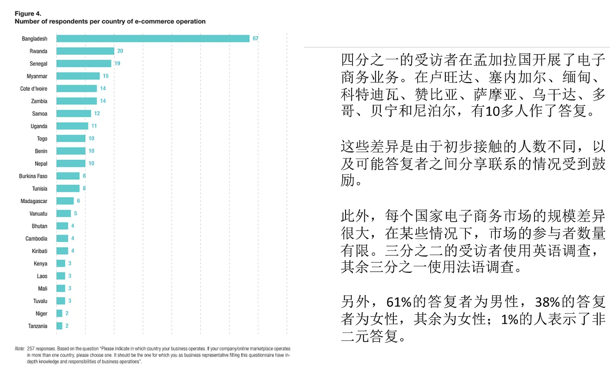
## Top 10 most important measures taken during COVID
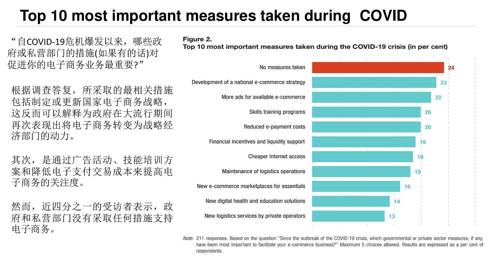
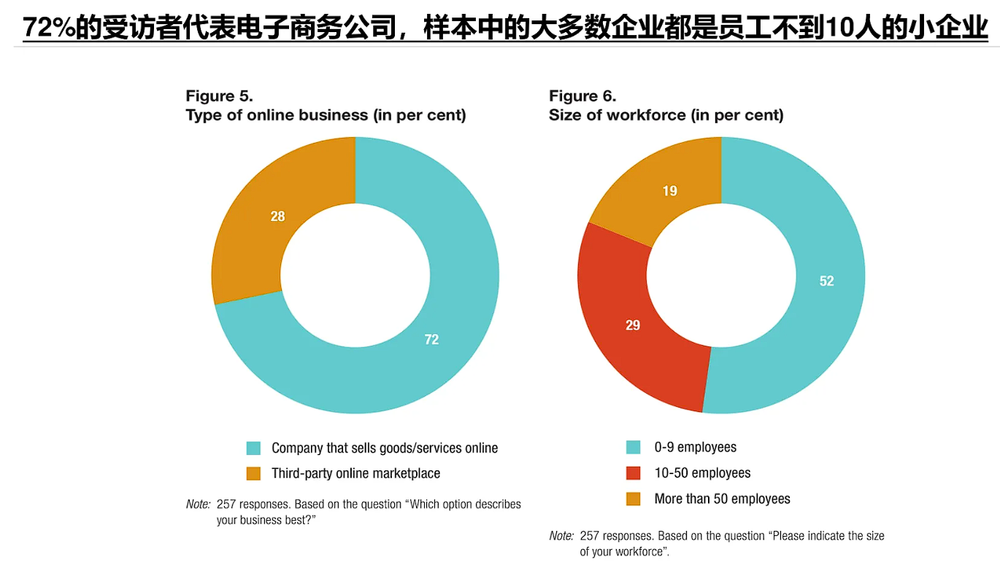
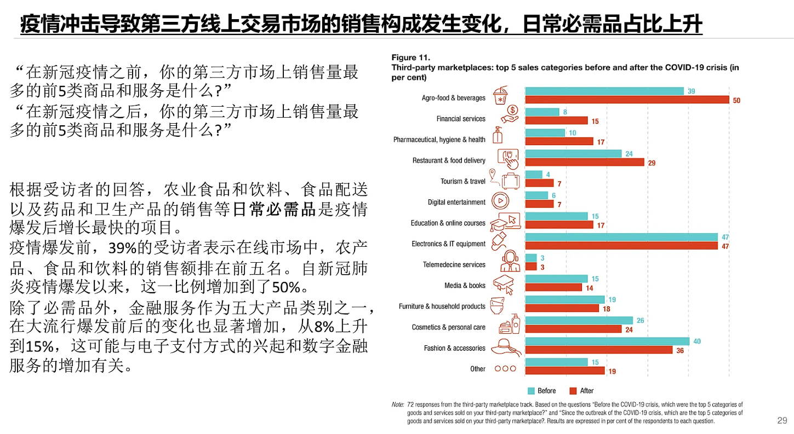
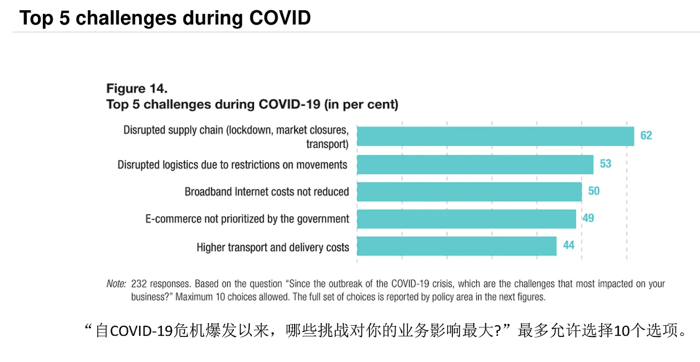
当前与疫情相关的情况揭示了发展中国家，特别是最不发达国家在所有关键政策领域存在的七个相互关联的电子贸易方面面临的瓶颈，这七个领域分别是：

1. **电子商务准备状况评估和战略**：关乎对电子商务发展现状的评估与未来规划的制定。
2. **信息通信技术基础设施和服务**：涉及硬件设施搭建以及通信服务的提供，是电子贸易开展的基础支撑。
3. **支付**：包括各类支付方式与支付体系的构建，保障电子贸易资金流的顺畅。
4. **贸易物流和贸易便利化**：确保货物运输高效以及贸易流程简化，提升电子贸易的效率。
5. **法律和监管框架**：为电子贸易提供法律规范和监管准则，保障交易的合法性与安全性。
6. **电子商务技能开发**：培养相关专业人才，提升从业者在电子贸易领域的技能水平。
7. **融资渠道**：为电子贸易企业提供多样化的资金获取途径，助力企业发展。

这些瓶颈和挑战已被贸发会议记录下来，作为其电子贸易准备评估计划（eTrade Readiness Assessment programme）的一部分，该计划是电子贸易普及伙伴关系（eTrade for all partnership）的一个衍生项目。 
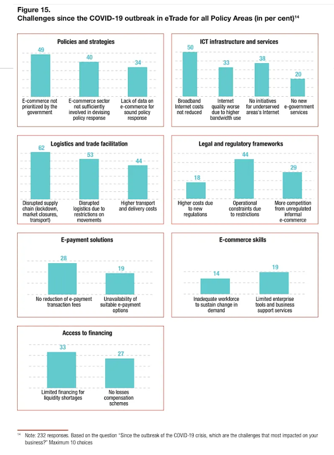
## Next step in digital transformation journey
无论是私营部门还是公共部门的组织/企业，都在思考自身未来的形态。他们应当意识到，数字转型蕴含着巨大机遇。然而，许多组织受困于分散的数字基础设施，以及前、中、后台部门职能缺乏一致性，这阻碍了他们提供无缝客户体验的努力，所以，成为一个以客户为导向的数字化连接企业（a connected enterprise）十分必要。

1. **数字化加速**：若不及时推进数字化转型，极有可能被竞争对手超越。需将数字化与更广泛的战略相融合，快速采用新技术，构建灵活、模块化（在某些情形下为虚拟的）组织结构。
2. **客户体验**
    - **客户至上**：始终把客户放在首位。
    - **洞察力驱动**：以洞察为驱动力，深入了解客户需求。
    - **实践客户远见**：践行客户远见，提前预判客户需求趋势。
3. **运营/供应链**
    - **投资预测模型**：投入资源打造实时预测模型。
    - **角色重塑与合作**：重新审视供应链中每个参与者的角色，加强与供应商的合作，提升创新能力与灵活性。
4. **工作方式**
    - **能力聚焦与资源规划**：聚焦于连接性的企业所需能力，并规划如何通过永久雇员、零工经济或其他合作关系获取这些资源。
    - **技能提升**：加大对技能提升的投入，尤其是数字技能的培养。
    - **资产与人力平衡**：重新思考实体和虚拟资产以及人力资源之间的平衡。
    - **自动化应用**：积极主动地采用自动化技术。
5. **韧性**
    - **技术拉近客户距离**：思考能拉近与客户距离的技术。
    - **风险管理**：借助技术助力管理持续高风险的环境，特别是网络安全、治理和道德方面。技术投资应与以客户为中心的战略目标相契合，这意味着专注于具备连接性企业的八种能力。 
## 连接企业的八种能力
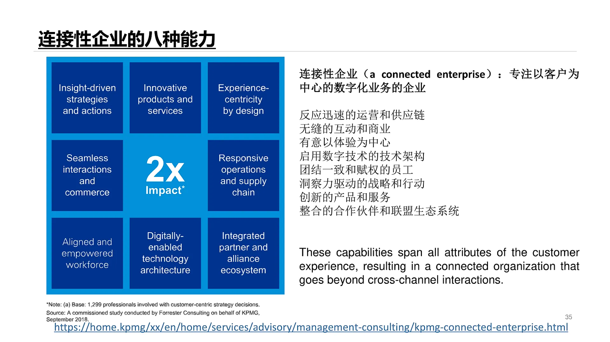
## Policy responses for digital transformation

### 美国
美国针对数字经济，普遍奉行自由市场模式，在跨境数据流动方面，也构建了类似的自由监管框架。在此模式下，美国倾向于以私人市场为导向，意图凭借网络效应，巩固数字企业的先发优势及后续的主导地位。在促进创新方面，该国借助贸易协定，保障本国公司能不受限制地进入外国市场，例如积极推动数据自由流动，同时禁止数据和服务器本地化要求等举措。

正如国会研究处报告所强调的，“总体而言，美国采用市场驱动的方式，支持开放、可互操作、安全且可靠的互联网，推动在线信息的自由流动”。这种方式使得数据在世界各地用户与总部位于美国的公司交互时，能够回流至美国。

### 欧盟
不同于美国侧重于私营部门掌控数据，以及中国侧重于政府对数据的把控，欧盟着重强调个人对数据的控制权。因此，欧盟针对数据驱动的数字经济，采取了严格的监管策略，其核心在于维护欧盟的基本权利与价值观，从这个角度看，可将其视为一种以人为本的方式。相应地，欧盟对跨境数据流的监管较为严格，着重保护个人隐私。欧盟致力于在其境内打造一个统一的数字市场，在该市场内，数字产品和数据能够依据一套规则自由流通，以此保护个人、企业和政府，避免其遭受数据收集、处理及商业化过程中的滥用风险。

2018 年正式生效的《欧盟一般数据保护条例》（GDPR），堪称全球最为全面的数据保护框架之一，其中针对个人数据转移至区域外，制定了详尽的要求。不过，在欧盟内部，对于非个人数据的跨境转移，并无明确限制。GDPR 适用于所有“个人资料”的处理，“个人资料”被定义为“与识别或可识别自然人相关的任何信息”。GDPR 的基本原则是，仅当完全遵循为欧盟公民提供的隐私权保护规定时，个人数据方可在欧盟以外进行转移和处理。

### 发展中国家
1. **互联网与金融交易发展**：互联网接入的增加以及在线金融交易的普及，降低了互联网数据、电子支付和移动货币交易的成本，这进一步激励了民众使用信息通信技术及金融服务。越来越多的人能够长时间使用互联网，并通过电子支付方式购买商品和服务。因此，电子商务的增长得益于连通性需求的上升以及移动货币使用的增多。
2. **业务操作便捷化**：在部分地区，通过延长营业时间以及保障物流运营商的自由移动，缓解了供应链中断的问题，确保了供应链运营、最后一公里配送以及家庭交付的顺畅进行。
3. **企业损失最小化**：财政支持措施（如降低利率、提供补贴贷款、补偿办公室租金、发放社会保障工资等）在特定条件下，对企业的生存起到了极大的帮助，在某些情形下，还刺激了企业对更具盈利性活动的投资。
    - 发展中国家的 12 个国家中，9 个国家实施了财政激励政策和流动性支持（包括赠款、贷款、补贴、损失赔偿等）。
    - 8 个国家支持开发新的第三方平台和数字解决方案，用于远程提供医疗保健和教育服务。
    - 5 个国家采取了以下措施：
        - 降低互联网接入以及移动支付和其他电子支付的成本。
        - 维持快递和物流业务。
        - 采用新的法律法规，增强信任并保护在线消费者。
    - 4 个国家采取了以下措施：
        - 由邮政和私营经营者提供新的物流服务。
        - 增加现有电子商务服务的信息和广告。
    - 3 个国家已采取措施：
        - 增加服务不足地区的互联网连接。
        - 利用特别计划接触非正式电子商务运营商。
        - 支持发展新的电子商务市场，以方便获取基本商品和服务，并助力实体企业建立在线业务。
    - 2 个国家已采取措施，涉及：
        - 发展或更新国家电子商务发展战略。
        - 推出新的电子支付应用程序。
        - 实施新的培训计划，以培养和调整经济活动方向，使其面向电子商务领域。 
## Boost E-commerce readiness and market development

### 制定或更新国家电子商务发展战略
1. **柬埔寨**：新冠肺炎疫情爆发后，柬埔寨商务部持续推进《柬埔寨电子商务战略》的制定工作，并于2020年7月顺利完成并启动该战略。
2. **塞内加尔**：疫情促使塞内加尔加快实施国家电子商务发展战略（SNDCES）。目前，SNDCES的实施工作正在进行，涵盖多个方面，包括建立国家第三方市场、设立中转交付点、搭建电子商务观察站以及审查电子商务管理法律文本。

### 为非正式电子商务营办商举办的特别项目
1. **多哥**：手工业工人和企业家获邀通过www.assiyeyeme.tg拓展业务。该平台由Société des Postes du Togo运营，专注于推广多哥制造的手工艺品。此举措于2020年启动，并因疫情危机而加速推进。
2. **突尼斯**：突尼斯开展了一场无线电宣传活动，旨在提升贸易商对电子商务监管以及遵守网上销售规则的认知，尤其是针对社交网络上的销售行为。
3. **塞内加尔**：塞内加尔已开启电子商务企业的正规化和注册流程。同时，成立了国家电子商务联盟，以推动各类塞内加尔产品，特别是本地产品的推广与销售。

### 建立新的第三方市场和数字解决方案，远程提供医疗和教育服务
1. **柬埔寨**：
    - 卫生部开发了如网站（www.cdcmoh.gov.kh）、Facebook页面等数字第三方市场以及各类数字通信工具。
    - 教育、青年和体育部鼓励教育机构部署在线学习工具。
2. **马里**：国家教育部通过并实施了一项借助媒体（广播和电视）为参加期末考试的学生提供培训的方案。
3. **尼日尔**：教育部创建了在线第三方市场www.mobileclassroom.com.ng，学生可通过该平台访问视频内容库。
4. **塞内加尔**：国家教育部搭建了名为“Appendre à la maison”的数字工具，助力学生获取特定学科的课程与练习，特别是为学生准备期末考试课程。此外，education.sn网站上还设置了一套针对学习者以及另一套针对教师的第三方市场。
5. **突尼斯**：公共机构、非政府组织、大学、初创企业和中小企业提出了多项倡议。高等教育和科学研究部通过专门门户网站对这些举措进行跟踪。其中，https://www.3awen.com/是最受欢迎的应用程序之一，用户可通过该程序找到众多与社区支持服务、卫生和医疗设施、食品、运输和物流、电子学习及远程工作相关的应用程序。
6. **瓦努阿图**：教育部为学校搭建了在线学习第三方市场。 
## Increasing internet access
1. **互联网接入成本的降低**
    - **莱索托**：移动和电信公司为助力学生在疫情封锁期间能够在线学习，特意降低了教育网站和内容的互联网接入成本。
    - **突尼斯**：在封锁期间，三家电信运营商为第三方远程教育市场提供免费互联网接入服务。为防止网络出现饱和情况，突尼斯还建议实行互联网配给，并减少夜间移动数据访问费用。
    - **尼泊尔**：电信公司推出各种价格更为低廉的数据包，并给予充值奖励。
2. **在服务不足地区增加互联网连接**
    - **尼日尔**：尼日尔服务不足地区的互联网覆盖率得到显著提升，已有几十个村庄接入互联网，另外200多个村庄也有希望接入。疫情进一步推动了正在开展的旨在实现农村地区最后一英里快速连接的项目，例如国际电信联盟（国际电联）支持的尼日尔2.0智能村庄项目。
    - **图瓦卢**：图瓦卢政府通过司法、通信和外交部，在其所有外岛安装了卫星天线，以此加强网络连通性，特别是满足疫情期间教育方面的需求。 
## Data flows and policy responses
若仅有少数国家的少数全球数字公司私下获取数据所带来的大部分收益，那么跨境数据流动便无法服务于人类与地球的利益。

因而，为达成发展目标，一套有效运行的国际制度，用以管理此类数据流动，在很大程度上能够助力发展中国家更为公平地分享数据价值。 
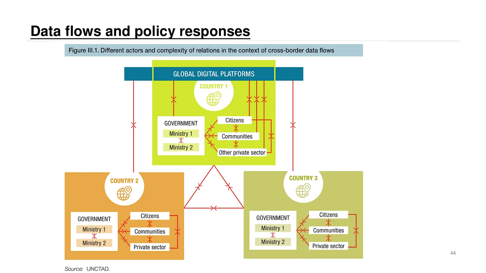
## Issues for data governance and policy responses
数据具有特殊性质，与商品和服务的属性大相径庭。它具有无形性、非竞争性、部分排他性、关联性以及多维性。

鉴于这些特性，跨境数据流动不能等同于国际货物与服务贸易，而应区别对待。

在跨境数据流动及相关政策方面，不同类型的数据会产生各异的影响。数据的获取与使用（包括潜在的负面使用），以及将数据转化为数字智能（数据产品）从而创造和获取价值的能力，是发展的关键所在。

在以数据驱动的全球数字经济背景下，各方利益冲突错综复杂。因此，在制定旨在推动发展的跨境数据流动政策时，必须权衡各种政策因素。

全球数据治理政策的制定，需要在国家和国际层面，采用全面、多维、政府协同、多方利益相关者参与的方法。 
## What is innovation?
- **定义阐述**：创新可理解为一种质变，是对知识和技术进行全新组合。它意味着创造新事物，并非仅仅是采纳他人的新成果。
    - **创新范畴**：创新涵盖发明创造、推出新项目（将创新产品推向商业化）以及实施新想法等方面。
    - **创新本质**：创新体现了创新者为创造更高的用户价值、提升生产力，或是达成诸如减少碳排放之类的社会目标，所做出的并非无关紧要的、深思熟虑的努力，而最终目的是获取净利润。 
## Negative impacts of innovation
1. **降低对劳动力的技能要求与失业问题**
创新带来的技术变革，如自动化程度不断提高的生产线，使得许多原本由人工完成的工作被机器取代。这不仅降低了对劳动力特定技能的需求，还直接导致大量员工失去工作岗位，进而引发失业现象。
2. **污染问题**
创新过程中，一些新技术的应用或新产品的生产往往伴随着较高的能源消耗和电能消耗。例如，某些新兴产业在生产环节对能源的大量需求，可能导致更多的污染物排放，对环境造成负面影响。
3. **技术成瘾与社交媒体成瘾**
随着科技创新，各类电子产品和社交媒体平台日益普及。人们过度依赖这些技术和平台，容易产生技术成瘾和社交媒体成瘾现象。这种成瘾行为不仅影响个人的身心健康，还可能对社交关系、工作学习等方面造成诸多不良影响。 
以下是关于技术创新对企业重要性的具体阐述：
- **竞争驱动核心**：技术创新是众多行业企业在竞争中脱颖而出、取得成功的首要驱动力。在快速发展的市场环境中，唯有持续进行技术创新的企业，才能保持领先地位，满足不断变化的市场需求，从而在激烈的竞争中立于不败之地。
- **提升销售业绩**：许多公司的实践表明，过去五年内开发的创新产品为其带来了超过三分之一的销售额。这充分证明了技术创新能够为企业创造新的营收增长点，通过推出具有创新性的产品，吸引更多客户，扩大市场份额，进而显著提升企业的销售业绩和盈利能力。
- **维持产品利润**：产品创新能够为企业提供新的差异化功能，使产品在市场上与竞争对手形成明显区分。这种差异化优势可以让企业在一定程度上避免价格竞争，从而帮助企业维持较高的利润率，确保企业在经济环境变化和成本波动时仍能保持良好的财务状况。
- **提高生产效率**：流程创新也是技术创新的重要方面，它有助于企业优化生产流程、降低生产成本、提高生产效率。通过引入新的生产技术、管理方法或自动化系统等，企业可以在相同的时间和资源投入下，生产出更多、更优质的产品，提高资源利用率，增强企业的整体竞争力。
## Sources of innovation
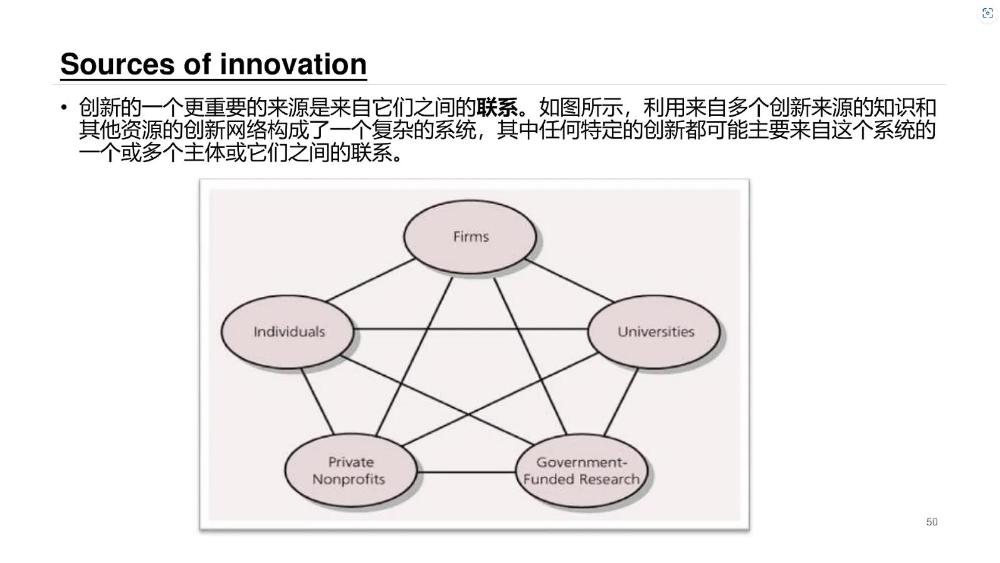
以下是对不同类型创新的详细阐述：
## Types of innovation
### Product versus process innovation
- **产品创新**：重点在于组织最终产出的产品或服务。是多数组织研发工作的核心，通过赋予产品新的、有差异的功能，帮助企业维持利润率，满足消费者需求，提升产品竞争力与附加值。像本田的新型混合动力电动汽车，以新的动力技术和性能等特性，为消费者提供了不同于传统燃油汽车的产品，在市场中占据独特地位。
- **流程创新**：是组织开展业务方式的创新，包括生产、营销等技术创新，目的是提高组织效率，提升产出投入比。但流程变革可能遭组织内部反对。例如生物技术公司开发遗传算法快速搜索疾病相关基因，加快了确定治疗靶点的速度，提升了研发效率，为产品创新提供有力支持。两者相互促进，如UPS帮助客户开发的高效分销系统，对UPS是产品创新，对客户则是流程创新。

### Radical versus incremental innovation
- **激进创新**：创新的激进性是新颖性和差异程度的结合，会带来做事方式的巨大变革。例如计算机的出现，彻底改变了信息处理和存储方式；汽车的问世，也极大地变革了交通方式，在商业和社会中建立起全新功能和做事方式。
- **渐进创新**：相对不那么新颖独特，只是对现有做法进行微小改动，以较低成本提升性能、功能和质量。如个人计算机每年变得更轻、更便携，是在现有技术基础上的持续改进，不改变其基本功能，让消费者能持续体验到技术进步。

### Competence - enhancing versus competence - destroying innovation
- **能力提升的创新**：基于企业现有的能力、技能和专业知识，并加以强化，使企业在已有优势的基础上进一步发展，巩固和提升在市场中的竞争力。
- **能力摧毁的创新**：会淘汰和颠覆企业现有的能力、技能和专业知识。一项创新对不同企业可能有不同影响，例如线上电商平台的兴起，对于传统线下零售企业是能力摧毁的创新，但对于新兴的电商运营企业则是能力提升的创新。

### Architectural versus component innovation
- **组件创新（模块创新）**：是在不显著影响产品系统整体布局的前提下，对一个或多个组件进行更改。比如自行车座椅添加凝胶填充材料，只是改进了自行车的一个部件，提升了座椅的舒适性，而不改变自行车的整体结构和功能。
- **架构创新**：需要改变系统的整体设计或组件交互方式，多数情况下也会涉及底层组件的更改。如从高轮自行车到现代安全自行车的转变，不仅改变了自行车的外观和结构，还涉及到各个部件之间的连接和协同工作方式。

### Catalytic innovation
- **催化式创新具有以下五个特征**
    1. **创造系统性社会变革**：通过扩大规模和复制，能在社会层面引发系统性的改变，推动行业或社会的整体进步。
    2. **满足特定需求**：要么针对过度服务的需求，提供更简单合适的解决方案；要么服务那些未被现有方案覆盖的领域，填补市场空白。
    3. **产品和服务特点**：提供的产品和服务比现有替代品更简单、成本更低，虽性能可能稍低，但能满足用户基本需求，具有较高的性价比和实用性。
    4. **独特的资源产生方式**：以对现有竞争对手缺乏吸引力的方式获取资源，如依靠捐款、赠款、志愿者人力或智力资本等，构建独特的资源体系。
    5. **市场初期处境**：在初期往往被现有市场参与者忽视、贬低，因其商业模式在初期可能无利可图，使得现有参与者避开相关细分市场，为其发展留出空间。
## Technology adoption curve
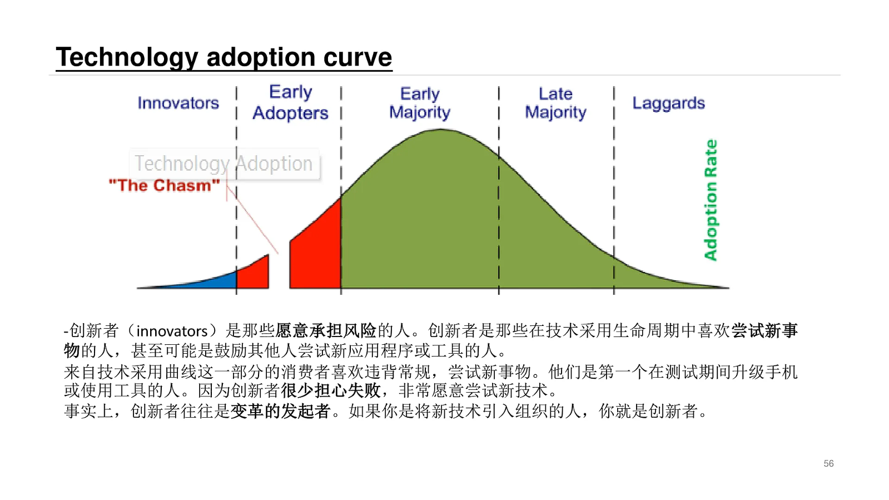

1. **创新者（Innovators）**
    - 创新者是技术采用生命周期中勇于承担风险的群体。他们热衷于尝试新事物，甚至会鼓励他人一同尝试新应用程序或工具。这类消费者乐于打破常规，积极投身新技术的探索。比如，在测试阶段就迫不及待升级手机或使用新工具的人，往往就是创新者。他们几乎不担忧失败，对尝试新技术充满热忱，常常是变革的发起者。若你是将新技术引入组织的那个人，你便属于创新者这一范畴。
2. **早期采用者（Early adopters）**
    - 早期采用者堪称潮流引领者，尽管愿意克服新技术早期存在的漏洞与不足，但在公开支持某项技术之前，他们期望形成对该技术的确切认知。他们热衷于成为最早知晓新技术的人，像会迅速注册新的社交媒体网站，或者单纯为了体验而尝试新的项目管理工具。早期采用者与创新者的区别在于，早期采用者较为在意自身声誉。创新者对公开失败坦然接受，而早期采用者则倾向于在向他人推荐技术之前，先收集信息并积累个人使用经验。当被问及新技术时，早期采用者希望展现出自己知识渊博且紧跟潮流的形象，这就是他们在支持一款工具前要进行测试的原因。
3. **较早的大多数人（Early majority）**
    - 较早的大多数人对技术抱有兴趣，但需要看到技术有效性的证明。在购买产品之前，他们会仔细研读产品评论，并且会在实际使用前暗自测试工具。对于他们而言，案例研究和真实用户故事的说服力，远超一般工具或程序所做的承诺。
4. **较晚的大多数人（Late majority）**
    - 较晚的大多数人与较早的大多数人一样，采用新技术需要充分的理由。要说服这个群体，必须有研究和可靠证据来证明该技术值得他们投入时间。较晚的大多数人行事谨慎、厌恶风险，往往质疑改变的必要性。他们不容易被潮流左右，更倾向于在参与之前，先观察变化是如何发生的。例如，他们会尽可能长时间地推迟软件更新，等待同伴对更新的反馈。
5. **落后者（Laggards）**
    - 落后者对新技术持谨慎态度。在考虑接纳新技术之前，他们会反复思索“这对我有什么好处？”这类问题。落后者抗拒改变，更愿意维持现状，思想较为保守，对新兴事物充满怀疑。
6. **跨越鸿沟（The chasm）**
    - 在技术推广过程中，最艰难的一步是实现从早期用户到主流用户的转换，这就是所谓的“鸿沟”。倘若一家成功的公司能够创造出一种强大的效应，并在其中积累足够的动力，那么其产品就有可能成为行业标杆。 