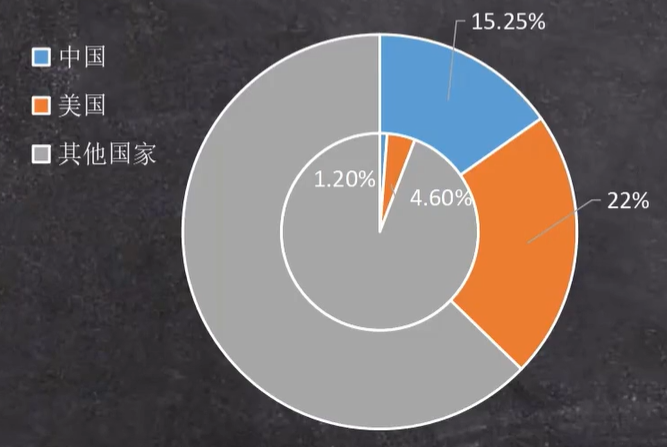
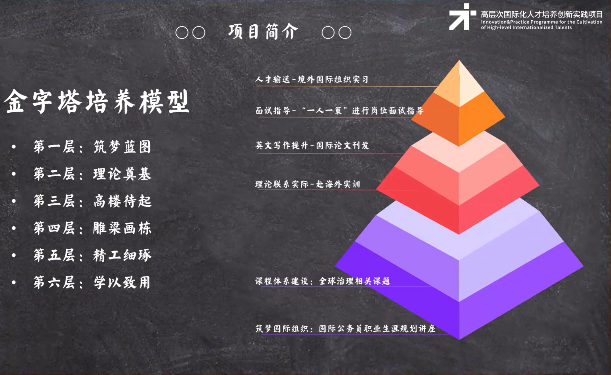
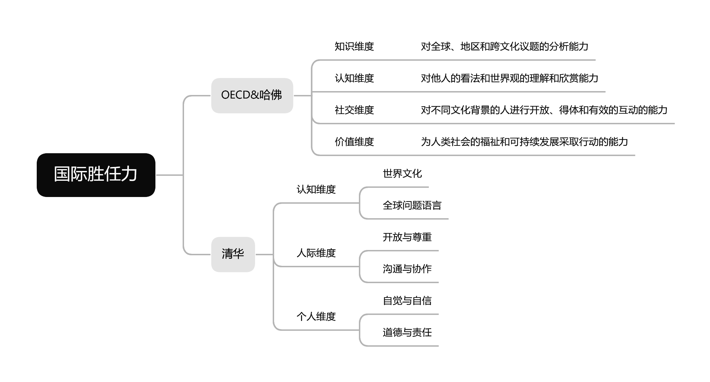
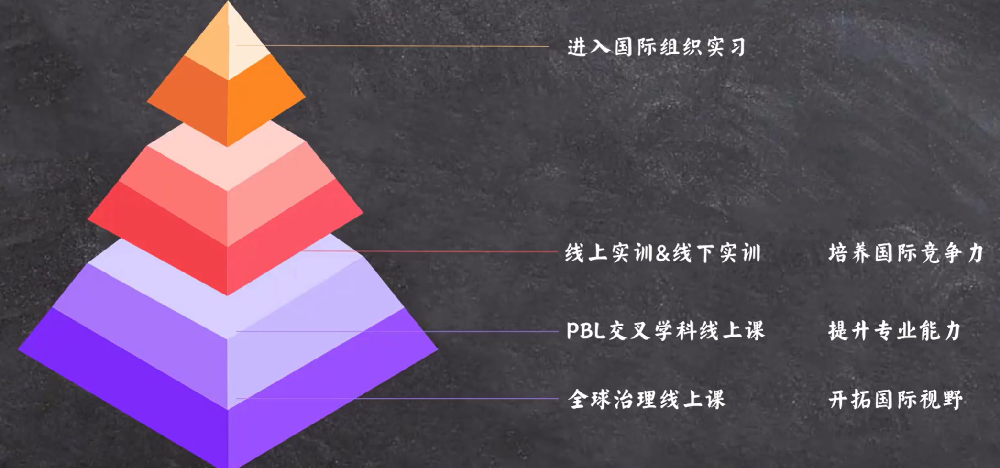
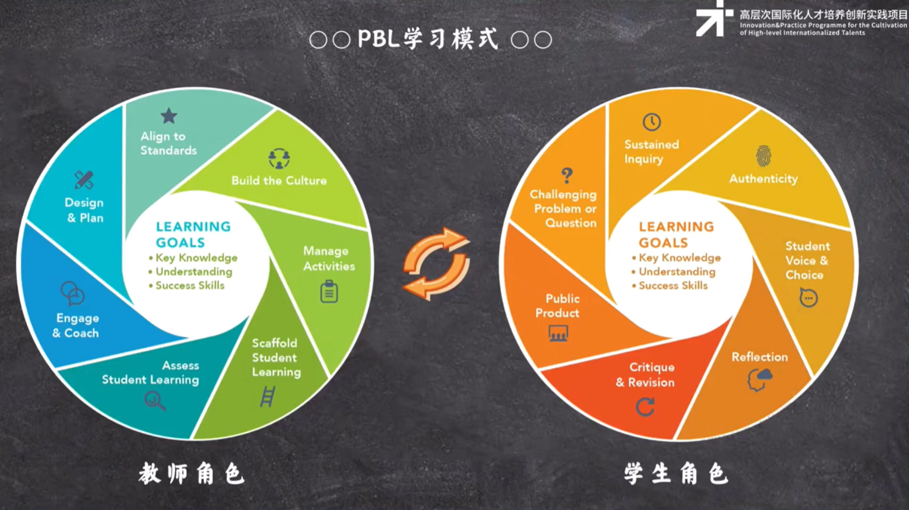
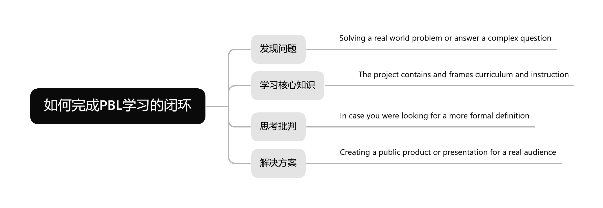
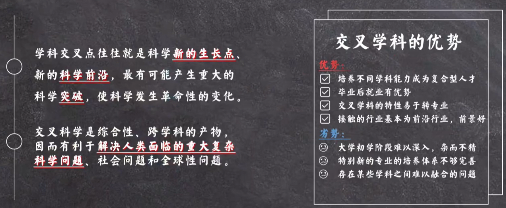
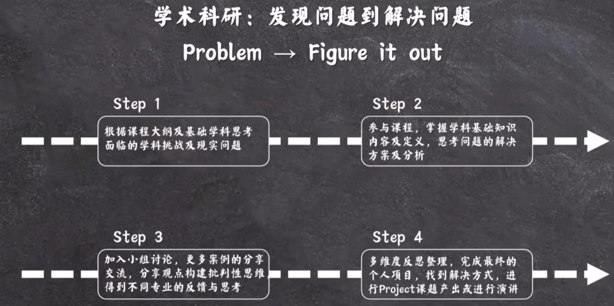
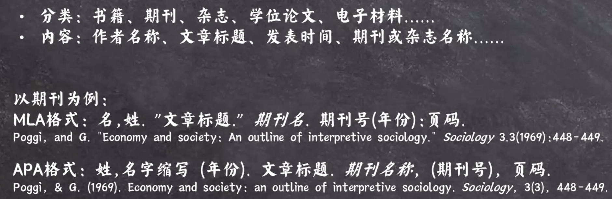

#PBL交叉学科先导课
##项目背景
###世界格局改变
1. 新兴市场国家崛起
2. 国际局势重塑
3. 国际关系变化
###中国当下的现状
1. 促成中东和解
2. 贸易以人民币结算
> 我们比历史中的任何一个时刻都更接近世界舞台的中央
###中国面临的挑战{ align=right width="370" }
1. 任职人员数量少
2. 任职人员职级低
3. 专业素养要求高
4. 缺少多语言沟通能力
##项目简介

###培养目标
1. 国际胜任力

2. 培养目标
    1. 具备中国情怀、国际视野和世界胸怀
    2. 熟悉国际规则
    3. 具备语言优势、专业优势与国际竞争力
        * 统筹协调能力
        * 分析研判能力
    4. 具有三个能力组合
###培养方案

###PBL教学法(Project/Problem Based Learning)
* PBL教学法：问题式学习或者项目式学习的教学
* 导向型教学：提高学生实际思考和解决问题的能力
* 以问题为导向：基于现实世界的以学生为中心的教学方法

###交叉学科
1. 交叉学科：两个或多个学科相互合作，在同一个目标下进行的学术活动
2. 交叉学科特点：智囊团模式，其目标是解决一个迫切的问题
3. 解决问题&突破限制：通过多个学科的整合，解决人类所面临的棘手问题，矫正当前学科过度专业化所造成的限制

###如何学习该课程

##论文学术先导课
###<mark>论文结构<mark>
1. 题目：简明扼要、确切；可以使用副标题；避免非公认缩写词（GDP为公认缩写词，除此以外的为非公认缩写词）
2. 摘要：研究背景；研究主题；研究方法；研究结果、意义
3. 引言：研究背景；研究主题及具体问题；研究方法；研究意义
4. 文献综述(可选)：现有研究总结；参考的分析工具与成果；其他领域内的研究内容(证明研究意义明确，研究方法有效)
5. 研究方法：研究思路；研究工具；研究数据
6. 论文主题
7. 讨论：结果与前人不同；差异性成因分析；进一步验证
8. 结论：主要研究问题；结论；文章的不足；未来研究方向
9. 参考文献
###文献查找
方法：关键词、筛选方式、期刊、论文引用
###文献引用

###网站分享
1. 中文网站
    1. 期刊篇
        - [中图在线：提供3600种国外期刊的查阅服务](http://cnplinker.cnpeak.com/)
        - [汉斯出版社中文学术期刊：125本国际开源中文期刊](https://www.hanspub.org/)
    2. 社科篇
        - [国家哲学社会科学文献中心：2039种中文期刊，7879种外文期刊](https://ncpssd.org/)
        - [国家哲学社会科学学术期刊数据库：公益性社科精品期刊数据库，600+种期刊](https://www.nssd.cn/)
    3. 自然科学篇
        - [中国科技论文在线精品论文：自然科学领域论文成果](https://highlights.paper.edu.cn/)
        - [国家科技图书文献中心：期刊、会议、报告、论文](https://www.nstl.gov.cn/)
        - [中国科学院文献情报中心](https://www.las.ac.cn/)
    4. 法律篇
        [北大法宝：法律法规、司法案例、法学期刊、律所实务](https://www.pkulaw.com/)
    5. 图书篇
        [国家图书馆馆藏中文图书数字化资源：17万+各学科图书](http://mylib.nlc.cn/user/index)
    6. 数据篇
        [中国国家数据：中国国家统计局](https://data.stats.gov.cn/)
    7. 白皮书篇
        [中华人民共和国国务院新闻办公室：政府白皮书](http://www.scio.gov.cn/)
2. 英文网站
    1. 学院图书馆篇
        - [北卡罗来纳州州立大学：提供化学、物理学、食品、土壤等自然科学的硕博论文](https://repository.lib.ncsu.edu/communities/8186e146-afb9-4f60-9606-87d0441558d2)
        - [加州大学学者库：提供读物、学术文献(分校内和校外版)](https://publishing.cdlib.org/ucpressebooks/)
        - [俄亥俄州立大学电子学位论文：数学、材料等自然科学方向](https://etd.ohiolink.edu/acprod/odb_etd/r/etd/search/1?clear=0,1,5,10,20,21,1001)
        - [加利福尼亚大学国际和区域数字馆藏：期刊论文、未出版研究手稿、会议文献等](https://escholarship.org/)
        - [康奈尔大学：物理学、数学、非线性科学等方向](https://arxiv.org/)
    2. 期刊篇
        - [Open Access Library：期刊论文](https://www.oalib.com/)
        - [Bioline International：提供发展中国家高质量期刊文献](https://www.bioline.org.br/)
        - [CERN：物理学及相关学科](https://cdsweb.cern.ch/)
        - [约翰威立国际出版公司：期刊、图书、参考工具书、丛书系列、辞典等](https://onlinelibrary.wiley.com/)
        - [Aminer：期刊、会议信息等](https://www.aminer.cn/)
    3. 图书篇
        - [zvdd：提供从15世纪至今所有印刷作品](https://www.zvdd.de/startseite/)
        - [Manybooks：免费图书下载，需Goolge账号登录](https://manybooks.net/)
        - [世界数字图书馆：免费图书下载，需Goolge账号登录](https://www.loc.gov/collections/world-digital-library/about-this-collection/)