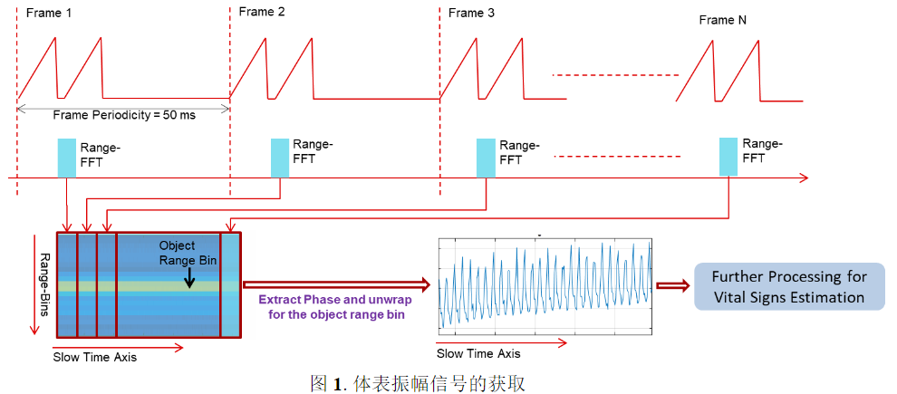
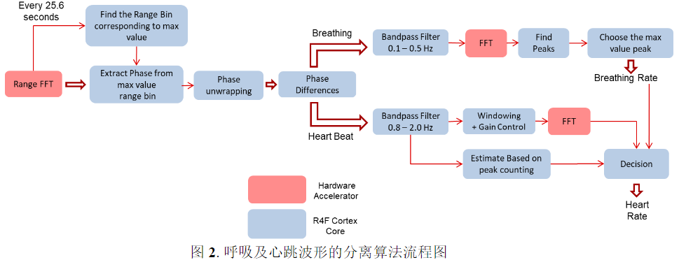
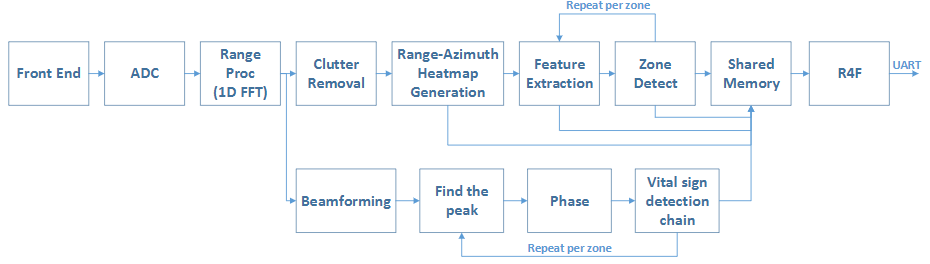
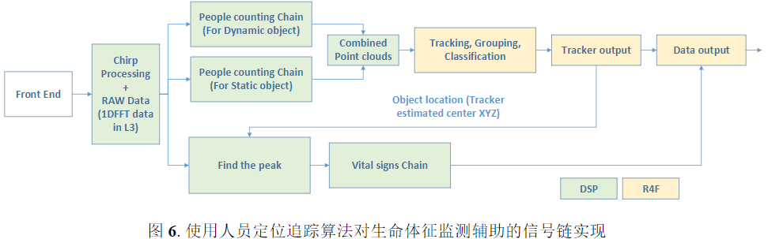

# 动态位置人员生命体征检测的系统实现方法
## 摘要
毫米波雷达技术是通过对人体生命活动中带来的胸腔位置波动进行探测，从而估算出被测人员的生命体征情况。

而在复杂的家居及办公室场景，人员的位置及角度往往不是处于一个理想的状态，单独的生命体征监测程序较难获得一个可靠的信息输出。

本应用手册提出了使用人数统计及人员定位的方式，对被测人的位置（角度及距离）进行初步的跟踪，待被测人进入静止状态后，再使用生命体征监测的算法，对局部区域进行搜索及分析，从而获得了动态位置变化的被测人员的生命体征信息。
## 系统介绍
对于单独的生命体征监测程序而言，更关注在单人近距离的监测情况，它是通过对人体生命活动中带来的胸腔位置波动进行探测，从而估算出被测人员的生命体征情况。而在复杂的家居及办公室场景，人员的位置及角度往往不是处于一个理想的状态，同时周边环境强静态反射的干扰源较多，单独的生命体征监测程序较难获得一个可靠的信息输出。本应用手册提出了使用人数统计及人员定位的方式，对被测人的位置（角度及距离）进行初步的跟踪，待被测人进入静止状态后，再使用生命体征监测的算法，对局部区域进行搜索及分析，从而获得了动态位置变化的被测人员的生命体征信息。
## 方案介绍
### TI驾驶员生命体征监测参考设计方案介绍
如下图所示，每50ms为一帧，每次测量一组数据，通过慢时间积累N个帧的数据后，即可在感兴趣的距离点上获取到随时间变化的相位变化情况，这个相位变化情况及反映了被测人的体表振幅变化（由生理活动中的呼吸及心跳产生）。

得到体表振幅变化曲线后，选取合适的滑动窗口，TI参考设计中使用512帧的数据进行估算，即是25.6s的滑动窗口，对此相位信息进行相关滤波处理，对于呼吸及心跳的估算，分别使用两组不同截止频率的带通滤波器将呼吸及跳的信号波形滤出，并使用FFT或峰计数等方法得到被测人的呼吸及心跳值。

## TI乘员检测及生命体征监测参考设计方案介绍
TI乘员检测及生命体征监测参考设计（TI参考设计，链接：TIDEP-01001 -车辆乘员检测参考设计）是为了在实现车载乘员检测的基础上，对前排（驾驶位及副驾驶位）的人员进行生命体征的监测。在章节2.1使用的算法中，依靠距离差别来区分两个被测目标，要求两个目标的距离差异大于系统的距离分辨率，在IWR6843平台中，这个距离分辨率最佳可以做到3.75cm，即是如果两个目标如果距离雷达的距离差小于3.75cm，那么两个目标的生理活动引发的体表微动情况就会互相模糊，互相干扰。

## 使用人员定位追踪算法对生命体征监测辅助定位的方案介绍
此方法是基于人数统计及人员定位的参考设计软件框架，在通用的人数统计链路中，DSP底层算法同时获取动态目标及静态目标的4D点云信息，ARM核心拿到4D点云信息后，使用追踪算法对运动特性一致的目标进行聚类，从而估计出不同目标的具体位置，此位置即是通用人数统计的输出信息，本应用手册在此基础上，将ARM核心运算完成后的追踪结果（人员中心位置信息）反馈给到DSP中的生命体征监测链路以做进一步的分析。本文所描述的方法，使用了动态人员定位作为框架，在获得人员位置的坐标后，动态选择该区域进行生命体征信号的提取与追踪，可优化复杂使用环境下的生命体征监测难以准确抓取到目标的情况。
