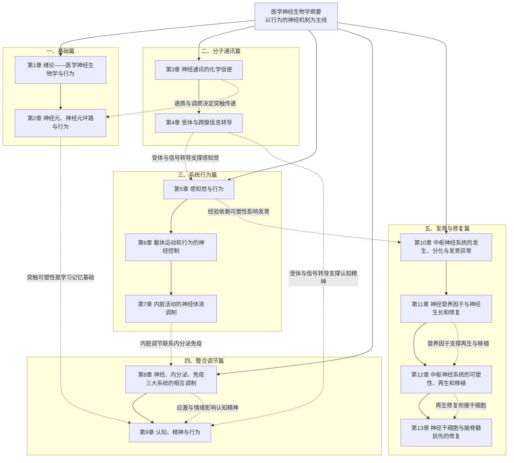

# 医学神经生物学纲要 · 学习总览

## 1. 书籍简介

本书以**行为的神经机制**为主线，弱化细胞与分子生物学中偏理论的内容，突出神经生物学与医学临床问题的结合；在编排上打破传统以感觉、运动系统为主体的写法，把相关内容按**反射行为、随意行为、认知行为、意识行为**重新组织，以提高易读性与应用性。全书共13章，形成“神经元与环路基础 → 递质受体分子通讯 → 系统行为控制 → 神经内分泌免疫与认知精神整合 → 发育、修复与再生”的递进结构，兼顾机制解释、系统整合和临床转化。

## 2. 知识体系思维导图

图中实线表示“基础—深化—应用”的主干关系，虚线表示跨章关键关联。

## 3. 章节模块概览

### 一、基础篇：第1—2章

包含第1章「绪论——医学神经生物学与行为」和第2章「神经元、神经元环路与行为」。该模块建立全书坐标：先说明神经生物学如何以行为为核心连接基础与临床，再介绍反射环路、多级神经元环路和大脑高级整合中枢。随后落到神经元层面，讲清静息电位、动作电位、突触传递、局部环路整合以及胶质细胞等微环境组分。核心任务是让读者在进入分子与系统内容前，先形成“从单个神经元到行为环路”的整体框架。

### 二、分子通讯篇：第3—4章

包含第3章「神经通讯的化学信使」和第4章「受体与跨膜信息转导」。该模块系统梳理乙酰胆碱、儿茶酚胺、5-羟色胺、兴奋性与抑制性氨基酸、一氧化氮、神经肽和阿片肽等化学信使的合成、代谢、受体与投射。进而从受体分类、G蛋白偶联受体、离子通道直接偶联受体，到第二信使系统和信号转导网络的相互作用，解释“递质如何变为细胞反应”。它是全书最基础的“分子语法”，也是理解后续药理、感知、运动和认知功能的共同语言。

### 三、系统行为篇：第5—7章

包含第5章「感知觉与行为」、第6章「躯体运动和行为的神经控制」和第7章「内脏活动的神经体液调制」。该模块把分子通讯原理放进真实行为：第5章讲视觉、听觉、痛觉及其调制；第6章从脊髓反射、节律性运动、姿势平衡讲到随意运动的小脑与基底神经节控制；第7章覆盖内脏感觉、脊髓—脑干反射、下丘脑整合及心血管和局部器官的神经体液调节。三者共同构成“感觉输入—中枢整合—运动或内脏输出”的系统行为闭环。

### 四、整合调节篇：第8—9章

包含第8章「神经、内分泌、免疫三大系统的相互调制」和第9章「认知、精神与行为」。该模块提升整合层级：第8章把神经、内分泌、免疫看作互相联系、互相调制的三大系统，重点讨论应激、情绪和神经内分泌免疫环路；第9章聚焦语言、学习记忆、精神情感和睡眠觉醒的脑功能定位与分子机制。该模块体现本书“由简单行为到复杂精细行为”的最终收敛，是把基础机制转化为医学解释的关键。

### 五、发育与修复篇：第10—13章

包含第10章「中枢神经系统的发生、分化与发育异常」、第11章「神经营养因子与神经生长和修复」、第12章「中枢神经系统的可塑性、再生和移植」和第13章「神经干细胞与脑脊髓损伤的修复」。该模块完成从“发育形成”到“损伤修复”的闭环：先讲神经管、神经嵴、神经元迁移和常见发育异常，再讲神经营养因子、神经可塑性与再生、中枢移植，最后落到神经干细胞与脑脊髓损伤修复。它是连接发育生物学、再生医学与神经系统疾病的转化入口。

## 4. 章节间的关键联系

1. **递质/受体 → 感知觉与认知**：第3—4章建立的递质—受体—第二信使系统，是第5章感觉信号编码与调制、第9章学习记忆和精神情感的分子基础；同一递质或受体在不同脑区可产生不同行为效应。
2. **神经元环路/突触可塑性 → 学习记忆**：第2章的突触传递与局部环路整合，为第9章短时、长时记忆和海马长时程增强提供微观机制；可塑性是记忆存储的核心逻辑。
3. **受体信号转导 → 神经内分泌免疫调节**：第4章的信使系统交互与网络联系，支撑第8章免疫细胞上的递质/激素受体、应激—下丘脑—垂体轴以及神经—免疫反馈环路。
4. **内脏神经体液调制 → 应激与情绪**：第7章的内脏调节通路向上整合进入第8章神经内分泌免疫网络，再与第9章精神情感活动形成“躯体—自主神经—情绪”交叉联系。
5. **感知经验 → 发育可塑性**：第5章的感觉经验依赖性修剪和视听觉发育，与第2章、第12章的可塑性共同说明“经验如何塑造环路”，并衔接第10章的神经系统发育。
6. **神经营养因子 → 再生与移植**：第11章的神经营养因子为第12章轴突再生和中枢移植提供分子支持；第12章的再生、可塑性研究又自然导向第13章神经干细胞修复。
7. **发育异常 → 修复再生**：第10章的中枢神经系统发育异常构成疾病起点，第11—13章则提供从保护、再生到细胞移植的修复策略，形成“发生—损伤—修复”的完整链条。

## 5. 学习路径建议

| 阶段 | 章节 | 定位与建议 |
|---|---|---|
| 第一阶段：基础必修 | 第1、2、3、4章 | 必须按顺序掌握。先建立“行为—环路”观，再攻克递质、受体和跨膜信号转导，这是后续所有内容的共同底座。 |
| 第二阶段：系统行为并行 | 第5、6、7章 | 在基础完成后可并行学习。感觉、运动、内脏三章相对独立，可结合解剖生理背景相互印证。 |
| 第三阶段：整合调节 | 第8、9章 | 建议在系统行为篇之后再学，尤其是第8章依赖第7章，第9章依赖第2—4章和第5章基础。 |
| 第四阶段：发育与修复 | 第10、11、12、13章 | 最后集中学习。可先复习第2章、第4章的可塑性内容，再把发育、营养因子、再生与干细胞串成一条转化医学线。 |

## 6. 高效学习方法

1. **制作“递质—受体—效应”速查表**：以第3章各化学信使为行，以第4章受体类型、离子通道/第二信使、主要脑区投射、相关行为和临床疾病为列，逐行补齐；这张表会成为串联感知、运动、认知和药理问题的“索引卡”。
2. **结合临床案例反推机制**：给每个系统模块找一个疾病原型，如帕金森病对应基底神经节运动控制、阿尔茨海默病对应胆碱能与记忆、精神分裂症对应多巴胺与谷氨酸失衡、脑卒中对应神经修复；由症状倒推受损环路和递质系统，能显著提升记忆与迁移能力。
3. **手绘通路图并标注关键递质**：分别绘制感觉、运动、内脏—内分泌免疫、睡眠觉醒和神经修复通路，在每一级突触旁标注递质与受体，再用不同颜色区分兴奋、抑制和调质；边画边口述“输入—整合—输出”，比单纯阅读更能暴露知识盲点。
