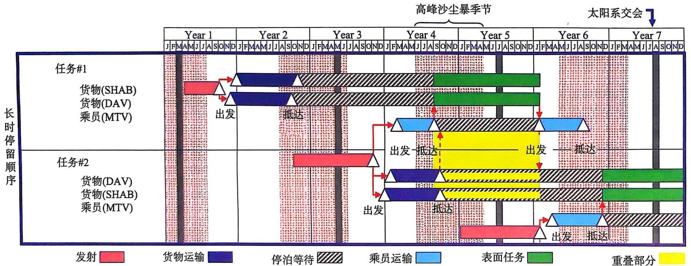
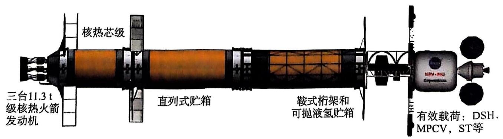
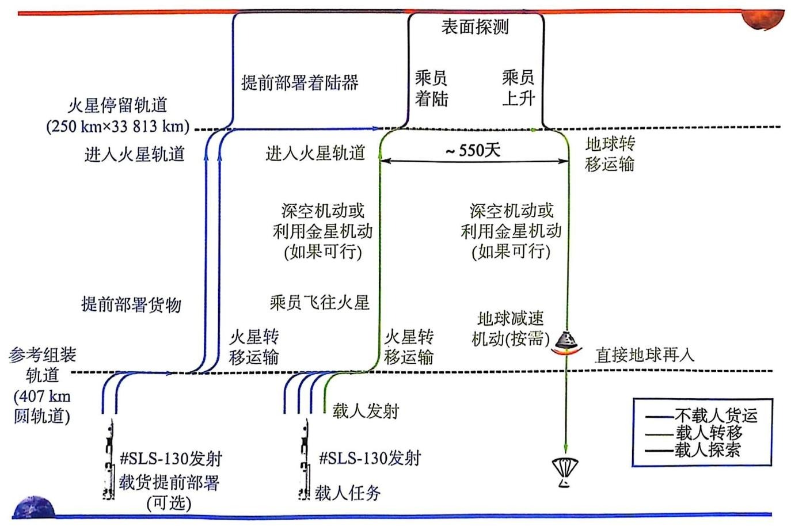

# 载人火星探测模式及其航天运输系统方案发展情况
|国家或地区|时间|提出方|方案情况|
|--|--|--|--|
|美国|1947 - 20世纪50年代|冯·布劳恩|70人登陆火星设想想议|
|美国|20世纪50年代 - 60年代|通用原子公司|核脉冲推进，向火星轨道发送800 t有效载荷|
|美国|20世纪60年代 - 70年代|美国国家航空航天局（NASA），福特航空，通用动力公司和洛克希德公司|EMPIRE（Early Manned Planetary - Interplanetary Roundtrip Expedition）项目，发射八枚土星V火箭并进行组装|
|美国|1981 - 1996|劳伦斯·利弗莫尔国家实验室、科罗拉多大学等|提出原位资源利用，分步探测（先探测火卫二）|
|美国|1989|NASA|NASA太空探索计划，作为国际空间站的后续任务议案；提议先返回月球，建立常设基地，然后前往火星|
|美国|20世纪90年代 - 21世纪00年代|NASA|设计参考任务（Design Reference Mission，DRM），开发了几种概念级别的载人火星探索架构|
|美国|2010 - |美国政府，NASA|奥巴马时代提出将执行一次载人火星飞行任务，在21世纪30年代中期环火探测，后续再着陆 特朗普政府时代提出“从月球到火星”计划，分三个阶段完成，其中第二步载人探月，第三步21世纪30年代载人火星探测 拜登政府时代提出在2040年前完成载人火星探测任务|
|美国|2016 - |洛克希德·马丁|火星营地计划，建立火星轨道空间站，最早2028年出发|
|美国|2016 - |SpaceX|利用超重 - 星舰实现载人火星移民设想，最早2024年出发|
|中国|20世纪90年代 - |国家航天局、相关研究机构等|提出一些未来载人火星探测设想，开展了一定的学术研究分析工作|
|苏联/俄罗斯|20世纪50年代 - 60年代|Mikhail Tikhonravov|火星飞行综合体（Martian Piloted Complex）计划，利用N1火箭或星际运载器|
|苏联/俄罗斯|2005|科罗廖夫能源火箭航天公司|提出《2006 - 2030年俄罗斯载人航天发展规划构想》，2030年开展载人火星探测|
|欧洲|2001|欧洲航天局（ESA）|曙光计划，2033年实现人类登陆火星设想|
|欧洲|21世纪10年代|欧洲相关大学|持续开展载人火星探测任务规划、系统方案和发展路线研究|

## 美国
该文档聚焦载人火星探测航天运输系统，主要介绍美国在这方面的发展情况，涵盖NASA设计参考任务、“从月球到火星”计划、洛克希德·马丁公司火星营地、SpaceX星际运输系统以及其他研究情况，涉及任务背景、模式、运输系统及部分研制进展等内容。

1. **NASA设计参考任务**
    - **任务背景**：DRM系列方案由NASA约翰逊航天中心于20世纪90年代提出，DRA 5.0是最新版，以SLS运载火箭和猎户座飞船为基础，设计约900天的载人火星探测任务，为未来火星探测提供参考。
        - 在文档所涉及的航天领域内容中，DRA指的是Design Reference Architecture（设计参考架构） ，是美国国家航空航天局（NASA）载人火星探测相关研究中的重要概念。
            - **DRA 5.0核心地位**：DRA 5.0是NASA一系列火星参考任务中的关键版本。它详细规划了人类首次登陆火星的具体方式，为后续的火星探测任务搭建了基础框架。在运输系统方面，通过对核热推进与化学推进等多种方案进行深入分析，确定了载人和载货地火转移级的首选推进方式为核热推进，同时保留化学推进/大气捕获作为备选，这为火星探测任务的动力系统选择提供了科学依据。
            - **任务模式创新**：DRA 5.0在任务模式上有诸多创新。它采用合式轨道，使航天员能在6个月内抵达火星，并在火星表面停留18个月（约550天），然后经过6个月的星际航行返回地球，总任务时间约900天。“分批次发射”即人货分离的方案是其一大亮点，货物采用低能量轨道提升有效载荷运载效率，航天员采用高能量轨道减少宇宙辐射危害，还运用原位资源利用技术生成火星上升推进剂，有效减小了任务总质量和着陆器规模 。 
    - **任务模式**：采用合式轨道，人货分离分批次发射。载货转移级提前两年发射，载人地火单程飞行约174 - 201天，火星表面停留约550天。
    - **运输系统**：载人和载货地火转移级首选核热推进，载人地火转移级初始质量356.4t，载货地火转移级246.2t，载人级有防辐射措施和太阳电池翼。
2. **NASA“从月球到火星”**
    - **任务背景**：奥巴马政府提出2030年载人火星探测计划，特朗普和拜登政府延续，实施阿尔忒弥斯计划，将月球轨道空间站LOP - G作为火星探测中转站。
    - **任务模式**：围绕低地球轨道、月球和火星开展任务，如促进商业航天、提升月球探测能力、发展火星探测技术等。
    - **运输系统相关设施**：LOP - G由居住舱、能源和推进模块等组成，能支持30 - 60天载人任务，为火星探测提供支持。
3. **洛克希德·马丁公司火星营地**
    - **任务背景**：2016年提出火星营地概念，探索十年内登陆火星可行性，执行多项火星相关探测任务。
    - **任务模式**：利用现有技术分批发射组件，在轨组装火星轨道空间站，后续使用可重复使用着陆与上升器。
    - **运输系统**：包括猎户座、SLS、居住舱、太阳能电推进系统、火星着陆与上升器等，为任务提供保障。
4. **SpaceX星际运输系统**
    - **任务背景**：SpaceX目标是送人类上火星，提出星际运输系统概念，超重 - 星舰是重点研发项目。
    - **任务模式**：超重 - 星舰人货合运，经多次在轨加注前往火星，利用原位资源利用技术返回，具备多种优势。
    - **运输系统**：由超重和星舰组成，采用液氧甲烷推进，介绍了动力、结构、防热、电气系统等，不断改进。
    - **研制进展**：从2018年起研制多个系列试验样机并试飞，不断改进工艺和性能，向实现目标推进。
5. **其他研究情况**：火星协会罗伯特·祖布林推动直击火星计划，主张用现有技术登陆火星，利用火星资源降低成本，该计划被NASA部分采用，但存在技术风险 。 
## 中国
## 俄罗斯
## 欧洲
## 小结