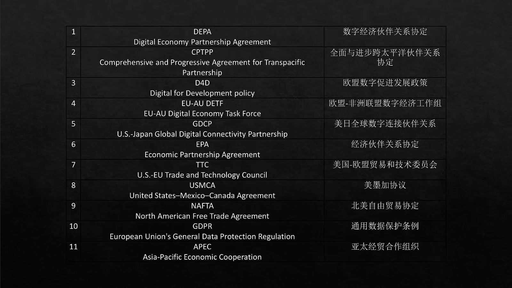
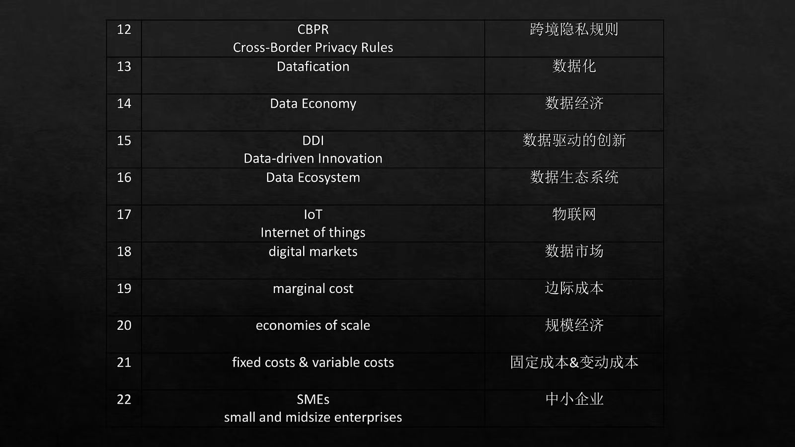
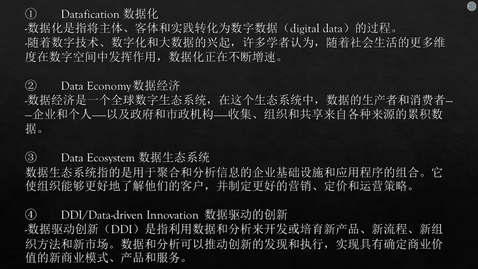
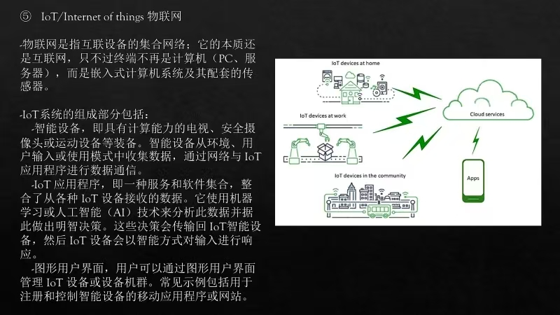
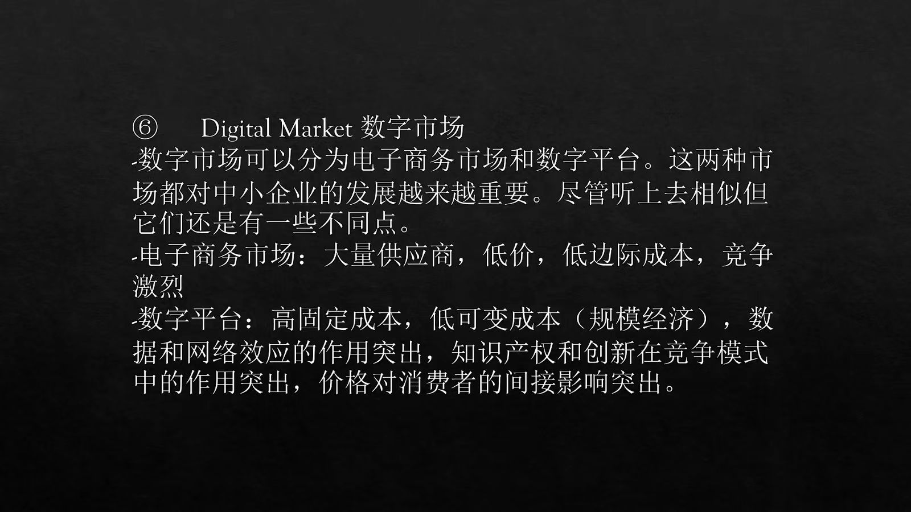
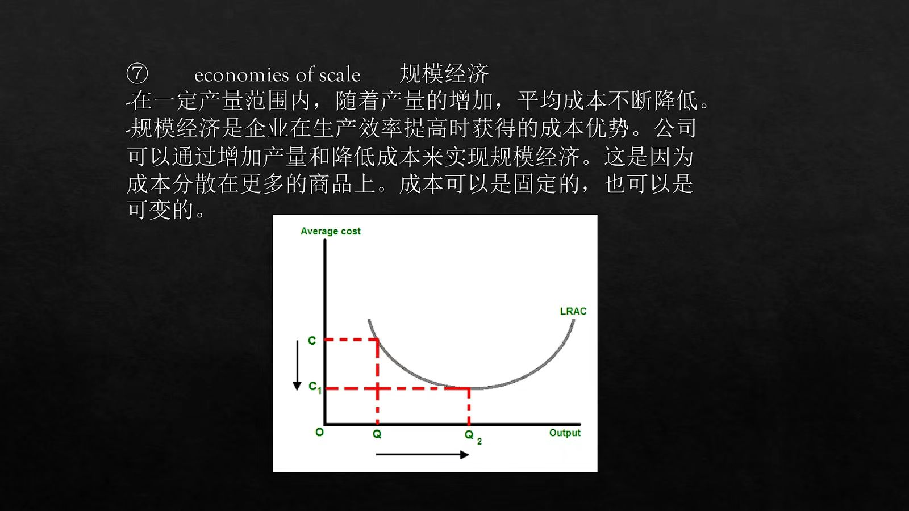
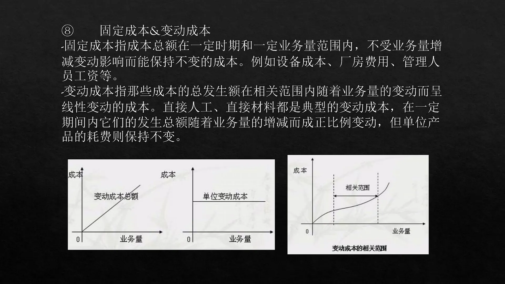
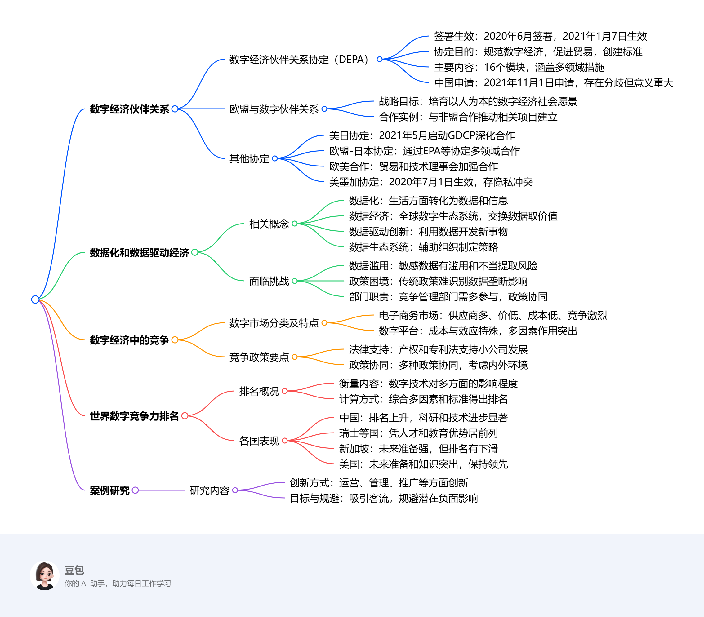

# Eleventh Class: 数字经济伙伴关系数据化和数据驱动经济数字全球格局中的竞争

## 数字经济伙伴关系
1. **数字经济伙伴关系协定（DEPA）**
    - **基本信息**：2020年6月由新加坡、智利和新西兰签署，2021年1月7日生效。这是世界首个“只有数字”的贸易协议，目的是规范数字经济相关问题，促进数字贸易，创建国际标准。
    - **主要内容**：包含16个模块，涵盖商业和贸易便利化、数字产品处理、数据问题等多个方面。例如，在促进端到端数字贸易上，涉及数字身份、无纸化贸易、电子发票和电子支付等措施；在启用可信数据流方面，注重个人数据保护、开放政府数据等；还涉及建立数字系统信任，如规范人工智能使用、保护在线消费者等。
    - **中国与DEPA**：2021年11月1日，中国正式申请加入DEPA。尽管中国与DEPA在跨境数据流动、数据及相关设施本地化、数据知识产权、非歧视待遇等方面存在分歧，但加入DEPA对中国提升在数字经济领域的地位具有重要意义。
2. **欧盟与数字伙伴关系**
    - **战略目标**：通过欧盟数字战略和新的数字伙伴关系，培育以人为本的数字经济和社会愿景，解决数字鸿沟问题，促进公平和负责的数字经济发展。
    - **合作实例**：与非洲联盟合作，2019年欧盟 - 非盟数字经济特别工作组联合起草报告，推动建立了“欧盟 - 非盟数字转型伙伴关系”和“欧盟 - 非盟数据旗舰”项目。
3. **其他协定**
    - **美日协定**：2021年5月27日，美日启动全球数字连接伙伴关系（GDCP），深化两国在数字经济和下一代数字技术方面的合作。
    - **欧盟 - 日本协定**：自2019年起，欧盟和日本通过《经济伙伴关系协定》（EPA）及《战略伙伴关系协定》进行多领域合作，包括数据流动、互联网安全等。
    - **欧盟 - 美国合作**：欧盟 - 美国贸易和技术理事会致力于加强在贸易和技术问题上的合作，协调双方行动。
    - **美墨加协定（USMCA）**：2020年7月1日生效，在数据传输和隐私保护方面与欧洲隐私法存在冲突。
## 数据化和数据驱动经济
1. **相关概念**
    - **数据化**：是一种将生活各方面转化为数据，进而转化为信息，形成新价值形式的技术趋势。
    - **数据经济**：属于全球数字生态系统，其中数据被收集、组织和交换，以从积累的信息中获取价值。
    - **数据驱动创新（DDI）**：利用数据和分析开发或培育新产品、流程、组织方法和市场。
    - **数据生态系统**：由用于聚合和分析信息的企业基础设施和应用程序组成，帮助组织了解客户，制定营销策略等。
2. **面临挑战**
    - **数据滥用问题**：存在对消费者和商业敏感数据的滥用和不当提取风险。
    - **竞争政策困境**：传统竞争政策难以识别数据垄断对消费者的负面影响，数字时代需要重新思考竞争政策。
    - **管理部门职责**：竞争管理部门需更多参与，竞争政策应与产业、宏观经济和外汇政策相结合。
## 数字经济中的竞争
1. **数字市场分类及特点**
    - **电子商务市场**：具有大量供应商、低价、低边际成本、竞争激烈的特点。
    - **数字平台**：呈现高固定成本、低可变成本（规模经济），数据和网络效应突出，知识产权和创新重要，价格对消费者间接影响大等特点。
2. **竞争政策要点**
    - **法律支持**：适应数字经济的产权和专利法对支持小型公司发展至关重要。
    - **政策协同**：保证技术发展需要多种政策协同，竞争政策应综合考虑内部和外部环境，加强国际竞争当局的合作。
## 世界数字竞争力排名
1. **排名概况**：IMD世界数字竞争力排名用于衡量各国采用和探索数字技术对政府实践、商业模式和社会转型的影响程度。排名综合硬数据和调查反馈，由知识、技术、未来准备度三个主要因素及9个子因素、52个标准计算得出。
2. **各国表现**
    - **中国**：排名持续上升，在科学研究和技术方面进步明显，4年内从第30位跃升至第15位。
    - **瑞士和北欧国家**：凭借人才优势和在教育、培训方面的出色表现名列前茅。
    - **新加坡**：未来准备度表现强劲，但因技术和知识方面的下降，与2020年相比排名有所下滑。
    - **美国**：在未来准备和知识方面表现突出，保持领先地位。
## 案例研究
1. **研究内容**：以冷门博物馆为例，探讨在运营、管理、推广等方面的创新方式，以及如何实现吸引客流量的目标和规避潜在负面影响。 

<iframe src="https://naimore3.github.io/Naimore3-s-Learning-Notes/课程笔记/2025寒假/PBL数字经济与智能金融/Eleventh_Class_助教课5/Eleventh_Class_助教课5.pdf" width="100%" height="800px" style="border: none;"></iframe>