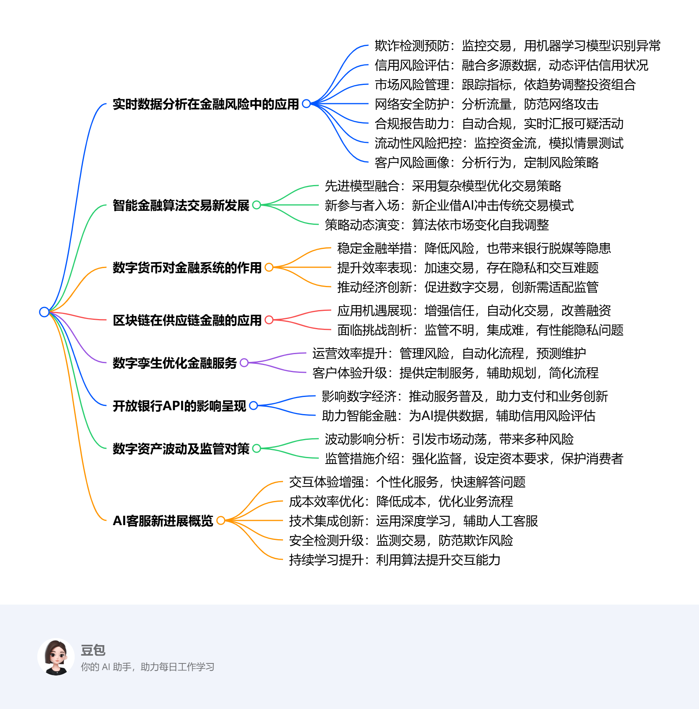

# Fifteenth Class： 教授课7互动直播课
## Real - time Data Analytics in Financial Risk Management
- **Fraud Detection and Prevention**: Financial institutions can monitor transactions in real - time to spot abnormal patterns and unauthorized access. Machine learning models analyze large volumes of transaction data instantaneously to flag potential fraud.
- **Credit Risk Assessment**: Unlike traditional credit scoring models relying on historical data, real - time analytics incorporate alternative data sources like social media activity, mobile payments, and spending habits. This enables lenders to assess creditworthiness dynamically and reduce default risks.
- **Market Risk Management**: Real - time analytics help track market volatility, liquidity risks, and macroeconomic indicators. AI - driven predictive analytics adjust portfolios in response to emerging trends, proactively mitigating market risks.
- **Cybersecurity Threats Mitigation**: AI - powered tools analyze network traffic to detect anomalies and prevent cyberattacks. Behavioral analytics identify insider threats or compromised credentials through unusual access patterns.
- **Regulatory Compliance and Reporting**: Automated compliance systems powered by real - time data minimize human errors and ensure adherence to evolving regulations. Real - time reporting tools assist regulatory bodies in tracking suspicious activities promptly.
- **Liquidity and Operational Risk Management**: Continuous monitoring of cash flows, asset movements, and liabilities helps maintain optimal liquidity. AI - driven risk models conduct scenario analysis and stress testing for better preparation against economic downturns.
- **Customer Risk Profiling**: Real - time behavioral analytics are used to personalize risk management strategies. Credit limits, investment recommendations, and insurance pricing can be adjusted based on customers' real - time financial behavior.

## AI and Machine Learning in Algorithmic Trading
- **Integration of Advanced AI Models**: Financial institutions are increasingly adopting sophisticated AI models. For example, Reddit partnered with Intercontinental Exchange to develop financial data and analytics products, leveraging user - generated content to improve financial market analysis and investment decisions.
- **Emergence of New Market Players**: The algorithmic trading landscape sees new players like Chinese startup DeepSeek. It has developed AI models that perform comparably to US competitors at a lower cost, highlighting differences among AI innovators.
- **Evolution of Trading Strategies**: AI and ML are used to create more adaptive and efficient trading strategies. Machine learning enables trading algorithms to learn from new data, recognize novel patterns, adjust strategies in real - time, and better predict market movements.

## Impact of Digital Currencies on the Financial System
- **Financial Stability**
    - **Positive Impacts**: CBDCs reduce counterparty risk by minimizing the need for intermediaries, enhance monetary policy transmission as central banks can directly issue and implement policies, and promote financial inclusion by providing banking services to the unbanked.
    - **Potential Risks**: They may cause disintermediation of banks if people shift deposits, leading to reduced lending ability. Bank runs could be exacerbated during crises as depositors move funds to CBDCs. Also, digital currencies increase cybersecurity risks to financial infrastructure.
- **Financial System Efficiency**
    - **Enhancements**: Digital currencies enable faster and cheaper cross - border transactions, offer greater transparency (especially blockchain - based ones), and support smart contracts and programmability for automated and conditional transactions.
    - **Challenges**: Government - issued digital currencies may raise privacy concerns, and different countries' CBDCs may face interoperability issues for seamless cross - border transactions.
- **Role in the Digital Economy**: They encourage digital transactions, reducing reliance on cash. CBDCs and decentralized digital currencies drive fintech innovation, such as in DeFi and tokenized assets. However, governments need to adapt regulations to balance innovation and security.

## Blockchain in Supply Chain Finance
- **Opportunities**
    - **Enhanced Transparency & Trust**: Blockchain's immutable ledger ensures data integrity, reducing fraud risks. Real - time visibility into transactions builds trust among supply chain stakeholders.
    - **Faster and Automated Transactions**: Smart contracts automate payment settlements, streamlining financing processes and reducing reliance on intermediaries.
    - **Improved Access to Finance**: Small suppliers can secure financing based on blockchain - verified transactions, and lenders gain confidence from verified data.
    - **Reduced Costs**: It eliminates paperwork and manual reconciliation, lowering transaction costs by cutting out intermediaries.
    - **Better Risk Management**: Real - time tracking reduces counterparty risks, and historical blockchain data aids in better credit risk assessments.
- **Challenges**
    - **Regulatory Uncertainty**: Compliance varies across jurisdictions, creating legal complexities. There is a need for global standardization of blockchain regulations.
    - **Integration with Legacy Systems**: Many enterprises use traditional ERP systems that are difficult to integrate with blockchain. High implementation costs and technical expertise are required.
    - **Scalability and Performance**: Public blockchains face transaction speed limitations, and high processing power and storage demands increase costs.
    - **Data Privacy Concerns**: Balancing transparency with confidentiality is challenging. Sensitive business data exposure risks require secure permissioned blockchain solutions.
    - **Adoption Challenges**: Coordination among multiple supply chain stakeholders is needed. There is resistance to change from traditional financial institutions and suppliers.

## Digital Twins in Financial Institutions
- **Operational Optimization**
    - **Real - Time Risk Management & Fraud Detection**: Digital twins can simulate financial transactions, detect anomalies, and predict fraudulent activities. AI - driven twins dynamically assess risk exposure for assets, loans, and investments.
    - **Process Automation & Efficiency**: Banks can create digital twins of operational workflows to identify inefficiencies. For example, ATM network and branch operations can be optimized.
    - **Predictive Maintenance for IT Infrastructure**: Digital twins monitor data centers, cloud services, and cybersecurity infrastructure to predict failures and prevent downtime, facilitating proactive threat detection.
- **Enhanced Customer Experience**
    - **Personalized Financial Products & Services**: Digital twins of customer profiles simulate financial behaviors to offer tailored banking solutions. AI - based twins analyze spending habits for personalized offers.
    - **Real - Time Financial Planning & Advisory**: Virtual models simulate different financial scenarios, enabling customers to make data - driven decisions. Banks can offer dynamic financial advice using real - time transactional and market data.
    - **Streamlining Customer Onboarding & KYC**: Digital twins enhance KYC and AML processes by digitally mirroring customer identities, reducing onboarding time and enhancing fraud prevention.

## Open Banking APIs in the Digital Economy and Intelligent Finance
- **Implications for the Digital Economy**
    - **Democratization of Financial Services**: Open banking APIs allow new fintech entrants to offer banking services without traditional infrastructure, promoting competition, better services, lower fees, and greater financial inclusion.
    - **Seamless Payments & Embedded Finance**: APIs integrate banking into various platforms, enabling real - time payments and BNPL solutions, and facilitating the shift toward contextual finance.
    - **Data Monetization & New Business Models**: Banks and fintechs leverage open banking data to offer targeted financial products, creating opportunities for subscription - based finance, revenue - sharing models, and AI - driven personalized services.
    - **Global Financial Ecosystem Expansion**: Standardized APIs support cross - border transactions and remittances, expanding the global financial ecosystem.
- **Implications for Intelligent Finance**
    - **AI - Powered Personalized Finance**: Open APIs provide AI - driven financial advisors with real - time access to user data, enabling dynamic and personalized financial services.
    - **Enhanced Credit Scoring & Risk**: Open banking data can be used to improve credit scoring models and risk assessment, although the specific details of how this is achieved are not fully elaborated in the original text.

## Real - Time Fluctuations in Digital Asset Markets
- **Financial Stability Impacts**
    - **Market Volatility & Systemic Risk**: Extreme price volatility in cryptocurrencies can lead to sudden market crashes. If widely held by financial institutions or investors, it can trigger broader financial instability, as shown by the collapse of major platforms like FTX.
    - **Liquidity Risks**: Rapid fluctuations can cause liquidity crises, making it difficult for investors to exit positions without significant losses. Stablecoins, as liquidity providers, can depeg under stress, worsening instability.
    - **Contagion Effects**: If banks and financial institutions increase exposure to crypto assets, losses in digital markets can spill over into traditional finance, such as through loans backed by crypto collateral. High correlations between crypto and equity markets during stress periods suggest growing systemic linkages.
- **Investor & Consumer Protection**: Retail investors, lacking expertise in volatile markets, face significant financial risks. Scams, frauds, and market manipulations further threaten investor confidence.
- **Regulatory Policy Responses**
    - **Market Oversight & Supervision**: Governments and regulators are increasing oversight of exchanges. Transparency requirements and audit mandates for stablecoins are being introduced to mitigate systemic risks.
    - **Capital & Liquidity Requirements**: Regulators are exploring capital buffer requirements for financial institutions dealing with crypto assets, similar to traditional banking regulations. Rules on leverage and derivatives trading are being tightened.
    - **Consumer Protection Laws**: Policies mandating clearer risk disclosures and restrictions on misleading advertising in crypto markets are being strengthened. Some countries have introduced stricter KYC/AML regulations.
    - **Central Bank Digital Currencies (CBDCs)**: Some governments are exploring CBDCs as a more stable alternative to cryptocurrencies, aiming to maintain control over monetary policy while offering digital payment options.
    - **Global Coordination**: Due to the cross - border nature of digital assets, international bodies are pushing for unified regulatory frameworks. The EU's MiCA regulation is an example of comprehensive efforts to standardize.

# # AI - Driven Chatbots and Virtual Assistants in Financial Customer Service
- **Enhanced Customer Interaction**
    - **Personalized Assistance**: Modern chatbots use AI to provide tailored responses. For example, Bank of America's Erica has handled over 50 million client requests, improving customer satisfaction and reducing the workload of human agents.
    - **Efficient Query Resolution**: AI - powered chatbots quickly access and process customer data to answer account - related questions accurately.
- **Cost Reduction and Operational Efficiency**
    - **Lower Operational Costs**: Implementing chatbots can lead to significant cost savings, with banks potentially reducing customer support operational costs by up to 30%.
    - **Streamlined Processes**: Chatbots handle high volumes of routine inquiries, allowing human agents to focus on more complex tasks and increasing overall efficiency.
- **Advanced AI Integration**
    - **Deep Learning Models**: Financial institutions are adopting advanced AI models like BERT to enhance chatbot capabilities, enabling them to handle complex client questions.
    - **Real - Time Agent Assistance**: Some companies have developed systems where AI assists human agents in real - time, reducing the time spent per customer interaction.
- **Improved Fraud Detection and Security**: AI - driven chatbots monitor transactions to detect fraudulent activities, protecting both the institution and its customers.
- **Continuous Learning and Adaptation**: Modern chatbots use machine learning algorithms and natural language processing to learn from previous interactions and improve responses to a wide range of customer inquiries. 

<iframe src="https://naimore3.github.io/Naimore3-s-Learning-Notes/课程笔记/2025寒假/PBL数字经济与智能金融/Fifteenth_Class_教授课7互动直播课/Fifteenth_Class_教授课7互动直播课.pdf" width="100%" height="800px" style="border: none;"></iframe>