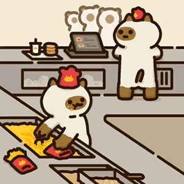
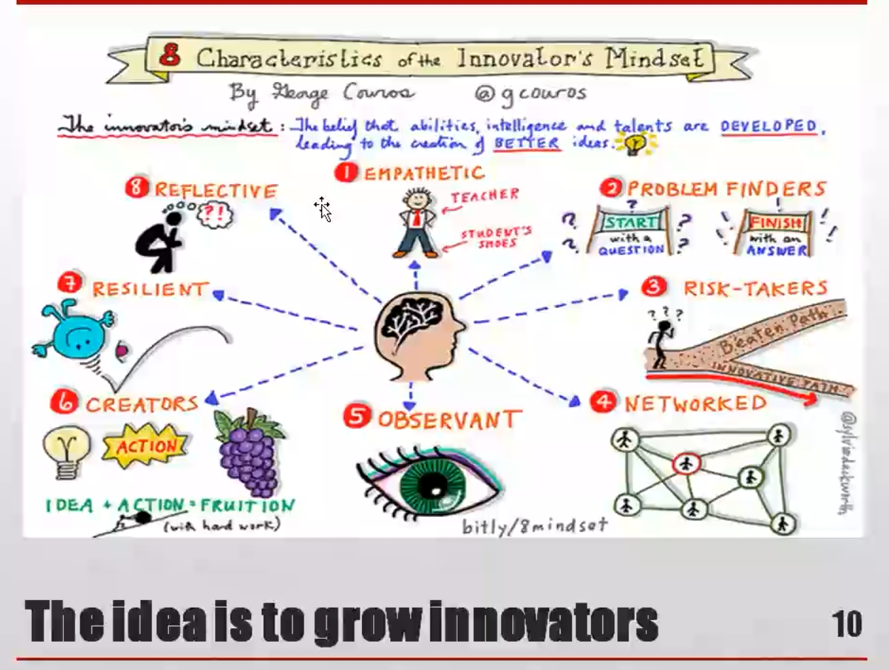
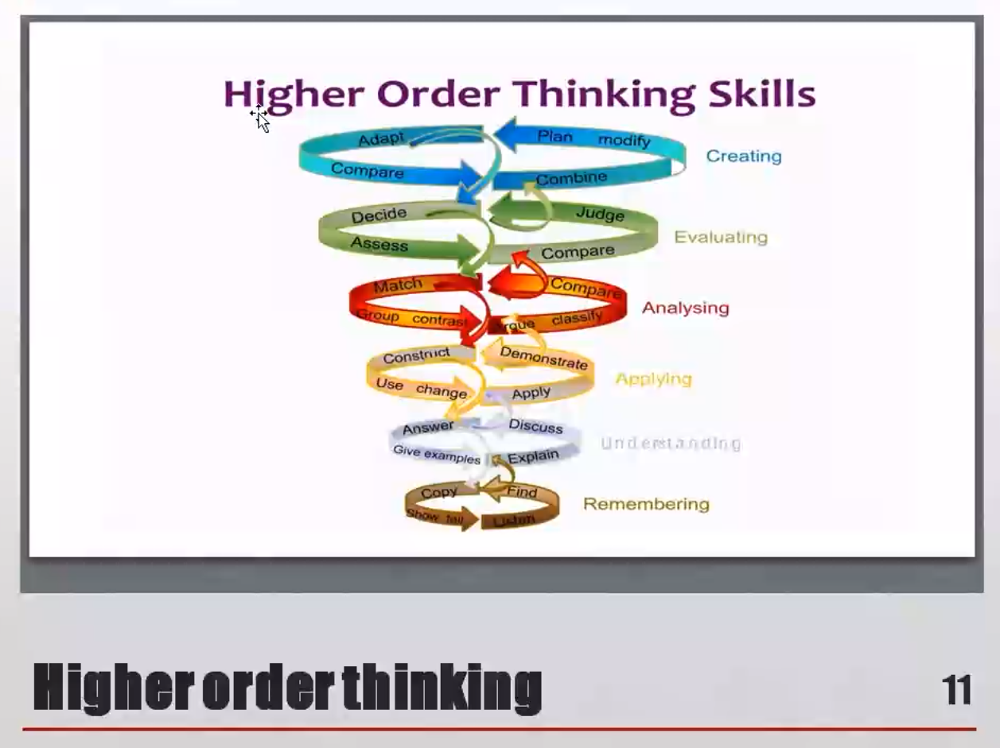

# First Class: PBL教学方法
## Thinking About Teachang and Learning

| |Teacher Centered Learning|Leaner Centered Learning|
|-|-|-|
|Knowledge|Fixed and known|Continually learning|
|Learner|Passive recipient|Active constrctor|
|Students’Minds|Mind like others|One child, one mind|
|Teaching and learning|Faithful transmission, reception|Opportunities to construet knowledge|
|Teacher-student relationships|Authoritarian|Democratic|

## Education for uncertain, diverse, rapidlychanging future
## Challenges in technology,globalization & environment
{align="left" width="35%"}

 - Increasing complexity and uncertainty
 - More individualization and social diversity
 - Expanding economie and cultural uniformity
 - Degradation of the ecosystem services upon which they depend
 - Greater vulnerability and exposure to natural and technological hazards
 - More possibilities and threats with technical advance
## Challenges
 - More and more information is available. but to utilize information solve problems requires creative and self-organized action
 - People must learn
     - To understand the complex world
     - To collaborate, speak up and act for positive change
 - We can call these people "sustainability citizens"(Wals, 2015: Wals and Lenglet, 2016).
## Key competencies for "sustainability citizens"
 - Systems thinking competency{align="right" width="42%"}
 - Anticipatory
 - Normative
 - Strateg1c
 - Collaboration
 - Critical thinking
 - Self-awareness
 - Integrated problem-solving

> Rote learning, multiple-choice,one right answer schooling and exam-based teaching and learning are unlikely to get us there——J Williams
## The ideais to grow innowators

## Higher order thinking

## Traditional and transformed approaches to teaching(as poles)

|Transformed Approach(HIGH AGENCY)||Traditional Approach(LOW AGENCY)|
|-|-|-|
|"Facilitate" learning|>|"Deliver" instruction|
|Student centered|>|Teacher centered|
|Learning anytime/anywhere|>|Classroom learning|
|Personalized, differentiated|>|Standardized approach|
|Do to learn|>|Learn to do|
|Application focused|>|Content focused|
|Develop thinking|>|Looking for the right answer|
|Integrating curriculum|>|Teaching segmented curriculum|
|Active leaming opportunities|>|Passive consumption|

## Traditionalteachingvs student-centered teaching(also as poles)

|In teacher/content/textbook-centered teaching,teacher:|In learner centered teaching,teacher:|
|-|-|
|Starts from teachers  knowledge|Assesses students’ knowledge|
|Follows pre-set curriculum|Addresses issues identified by group,adopts new ideas according to needs, culture of students|
|Delivers lectures usually from front|Practical, participatory,multiple methods|
|Has knowledge, which flows primarily from teacher to student|Has some knowledge, as do students. Information may flow from many directions|
|Has right answer|Helps students discover answers|
|Concerned with right answer|Encourages good questions, challenges to answers|
|Has formal, hierarchical relationship with students|More equal relationship with students based on trust, respect|

## Control and participation
| |Lecturing|Teaching|Facilitation|
|-|-|-|-|
|Control|Teacher has almost total control|Teacher has control but allows students to participate on her terms|All members have some control; teacher has a little more|
|Participation|Teacher participates|Teacher invites students to participate|All participate|