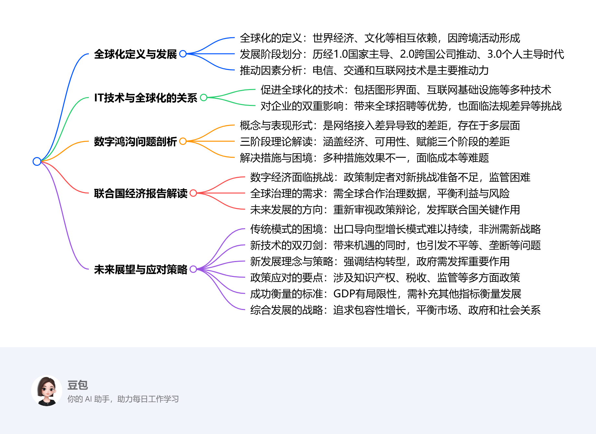

# Fourteenth Class: Digital Globalization Applications and Findings through United Nations Digital Economy Report Future outlook on Digital Economy
## What Is Globalization
- **Definition**: Globalization describes the growing interdependence of the world's economies, cultures, and populations, resulting from cross - border trade in goods and services, technology, and the flows of investment, people, and information. It also refers to the integration of goods, services, and culture among nations.
- **Development Stages**: It has been evolving since the era of European colonization. Friedman defined three eras: Globalization 1.0 (1492 - 1800), centered around countries, shrinking the world from "large" to "medium"; Globalization 2.0 (1800 - 2000), driven by multinational companies, interrupted by two World Wars, shrinking the world from "medium" to "small"; Globalization 3.0 (current era), enabled by the convergence of personal computers, fiber - optic Internet connections, and software, allowing small groups and individuals to go global, shrinking the world from "small" to "tiny".
- **Driving Forces**: Advances in telecommunication and transportation technologies, especially the Internet, have accelerated globalization. The Internet has made all nations seem like neighbors, facilitating global interaction.

## IT Technologies and Globalization
- **Technological Facilitators**: Key IT technologies include the graphical user interface for personal computers, which made computers more accessible; the Internet infrastructure, which turned network communication into a commodity; the open - source movement; mobile technologies; and software that automates and integrates business processes, such as payment processing systems and shipping calculators, enabling people to work together more easily and different software to integrate.
- **Impact on Global Firms**: These technologies have allowed global firms to enjoy advantages like the ability to locate expertise and labor globally, operate 24 hours a day, and access a larger market for their products. However, they also face challenges such as infrastructure differences, labor laws and regulations, legal restrictions, language and cultural differences, international shipping issues, and cultural differences.

## The Digital Divide
- **Concept and Manifestation**: The digital divide refers to the separation between those who can access the global network and those who cannot. It can occur between countries, regions, or neighborhoods. It prevents certain groups, like low - income households, senior citizens, and the undereducated, from fully accessing computer - based resources.
- **Three - Stage Analysis**: Nielsen (2006) proposed dividing the digital divide into three stages. The economic divide is about the affordability of computers and Internet access. Hardware is getting cheaper, and this may not be a major issue in the future. The usability divide exists because technology remains complex, making it difficult for many people to use a computer even if they get it for free. The empowerment divide is the most difficult to solve, as few users truly understand the power of digital technologies and how to fully utilize them.
- **Solutions and Challenges**: Over the years, solutions like "one laptop per child", Wi Max networks, and cyber cafes have had mixed success in bridging the digital divide.

## UN Economy Report Findings
- **Challenges in the Digital Economy**: The world is just beginning to understand the implications of the data - driven digital economy. Policymakers and stakeholders are ill - prepared to handle emerging challenges, many of which are global. International regulation of cross - border data flows has become a major global challenge.
- **Necessity of Global Governance**: A global approach to data governance, including cross - border data flows, is needed to ensure that data benefits many, not just a few, and to address potential negative effects. A global cooperative approach in the digital economy is better than extreme positions on cross - border data flows, aiming for inclusive and sustainable development.
- **Considerations in Regulation**: When designing regulations, it should be noted that data - related risks can come from both the private sector and governments. An international data governance framework should ensure equitable distribution of data - flow gains within and between countries while addressing concerns. There is also a need to reframe and broaden the international policy debate on cross - border data flows, and the United Nations should play a central role in global data governance.

## The Future Outlook
- **Limitations of Export - led Growth Model**: The export - led growth model that brought growth miracles in the 20th century, especially in East Asia, is losing its effectiveness. Manufacturing is facing problems such as productivity exceeding demand growth, vertical disintegration leading to job losses, and a decline in its share in GDP. Africa needs to find alternative strategies as new manufacturing jobs can only absorb a small portion of the new labor force, and the advantage of cheap labor is being eroded by robotization.
- **Impact of New Technologies**: New technologies are a double - edged sword. They offer new opportunities in finance, e - government, knowledge access, and global connectivity, but if not properly regulated, they can lead to more monopolization, inequality, privacy invasion, tax avoidance, and less secure employment. For developing countries, new technologies may make it more difficult to catch up, and issues like on - shoring, lack of trust leading to "splinternet" and a possible new "cold war", and the spread of misinformation are exacerbating the situation.
- **New Thinking about Development**: The gap between developing and developed countries lies not only in resources but also in knowledge and institutions. Development requires structural transformation, which markets alone cannot manage well due to capital market imperfections, externalities, and coordination failures. Thus, the government needs to play an important role. New understandings have led to new strategies, focusing more on policies and institutions, and recognizing the importance of various forms of capital. The Stockholm Statement reflects these new understandings, covering aspects such as inclusive development, environmental sustainability, and the balance of market, state, and community.
- **Developing Countries' Response to Innovation**: New technologies expand possibilities but often lead to more inequality in market equilibrium, and political factors may make it difficult to address this. Innovation usually increases inequality, but if well - managed, it can benefit everyone. However, it is hard to manage well, and the political economy makes it even more difficult. Governments can intervene in the innovation process to promote societal improvements, and industrial and regulatory policies can shape the direction of innovation.
- **Policy Response**: Policy responses include changing IPR rules, taxation, regulation, competition policy, and trade. Self - regulation is ineffective, and competition policy in most developing countries needs to be strengthened. Reforming global rules that limit developing countries, such as ISDS, and rolling back proliferating bilateral trade and investment agreements are also necessary.
- **Benefits and Challenges of New Technologies**: New technologies offer benefits like financial inclusion, potential to raise smallholder agriculture productivity, and possible health and education benefits. However, they also face challenges such as limited success in financial inclusion, greater barriers to entry in platforms, and the spread of disinformation. There are also ongoing concerns about the digital divide.
- **Measurement of Success**: GDP growth is not a good measure of success, especially in Africa. Resource - rich countries may have high GDP but lack structural transformation, and growth may not be sustainable or employment - generating. There are important unobserved aspects of growth and structural transformation, such as the development of human, social, and knowledge capital, and the creation of livable cities. A set of indicators should be used to supplement GDP.
- **Comprehensive Development Strategy**: A comprehensive development strategy is needed, aiming for inclusive growth with inclusive participation, balancing markets, government, and society. It should be based on new understandings of economic and societal transformation and address the challenges of new technologies and the changing global situation.
- **Policy Suggestions**: At the country level, policymakers should think strategically about their country's role in global value chains, address barriers to global flows, invest in human capital, build infrastructure, close the digital divide, create a favorable business environment for the digital economy, protect privacy while maintaining an open Internet, and prioritize cybersecurity. 

<iframe src="https://naimore3.github.io/Naimore3-s-Learning-Notes/课程笔记/2025寒假/PBL数字经济与智能金融/Fourteenth_Class_教授课6/Fourteenth_Class_教授课6.pdf" width="100%" height="800px" style="border: none;"></iframe>