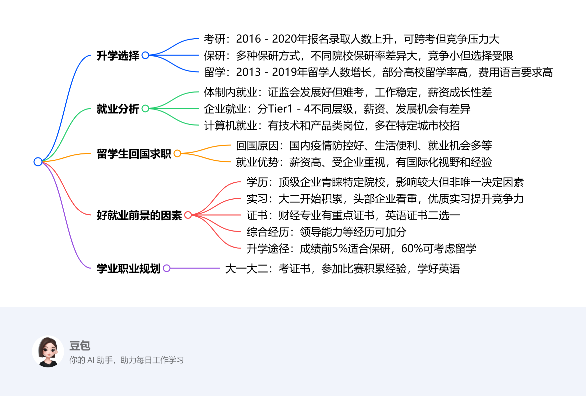

# Seventeenth Class: 升学与就业方向展望
## 升学选择
1. **考研**：2016 - 2020年，研究生报名人数和录取人数均呈上升趋势，但报名增长率和录取增长率有所波动。考研可选择理想学校和跨专业，但竞争对手情况不明，容错率低，且备考过程如在黑屋摸索，成果最后才可见。
2. **保研**：主要基于学习成绩免试推荐，还有支教保研、辅导员保研、特长生免试直推等方式。不同院校保研率差异较大，如清华大学2019届保研率达53% 。保研相对稳定，但选择学校受限。与考研相比，争取保研是和本学院本专业的人竞争，容错率较高，时间被划分为学期，努力成果较易看到。
3. **非大陆地区研究生项目申请（留学）**：2013 - 2019年中国出国留学人数呈增长趋势。部分高校境外留学率较高，如北京师范大学 - 香港浸会大学联合国际学院2020届境外留学率达69.0%。留学能获得国际化视野和海外经历，但需考虑经济成本、语言要求等因素。

## 就业分析
1. **体制内就业 - 证监会**：证监会岗位发展可能性高，但考取难度极大。其优点是工作稳定，有落户等政策优势，起薪不低，但薪资成长性差。
2. **企业就业**：企业就业可分为不同层级。Tier1包括头部对冲与私募基金、互联网战投、顶尖外资投行部等，薪资高且成长性强；Tier2有顶级券商投行部、头部公私募基金、MBB咨询公司；Tier3涵盖顶级券商研究部门、知名私募、知名咨询公司；Tier4包含互联网管培、大型券商等。不同层级企业在薪资、发展机会等方面存在差异。
3. **计算机就业**
    - **技术类岗位**：有软件工程师、硬件工程师、算法工程师等多种岗位。
    - **产品类岗位**：包括产品经理、数据分析师、游戏设计师等。
    - **就业公司**：华为、百度、腾讯等企业是计算机专业常见的就业选择。这些公司校招地点分布在多个城市，百度还在海外城市招聘，且近年大量招聘前沿科技岗位。腾讯招聘工作主要集中在深圳，其他城市相对较少。

## 留学生回国求职
1. **回国原因**：疫情下，留学生回国求职人数逐年增加。主要原因包括国内疫情管控效果好、生活便利、经济恢复好、就业机会多，以及担心国际关系变化、所在国对华人政策不友好等。
2. **就业优势**：海归薪资待遇普遍比国内毕业生高，各大公司看重海归人才质量。海归学历普遍较高，有国外实习或工作经验，了解国际形势，具有全球化视野、优秀学习能力和英语口语能力，就业机会多，岗位较好。

## 获得好就业前景的因素
1. **学历**：顶级企业倾向招聘行业认可度更高院校的学生，如清北华5人、英国G5、港大新国立、美国TOP30院校等。学历虽有重要作用，但也不是决定能否获得好工作的唯一因素，在就业考量中大致占比40%。
2. **实习**：建议从大二开始积累实习经验，头部投行、券商、私募等非常看重实习经历。实习经历丰富的学生在求职中更具竞争力，如在面试CICC投行部时，有更优质实习经历的学生胜算更大。如果大二找不到顶尖实习，可先选择八大四大的IPO审计或二线券商实习，实习在就业考量中占比30%。
3. **证书**：财经专业学生需关注证书，券商投行部看重保代、司考，CPA是加分项，ACCA可提升本科找实习的起点。英语方面，雅思、六级二选一，留学的话刷雅思即可。证书在就业考量中占比15%。
4. **综合经历**：领导能力、奖学金（头部券商基本只看国奖）、逻辑思维能力、比赛经历等综合经历在就业中也有加分作用，综合占比15%。
5. **升学途径选择**：成绩前5%的同学建议保研，有机会冲刺顶尖院校；考研风险较大，部分院校报录比较低。专业成绩前60%的同学，若保研绩点只够本校，可通过合理规划留学申请到不错的学校，以助力进入更高级别的企业。

## 学业职业规划建议
大一大二阶段，可以考取一些证书，积极参与比赛积累经验，如互联网 +、三创、小挑等比赛的国家级奖项很受高校重视，尤其是保研时。同时，要学好英语，有多余时间可以考雅思托福，为未来的升学和就业打下基础。 

<iframe src="https://naimore3.github.io/Naimore3-s-Learning-Notes/课程笔记/2025寒假/PBL数字经济与智能金融/Seventeenth_Class_升学与就业方向展望/Seventeenth_Class_升学与就业方向展望.pdf" width="100%" height="800px" style="border: none;"></iframe>