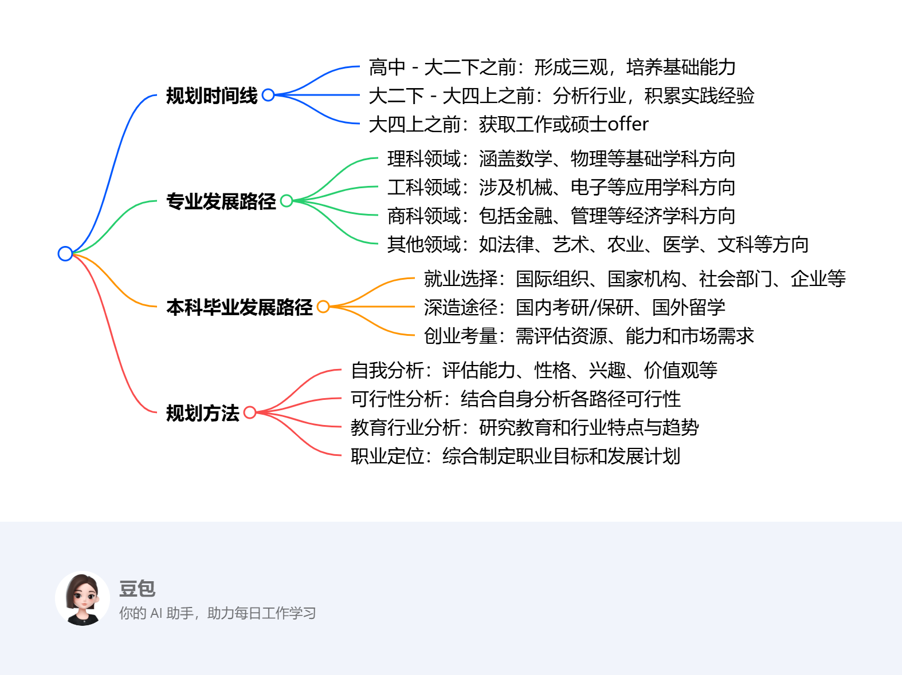

# Sixteenth Class: 个人规划及发展建议
## 个人学业/职业规划的时间线
1. **高中 - 大二下之前**：处于通识博雅教育阶段，在此期间逐渐形成三观，并对各专业产生兴趣，广泛涉猎知识，包括英语学习以及基础专业技能的培养。
2. **大二下 - 大四上之前**：需进行行业分析，在特定领域积累应用实践经验，深度探索个人发展方向，并确定未来毕业之后的选择。
3. **大四上之前**：应拿到工作或硕士offer，为毕业后的发展做好准备。

## 专业发展路径
涵盖理、工、商、法、艺、农、医、文等多个领域，学生可依据自身情况选择适合的专业方向进行深入学习和发展。

## 本科毕业发展路径
1. **就业**：可选择进入不同的领域，如国际组织（INGO、IGO）、国家（政府、人民团体、事业单位）、社会（NPO，包括社会团体、基金会、民办非企业）、市场（各类企业）等。不同领域在工作内容、发展前景、社会地位等方面存在差异，学生需综合考虑自身兴趣、能力和职业目标进行选择。
2. **深造**
    - **国内深造**：考研/保研需要关注专业知识的积累，提前准备面试，同时了解目标专业的学术圈子，可适当进行少量实习。该路径竞争较为激烈，但相对留学而言门槛较低。
    - **留学（非大陆地区）**：需要确定专业、留学的国家和地区，参加英语标准化考试。留学的选择较多，但门槛相对较高，除了语言要求外，还需考虑时间和机会成本、经济成本、申请机会和公平性等因素，同时语言和沟通能力以及不同的平台和圈子也是需要考量的方面。
3. **创业**：选择创业需要综合评估自身的资源、能力、市场需求等多方面因素，创业过程中可能面临资金、市场、团队管理等诸多挑战，但也具有较大的发展潜力和机遇。

## 规划方法
1. **自我分析**：全面评估自身的能力、性格、兴趣、价值观、人生观和世界观，明确自己的优势和劣势，了解自己真正想要追求的职业方向。同时，也要考虑家庭因素对个人规划的影响。
2. **可行性分析**：结合自身情况，分析各发展路径的可行性。例如，深造需要考虑经济实力、学习能力等；就业则要考虑自身技能与目标岗位的匹配度。
3. **教育与行业分析**：深入研究不同教育阶段和目标行业的特点、发展趋势、就业前景等，为职业定位提供依据。
4. **职业定位**：综合以上分析结果，确定适合自己的职业目标，并制定相应的发展计划。在制定规划过程中，学会反推，从目标出发规划每一步行动，同时广泛听取他人的意见和建议，做到兼听则明。 

<iframe src="https://naimore3.github.io/Naimore3-s-Learning-Notes/课程笔记/2025寒假/PBL数字经济与智能金融/Sixteenth_Class_个人规划及发展建议/Sixteenth_Class_个人规划及发展建议.pdf" width="100%" height="800px" style="border: none;"></iframe>