# Sixth Class: PANDEMIC AND THE STATE OF DIGITAL TRANSFORMATION TODAY IN US/DEVELOPED WORLD E-COMMERCE IMPACT ON BUSINESS AND POLICY RESPONSES IN DEVELOPING WORLD
## COVID BOOSTED DIGITAL TRANSFORMATION
The Covid-19 pandemic has accelerated digital transformation in every sector. As a result, companies are forced to rethink their digital strategies. The investment in digital transformation is projected to reach $1.8 trillion by the end of 2022 and $2.8 trillion by 2025. Therefore, it has become crucial for business leaders to stay aware of new trends and technologies and adapt to the changes accordingly.
### GAINING A DIGITAL EDGE
To compete in the digital, post - COVID - 19 age, organizations must attain the capability to connect digitally with customers, suppliers and employees. This means addressing five key challenges:

- Digital acceleration
    - Rapidly build a digital technology infrastructure to connect front, middle and back offices, encompassing HR, IT, finance, operations, procurement, marketing, sales and customer service.
- Customer behavior
    - Create customer - centric business models where customers buy and engage through integrated digital channels—increasingly with little or no physical contact. The customer experience must be relevant, personalized, differentiated, and competitive. To understand customer needs and preferences, analytics should inform customer strategies across the converging front office of service and commerce.
- Supply Chain and Operations
    - Supply chain and operations must be more reliable and responsive. Digital connection and closer cooperation with suppliers/service providers boost flexibility for meeting fast - changing customer needs. Suppliers integrate into the business, blurring boundaries, and player roles shift. Using real - time data, leaders can use analytics for decision - making. Advanced tech and cognitive capabilities will enhance this, leading to greater operational resilience for resource access.
- Ways of working
    - Work methods have changed. Organizations must adapt to be agile in scaling and market moves. COVID - 19 showed digital - enabled firms are resilient, better at handling shocks and recovering, less tied to location, etc. Remote work is growing, but companies need to manage workforces for skill access. Many firms aim to reshape, restructure, and upskill. Reskilling, the gig economy, partnerships, etc. can bring talent. The future workforce is more digital, with more automation and contingent work. 
- Resilience
    - COVID - 19 has shown that digitally enabled enterprises are resilient. They can endure pandemic impacts (and other shocks) and recover more nimbly. Thanks to better insights, they rely less on manual work, location, and market forces. 
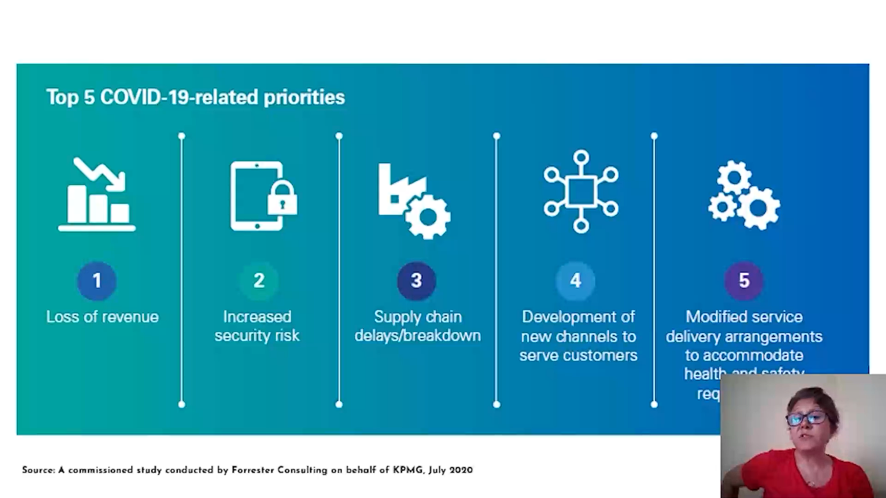
### THE COVID - 19 DIFFERENCE...DIGITAL HAS RISEN UP THE AGENDA
Even before the pandemic, digital transformation was already a high - priority item on most organizations' agendas, and its importance has only increased since then. 
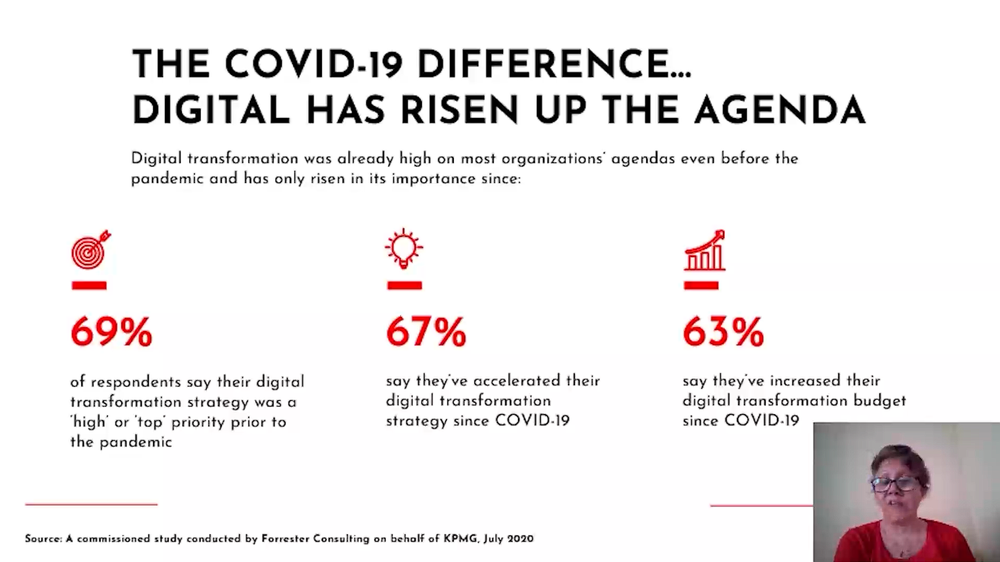
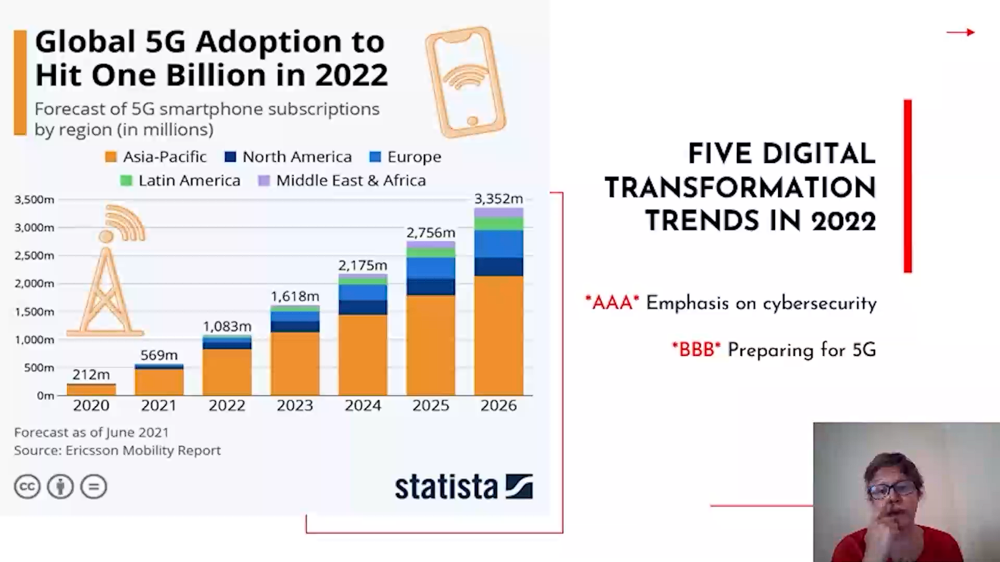
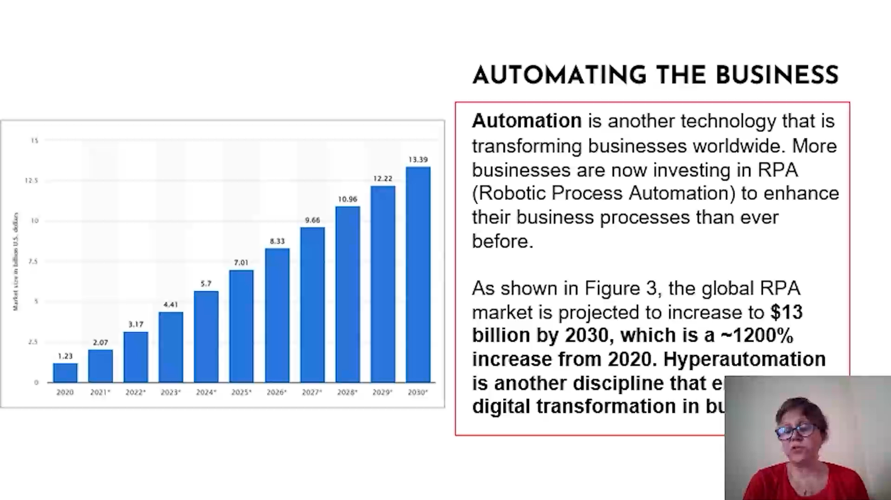
### OUR GLOBAL RESEARCH INTO THE CURRENT STATE OF DIGITAL TRANSFORMATION
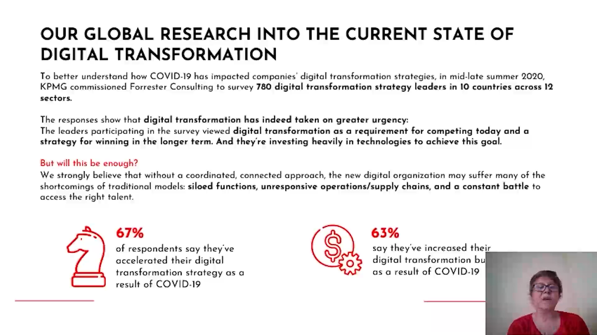
## ECOMMERCE & DIGITAL ECONOMY IN DEVELOPING COUNTRIES DURING COVID
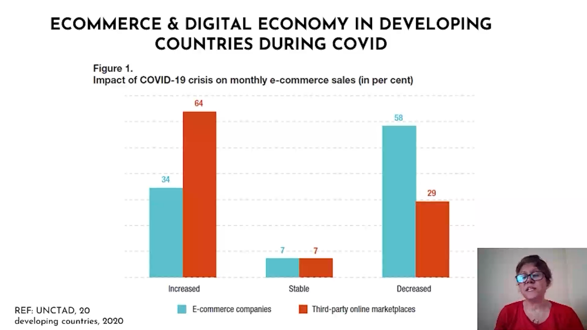
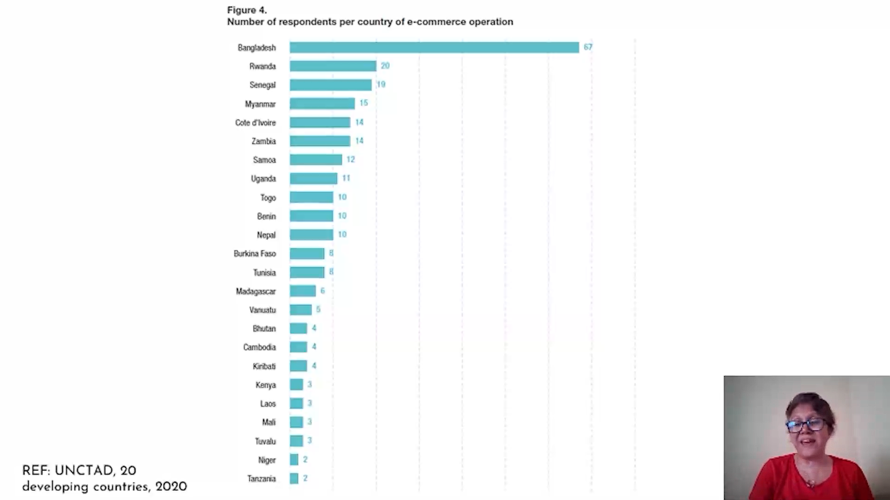
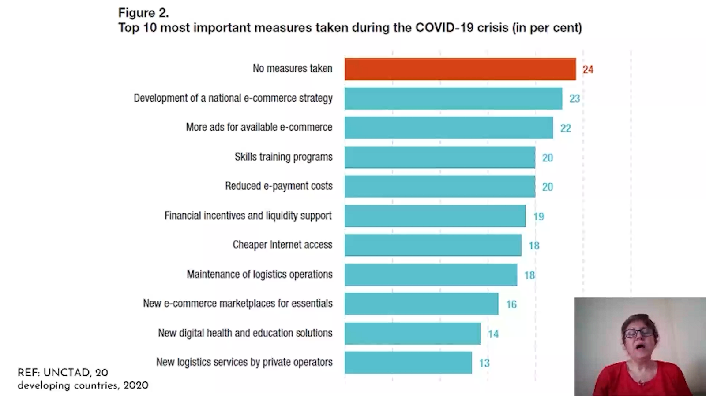

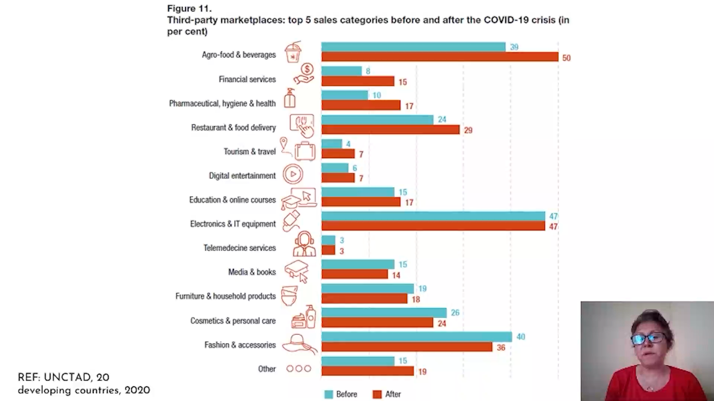
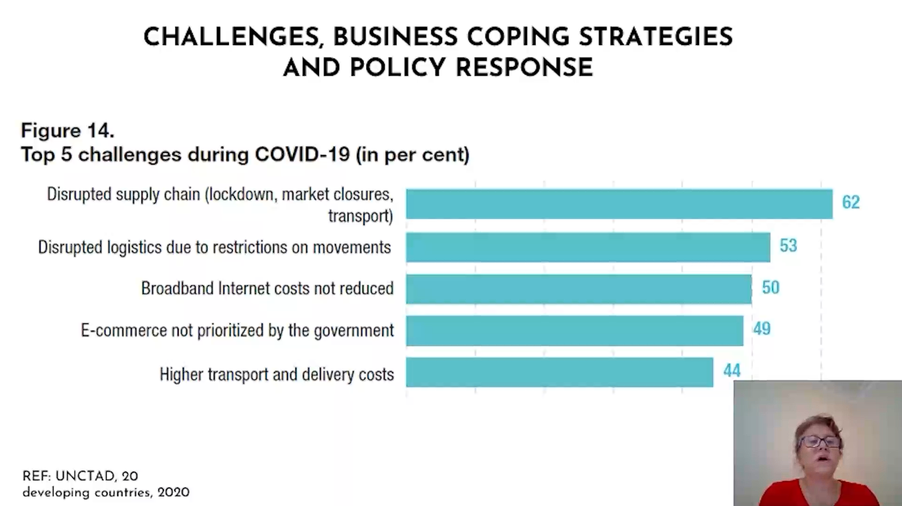
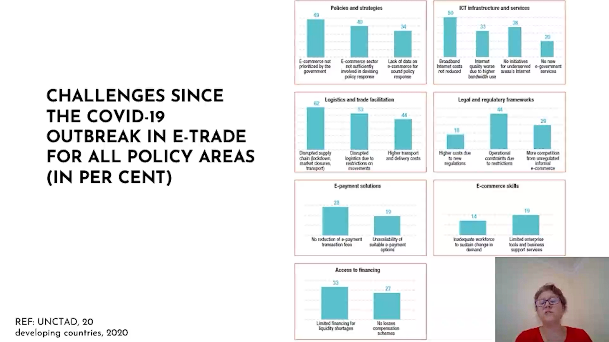
## Next Step in Digital Transformation Journey
### FIVE ACTIONS YOU CAN TAKE NOW

## POLICY RESPONSES FOR DIGITAL TRANSFORMATION
### UNITED STATES
The US has a free - market stance on the digital economy and cross - border data flows. It uses market - driven means to help its digital firms. Trade deals are used to give US firms easy access to foreign markets. Reports say the US supports an open internet, enabling data to come back to the US as the world interacts with US - headquartered companies.
### EUROPEAN UNION
The EU's data - control approach differs from the US and China's, focusing on individuals. It has strict data regs for a single digital market. Its digital - economy regulation was reactive but is now more proactive, with a unique integrated - policy approach.

The 2018 - implemented EU's GDPR is a major data - protection framework. It has rules for moving personal data out of the EU, but not for non - personal data. GDPR covers “personal data” and allows its external transfer only if EU citizens' privacy rights are met.
### DEVELOPING WORLD COUNTRIES
Lower costs for digital and financial services led to more internet and online transactions, fueling e - commerce. Extended business hours and smooth logistics eased supply - chain disruptions. Financial support measures minimized business losses and spurred investment.
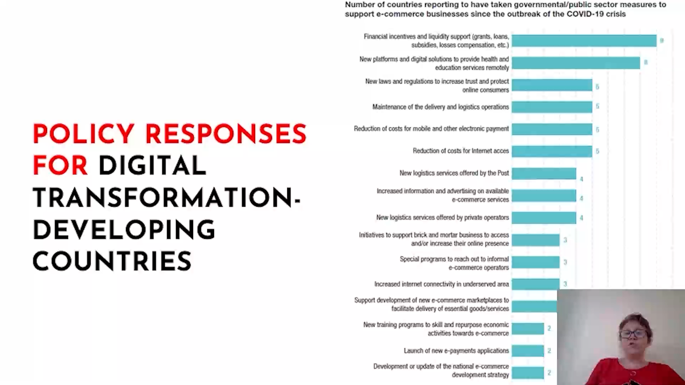
#### Boosting E-commerce Readiness and Market Development
##### Development or update of the national e.commerce development strategy.
Cambodia launched its e - commerce strategy in July 2020 despite the pandemic. In Senegal, COVID - 19 hastened the implementation of SNDCES, with work ongoing on specific activities like creating a marketplace, setting up delivery points, and reviewing e - commerce laws.
##### Special programmes to reach out to informal e.commerce operators.
- Togo used a marketplace to promote handicrafts, sped up by COVID - 19.
- Tunisia ran a radio campaign for e - commerce rules awareness.
- Senegal started formalizing e - commerce businesses and created a consortium for product sales. 
##### New third-party marketplaces and digital solutions to provide health and educationservices remotely.
- In Cambodia, different ministries promoted digital marketplaces and online learning.
- Mali used radio and TV for student training.
- Niger created an online platform for student video access.
- Senegal developed digital tools for student learning and put relevant marketplaces online.
- Vanuatu set up online learning marketplaces for schools. 
#### Increasing Internet Access
##### Reduction of costs for Internet access
- Lesotho's telecoms cut costs for educational online access during lockdown.
- Tunisian operators provided free access for distance - ed platforms, and rationed use with night - time cost cuts.
- Nepalese telecoms offer cheaper data packages and recharge bonuses. 
##### Increased internet connectivity in underserved areas
- In Niger, internet reach in underserved areas is expanding, with COVID - 19 pushing rural connectivity projects.
- In Tuvalu, the government is enhancing outer - island connectivity for education during COVID - 19. 
### DATA FLOWS AND POLICY RESPONSES
Cross - border data flows cannot work for the benefit of people and the planet if only a few global digital corporations from a few countries privately capture most of the gains from the data.
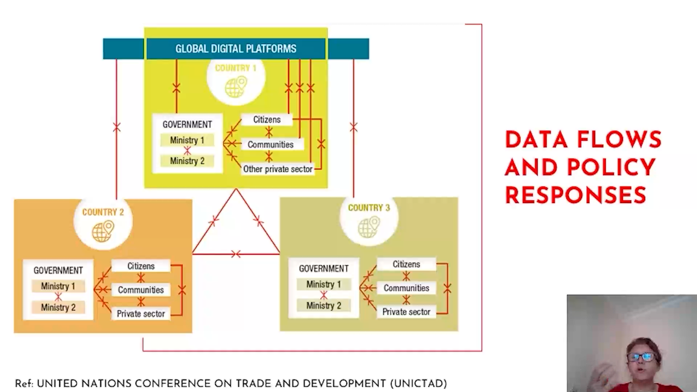
#### ISSUES FOR DATA GOVERNANCE ANDPOLICY RESPONSE
Data's unique traits, such as being intangible, non - rival, partially excludable, and having a relational and multidimensional nature, distinguish it from goods and services, thus warranting different treatment for cross - border data flows compared to international trade. 
 - The location of data within national borders has no clear - cut link to economic development, with relevant decisions depending on diverse, country - specific factors.
 - Different data types have varying impacts on cross - border data flows and related policies.
 - Data access, use (including potential misuse), and the ability to create and capture value from data are vital for development.
 - The global data - driven digital economy has complex, conflicting interests among actors, necessitating consideration of policy trade - offs in cross - border data flow policymaking.
 - Global data governance policymaking requires a comprehensive, multi - dimensional, whole - of - government approach at national and international levels. 
## What is Innovation?
1. **Qualitative change and new combinations**: Not all change is innovation. Innovation involves creating something new, not merely adopting others' new creations.
2. **Innovation components**: It encompasses both invention and the processes of launching (commercialization) or implementation.
3. **Innovation purpose and outcomes**: Innovation represents significant, intentional efforts by innovators. Their aim is to generate increased user value, enhance productivity, or achieve societal goals like reducing CO₂ emissions. Through these efforts, innovators seek to gain a net profit. 
- 正面影响
    - 技术进步
    - 生活质量提升
    - 竞争优势
    - 经济影响
- 负面影响
    - 压力增大
    - 劳动力技能退化
    - 工作岗位替代
    - 失业
    - 污染
    - 技术/社交媒体成瘾 
### Importance of Technological Innovationfor Firms
Technological innovation is now the single most important driver of competitive success in many industries.
 - Many firms earn over one - third of sales on products developed within the last five years.
 - Product innovations help firms protect margins by offering new, differentiated features.
 - Process innovations help make manufacturing more efficient.
### Impact on Society
Innovation widens global access to goods/services, boosts GDP, but can cause negative externalities affecting society.
### Challenges
In a changing economy, adapt to open innovation and changes. Successful innovation needs good strategies. Many ideas don't become successful products, as in pharma new product development.
### Innovation can arise from many different sources
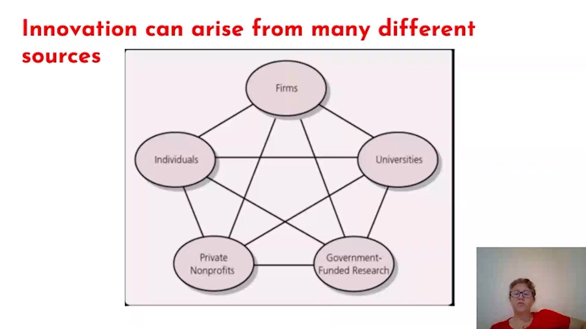
### Research and Development by Firms
- **Research Types**
    - **Basic research**: Aims to increase understanding of a topic or field without immediate commercial application.
    - **Applied research**: Aims to increase understanding to meet a specific need.
- **Development**: Activities applying knowledge to produce useful devices, materials, or processes.
- **Innovation Approaches**
    - **Science Push**: Suggests innovation proceeds linearly: Scientific discovery → invention → manufacturing → marketing.
    - **Demand Pull**: Argues innovation starts with unmet customer need: Customer suggestions → invention → manufacturing.
    - **Current view**: Innovation is complex, originating from various sources and following diverse paths.

### Sources of Innovation
- **Universities and Government - Funded Research**
    - **University Role**
        - Encourage research for useful innovations.
        - Bayh - Dole Act (1980) enables universities to collect royalties on taxpayer - funded inventions, leading to more technology - transfer offices.
        - Universities also contribute through research result publications, though invention revenues are small.
    - **Government Investment**
        - Through their own laboratories.
        - Science parks and incubators.
        - Grants for public or private research organizations.
- **Private Nonprofit Organizations**
    - Many conduct in - house R&D, fund others' R&D, or do both.
    - Some top nonprofits carry out significant R&D.
- **Collaborations**
    - Joint ventures.
    - Licensing and second - sourcing agreements.
    - Research associations.
    - Government - sponsored joint research programs.
    - Value - added networks for technical and scientific exchange.
    - Informal networks.
    - Especially crucial in high - tech sectors as individual firms may lack all required resources and capabilities. 
### Types of Innovation

**1. Product vs. Process Innovation**
 - **Product Innovation**: These are the innovations seen in an organization's final outputs, which can be its goods or services. For instance, a new smartphone model with advanced features.
 - **Process Innovation**: These are the changes in how an organization conducts its business operations, like new production techniques in a factory or novel marketing strategies. Product and process innovations can influence each other. Sometimes, what is a product innovation for one company can be a process innovation for another. As an example, when UPS creates a new distribution service (product innovation), it allows its customers to distribute their goods more widely and easily (process innovation for the customers).

**2. Radical vs. Incremental Innovation**
 - **Radicalness**: It measures how new and different an innovation is compared to existing products and processes.
 - **Incremental Innovation**: Involves only minor changes or adjustments to current practices. For example, a new version of a software with a few additional minor features.
 - **Relativity**: The radicalness of an innovation is not absolute. It can change over time or vary depending on the observer. Digital photography was a more radical innovation for Kodak, which was highly invested in traditional film photography, compared to Sony, which was more diversified in electronics.

**3. Competence - Enhancing vs. Competence - Destroying Innovation**
 - **Competence - Enhancing Innovation**: Builds upon a firm's existing knowledge base. For example, Intel's Pentium 4 was developed using the technology of Pentium III, enhancing Intel's existing technological capabilities.
 - **Competence - Destroying Innovation**: Makes a firm's existing competencies no longer useful. Electronic calculators made Keuffel & Esser's expertise in slide rules obsolete. Whether an innovation is competence - enhancing or - destroying depends on the firm's perspective.

**4. Architectural vs. Component Innovation**
 - **Component Innovation (Modular Innovation)**: Involves changes to one or more components of a product system without majorly affecting the overall design. For example, adding gel - filled material to a bicycle seat.
 - **Architectural Innovation**: Requires changing the overall design of the system or the way components interact. The shift from a high - wheel bicycle to a safety bicycle is an example. Usually, architectural innovations also necessitate changes in the underlying components.

**5. Catalytic Innovation**
 - **Systemic Social Change**: Aims to create broad - scale social change.
 - **Unmet Needs**: Addresses needs that are either over - served or not served at all.
 - **Simplicity and Cost - Effectiveness**: Tends to be simpler and less costly, with a perceived lower performance level but is considered “good enough”.
 - **Resource Generation**: Generates resources like donations or grants in ways that are initially unappealing to established competitors.
 - **Reaction from Existing Players**: Often ignored or even encouraged by existing market players because the associated business model is unattractive to them. 
### Technology Adoption Curve
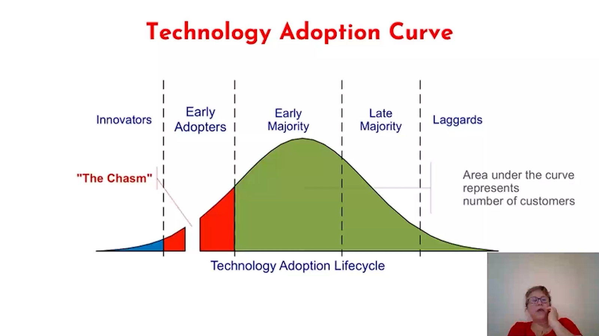