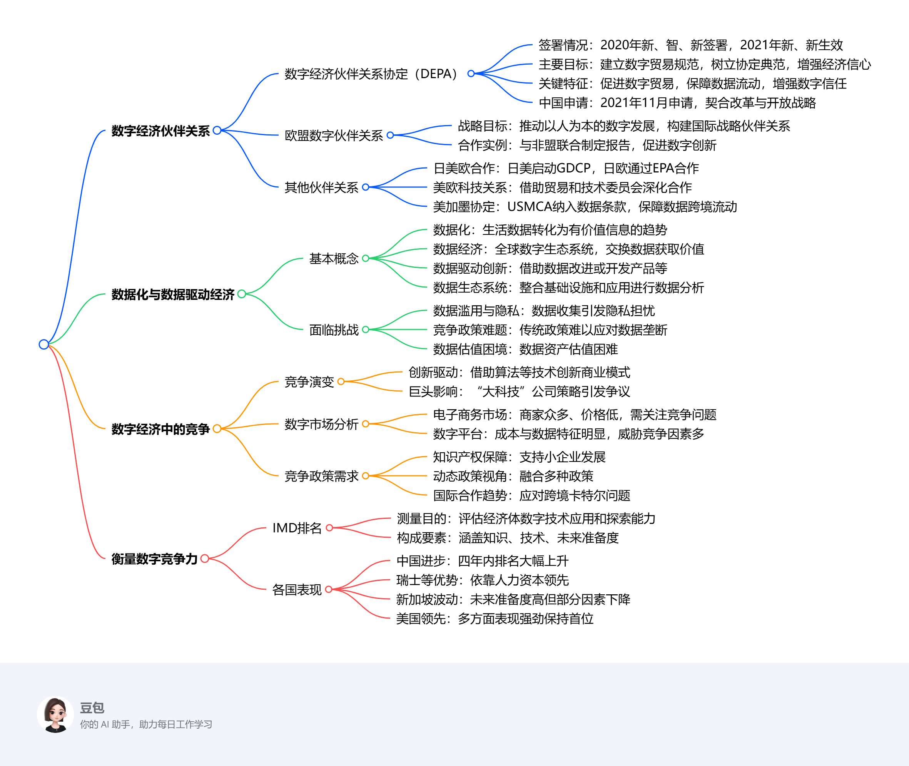

# Tenth Class: Digital Economic Partnerships Datafication and Data-Driven Economy Competition in the Digital-Global Landscape

## Digital Economic Partnerships
1. **The Digital Economy Partnership Agreement (DEPA)**
    - **Overview**: Signed by New Zealand, Chile, and Singapore in 2020 and came into force for New Zealand and Singapore in 2021. It aims to create global norms for digital trade, serve as a model agreement, and build confidence in digital economy issues.
    - **Key Features**
        - **Facilitate end - to - end digital trade**: Develop safe and secure mutually recognized digital identities, promote paperless trade to reduce costs, and enable e - invoicing for faster payment and cost savings.
        - **Enable trusted data flows**: Protect personal data during cross - border transfer based on international frameworks and expand access to open government data for business opportunities, especially for SMEs.
        - **Build trust in digital systems and facilitate digital economy participation**: Promote ethical AI governance, protect online consumers, remove digital economy barriers, and enhance cross - border data flows for business development.
    - **China's Application**: China applied to join DEPA in November 2021, which aligns with its reform and opening - up plans and can strengthen digital economy cooperation with member countries.
2. **European Union and Digital Partnership**
    - **EU Digital Strategy Goals**: Strive to foster a human - centric digital economy and society globally, ensure technology benefits people, and build strategic international partnerships in the digital field.
    - **Digital4Development Hub**: Serves as a key strategic tool for the EU and Member States to coordinate actions, promote multistakeholder dialogue, and leverage expertise and resources for new digital partnerships.
    - **Collaboration Examples**: Jointly drafted a report with the African Union in 2019, creating the EU - AU Partnership on Digital Transformation and the EU - AU Data Flagship to boost digital innovations and entrepreneurship.
3. **Other Digital Partnerships**
    - **Japan - US - EU Partnerships**: Japan launched the U.S. - Japan Global Digital Connectivity Partnership (GDCP) with the US in 2021 to deepen digital economy cooperation. Since 2019, Japan and the EU have been collaborating through the Economic Partnership Agreement (EPA) and a Strategic Partnership Agreement.
    - **US - EU Tech Relations**: The EU and the US reaffirmed their cooperation through the Trade and Technology Council to address global trade and technology challenges.
    - **US - USMCA (NAFTA Successor)**: The USMCA includes provisions on data transfer and privacy, prohibits tariffs on digital products, and recognizes the APEC Cross - Border Privacy Rules System.

## Datafication and Data - Driven Economy
1. **Concepts**
    - **Datafication**: A technological trend that turns aspects of life into data, which is then transformed into valuable information.
    - **Data Economy**: A global digital ecosystem where data is gathered, organized, and exchanged for value.
    - **Data - Driven Innovation (DDI)**: Involves improving existing or developing new products, processes, organizational methods, and markets through data.
    - **Data Ecosystem**: Combines enterprise infrastructure and applications for data aggregation and analysis to help organizations understand customers and craft strategies.
2. **Challenges**
    - **Data Misuse and Privacy**: There is an incentive for misusing data, and the collection of sensitive data during events like the COVID - 19 crisis has raised privacy concerns.
    - **Competition Policy**: Traditional competition policy struggles to identify the negative effects of data monopolies. Data protection should be considered as a new dimension in competition policy.
    - **Data Valuation**: Valuing data, which has become a key intangible asset, is a challenge for both firms and authorities.

## Competition in the Digital Economy
1. **Competition Evolution**: Mainly through incorporating business model and strategy innovations like algorithms, information technologies, artificial intelligence, machine learning, and big data. "Big Tech" companies play a central and controversial role.
2. **Digital Markets Analysis**
    - **E - commerce Markets**: Characterized by many vendors, low prices, and tough competition. Competition authorities need to monitor entry barriers, vertical restrictions, and collusion. It's crucial for SMEs' market access.
    - **Digital Platforms**: Have high fixed costs, low variable costs, and are data - driven with network effects. Threats to competition include restrictions on multi - homing, data control, and algorithmic power. SMEs face issues like high margins and lack of transparency.
3. **Competition Policy Requirements**
    - **Intellectual Property and Patent Law**: Needed to support smaller firms in the digital economy.
    - **Dynamic Competition View**: Should be adopted, and competition policy should be integrated with other policies.
    - **International Cooperation**: Necessary to address cross - border cartels and promote market integration, especially in the context of the digital economy and the pandemic.

## Measuring Digital Competitiveness
1. **IMD World Digital Competitiveness Ranking**
    - **Measurement Purpose**: Measures the capacity and readiness of 64 economies to adopt and explore digital technologies for economic transformation.
    - **Components**: A multidimensional structure including knowledge (talent, training, education, and scientific concentration), technology (regulatory framework, capital, and technology framework), and future readiness (adaptive attitudes, business agility, and integration).
2. **Country Performances**
    - **China**: Has climbed from 30th to 15th place in four years, with high productivity in scientific research and leading in AI applications.
    - **Switzerland & Nordic Countries**: Benefit from high - quality human capital and strong performance in knowledge - related factors.
    - **Singapore**: Despite high future readiness, lost some ground in 2021 due to drops in technology and knowledge.
    - **USA**: Remains at the top, excelling in future readiness and knowledge, with a strong scientific infrastructure. 
<iframe src="https://naimore3.github.io/Naimore3-s-Learning-Notes/课程笔记/2025寒假/PBL数字经济与智能金融/Tenth_Class_教授课5/Tenth_Class_教授课5.pdf" style="border: none;"></iframe>