# Third Class: INTRODUCTION TO DIGITAL ECONOMY AND INTELLECTUAL BUSINESS
## WHAT IS DIGITAL ECONOMY?
{align="left" width="50%"}$\qquad$The OECD defines the digital economy known also as internet economy in academia, as the part of an economy that enables andonducts the trade of goods and services through electronic commerce on the Internet.

$\qquad$Some software and game products used to be sold via hardware like CDs but they are still under digital economy.

$\qquad$E-commerce transaction describes the sale or purchase of goods or services conducted over computer networks by methods specifically designed for the purpose of receiving or placing orders (OECD, 2011).
## Digitalization in Businesses
$\qquad$Digitalization in business means using the digital technologies for changing the business models so as to create new values and gains through values creating opportunities.
## Digitalization in Business Organizations{align="right" width="30%"}
$\qquad$Digitalization is the process of transformation through using company resources and digital opportunities to attain revenue, growth and value creating operational outcomes.
## DIGITAL TECHNOLOGIES ADVANCED MOST RAPID
$\qquad$Digital technologies have advanced more rapidly than any innovation in our history - reaching around 50 percent of the developing world's population in only two decades and transforming societies. By enhancing connectivity, financial inclusion, access to trade and public services, technology can be a great equalizer. (United Nations)
## SIZE OF DIGITAL ECONOMY
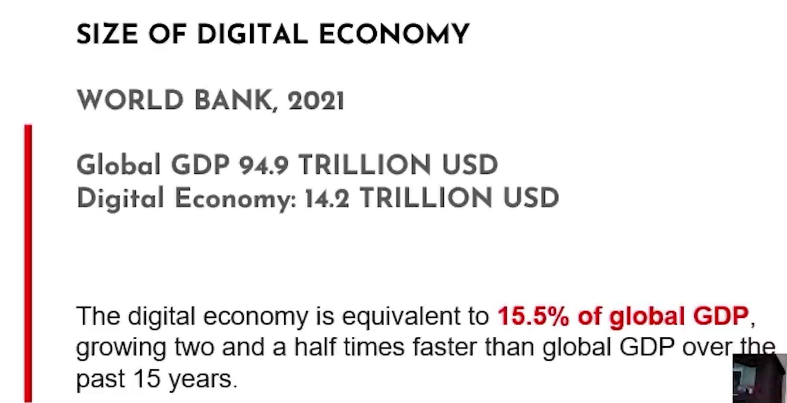
## BREAKDOWN OF DIGITAL ECONOMY
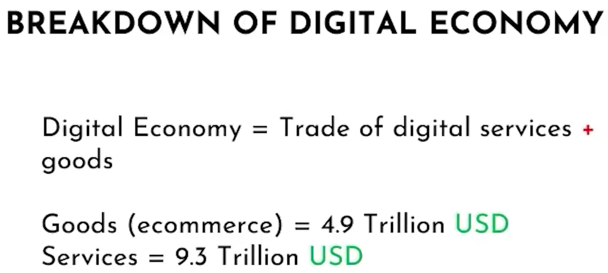
## ECOMMERCE BOOM VIA PANDEMIC
{==

$\qquad$In 202l, retail e-commerce sales amounted to approximately 4.9 trillion U.S. dollars worldwide. This figure is forecast to grow by 50 percent over the next four years, reaching about 7.4 trillion dollars by 2025.

==}

{align="left" width="35%"}
## Agility
$\qquad$Business agility, refers to rapid, continuous, and systematic evolutionary adaptation and entrepreneurial innovation directed at gaining and maintaining competitive advantage.

$\qquad$Business agility can be sustgined by maintaining and adapting the goods and services offered to meet with customer demands, adjusting to the marketplace changes in a business environment, and responding to the changing needs of customers and the market.
## Business Resilience
{align="right" width="40%"}$\qquad$Business resilience is the ability of an organization to quickly adapt to disruptions while maintaining continuous business operations and safeguarding people, and overall brand equality.

$\qquad$To build and maintain resiliency in your business, you must minimize the downside while maintaining the ability to act on opportunities that may present themselves to your business. Business resilisence involves financial, operational, strategic, psychological elements.
## DIGITAL TRANSFORMATION
$\qquad$Mainly has a purpose of creating value.
## Digitalizing Michael Porter's Generic Value Chain
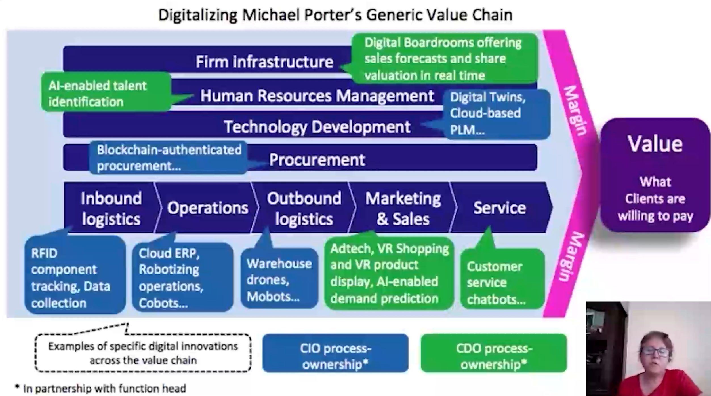
## Ten guiding principles of a digital transformation
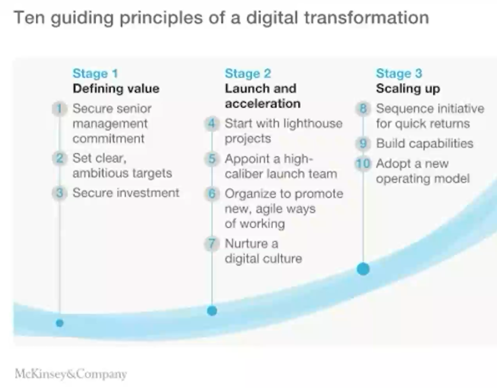
## DIGITAL TRANSFORMATION ROADMAP
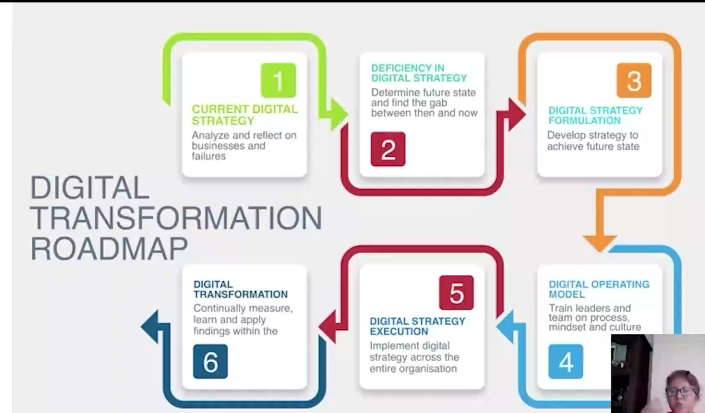
## The Fourth industrial Revolution
$\qquad$[What is the Fourth industrial Revolution?](https://innovate.ieee.org/innovation-spotlight-ieee-fueling-fourth-industrial-revolution/)
## 7 digital transformation trends
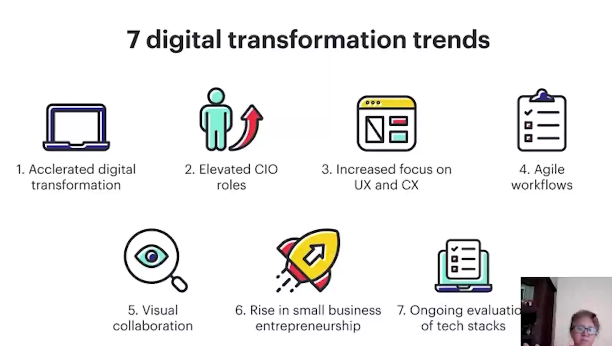
## The Five Dimensions of Digital Sustainability
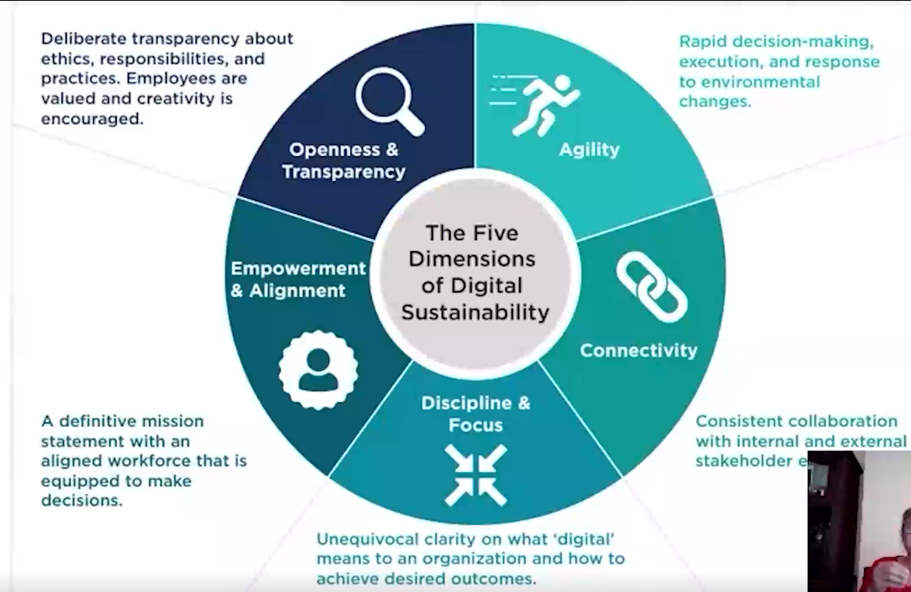
## Digital Sustainability
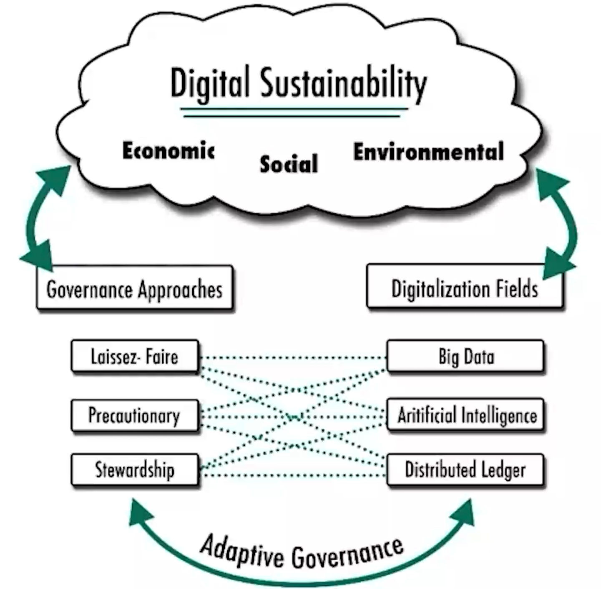
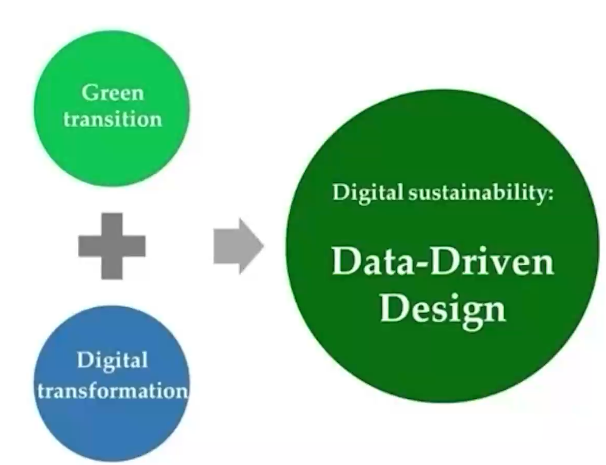
## LEAN DIGITAL TRANSFORMATION
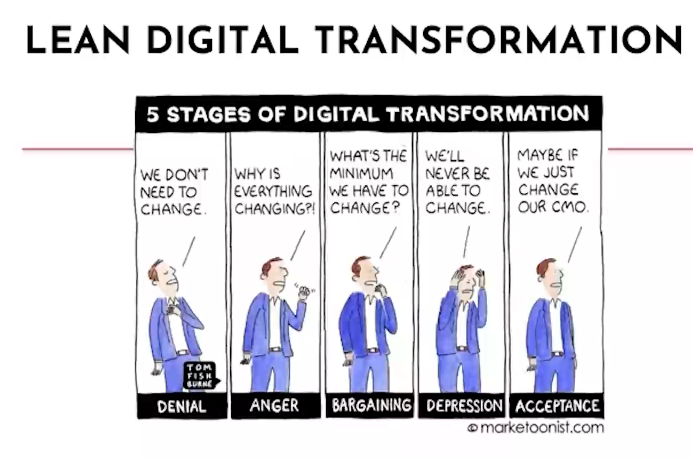
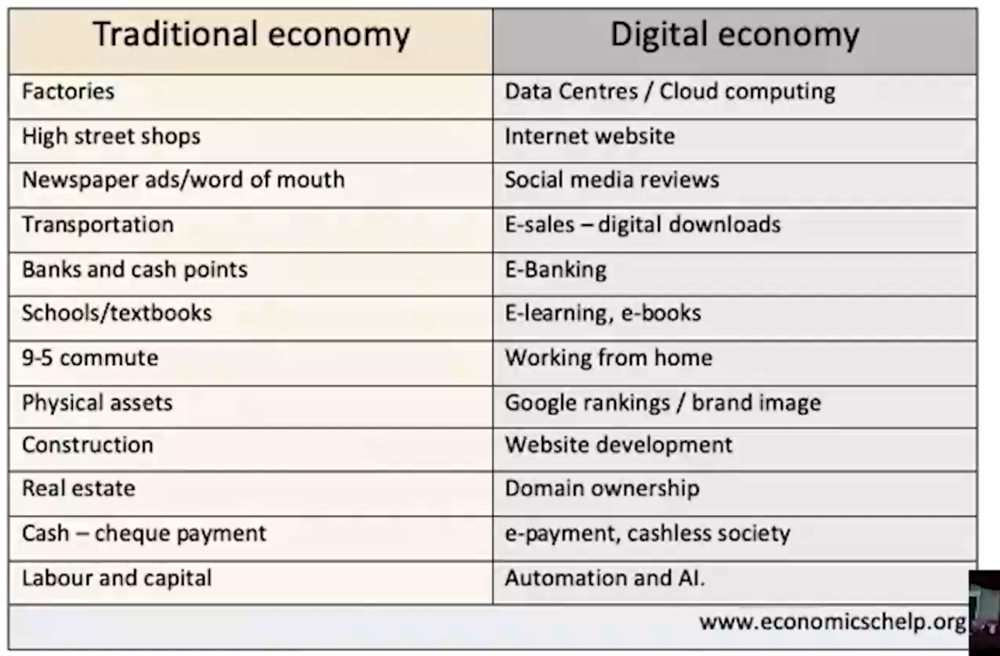
## PROS ANDCONS OFDIGITALECONOMY
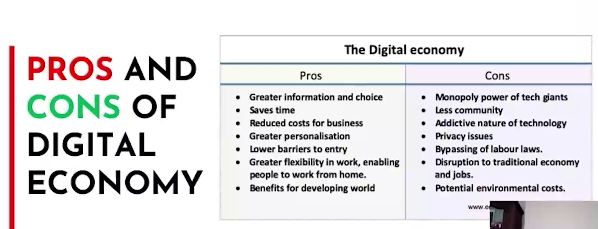
## IMPACT OF DIGITAL ECONOMY ON GDP GROWTH(WORLD BANK -END OF 2021)
{align="left" width="50%"}$\qquad$With the potential of digital technologies to expand access to markets and opportunities, helping countries invest in digital development is an important aspect of the World Bank's work to reduce poverty and inequality. The numbers speak for themselves: the digital economy is equivalent to 15.5% of global GDP, growing two and a half times faster than global GDP over the past 15 years. Research shows that a 10% increase in mobile broadband penetration in Africa would result in an increase of 2.5% of GDP per capita. In a post COVlD-19 environment, digitalization efforts will accelerate across the globe, but most developing countries do not currently possess the right tools and environment of that.
## VALUE OF DATA
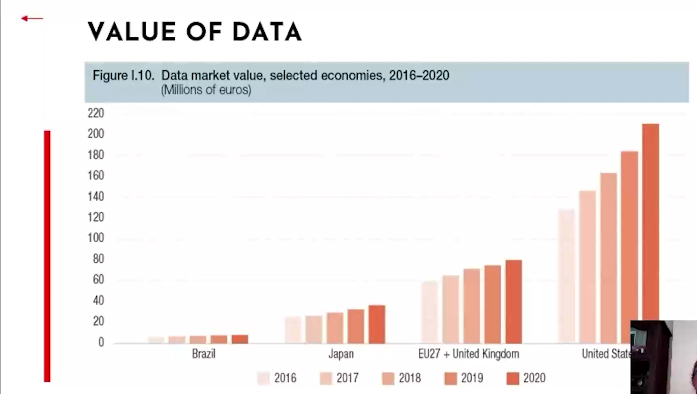
## Critical lmplications of Digital Economy
**I. Digital Economy's Macro - level Impact on Economic Development**{align="right" width="25%"}

 - From a macro view, the digital economy impacts economic development through production input and output efficiency. This is shown in increased factor input, better factor allocation efficiency, and higher total factor productivity due to technological progress and spillover.

**II. Impact on Developing Countries**

 - For developing countries, digitization is a key economic growth driver. It boosts capital and labor productivity, cuts transaction costs, and helps countries integrate into the global market system.

**III. Impact on Developed Countries**{align="left" width="25%"}

 - In developed countries, the digital economy's impact on economic development quality is mainly in promoting sustainable development and enhancing enterprise ability. For example, in the US from 2004 - 2012, it was a major economic growth driver, and the production sector's R & D investment and technological progress positively affected TFP growth.

**IV. Role of Informatization and Digital Policies**

 - Informatization is important for promoting TFP growth in 12 major OECD countries. Data from 2009 - 2018 in 15 advanced EU economies shows that national and industry digital policies can significantly promote economic growth. 
## EVEN EXPECTATION OFGLOBAL EONOMY IMPACT EFFECTS ECONOMY POSITIVELY
**Do our beliefs about future technology affect the economy? -Economics Observatory**
## IMPACT OF DIGITAL ECONOMIES{align="right" width="50%"}
$\qquad$Digital technologies have advanced more rapidly than any innovation in our history - reaching around 50 percent of the developing world's population in only two decades and transforming societies.By enhancing connectivity, financial inclusion, access to trade and public services, technology can be a great equalizer.
## Waves of transformation to Digital Economy
**Digitalization to achieve sustainable development goals:Steps towards a Smart Green Planet**
## Highlights
- Sustainable development in years to come will capitalize greatly on digitalization.{align="right" width="50%"}
- Internet of things as essential tool for sustainable food production and planet health.
- Artificial intelligence can optimize energy production and water treatment.
- Smart technologies can provide equity access to services and increase wellbeing.
- Digitalization can guide actions to face climate change and protect biodiversity.
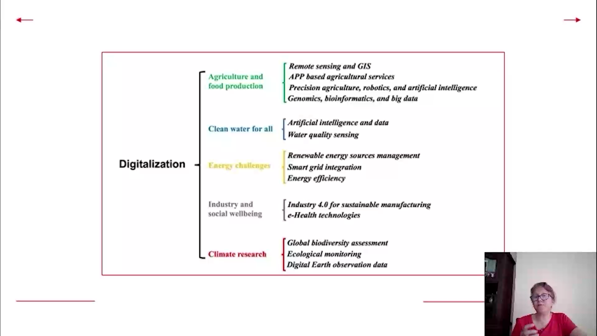
## What's different today?
{align="left" width="45%"}$\qquad$When the pandemic arrived, many organizations scrambled to ensure the health and safety of their employees while simultaneously building infrastructure to support remote work. Ad hoc fixes ruled the day as companies patched together solutions to preserve business continuity.

$\qquad$Much of that is over now——and in the case of digital transformation efforts, it also served as a catalyst for change. Where do we see proof that the pandemic fast-tracked digital transformation? Respondents to Celerity and Ranstadt US survey were crystal clear on that.
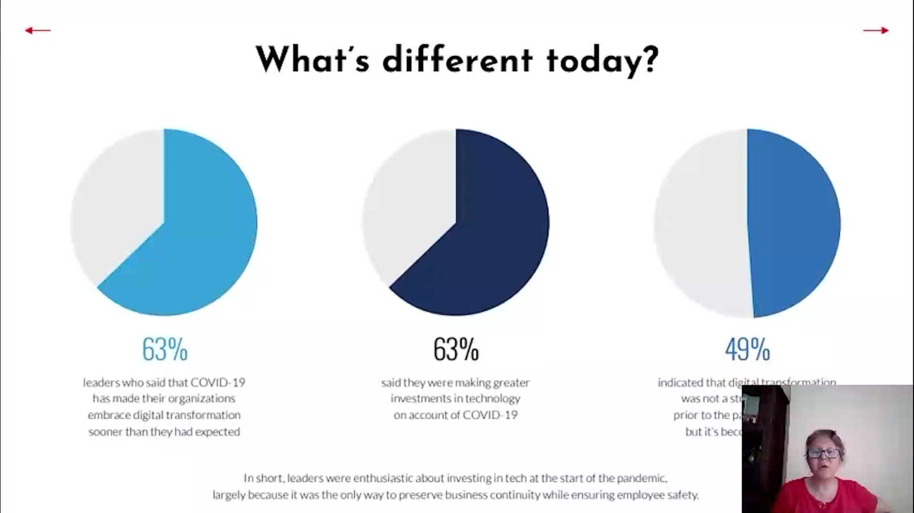
## Insights into changing organizational priorities
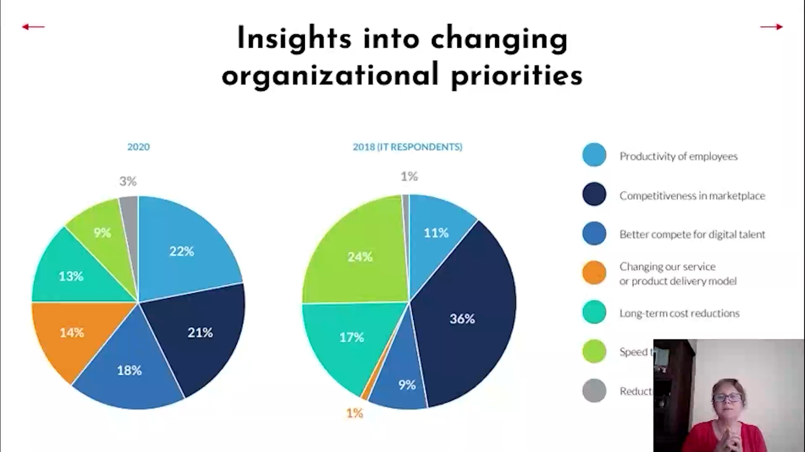