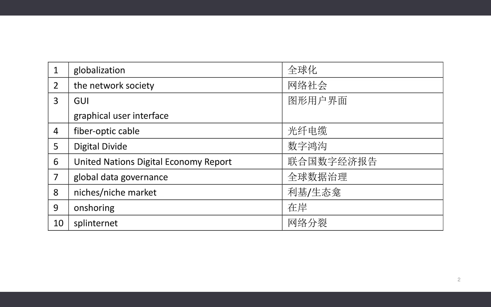
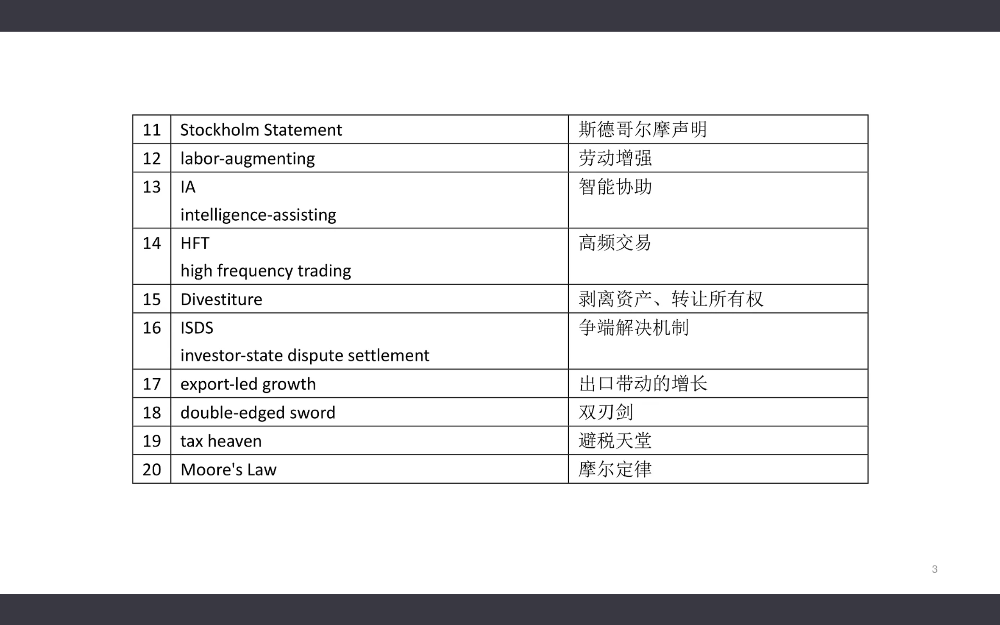
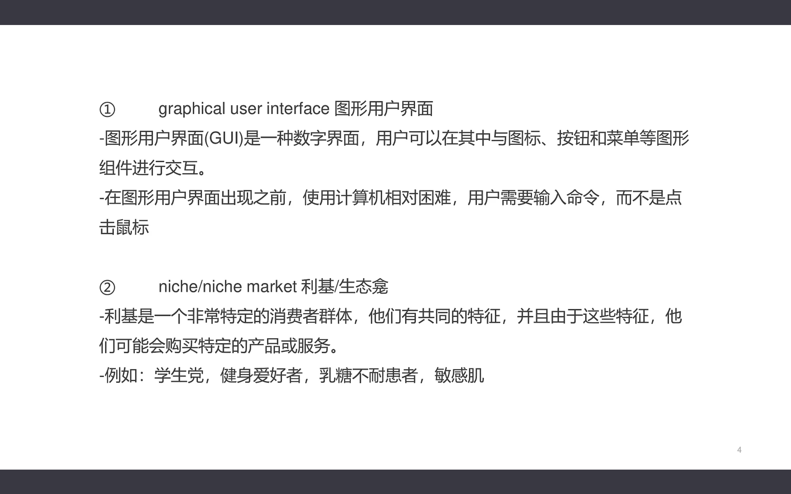
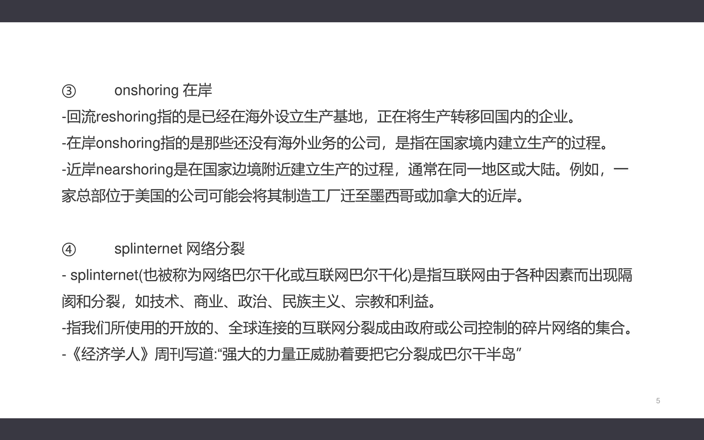
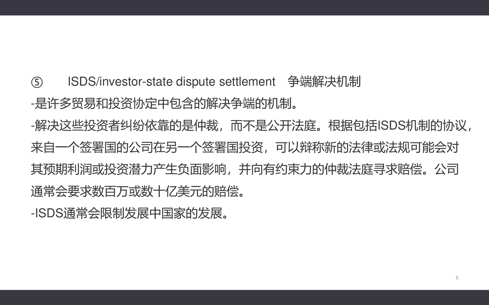
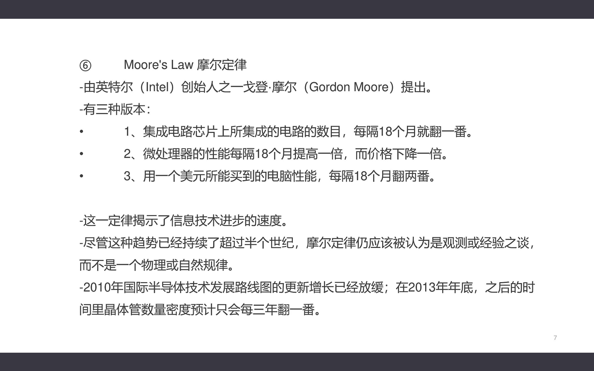
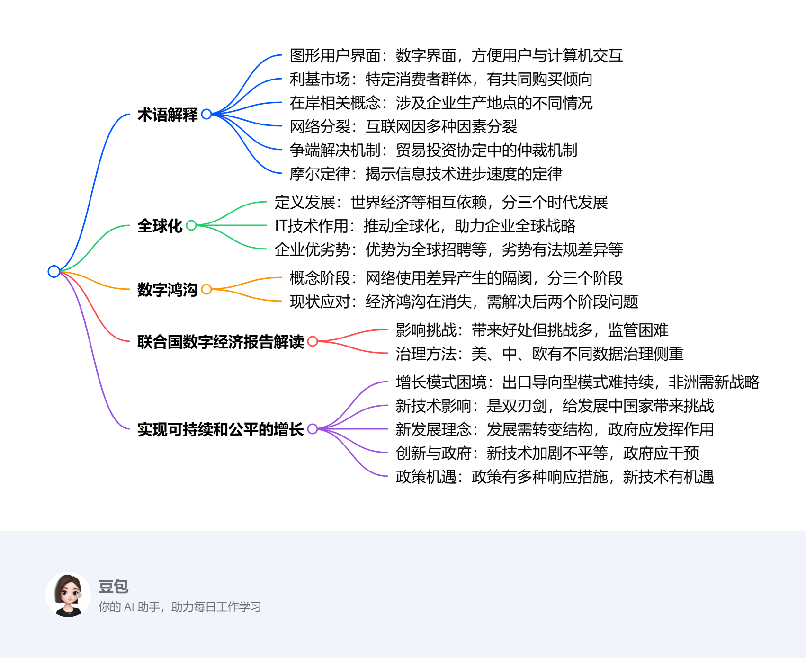

# Thirteenth Class: 经济全球化、数字鸿沟以及数字经济的未来展望
## 术语解释
1. **图形用户界面（GUI）**：一种数字界面，用户可通过图标、按钮和菜单等图形组件与计算机交互，出现前用户需输入命令操作计算机。
2. **利基/生态龛（niche/niche market）**：特定的消费者群体，具有共同特征，会购买特定产品或服务，如学生党、健身爱好者等。
3. **在岸（onshoring）**：指公司在国家境内建立生产的过程；回流（reshoring）是海外设厂企业将生产转回国内；近岸（nearshoring）是在国家边境附近建立生产。
4. **网络分裂（splinternet）**：因技术、商业、政治等因素，互联网出现隔阂和分裂，变成由政府或公司控制的碎片网络集合。
5. **争端解决机制（ISDS）**：许多贸易和投资协定中的争端解决机制，依靠仲裁而非公开法庭，可能限制发展中国家发展。
6. **摩尔定律（Moore's Law）**：由戈登·摩尔提出，有集成电路芯片上电路数目、微处理器性能、美元所能买到的电脑性能等方面的版本，揭示信息技术进步速度，但增长已放缓。

## 全球化
1. **定义与发展**：描述世界经济、文化和人口之间的相互依赖关系，是世界各地互动交融的过程。自18世纪因交通和通信技术进步加速，经历了全球化1.0（1492 - 1800年，国家主导）、2.0（1800 - 2000年，跨国公司推动）、3.0（2000年之后，个人主导）三个时代。
2. **IT技术的推动作用**：个人计算机的图形用户界面使电脑更易用，提高工作效率；互联网基础设施发展让网络通信成为商品；自动化和集成业务流程的软件方便人们协同工作。信息技术进步成为企业全球商业战略关键部分，助力企业扩张。
3. **全球化企业的优劣势**：优势在于可全球招聘专业技术人员、24小时运营业务、产品市场更大；挑战包括基础设施差异、劳动法律法规不同、法律限制、语言习俗偏好差异、国际航运难题、文化差异等。

## 数字鸿沟
1. **概念与阶段划分**：指能接触网络和不能接触网络的人之间的隔阂。可分为经济鸿沟（硬件购买能力差异）、可用性鸿沟（技术复杂导致部分人无法使用）、赋能鸿沟（人们不能充分利用技术机会）三个阶段。
2. **现状与应对方向**：经济鸿沟在工业化国家正迅速消失；可用性鸿沟需简化技术和网站内容；赋能鸿沟较难解决，人们对数字技术的利用能力不足。需针对后两个阶段采取措施缓解数字鸿沟。

## 联合国数字经济报告解读
1. **数字经济的影响与挑战**：数据驱动的数字经济带来好处，但政策制定者应对新挑战准备不足，跨境数据流动监管是主要挑战之一，现有国际机构框架不适合全球数据治理。
2. **全球数据治理的方法与目标**：全球数据治理有美国侧重私营部门控制数据、中国侧重政府控制数据、欧盟侧重个人控制数据三种方法。应寻找全球合作方式，平衡各方利益，减少数字经济中的不平等，重新拟订和扩大国际政策辩论。

## 实现可持续和公平的增长
1. **出口导向型增长模式的困境**：东亚曾依靠该模式缩小与发达国家差距，但制造业生产率超过需求增长，就业机会减少，未来难以持续，非洲需寻找替代战略。
2. **新技术的影响与挑战**：新技术是双刃剑，带来新机会的同时，也可能加剧不平等、导致网络分裂等问题，发展中国家面临追赶困难、失业率上升等挑战。
3. **新发展理念与《斯德哥尔摩声明》**：发展中国家与发达国家的区别在于资源、知识和制度，发展需要结构性转变，政府应发挥重要作用。《斯德哥尔摩声明》体现新理解，与华盛顿共识有显著变化。
4. **发展中国家对创新的反应与政府角色**：新技术可能加剧不平等，政府应干预创新过程，制定政策引导创新方向，防止不利分配后果。
5. **政策响应与发展机遇**：政策响应包括改变知识产权规则、加强税收和监管、完善竞争政策、改革贸易规则等。新技术带来金融包容性等机会，但也存在风险，各国应抓住机会，应对挑战，制定综合发展战略。 

<iframe src="https://naimore3.github.io/Naimore3-s-Learning-Notes/课程笔记/2025寒假/PBL数字经济与智能金融/Thirteenth_Class_助教课6/Thirteenth_Class_助教课6.pdf" width="100%" height="800px" style="border: none;"></iframe>