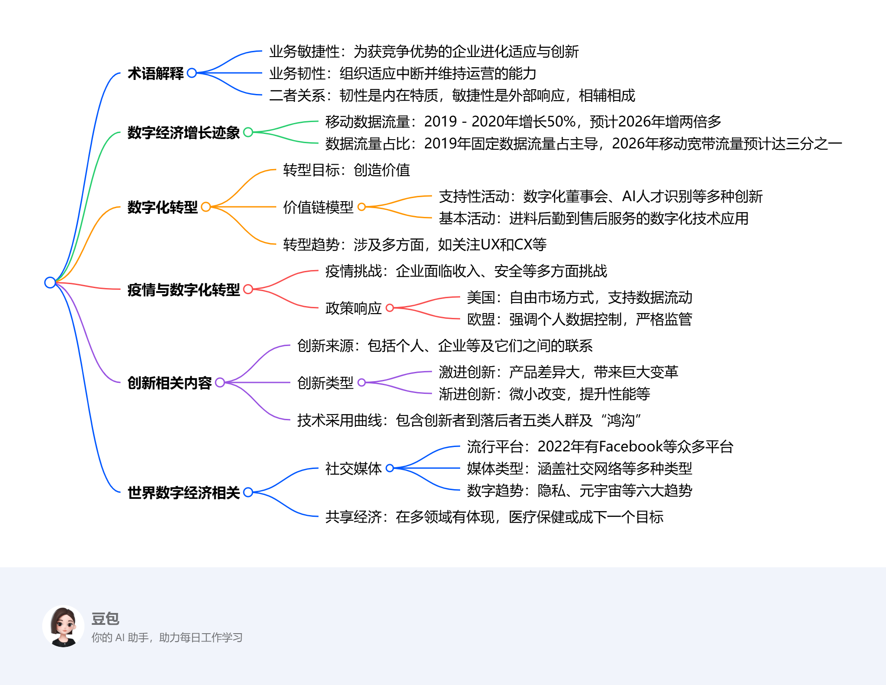

# Twelfth Class: 助教课4期中复习课
## 术语解释
- **业务敏捷性**：为获取和保持竞争优势，企业进行快速、持续和系统的进化适应与创新，可通过维护商品和服务满足客户需求，利用人力资源适应市场变化。
- **业务韧性**：组织快速适应中断，维持业务运营，保护员工和品牌资产的能力，涵盖财务、运营、战略和心理等因素。韧性是内在特质，敏捷性是对外部威胁的响应，二者相辅相成。
## 数字经济增长迹象
- **数据流量增长**：2019年第三季度至2020年第三季度，移动网络数据流量增长50%，预计到2026年将增加两倍以上。2019年固定数据流量占主导，随着移动设备和物联网数量增加，到2026年移动宽带数据流量预计达总数据量的三分之一。
## 数字化转型
- **主要目标**：创造价值。
- **数字化波特价值链分析模型**
    - **支持性活动**：数字化董事会实时提供销售预测和股票估值；AI赋能人才识别技术替代传统人力管理；数字孪生反映实体装备全生命周期，基于云的PLM实现供应商在云中构建应用程序；采购环节引入区块链技术预防欺诈。
    - **基本活动**：进料后勤利用无线射频识别组件跟踪和数据收集；生产环节使用云ERP技术和自动化生产技术；发货后勤借助仓库无人机或机器人；市场营销和销售运用广告技术、VR购物等；售后服务引入机器人客服。
- **转型趋势**：首席信息官作用提升；更加关注用户体验（UX）和客户体验（CX），UX侧重于用户与产品互动，CX涉及客户对品牌整体体验，UX是CX的子集；工作流程更灵活；可视化协同；小企业崛起；持续进行技术栈评估。
## 疫情与数字化转型
- **疫情带来的挑战**：企业面临收入下降、安全风险增加、供应链延迟或中断、需调整服务以适应健康安全要求、开发新渠道服务客户等挑战，促使企业加速数字化转型。
- **数字化转型的政策响应**
    - **美国**：采取自由市场方式，以私人市场为导向，利用贸易协定确保公司进入外国市场，支持数据自由流动，促进在线信息自由流动。
    - **欧盟**：强调个人对数据的控制，对数据驱动的数字经济进行严格监管，旨在建立单一数字市场，保护个人隐私，《欧盟一般数据保护条例》（GDPR）对个人数据跨境转移要求严格，但对非个人数据跨境转移无明确限制。
## 创新相关内容
- **创新的来源**：包括个人创新（由个人的智力、知识等多因素决定）、企业创新、高校/政府支持的研发、非盈利机构，更重要的是各来源之间的联系构成的创新网络。
- **创新的类型**
    - **激进创新**：产品与旧产品差异大，能带来做事方式的巨大变化，如计算机、汽车的问世。
    - **渐进创新**：涉及对现有做法的微小改变，旨在以低成本提高性能等，如个人计算机的技术改进。
- **技术采用曲线**：包含创新者（愿承担风险，尝试新事物）、早期采用者（潮流引领者，在意声誉，收集信息后支持新技术）、较早的大多数（对技术感兴趣，需证明其有效性）、较晚的大多数（谨慎，需充分理由才采用新技术）、落后者（抗拒改变，持怀疑态度），早期用户和主流用户间的转换存在“鸿沟”。
## 世界数字经济排名、社交媒体与共享经济
- **社交媒体**
    - **2022年流行平台**：按全球活跃用户数量排名，如Facebook、YouTube、WhatsApp等，涵盖多种类型。
    - **社交媒体类型**：有社交网络（用于个人或职业联系互动）、博客和微博（在字符限制内创建博客，分享多种内容）、媒体分享（照片分享和视频分享，各有特色功能）、评分网站（对各类事物打分评价）、论坛（用户分享观点、讨论话题）。
    - **2022年数字趋势**：社交媒体注重隐私和内容质量，更新政策和算法，短视频广告支出增加；元宇宙兴起，用户可在虚拟环境互动、交易；crypto和NFT加速增长，NFT改变数字资产价值，代币化资产市场前景广阔；人工智能在食品和人力资源服务领域应用增加；5G和Wi-Fi - 6推动数字化转型，改变办公模式；新工作场所带来技能需求变化，创造新就业机会。
- **共享经济**：在消费品领域提供便利、可负担和高效的服务；交通运输领域，Uber等拼车服务更经济、舒适和安全；在个人及专业服务领域效果显著，医疗保健行业有望成为共享经济下一个目标。 
