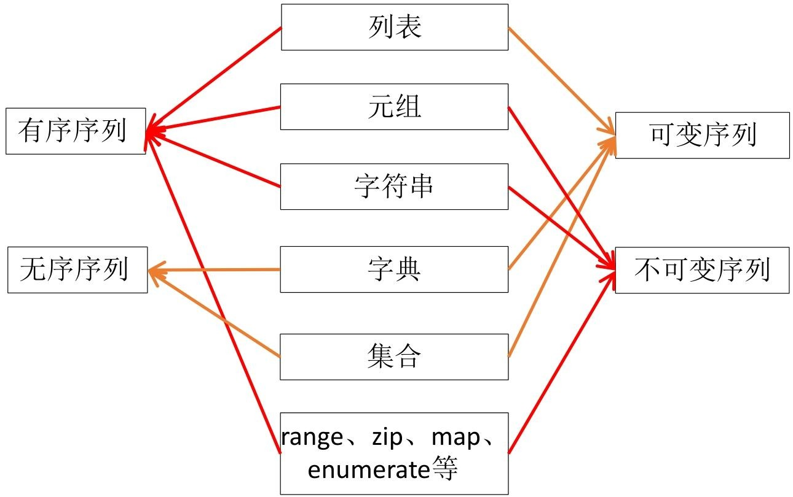

# Chapter2：内建数据结构、函数
## 总览
### 3 内建数据结构、函数
本章是文档核心部分，分为“数据结构和序列”与“函数”两大板块，详细阐述了Python中常用的数据存储与代码封装方式。


---

### 3.1 数据结构和序列
数据结构和序列是Python中存储和处理数据的基础，包含列表、元组、字典、集合四种核心类型，以及序列解包的实用技巧。

#### 3.1.1 列表
列表是Python中最重要的可变有序序列，支持多种元素类型，且能自动管理内存，但非尾部操作效率较低。
1. **列表的创建与删除**
    - 创建：可通过`=`直接赋值（如`a_list = [1,2,3]`），或用`list()`函数将元组、range对象、字符串等转换为列表（如`list(range(1,5))`）；空列表可表示为`[]`或`list()`。
    - 删除：使用`del`命令删除整个列表（如`del a_list`），删除后无法再访问。
2. **列表元素访问**
    - 支持正整数下标（从0开始，0表示第一个元素）和负整数下标（-1表示最后一个元素），例如`x = list('Python')`中，`x[0]`为`'P'`，`x[-1]`为`'n'`。
3. **列表常用方法**
    - 元素增减：`append(x)`在尾部追加元素，`extend(L)`追加另一个列表所有元素，`insert(index,x)`在指定位置插入元素；`pop([index])`删除并返回指定位置元素，`remove(x)`删除首个值为x的元素，`clear()`清空列表。
    - 查询统计：`index(x)`返回首个x的索引，`count(x)`统计x出现次数。
    - 排序与反转：`sort(key=None, reverse=False)`原地排序，`reverse()`原地逆序。
    - 复制：`copy()`返回列表浅复制。
4. **列表对象支持的运算符**
    - 加法`+`：连接两个列表，返回新列表（效率低）；复合赋值`+=`为原地追加（效率高）。
    - 乘法`*`：实现元素重复，返回新列表；`*=`为原地重复。
    - 成员测试`in`：判断元素是否在列表中，查询时间随列表长度线性增加。
5. **内置函数对列表的操作**
    - 统计类：`max()`取最大值，`min()`取最小值，`sum()`求和，`len()`获取元素个数。
    - 迭代处理类：`zip()`将多列表元素组合为元组，`enumerate()`返回下标与值的迭代对象，`map()`将函数映射到每个元素，`filter()`按函数结果过滤元素。
    - 逻辑判断类：`all()`判断所有元素是否等价于True，`any()`判断是否存在等价于True的元素。
6. **列表的切片操作**
    - 语法：`[start:end:step]`，start为起始位置（默认0），end为截止位置（默认列表长度，不包含），step为步长（默认1，负步长表示反向切片）。
    - 功能：可获取部分元素（如`aList[3:6]`取第4到6个元素）、增加元素（如`aList[len(aList):] = [9]`在尾部加元素）、替换修改元素（如`aList[::2] = [0]*3`隔一个修改一个）、删除元素（如`del aList[::2]`隔一个删一个）。
7. **列表推导式语法**
    - 语法：`[expression for expr1 in sequence1 if condition1 ...]`，逻辑等价于循环语句，更简洁。
    - 应用：生成特定列表（如`[x*x for x in range(10)]`生成0-9的平方）、平铺嵌套列表（如`[num for elem in vec for num in elem]`）、过滤元素（如`[i for i in aList if i>0]`筛选正数）、矩阵转置（如`[[row[i] for row in matrix] for i in range(4)]`）等。

#### 3.1.2 元组
元组是固定长度、不可变的轻量级序列，访问速度比列表快，适合存储常量值。
1. **元组的创建与访问**
    - 创建：用`=`直接赋值（如`x = (1,2,3)`），单个元素需加逗号（如`x = (3,)`）；空元组为`()`或`tuple()`；也可用`tuple()`将其他迭代对象转换为元组（如`tuple(range(5))`）。
    - 访问：与列表一致，支持正、负下标访问（如`x[0]`、`x[-1]`），但无法修改元素值。
2. **元组与列表的异同**
    - 相同点：均为有序序列，支持双向索引、`count()`、`index()`方法，以及`len()`、`map()`等函数和`+`、`in`等运算符。
    - 不同点：元组不可变（无法增删改元素，无`append()`、`remove()`等方法），访问速度更快，更安全（传递参数时防止修改）。

#### 3.1.3 字典
字典是无序可变的“键:值”序列，键需为不可变类型（如整数、字符串、元组）且唯一，值可重复。
1. **字典的创建与删除**
    - 创建：用`=`直接赋值（如`aDict = {'server': 'db...', 'database': 'mysql'}`）；空字典为`dict()`；也可通过`dict(zip(keys, values))`（用键值对列表创建）、`dict(name='Dong')`（关键参数创建）、`dict.fromkeys(keys)`（键为空值创建）等方式。
    - 删除：用`del`删除指定键的元素（如`del aDict['age']`），或删除整个字典。
2. **字典元素的访问**
    - 下标访问：`aDict['键']`，键不存在则抛异常。
    - `get()`方法：`aDict.get('键', 默认值)`，键不存在时返回默认值（如`aDict.get('address', 'Not Exists.')`）。
    - 其他方法：`items()`返回键值对，`keys()`返回键，`values()`返回值。
3. **元素添加、修改和删除**
    - 添加/修改：`aDict['键'] = 值`，键存在则修改值，不存在则添加新键值对；`update()`方法可批量添加/修改（如`aDict.update({'a':97, 'age':39})`）。
    - 删除：`del`删除指定键元素；`pop('键')`删除并返回指定键值；`popitem()`随机弹出一个键值对（空字典抛异常）。

#### 3.1.4 集合
集合是无序可变序列，元素唯一且为不可变类型，适合去重和集合运算。
1. **集合对象的创建与删除**
    - 创建：用`=`直接赋值（如`a = {3,5}`）；空集合为`set()`；用`set()`将其他迭代对象转换为集合（自动去重，如`set([0,1,0,2])`结果为`{0,1,2}`）。
    - 删除：`clear()`清空集合；`del`删除整个集合。
2. **集合操作和运算**
    - 元素增减：`add(x)`添加元素（重复忽略）；`update(集合)`合并另一个集合元素；`pop()`随机删除并返回元素；`remove(x)`删除指定元素（不存在抛异常）；`discard(x)`删除指定元素（不存在忽略）。
    - 集合运算：`|`或`union()`求并集，`&`或`intersection()`求交集，`-`或`difference()`求差集，`^`或`symmetric_difference()`求对称差集；`>`、`<`判断子集关系（如`x < z`判断x是否为z的真子集）。
3. **集合的应用**
    - 快速去重（如`newSet = set(listRandom)`）；生成指定范围不重复随机数（如用`set`的`add()`方法确保元素唯一）。

#### 3.1.5 序列解包
序列解包可同时为多个变量赋值，支持列表、元组、字符串、字典等多种序列。
1. **基本用法**：如`x,y,z = 1,2,3`（直接赋值）、`x,y,z = v_tuple`（元组解包）、`x,y = y,x`（交换变量）、`x,y,z = range(3)`（range对象解包）。
2. **扩展用法**：遍历多序列（如`for k,v in zip(keys, values)`）、遍历`enumerate()`结果（如`for i,v in enumerate(x)`）、遍历字典（如`for k,v in s.items()`）。

---

### 3.2 函数
函数是代码复用的核心，可封装重复执行的逻辑，保证代码一致性，Python函数支持嵌套、递归、多种参数形式等特性。

#### 3.2.1 函数基本语法
函数通过`def`关键字定义，包含函数名、参数列表、注释和函数体。
1. **基本语法**：
    ```python
    def 函数名([参数列表]):
        '''注释（说明函数功能、参数、返回值等）'''
        函数体（包含执行逻辑，可通过return返回值）
    ```
    - 注意：形参无需声明类型，无返回值时默认返回`None`；函数体需缩进；即使无参数，也需保留空圆括号。
2. **函数的嵌套定义**：函数内部可定义另一个函数（嵌套函数），嵌套函数可访问外部函数变量，如：
    ```python
    def myMap(iterable, op, value):
        def nested(item):
            return eval(repr(item)+op+repr(value))
        return map(nested, iterable)
    ```
3. **函数的递归调用**：函数调用自身，需设置终止条件，避免无限递归。如用递归实现整数因数分解：
    ```python
    def factors(num, fac=[]):
        for i in range(2, int(num**0.5)+1):
            if num%i == 0:
                fac.append(i)
                factors(num//i, fac)
                break
        else:
            fac.append(num)
    ```

#### 3.2.2 函数参数
函数参数有多种类型，可灵活满足不同调用需求。
1. **位置参数**：调用时实参和形参顺序、数量需严格一致（如`def demo(a,b,c):...`，调用`demo(3,4,5)`）。
2. **默认值参数**：形参定义时指定默认值，调用时可省略赋值（如`def demo(a,b,c=5):...`）；默认值仅初始化一次，避免用可变类型（如列表）作默认值，可改为`old_list=None`后在函数内初始化。
3. **关键参数**：调用时按“键=值”传递，实参顺序可与形参不一致（如`demo(c=8, a=9, b=0)`）。
4. **可变长参数**：
    - `*parameter`：接收多个位置参数，存储为元组（如`def demo(*p): print(p)`，调用`demo(1,2,3)`输出`(1,2,3)`）。
    - `**parameter`：接收多个关键参数，存储为字典（如`def demo(**p):...`，调用`demo(x=1,y=2)`，`p`为`{'x':1,'y':2}`）。

#### 3.2.3 变量作用域
变量作用域指变量起作用的代码范围，分为局部变量和全局变量。
1. **局部变量**：函数内部定义的变量，仅在函数内有效，函数执行结束后自动删除，访问速度比全局变量快。
2. **全局变量**：函数外部定义的变量，可通过`global`关键字在函数内声明并修改（如`def demo(): global x; x=3`）；若函数内仅引用变量值未赋值，变量默认为全局变量；若函数内赋值且未用`global`声明，变量默认为局部变量。

#### 3.2.4 lambda表达式
lambda表达式用于创建匿名小函数，仅含一个表达式，适合作为函数参数。
1. **语法**：`lambda 参数: 表达式`，表达式结果为函数返回值（如`f = lambda x,y: x+y`，`f(1,2)`返回3）。
2. **应用**：给变量赋值（具名函数）、作为列表/字典元素（如`L = [(lambda x:x**2), ...]`）、作为`map()`、`sorted()`等函数的参数（如`list(map(lambda x:x+10, L))`、`data.sort(key=lambda x: len(str(x)))`）。

#### 3.2.5 生成器函数
包含`yield`语句的函数为生成器函数，可创建生成器对象，具有惰性求值特性，适合处理大数据。
1. **特性**：`yield`语句返回值后暂停函数执行，下次调用`next()`或通过`for`循环遍历可恢复执行（如生成斐波那契数列的生成器函数）。
2. **应用**：生成无限序列（如模拟`count()`函数生成递增序列）、批量处理数据（避免一次性加载大量数据到内存）；`yield from`可简化生成器嵌套（如`yield from 'abc'`依次返回`'a'`、`'b'`、`'c'`）。
## 3.1 数据结构和序列

### 3.1.1 列表核心内容总结
本节从列表的基础特性、创建与删除、元素访问、常用方法、支持的运算符、内置函数操作及切片操作七个维度，全面讲解Python列表的核心知识，明确使用规则与效率优化建议。

#### 3.1.1 列表的基础特性
列表是Python核心内置对象，具备有序连续内存存储、自动内存管理、灵活元素类型支持的特点，同时存在操作效率限制。
1. **内存与效率特性**
    - 列表占用连续内存空间，增删元素时会自动扩展或收缩内存，保证元素无间隙，减少程序员内存管理负担。
    - 非尾部插入/删除元素会导致后续元素整体移动，严重降低效率；同时会改变后续元素索引，可能引发意外错误，因此建议优先从尾部操作。
2. **元素形式与类型**
    - 形式上，元素放在`[]`中，用逗号分隔；仅含`[]`表示空列表。
    - 支持存储不同类型元素，包括整数、实数、字符串等基本类型，以及列表、元组、字典、集合、函数等对象，示例：`[10, 20, 30, 40]`、`['spam', 2.0, 5, [10, 20]]`、`[{3}, {5:6}, (1, 2, 3)]`。
3. **内存管理与使用建议**
    - Python采用“基于值的自动内存管理”，变量和列表元素均存储值的引用（内存地址），这是列表能存不同类型元素的核心原因。
    - 列表功能强但开销大，实际开发需根据需求选择合适数据类型，避免过度使用。

#### 3.1.1.1 列表的创建与删除
列表支持直接赋值、类型转换两种创建方式，不再使用时可通过`del`命令删除，操作灵活且明确。
1. **列表创建方法**
    - 直接赋值：用`=`将列表赋值给变量，如`a_list = ['a', 'b', 'mpilgrim', 'z', 'example']`；空列表可写为`a_list = []`。
    - 类型转换：通过`list()`函数将元组、range对象、字符串、字典、集合等可迭代对象转换为列表，具体示例：
      - 元组转换：`list((3,5,7,9,11))`，结果为`[3, 5, 7, 9, 11]`。
      - range对象转换：`list(range(1, 10, 2))`，结果为`[1, 3, 5, 7, 9]`。
      - 字符串转换：`list('hello world')`，结果为`['h', 'e', 'l', 'l', 'o', ' ', 'w', 'o', 'r', 'l', 'd']`。
      - 集合转换：`list({3,7,5})`，结果为`[3, 5, 7]`（集合无序，转换后顺序可能变化）。
      - 字典转换：`list({'a':3, 'b':9, 'c':78})`（仅转“键”），结果为`['a', 'c', 'b']`；`list({'a':3, 'b':9, 'c':78}.items())`（转“键:值”对），结果为`[('b', 9), ('c', 78), ('a', 3)]`。
      - 空列表创建：`x = list()`。
2. **列表删除方法**
    - 使用`del`命令删除列表对象，如`x = [1, 2, 3]`，执行`del x`后，列表对象被删除，再次访问`x`会抛出`NameError`异常（提示变量未定义）。

#### 3.1.1.2 列表元素访问
列表通过整数下标访问元素，支持正、负两种下标形式，可快速定位任意位置元素。
- 正下标规则：从0开始，0对应第一个元素，1对应第二个元素，以此类推，如`x = list('Python')`（列表为`['P', 'y', 't', 'h', 'o', 'n']`），`x[0]`返回`'P'`。
- 负下标规则：从-1开始，-1对应最后一个元素，-2对应倒数第二个元素，以此类推，如上述列表中`x[-1]`返回`'n'`。

#### 3.1.1.3 列表常用方法
列表提供11种核心内置方法，涵盖元素增减、查询统计、排序反转、复制清空等功能，且均为原地操作（不改变列表内存地址）。
1. **元素增减方法**
    - `append(x)`：向尾部追加单个元素，如`x = [1,2,3]`，`x.append(4)`后列表为`[1,2,3,4]`。
    - `extend(L)`：将列表`L`的所有元素追加至尾部，如`x.extend([5,6,7])`后列表为`[1,2,3,4,5,6,7]`。
    - `insert(index, x)`：在`index`位置插入`x`，后续元素后移；`index`超范围时，在头部/尾部插入，如`x.insert(0, 0)`后列表为`[0,1,2,3,4,5,6,7]`。
    - `pop([index])`：删除并返回`index`位置元素，默认删尾部，如`x = [1,2,3,4,5,6,7]`，`x.pop()`返回`7`，`x.pop(0)`返回`1`。
    - `remove(x)`：删除首个值为`x`的元素，后续元素前移，如`x = [1,2,1,1,2]`，`x.remove(2)`后列表为`[1,1,1,2]`。
    - `clear()`：清空列表元素，保留列表对象，如`x.clear()`后列表为`[]`。
2. **查询统计方法**
    - `index(x)`：返回首个值为`x`的元素索引，无`x`则抛异常，如`x = [1,2,2,3,3,3]`，`x.index(2)`返回`1`。
    - `count(x)`：返回`x`在列表中的出现次数，无`x`则返回0，如上述列表中`x.count(3)`返回`3`，`x.count(5)`返回`0`。
3. **排序反转与复制方法**
    - `sort(key=None, reverse=False)`：原地排序，`key`指定排序规则，`reverse=False`为升序（默认），`reverse=True`为降序，如`x.sort(key=lambda item:len(str(item)), reverse=True)`按字符串长度降序排序。
    - `reverse()`：原地逆序列表元素，如`x = [0,1,2,3]`，`x.reverse()`后列表为`[3,2,1,0]`。
    - `copy()`：返回列表浅复制，生成新列表对象。

#### 3.1.1.4 列表对象支持的运算符
列表支持加法、乘法、成员测试三种核心运算符，不同运算符的操作特性（是否原地操作）与效率存在差异。
1. **加法运算符`+`与`+=`**
    - `+`：连接两个列表，返回新列表，涉及元素复制，效率低，如`x = [1,2,3]`，`x = x + [4]`后`x`为`[1,2,3,4]`，内存地址改变。
    - `+=`：向列表追加元素，属于原地操作，效率与`append()`一致，如`x += [5]`后`x`为`[1,2,3,4,5]`，内存地址不变。
2. **乘法运算符`*`与`*=`**
    - `*`：实现元素重复，返回新列表，如`x = [1,2,3,4]`，`x = x * 2`后`x`为`[1,2,3,4,1,2,3,4]`，内存地址改变。
    - `*=`：原地实现元素重复，如`x *= 2`后`x`为`[1,2,3,4,1,2,3,4,1,2,3,4,1,2,3,4]`，内存地址不变。
3. **成员测试运算符`in`**
    - 测试元素是否在列表中，查询时间随列表长度线性增加（效率低于集合的常数级查询），如`3 in [1,2,3]`返回`True`，`3 in [1,2,'3']`返回`False`。

#### 3.1.1.5 内置函数对列表的操作
多个Python内置函数可对列表进行统计、迭代处理、逻辑判断等操作，同时支持标准库函数扩展功能。
1. **统计类函数**
    - `max()`：返回列表元素最大值，如`x = [0,6,10,9]`，`max(x)`返回`10`；支持`key`参数指定规则，如`max(x, key=str)`返回`9`。
    - `min()`：返回列表元素最小值，如上述列表中`min(x)`返回`0`。
    - `sum()`：返回列表元素之和，如`x = [0,1,2,...,10]`，`sum(x)`返回`55`。
    - `len()`：返回列表元素个数，如上述列表中`len(x)`返回`11`。
2. **迭代处理类函数**
    - `zip()`：将多列表元素组合为元组，返回zip对象；列表不等长时以短列表为准，如`list(zip(x, [1]*11))`生成含11个`(元素,1)`的列表。
    - `enumerate()`：返回含“下标+元素”的迭代对象，如`list(enumerate(x))`生成`[(0,0), (1,6), ..., (10,3)]`。
    - `map()`：将函数映射到列表每个元素，返回map对象。
    - `filter()`：按函数返回值过滤元素，保留返回`True`的元素。
3. **逻辑判断类函数**
    - `all()`：测试所有元素是否等价于`True`，如`x = [0,6,10]`，`all(x)`返回`False`（0等价于False）。
    - `any()`：测试是否存在等价于`True`的元素，如上述列表中`any(x)`返回`True`。
4. **扩展函数**
    - 标准库`functools`中的`reduce()`、`itertools`中的`compress()`、`groupby()`、`dropwhile()`等函数，可进一步扩展列表操作功能。

#### 3.1.1.6 列表的切片操作
切片通过`[start:end:step]`语法实现，支持元素获取、增加、修改、删除，且具有越界安全特性（不抛异常）。
1. **切片语法规则**
    - `start`：起始位置，默认0；`end`：截止位置（不包含），默认列表长度；`step`：步长，默认1。
    - `step`为负时表示反向切片，需保证`start`在`end`右侧；可省略默认值（如`aList[:]`等价于`aList[0:len(aList):1]`）。
2. **切片核心功能**
    - 获取部分元素：返回新列表，越界时自动截断或返回空列表，如`aList = [3,4,5,6,7,9,11,13,15,17]`，`aList[3:6]`返回`[6,7,9]`，`aList[100:]`返回`[]`。
    - 增加元素：原地操作，不改变列表内存地址，如`aList = [3,5,7]`，`aList[len(aList):] = [9]`（尾部加9）、`aList[:0] = [1,2]`（头部加1,2）、`aList[3:3] = [4]`（中间加4），最终列表为`[1,2,3,4,5,7,9]`。
    - 修改元素：替换切片对应的元素，等号两边列表长度可不同，如`aList = [3,5,7,9]`，`aList[3:] = [4,5,6]`后列表为`[3,5,7,4,5,6]`。
    - 删除元素：通过`del`命令结合切片删除，支持连续/非连续元素，如`del aList[:3]`（删前3个元素）、`del aList[::2]`（隔一个删一个）。
### 3.1.2 元组
本节从元组的基础定义、创建与访问方式，以及与列表的异同三个维度，系统讲解Python元组的核心特性，明确其适用场景与使用规则。

元组是为解决列表“功能强但负担重、效率低”问题而设计的轻量级序列，具备固定长度、不可变的核心特性。
1. **核心特性**：作为Python序列对象，元组长度固定，创建后无法修改元素值、增加或删除元素，避免了列表因动态调整内存带来的额外开销。
2. **形式规则**：所有元素需放在一对圆括号`()`中，元素间用逗号分隔；若元组仅含一个元素，必须在元素后加逗号（如`(3,)`），否则会被识别为单一元素本身（如`(3)`等价于`3`）。

#### 3.1.2.1 元组的创建与访问
元组支持直接赋值、空元组声明、类型转换三种创建方式，访问时与列表一致支持双向索引，且部分内置函数返回含元组的可迭代对象。
1. **元组的创建方法**
    - 直接赋值：用`=`将元组直接赋值给变量，如`x = (1, 2, 3)`，通过`type(x)`可查看类型为`<class 'tuple'>`；单元素元组需加逗号，如`x = (3,)`，结果为`(3,)`。
    - 空元组创建：可声明为`x = ()`或`x = tuple()`。
    - 类型转换：通过`tuple()`函数将其他迭代对象（如range对象）转换为元组，如`tuple(range(5))`，结果为`(0, 1, 2, 3, 4)`。
2. **元组的访问方式**
    - 双向索引访问：支持正整数下标（0开始，对应第一个元素）和负整数下标（-1开始，对应最后一个元素），如`x = (1, 2, 3)`中，`x[0]`返回`1`，`x[-1]`返回`3`。
    - 不可修改限制：尝试修改元组元素会抛出异常，如`x[1] = 4`，会提示`TypeError: 'tuple' object does not support item assignment`。
3. **内置函数与元组**：部分内置函数的返回值是含元组的可迭代对象，如`enumerate()`返回“下标+元素”的元组迭代对象（`list(enumerate(range(5)))`结果为`[(0, 0), (1, 1), ..., (4, 4)]`），`zip()`返回多序列元素组合的元组迭代对象（`list(zip(range(3), 'abcdefg'))`结果为`[(0, 'a'), (1, 'b'), (2, 'c')]`）。

#### 3.1.2.2 元组与列表的异同
元组与列表均为有序序列，共享部分操作方法与函数，但在可变性、方法支持、访问效率、安全性上存在显著差异。
1. **元组与列表的相同点**
    - 序列属性：均为有序序列，支持双向索引访问元素。
    - 方法与函数：均支持`count()`（统计元素出现次数）、`index()`（获取元素首次索引）方法；`len()`（统计元素个数）、`map()`（函数映射）、`filter()`（元素过滤）等内置函数均可作用于两者。
    - 运算符：均支持`+`（序列连接）、`+=`（原地连接）、`in`（成员测试）等运算符。
2. **元组与列表的不同点**
    - 可变性：元组是不可变序列，无法修改元素值、增加或删除元素；列表是可变序列，支持元素增删改。
    - 方法支持：元组无`append()`、`extend()`、`insert()`（元素增加）、`remove()`、`pop()`（元素删除）等方法，仅支持`del`命令删除整个元组；列表具备完整的元素增删改方法。
    - 切片操作：元组切片仅用于访问元素，无法通过切片修改、增加或删除元素；列表切片可实现元素访问、修改、增加、删除。
    - 访问效率：Python对元组内部实现优化，访问速度比列表更快。
    - 安全性：元组不可修改，调用函数时传递元组参数可防止参数被函数修改；列表可变，难以保证参数不被修改。
3. **适用场景差异**：若需存储常量值，仅用于遍历等无修改需求的场景，建议使用元组（效率高、安全）；若需动态调整元素（增删改），则使用列表。
