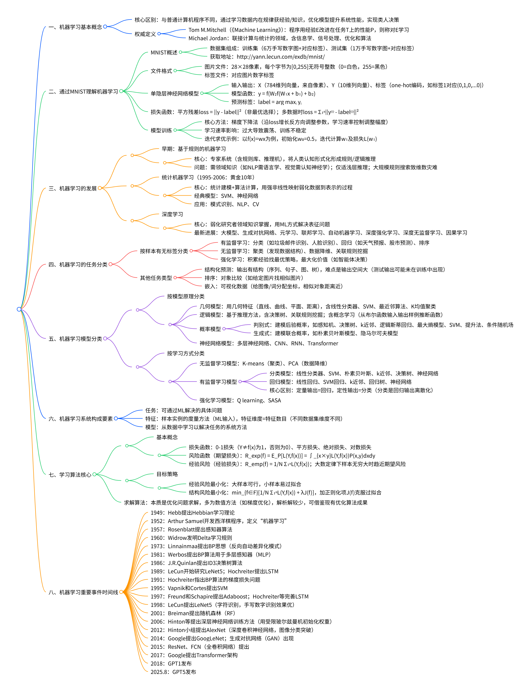

# 概述
## 思维导图

## 一、机器学习基本概念
### 1. 定义与领域定位
- 核心定义：机器学习是实现人工智能的主要方法，通过学习数据内在规律性信息优化系统性能，使计算机具备类人决策能力。
- 形式化定义（Tom M.Mitchell）：若程序通过经验𝑬在任务𝑻上提升性能𝑷，则称程序对𝑬进行学习。
- 领域定位（Michael Jordan）：联接计算与统计的领域，涵盖信息学、信号处理、优化和算法。

### 2. 典型案例：MNIST数据集
- 数据集构成：含训练集（6万手写数字图片+对应标签）、测试集（1万手写数字图片+对应标签），获取地址为http://yann.lecun.com/exdb/mnist/。
- 数据格式：图片为28×28像素，每个像素用[0,255]无符号整数表示（255=黑色，0=白色）；标签可采用one-hot编码。

### 3. 模型与训练核心
- 单隐层神经网络模型：输入为784维像素列向量，输出为10维结果列向量，预测函数为\(y=f\left(W_{2} f\left(W_{1} x+b_{1}\right)+b_{2}\right)\)，预测标签为\(lable =arg max _{i} y_{i}\)。
- 损失与风险函数：损失函数含平方残差损失（\(loss =\| y- label \| ^{2}\)）、0-1损失函数等；风险函数含期望风险（\(R_{exp }(f)=\int _{x× y}L(Y,f(x))P(x,y)\, dxdy\)）、经验风险（\(R_{emp }(f)=\frac{1}{N} \sum_{i=1}^{N} L(Y, f(x))\)）。
- 训练方法：采用梯度下降法，通过调整学习速率控制参数更新幅度，以迭代优化实现损失最小化；当数据量较大时，损失计算为\(loss =\sum_{i=1}^{N}\left\| y^{(i)}-l a b l e^{(i)}\right\| ^{2}\)。

## 二、机器学习发展历程
### 1. 发展阶段
- 基于规则的机器学习：以专家系统为核心，需领域知识构建规则，存在浅层推理局限与维数灾难问题。
- 统计机器学习（1995-2006年黄金10年）：结合统计建模与算法计算，代表模型为SVM、神经网络，应用于模式识别、NLP、CV领域。
- 深度学习：以数据驱动解决表征问题，弱化领域知识依赖，典型方向包括大模型、生成对抗网络、元学习、联邦学习等。

### 2. 关键事件与算法时间线
- 1949年：Hebb提出Hebbian学习理论；1952年：Arthur Samuel开发西洋棋程序，定义“机器学习”；1957年：Rosenblatt提出感知器算法。
- 1980-1990年代：1986年J.R.Quinlan提出ID3决策树算法，1986年BP算法应用于多层感知器，1995年Vapnik和Cortes提出SVM，1997年Freund和Schapire提出Adaboost、Hochreiter提出LSTM。
- 2000年后：2001年Breiman提出随机森林，2006年Hinton提出深层神经网络训练方法，2012年AlexNet推动深度卷积神经网络发展，2017年Transformer架构问世，2025年预计GPT5发布。

## 三、机器学习任务类型
### 1. 有监督学习
- 分类：预测离散类别（如垃圾邮件识别、人脸识别）；回归：预测连续数值（如天气预报、股市预测）。
- 排序：实现对象比较（如相似图片检索）；结构化预测：输出序列、图等结构化结果（如语音识别），面临输出空间庞大挑战。

### 2. 无监督学习
- 核心任务：聚类（发现数据内在结构）、数据降维、关联规则挖掘、嵌入可视化（将高维数据映射到低维空间，如图像/词嵌入）。

### 3. 强化学习
- 核心逻辑：通过经验积累优化策略以最大化价值，含无模型学习、有模型学习两类方法。

## 四、机器学习系统构成与学习算法
### 1. 系统核心要素
- 任务：可通过机器学习解决的问题；特征：样本属性的度量（含特征维度）；模型：从数据学习以解决任务的系统方法。

### 2. 模型分类
- 几何模型：基于几何特征（直线、曲线、距离等）构建，含线性分类器、SVM、K均值聚类等；逻辑模型：基于推理方法，含决策树、关联规则挖掘、概念学习（推断布尔函数）。
- 概率模型：分判别式（如感知机、决策树、逻辑斯蒂回归）与生成式（如朴素贝叶斯、隐马尔可夫模型），分别建模后验概率与联合概率；神经网络模型：含多层神经网络、CNN、RNN、Transformer。

### 3. 学习算法
- 目标策略：经验风险最小化（适用于大样本，小样本易过拟合）、结构风险最小化（加正则化项\(\lambda J(f)\)，克服过拟合）。
- 求解算法：以数值方法为主（如梯度优化），利用最优化算法成果，部分问题无解析解需迭代求解。

## 五、核心教学知识模块
| 模块序号 | 模块名称               | 教学内容                                  | 教学目标与要求                                  |
|----------|------------------------|-------------------------------------------|-----------------------------------------------|
| 1        | 机器学习概述           | 概念及发展、构成要素                      | 理解概念与发展，掌握任务、模型、特征内涵          | 
| 2        | 几何模型               | 基本线性模型、两分类任务                  | 理解线性分类器、SVM分类器                      | 
| 3        | 逻辑模型               | 概念学习、决策树方法                      | 了解概念学习定义，掌握假设空间与概念学习方法      | 
| 4        | 人工神经网络           | 神经网络基本概念、BP算法                  | 理解神经网络原理与适用任务，掌握BP算法           | 
| 5        | 机器学习实验相关讨论   | 模型评估方法、度量指标选择与解释          | 掌握指标选取、度量方式与结果解释                | 
| 6        | 计算学习理论           | 一般学习模型、一致收敛性、偏差与复杂性权衡、VC维 | 掌握PAC学习理论，理解偏差与复杂性权衡            | 
| 7        | 概率模型               | 产生式概率模型、含隐变量的概率模型        | 理解贝叶斯最优性，掌握朴素贝叶斯、逻辑回归等    | 
| 8        | 集成学习               | 集成学习概念、Boosting/Bagging/随机森林、结合策略 | 理解集成学习分类，掌握经典算法与集成策略        | 
| 9        | 强化学习               | 强化学习基本概念、有模型/免模型学习       | 理解核心概念，掌握免模型学习方法                | 
| 10       | 深度学习               | 基本概念、典型模型（CNN、RNN等）、应用举例 | 理解深度学习内涵，掌握经典模型原理              | 
| 11       | 项目实践               | 结合前述知识解决实际问题                  | 应用机器学习方法完成实践任务                  | 

## 六、技术实践要求
- Python编程：编写程序导入MNIST数据集，实现数据统计与呈现，需提交带注释的程序及输出结果（第三周提交）。
- 应用分析：选取最新机器学习应用案例，制作2页PPT（1页图示、1页说明输入/输出数据及可能的损失函数，第二周提交）。