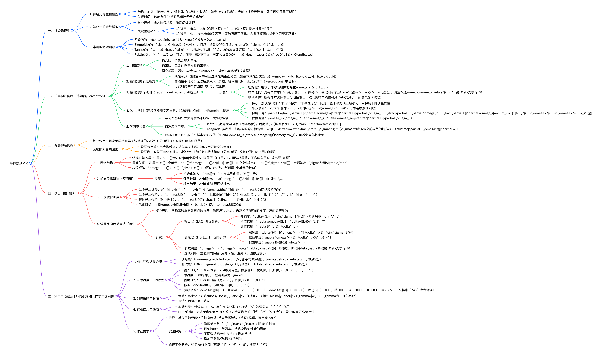

# 神经网络初步
## 思维导图

## 一、神经元模型
### 1. 生物模型
- 结构组成：树突（接收输入信号）、细胞体（信息时空整合）、轴突（传递信号）、突触（神经元连接，连接强度具可塑性）。
- 发现历程：1904年明确神经元结构，1943年MP模型抽象生物神经元结构。

### 2. 计算模型
- 核心逻辑：模拟突触兴奋/抑制（权值调节），通过求和运算整合输入，经激活函数输出结果。
- 关键组件：输入信号、权值向量、求和单元、激活函数、输出信号。

### 3. 常用激活函数
- 阶跃函数：\(v(x)=\begin{cases}1 & x \geq 0 \\ 0 & x<0\end{cases}\)，非连续不可导。
- Sigmoid函数：\(\sigma(x)=\frac{1}{1+e^{-x}}\)，导数\(\sigma'(x)=\sigma(x)[1-\sigma(x)]\)，连续可导。
- Tanh函数：\(tanh(x)=\frac{e^{x}-e^{-x}}{e^{x}+e^{-x}}\)，导数\(tanh'(x)=1-(tanh(x))^2\)，连续可导。
- ReLU函数：\(f(x)=max(0, x)\)，导数\(f'(x)=\begin{cases}0 & x \leq 0 \\ 1 & x>0\end{cases}\)，简单高效。

## 二、单层神经网络（感知器）
### 1. 网络结构
- 组成部分：输入层（仅输入单元）、输出层（含计算单元和输出单元），无隐藏层。
- 模型表达式：\(O(x)=sgn(\omega^T x + b)\)，其中\(\omega\)为权值向量，\(b\)为偏置。

### 2. 表征能力
- 线性可分：二维空间中可表示线性决策面，实现简单布尔函数（如与、或）。
- 局限性：无法解决非线性可分问题（如异或（XOR））。

### 3. 学习法则
#### （1）感知器学习法则
- 初始化：用较小非零随机数初始化权值\(\omega_i\)。
- 迭代步骤：计算输出\(o(x^{(j)})\)与误差\(e^{(j)}=y^{(j)}-o(x^{(j)})\)，调整权值\(\omega:=\omega+\eta e^{(j)} x^{(j)}\)。
- 收敛条件：训练样本实际输出与期望输出完全一致（仅适用于线性可分数据）。

#### （2）Delta法则（连续感知器）
- 优化目标：最小化平方误差\(E=\frac{1}{2}\sum_{j=1}^{M}(y^{(j)}-O^{(j)})^2\)。
- 梯度计算：权值梯度\(\nabla E=-\sum_{j=1}^{M}[y^{(j)}-f(\omega x^{(j)})]f'(\omega x^{(j)})x_i^{(j)}\)。
- 权值更新：\(\Delta \omega_i=-\eta \frac{\partial E}{\partial \omega_i}\)，适用于连续输出场景。

### 4. 学习率优化
- 核心问题：学习率过大导致训练震荡，过小导致收敛缓慢。
- 自适应策略：Adagrad算法（按参数过往导数均方根调整学习率）、\(1/t\)衰减（\(\eta^t=\eta/\sqrt{t+1}\)）。
- 梯度下降变体：随机梯度下降（单样本增量更新权值，避免局部极小值）。

## 三、两层神经网络
### 1. 网络结构
- 组成部分：输入层、单隐藏层、输出层，隐藏层引入非线性变换。
- 核心突破：通过隐藏层解决单层感知器无法处理的异或问题，扩展模型表达能力。

### 2. 表达能力提升
- 隐层节点数影响：节点数增加可表示更复杂的决策边界（开域、闭域）。
- 隐层数影响：双隐层网络可通过凸域组合表示任意形状决策面，适配复杂分类/回归任务。

## 四、多层网络（BP神经网络）
### 1. 网络结构定义
- 层级划分：输入层（第0层，\(A^{(0)}=x\)）、隐藏层（1~L-1层）、输出层（第L层）。
- 关键参数：第\(l\)层单元数\(D^{(l)}\)，权值矩阵\(\omega^{(l-1)}\)（\(D^{(l)} \times D^{(l-1)}\)），偏置向量\(B^{(l-1)}\)。

### 2. 前向传播算法（预测过程）
- 核心公式：第\(l\)层线性输出\(Z^{(l)}=\omega^{(l-1)}A^{(l-1)}+B^{(l-1)}\)，激活输出\(A^{(l)}=\sigma(Z^{(l)})\)。
- 算法步骤：从输入层\(A^{(0)}=x\)开始，逐层计算激活输出，直至输出层\(A^{(L)}\)。

### 3. 代价函数
- 单样本误差：二次代价函数\(J_{\omega,B}(x^{(j)},y^{(j)})=\frac{1}{2}\left\|y^{(j)}-A^{(L)}\right\|_2^2\)。
- 整体误差：\(J_{\omega,B}(X,Y)=\frac{1}{2M}\sum_{j=1}^{M}\left\|y^{(j)}-A^{(L)}\right\|_2^2\)，优化目标为最小化整体误差。

### 4. 误差反向传播算法（BP算法）
#### （1）核心思想
- 链式法则：从输出层反向计算各层误差（敏感度向量\(\delta^{(l)}\)），推导权值和偏置的梯度，迭代更新参数。

#### （2）关键步骤
1. 输出层（第L层）：\(\delta^{(L)}=-e \circ \sigma'(Z^{(L)})\)，权值梯度\(\nabla \omega^{(L-1)}=\delta^{(L)}(A^{(L-1)})^T\)，偏置梯度\(\nabla B^{(L-1)}=\delta^{(L)}\)。
2. 隐藏层（第L-1至1层）：\(\delta^{(l)}=[(\omega^{(l)})^T \delta^{(l+1)}] \circ \sigma'(Z^{(l)})\)，权值梯度\(\nabla \omega^{(l-1)}=\delta^{(l)}(A^{(l-1)})^T\)，偏置梯度\(\nabla B^{(l-1)}=\delta^{(l)}\)。
3. 参数更新：\(\omega^{(l)}:=\omega^{(l)}-\eta \nabla \omega^{(l)}\)，\(B^{(l)}:=B^{(l)}-\eta \nabla B^{(l)}\)。
4. 迭代训练：重复前向传播与反向传播，直至误差收敛。

## 五、单隐藏层BPNN处理MNIST数据集
### 1. 数据集介绍
- 构成：训练集（6万张手写数字图片+标签）、测试集（1万张手写数字图片+标签），图片为28×28像素。
- 数据预处理：像素值归一化至[0,1]区间，输入向量为784维（28×28展开），标签采用One-Hot编码。

### 2. 模型设计
- 网络结构：输入层（784维）、隐藏层（300个单元）、输出层（10维，对应0~9数字）。
- 激活函数：隐藏层与输出层均采用Sigmoid函数。
- 正则化：引入L2正则化项\(loss=\|y-label\|^2+\gamma\|w\|^2\)，避免过拟合。

### 3. 策略与算法
- 优化策略：最小化平方残差损失函数。
- 优化算法：随机梯度下降法。

### 4. 实验结果与分析
- 错误率：6.67%，部分错误源于模型无法捕捉像素间空间关系（如数字“5”被误分为“4”“6”）。
- 局限性：简单BPNN难以提取复杂空间特征，需深度学习模型（如CNN）优化。

## 多层神经网络的前向传播与误差反向传播算法解析（基于《神经网络初步.pdf》）
多层神经网络（如BP网络）的核心是“前向传播预测输出，反向传播优化参数”，两者结合实现模型学习。以下结合课件定义、步骤及实例，逐步拆解核心逻辑，并标注对应课件段落以确保准确性。

### 一、基础：多层神经网络的结构定义（先明确“层”与“符号”）
在理解算法前，需先明确课件中多层网络的结构约定（🔶1-176、🔶1-179、🔶1-189）：
- **层的划分**：包含输入层（第0层，仅传递输入，无计算）、隐藏层（1~L-1层）、输出层（第L层）。“L层网络”不含输入层，例如“2层网络”=1个隐藏层+1个输出层。
- **核心符号**（课件统一符号，需牢记）：
  - $A^{(l)}$：第l层的**激活输出向量**（经过激活函数后的输出，是下一层的输入），输入层$A^{(0)}=x$（x为样本输入向量，如MNIST的28×28像素→784维向量）；
  - $Z^{(l)}$：第l层的**线性输出向量**（未经过激活函数，$Z^{(l)}=$权值×上一层激活输出+偏置）；
  - $\omega^{(l-1)}$：第l-1层到第l层的**权值矩阵**（行数=第l层单元数，列数=第l-1层单元数，每行对应第l层1个单元的权值）；
  - $B^{(l-1)}$：第l-1层到第l层的**偏置向量**（维度=第l层单元数，每个元素对应第l层1个单元的偏置）；
  - $\sigma(\cdot)$：**激活函数**（需可微，课件常用Sigmoid：$\sigma(z)=\frac{1}{1+e^{-z}}$，导数$\sigma'(z)=\sigma(z)(1-\sigma(z))$，🔶1-184、🔶1-185）；
  - $D^{(l)}$：第l层的**单元数量**（如输入层$D^{(0)}=784$，隐藏层$D^{(1)}=300$，输出层$D^{(2)}=10$，对应课件MNIST模型，🔶1-257、🔶1-259）。

### 二、前向传播算法：从“输入”到“输出”的预测过程
前向传播（Forward Propagation）是“逐层计算激活输出”的过程，核心是“线性组合+激活函数”，最终得到模型的预测结果（用于分类或回归）（🔶1-194~🔶1-198）。

#### 1. 前向传播的核心公式（课件推导）
对第l层（从1到L），计算逻辑如下：
1. **线性组合**：计算第l层的线性输出$Z^{(l)}$（融合上一层的激活输出、权值和偏置）：  
   $$Z^{(l)} = \omega^{(l-1)} \cdot A^{(l-1)} + B^{(l-1)}$$  
   （矩阵乘法：$\omega^{(l-1)}$（$D^{(l)}×D^{(l-1)}$） × $A^{(l-1)}$（$D^{(l-1)}×1$） → $D^{(l)}×1$，再加上偏置$B^{(l-1)}$（$D^{(l)}×1$））
2. **激活处理**：用激活函数$\sigma(\cdot)$处理$Z^{(l)}$，得到第l层的激活输出$A^{(l)}$（确保模型能拟合非线性关系）：  
   $$A^{(l)} = \sigma(Z^{(l)})$$
3. **输出结果**：当l=L（输出层）时，$A^{(L)}$即为模型的**预测输出**（如MNIST中$A^{(2)}$是10维向量，对应0~9的预测概率）。

#### 2. 前向传播的步骤（课件流程）
以“2层网络”（输入层0→隐藏层1→输出层2）为例，步骤如下（🔶1-195~🔶1-198）：
1. **初始化输入**：输入层（第0层）$A^{(0)} = x$（x为样本向量，如$x=[x_1, x_2, ..., x_{784}]^T$，MNIST的784维像素）；
2. **计算隐藏层（第1层）**：  
   - 线性输出：$Z^{(1)} = \omega^{(0)} \cdot A^{(0)} + B^{(0)}$（$\omega^{(0)}$是$D^{(1)}×D^{(0)}$矩阵，如300×784；$B^{(0)}$是300×1向量）；  
   - 激活输出：$A^{(1)} = \sigma(Z^{(1)})$（300维向量，作为输出层的输入）；
3. **计算输出层（第2层）**：  
   - 线性输出：$Z^{(2)} = \omega^{(1)} \cdot A^{(1)} + B^{(1)}$（$\omega^{(1)}$是$D^{(2)}×D^{(1)}$矩阵，如10×300；$B^{(1)}$是10×1向量）；  
   - 激活输出：$A^{(2)} = \sigma(Z^{(2)})$（10维向量，即预测输出）；
4. **输出结果**：$A^{(2)}$即为当前样本的预测值（如$A^{(2)}=[0.01, 0.92, 0.03, ..., 0.02]^T$，表示预测为“1”的概率最高）。

#### 3. 前向传播实例（简化版，贴合课件MNIST模型）
为简化计算，将“2层网络”参数缩小（保留逻辑）：
- **网络结构**：输入层$D^{(0)}=2$（模拟2个特征）→ 隐藏层$D^{(1)}=2$（2个单元）→ 输出层$D^{(2)}=1$（回归任务，预测1个连续值）；
- **激活函数**：Sigmoid（$\sigma(z)=\frac{1}{1+e^{-z}}$，导数$\sigma'(z)=\sigma(z)(1-\sigma(z))$，🔶1-185）；
- **初始参数**：  
  - 权值$\omega^{(0)}$（隐藏层权值，2×2）：$\begin{bmatrix} 0.2 & 0.3 \\ 0.1 & 0.4 \end{bmatrix}$；  
  - 偏置$B^{(0)}$（隐藏层偏置，2×1）：$\begin{bmatrix} 0.1 \\ 0.2 \end{bmatrix}$；  
  - 权值$\omega^{(1)}$（输出层权值，1×2）：$\begin{bmatrix} 0.5 & 0.6 \end{bmatrix}$；  
  - 偏置$B^{(1)}$（输出层偏置，1×1）：$\begin{bmatrix} 0.3 \end{bmatrix}$；
- **输入样本**：$x = [1.0, 0.8]^T$（即$A^{(0)} = [1.0, 0.8]^T$）；
- **真实标签**：$y = 0.7$（回归任务的真实值）。

##### 实例计算步骤：
1. **隐藏层（第1层）计算**：  
   - 线性输出$Z^{(1)} = \omega^{(0)} \cdot A^{(0)} + B^{(0)}$：  
     $$Z^{(1)} = \begin{bmatrix} 0.2×1.0 + 0.3×0.8 \\ 0.1×1.0 + 0.4×0.8 \end{bmatrix} + \begin{bmatrix} 0.1 \\ 0.2 \end{bmatrix} = \begin{bmatrix} 0.2+0.24 \\ 0.1+0.32 \end{bmatrix} + \begin{bmatrix} 0.1 \\ 0.2 \end{bmatrix} = \begin{bmatrix} 0.54 \\ 0.62 \end{bmatrix}$$  
   - 激活输出$A^{(1)} = \sigma(Z^{(1)})$：  
     $$A^{(1)} = \begin{bmatrix} \frac{1}{1+e^{-0.54}} \\ \frac{1}{1+e^{-0.62}} \end{bmatrix} \approx \begin{bmatrix} 0.632 \\ 0.650 \end{bmatrix}$$（Sigmoid计算：$e^{-0.54}≈0.583$，$1/(1+0.583)≈0.632$）；

2. **输出层（第2层）计算**：  
   - 线性输出$Z^{(2)} = \omega^{(1)} \cdot A^{(1)} + B^{(1)}$：  
     $$Z^{(2)} = [0.5×0.632 + 0.6×0.650] + 0.3 = [0.316 + 0.39] + 0.3 = 1.006$$  
   - 激活输出$A^{(2)} = \sigma(Z^{(2)})$：  
     $$A^{(2)} = \frac{1}{1+e^{-1.006}} ≈ 0.732$$（即模型预测值为0.732，与真实值0.7有误差）。

##### 实例结论：
前向传播完成“输入→预测输出”的过程，当前误差为$e = y - A^{(2)} = 0.7 - 0.732 = -0.032$，后续需通过**反向传播**调整参数以减小误差。

### 三、误差反向传播算法：从“输出误差”到“参数调整”的优化过程
误差反向传播（Back Propagation，简称BP）是“从输出层反向计算各层误差贡献，通过梯度下降调整权值和偏置”的过程，核心是**链式法则**（🔶1-205~🔶1-227）。其目标是最小化“二次代价函数”（课件定义的损失函数，🔶1-191~🔶1-193、🔶1-200）。

#### 1. 前提：二次代价函数（优化目标）
课件中多层网络的代价函数为“平均平方误差”，用于衡量预测输出与真实标签的差距（🔶1-193、🔶1-200）：
- 单个样本的代价：$J = \frac{1}{2}\|e\|_2^2 = \frac{1}{2}(y - A^{(L)})^2$（$e = y - A^{(L)}$为输出误差，L为输出层）；
- 优化目标：找到$\omega^{(l)}$和$B^{(l)}$，使$J$最小（通过梯度下降沿“代价函数减小最快的方向”调整参数）。

#### 2. 核心概念：敏感度$\delta^{(l)}$
反向传播的关键是定义“敏感度$\delta^{(l)}$”——**代价函数对第l层线性输出$Z^{(l)}$的偏导数**（$\delta^{(l)} = \frac{\partial J}{\partial Z^{(l)}}$），它表示“第l层线性输出的微小变化对总代价的影响程度”（🔶1-208、🔶1-214）。

- 物理意义：$\delta^{(l)}$越大，说明第l层的输出对误差的“贡献越大”，需重点调整该层对应的权值和偏置；
- 计算逻辑：从输出层（L层）反向推导至隐藏层（1层），因为输出层的误差已知（$e = y - A^{(L)}$），可逐层回溯各层的误差贡献。

#### 3. 反向传播的核心公式（课件推导，分两层计算）
以“2层网络”（输出层L=2，隐藏层l=1）为例，核心公式来自课件🔶1-208~🔶1-226：

##### （1）输出层（L=2）的敏感度$\delta^{(2)}$与梯度
- 敏感度$\delta^{(2)}$：因$A^{(2)} = \sigma(Z^{(2)})$，根据链式法则：  
  $$\delta^{(2)} = \frac{\partial J}{\partial Z^{(2)}} = \frac{\partial J}{\partial A^{(2)}} \cdot \frac{\partial A^{(2)}}{\partial Z^{(2)}}$$  
  代入$J = \frac{1}{2}(y - A^{(2)})^2$（$\frac{\partial J}{\partial A^{(2)}} = -(y - A^{(2)})$）和Sigmoid导数（$\frac{\partial A^{(2)}}{\partial Z^{(2)}} = A^{(2)}(1 - A^{(2)})$），得：  
  $$\delta^{(2)} = -(y - A^{(2)}) \circ A^{(2)} \circ (1 - A^{(2)})$$  
  （$\circ$为**哈达玛积**，课件🔶1-214定义：同维度向量对应元素相乘，如$[a,b] \circ [c,d] = [ac, bd]$）

- 输出层权值$\omega^{(1)}$的梯度（需调整的方向）：  
  $$\nabla \omega^{(1)} = \frac{\partial J}{\partial \omega^{(1)}} = \delta^{(2)} \cdot (A^{(1)})^T$$  
  （权值的梯度=输出层敏感度 × 隐藏层激活输出的转置，因$\omega^{(1)}$连接$A^{(1)}$和$Z^{(2)}$）

- 输出层偏置$B^{(1)}$的梯度：  
  $$\nabla B^{(1)} = \frac{\partial J}{\partial B^{(1)}} = \delta^{(2)}$$  
  （偏置的梯度=输出层敏感度，因偏置直接加到$Z^{(2)}$，导数为1）

##### （2）隐藏层（l=1）的敏感度$\delta^{(1)}$与梯度
- 敏感度$\delta^{(1)}$：隐藏层的误差由输出层的误差传递而来，根据链式法则（课件🔶1-220~🔶1-221）：  
  $$\delta^{(1)} = \frac{\partial J}{\partial Z^{(1)}} = \frac{\partial J}{\partial Z^{(2)}} \cdot \frac{\partial Z^{(2)}}{\partial A^{(1)}} \cdot \frac{\partial A^{(1)}}{\partial Z^{(1)}}$$  
  代入$\frac{\partial J}{\partial Z^{(2)}} = \delta^{(2)}$、$\frac{\partial Z^{(2)}}{\partial A^{(1)}} = (\omega^{(1)})^T$（$Z^{(2)} = \omega^{(1)}A^{(1)} + B^{(1)}$，对$A^{(1)}$求导为$\omega^{(1)}$的转置）、Sigmoid导数$\frac{\partial A^{(1)}}{\partial Z^{(1)}} = A^{(1)}(1 - A^{(1)})$，得：  
  $$\delta^{(1)} = \left[ (\omega^{(1)})^T \cdot \delta^{(2)} \right] \circ A^{(1)} \circ (1 - A^{(1)})$$

- 隐藏层权值$\omega^{(0)}$的梯度：  
  $$\nabla \omega^{(0)} = \frac{\partial J}{\partial \omega^{(0)}} = \delta^{(1)} \cdot (A^{(0)})^T$$  
  （逻辑同输出层：权值连接$A^{(0)}$和$Z^{(1)}$，梯度=隐藏层敏感度 × 输入层激活输出的转置）

- 隐藏层偏置$B^{(0)}$的梯度：  
  $$\nabla B^{(0)} = \frac{\partial J}{\partial B^{(0)}} = \delta^{(1)}$$

##### （3）参数调整（梯度下降）
得到梯度后，沿“梯度负方向”调整权值和偏置（课件🔶1-226），公式为：  
$$\omega^{(l)} = \omega^{(l)} - \eta \cdot \nabla \omega^{(l)}$$  
$$B^{(l)} = B^{(l)} - \eta \cdot \nabla B^{(l)}$$  
- $\eta$：学习率（课件🔶1-108~🔶1-110），控制调整幅度（如$\eta=0.1$，过大会震荡，过小收敛慢）；
- 负号：表示“沿代价函数减小的方向”调整（梯度方向是代价增大最快的方向，负方向即减小最快）。

#### 4. 反向传播实例（承接前向传播实例，完整闭环）
沿用前向传播的简化模型：
- 已知前向结果：$A^{(0)}=[1.0,0.8]^T$，$A^{(1)}≈[0.632,0.650]^T$，$A^{(2)}≈0.732$，真实标签$y=0.7$，误差$e=0.7-0.732=-0.032$；
- 学习率$\eta=0.1$；
- 初始参数：$\omega^{(0)}=\begin{bmatrix}0.2&0.3\\0.1&0.4\end{bmatrix}$，$B^{(0)}=\begin{bmatrix}0.1\\0.2\end{bmatrix}$，$\omega^{(1)}=[0.5,0.6]$，$B^{(1)}=[0.3]$。

##### 实例计算步骤：
##### 第一步：计算输出层（L=2）的敏感度$\delta^{(2)}$与梯度
1. 敏感度$\delta^{(2)}$：  
   $$\delta^{(2)} = -(y - A^{(2)}) \cdot A^{(2)} \cdot (1 - A^{(2)})$$  
   （因输出层是1维，哈达玛积退化为普通乘法）  
   代入数值：$-(0.7 - 0.732) × 0.732 × (1 - 0.732) = -(-0.032) × 0.732 × 0.268 ≈ 0.032 × 0.196 ≈ 0.0063$

2. 输出层权值梯度$\nabla \omega^{(1)}$：  
   $$\nabla \omega^{(1)} = \delta^{(2)} \cdot (A^{(1)})^T = 0.0063 × [0.632, 0.650] ≈ [0.00398, 0.00410]$$

3. 输出层偏置梯度$\nabla B^{(1)}$：  
   $$\nabla B^{(1)} = \delta^{(2)} ≈ 0.0063$$

##### 第二步：计算隐藏层（l=1）的敏感度$\delta^{(1)}$与梯度
1. 敏感度$\delta^{(1)}$：  
   $$\delta^{(1)} = \left[ (\omega^{(1)})^T \cdot \delta^{(2)} \right] \circ A^{(1)} \circ (1 - A^{(1)})$$  
   - 第一步：计算$(\omega^{(1)})^T \cdot \delta^{(2)}$（$\omega^{(1)}$是1×2，转置后2×1）：  
     $$\begin{bmatrix} 0.5 \\ 0.6 \end{bmatrix} × 0.0063 ≈ \begin{bmatrix} 0.00315 \\ 0.00378 \end{bmatrix}$$  
   - 第二步：哈达玛积计算（对应元素相乘）：  
     $$\begin{bmatrix} 0.00315 × 0.632 × (1 - 0.632) \\ 0.00378 × 0.650 × (1 - 0.650) \end{bmatrix} ≈ \begin{bmatrix} 0.00315 × 0.632 × 0.368 \\ 0.00378 × 0.650 × 0.350 \end{bmatrix} ≈ \begin{bmatrix} 0.00073 \\ 0.00085 \end{bmatrix}$$

2. 隐藏层权值梯度$\nabla \omega^{(0)}$：  
   $$\nabla \omega^{(0)} = \delta^{(1)} \cdot (A^{(0)})^T = \begin{bmatrix} 0.00073 \\ 0.00085 \end{bmatrix} × [1.0, 0.8] ≈ \begin{bmatrix} 0.00073×1.0 & 0.00073×0.8 \\ 0.00085×1.0 & 0.00085×0.8 \end{bmatrix} ≈ \begin{bmatrix} 0.00073 & 0.00058 \\ 0.00085 & 0.00068 \end{bmatrix}$$

3. 隐藏层偏置梯度$\nabla B^{(0)}$：  
   $$\nabla B^{(0)} = \delta^{(1)} ≈ \begin{bmatrix} 0.00073 \\ 0.00085 \end{bmatrix}$$

##### 第三步：调整参数（梯度下降）
1. 输出层参数更新：  
   - 权值$\omega^{(1)}$：$\omega^{(1)} = \omega^{(1)} - \eta \cdot \nabla \omega^{(1)} ≈ [0.5 - 0.1×0.00398, 0.6 - 0.1×0.00410] ≈ [0.4996, 0.5996]$  
   - 偏置$B^{(1)}$：$B^{(1)} = B^{(1)} - \eta \cdot \nabla B^{(1)} ≈ 0.3 - 0.1×0.0063 ≈ 0.2994$

2. 隐藏层参数更新：  
   - 权值$\omega^{(0)}$：$\omega^{(0)} = \omega^{(0)} - \eta \cdot \nabla \omega^{(0)} ≈ \begin{bmatrix} 0.2-0.000073 & 0.3-0.000058 \\ 0.1-0.000085 & 0.4-0.000068 \end{bmatrix} ≈ \begin{bmatrix} 0.1999 & 0.2999 \\ 0.0999 & 0.3999 \end{bmatrix}$  
   - 偏置$B^{(0)}$：$B^{(0)} = B^{(0)} - \eta \cdot \nabla B^{(0)} ≈ \begin{bmatrix} 0.1 - 0.000073 \\ 0.2 - 0.000085 \end{bmatrix} ≈ \begin{bmatrix} 0.0999 \\ 0.1999 \end{bmatrix}$

##### 实例结论：
调整后的参数更接近“使代价函数最小”的方向——若用新参数重新前向传播，预测输出$A^{(2)}$会更接近真实值$y=0.7$（误差减小）。反复迭代“前向传播→反向传播→参数调整”，直到代价函数足够小，模型即训练完成（课件🔶1-227的“迭代训练”逻辑）。

### 四、核心逻辑总结（前向+反向的闭环）
| 过程         | 核心目标                | 计算方向       | 关键工具/公式                          | 课件对应段落               |
|--------------|-------------------------|----------------|----------------------------------------|----------------------------|
| 前向传播     | 从输入得到预测输出      | 输入层→输出层  | $Z^{(l)}=\omega^{(l-1)}A^{(l-1)}+B^{(l-1)}$；$A^{(l)}=\sigma(Z^{(l)})$ | 🔶1-194~🔶1-198            |
| 反向传播     | 从输出误差调整参数      | 输出层→输入层  | 敏感度$\delta^{(l)}$（链式法则）；梯度下降参数更新 | 🔶1-205~🔶1-227            |
| 迭代训练     | 最小化二次代价函数      | 循环迭代       | 反复执行“前向→反向→调整”              | 🔶1-227                    |

简言之：**前向传播是“预测”，反向传播是“学习”**，两者结合实现多层神经网络的训练，这也是后续处理复杂任务（如MNIST手写数字识别，🔶1-249~🔶1-287）的基础。