# Chapter1 Introduction
## 总览
### 1. 一段话总结
该文档是北京邮电大学刘炳言教授2025年9月关于操作系统概念的第一章导论内容，核心围绕操作系统的**定义与功能**（作为用户与硬件的中介，实现资源高效分配、控制程序执行及提供交互接口）、**计算机系统组织与架构**（含硬件组成、中断机制、存储层级、单核/多核/集群系统等）、**操作系统结构与运行模式**（多道程序设计、分时系统、双态操作等）、**核心管理功能**（进程、内存、存储、安全保护管理）、**计算环境类型**（传统、移动、分布式、云/边缘计算等）及**开源操作系统**展开，还涉及国产OS等课程思政内容，系统构建了操作系统的基础认知框架。

---

### 2. 思维导图（mindmap）
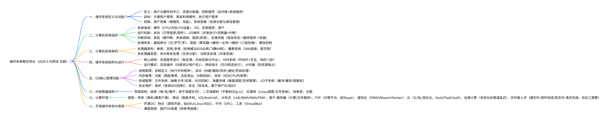

### 3. 详细总结
#### 一、文档基础信息
- **课程**：操作系统概念（第一章导论）
- **作者**：刘炳言（北京邮电大学计算机学院）
- **时间**：2025年9月
- **核心定位**：系统讲解操作系统的基础概念、计算机系统构成、OS功能模块及各类计算环境，为后续学习奠定基础。

#### 二、操作系统定义与核心目标
##### 1. 定义
- 本质：**用户与计算机硬件之间的中介程序**，同时具备三大角色：
  - 资源分配器：管理CPU、内存、I/O等硬件及程序、数据等软件资源，协调冲突请求，实现高效公平利用。
  - 控制程序：控制程序执行，防止错误及不当使用计算机。
  - 接口提供者：为系统程序、应用程序提供访问硬件资源的接口。
- 组成：**OS = 内核 + 系统程序**，内核是“始终运行的程序”，系统程序随OS预装，应用程序为用户特定需求服务。
##### 2. 目标
- 便捷性：让用户更易解决问题，使计算机系统易用。
- 高效性：最大化计算机硬件资源的利用率。
- 功能性：可靠执行用户程序，协调软硬件协同工作。
##### 3. 两大视角
| 视角 | 核心关注点 | 典型场景示例 |
| --- | --- | --- |
| 用户视角 | 接口友好、便捷性、性能（响应速度） | 工作站用户（专用资源）、手持设备（低资源+长续航）、嵌入式设备（无界面） |
| 系统视角 | 资源分配、硬件高效管理（CPU/内存/I/O/存储） | 大型机（多用户公平使用）、服务器（资源调度优化） |

#### 三、计算机系统组织
##### 1. 系统四大组成部分
| 组成部分 | 功能描述 | 示例 |
| --- | --- | --- |
| 硬件 | 提供基础计算资源 | CPU、内存、I/O设备（键盘/鼠标/磁盘/显示器） |
| 操作系统 | 控制协调硬件在应用与用户间的使用 | Windows、Linux、macOS |
| 应用程序 | 利用系统资源解决用户问题 | 编译器、浏览器、数据库系统、游戏 |
| 用户 | 系统的使用者 | 人、其他机器、外部计算机 |
##### 2. 关键运行机制
###### （1）启动流程（Booting）
- 引导程序（bootstrap program）：存储于ROM/EPROM（固件），开机或重启时加载，初始化系统所有组件，加载OS内核并启动执行。
###### （2）I/O操作与中断
- I/O执行特点：I/O设备与CPU可**并发执行**，每个设备由专属控制器管理，控制器含本地缓冲区，CPU通过“主存-缓冲区”传输数据。
- 中断作用：I/O完成后，控制器触发中断，通知CPU处理结果，是OS“中断驱动”的核心。
- 中断类型与处理：
  | 中断类型 | 触发原因 | 示例 |
  | --- | --- | --- |
  | 硬中断 | 硬件信号（外部事件） | 磁盘I/O完成、键盘按键 |
  | 系统调用/监控调用 | 软件请求OS服务 | read/write等系统调用 |
  | 陷阱（Trap）/异常 | 软件错误 | 除零错误（2+3/0）、未知软件异常（0xc0000409） |
- 中断处理流程：
  1. 保存被中断指令的地址及CPU状态（寄存器、程序计数器）。
  2. 通过**中断向量**（存储所有服务程序地址）跳转到对应中断服务程序。
  3. 执行服务程序（如读取I/O数据）。
  4. 恢复CPU状态，返回被中断的用户程序。

###### （3）存储体系
- 1. 基础存储单位：
  - 位（bit）：最小单位，值为0/1。
  - 字节（byte）：8位，计算机最小操作单位（无单bit移动指令，有字节移动指令）。
  - 字（word）：CPU原生数据单位，由1+字节组成（如64位CPU对应8字节字）。
- 2. 存储层级（按速度、成本、易失性排序）：

  | 存储层级 | 速度 | 容量 | 成本（每单位） | 易失性 | 管理主体 |
  | --- | --- | --- | --- | --- | --- |
  | 寄存器 | 最快（0.25-0.5ns） | 最小（<1KB） | 最高 | 易失 | 编译器 |
  | 缓存 | 快（0.5-25ns） | 较小（<16MB） | 高 | 易失 | 硬件 |
  | 主存（内存） | 中（80-250ns） | 中等（<64GB） | 中 | 易失（断电丢失） | 操作系统 |
  | 固态硬盘（SSD） | 较慢（25,000-50,000ns） | 较大（<1TB） | 较低 | 非易失 | 操作系统 |
  | 磁盘（HDD） | 慢（5,000,000ns） | 大（<10TB） | 低 | 非易失 | 操作系统 |
  | 三级存储（磁带/光盘） | 最慢 | 最大 | 最低 | 非易失 | OS/应用 |
- 3. 缓存机制：将常用信息从慢存储复制到快存储（如主存作为辅存缓存），访问时先查缓存，命中则快速使用，未命中则复制后使用；核心问题是缓存大小与替换策略设计。

#### 四、计算机系统架构
##### 1. 处理器架构分类
| 架构类型 | 特点 | 示例 |
| --- | --- | --- |
| 单核处理器 | 单通用CPU，传统主流 | Intel i7 8700 |
| 双核/多核处理器 | 单芯片集成多个核心，共享内存，基于SMP（对称多处理） | 神威26010众核（25cm²，260核，3万+亿次/秒）、飞腾64核（ARM架构，5120亿次/秒浮点峰值） |
| 多处理器系统（并行/紧耦合） | 多个CPU共享内存与资源，优势：**吞吐量提升、成本优化、可靠性提高**（故障容错） | 服务器（数万人民币级别） |
| 集群系统 | 多个独立系统通过SAN（存储区域网络）共享存储，提供高可用服务 | 北京邮电大学曙光天潮4000L、神威/天河超级计算机 |
##### 2. 多处理器运行模式
- 非对称多处理（Asymmetric Multiprocessing）：每个处理器分配特定任务（如一个负责I/O，一个负责计算）。
- 对称多处理（Symmetric Multiprocessing）：所有处理器执行所有任务，共享内存、I/O及中断，运行同一OS副本。

#### 五、操作系统结构与运行模式
##### 1. 核心结构
###### （1）多道程序设计（批处理系统）
- 目的：解决单用户无法充分利用CPU与I/O的问题，让CPU始终有任务执行。
- 机制：内存中存储部分作业（代码+数据），通过作业调度选择一个运行；当该作业等待（如I/O）时，OS切换到其他作业。
###### （2）分时系统（多任务）
- 本质：多道程序设计的逻辑扩展，实现**交互计算**。
- 关键：CPU时间划分为**时间片**，用户/进程交替占用时间片，响应时间需**<1秒**。
- 辅助技术：
  - 进程调度：多个就绪进程竞争CPU时的调度策略。
  - 交换（Swapping）：进程无法全部装入内存时，将部分进程调出/调入内存。
  - 虚拟内存：允许进程未完全装入内存时执行。
##### 2. 运行模式（双态操作）
- 目的：保护OS与系统组件免受错误用户程序影响，隔离用户间资源。
- 模式划分：
  - 内核态（Kernel Mode）：模式位=0，运行OS与**特权指令**（如设置计时器、修改内存映射）。
  - 用户态（User Mode）：模式位=1，运行用户程序，不可执行特权指令；若尝试执行，触发陷阱，CPU转交OS处理错误。
- 模式切换：系统启动时CPU处于内核态，加载OS后切换到用户态；用户程序调用系统服务时，切换到内核态，服务完成后返回用户态。
##### 3. 计时器（Timer）机制
- 作用：防止进程无限循环或独占资源。
- 原理：OS通过特权指令设置计时器计数器（物理时钟递减），计数器归零时触发中断，OS回收CPU控制权，或终止超时进程。

#### 六、操作系统核心管理功能
##### 1. 进程管理
- 进程定义：**执行中的程序**，是系统的基本工作单位；程序是静态实体，进程是动态实体。
- 进程资源需求：CPU、内存、I/O设备、文件及初始化数据；进程终止时需回收可复用资源。
- 进程类型：
  - 单线程进程：1个程序计数器，按序执行指令。
  - 多线程进程：每个线程1个程序计数器，并发执行。
- 核心活动：
  - 创建/删除用户与系统进程。
  - 进程的挂起与恢复。
  - 进程同步（协调并发执行）与通信（数据交换）。
  - 死锁处理（检测、避免、预防）。
##### 2. 内存管理
- 前提：程序执行时，部分/全部指令与数据需在内存中。
- 核心功能：
  - 跟踪内存使用情况（哪些区域被占用、占用者）。
  - 决定进程（或部分）与数据的内存进出时机。
  - 按需分配与回收内存空间。
- 目标：优化CPU利用率与系统响应速度。
##### 3. 存储管理
###### （1）文件系统管理
- 抽象：将物理存储（如磁盘）抽象为**文件**（逻辑存储单位），文件组织为目录。
- 设备差异：不同存储介质（磁盘/磁带）的访问速度、容量、传输率、访问方式（顺序/随机）不同，OS统一接口屏蔽差异。
- 核心活动：
  - 创建/删除文件与目录。
  - 提供文件/目录操作原语（如打开、读取、写入）。
  - 将文件映射到辅存，备份文件到非易失介质。
  - 访问控制：基于用户ID/组ID，限制谁能访问文件及访问权限（读/写/执行）。
###### （2）海量存储管理（磁盘为主）
- 重要性：计算机运行速度依赖磁盘子系统及调度算法。
- 核心活动：
  - 空闲空间管理（跟踪磁盘空闲块）。
  - 存储分配（为文件分配磁盘空间）。
  - 磁盘调度（优化磁头移动，减少访问时间）。
###### （3）I/O子系统
- 功能：
  - 内存管理：缓冲（传输时临时存数据）、缓存（快存储存常用数据）、假脱机（SPOOLing，重叠一个作业的输出与另一个作业的输入）。
  - 设备驱动接口：提供统一接口给内核，驱动程序适配具体硬件。
##### 4. 安全与保护
- 保护（Protection）：控制进程/用户对OS定义资源的访问（如限制用户修改系统文件）。
- 安全（Security）：防御内外攻击（如拒绝服务、病毒、身份盗窃）。
- 实现基础：
  - 用户标识（User ID/Security ID）：每个用户唯一ID，关联其文件与进程。
  - 组标识（Group ID）：定义用户组，统一管理组内权限。
  - 权限提升（Privilege Escalation）：用户切换到权限更高的有效ID（如Linux的sudo）。

#### 七、内核数据结构
- 作用：支撑OS内核高效管理资源与执行任务。
- 常用结构及用途：
  | 数据结构 | 特点 | 用途示例 |
  | --- | --- | --- |
  | 链表（单/双/循环） | 动态增减节点，单链表尾为null，双链表双向遍历，循环链表首尾相连 | 调度队列（存储等待CPU的进程） |
  | 二叉搜索树 | 左子树<=根<=右子树，普通树搜索性能O(n)，平衡树O(lg n) | 有序数据存储（如进程优先级排序） |
  | 红黑树 | 自平衡二叉搜索树，Linux内核中定义于rbtree.h/rbtree.c | CPU调度（组织运行任务）、EXT3文件系统（管理目录）、虚拟存储（管理VMAs） |
  | 哈希表（Hash Map） | 通过哈希函数映射键值对，查找速度快 | 快速查找资源（如进程ID到进程控制块的映射） |
  | 位图（Bitmap） | n位二进制表示n个项目状态（0/1） | 内存块/磁盘块的占用状态标记 |

#### 八、计算环境类型
| 计算环境 | 特点 | 典型示例 |
| --- | --- | --- |
| 传统环境 | 独立通用机器，多通过互联网互联；含瘦客户端（网络计算机）、门户系统 | 笔记本电脑、微机、企业内部门户 |
| 移动环境 | 手持设备（智能手机/平板），含GPS/陀螺仪等额外功能，依赖无线/蜂窝网络 | iPhone（iOS）、安卓手机（Android）、增强现实（AR）应用 |
| 分布式环境 | 独立异构系统通过网络（LAN/WAN/MAN/PAN）连接，OS提供跨网络通信与统一系统幻觉 | 企业分布式数据库、跨地域办公系统 |
| 客户-服务器 | 客户端请求服务，服务器响应；分计算服务器（提供数据库等服务）与文件服务器（存储检索文件） | 桌面/笔记本/手机客户端访问云服务器、数据库服务器 |
| P2P（对等） | 无客户端/服务器区分，所有节点为对等节点，可同时作为客户端与服务器 | Napster（文件共享）、Gnutella、Skype（VoIP） |
| 虚拟化环境 | 允许OS在其他OS内运行，依赖VMM（虚拟机管理器）；分仿真（不同CPU架构，慢）与原生虚拟化（同架构，快） | VMware（运行WinXP guest）、VirtualBox、Docker、KVM、Xen |
| 云环境 | 基于虚拟化，通过网络提供计算/存储/应用服务，按使用付费；类型：公/私/混合云，SaaS/PaaS/IaaS | 亚马逊EC2（IaaS）、Office 365（SaaS）、阿里云（混合云） |
| 边缘（雾）计算 | 数据生成设备旁的计算单元处理数据，减少原始数据传输，降低带宽占用与延迟 | 物联网传感器（本地处理数据后上传结果）、智能汽车本地控制 |
| 实时嵌入式环境 | 对外部事件在规定时间内响应，分硬实时（必须按时完成，如化工生产线报警）与软实时（高优先级，无严格 deadline，如电信呼叫处理） | 工业控制设备、汽车ECU、医疗监护仪 |

#### 九、开源操作系统与课程思政
##### 1. 开源操作系统
- 定义：提供源码而非仅二进制文件，与版权保护（DRM）相反。
- 发起：自由软件基金会（FSF），采用GPL（GNU通用公共许可证，copyleft）。
- 示例：GNU/Linux、BSD UNIX（Mac OS X核心）。
- 工具：VirtualBox（跨平台开源虚拟机，可运行 guest OS 用于探索）。
##### 2. 课程思政
- 主题：国产OS与系统软件发展，附参考文章《大国隐痛：做一个操作系统有多难？》（链接：https://new.qq.com/omn/20200716/20200716A0YG0M00.html）。

---
## 1.1 What Operating Systems Do
### 一、操作系统的定义与核心定位
1. **本质定义**：操作系统是介于计算机用户与硬件之间的中介程序，作为系统软件的核心，连接硬件资源与用户/软件的使用需求，无完全统一的定义，但具备明确核心功能。
2. **三大核心角色**：
   - **资源分配器**：管理CPU、内存、I/O设备等硬件资源，以及程序、数据等软件资源；在多用户或多程序的资源请求冲突时，以高效、公平为原则分配资源，避免浪费。
   - **控制程序**：监控程序执行过程，防止错误操作（如非法访问内存）和不当使用计算机（如某程序独占CPU），保障系统稳定运行。
   - **接口提供者**：为系统程序、应用程序提供统一接口，使其无需直接操作硬件即可调用资源，降低开发与使用难度。
3. **组成结构**：操作系统 = 内核 + 系统程序。其中，内核是“始终在计算机上运行的程序”，承担最核心的资源管理与控制任务；系统程序随操作系统预装（如文件管理工具），应用程序则为满足用户特定需求而存在（如浏览器、办公软件）。

### 二、操作系统的核心目标
1. **提升使用便捷性**：一是执行用户程序，直接帮助用户完成计算任务；二是简化操作流程（如通过图形界面替代复杂命令），让用户更易解决问题，降低计算机使用门槛。
2. **提高硬件利用率**：合理调度CPU、内存等硬件资源，避免资源闲置（如CPU在等待I/O设备响应时，切换到其他就绪程序），以高效方式发挥硬件性能。

### 三、计算机系统的四大组成部分
| 组成部分       | 功能描述                                                                 | 具体示例                                                                 |
|----------------|--------------------------------------------------------------------------|--------------------------------------------------------------------------|
| 硬件           | 提供计算机运行的基础物理资源，是所有软件运行的载体                         | CPU（运算核心）、内存（临时存储数据）、I/O设备（键盘、磁盘、显示器等）   |
| 操作系统       | 控制并协调硬件在不同应用程序与用户间的使用，是软硬件交互的“桥梁”           | Windows、Linux、macOS                                                    |
| 应用程序       | 基于操作系统接口开发，定义资源使用方式，针对性解决用户具体计算问题         | 文字处理器（如Word）、编译器、网页浏览器、数据库系统、视频游戏           |
| 用户           | 计算机系统的使用者，通过应用程序或操作系统接口获取服务，实现自身需求       | 操作电脑的人、与系统交互的其他机器（如打印机）、外部联网计算机           |

### 四、操作系统的两大核心视角
1. **用户视角：聚焦使用体验**  
   核心需求是便捷性、易用性与良好性能，不同场景下需求侧重不同：
   - 共享计算机（如大型机、小型机）：需平衡多用户需求，确保所有用户公平使用资源，避免个别用户占用过多资源。
   - 专用系统（如工作站）：用户拥有专属硬件资源，但常需访问服务器的共享资源（如共享文件、数据库）。
   - 手持设备（如手机、平板）：硬件资源有限（如续航、内存），优先优化易用性与电池寿命，简化操作界面。
   - 嵌入式计算机（如设备、汽车中的控制芯片）：几乎无用户界面，仅需自动化完成特定任务（如汽车发动机参数控制、家电运行管理）。

2. **系统视角：聚焦资源管理**  
   核心是高效分配与管理硬件（CPU、内存、I/O设备、存储）和软件（程序、数据）资源，目标是通过合理调度（如CPU时间片分配、内存分页管理），最大化资源利用率，减少闲置，确保系统整体高效运行。
## 1.2 Computer System Organization
### 一、计算机系统运行与启动机制
1. **系统运行结构**：计算机系统中，1个或多个CPU与设备控制器通过**公共总线**连接，共同访问共享内存；CPU与设备可并发执行，但会竞争内存周期（即同时请求使用内存的时间片段）。
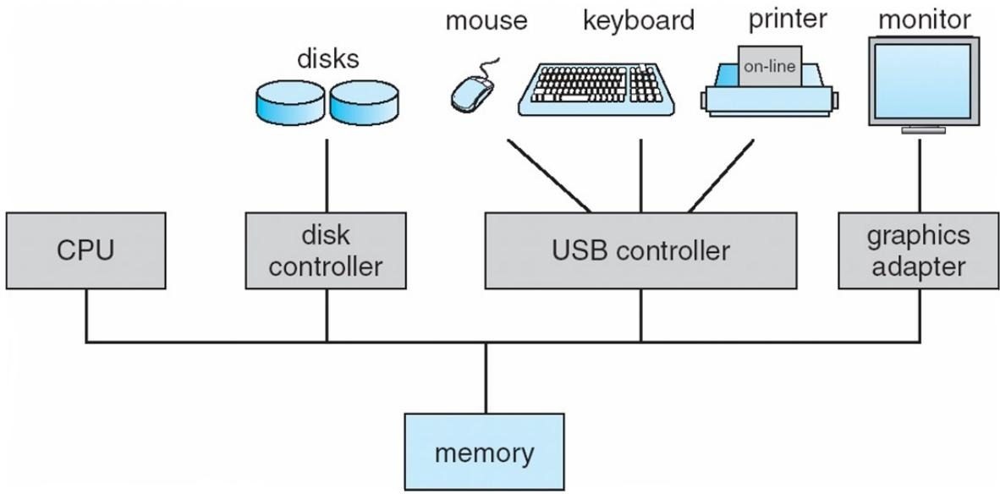
2. **系统启动流程（Booting）**：开机或重启时，首先加载**引导程序（bootstrap program）** ，该程序通常存储在ROM或EPROM中（这类存储介质被称为固件），其功能包括初始化系统所有组件（如CPU、内存、I/O设备），并加载操作系统内核，最终启动内核执行。

### 二、I/O操作与中断机制
#### （一）、I/O操作的核心机制
1. **并发执行特性**：I/O设备与CPU可同时工作（并发执行），避免CPU因等待I/O完成而闲置，提升系统整体效率。
2. **设备控制器作用**：每种类型的I/O设备（如磁盘、键盘）都由专属的设备控制器管理，且控制器自带**本地缓冲区**——这是I/O与CPU协同的关键：CPU不直接与I/O设备传输数据，而是通过“主存↔控制器本地缓冲区”交换数据，I/O设备则先将数据传输到自身控制器的本地缓冲区。
3. **中断通知机制**：当I/O设备完成数据传输（如磁盘读完数据）后，不会直接占用CPU，而是通过**触发中断**的方式告知CPU“操作已完成”，让CPU在合适时机处理结果。

#### （二）、中断的基础功能与处理流程
1. **操作系统与中断的关系**：操作系统是“中断驱动”的，即中断是触发操作系统执行核心任务（如处理I/O结果、响应错误）的重要触发信号。
2. **中断的核心功能**：当中断发生时，CPU会暂停当前运行的程序，通过**中断向量**（存储所有中断服务程序地址的表格）找到对应中断的处理程序（中断服务程序），并将控制权转移给该程序；处理完成后，再恢复原程序的执行。
3. **中断处理的关键步骤**：
   - 保存现场：中断架构需先保存被中断指令的地址，操作系统还要存储CPU的寄存器值、程序计数器等状态（即“保存CPU现场”），确保后续能准确恢复原程序。
   - 分类处理：针对不同类型的中断（如I/O完成、错误），系统有独立的代码段来决定具体处理动作，保证处理的针对性。

#### （三）、磁盘读入场景的中断时间线（单进程输入示例）
以“用户程序通过磁盘读入数据”为例，完整中断流程分为5步，清晰体现I/O与CPU的并发和协作：
1. 初始状态：用户程序在CPU上正常运行，磁盘等I/O设备处于空闲状态。
2. 发起请求：用户程序先准备好内存缓冲区，通过I/O接口（如`read`这类系统调用）和设备驱动，向磁盘发送“读数据”请求，完成输入准备。
3. 并行执行：磁盘响应请求并开始读取数据，此时磁盘（I/O设备）与CPU各自工作（并行执行）——CPU继续运行用户程序，磁盘同时传输数据到自身控制器的本地缓冲区。
4. 触发中断与处理：磁盘完成读操作后，触发I/O中断；CPU接收到中断信号，暂停当前用户程序，切换到中断服务程序（如磁盘驱动），将控制器本地缓冲区中的数据读取到主存；此时磁盘恢复空闲状态。
5. 恢复执行：中断服务程序处理完成后，CPU恢复之前保存的用户程序状态，回到中断发生前的位置继续执行用户程序。
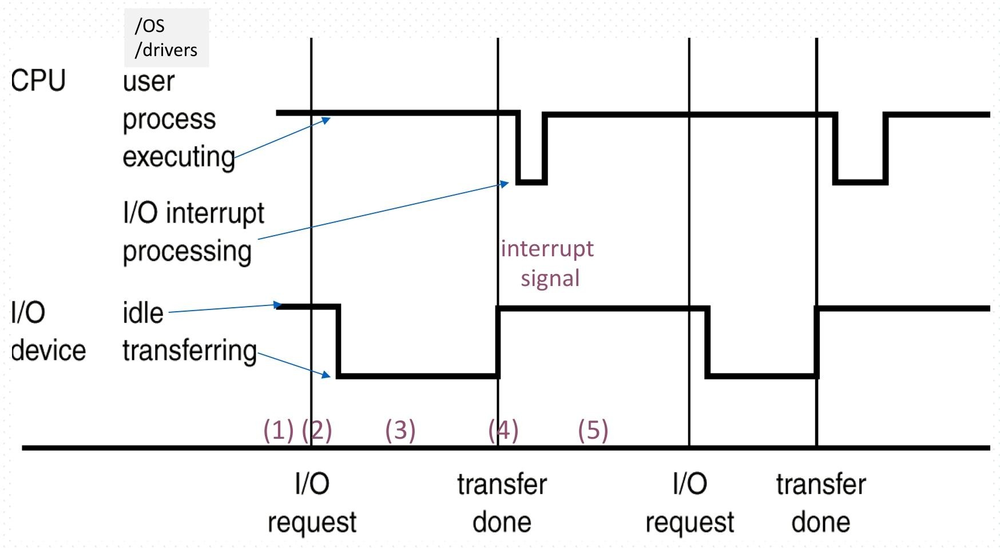

#### （四）、中断的三种类型及特点
根据触发源和用途，中断分为三类，各自对应不同场景：
1. **硬中断**：由硬件设备的信号触发，源于外部事件，如磁盘完成读操作、键盘按下按键时，设备会直接发送硬件信号引发中断。
2. **系统调用/监控调用**：由软件触发的中断，本质是用户程序主动请求操作系统提供服务——例如用户程序需要读文件时，通过`read`系统调用触发此类中断，让CPU切换到内核态执行OS服务。
3. **陷阱（Trap）/异常**：同样由软件生成，但触发原因是错误或异常情况，如数学运算中的“除零错误（2+3/0）”、程序访问非法内存地址等，这类中断用于让系统及时处理错误，避免程序崩溃或破坏系统。

### 三、存储系统相关定义与结构
#### （一）、计算机存储的基础定义与计量单位
1. **核心存储单位**
    - **位（bit）**：是计算机存储的最小单位，仅能表示0或1两种值，所有计算机存储内容（如数字、文字、图像等）均基于位的组合。
    - **字节（byte）**：由8位组成，是多数计算机中“最小便捷存储单位”——因多数计算机无单独移动1位的指令，但有移动1字节的指令。
    - **字（word）**：取决于计算机架构的原生数据单位，由1个及以上字节组成，例如64位寄存器、64位内存寻址的计算机，其字长通常为64位（即8字节），计算机多以字长为单位执行操作，而非逐字节处理。
2. **存储容量换算**
    - 遵循2的幂次换算规则：1KB（千字节）=1024字节，1MB（兆字节）=1024²字节，1GB（吉字节）=1024³字节，1TB（太字节）=1024⁴字节，1PB（拍字节）=1024⁵字节。
    - 特殊情况：计算机厂商常简化换算（如将1MB约作100万字节、1GB约作10亿字节）；而网络传输因“逐位移动数据”，计量单位为位（bit），与存储计量区分。

#### （二）、计算机存储的核心结构类型
1. **主存（内存）**
    - 是CPU可直接访问的大容量存储介质，支持随机访问（可直接读取任意地址数据），但具有**易失性**——断电后存储的数据会丢失。
2. **辅存（在线存储）**
    - 作为主存的扩展，提供大容量非易失性存储（断电数据不丢失），核心设备包括：
        - **硬盘（Hard disks）**：由覆盖磁性记录材料的金属/玻璃盘片构成，盘片表面逻辑划分为磁道，磁道再细分为扇区；磁盘控制器负责协调设备与计算机的逻辑交互。
        - **固态硬盘（Solid-state disks）**：速度快于传统硬盘，同样具备非易失性，依托多种技术实现，目前应用愈发广泛。
3. **三级存储（离线存储）**：属于大容量、低速、低成本的离线存储（如光盘、磁带），用于长期备份数据，不直接参与实时数据处理。
4. **网络存储系统**：如网络附加存储（NAS）、存储区域网络（SAN），通过网络实现存储资源的共享与集中管理。

#### （三）、存储系统的层级结构与核心特性
1. **层级划分依据**：存储系统按**速度、成本、易失性**分为不同层级，从高层到低层（如主存→辅存→三级存储），速度逐渐变慢、容量逐渐变大、单位存储成本逐渐降低、易失性从“易失”转为“非易失”。
2. **访问方式差异**：主存（一级存储）采用“按字节访问”，辅存、三级存储（二级/三级存储）采用“按块访问”，即每次读取或写入固定大小的数据块。

#### （四）、高速缓存（Caching）机制
1. **核心原理**：将“正在使用的信息”从低速存储临时复制到高速存储中，以提升数据访问效率——例如主存可视为辅存的高速缓存。
2. **工作流程**：访问数据时，先检查高速存储（缓存）：若数据存在（缓存命中），直接从缓存读取（速度快）；若数据不存在（缓存未命中），则将数据从低速存储复制到缓存，再进行使用。
3. **关键特点与设计要点**：缓存容量始终小于被缓存的低速存储，因此“缓存管理”是核心设计问题，需重点考虑缓存大小设定与数据替换策略（如淘汰长期未使用的数据），且缓存机制在计算机硬件、操作系统、软件等多个层面均有应用。
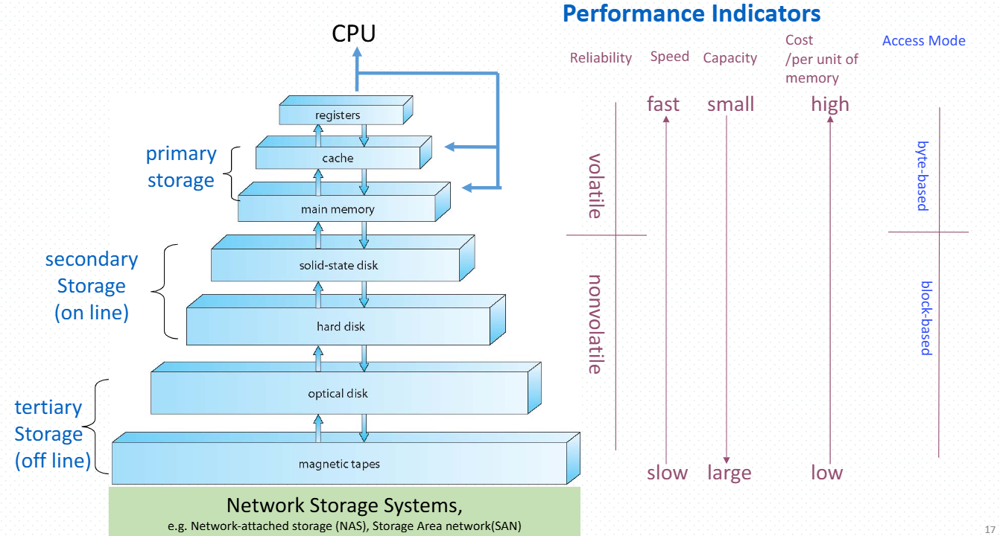

### 四、现代计算机工作逻辑
现代计算机通过“CPU-缓存-内存-I/O设备”的协同工作实现功能：CPU执行指令时，优先从缓存获取数据（提升速度），缓存未命中则从内存读取；I/O设备通过控制器与内存交换数据，借助中断机制与CPU并发执行，避免CPU闲置；同时，存储层级与缓存机制共同优化数据访问效率，确保系统整体性能。
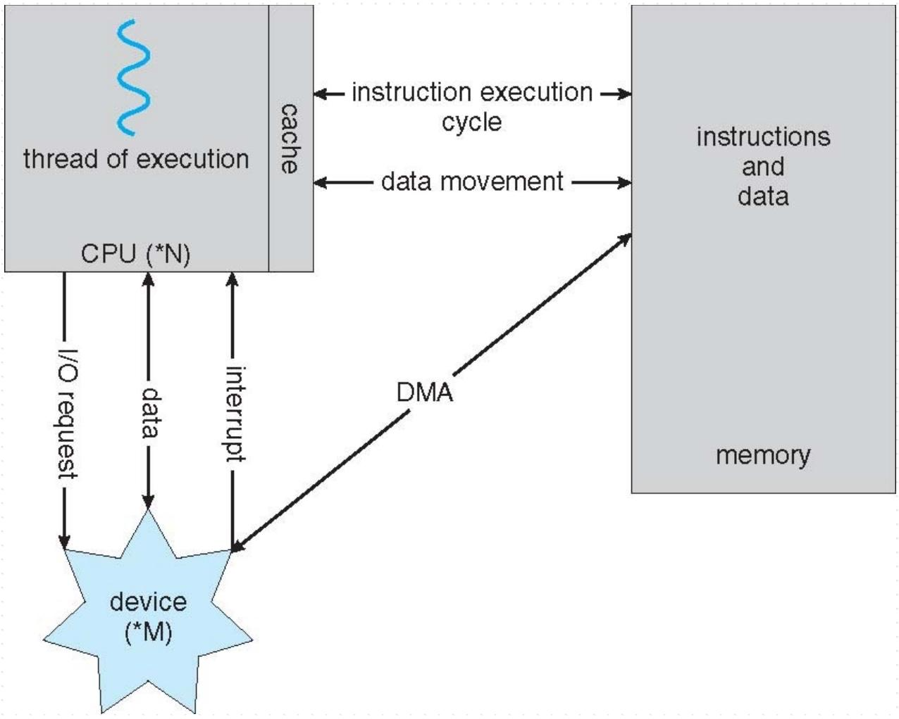
#### （一）、CPU 与执行相关部分
- **执行线程（thread of execution）**：代表 CPU 上运行的指令执行序列，体现程序运行的逻辑流。
- **缓存（cache）**：靠近 CPU 的高速存储区域，用于暂存常用的指令和数据，目的是加快 CPU 对指令和数据的访问速度，因为缓存的访问速度比内存快很多，能减少 CPU 等待内存的时间。
- **指令执行周期（instruction execution cycle）**：CPU 从内存获取指令、执行指令，并在这个过程中与内存进行数据交互（data movement），完成“取指令 - 执行指令 - 访问数据”等一系列操作。

#### （二）、设备与 CPU 的交互
- **I/O 请求（I/O request）**：设备（如图中用 `device (*M)` 表示，可包含磁盘、网卡等多种设备）向 CPU 发起输入/输出请求，比如请求从磁盘读取数据到内存。
- **数据传输（data）**：CPU 和设备之间会进行数据传输，例如把设备的数据读入内存，或者把内存中的数据写入设备。
- **中断（interrupt）**：当设备完成 I/O 操作后，会触发中断来通知 CPU（比如磁盘读完数据后，发送中断让 CPU 处理结果），这样 CPU 就不用一直去查询设备是否完成操作，能更高效地执行其他任务。

#### （三）、内存与 DMA 机制
- **内存（memory）**：是存储指令和数据的核心区域，CPU 和设备都需要与内存进行交互。
- **直接内存访问（DMA，Direct Memory Access）**：为了减少 CPU 在 I/O 数据传输过程中的开销，DMA 控制器可以直接协调设备和内存之间的数据传输（如图中 DMA 箭头连接设备和内存）。例如，磁盘读取数据时，DMA 能直接把磁盘的数据传输到内存，不需要 CPU 全程参与数据搬运，从而让 CPU 可以同时执行其他指令，提升系统整体的运行效率。

#### （四）、整体协同逻辑
这张图整体展现了计算机系统中“计算（CPU 执行指令）”和“I/O（设备交互）”的协同工作方式：CPU 主要负责指令的执行和调度，设备处理输入/输出任务，内存存储核心的指令和数据，缓存用于加速 CPU 的访问，中断机制保障设备与 CPU 能异步协作，DMA 则优化了 I/O 数据的传输效率，最终使得系统各组件能够高效配合运行。
## 1.3 Computer-System Architecture
### 一、计算机系统架构的核心类型
1. **单核处理器架构**：多数系统采用的传统架构，仅含一个通用处理器，承担所有计算与控制任务，结构简单，适用于基础计算场景（如早期个人电脑）。
2. **多处理器系统（并行/紧耦合系统）**：应用日益广泛且重要，由多个处理器协同工作，共享内存与系统资源。其核心优势包括：
   - 提升吞吐量：多处理器同时处理任务，增加单位时间内完成的工作量。
   - 规模经济性：相比多个独立单核系统，共享资源（如内存、I/O设备）降低整体成本。
   - 提高可靠性：支持“优雅降级”或容错——部分处理器故障时，剩余处理器仍可运行，避免系统整体崩溃。
   - 两类运行模式：
     - 非对称多处理：为每个处理器分配特定任务（如一个负责I/O管理，一个负责计算），分工明确。
     - 对称多处理：所有处理器无固定分工，可执行所有任务，共享内存、I/O及中断，灵活性更高。
3. **双核/多核/众核架构**：将多个处理器核心集成在单芯片上，属于多处理器的紧凑实现形式，兼顾性能与空间效率。典型案例包括：
   - 神威26010众核处理器（用于神威太湖之光高性能计算机）：面积仅25平方厘米，含260个运算核心，计算能力达每秒3万+亿次。
   - 飞腾64核CPU芯片（ARM架构）：通用64核处理器，浮点运算峰值速度5120亿次/秒，主要用于天河超级计算机的管理结点。
4. **集群系统**：由多个独立计算机（节点）通过网络连接协作，类似多处理器系统但节点独立性更强。核心特点包括：
   - 存储共享：通常通过存储区域网络（SAN）实现多节点共享存储资源。
   - 高可用性：可应对节点故障，分为两种模式：
     - 非对称集群：一个节点处于“热备”模式，仅在主节点故障时接管任务。
     - 对称集群：多个节点同时运行应用，相互监控，故障时自动切换。
   - 冲突避免：部分集群配备分布式锁管理器（DLM），防止多节点操作同一资源时产生冲突。
   - 高性能计算（HPC）用途：部分集群用于高性能计算，需应用程序支持并行处理以充分利用多节点资源。
## 1.4 Operating System Structure
### 一、多道程序设计（批处理系统）：提升资源利用率的核心机制
1. **设计必要性**：单个用户无法让CPU和I/O设备始终处于忙碌状态（例如程序等待I/O时，CPU会闲置），为解决资源浪费问题，多道程序设计应运而生。
2. **核心原理**：通过合理组织系统中的作业（含代码与数据），确保CPU始终有可执行的任务，避免闲置。具体机制包括：
   - 内存存储：仅将系统中全部作业的一部分（子集）存入内存，而非所有作业。
   - 作业调度：通过调度策略从内存中的作业里选择一个运行。
   - 任务切换：当当前运行的作业因等待事件（如I/O操作）暂停时，操作系统会立即切换到内存中的其他作业，让CPU持续工作。

### 二、分时系统（多任务）：实现交互式计算的扩展设计
1. **本质定位**：是多道程序设计的逻辑延伸，核心目标是让用户能与正在运行的作业实时交互，形成“交互式计算”体验。
2. **关键机制**：
   - 时间片划分：将CPU时间分割为多个“时间片”，用户、进程、作业或任务按顺序交替占用时间片，实现“并发”效果（因切换频率高，用户感知不到卡顿）。
   - 响应时间要求：为保证交互流畅，系统响应时间需控制在1秒以内。
   - 内存与进程管理：每个用户至少有一个程序在内存中执行（该程序对应一个“进程”）；若多个作业同时处于就绪状态，需通过CPU调度决定优先执行哪个；若内存无法容纳所有进程，通过“交换（swapping）”技术将部分进程调出/调入内存；借助“虚拟内存”技术，允许进程未完全装入内存时即可执行，进一步突破内存容量限制。

### 三、分时系统的CPU时间分配示意（以大型机场景为例）
从CPU时间分配来看，多个用户（如user1、user2、user3、user4）的作业（如job1、job2、job3、job4）会按时间片交替占用CPU：CPU先为user1的job1分配一个时间片，时间到后切换到user2的job2，依次轮换，最终实现多个用户的作业“同时”运行，且每个用户能实时与自己的作业交互（如输入指令、查看结果）。
## 1.5 Operating-System Operations
### 一、操作系统的中断驱动机制
操作系统是中断驱动的，中断分为硬件中断和软件中断。硬件中断由设备触发，比如磁盘完成读写操作时会向CPU发硬件中断；软件中断（也叫异常或陷阱）则源于软件层面，像除法运算中出现除以零的错误、用户程序请求操作系统服务（如调用`printf`函数时会触发系统调用这类软件中断），或者进程出现无限循环、进程间非法修改等问题时，都会产生软件中断。

### 二、双模式运行与特权指令
1. **目标**：保护操作系统和其他系统组件免受错误用户程序的影响，同时也防止错误用户程序之间互相干扰。
2. **特权指令**：是指那些可能会对系统造成危害的机器指令，被标记为特权指令，例如“设置定时器值”属于特权指令，而“读取时钟”则是非特权指令。
3. **双模式**：硬件/CPU通过模式位来指示当前的操作模式，有用户模式和内核模式两种。模式位为0时是内核模式，操作系统和特权指令在该模式下运行；模式位为1时是用户模式，用户程序在该模式下执行。并且，特权指令只能在内核模式下执行。如果用户程序在用户模式下试图执行特权指令，硬件不会执行这些指令，而是将其视为非法操作，会产生一个陷阱，CPU的控制权会转移到操作系统，由操作系统来处理这种错误。

### 三、用户模式与内核模式的切换
系统启动时，CPU处于监控模式（类似内核模式）。操作系统加载到内存并正常工作后，CPU会切换到用户模式来运行用户程序。当执行系统调用时，模式会切换到内核模式，系统调用返回后，又会重置为用户模式。
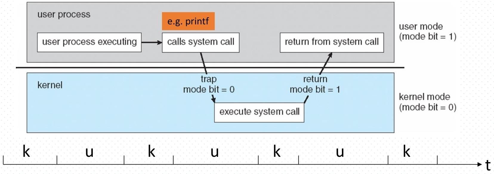
### 四、定时器的作用
定时器用于防止进程出现无限循环或者过度占用资源的情况。操作系统会通过特权指令设置一个计数器，物理时钟会对该计数器进行递减操作。当计数器减到零时，会产生一个中断。操作系统会在调度进程之前设置好定时器，以便在进程超出分配时间时，重新获得控制权或者终止该进程。
## 1.6 Process Management
### 一、进程的核心定义与属性
1. **本质区别**：进程是“执行中的程序”，属于**主动实体**（有动态执行状态）；程序是存储的代码与数据，属于**被动实体**（无自主执行能力），进程是系统内的基本工作单位。
2. **资源需求**：进程完成任务需占用多种资源，包括硬件资源（CPU、内存、I/O设备）、软件资源（文件）及初始化数据（启动时所需的配置或参数数据）。
3. **资源回收**：进程终止时，操作系统需回收其占用的所有可复用资源（如内存、文件句柄），避免资源泄漏。
4. **线程关联**：
   - 单线程进程：仅含一个程序计数器，按顺序逐条执行指令，直至任务完成。
   - 多线程进程：每个线程对应一个独立程序计数器，可实现线程级并发执行，提升进程整体效率。
5. **系统并发**：系统中通常存在多个进程（含用户进程和操作系统进程），通过“CPU复用”（即CPU在不同进程/线程间快速切换），实现多进程在单CPU或多CPU上的并发运行。

### 二、操作系统的进程管理核心活动
操作系统需负责与进程管理相关的五大核心活动，以保障进程有序、高效运行：
1. **进程创建与删除**：根据用户需求（如启动应用）或系统需求（如运行后台服务）创建新进程；当进程完成任务或出现错误时，删除进程并回收资源。
2. **进程挂起与恢复**：根据调度策略或用户操作（如暂停视频播放），将进程暂时挂起（暂停执行，保留状态）；在合适时机（如恢复播放），恢复挂起进程的执行状态。
3. **进程同步机制**：提供工具（如信号量、互斥锁）协调多个并发进程的执行顺序，避免因竞争共享资源（如公共内存区域）导致的执行混乱或数据错误。
4. **进程通信机制**：提供数据交换通道（如管道、消息队列），支持进程间传递信息（如用户输入数据、任务结果），满足多进程协作完成复杂任务的需求。
5. **死锁处理机制**：检测系统中是否出现“死锁”（多个进程互相等待对方资源，无法继续执行），并通过策略（如终止部分进程、释放资源）解除死锁，保障系统正常运行。
## 1.7 Memory Management
### 一、程序执行的内存基础条件
要让程序正常执行，需满足两个核心内存条件：一是程序的全部或部分指令必须加载到内存中，CPU才能读取并执行指令；二是程序运行所需的全部或部分数据（如运算参数、中间结果）也必须存入内存，供CPU调用处理。

### 二、内存管理的核心定位与目标
1. **核心定位**：内存管理的核心是“决定内存中存放什么内容、以及何时存放或移出”，是操作系统资源管理的关键模块。
2. **核心目标**：通过合理调度内存资源，优化CPU的利用率（避免CPU因内存无可用程序/数据而闲置），同时提升计算机对用户的响应速度（确保用户请求的程序能快速加载到内存并执行）。

### 三、内存管理的三大核心活动
1. **跟踪内存使用状态**：实时记录内存的哪些区域正被使用、以及被哪个进程或程序占用，避免内存资源的重复分配或遗漏管理。
2. **决策内存内容进出**：根据程序优先级、内存占用需求等，判断哪些进程（或进程的部分内容）、哪些数据需要加载到内存，以及哪些已占用内存的内容需移出（如暂时不用的进程/数据），为新内容腾出空间。
3. **内存空间分配与回收**：根据程序或进程的需求，分配合适的内存空间；当程序/进程终止或不再需要某块内存时，及时回收该空间，释放内存资源供其他程序使用，避免内存泄漏。
## 1.8 Storage Management: File Systems
### 一、文件系统管理：统一信息存储视图
1. **核心作用**：操作系统为信息存储提供**统一、逻辑的视图**，将硬盘、磁带等存储介质的物理特性（如扇区、磁道）抽象为“文件”这一逻辑存储单位，屏蔽硬件差异，方便用户/程序操作。
2. **存储介质与特性**：每种存储介质（如磁盘驱动器、磁带驱动器）由专属设备控制，不同介质的物理特性存在差异，包括访问速度（如磁盘快于磁带）、容量（如磁带容量大于普通磁盘）、数据传输率、访问方式（顺序访问如磁带、随机访问如磁盘）。
3. **管理内容与OS活动**：
   - 文件组织：文件通常按“目录”分类管理（如文件夹包含子文件夹和文件），便于用户查找与归类。
   - 访问控制：多数系统支持权限设置，明确不同用户/进程对文件的访问权限（如读、写、执行），保障数据安全。
   - OS核心活动：包括创建/删除文件与目录、提供文件/目录操作原语（如打开、读取、重命名）、将文件映射到辅存（如磁盘）的物理地址、将文件备份到非易失性存储介质（如磁带）以防数据丢失。

### 二、海量存储管理：聚焦磁盘与低速存储
1. **磁盘的核心定位**：磁盘是海量存储的主要载体，用于存储“无法装入主存”或“需长期保存”的数据（如用户文档、系统文件）；计算机整体运行速度很大程度依赖磁盘子系统性能及管理算法（如调度算法），因此磁盘管理至关重要。
2. **OS的磁盘管理活动**：
   - 空闲空间管理：跟踪磁盘中未被使用的空间，避免空间碎片化，确保有足够空间分配给新文件。
   - 存储分配：根据文件大小与需求，将磁盘空闲空间合理分配给文件，常用分配方式如连续分配、索引分配。
   - 磁盘调度：通过算法（如FCFS、SSTF）优化磁头移动路径，减少磁头寻道时间，提升磁盘读写效率。
3. **三级存储管理**：三级存储（如光盘、磁带）速度慢但成本低、容量大，无需快速响应，主要用于长期备份；其管理可由操作系统或应用程序负责，按写入特性分为WORM（一次写入、多次读取，如只读光盘）和RW（可读写，如可擦写磁带）两类。

### 三、缓存机制：加速数据访问
| Level | 1 | 2 | 3 | 4 | 5 |
| --- | --- | --- | --- | --- | --- |
| Name | registers | cache | main memory | solid state disk | magnetic disk |
| Typical size | < 1 KB | < 16MB | < 64GB | < 1 TB | < 10 TB |
| Implementation technology | custom memory with multiple ports CMOS | on-chip or off-chip CMOS SRAM | CMOS SRAM | flash memory | magnetic disk |
| Access time (ns) | 0.25 - 0.5 | 0.5 - 25 | 80 - 250 | 25,000 - 50,000 | 5,000,000 |
| Bandwidth (MB/sec) | 20,000 - 100,000 | 5,000 - 10,000 | 1,000 - 5,000 | 500 | 20 - 150 |
| Managed by | compiler | hardware | operating system | operating system | operating system |
| Backed by | cache | main memory | disk | disk | disk or tape |

1. **核心原理**：利用“存储层级”特性（高速存储成本高、容量小，低速存储成本低、容量大），将“正在使用或近期可能使用的数据”从低速存储（如磁盘）复制到高速存储（如缓存、主存），减少CPU等待数据的时间，提升访问速度。
2. **存储层级性能参数**：不同层级存储的速度、容量、管理主体等存在显著差异，具体如下（按速度从快到慢）：
   - 寄存器（层级1）：容量<1KB，访问时间0.25-0.5ns，由编译器管理，数据来源于缓存，是CPU直接访问的最快存储。
   - 缓存（层级2）：容量<16MB，访问时间0.5-25ns，由硬件管理，数据来源于主存，缓解CPU与主存的速度差距。
   - 主存（层级3）：容量<64GB，访问时间80-250ns，由操作系统管理，数据来源于磁盘，是程序运行的主要数据载体。
   - 固态硬盘（层级4）：容量<1TB，访问时间25,000-50,000ns，由操作系统管理，数据来源于磁盘，速度快于传统磁盘。
   - 磁 disk（层级5）：容量<10TB，访问时间5,000,000ns，由操作系统管理，数据可备份到磁带，是海量数据的主要存储。
3. **多环境下的缓存注意事项**：
   - 多任务环境：需确保使用“最新数据”，无论数据存储在哪个层级（如主存中的数据被修改后，缓存中的旧数据需同步更新）。
   - 多处理器环境：通过硬件保障“缓存一致性”，确保所有CPU的缓存中，同一数据的副本始终保持最新，避免数据冲突。
   - 分布式环境：数据可能存在多个副本（如不同节点的缓存中），需通过协议（如缓存同步协议）管理副本，确保数据一致性，管理复杂度更高。

### 四、I/O子系统：屏蔽硬件特性、协调I/O操作
1. **核心目标**：隐藏I/O设备的硬件特性（如不同品牌磁盘的驱动差异），为用户/程序提供统一的I/O操作接口，降低使用难度。
2. **子系统核心职责**：
   - I/O内存管理：通过三种机制优化数据传输：
     - 缓冲（Buffering）：数据传输时临时存储在缓冲区（如主存中的一块区域），避免CPU与I/O设备直接等待（如打印机缓冲数据，CPU可先执行其他任务）。
     - 缓存（Caching）：将常用I/O数据存入高速缓存，提升后续访问速度（如频繁读取的文件缓存到主存）。
     - 假脱机（Spooling）：让一个作业的输出与另一个作业的输入重叠进行（如多个用户打印文件时，先将文件存入磁盘队列，打印机按顺序打印，不占用CPU资源）。
   - 设备驱动接口：提供通用的设备驱动程序接口，使操作系统无需关注具体设备细节，只需通过接口与设备通信。
   - 专用设备驱动：为每种特定I/O设备（如键盘、打印机）开发专属驱动程序，实现设备与操作系统的底层数据交互。
## 1.9 Protection and Security
### 一、保护（Protection）的核心定义
保护是操作系统中用于**控制进程或用户对系统资源访问权限的机制**。这里的“资源”由操作系统定义，涵盖硬件资源（如CPU、内存、I/O设备）和软件资源（如文件、程序数据）；其核心目的是防止未授权的进程或用户非法访问、修改资源，避免资源被破坏或滥用，保障系统资源的有序使用。

### 二、安全（Security）的核心定义与防护范围
1. **核心定义**：安全是操作系统**抵御内外部攻击的防御机制**，相比“保护”更侧重应对主动威胁，确保系统整体功能正常运行，避免数据泄露、服务中断等风险。
2. **防护范围**：覆盖多种攻击类型，常见包括：
   - 拒绝服务（DoS/DDoS）：通过大量无效请求占用系统资源，导致合法用户无法使用服务。
   - 恶意软件（蠕虫、病毒）：蠕虫可自主传播占用资源，病毒会感染文件破坏数据或系统功能。
   - 身份盗窃：盗用合法用户身份（如账号密码），非法访问系统资源或获取敏感信息。
   - 服务盗窃：未授权使用系统服务（如盗用付费软件权限、占用网络带宽）。

### 三、系统区分用户与控制权限的核心方式
操作系统通常通过“识别用户身份”来分配资源访问权限，具体实现方式包括：
1. **用户标识（User ID/Security ID）**：为每个用户分配唯一标识，包含用户名和关联编号；该标识会与用户创建的所有文件、运行的所有进程绑定，作为判断“该用户能否访问某资源”的基础依据（如仅文件所属用户可修改文件）。
2. **组标识（Group ID）**：将具有相同权限需求的用户划分为一个组，分配唯一组标识；组标识同样与进程、文件关联，可批量管理一组用户的权限（如“开发组”成员均可访问项目代码文件），简化权限配置流程。
3. **权限提升（Privilege Escalation）**：允许用户在特定场景下，将自身有效标识（Effective ID）切换为权限更高的标识（如普通用户通过“sudo”命令临时获取管理员权限），以完成需要高权限的操作（如安装系统软件），同时避免用户长期持有高权限带来的安全风险。
## 1.10 Kernel Data Structures
### 一、内核数据结构的整体特点
内核数据结构与标准编程中的数据结构存在诸多相似性，是操作系统内核管理资源、实现核心功能的基础工具，主要用于组织和操作系统中的进程、内存、文件等关键信息，确保内核高效运行。

### 二、常用内核数据结构及用途
1. **链表（Linked List）**
   - 包含类型：单链表（数据节点依次连接，尾节点指向null）、双链表（每个节点双向连接，可双向遍历）、循环链表（首尾节点相连，形成环形结构）。
   - 核心用途：主要用于实现**调度队列**，例如存储等待CPU调度的进程、等待I/O处理的任务等，方便节点的动态添加与删除。
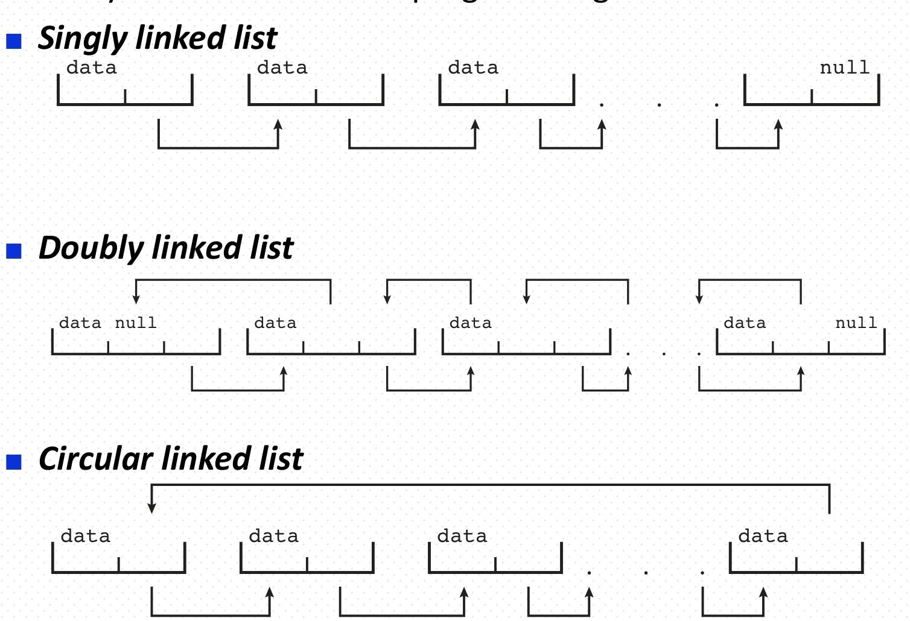
2. **二叉搜索树（Binary Search Tree）**
   - 结构规则：遵循“左子树节点值≤根节点值≤右子树节点值”的规则，便于数据查找。
   - 性能特点：普通二叉搜索树在最坏情况下搜索性能为**O(n)**（如退化为链表）；平衡二叉搜索树（如AVL树）通过维持树的平衡，将搜索性能优化至**O(lg n)**，提升数据查询效率。

3. **红黑树（Red-Black Tree）**
   - 内核定位：是Linux内核中常用的平衡二叉搜索树，相关实现代码存于Linux 3.0内核的`rbtree.h`和`rbtree.c`文件中。
   - 核心用途：
     - CPU调度：组织处于“运行中”的任务（调度对象），便于快速查找和调整优先级。
     - 定时器管理：组织高精度定时器的定时请求，确保定时任务按序触发。
     - 文件系统：在EXT3文件系统中管理目录结构，快速定位目录下的文件。
     - 虚拟存储：管理虚拟内存空间块（VMAs），高效维护内存区域的分配与释放。

4. **哈希表（Hash Map）与位图（Bitmap）**
   - 哈希表：通过哈希函数将键（Key）映射到对应的存储位置，实现数据的快速查找与访问，常用于需要高频查询的场景（如进程ID与进程控制块的映射）。
   - 位图：由n个二进制数字组成的字符串，每个二进制位对应一个项目的状态（如0表示未占用、1表示已占用），适用于快速标记和查询大量项目的状态（如内存块、磁盘扇区的占用情况）。

### 三、Linux内核数据结构的定义文件
Linux内核中常用的数据结构定义于特定的头文件中，便于内核代码调用和维护，主要包括：
- `<linux/list.h>`：包含链表相关数据结构（如单链表、双链表）的定义与操作函数。
- `<linux/kfifo.h>`：定义了内核中的先进先出（FIFO）队列结构，用于数据的缓冲传输。
- `<linux/rbtree.h>`：包含红黑树的数据结构定义及相关操作接口，支撑红黑树在各内核模块中的应用。
## 1.11 Computing Environments
### 一、计算环境的九类核心类型及特点
该节内容围绕“计算环境”展开，共介绍9种主流类型，每种类型有明确的应用场景与技术特性：
1. **传统计算环境（Traditional）**  
   - 核心是独立通用设备（如台式机、笔记本），但当前多数设备已通过互联网互联，模糊了“独立”属性。  
   - 包含网络计算机（瘦客户端，类似Web终端）和移动计算机（通过无线网络连接），且家用系统普遍用防火墙抵御网络攻击，同时通过门户网站访问内部系统。

2. **移动计算环境（Mobile）**  
   - 基于手持设备（智能手机、平板），与传统笔记本的核心差异是额外集成GPS、陀螺仪等硬件，支持增强现实（AR）等新型应用。  
   - 依赖IEEE 802.11无线网络或蜂窝数据网络联网，主流操作系统为苹果iOS和谷歌Android。

3. **分布式计算环境（Distributed）**  
   - 由多个独立、可能异构的系统通过网络连接组成，网络是核心通信路径（常用TCP/IP协议），涵盖局域网（LAN）、广域网（WAN）、城域网（MAN）、个人局域网（PAN）。  
   - 网络操作系统（NOS）提供跨网络的系统间功能，包括消息交换机制，能给用户营造“单一系统”的使用错觉。

4. **客户机-服务器计算环境（Client-Server）**  
   - 替代传统“ dumb终端”，由“客户端（智能PC、手机等）”发起请求，“服务器”响应并提供服务，是当前主流架构之一。  
   - 分两类：计算服务器（提供数据库等服务接口）、文件服务器（提供文件存储与检索接口），客户端通过网络与服务器交互。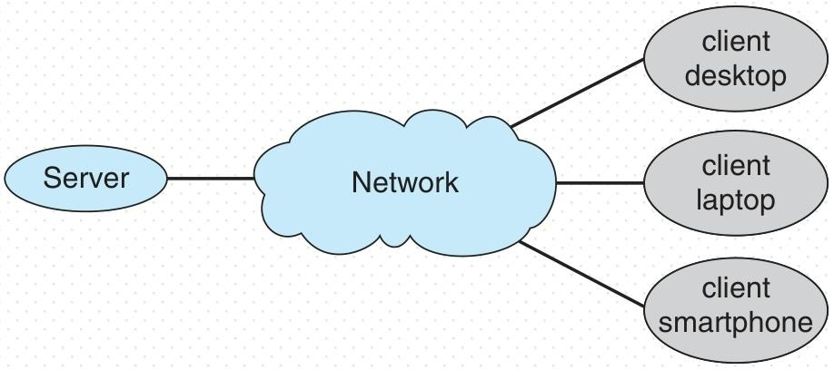

5. **对等计算环境（Peer-to-Peer，P2P）**  
   - 无明确“客户端/服务器”区分，所有节点均为“对等节点”，可同时作为客户端（请求服务）和服务器（提供服务）。  
   - 节点需先加入P2P网络，通过“中央查找服务注册”或“广播请求+发现协议响应”获取/提供服务，典型案例有Napster、Gnutella、Skype（VoIP应用）。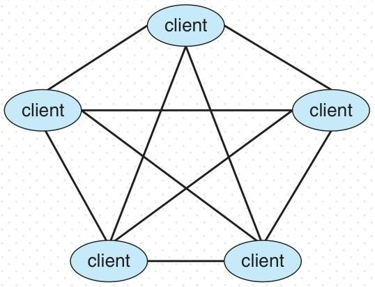

6. **虚拟化计算环境（Virtualization）**  
   - 核心是让操作系统在其他OS中运行应用，基于虚拟机（VM）或容器技术，依赖虚拟机管理器（VMM）提供虚拟化服务。  
   - 分“仿真”（源CPU与目标CPU不同，如PowerPC转Intel x86，速度慢，需解释执行）和“原生虚拟化”（OS与 guest OS均适配原生CPU，如VMware在WinXP主机上运行WinXP guest）。  
   - 典型用途：一台设备运行多OS（如苹果笔记本同时跑macOS和Windows）、跨OS开发测试、数据中心管理计算环境。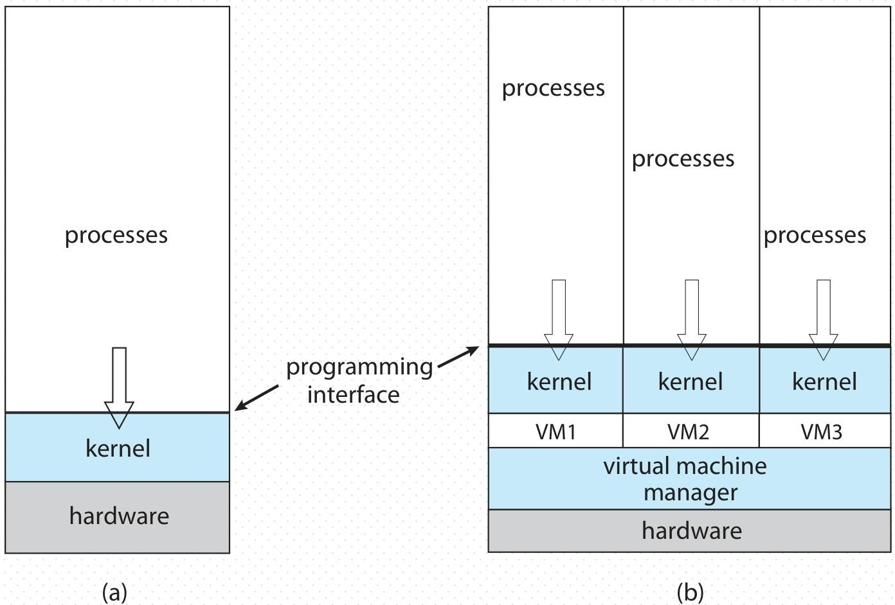

7. **云计算环境（Cloud Computing）**  
   - 是虚拟化的逻辑延伸，通过网络将计算、存储、应用作为“服务”交付，按使用付费（如亚马逊EC2），核心组件包括传统OS、VMM、云管理工具。  
   - 分类：按部署方式分“公有云（互联网开放，付费使用）、私有云（企业自用）、混合云（公私结合）”；按服务类型分“软件即服务（SaaS，如在线文档）、平台即服务（PaaS，如数据库服务器）、基础设施即服务（IaaS，如云端存储）”。  
   - 依赖互联网连接，需防火墙保障安全，通过负载均衡器分散流量。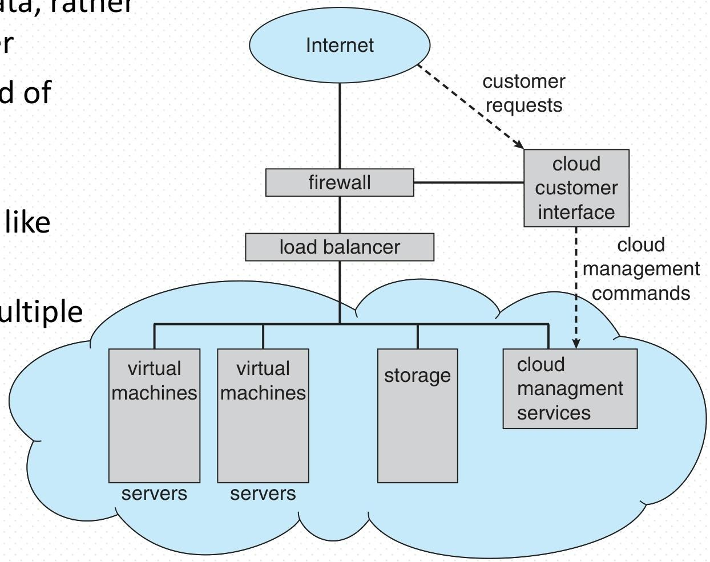

8. **雾计算/边缘计算环境（Fog/Edge Computing）**  
   - 又称“边缘计算”，针对“海量边缘设备（传感器等）连接云端”场景，核心是“就近处理数据”——在数据生成设备旁的计算单元处理原始数据，仅将处理后的数据传至云端。  
   - 两大优势：减少带宽占用（避免传海量原始数据）、降低延迟（本地处理无需远程传输），类似传统“专用硬件（如FFT信号处理芯片）”的优化逻辑，但适配云场景。

9. **实时嵌入式计算环境（Real-Time Embedded Systems）**  
   - 由“实时系统”与“嵌入式系统”结合而成：实时系统需在“有限时间内响应外部事件”（有明确截止期），嵌入式系统是“嵌入设备的小型计算机”，用于专用场景。  
   - 实时系统分两类：硬实时（关键任务必须按时完成，如化工生产线故障报警，常无二级存储，数据存短期内存/ROM）、软实时（关键任务优先处理，但无严格截止期，如电信交换呼叫处理，适用于多媒体、虚拟现实）。  
   - 依赖实时OS（RTOS），需支持“实时任务调度”“内存管理”等特性，是当前最普及的计算机形式之一（如设备控制芯片）。

### 二、计算机系统结构的演化脉络
除上述计算环境外，内容还提及“计算机系统结构的演化”，从简单到复杂分为以下阶段：
1. **单处理器系统**：仅1个CPU，如早期笔记本、微机，结构简单，适用于基础计算。
2. **多核系统**：单芯片集成多个CPU核心，如Intel i7 8700，平衡性能与空间效率。
3. **多处理器系统**：多个CPU通过总线连接，共享内存（紧耦合系统），如服务器（数万元级），提升吞吐量。
4. **分布式系统**：含集群系统（通过LAN连接，如北邮曙光天潮4000L）和超级计算系统（通过专用网络连接，如神威、天河，用于高性能计算HPC），节点（CPU+内存+I/O）通过网络协同工作。
5. **基于Web的系统**：通过WAN/WWW连接，涵盖网格计算、云计算等，是当前分布式系统的主流形态。
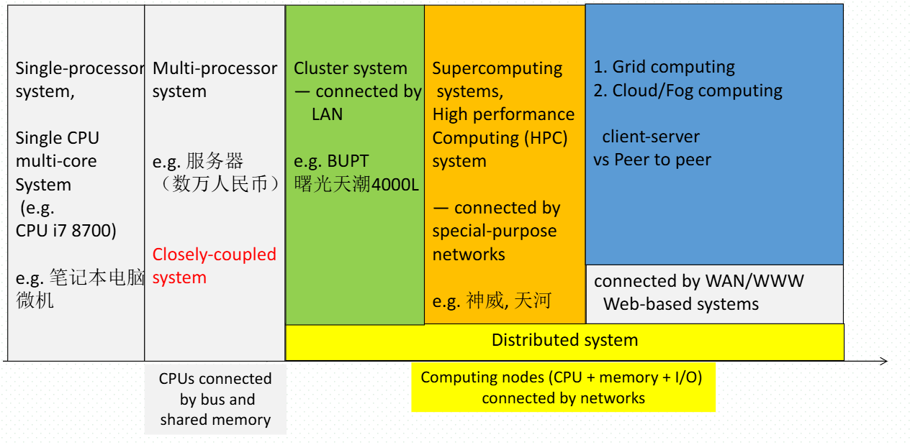
## 1.12 Open-Source Operating Systems
我将围绕选中内容中开源操作系统的核心定义、关键特征、发起主体、典型示例及相关工具应用展开总结，以三级标题呈现，确保逻辑清晰且解释到位。

### 一、开源操作系统的核心定义
开源操作系统指**以源代码形式开放提供**的操作系统，区别于仅提供二进制文件的闭源操作系统。用户可直接获取其源代码，而非只能使用编译后的可执行程序，这是开源操作系统最核心的属性。

### 二、开源操作系统的关键特征
开源操作系统与“版权保护”和“数字版权管理（DRM）”运动的理念相反。版权保护和DRM通常通过技术手段限制用户对软件的复制、修改和传播，而开源操作系统鼓励用户自由获取、修改源代码，甚至重新分发修改后的版本，强调软件的开放性和共享性。

### 三、开源操作系统的发起主体与核心协议
1. **发起主体**：开源操作系统的推广始于自由软件基金会（FSF），该基金会是推动自由软件运动的重要组织，为开源软件的发展提供了理念和组织支持。
2. **核心协议**：自由软件基金会制定了“Copyleft”（著佐权）理念下的GNU通用公共许可证（GPL），这是开源操作系统常用的核心协议。遵循该协议的软件，其源代码必须公开，且基于该软件修改后的衍生作品也需采用相同协议开放源代码，保障了开源的延续性。

### 四、开源操作系统的典型示例
常见的开源操作系统包括GNU/Linux、BSD UNIX等。其中，BSD UNIX的核心代码还被应用于苹果Mac OS X操作系统，成为其底层核心的重要组成部分，体现了开源技术在商业操作系统中的融合与应用。

### 五、开源操作系统的相关工具与应用场景
1. **相关工具**：可配合虚拟机监控程序（VMM）使用，如VMware Player（在Windows系统上免费提供）、VirtualBox（开源且在多个平台上免费，官网为http://www.virtualbox.com）。
2. **应用场景**：通过这些虚拟机工具，用户可在现有操作系统中运行开源操作系统作为“客户机操作系统”，用于探索开源系统的功能、测试软件兼容性，或进行相关的开发与学习。