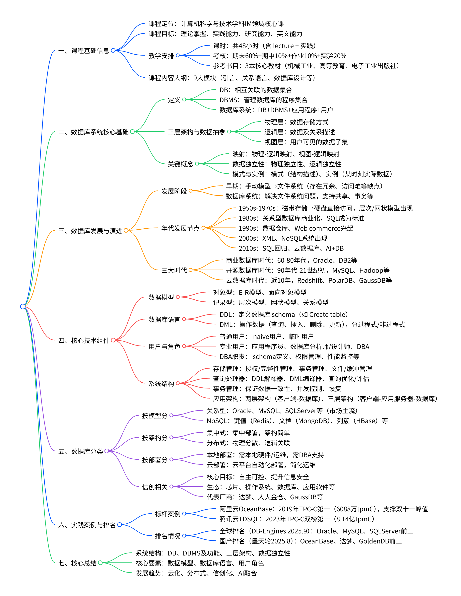

# Chapter1: Introduction
## 思维导图

## 数据库系统历史（History of Database Systems）
- **数据管理的发展**：
  - 手动模式（Manual Model）：应用程序直接访问独立的数据集，如Data Set1、Data Set2等。
  - 文件系统（File System）：引入文件系统管理数据，但应用程序仍需访问多个独立的数据集。
- **文件系统的缺点**：
  - 数据冗余和不一致（Data redundancy and inconsistency）：多文件格式、信息重复。
  - 数据访问困难（Difficulty in accessing data）：需要为每个新任务编写新程序。
  - 数据隔离（Data isolation）：多文件和格式导致数据隔离。
  - 完整性问题（Integrity problems）：完整性约束嵌入程序代码，难以添加或更改新约束（如账户余额>0）。
  - 更新原子性（Atomicity of updates）：更新操作缺乏原子性。
  - 多用户并发访问（Concurrent access by multiple users）：并发访问可能导致异常。
  - 安全问题（Security problems）：缺乏有效安全控制。
- **数据库系统（Database System）**：
  - 使用DBMS（DataBase Management System）管理共享数据库，应用程序通过DBMS访问数据，实现集中管理。
- **数据库方法的优势**：
  - 数据共享（Data can be shared）：允许多个应用程序共享数据。
  - 减少冗余（Redundancy can be reduced）：减少数据重复存储。
  - 避免不一致（Inconsistency can be avoided）：在一定程度上避免数据不一致。
  - 提供事务支持（Transaction support can be provided）：支持事务处理。
  - 维护完整性（Integrity can be maintained）：确保数据完整性。
  - 强制安全（Security can be enforced）：实施安全机制。
- **数据库系统 vs 文件系统**：
  - 早期（1950s-early 1960s）：使用磁带存储数据，穿孔卡输入，数据处理依赖磁带。
  - 晚期（Late 1960s-1970s）：硬盘允许直接访问数据，网络和层次数据模型广泛使用，Ted Codd定义关系数据模型（获ACM Turing Award），IBM System R原型、UC Berkeley Ingres原型，高性能事务处理。
  - 1980s：研究关系原型演变为商业系统，SQL成为行业标准，并行和分布式数据库系统，面向对象数据库系统。
  - 1990s：大型决策支持和数据挖掘应用，多TB级数据仓库，网络商务兴起。
  - 2000s：XML和XQuery标准，大数据存储系统（如Google BigTable、Yahoo PNuts、Amazon），NoSQL系统，大数据分析（MapReduce等）。
  - 2010s：SQL重载（SQL前端用于MapReduce系统），海量并行数据库系统，多核主内存数据库。
- **关键里程碑**：
  - 1968：IBM IMS（Information Management System），层次数据模型。
  - 1970s：Cullinet Software’s IDMS，CODASYL报告（1971），网络数据模型。
  - 1970：E.F. Codd定义关系模型。
  - 1990s：对象-关系数据库、WEB数据库、并行数据库。
  - 2000s：NoSQL。
  - 2010s：云数据库、AI+DB。
- **数据库的三个时代**：
  - 商业数据库时代（60s-80s）：60年代网状和层次数据库；70年代关系型数据库成为主流；80年代交易型数据库成熟（如Oracle、DB2、SQLServer），以大型机、小型机和商业存储为基础设施。
  - 开源数据库时代（90s-早21世纪）：移动互联网爆发，NoSQL兴起，以MySQL、PostgreSQL、Hadoop、Redis等为代表，倡导开源自由。
  - 云数据库时代（近10年）：云技术发展，数据库自动化部署运维（如亚马逊Redshift和Aurora、阿里云PolarDB、华为云GaussDB、腾讯云TDSQL），加速业务上线，中国数据库登上历史舞台。

## 什么是数据库系统（What is Database Systems）
- **DBMS**：数据库管理系统（DataBase Management System），提供数据存储、管理和访问的软件。
- **DB**：数据库（Database），一组相互关联的数据集合（a collection of interrelated data），包含特定企业的信息。
- **Applications**：访问数据的程序集（Set of programs to access the data）。
- **整体定义**：DBMS 包含特定企业的信息，包括相互关联的数据集合、访问数据的程序集，以及提供便利且高效的使用环境（An environment that is both convenient and efficient to use）。
  - Collection of interrelated data
  - Set of program to access the data
  - An environment that is both convenient and efficient to use
- **数据库应用示例**（Database Applications）：
  - 银行（Banking）：所有交易（all transactions）。
  - 航空（Airlines）：预订、调度（reservations, schedules）。
  - 大学（Universities）：注册、成绩（registration, grades）。
  - 销售（Sales）：客户、产品、采购（customers, products, purchases）。
  - 制造（Manufacturing）：生产、库存、订单、供应链（production, inventory, orders, supply chain）。
  - 人力资源（Human resources）：员工记录、薪资、税扣（employee records, salaries, tax deductions）。
  - 数据库触及我们生活的各方面（Databases touch all aspects of our lives）。

## 三级结构与数据抽象（Three Levels and Data Abstraction）
- **三级架构（Three-level Architecture）**：
  - 物理级（Physical level）：描述记录如何物理存储（如客户记录的存储方式）。
  - 逻辑级（Logical level）：描述数据库中存储的数据及其关系（如客户记录的类型定义，包括customer_id、customer_name等字段）。
  - 视图级（View level）：整个数据库的一部分，隐藏数据类型细节，并可隐藏信息（如员工薪资）以确保安全；包括社区用户视图、部分数据库和个人用户视图。
- **数据抽象（Data Abstraction）**：
  - 视图抽象（View abstraction）：隐藏整个数据库的部分细节。
  - 逻辑抽象（Logical abstraction）：描述逻辑数据及其关系。
  - 物理抽象（Physical abstraction）：描述物理存储方式。
- **映象（Mappings）**：
  - 物理（内部）/逻辑（概念）映象（Physical(internal)/Logical(conceptual) mapping）：定义逻辑视图与存储数据库的对应关系，指定逻辑记录和字段在物理级的表示。
  - 视图（外部）/逻辑（概念）映象（View(external)/Logical(conceptual) mapping）：定义特定视图与逻辑视图的对应关系。
- **数据独立性（Data Independence）**：
  - 物理数据独立性（Physical Data Independence）：修改物理模式而不改变逻辑模式或视图的能力（通过物理/逻辑映象）。
  - 逻辑数据独立性（Logical Data Independence）：修改逻辑模式而不改变视图的能力（通过视图/逻辑映象）。
  - 应用：如果物理模式变化，应用程序无需重写；逻辑模式变化时，视图保持不变。
- **数据库系统的体系结构**：
  - 包括外模式（External Schema，如外模式A、B）、概念模式（Conceptual Schema）、内模式（Internal Schema）。
  - 映象：外模式/模式映象、模式/内模式映象。
  - 由数据库管理员（DBA）建立和维护，涉及主语言+DML的用户交互、操作系统（OS）和DBMS。
- **实例与模式（Instances and Schemas）**：
  - 模式（Schema）：数据库数据结构的描述（如客户和账户的信息及其关系），类似于程序中变量的类型信息；包括物理模式（物理级设计）和逻辑模式（逻辑级设计）。
  - 实例（Instance）：数据库在特定时间点的实际内容，类似于程序中变量的值。

## 数据模型（Data Models）
- **定义**：
  - 一组用于描述数据、数据关系、数据语义和一致性约束的概念工具（A collection of conceptual tools for describing data, data relationships, data semantics, and consistency constrains）。
- **组成部分**：
  - 数据结构（Data Structure）。
  - 数据操作（Data Operations）。
  - 约束规则（Constraint Rules）。
- **类型**：
  - 基于对象的模型（Object_based data model）：
    - 实体-关系模型（Entity-Relational Model (E_R Model)）。
    - 面向对象模型（Object-oriented Model）。
  - 基于记录的模型（Record_based data model）：
    - 层次数据模型（hierarchical data model）。
    - 网络数据模型（network data model）。
    - 关系数据模型（relational data model）。
- **关系数据模型示例（Relational Data Model）**：
  - 以表格形式表示，包括字段如customer-name、Customer-id、customer-street、customer-city、account-number。
  - 示例数据：客户如Johnson、Smith等，地址和账户号等信息，展示关系表的结构。

## 数据库语言（Database Languages）
- **数据定义语言（DDL）**：
  - 用于定义数据库模式的规范表示法（Specification notation for defining the database schema）。
  - 示例：Create table account (account-number char(10), balance integer)。
  - 包括：数据库模式（Database schema），数据存储和定义语言（Data storage and definition language）。
- **数据操纵语言（DML）**：
  - 用于访问和操纵由适当数据模型组织的数据的语言（Language for accessing and manipulating the data organized by the appropriate data model）。
  - 操作：查询（query）、插入（insert）、删除（delete）、更新（update）。
  - 也称为查询语言（DML also known as query language）。
  - 两种类型：
    - 过程式（Procedural）：用户指定所需数据以及如何获取这些数据（user specifies what data is required and how to get those data）。
    - 非过程式（Nonprocedural）：用户指定所需数据而不指定如何获取（user specifies what data is required without specifying how to get those data）。
  - SQL 是最广泛使用的查询语言（SQL is the most widely used query language）。

## 数据库用户（Database Users）
- **用户分类**：
  - 根据他们期望与系统交互的方式区分（Users are differentiated by the way they expect to interact with the system）。
- **具体类型**：
  - 应用程式员（Application programmers）：通过DML调用与系统交互（interact with system through DML calls）。
  - 高级用户（Sophisticated users）：使用数据库查询语言形成请求（form requests in a database query language）。
  - 专业用户（Specialized users）：编写不适合传统数据处理框架的专用数据库应用（write specialized database applications that do not fit into the traditional data processing framework）。
  - 初级用户（Naive users）：调用先前编写好的永久应用程式（invoke one of the permanent application programs that have been written previously），例如网络访问数据库的人、银行出纳员、文职人员（E.g. people accessing database over the web, bank tellers, clerical staff）。
- **终端用户（End Users）**：
  - 初级用户（naive Users）。
  - 临时用户（casual users）：交互式SQL（-----Interactive SQL）。
- **应用程式员（Application Programmers）**：过程式SQL、事务（-----Procedural SQL,Transaction）。
- **数据库分析员和设计师（Database analyzer and designer）**：数据建模、规范化理论（-----Data modeling, Normalization theory）。
- **数据库管理员（Database Administrators, DBA）**：数据库维护、安全、完整性、恢复（-----Database maintenance, Security, Integrity,Recovery）。
- **数据库管理系统设计师和实现者（Database Management System designer and implementer）**：上述技术的实现技术，用于特殊和新数据库管理系统（-----Implementation technique of above techniques for Special and New Database Management System）。
- **数据库管理员职责（Database Administrator）**：
  - 协调数据库系统的所有活动；对企业的信息资源和需求有良好理解（Coordinates all the activities of the database system; the database administrator has a good understanding of the enterprise’s information resources and needs）。
  - 职责包括：
    - 模式定义（Schema definition）。
    - 存储结构和访问方法定义（Storage structure and access method definition）。
    - 模式和物理组织修改（Schema and physical organization modification）。
    - 授予用户访问数据库的权限（Granting user authority to access the database）。
    - 指定完整性约束（Specifying integrity constraints）。
    - 作为与用户的联络人（Acting as liaison with users）。
    - 监控性能并响应需求变化（Monitoring performance and responding to changes in requirements）。

## 数据库系统结构（Database System Structure）
- **存储管理（Storage Management）**：
  - 存储管理器是一个程序模块，提供低级数据与应用程式和查询之间的接口（Storage manager is a program module that provides the interface between the low-level data stored in the database and the application programs and queries submitted to the system）。
  - 负责数据的有效存储、检索和更新（is responsible for efficient storing, retrieving and updating of data）。
  - 组件包括：
    - 授权和完整性管理器（Authorization and integrity manager）。
    - 事务管理器（Transaction manager）。
    - 文件管理器（File manager）。
    - 缓冲管理器（Buffer manager）。
  - 数据结构（Data Structure）：数据文件（Data files）；数据字典（Data dictionary）；索引（Indices）。
- **查询处理器（Query Processor）**：
  - DDL解释器（DDL interpreter）。
  - DML编译器（DML compiler）。
  - 查询优化（Query optimization）。
  - 查询评估引擎（Query evaluation engine）。
- **事务管理（Transaction Management）**：
  - 事务是一个执行单一逻辑功能的操作集合（A transaction is a collection of operations that performs a single logical function in a database application）。
  - 事务管理组件确保数据库保持一致（正确）状态（Transaction-management component ensures that the database remains in a consistent (correct) state）。
  - 并发控制管理器控制并发事务之间的交互，以确保数据库一致性（Concurrency-control manager controls the interaction among the concurrent transactions, to ensure the consistency of the database）。
- **DBMS的功能（Functions of DBMS）**：
  - 数据定义和存储管理（Data Definition and storage management）。
  - 数据操纵、数据访问（Data Manipulation, Data Access）。
  - 数据安全和完整性（Data Security and integrity）。
  - 事务管理、数据恢复和并发（Transaction management, Data recovery and concurrency）。
  - 数据字典（Data dictionary）。
- **应用架构（Application Architectures）**：
  - 二层架构（Two-tier architecture）：例如，客户端程式使用ODBC/JDBC与数据库通信（E.g. client programs using ODBC/JDBC to communicate with a database）。
  - 三层架构（Three-tier architecture）：例如，基于Web的应用，以及使用“中间件”构建的应用（E.g. web-based applications, and applications built using “middleware”）。

## 总结
### 数据库系统历史（History of Database Systems）
- **数据管理的发展**：
  - 手动模式（Manual Model）：应用程序直接访问独立的数据集，如Data Set1、Data Set2等。
  - 文件系统（File System）：引入文件系统管理数据，但应用程序仍需访问多个独立的数据集。
- **文件系统的缺点**：
  - 数据冗余和不一致（Data redundancy and inconsistency）：多文件格式、信息重复。
  - 数据访问困难（Difficulty in accessing data）：需要为每个新任务编写新程序。
  - 数据隔离（Data isolation）：多文件和格式导致数据隔离。
  - 完整性问题（Integrity problems）：完整性约束嵌入程序代码，难以添加或更改新约束（如账户余额>0）。
  - 更新原子性（Atomicity of updates）：更新操作缺乏原子性。
  - 多用户并发访问（Concurrent access by multiple users）：并发访问可能导致异常。
  - 安全问题（Security problems）：缺乏有效安全控制。
- **数据库系统（Database System）**：
  - 使用DBMS（DataBase Management System）管理共享数据库，应用程序通过DBMS访问数据，实现集中管理。
- **数据库方法的优势**：
  - 数据共享（Data can be shared）：允许多个应用程序共享数据。
  - 减少冗余（Redundancy can be reduced）：减少数据重复存储。
  - 避免不一致（Inconsistency can be avoided）：在一定程度上避免数据不一致。
  - 提供事务支持（Transaction support can be provided）：支持事务处理。
  - 维护完整性（Integrity can be maintained）：确保数据完整性。
  - 强制安全（Security can be enforced）：实施安全机制。
- **数据库系统 vs 文件系统**：
  - 早期（1950s-early 1960s）：使用磁带存储数据，穿孔卡输入，数据处理依赖磁带。
  - 晚期（Late 1960s-1970s）：硬盘允许直接访问数据，网络和层次数据模型广泛使用，Ted Codd定义关系数据模型（获ACM Turing Award），IBM System R原型、UC Berkeley Ingres原型，高性能事务处理。
  - 1980s：研究关系原型演变为商业系统，SQL成为行业标准，并行和分布式数据库系统，面向对象数据库系统。
  - 1990s：大型决策支持和数据挖掘应用，多TB级数据仓库，网络商务兴起。
  - 2000s：XML和XQuery标准，大数据存储系统（如Google BigTable、Yahoo PNuts、Amazon），NoSQL系统，大数据分析（MapReduce等）。
  - 2010s：SQL重载（SQL前端用于MapReduce系统），海量并行数据库系统，多核主内存数据库。
- **关键里程碑**：
  - 1968：IBM IMS（Information Management System），层次数据模型。
  - 1970s：Cullinet Software’s IDMS，CODASYL报告（1971），网络数据模型。
  - 1970：E.F. Codd定义关系模型。
  - 1990s：对象-关系数据库、WEB数据库、并行数据库。
  - 2000s：NoSQL。
  - 2010s：云数据库、AI+DB。
- **数据库的三个时代**：
  - 商业数据库时代（60s-80s）：60年代网状和层次数据库；70年代关系型数据库成为主流；80年代交易型数据库成熟（如Oracle、DB2、SQLServer），以大型机、小型机和商业存储为基础设施。
  - 开源数据库时代（90s-早21世纪）：移动互联网爆发，NoSQL兴起，以MySQL、PostgreSQL、Hadoop、Redis等为代表，倡导开源自由。
  - 云数据库时代（近10年）：云技术发展，数据库自动化部署运维（如亚马逊Redshift和Aurora、阿里云PolarDB、华为云GaussDB、腾讯云TDSQL），加速业务上线，中国数据库登上历史舞台。

### 什么是数据库系统（What is Database Systems）
- **DBMS**：数据库管理系统（DataBase Management System），提供数据存储、管理和访问的软件。
- **DB**：数据库（Database），一组相互关联的数据集合（a collection of interrelated data），包含特定企业的信息。
- **Applications**：访问数据的程序集（Set of programs to access the data）。
- **整体定义**：DBMS 包含特定企业的信息，包括相互关联的数据集合、访问数据的程序集，以及提供便利且高效的使用环境（An environment that is both convenient and efficient to use）。
- **数据库应用示例（Database Applications）**：
  - 银行（Banking）：所有交易（all transactions）。
  - 航空（Airlines）：预订、调度（reservations, schedules）。
  - 大学（Universities）：注册、成绩（registration, grades）。
  - 销售（Sales）：客户、产品、采购（customers, products, purchases）。
  - 制造（Manufacturing）：生产、库存、订单、供应链（production, inventory, orders, supply chain）。
  - 人力资源（Human resources）：员工记录、薪资、税扣（employee records, salaries, tax deductions）。
  - 数据库触及我们生活的各方面（Databases touch all aspects of our lives）。

### 三级结构与数据抽象（Three Levels and Data Abstraction）
- **三级架构（Three-level Architecture）**：
  - 物理级（Physical level）：描述记录如何物理存储（如客户记录的存储方式）。
  - 逻辑级（Logical level）：描述数据库中存储的数据及其关系（如客户记录的类型定义，包括customer_id、customer_name等字段）。
  - 视图级（View level）：整个数据库的一部分，隐藏数据类型细节，并可隐藏信息（如员工薪资）以确保安全；包括社区用户视图、部分数据库和个人用户视图。
- **数据抽象（Data Abstraction）**：
  - 视图抽象（View abstraction）：隐藏整个数据库的部分细节。
  - 逻辑抽象（Logical abstraction）：描述逻辑数据及其关系。
  - 物理抽象（Physical abstraction）：描述物理存储方式。
- **映象（Mappings）**：
  - 物理（内部）/逻辑（概念）映象（Physical(internal)/Logical(conceptual) mapping）：定义逻辑视图与存储数据库的对应关系，指定逻辑记录和字段在物理级的表示。
  - 视图（外部）/逻辑（概念）映象（View(external)/Logical(conceptual) mapping）：定义特定视图与逻辑视图的对应关系。
- **数据独立性（Data Independence）**：
  - 物理数据独立性（Physical Data Independence）：修改物理模式而不改变逻辑模式或视图的能力（通过物理/逻辑映象）。
  - 逻辑数据独立性（Logical Data Independence）：修改逻辑模式而不改变视图的能力（通过视图/逻辑映象）。
  - 应用：如果物理模式变化，应用程序无需重写；逻辑模式变化时，视图保持不变。
- **数据库系统的体系结构**：
  - 包括外模式（External Schema，如外模式A、B）、概念模式（Conceptual Schema）、内模式（Internal Schema）。
  - 映象：外模式/模式映象、模式/内模式映象。
  - 由数据库管理员（DBA）建立和维护，涉及主语言+DML的用户交互、操作系统（OS）和DBMS。
- **实例与模式（Instances and Schemas）**：
  - 模式（Schema）：数据库数据结构的描述（如客户和账户的信息及其关系），类似于程序中变量的类型信息；包括物理模式（物理级设计）和逻辑模式（逻辑级设计）。
  - 实例（Instance）：数据库在特定时间点的实际内容，类似于程序中变量的值。

### 数据模型（Data Models）
- **定义**：
  - 一组用于描述数据、数据关系、数据语义和一致性约束的概念工具（A collection of conceptual tools for describing data, data relationships, data semantics, and consistency constrains）。
- **组成部分**：
  - 数据结构（Data Structure）。
  - 数据操作（Data Operations）。
  - 约束规则（Constraint Rules）。
- **类型**：
  - 基于对象的模型（Object_based data model）：
    - 实体-关系模型（Entity-Relational Model (E_R Model)）。
    - 面向对象模型（Object-oriented Model）。
  - 基于记录的模型（Record_based data model）：
    - 层次数据模型（hierarchical data model）。
    - 网络数据模型（network data model）。
    - 关系数据模型（relational data model）。
- **关系数据模型示例（Relational Data Model）**：
  - 以表格形式表示，包括字段如customer-name、Customer-id、customer-street、customer-city、account-number。
  - 示例数据：客户如Johnson、Smith等，地址和账户号等信息，展示关系表的结构。

### 数据库语言（Database Languages）
- **数据定义语言（DDL）**：
  - 用于定义数据库模式的规范表示法（Specification notation for defining the database schema）。
  - 示例：Create table account (account-number char(10), balance integer)。
  - 包括：数据库模式（Database schema），数据存储和定义语言（Data storage and definition language）。
- **数据操纵语言（DML）**：
  - 用于访问和操纵由适当数据模型组织的数据的语言（Language for accessing and manipulating the data organized by the appropriate data model）。
  - 操作：查询（query）、插入（insert）、删除（delete）、更新（update）。
  - 也称为查询语言（DML also known as query language）。
  - 两种类型：
    - 过程式（Procedural）：用户指定所需数据以及如何获取这些数据（user specifies what data is required and how to get those data）。
    - 非过程式（Nonprocedural）：用户指定所需数据而不指定如何获取（user specifies what data is required without specifying how to get those data）。
  - SQL 是最广泛使用的查询语言（SQL is the most widely used query language）。

### 数据库用户（Database Users）
- **用户分类**：
  - 根据他们期望与系统交互的方式区分（Users are differentiated by the way they expect to interact with the system）。
- **具体类型**：
  - 应用程式员（Application programmers）：通过DML调用与系统交互（interact with system through DML calls）。
  - 高级用户（Sophisticated users）：使用数据库查询语言形成请求（form requests in a database query language）。
  - 专业用户（Specialized users）：编写不适合传统数据处理框架的专用数据库应用（write specialized database applications that do not fit into the traditional data processing framework）。
  - 初级用户（Naive users）：调用先前编写好的永久应用程式（invoke one of the permanent application programs that have been written previously），例如网络访问数据库的人、银行出纳员、文职人员（E.g. people accessing database over the web, bank tellers, clerical staff）。
- **终端用户（End Users）**：
  - 初级用户（naive Users）。
  - 临时用户（casual users）：交互式SQL（-----Interactive SQL）。
- **应用程式员（Application Programmers）**：过程式SQL、事务（-----Procedural SQL,Transaction）。
- **数据库分析员和设计师（Database analyzer and designer）**：数据建模、规范化理论（-----Data modeling, Normalization theory）。
- **数据库管理员（Database Administrators, DBA）**：数据库维护、安全、完整性、恢复（-----Database maintenance, Security, Integrity,Recovery）。
- **数据库管理系统设计师和实现者（Database Management System designer and implementer）**：上述技术的实现技术，用于特殊和新数据库管理系统（-----Implementation technique of above techniques for Special and New Database Management System）。
- **数据库管理员职责（Database Administrator）**：
  - 协调数据库系统的所有活动；对企业的信息资源和需求有良好理解（Coordinates all the activities of the database system; the database administrator has a good understanding of the enterprise’s information resources and needs）。
  - 职责包括：
    - 模式定义（Schema definition）。
    - 存储结构和访问方法定义（Storage structure and access method definition）。
    - 模式和物理组织修改（Schema and physical organization modification）。
    - 授予用户访问数据库的权限（Granting user authority to access the database）。
    - 指定完整性约束（Specifying integrity constraints）。
    - 作为与用户的联络人（Acting as liaison with users）。
    - 监控性能并响应需求变化（Monitoring performance and responding to changes in requirements）。

### 数据库系统结构（Database System Structure）
- **存储管理（Storage Management）**：
  - 存储管理器是一个程序模块，提供低级数据与应用程式和查询之间的接口（Storage manager is a program module that provides the interface between the low-level data stored in the database and the application programs and queries submitted to the system）。
  - 负责数据的有效存储、检索和更新（is responsible for efficient storing, retrieving and updating of data）。
  - 组件包括：
    - 授权和完整性管理器（Authorization and integrity manager）。
    - 事务管理器（Transaction manager）。
    - 文件管理器（File manager）。
    - 缓冲管理器（Buffer manager）。
  - 数据结构（Data Structure）：数据文件（Data files）；数据字典（Data dictionary）；索引（Indices）。
- **查询处理器（Query Processor）**：
  - DDL解释器（DDL interpreter）。
  - DML编译器（DML compiler）。
  - 查询优化（Query optimization）。
  - 查询评估引擎（Query evaluation engine）。
- **事务管理（Transaction Management）**：
  - 事务是一个执行单一逻辑功能的操作集合（A transaction is a collection of operations that performs a single logical function in a database application）。
  - 事务管理组件确保数据库保持一致（正确）状态（Transaction-management component ensures that the database remains in a consistent (correct) state）。
  - 并发控制管理器控制并发事务之间的交互，以确保数据库一致性（Concurrency-control manager controls the interaction among the concurrent transactions, to ensure the consistency of the database）。
- **DBMS的功能（Functions of DBMS）**：
  - 数据定义和存储管理（Data Definition and storage management）。
  - 数据操纵、数据访问（Data Manipulation, Data Access）。
  - 数据安全和完整性（Data Security and integrity）。
  - 事务管理、数据恢复和并发（Transaction management, Data recovery and concurrency）。
  - 数据字典（Data dictionary）。
- **应用架构（Application Architectures）**：
  - 二层架构（Two-tier architecture）：例如，客户端程式使用ODBC/JDBC与数据库通信（E.g. client programs using ODBC/JDBC to communicate with a database）。
  - 三层架构（Three-tier architecture）：例如，基于Web的应用，以及使用“中间件”构建的应用（E.g. web-based applications, and applications built using “middleware”）。

### 数据库分类（Database Classifications）
- **从模型看**：
  - 网状数据库（IDS 1964）。
  - 层次数据库（IMS 1968）。
  - 关系型数据库（市场主流，如Oracle、MySQL、SQLServer、DB2、OpenGauss、OceanBase、PolarDB）。
  - 非关系型数据库（NoSQL）：
    - 键值数据库：如Redis，以键值对形式存储。
    - 文档数据库：如MongoDB，以类似JSON的文档格式存储，支持嵌套结构。
    - 列簇式数据库：如HBase，按列存储。
    - 图数据库：如Neo4j，以图结构存储节点和关系。
    - 时序数据库：如InfluxDB，针对时间序列数据设计。
    - 向量数据库：如Milvus，处理向量数据。
- **从架构看**：
  - 集中式数据库：数据库集中部署于中心节点，数据存储于本地磁盘或外接设备；部署简单、架构成熟。
  - 分布式数据库：部署于网络中不同计算机，物理分散、逻辑关联，使用者感受不到分布性。
- **从部署看**：
  - 本地部署：安装于本地硬件，需要硬件采购、安装部署；需专业DBA或服务厂商维护。
  - 云部署：数据库在云平台自动化部署、运维；共享云基础架构，加速供给和上线，简化运维。
- **信创（信息技术应用创新）**：
  - 2016年成立信创工委会，催生信创产业，实现信息技术自主可控，提升信息基础设施安全。
  - 信创产业生态：包括去IOE（国外体系，如Intel处理器、Oracle数据库等）。
  - 数据库信创产业链/企业（部分）：如阿里云/淘宝天猫流量洪峰，支持双十一8700万/秒峰值查询。
  - 示例：OceanBase 2019 TPC-C测试第一，每分钟6088万笔订单；腾讯云TDSQL 2023 TPC-C榜首，8.14亿tpmC，性价比第一。
  - 数据库排名：https://db-engines.com/en/ranking；https://www.modb.pro/dbRank；2025年9月数据库排名；2025年8月墨天轮中国数据库流行度排行榜。

### 总结（Summary）
- **数据库系统结构**：
  - DB：数据库。
  - DBMS及其功能（DBMS, DBMS Functions）。
  - 三级结构（Three-level structure）。
  - 数据独立性（Data independence）。
- **数据模型（Data Model）**。
- **数据库语言（Database Languages）**。
- **数据库用户（Database Users）**。
- **数据增长图表**：2009-2019年数据量从400增长到550000（基于UNKNOWN-0.xls图表）。