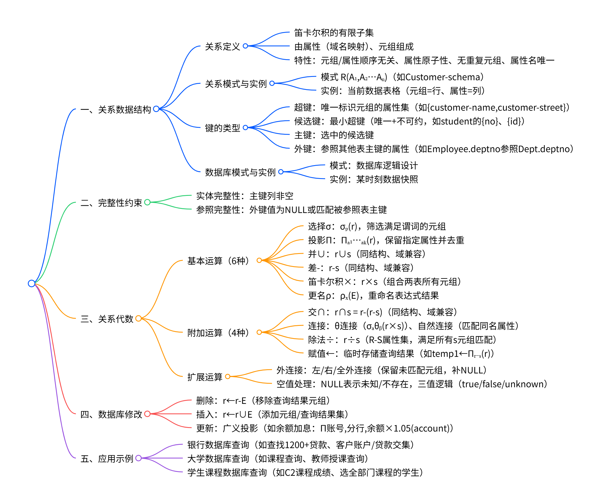

# Chapter2: Relation Model

## 关系数据结构（Relational Data Structure）

### 数学定义
- 关系定义为域列表的笛卡尔积的子集：D1 × D2 × … × Dn。
- 与数学定义的区别：每个域分配属性名；关系为有限集。
- 形式化表述：给定域 D1, D2, …, Dn，关系 r 是 D1 × D2 × … × Dn 的子集，即 n-元组 (a1, a2, …, an) 的集合，其中 ai ∈ Di。

### 示例
- 域示例：customer-name = {Jones, Smith, Curry, Lindsay}；customer-street = {Main, North, Park}；customer-city = {Harrison, Rye, Pittsfield}。
- 关系示例：r = {(Jones, Main, Harrison), (Smith, North, Rye), (Curry, North, Rye), (Lindsay, Park, Pittsfield), …}，定义在 customer-name × customer-street × customer-city 上。

### 关系模式（Relation Schema）
- 表示为 R = (A1, A2, …, An)，例如 Customer-schema = (customer-name, customer-street, customer-city)。
- r(R) 表示模式 R 上的关系。
- 也可记为 R(U)，其中 A1, A2, …, An 为属性；每个属性对应域 Di：{A1} → D1, {A2} → D2, …, {An} → Dn。

### 关系实例（Relation Instance）
- 关系的当前值用表格表示。
- 元组（Tuple）或行（Row）表示记录；属性（Attribute）或列（Column）。
- 示例表格：customer 表，包含 customer-name, customer-street, customer-city 的行，如 (Jones, Main, Harrison) 等。

### 属性
- 元组顺序无关（行顺序无关）。
- 属性顺序无关（列顺序无关）。
- 所有属性的域必须是原子的。
- 属性名必须不同。
- 多个属性可有相同域。
- 元组无重复。
- 示例：学生表 (NO, Name, Sex, Age, Class, Dept)。

### 数据库模式与实例（Database Schema）
- 数据库模式：数据库的逻辑设计。
- 数据库实例：数据库在给定时刻的数据快照。
- 包括关系模式和关系实例。

### 超键（SuperKey）
- 对于模式 R(U)，K ⊆ U 是超键，如果在任何关系 r 中，没有两个不同元组在 K 上有相同值，即若 t1 ≠ t2，则 t1[K] ≠ t2[K]。
- 值足以唯一标识每个可能的元组。
- 示例：{customer-name, customer-street} 和 {customer-name} 是 Customer 的超键。

### 候选键（Candidate Key）
- 候选键是最小超键。
- 示例：customer-id 是 customer 的候选键；account-number 是 account 的候选键。
- 学生表 (no, id, name, sex, age)：{no} 和 {id} 是候选键，可选 {no} 作为主键。
- 属性：唯一性（Uniqueness）：没有两个元组在 K 上相同；最小性（Irreducibility）：K 的任何真子集不具有唯一性。

### 主键（Primary Key）
- 从候选键中选择一个作为主键。

### 外键（Foreign Key）
- 对于关系 R1 和 R2，如果 R1 包含 R2 的主键 X，则 X 是 R1 参照 R2 的外键。
- R1 为参照关系，R2 为被参照关系。
- 示例：Employee (no, name, sex, age, deptno)；Dept (deptno, name, address)：deptno 是 Employee 参照 Dept 的外键。
- 问题解答：外键值可为 NULL；外键名不必与参照主键相同；外键可定义在同一表上。

### 大学组织示例（University Organization）
- 部门：dept_name (唯一), building, budget。
- 课程：course_id, title, dept_name, credits, prerequisites。
- 教师：ID (唯一), name, dept_name, salary。
- 学生：ID (唯一), name, dept_name, tot_cred。
- 教室：building, room_number, capacity。
- 班级：course_id, sec_id, year, semester, building, room_number, time_slot_id。
- 教学分配：教师与班级。
- 学生注册：学生与课程/班级。
- 包括大学数据库模式图（Schema Diagram）。

### 完整性约束（Integrity Constraint）
- 参照完整性（Referential Integrity）：r1 中外键值要么为 NULL，要么必须出现在 r2 的主键值中。
- 实体完整性（Entity Integrity）：主键列假设 NOT NULL。

## 关系代数基本操作（Fundamental Relational-Algebra-Operations）

### 六个基本操作符
- Select (选择)：σ。
- Project (投影)：Π。
- Union (并)：∪。
- Set Difference (差)：−。
- Cartesian Product (笛卡尔积)：×。
- Rename (更名)：ρ。
- 操作符以一个或两个关系作为输入，产生一个新关系作为结果。

### Select 操作
- 定义：σ_p(r) = {t | t ∈ r and p(t)}。
- p 为命题逻辑公式，由 ∧ (and)、∨ (or)、¬ (not) 连接的项组成。
- 每个项为 <attribute> op <attribute> 或 <attribute> op <constant>，其中 op ∈ {=, ≠, >, ≥, <, ≤}。
- 示例：σ_dept_name=“Physics”(instructor)。
- 示例：σ_A=B ∧ D>5(r)，从关系 r 中选择满足 A=B 且 D>5 的元组。

### Project 操作
- 定义：Π_A1, A2, …, Ak(r)，结果为 k 列关系，通过删除未列出列获得。
- 自动移除重复行，因为关系是集合。
- 示例：Π_ID, name, salary(instructor)，从 instructor 中投影 ID、name 和 salary 属性。
- 示例：Π_A,C(r)，从 r 中投影 A 和 C 列，**并移除重复**。

### Union 操作
- 定义：r ∪ s = {t | t ∈ r or t ∈ s}。
- 要求：r 和 s 必须有相同属性数，且对应属性域兼容。
- 示例：查找 Fall 2009 或 Spring 2010 学期教授的课程：Π_course_id(σ_semester=“Fall” ∧ year=2009(section)) ∪ Π_course_id(σ_semester=“Spring” ∧ year=2010(section))。

### Set Difference 操作
- 定义：r − s = {t | t ∈ r and t ∉ s}。
- 要求：r 和 s 必须兼容（相同属性数和域）。
- 示例：查找 Fall 2009 但不在 Spring 2010 学期教授的课程：Π_course_id(σ_semester=“Fall” ∧ year=2009(section)) − Π_course_id(σ_semester=“Spring” ∧ year=2010(section))。

### Cartesian Product 操作
- 定义：r × s = {t q | t ∈ r and q ∈ s}。
- 假设 r(R) 和 s(S) 的属性 disjoint（R ∩ S = ∅）；否则需重命名。
- 用于组合两个关系的信息。
- 示例：r × s，生成 r 中每个元组与 s 中每个元组的组合。

### Rename 操作
- 定义：ρ_x(E)，将表达式 E 的结果重命名为 x。
- 对于 arity n 的 E：ρ_x(A1, A2, …, An)(E)，将属性重命名为 A1, A2, …, An。
- 用于命名表达式结果或引用多个名称。

### 形式定义
- 基本表达式：数据库中的关系或常量关系。
- 关系代数表达式通过以下方式构建：E1 ∪ E2、E1 − E2、E1 × E2、σ_p(E1)、Π_s(E1)、ρ_x(E1)。

## 附加关系代数操作（Additional Relational-Algebra-Operations）

附加关系代数操作的核心价值是**不增强关系代数的表达能力**，但能大幅简化常见查询的表述形式，让复杂查询逻辑更清晰易懂。

### 集合交操作（Set Intersection）
- 定义：r ∩ s = {t | t ∈ r 且 t ∈ s}，即返回同时存在于关系r和s中的所有元组。
- 等价表达式：r ∩ s = r − (r − s)，可通过差运算推导得出。
- 适用条件：关系r和s必须兼容，要求属性数量相同且对应属性的域一致。
- 示例：若r包含元组(α,1)、(α,2)、(β,1)，s包含元组(α,2)、(β,3)，则r ∩ s的结果为(α,2)。

### 连接操作（Join）
- 定义：记为r ⋈_AθB s，其中θ ∈ {=, ≠, ≥, ≤, >, <}，表示从r和s的笛卡尔积中，筛选出满足“r的属性A与s的属性B满足θ关系”的元组，最终结果为r和s元组的拼接。
- 等价表达式：r ⋈_AθB s = σ_AθB(r × s)，本质是笛卡尔积后加选择条件。
- 示例：r ⋈_A>D s 表示从r×s中筛选出r的A属性值大于s的D属性值的元组，再拼接形成结果。

### 自然连接操作（Natural Join）
- 定义：记为r ⋈ s，自动寻找r和s的公共属性B，先对r和s做笛卡尔积，筛选出公共属性值相等的元组，再删除重复的公共属性列。
- 等价表达式：r ⋈ s = Π_Att(r)∪(Att(s)-{B}) σ_r.B=s.B(r × s)，其中Att(r)表示r的所有属性，Att(s)-{B}表示s中除公共属性B外的其他属性。
- 核心特点：无需手动指定连接条件，自动基于公共属性匹配，结果中无重复属性。
- 示例：若r和s的公共属性为B、D，则r ⋈ s会筛选r.B=s.B且r.D=s.D的元组，最终结果仅保留一套B、D属性列。

### 除法操作（Division）
- 前提条件：设关系r的模式为R=(A1,…,Am,B1,…,Bn)，关系s的模式为S=(B1,…,Bn)，s的属性集是r属性集的子集。
- 结果模式：r ÷ s的模式为R − S=(A1,…,Am)，仅保留r中不属于s的属性列。
- 定义：r ÷ s = {t | t ∈ Π_R-S(r) 且对所有u ∈ s，都有tu ∈ r}，即返回r中“与s的所有元组都能匹配”的前缀元组。
- 等价表达式：r ÷ s = Π_R-S(r) − Π_R-S((Π_R-S(r) × s) − r)，通过笛卡尔积、差运算推导得出。
- 示例：若r包含元组(a,b,c,d)、(a,b,e,f)、(e,d,c,d)等，s包含元组(c,d)、(e,f)，则r ÷ s的结果为(a,b)、(e,d)。

### 赋值操作（Assignment）
- 定义：使用赋值符号“←”，将复杂查询分解为一系列简单的关系代数表达式，将中间结果赋值给临时关系变量，最终通过变量组合得到查询结果。
- 核心作用：简化复杂查询的逻辑结构，让查询步骤更清晰，便于理解和维护。
- 示例：计算r ÷ s可通过赋值拆解为3步：
  1. temp1 ← Π_R-S(r)，提取r中不属于s的属性列；
  2. temp2 ← Π_R-S((temp1 × s) − r)，找出temp1中与s无法完全匹配的元组；
  3. result = temp1 − temp2，得到除法运算的最终结果。

## 扩展关系代数操作（Extended Relational-Algebra-Operations）

扩展关系代数操作是在基础/附加关系代数操作的基础上，针对“避免信息丢失”“处理未知值”等实际需求的补充，核心解决传统连接操作中“丢失不匹配元组”和“未知值处理逻辑不明确”的问题。

### 外部连接操作（Outer Join）
外部连接的核心目标是**避免连接过程中的信息丢失**：先按照传统连接（如自然连接）的逻辑计算匹配结果，再将其中一个或两个关系中“未匹配到的元组”补充到结果中，未匹配的属性列用`null`值填充。

#### 1. 左外连接（Left Outer Join）
- 符号：`r ⟕ s`（以左侧关系r为基准，如`loan ⟕ borrower`中`loan`是左关系）
- 定义：先计算`r`与`s`的自然连接（或指定条件的连接），再将`r`中所有未匹配到`s`的元组补充到结果中，`s`对应的属性列填充为`null`。
- 示例（以`loan ⟕ borrower`为例）：
  - `loan`中存在元组（L-260, 1700, Perryridge），若`borrower`中无该贷款号的记录，则左外连接结果会保留该元组，`customer-name`列填充为`null`。

#### 2. 右外连接（Right Outer Join）
- 符号：`r ⟖ s`（以右侧关系s为基准，如`loan ⟖ borrower`中`borrower`是右关系）
- 定义：先计算`r`与`s`的自然连接（或指定条件的连接），再将`s`中所有未匹配到`r`的元组补充到结果中，`r`对应的属性列填充为`null`。
- 示例（以`loan ⟖ borrower`为例）：
  - `borrower`中存在元组（Hayes, L-155），若`loan`中无L-155的记录，则右外连接结果会保留该元组，`amount`和`branch-name`列填充为`null`。

#### 3. 全外连接（Full Outer Join）
- 符号：`r ⟗ s`（同时保留左、右关系的未匹配元组）
- 定义：先计算`r`与`s`的自然连接（或指定条件的连接），再分别将`r`中未匹配的元组、`s`中未匹配的元组补充到结果中，未匹配的属性列均填充为`null`。
- 示例（以`loan ⟗ borrower`为例）：
  - 同时保留`loan`中未匹配的（L-260, 1700, Perryridge）和`borrower`中未匹配的（Hayes, L-155），前者`customer-name`为`null`，后者`amount`和`branch-name`为`null`。

### Null 值（空值）处理规则
`null`是关系代数中用于表示“未知值”或“不存在的值”的特殊标记，其运算和处理逻辑需遵循以下规则，以避免歧义。

#### 1. 基本含义与算术运算
- 含义：`null`不代表任何具体值，仅表示“无法确定”或“无此值”。
- 算术运算：任何涉及`null`的算术表达式结果均为`null`（如`5 + null = null`、`10 × null = null`）。

#### 2. 聚合函数与重复处理
- 聚合函数（如求和、计数、平均值）：直接忽略`null`值，仅基于非空值计算（例如`AVG(balance)`中若有`null`的`balance`，则不纳入平均计算）。
- 重复消除（如投影去重）与分组：`null`被视为与自身相等的“值”——两个元组若仅在`null`列上相同，会被判定为重复元组（去重时会合并，分组时会归为同一组）。

#### 3. 比较运算与三值逻辑
- 比较运算：任何属性与`null`的比较结果均为`unknown`（既非`true`也非`false`），例如`balance > null = unknown`、`name = null = unknown`。
- 三值逻辑：基于`true`、`false`、`unknown`三种结果的逻辑运算规则：
  - OR（或）：`unknown ∨ true = true`，`unknown ∨ false = unknown`，`unknown ∨ unknown = unknown`；
  - AND（与）：`true ∧ unknown = unknown`，`false ∧ unknown = false`，`unknown ∧ unknown = unknown`；
  - NOT（非）：`NOT unknown = unknown`。

#### 4. 在关系代数操作中的具体表现
- 选择（Select）：若选择谓词的结果为`unknown`，则视为`false`，对应的元组不被选中；
- 连接（Join）：若两个元组的公共属性中存在`null`（无论单侧还是双侧），则判定为“不匹配”，不纳入连接结果；
- 投影（Projection）、并（Union）、交（Intersection）、差（Set Difference）：`null`按“与自身相等”处理——若两个元组的非`null`列完全一致，且`null`列位置相同，则视为重复元组（投影去重、并操作去重时会合并）。

## 数据库修改（Modification of the Database）
数据库修改通过关系代数表达式实现，核心包括**删除（Deletion）**、**插入（Insertion）** 和**更新（Updating）** 三种操作，均直接作用于关系（表），确保数据的增删改符合逻辑规则。

### 1. 删除操作（Deletion）
删除操作用于从关系中移除满足特定条件的元组（行），**仅能删除完整元组，无法单独删除某一属性的值**。

#### 核心逻辑
通过关系代数的“差运算”实现，表达式为：  
`r ← r − E`  
其中：
- `r` 是待删除元组的目标关系；
- `E` 是一个关系代数查询，其结果是“需要从`r`中删除的元组集合”。

#### 示例：删除Perryridge分支的所有账户
要删除`account`表中“branch-name=Perryridge”的所有账户，先通过选择操作筛选出这些账户，再用差运算从原表中移除：  
`account ← account − σ_branch-name=“Perryridge”(account)`  
- 步骤1：`σ_branch-name=“Perryridge”(account)` 筛选出Perryridge分支的所有账户元组；  
- 步骤2：`account − 筛选结果` 从原`account`表中移除这些元组，得到更新后的`account`表。

### 2. 插入操作（Insertion）
插入操作用于向关系中添加新元组，新元组可通过“常量指定”或“查询结果推导”获取，**需确保插入的元组结构与关系模式（属性数量、域）一致**。

#### 核心逻辑
通过关系代数的“并运算”实现，表达式为：  
`r ← r ∪ E`  
其中：
- `r` 是待插入元组的目标关系；
- `E` 是新元组的来源，可为“常量关系”（单个/多个固定元组）或“关系代数查询结果”（批量推导元组）。

#### 示例1：插入单个元组（Smith的账户信息）
向`account`表插入“Perryridge分支、账号A-973、余额1200”的元组，同时向`depositor`表插入“客户Smith、账号A-973”的关联元组：  
1. `account ← account ∪ {(“Perryridge”, A-973, 1200)}`  
   - `{(“Perryridge”, A-973, 1200)}` 是常量关系，包含一个符合`account`模式的元组；  
2. `depositor ← depositor ∪ {(“Smith”, A-973)}`  
   - 同步插入客户与账号的关联关系，确保数据一致性。

#### 示例2：批量插入（为Perryridge贷款客户赠送账户）
为`Perryridge`分支的所有贷款客户赠送“余额200、账号=贷款号”的储蓄账户，需批量推导新元组并插入：  
1. `r1 ← σ_branch_name=“Perryridge”(borrower ⋈ loan)`  
   - 通过自然连接`borrower ⋈ loan`关联客户、贷款信息，再筛选出Perryridge分支的客户元组，存入临时关系`r1`；  
2. `account ← account ∪ Π_loan_number, branch_name, 200(r1)`  
   - 从`r1`中投影“loan_number（作为账号）、branch_name、200（固定余额）”，插入`account`表；  
3. `depositor ← depositor ∪ Π_customer_name, loan_number(r1)`  
   - 从`r1`中投影“customer_name、loan_number（作为账号）”，插入`depositor`表，建立客户与新账号的关联。

### 3. 更新操作（Updating）
更新操作用于修改关系中已有元组的属性值，**无需删除原元组，直接通过“广义投影”生成新值**。

#### 核心逻辑
通过“广义投影”实现，表达式为：  
`r ← Π_F1, F2, …, Fi(r)`  
其中：
- `F1, F2, …, Fi` 是投影规则，对应`r`的每个属性：
  - 若属性无需更新，`Fi`直接使用原属性名（如`account-number`）；
  - 若属性需要更新，`Fi`是一个表达式（如`balance * 1.05`），基于原属性值计算新值。

#### 示例1：全量更新（所有账户余额增加5%）
为`account`表中所有账户的`balance`属性增加5%，直接对`balance`做表达式投影：  
`account ← Π_account-number, branch-name, balance * 1.05(account)`  
- 投影规则：`account-number`（原属性）、`branch-name`（原属性）、`balance * 1.05`（新值表达式），生成所有账户余额更新后的元组，覆盖原`account`表。

#### 示例2：条件更新（按余额分级调整利率）
对`balance > 10000`的账户余额增加6%，对`balance ≤ 10000`的账户增加5%，需分条件投影后合并：  
`account ← Π_account_number, branch_name, balance * 1.06(σ_BAL>10000(account)) ∪ Π_account_number, branch_name, balance * 1.05(σ_BAL≤10000(account))`  
- 步骤1：`σ_BAL>10000(account)` 筛选高余额账户，投影时`balance`按1.06倍更新；  
- 步骤2：`σ_BAL≤10000(account)` 筛选低余额账户，投影时`balance`按1.05倍更新；  
- 步骤3：用“并运算”合并两类更新后的元组，覆盖原`account`表。

## 示例
- **银行示例（Banking Example）**：
  - branch (branch-name, branch-city, assets)。
  - customer (customer-name, customer-street, customer-city)。
  - account (account-number, branch-name, balance)。
  - loan (loan-number, branch-name, amount)。
  - depositor (customer-name, account-number)。
  - borrower (customer-name, loan-number)。
- **查询示例**：
  - 查找 > $1200 贷款：σ_amount>1200(loan)。
  - 查找 > $1200 贷款号：Π_loan-number(σ_amount>1200(loan))。
  - 查找有贷款或账户或两者客户名：Π_customer-name(borrower) ∪ Π_customer-name(depositor)。
  - 查找既有贷款又有账户客户名：Π_customer-name(borrower) ∩ Π_customer-name(depositor)。
  - 查找 Perryridge 分支贷款客户名：Π_customer-name(σ_branch-name=“Perryridge”(σ_borrower.loan-number=loan.loan-number(borrower × loan)))。
  - 查找 Perryridge 贷款但无任何分支账户客户名：Π_customer-name(σ_branch-name=“Perryridge”(σ_borrower.loan-number=loan.loan-number(borrower × loan))) − Π_customer-name(depositor)。
  - 查找最大账户余额：Π_balance(account) − Π_account.balance(σ_account.balance<d.balance(account × ρ_d(account)))。
  - 查找至少在 Downtown 和 Uptown 分支有账户客户：Π_CN(σ_BN=“Downtown”(depositor ⋈ account)) ∩ Π_CN(σ_BN=“Uptown”(depositor ⋈ account))；或 Π_customer-name, branch-name(depositor ⋈ account) ÷ ρ_temp(branch-name)({(“Downtown”), (“Uptown”)})。
  - 查找 Brooklyn 市所有分支有账户客户：Π_customer-name, branch-name(depositor ⋈ account) ÷ Π_branch-name(σ_branch-city=“Brooklyn”(branch))。
- **示例 2**：
  - S (SNO, SName, Sex, Age, Class, Dept)。
  - C (Cno, Cname, Dept)。
  - SC (SNO, Cno, Grade)。
  - 查询：
    - (1) Π_SNO,GRADE(σ_CNO=’C2’(SC))。
    - (2) Π_SNO,SNAME(σ_CNO=’C2’(S ⋈ SC))。
    - (3) Π_SNO,SNAME(σ_CNAME=’DB’(S ⋈ SC ⋈ C))。
    - (4) Π_SNO,SNAME(S) − Π_SNO,SNAME(σ_CNO=’C2’(S ⋈ SC))。
    - (5) Π_SNAME(S ⋈ (Π_SNO,CNO(SC) ÷ Π_CNO(C)))。

## 总结（Summary）
- 关系数据模型：表、记录/元组/行、属性、域/列。
- 键：候选键、主键、外键。
- 约束规则。
- 关系代数：基本操作；附加操作；扩展操作。
- 元组关系演算；域关系演算。