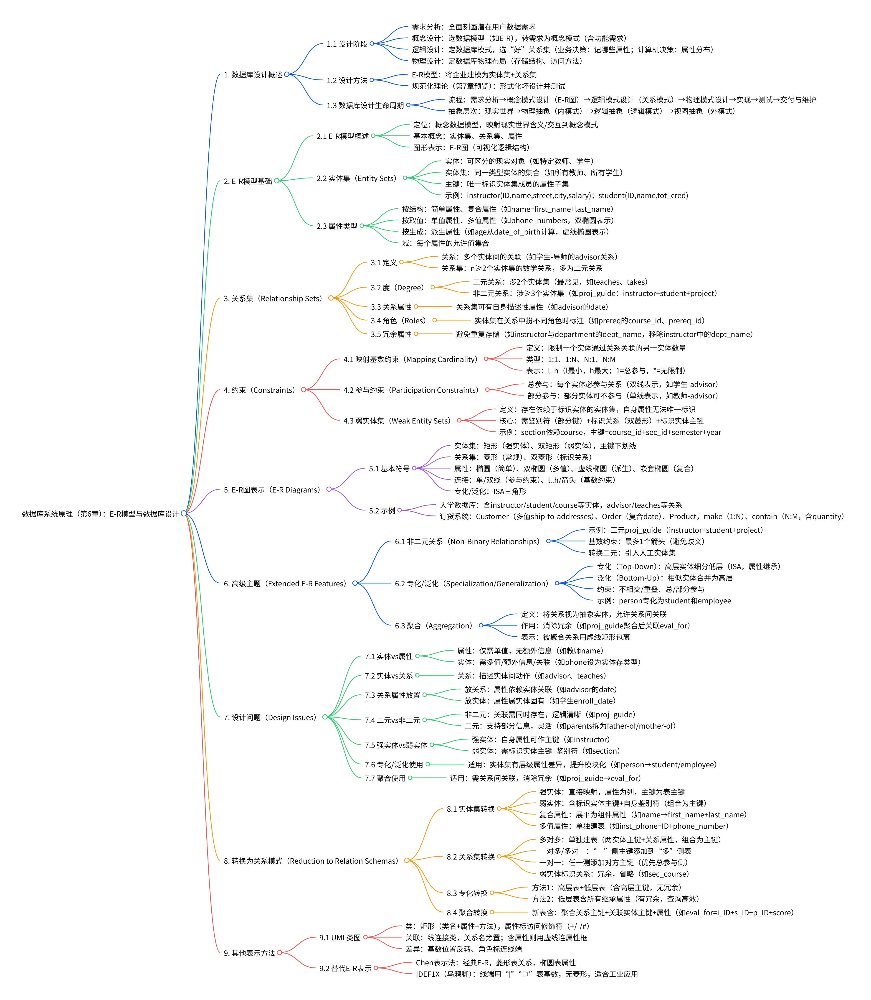

# Chapter6: Database Design Using the E-R Model
## 思维导图

## 1. 数据库设计概述
### 1.1 设计阶段
- 需求分析：作为数据库设计的初始阶段，需全面刻画潜在数据库用户的数据需求。
- 概念设计：选择合适的数据模型（如E-R模型），将用户需求转化为概念模式，同时明确企业的功能需求（即用户对数据的各类操作或事务需求）。
- 逻辑设计：核心是确定数据库模式，筛选“优质”的关系模式集合。该阶段包含两类决策，一是业务决策（明确需在数据库中记录的属性），二是计算机科学决策（确定关系模式的构成及属性在各模式中的分布方式）。
- 物理设计：聚焦数据库的物理布局决策，包括物理存储结构和数据访问方法的设计。

### 1.2 设计方法
- E-R模型：将企业场景建模为实体集与关系集的集合。实体是企业中可区分的“事物”或“对象”，由一组属性描述；关系是多个实体间的关联。
- 规范化理论（第7章预览）：通过形式化方式定义“不良设计”的特征，并提供对应的检测方法。

### 1.3 数据库设计生命周期
- 完整流程：需求分析 → 概念模式设计（生成E-R图） → 逻辑模式设计（转化为关系数据模式） → 物理模式设计 → 系统实现 → 系统测试 → 交付与维护。
- 涉及抽象层次：从现实世界出发，经物理抽象（对应内模式）、逻辑抽象（对应逻辑模式），最终到视图抽象（对应外模式）。

## 2. E-R模型基础
### 2.1 E-R模型概述
- 定位与作用：E-R模型是用于数据库设计的**概念数据模型**，核心价值在于将现实世界中企业的含义、数据交互关系映射为结构化的概念模式，是连接现实场景与数据库设计的关键桥梁，因此被众多数据库设计工具采纳。
- 基本构成概念：E-R模型的三大核心要素为实体集（Entity Sets）、关系集（Relationship Sets）和属性（Attributes），三者共同构建了对企业数据结构的抽象描述。
- 图形化表达：通过**E-R图（Entity-Relationship Diagram）** 实现可视化呈现，能够直观地展示数据库的整体逻辑结构，便于设计沟通与后续迭代。

### 2.2 实体集（Entity Sets）
- 实体（Entity）：指现实世界中“存在且可区分”的具体对象或事物，例如特定的教师（如ID为22222的Einstein）、学生（如ID为44553的Peltier）、公司等。
- 实体集（Entity Set）：由**同一类型**的实体构成的集合，集合内所有实体共享相同的属性特征。例如“instructor（教师）实体集”是所有教师实体的集合，“student（学生）实体集”是所有学生实体的集合。
- 属性与主键：实体集通过一组**属性（Attributes）** 描述其成员的特征（如教师的ID、姓名、薪资）；其中，**主键（Primary Key）** 是属性的子集，具备“唯一标识实体集中每个成员”的功能（如instructor实体集的“ID”）。
- 示例：
  - instructor实体集：属性包括（ID, name, street, city, salary），主键为“ID”。
  - student实体集：属性包括（ID, name, tot_cred），主键为“ID”。

### 2.3 属性类型
- 按结构分类：
  - 简单属性（Simple Attribute）：不可再拆分的原子属性，如instructor的“ID”“salary”、student的“tot_cred”。
  - 复合属性（Composite Attribute）：可拆分为多个“组件属性”的属性，组件属性可进一步细分。例如“name”可拆分为“first_name（名）、middle_initial（中间名首字母）、last_name（姓）”；“address”可拆分为“street_number（街道号）、street_name（街道名）、apartment_number（公寓号）、city（城市）、state（州）、postal_code（邮编）”。
- 按取值数量分类：
  - 单值属性（Single-valued Attribute）：每个实体在该属性上仅对应一个值，如instructor的“name”“ID”。
  - 多值属性（Multivalued Attribute）：每个实体在该属性上可对应多个值，通常用“{ }”标识。例如教师的“phone_numbers（电话号码）”，一个教师可能有办公电话、私人电话等多个号码。
- 按生成方式分类：
  - 派生属性（Derived Attribute）：无需直接存储，可通过其他属性**计算推导**得到的属性。例如“age（年龄）”可由“date_of_birth（出生日期）”结合当前日期计算得出，该属性不占用物理存储空间。
- 域（Domain）：为每个属性定义的“允许取值的集合”，规定了属性的取值范围。例如“salary”的域可能是“大于0的数值”，“gender”的域可能是{“男”“女”“其他”}。

## 3. 关系集（Relationship Sets）
### 3.1 关系集的定义
- 关系（Relationship）：指多个实体之间的特定关联，反映现实世界中实体的交互关系。例如，学生实体（如ID为44553的Peltier）与教师实体（如ID为22222的Einstein）之间的“advisor（指导）”关联，就是一个具体的关系。
- 关系集（Relationship Set）：是由**n个（n ≥ 2）实体集**中的实体构成的数学关系集合，形式可表示为`{(e₁, e₂, …, eₙ) | e₁ ∈ E₁, e₂ ∈ E₂, …, eₙ ∈ Eₙ}`，其中`(e₁, e₂, …, eₙ)`是一个关系，`E₁, E₂, …, Eₙ`是参与关系的实体集。在数据库系统中，**二元关系集（涉及2个实体集）最为常见**，如“advisor（指导）”关系集（连接student和instructor实体集）。

### 3.2 关系集的度（Degree）
关系集的“度”指其涉及的实体集数量，主要分为两类：

- 二元关系（Binary Relationship）：度为2，即仅涉及两个实体集。这是数据库设计中最普遍的关系类型，绝大多数业务场景可通过二元关系描述，例如“teaches（授课）”关系集（连接instructor和course实体集）、“takes（选课）”关系集（连接student和course实体集）。
- 非二元关系（Non-binary Relationship）：度大于2，涉及三个及以上实体集。这类关系较少见，仅在特定场景下使用。例如“proj_guide（项目指导）”三元关系集，同时连接instructor（教师）、student（学生）、project（项目）三个实体集，描述“教师指导学生参与项目”的关联。

### 3.3 关系集的属性
关系集可拥有**自身的描述性属性**，用于刻画关系的额外特征，这些属性不属于参与关系的任何一个实体集，仅归属于关系本身。例如：

- “advisor（指导）”关系集可添加“date（指导开始日期）”属性，用于记录学生与导师建立指导关系的具体时间（如“3 May 2008”“10 June 2007”）；
- “takes（选课）”关系集可添加“grade（成绩）”属性，用于记录学生选修某门课程的最终成绩，该属性既不属于student实体集，也不属于course实体集，仅用于描述“选课”这一关系的结果。

### 3.4 关系集的角色（Roles）
当**同一实体集在关系集中扮演不同角色**时，需通过“角色标签（Role）”明确区分实体的作用，避免歧义。这一情况常见于“自反关系”（实体集与自身建立的关系）。例如：

- 在“prereq（先修课）”关系集中，参与关系的实体集均为“course（课程）”，但一个课程扮演“主课程（course_id）”角色，另一个课程扮演“先修课程（prereq_id）”角色。通过“course_id”和“prereq_id”这两个角色标签，可清晰表达“某课程是另一课程的先修课”这一关联（如“数据库系统”的prereq_id为“计算机基础”的course_id）。

### 3.5 关系集中的冗余属性
冗余属性指在关系集或关联的实体集中**重复存储的信息**，会增加数据不一致的风险，需在设计中避免并移除。典型案例如下：

- 实体集“instructor（教师）”包含属性（ID, name, dept_name, salary），实体集“department（部门）”包含属性（dept_name, building, budget），二者通过“inst_dept（教师-部门）”关系集关联；
- 由于“dept_name”是“department”实体集的主键，可唯一标识部门，其在“instructor”实体集中的存储属于冗余信息（因“inst_dept”关系已能关联教师与部门）。因此，需从“instructor”实体集中移除“dept_name”属性，仅通过“inst_dept”关系获取教师所属部门，消除冗余。

## 4. 约束（Constraints）
### 4.1 映射基数约束（Mapping Cardinality）
- 定义：用于限制**一个实体集中的实体，通过某一关系集可关联的另一实体集中实体的数量**，核心作用是规范实体间关联的“数量边界”，仅适用于二元关系集（非二元关系集需特殊处理）。
- 核心类型：根据关联数量限制，分为四种基础类型，均需结合实际业务场景定义：
  1. 一对一（1:1）：实体集A中的一个实体最多关联实体集B中的一个实体，反之亦然。示例：“教师（instructor）”与“专属办公室（office）”的关系，一个教师最多有一个专属办公室，一个专属办公室最多分配给一个教师。
  2. 一对多（1:N）：实体集A中的一个实体可关联实体集B中的多个实体，但实体集B中的一个实体最多关联实体集A中的一个实体。示例：“部门（department）”与“教师（instructor）”的关系，一个部门可包含多个教师，一个教师最多属于一个部门。
  3. 多对一（N:1）：与“一对多”逻辑相反，实体集A中的多个实体可关联实体集B中的一个实体，实体集B中的一个实体最多关联实体集A中的一个实体。示例：“学生（student）”与“班级（class）”的关系，多个学生属于一个班级，一个学生最多属于一个班级。
  4. 多对多（N:M）：实体集A中的一个实体可关联实体集B中的多个实体，反之亦然。示例：“学生（student）”与“课程（course）”的关系，一个学生可选修多门课程，一门课程可被多个学生选修。
- 图形与符号表示：通过“l..h”格式标注在关系集与实体集的连接线上，其中“l”为**最小基数**（最少关联数量），“h”为**最大基数**（最多关联数量）：
  - 最小基数“1”：表示实体必须参与该关系（对应总参与约束）；
  - 最小基数“0”：表示实体可不参与该关系（对应部分参与约束）；
  - 最大基数“1”：表示实体最多关联一个对方实体；
  - 最大基数“*”：表示实体关联对方实体的数量无限制。
  示例：“advisor（指导）”关系中，教师侧标注“0..*”（一个教师可指导0个或多个学生），学生侧标注“1..1”（一个学生必须且只能有1个导师）。

### 4.2 参与约束（Participation Constraints）
- 定义：用于规定**实体集中的实体是否必须参与某一关系集**，反映实体与关系的“强制关联程度”，通过连接线的样式区分。
- 核心类型：
  1. 总参与（Total Participation）：
     - 定义：实体集中的**每一个实体，都必须参与该关系集中至少一个关系**，即不存在“不关联任何对方实体”的实体。
     - 图形表示：用**双实线**连接实体集与关系集。
     - 示例：“学生（student）”与“advisor（指导）”的关系，若学校规定“每个学生必须有导师”，则学生对该关系的参与为总参与，连接线为双实线。
  2. 部分参与（Partial Participation）：
     - 定义：实体集中的**部分实体可参与该关系集，部分实体可不参与**，即允许存在“不关联任何对方实体”的实体。
     - 图形表示：用**单实线**连接实体集与关系集。
     - 示例：“教师（instructor）”与“advisor（指导）”的关系，若学校允许“部分教师不指导学生”，则教师对该关系的参与为部分参与，连接线为单实线。

### 4.3 弱实体集（Weak Entity Sets）
- 定义：与“强实体集”（可通过自身属性唯一标识的实体集）相对，弱实体集是**存在依赖于另一“标识实体集（Identifying Entity Set）”的实体集**——其自身的属性不足以唯一标识每个实体，必须结合标识实体集的主键才能实现唯一标识。
- 核心特征：
  1. 存在依赖性：弱实体集的“存在”依赖于标识实体集，若标识实体集中的某实体被删除，其关联的弱实体也需被删除（如“课程章节（section）”依赖“课程（course）”，若某课程被删除，对应的章节也需删除）。
  2. 无独立主键：弱实体集的属性仅能构成“鉴别符（Discriminator，又称部分键）”——需与标识实体集的主键组合，才能成为弱实体的“完整主键”。鉴别符在E-R图中用**虚线下划线**标注。
  3. 标识关系（Identifying Relationship）：连接弱实体集与标识实体集的特殊关系集，用于传递标识实体的主键，在E-R图中用**双菱形**表示。
- 示例：“课程章节（section）”弱实体集：
  - 自身属性：sec_id（章节号）、semester（学期）、year（年份）——仅这三个属性无法唯一标识章节（不同课程的章节可能有相同的sec_id、semester、year）；
  - 标识实体集：“课程（course）”，其主键为course_id；
  - 完整主键：section的完整主键为“course_id（来自标识实体） + sec_id + semester + year（鉴别符）”；
  - 标识关系：“sec_course”（双菱形），连接section（双矩形，弱实体集符号）与course。

## 5. E-R图表示（E-R Diagrams）
### 5.1 基本符号与含义
E-R图通过标准化的图形符号直观呈现数据库的概念结构，各核心元素的符号规则如下：

| 符号类型       | 图形特征                                  | 对应概念                | 关键说明                                                                 |
|----------------|-------------------------------------------|-------------------------|--------------------------------------------------------------------------|
| 实体集         | 普通矩形（强实体）、双矩形（弱实体）      | 强实体集/弱实体集       | 矩形内部列出实体的属性，**主键属性用实线下划线标注**；弱实体集需关联双菱形的标识关系 |
| 关系集         | 普通菱形（常规关系）、双菱形（标识关系）  | 常规关系集/标识关系集   | 标识关系仅用于连接弱实体集与其实体集，传递主键以构成弱实体的完整标识       |
| 属性           | 椭圆（基础样式）                          | 各类属性                | - 简单属性：普通椭圆； - 复合属性：椭圆内嵌套子椭圆（如name包含first_name）； - 多值属性：**双椭圆**（如phone_numbers）； - 派生属性：**虚线椭圆**（如age，从date_of_birth推导） |
| 连接线条       | 单实线、双实线、带箭头/数字的线条        | 实体与关系的关联        | - 参与约束：**双实线**表示总参与（实体必关联关系），单实线表示部分参与； - 基数约束：可标注`l..h`（如0..*表示0到无限个），或用箭头（→表示“1”，—表示“多”） |
| 专化/泛化      | 三角形（标注“ISA”）                      | 实体集的层级关系        | 三角形连接父实体集与子实体集（如person是父集，student、employee是子集），可标注“disjoint”（不相交）或“overlapping”（重叠） |

### 5.2 典型E-R图示例
#### 5.2.1 大学数据库E-R图
以高校场景为核心，涵盖教学管理的关键实体与关系，结构如下：

- **核心实体集**：
  - instructor（强实体）：属性包括ID（主键）、name、street、city、salary；
  - student（强实体）：属性包括ID（主键）、name、tot_cred；
  - course（强实体）：属性包括course_id（主键）、title、credits；
  - department（强实体）：属性包括dept_name（主键）、building、budget；
  - section（弱实体）：属性包括sec_id（鉴别符）、semester、year，依赖course（标识实体集），完整主键为`course_id + sec_id + semester + year`。
- **核心关系集**：
  - advisor（菱形）：连接instructor与student，基数约束为“instructor（0..*）→ student（1..1）”（教师可指导0或多个学生，学生必属1个教师）；
  - teaches（菱形）：连接instructor与course，描述“教师授课”关系；
  - takes（菱形）：连接student与section，含属性grade（记录选课成绩）；
  - sec_course（双菱形）：标识关系，连接section与course，传递course的主键course_id。

#### 5.2.2 订货系统E-R图
围绕“客户-订单-产品”的业务流程设计，重点体现多值属性、复合属性与关系约束：

- **核心实体集**：
  - Customer（强实体）：属性包括customer-number（主键）、name、balance、discount，**多值属性ship-to-addresses**（双椭圆，一个客户可有多地址）；
  - Order（强实体）：属性包括order-number（主键）、**复合属性date**（含year、month、day）、ship-to-address（单值，与客户的多值地址区分）；
  - Product（强实体）：属性包括product-number（主键）、name、manufacturing-plant、quantity-on-hand。
- **核心关系集**：
  - make（菱形）：连接Customer与Order，描述“客户下单”关系；约束为“Customer（0..*，部分参与）→ Order（1..1，总参与）”（客户可不下单，订单必属1个客户），基数为“一对多”（1个客户可多订单）；
  - contain（菱形）：连接Order与Product，描述“订单包含产品”关系；含属性quantity（记录产品订购数量），约束为“Order（1..*，总参与）↔ Product（0..*，部分参与）”（订单必含1种以上产品，产品可未被订购），基数为“多对多”。

## 6. 高级主题（Extended E-R Features）
### 6.1 非二元关系（Non-Binary Relationships）
非二元关系指**度大于2**（涉及3个及以上实体集）的关系集，虽不如二元关系普遍，但在特定场景中可更精准描述多实体交互，核心特性与处理方式如下：

- **定义与示例**：  
  典型为三元关系（度=3），即同时关联3个实体集。例如“proj_guide（项目指导）”关系集，连接“instructor（教师）”“student（学生）”“project（项目）”三个实体集，直接描述“教师指导学生参与某一项目”的多实体关联，避免拆分多个二元关系导致的逻辑割裂。

- **基数约束规则**：  
  为避免歧义，非二元关系集的基数约束需遵循“**最多一个箭头**”原则——仅允许在关系集与一个实体集的连接线上标注箭头（表示“最多关联1个该实体”），其余实体集用无向线（表示“关联数量无限制”）。例如在proj_guide中，若箭头指向instructor，意为“一个学生在某一项目中最多有1位指导教师”，而教师可指导多个学生参与不同项目，项目可由多位教师指导不同学生。

- **转换为二元关系的方法**：  
  若需将非二元关系拆解为二元关系，需引入“**人工实体集（Artificial Entity Set）** ”，步骤如下：  
  1. 为非二元关系集R创建人工实体集E，将R的属性转移至E，并为E设置标识属性（或设为弱实体集）；  
  2. 建立3个二元关系集：RA（连接E与实体集A）、RB（连接E与实体集B）、RC（连接E与实体集C）；  
  3. 对每个原关系（a∈A, b∈B, c∈C），在E中创建一个实体e，分别在RA、RB、RC中添加（e,a）、（e,b）、（e,c）。  
  例如拆解proj_guide时，人工实体集E可命名为“proj_guide_entity”，通过RA（E-instructor）、RB（E-student）、RC（E-project）实现二元化，但需注意：此转换可能无法完全保留原关系的所有约束，需额外补充规则。

### 6.2 专化/泛化（Specialization/Generalization）
专化与泛化是描述实体集“层级关系”的两种视角，核心是通过“ISA（is a）”关联高层实体集与低层实体集，实现数据的模块化设计，二者本质为逆过程。

- **核心定义与属性继承**：  
  - **专化（Specialization，自上而下）**：从“高层实体集（Superclass）”中细分出“低层实体集（Subclass）”，低层实体集具备高层实体集的所有属性与关系参与权（即**属性继承**），同时拥有自身专属属性。例如从“person（人）”（高层，属性：ID、name、street、city）中，专化出“student（学生）”（低层，新增属性：tot_cred）和“employee（员工）”（低层，新增属性：salary）。  
  - **泛化（Generalization，自下而上）**：将多个“低层实体集”（共享相同属性与关系）合并为“高层实体集”，消除属性冗余。例如将“student”和“employee”合并为“person”，统一管理共享属性（ID、name等），仅在低层保留特有属性。

- **关键约束类型**：  
  专化/泛化需通过约束明确低层实体集的成员归属规则，分为两类：  
  1. **成员资格约束（不相交vs重叠）**：  
     - 不相交（Disjoint）：一个高层实体**最多属于一个低层实体集**，E-R图中在ISA三角旁标注“disjoint”。例如“person”专化为“instructor（教师）”和“secretary（秘书）”，一个人只能是教师或秘书，不能兼任。  
     - 重叠（Overlapping）：一个高层实体**可属于多个低层实体集**，默认不标注或标注“overlapping”。例如“person”专化为“student”和“employee”，一个人可既是学生（在读）又是员工（兼职）。  
  2. **完整性约束（总vs部分）**：  
     - 总（Total）：高层实体**必须属于至少一个低层实体集**，E-R图中用双实线连接高层与ISA三角。例如“student”泛化为“graduate（研究生）”和“undergraduate（本科生）”，所有学生必属二者之一。  
     - 部分（Partial）：高层实体**可不属于任何低层实体集**，用单实线连接。例如“person”专化为“student”和“employee”，部分人可既非学生也非员工。

### 6.3 聚合（Aggregation）
聚合是将“关系集”视为“抽象实体集”的设计技术，用于解决“关系之间存在关联”的场景，核心作用是消除数据冗余，避免关系信息重复存储。

- **定义与应用场景**：  
  当需描述“两个关系集之间的关联”时，直接关联会导致原关系集的信息重复，此时可将**一个关系集（称为“被聚合关系”）抽象为一个人工实体（称为“聚合实体”）**，再用新关系集关联聚合实体与其他实体/关系。例如：  
  - 原关系集“proj_guide（教师-学生-项目）”描述指导关系；  
  - 需新增“eval_for（指导评价）”关系，记录“教师对学生的项目指导评价”，若直接关联instructor、student、project、evaluation，会重复proj_guide的关联信息；  
  - 通过聚合，将proj_guide抽象为聚合实体“proj_guide_agg”，再用eval_for关联“proj_guide_agg”与“evaluation（评价）”，既保留“评价对应特定指导关系”的逻辑，又避免重复存储指导关系的信息。

- **核心优势与E-R图表示**：  
  - 优势：消除冗余关联信息，将复杂的多关系交互拆解为“聚合实体-新关系”的简单结构，简化E-R图逻辑；  
  - 图形表示：被聚合的关系集仍用菱形表示，外部用虚线矩形包裹（代表抽象为聚合实体），新关系集直接与虚线矩形（聚合实体）连接。例如proj_guide被虚线矩形包裹，eval_for（菱形）一端连接虚线矩形，另一端连接evaluation（实体集）。

## 7. 设计问题（Design Issues）
### 7.1 实体（Entity）vs. 属性（Attribute）
核心是判断“待描述的概念”是否需要独立存储额外信息或处理多值/复杂关联，决策依据围绕“描述需求的深度与灵活性”：

- **选择属性的场景**：若概念仅需存储“单一值”且无额外描述需求，可作为实体的属性。例如，教师的“姓名（name）”“薪资（salary）”——仅需记录文本或数值，无需附加其他信息，适合作为`instructor`实体的属性。
- **选择实体的场景**：若概念需存储“多值”“额外描述信息”或与其他实体产生关联，则需设计为独立实体集。例如，“电话（phone）”：  
  - 若仅记录教师的电话号码，可作为`instructor`的多值属性`{phone_number}`；  
  - 若需额外记录号码类型（办公/私人）、所属运营商等信息，则需将“phone”设计为实体集，包含`phone_id`（主键）、`phone_number`、`type`、`carrier`等属性，并通过`inst_phone`关系集与`instructor`关联，满足更丰富的描述需求。

### 7.2 实体（Entity）vs. 关系（Relationship）
关键是区分“独立存在的事物”与“事物间的交互动作/关联”，关系集更适合描述“动态关联或动作”：

- **选择实体的场景**：概念是“独立存在、可被直接标识”的事物，不依赖其他实体的关联而存在。例如，“课程（course）”“学生（student）”——即使不考虑“选课（takes）”关系，课程和学生仍是客观存在的实体，适合设计为实体集。
- **选择关系的场景**：概念是“实体间的动作或关联”，依赖于参与的实体而存在，无法独立标识。例如，“指导（advisor）”“授课（teaches）”“选课（takes）”——这些是教师与学生、教师与课程、学生与课程之间的交互动作，无实体参与则无意义，适合设计为关系集。  
  典型 guideline：若概念可描述为“实体A对实体B做了什么”（如“教师指导学生”），则优先用关系集。

### 7.3 关系属性的放置
核心是判断属性“属于实体本身”还是“依赖于实体间的关联”，归属需与业务含义强绑定：

- **放置在实体中的情况**：属性描述“实体自身的固有特征”，与其他实体的关联无关。例如，“学生的入学日期（enroll_date）”——该日期是学生个人的固有信息，无论是否有“指导（advisor）”关系均存在，应放在`student`实体中。
- **放置在关系中的情况**：属性描述“实体间关联的特征”，依赖于两个及以上实体的关联而存在。例如，“指导关系的开始日期（date）”——该日期仅当学生与教师建立`advisor`关系时才存在，单独的学生或教师实体无法承载此信息，应放在`advisor`关系集中。  
  常见误区：避免将“关联特征”误放实体中，如将“选课成绩（grade）”放在`student`或`course`中——成绩依赖“学生选某门课”的关联，必须放在`takes`关系集中。

### 7.4 二元（Binary）vs. 非二元（Non-Binary）关系
决策需平衡“描述清晰度”与“信息灵活性”，核心是判断多实体关联是否“必须同时存在”：

- **选择非二元关系的场景**：多实体的关联“必须同时发生”，拆分后会丢失逻辑完整性，此时非二元关系更清晰。例如，“项目指导（proj_guide）”——教师、学生、项目三者的关联是“教师指导学生参与某项目”，缺少任一实体（如仅教师和学生）则关联无意义，用三元关系可直接体现三者的绑定关系，逻辑更明确。
- **选择二元关系的场景**：多实体关联可拆分，或需支持“部分信息缺失”的情况，二元关系更灵活。例如，“父母（parents）”关系——若设计为三元关系（孩子、父亲、母亲），则无法记录“仅知母亲、不知父亲”的情况；拆分为两个二元关系（`father-of`：父亲-孩子，`mother-of`：母亲-孩子），可分别存储父母与孩子的关联，支持部分信息缺失的场景。  
  注意：任何非二元关系均可通过“引入人工实体集”转换为二元关系，但需权衡逻辑清晰度与实现复杂度。

### 7.5 强实体（Strong Entity）vs. 弱实体（Weak Entity）
判断标准是“实体是否能通过自身属性独立唯一标识”，核心是“主键的独立性”：

- **选择强实体的场景**：实体存在“自身属性构成的主键”，无需依赖其他实体即可唯一标识。例如，`instructor`（主键`ID`）、`student`（主键`ID`）、`course`（主键`course_id`）——这些实体的主键均来自自身属性，不依赖其他实体，属于强实体集。
- **选择弱实体的场景**：实体“自身属性无法构成主键”，需依赖“标识实体集”的主键+自身“鉴别符”才能唯一标识，且存在依赖于标识实体的“存在性”。例如，`section`（课程章节）——自身属性`sec_id`、`semester`、`year`无法唯一标识（不同课程的章节可能有相同组合），需结合`course`的主键`course_id`（标识实体的主键），构成完整主键`(course_id, sec_id, semester, year)`；且若`course`实体被删除，对应的`section`也需删除，符合弱实体的存在依赖性。

### 7.6 专化/泛化（Specialization/Generalization）的使用
核心是判断实体集是否存在“层级化的属性/关系差异”，目的是提升设计的模块化与可维护性：

- **适用场景**：多个实体集共享“部分属性与关系”（公共特征），同时存在“特有属性与关系”（差异特征），需通过层级管理减少冗余。例如，`person`（公共属性：`ID`、`name`、`street`、`city`）可专化为`student`（特有属性：`tot_cred`）和`employee`（特有属性：`salary`）——公共属性在`person`中统一管理，特有属性在子类中单独定义，避免重复存储公共属性，提升模块化。
- **不适用场景**：实体集间无明显公共特征，或差异特征极少，强行专化会增加设计复杂度。例如，`course`与`classroom`（教室）——二者无共享属性（`course`有`title`、`credits`，`classroom`有`building`、`room_number`），无需专化/泛化。

### 7.7 聚合（Aggregation）的使用
关键是判断是否存在“关系与其他实体/关系的关联”，目的是消除冗余关联信息，简化复杂交互：

- **适用场景**：需描述“一个关系集与其他实体/关系的关联”，若直接关联会重复存储基础关系的信息，则用聚合。例如，“项目指导（proj_guide）”与“指导评价（eval_for）”——`proj_guide`是`instructor`、`student`、`project`的三元关系，`eval_for`需记录“对该指导关系的评价”；若直接关联`instructor`、`student`、`project`、`evaluation`，会重复`proj_guide`的关联信息；通过聚合将`proj_guide`抽象为“聚合实体”，`eval_for`仅关联“聚合实体”与`evaluation`，既保留逻辑关联，又消除冗余。
- **不适用场景**：无“关系间关联”的需求，或基础关系与其他实体的关联可直接描述，无需聚合。例如，`advisor`（教师-学生）与`evaluation`——若评价仅依赖教师或学生（而非指导关系），则无需聚合，直接将`evaluation`与`instructor`或`student`关联即可。

## 8. 转换为关系模式（Reduction to Relation Schemas）
将E-R模型转换为关系模式，核心是将实体集、关系集、专化/聚合等结构，映射为“属性-列”对应的关系表，确保数据完整性与无冗余（或可控冗余），各结构的转换规则如下：

### 8.1 实体集的转换
实体集的转换需根据实体类型（强/弱）、属性特征（复合/多值），采用不同映射逻辑：

#### 8.1.1 强实体集（Strong Entity Set）
- **转换规则**：直接将强实体集映射为一个关系模式，实体的**所有属性**作为模式的列，**主键属性**作为关系表的主键（Primary Key）。  
- **示例**：  
  强实体集`instructor`（属性：ID、name、street、city、salary，主键ID），转换为关系模式：  
  `instructor(ID, name, street, city, salary)`，其中`ID`为主键。  
  强实体集`student`（属性：ID、name、tot_cred，主键ID），转换为：  
  `student(ID, name, tot_cred)`，`ID`为主键。

#### 8.1.2 弱实体集（Weak Entity Set）
- **转换规则**：弱实体集的关系模式需包含两部分属性：  
  1. 弱实体自身的**鉴别符（部分键）**；  
  2. 其**标识实体集（强实体）的主键**（作为外键，Foreign Key）；  
  二者组合构成弱实体关系表的主键。  
- **示例**：  
  弱实体集`section`（鉴别符：sec_id、semester、year；标识实体集`course`，主键course_id），转换为关系模式：  
  `section(course_id, sec_id, semester, year)`，其中主键为`(course_id, sec_id, semester, year)`，`course_id`是引用`course`的外键。

#### 8.1.3 含复合属性的实体集
- **转换规则**：将复合属性“展平”，拆解为其**所有组件属性**，替换原复合属性，简单属性保留不变。  
- **示例**：  
  实体集`instructor`含复合属性`name`（组件：first_name、middle_initial、last_name）和`address`（组件：street_number、street_name、apt_number、city、state、zip），转换为关系模式：  
  `instructor(ID, first_name, middle_initial, last_name, street_number, street_name, apt_number, city, state, zip, salary)`，复合属性不再作为独立列，仅保留组件属性。

#### 8.1.4 含多值属性的实体集
- **转换规则**：多值属性无法直接存储在实体的关系表中（单列无法存多个值），需为多值属性**单独创建一个关系模式**，包含两部分：  
  1. 原实体集的**主键**（作为外键，关联原实体表）；  
  2. 多值属性自身（作为列）；  
  二者组合构成该模式的主键。  
- **示例**：  
  实体集`instructor`含多值属性`phone_number`（一个教师可有多部电话），除原`instructor`表外，新增关系模式：  
  `inst_phone(ID, phone_number)`，主键为`(ID, phone_number)`，`ID`是引用`instructor(ID)`的外键。若教师ID=22222有两部电话，对应两条记录：(22222, 456-7890)、(22222, 123-4567)。

### 8.2 关系集的转换
关系集的转换需根据其“基数类型”（多对多/一对多/一对一）和“是否关联弱实体”，选择不同映射方式：

#### 8.2.1 多对多（N:M）关系集
- **转换规则**：为关系集**单独创建一个关系模式**，包含三部分：  
  1. 参与关系的**所有实体集的主键**（均作为外键，关联对应实体表）；  
  2. 关系集自身的**描述性属性**（若有）；  
  所有实体主键的组合构成该模式的主键。  
- **示例**：  
  多对多关系集`advisor`（连接`student`和`instructor`，含描述属性`date`），`student`主键为s_ID，`instructor`主键为i_ID，转换为：  
  `advisor(s_ID, i_ID, date)`，主键为`(s_ID, i_ID)`，`s_ID`引用`student(ID)`，`i_ID`引用`instructor(ID)`。

#### 8.2.2 一对多（1:N）/多对一（N:1）关系集
- **转换规则**：无需单独创建关系模式，而是将“一”侧实体集的**主键**，作为**外键**添加到“多”侧实体集的关系表中；若关系集有描述性属性，也一并添加到“多”侧表中。  
  （注：多对一与一对多逻辑相反，本质均是“一”侧主键嵌入“多”侧表）  
- **示例**：  
  一对多关系集`inst_dept`（`department`为“一”侧，主键dept_name；`instructor`为“多”侧），转换时无需创建`inst_dept`表，而是将`dept_name`作为外键添加到`instructor`表中：  
  `instructor(ID, name, street, city, salary, dept_name)`，`dept_name`引用`department(dept_name)`。

#### 8.2.3 一对一（1:1）关系集
- **转换规则**：两种可选方案，根据“参与约束”选择：  
  1. 将实体集A的主键作为外键添加到实体集B的表中；  
  2. 将实体集B的主键作为外键添加到实体集A的表中；  
  若某一侧为“总参与”（实体必关联），优先将另一侧主键嵌入该侧表（避免空值）。  
- **示例**：  
  一对一关系集`teacher_office`（`instructor`与`office`，`office`为总参与，即每个办公室必分配给一个教师），可将`instructor.ID`作为外键添加到`office`表中：  
  `office(office_id, building, room_number, instructor_ID)`，`instructor_ID`引用`instructor(ID)`，且无空值（因`office`总参与）。

#### 8.2.4 弱实体的标识关系集
- **转换规则**：标识关系集（如`sec_course`，连接`section`与`course`）的信息已通过“弱实体表包含标识实体主键”实现（如`section`表含`course_id`），因此该关系集的模式**冗余**，无需单独创建。  
- **示例**：  
  标识关系集`sec_course`连接`section`（弱实体）与`course`（标识实体），由于`section`表已包含`course_id`（引用`course`的主键），`sec_course`的模式无需存在，避免重复存储`course_id`与`section`的关联信息。

### 8.3 专化（Specialization）的转换
专化的转换需平衡“无冗余”与“查询效率”，常用两种方法：

#### 8.3.1 方法1：高层模式 + 低层模式（无冗余）
- **转换规则**：  
  1. 为**高层实体集**创建一个关系模式（含高层的所有属性，主键为高层主键）；  
  2. 为**每个低层实体集**创建一个关系模式，包含两部分：  
     - 高层实体集的**主键**（作为外键，关联高层表）；  
     - 低层实体集的**特有属性**（自身属性，非继承）；  
  低层模式的主键为“高层主键”（因高层主键已唯一标识实体）。  
- **示例**：  
  高层实体集`person(ID, name, street, city)`，低层实体集`student(tot_cred)`、`employee(salary)`，转换后为三个表：  
  - `person(ID, name, street, city)`（主键ID）；  
  - `student(ID, tot_cred)`（主键ID，外键ID引用person(ID)）；  
  - `employee(ID, salary)`（主键ID，外键ID引用person(ID)）；  
  - 优点：无数据冗余；缺点：查询“学生的姓名与学分”需关联`person`与`student`表。

#### 8.3.2 方法2：低层模式含全部继承属性（有冗余）
- **转换规则**：不为高层实体集单独创建表，而是为**每个低层实体集**创建一个关系模式，包含：  
  1. 高层实体集的**所有继承属性**；  
  2. 低层实体集的**特有属性**；  
  主键为原高层实体的主键。  
- **示例**：  
  基于上述`person`、`student`、`employee`，转换后为两个表：  
  - `student(ID, name, street, city, tot_cred)`（主键ID）；  
  - `employee(ID, name, street, city, salary)`（主键ID）；  
  - 优点：查询无需关联表，效率高；缺点：`name`、`street`、`city`等继承属性在`student`与`employee`中重复存储，存在冗余。

### 8.4 聚合（Aggregation）的转换
- **转换规则**：聚合的核心是将“被聚合的关系集”视为“抽象实体”，因此转换时需：  
  1. 为**被聚合的关系集**创建一个关系模式（按关系集转换规则，如多对多关系需包含参与实体的主键）；  
  2. 为**聚合关联的新关系集**创建一个关系模式，包含：  
     - 被聚合关系集的**主键**（作为外键，关联被聚合表）；  
     - 新关系集参与的其他实体集的**主键**（作为外键）；  
     - 新关系集的**描述性属性**（若有）；  
  （注：若被聚合关系集已通过其他表体现，可省略其单独表，直接复用主键）  
- **示例**：  
  被聚合关系集`proj_guide`（连接`instructor(i_ID)`、`student(s_ID)`、`project(p_ID)`，多对多，主键`(i_ID, s_ID, p_ID)`），聚合后关联新关系集`eval_for`（含属性`evaluation_score`），转换为：  
  - `eval_for(i_ID, s_ID, p_ID, evaluation_score)`，主键为`(i_ID, s_ID, p_ID)`，`(i_ID, s_ID, p_ID)`引用`proj_guide`的主键（若`proj_guide`未单独建表，可直接复用该组合主键）；  
  - 此时`proj_guide`的模式可省略（因`eval_for`已包含其关联信息），消除冗余。

## 9. 其他表示方法
### 9.1 UML类图（UML Class Diagrams）
UML（统一建模语言）类图是软件系统建模的常用工具，与E-R图在概念上对应（类对应实体集，关联对应关系集），但在符号规则和细节表示上存在差异，核心用于数据库设计与软件系统设计的衔接。

#### 9.1.1 核心定位与类的属性表示
- **定位**：UML类图不仅可映射E-R模型的实体与关系，还能描述类的方法（行为），兼顾数据结构与业务逻辑，是跨数据设计与软件开发的统一表示工具。
- **类与属性表示**：  
  - 类用矩形表示，内部分为“类名”“属性”“方法”三部分（E-R图仅关注属性）；  
  - 属性需标注**访问修饰符**：`+`表示public（公共）、`-`表示private（私有）、`#`表示protected（保护），例如`+name: String`（public的name属性，类型为字符串）；  
  - 多值属性通过在属性后加`[]`表示（如`+phoneNumbers: String[]`），派生属性无特殊符号（需通过注释说明），与E-R图的双椭圆、虚线椭圆区分。

#### 9.1.2 与E-R图的核心差异
| 对比维度       | E-R图                          | UML类图                          |
|----------------|--------------------------------|----------------------------------|
| 基数约束位置   | 基数（如l..h）标注在“关系集与实体集的连接线上”，靠近实体集侧 | 基数标注在“关联线的另一端”（位置反转），例如E-R中“教师0..*→学生1..1”，UML中需在学生类侧标“1..1”，教师类侧标“0..*” |
| 关系（关联）表示 | 用菱形表示关系集，需单独图形 | 用“线”直接连接两个类，关系名写在连线旁；若关系有属性，需单独画“属性框”，用虚线连接到关联线上 |
| 角色表示       | 角色名标注在菱形与实体集的连线旁 | 角色名直接写在连线靠近类的位置，例如“instructor”与“student”的关联线，靠近student侧标“advisee”（被指导者），靠近instructor侧标“advisor”（指导者） |

#### 9.1.3 二元关系的具体表示
- 普通二元关系：用实线连接两个类，关系名（如“advisor”）写在连线中间或旁边；若需强调角色，在连线两端标注角色名（如“advisor”和“advisee”）。  
- 含属性的二元关系：在关联线旁添加一个“属性矩形”（如“date”），用虚线将属性矩形与关联线连接，例如“advisor”关联的“date”属性，需单独画矩形标注“+date: Date”，再用虚线连到instructor与student的关联线上。

### 9.2 替代E-R表示法
除了标准E-R图和UML类图，数据库设计中还常用其他简化或专用的表示法，核心包括Chen表示法（经典E-R变种）和IDEF1X表示法（工业界常用，又称“乌鸦脚表示法”）。

#### 9.2.1 Chen表示法（经典E-R表示）
Chen表示法是E-R模型的原始表示形式，与之前章节介绍的“标准E-R符号”高度一致，是理解E-R模型的基础，核心特征如下：

- 实体集：用矩形表示，属性用椭圆表示，主键属性用**实线下划线**标注，多值属性用**双椭圆**，派生属性用**虚线椭圆**；  
- 关系集：用菱形表示，通过实线连接实体集，关系的基数约束（1:1、1:N、N:M）通过在连线旁标注数字或符号（如“1”“N”“M”）表示；  
- 优势：符号直观，与E-R模型的概念完全对齐，适合教学和入门级设计；劣势：符号较多，复杂系统的图会显得冗长。

#### 9.2.2 IDEF1X表示法（乌鸦脚表示法）
IDEF1X是面向工业应用的实体关系表示法，以“简洁的基数符号”（乌鸦脚“⊃”表示“多”）为核心特征，又称“乌鸦脚表示法”，广泛用于企业级数据库设计，核心规则如下：

- 实体集：用矩形表示，分为“独立实体”（强实体，矩形左上角无标记）和“从属实体”（弱实体，矩形左上角标“(D)”）；主键属性用**实线下划线**，外键属性用**虚线下划线**；  
- 关系表示：用线连接实体集，基数约束通过“线末端的符号”表示，无需菱形：  
  - “|”表示“一个”（1）；  
  - “⊃”表示“多个”（N/M）；  
  - “|⊃”表示“一个或多个”（1:N）；  
  - “⊃⊃”表示“多个或多个”（N:M）；  
- 示例：“department（部门）”与“instructor（教师）”的1:N关系，在department侧标“|”（一个部门），在instructor侧标“⊃”（多个教师），连线旁标注关系名“has”，直观体现“一个部门有多个教师”。  
- 优势：符号简洁，基数约束一目了然，适合复杂系统的快速绘图；劣势：对弱实体、派生属性的表示不够直观，需额外注释。

## 10. 章节总结
   - E-R模型用于概念设计，帮助构建清晰的数据库结构。
   - 强调避免冗余、处理约束，并最终转换为关系模式。
   - 示例：银行数据库设计、订货系统。