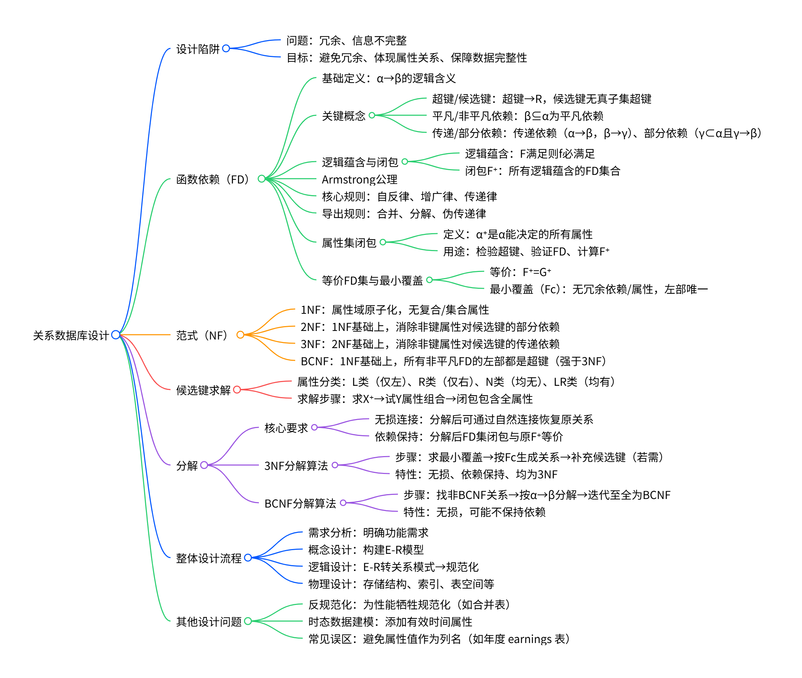

# 关系数据库设计（Relational Database Design）知识大纲

## 思维导图


---

## 一、关系数据库设计中的问题（Pitfalls in Relational Database Design）

### 1. 不良设计的后果

在关系数据库设计过程中，若未遵循规范化原则或对数据语义理解不足，可能导致关系模式结构不合理，从而引发两类典型问题：

#### （1）信息重复（冗余，Redundancy）
- **表现形式**：相同的数据值在多个元组中重复出现。
  - 例如，将教师（instructor）和院系（department）信息合并为一个关系模式 `inst_dept(ID, name, salary, dept_name, building, budget)`。由于一个院系可能有多个教师，该院系的 `building` 和 `budget` 信息会在每个属于该部门的教师记录中重复存储。
- **负面影响**：
  - **浪费存储空间**：大量重复数据占用不必要的磁盘资源；
  - **更新异常（Update Anomalies）**：当院系信息（如预算）发生变化时，必须修改所有相关元组，否则会导致数据不一致；
  - **插入/删除异常**：若某院系暂时没有教师，则无法单独插入该部门的信息；反之，若删除某院系最后一名教师，可能意外丢失整个部门的信息。

#### （2）无法表示某些信息（不完整性，Incompleteness）
- **表现形式**：某些现实世界中的合法事实无法在当前关系模式中被有效表达。
  - 经典例子：假设将贷款（loan）与分行（branch）信息合并为一个关系 `loan_branch(loan_number, amount, branch_name, branch_city, assets)`。若某个分行尚未发放任何贷款，则该分行的 `branch_city` 和 `assets` 等信息无法被记录，因为缺少主键（如 `loan_number`）来标识元组。
- **根本原因**：关系模式强制要求所有属性共存于同一元组中，而现实中某些实体的存在并不依赖于其他实体。
- **后果**：数据库无法完整反映业务现实，限制了数据的表达能力和查询范围。

---

### 2. 关系数据库设计的目标

为了避免上述问题，关系数据库设计应追求以下三个核心目标：

#### （1）避免冗余数据（Minimize Redundancy）
- 通过合理分解关系模式，确保每条信息只存储一次；
- 减少因重复存储导致的存储开销和维护成本；
- 从根本上消除更新异常的可能性。

#### （2）确保属性间语义关系被正确表示（Preserve Semantic Relationships）
- 数据库结构应准确反映现实世界中实体与属性之间的依赖关系；
- 利用函数依赖等工具显式刻画属性间的逻辑关联；
- 保证即使在分解后，原始语义关系仍可通过连接操作或依赖约束得以恢复或验证。

#### （3）便于检查更新是否违反完整性约束（Facilitate Integrity Constraint Checking）
- 良好的设计应使完整性约束（如函数依赖）局部化到单个关系模式中；
- 这样在执行插入、更新或删除操作时，只需检查涉及的关系，无需跨表验证；
- 若设计不当（如依赖被“拆散”到多个表中），则难以高效验证约束，甚至无法在SQL层面直接表达（因SQL仅原生支持主键、外键等超键类约束，不直接支持一般函数依赖）。

---

综上，关系数据库设计的核心挑战在于：**如何在消除冗余、保持语义完整性和支持高效约束检查之间取得平衡**。这正是规范化理论（如函数依赖、范式、分解等）要解决的问题。

---

## 二、函数依赖（Functional Dependencies）

### 1. 基本定义与性质

#### **函数依赖的定义**
- **形式化定义**：设关系模式为 \( R \)，\( \alpha \subseteq R \)，\( \beta \subseteq R \)。若对任意合法关系实例 \( r(R) \) 中任意两个元组 \( t_1, t_2 \)，只要它们在属性集 \( \alpha \) 上的值相同（即 \( t_1[\alpha] = t_2[\alpha] \)），那么它们在 \( \beta \) 上的值也必然相同（即 \( t_1[\beta] = t_2[\beta] \)），则称函数依赖 \( \alpha \rightarrow \beta \) 在 \( R \) 上成立。

- **通俗理解**：一旦知道 \( \alpha \) 的值，就能唯一确定 \( \beta \) 的值。

- **例子**：
  考虑关系模式 `Student(SID, Name, Dept, Dean)`，其中：
  - 每个学生有唯一学号 `SID`；
  - 每个院系有唯一院长 `Dean`。
  
  则存在以下函数依赖：
  - `SID → Name`（学号唯一确定姓名）
  - `SID → Dept`（学号确定所属院系）
  - `Dept → Dean`（院系唯一确定院长）

  注意：`SID → Dean` 虽未直接给出，但可通过传递性推导得出。

#### **平凡依赖（Trivial Dependency）**
- **定义**：若 \( \beta \subseteq \alpha \)，则 \( \alpha \rightarrow \beta \) 恒成立，称为平凡依赖。
- **原因**：一个元组在 \( \alpha \) 上相等，自然在其子集 \( \beta \) 上也相等。
- **例子**：
  - `{SID, Name} → SID` 是平凡依赖；
  - `Name → Name` 也是平凡依赖。
- **意义**：平凡依赖总是成立，无需特别关注，规范化中主要处理非平凡依赖。

---

### 2. 函数依赖类型

#### **部分依赖（Partial Dependency）**
- **定义**：若 \( \alpha \rightarrow \beta \)，且存在真子集 \( \gamma \subset \alpha \) 使得 \( \gamma \rightarrow \beta \)，则称 \( \beta \) **部分依赖**于 \( \alpha \)。
- **关键点**：\( \beta \) 并不依赖于整个 \( \alpha \)，只依赖其中一部分。

- **例子**：
  考虑关系 `Enrollment(SID, CID, Grade, SName, CTitle)`，其中：
  - `(SID, CID)` 是主键（唯一标识一次选课）；
  - `SID → SName`（学号决定姓名）；
  - `CID → CTitle`（课程号决定课程名）。

  此时：
  - `SName` 部分依赖于主键 `(SID, CID)`，因为仅靠 `SID` 就能确定 `SName`；
  - 同理，`CTitle` 也部分依赖于 `(SID, CID)`。

  这种部分依赖会导致冗余：每次记录选课都要重复存储学生姓名和课程名称。

#### **传递依赖（Transitive Dependency）**
- **定义**：若 \( \alpha \rightarrow \beta \)，\( \beta \rightarrow \gamma \)，且 \( \beta \not\subseteq \alpha \)、\( \beta \not\rightarrow \alpha \)（即 \( \alpha \) 和 \( \beta \) 不等价），则称 \( \gamma \) **传递依赖**于 \( \alpha \)。

- **例子**：
  关系 `Employee(EID, Dept, Budget)`，假设：
  - `EID → Dept`（员工属于某个部门）；
  - `Dept → Budget`（每个部门有固定预算）。

  则 `EID → Budget` 成立，但这是通过 `Dept` 间接决定的，即：
  - `EID → Dept → Budget`
  - 且 `Dept` 不能反推 `EID`（一个部门有多个员工）

  因此，`Budget` 传递依赖于 `EID`。这会导致更新异常：若某部门预算变化，需更新该部门所有员工记录。

---

### 3. Armstrong 公理系统（推理规则）

Armstrong 公理是推导函数依赖的三大基本规则，具有**可靠性**（只推出正确依赖）和**完备性**（能推出所有逻辑蕴含的依赖）。

#### （1）自反律（Reflexivity）
- **规则**：若 \( \beta \subseteq \alpha \)，则 \( \alpha \rightarrow \beta \)。
- **例子**：`{A, B} → A` 恒成立。

#### （2）增广律（Augmentation）
- **规则**：若 \( \alpha \rightarrow \beta \)，则对任意 \( \gamma \)，有 \( \alpha\gamma \rightarrow \beta\gamma \)。
- **例子**：已知 `SID → Name`，则 `{SID, CID} → {Name, CID}` 也成立。

#### （3）传递律（Transitivity）
- **规则**：若 \( \alpha \rightarrow \beta \)，\( \beta \rightarrow \gamma \)，则 \( \alpha \rightarrow \gamma \)。
- **例子**：`SID → Dept`，`Dept → Dean` ⇒ `SID → Dean`

> **补充规则（由公理推导）**：
> - **合并律（Union）**：若 \( \alpha \rightarrow \beta \) 且 \( \alpha \rightarrow \gamma \)，则 \( \alpha \rightarrow \beta\gamma \)
> - **分解律（Decomposition）**：若 \( \alpha \rightarrow \beta\gamma \)，则 \( \alpha \rightarrow \beta \) 且 \( \alpha \rightarrow \gamma \)

---

### 4. 属性闭包（Closure of Attribute Sets）

#### **定义**
给定属性集 \( \alpha \) 和函数依赖集 \( F \)，\( \alpha^+ \) 表示在 \( F \) 下能被 \( \alpha \) 函数决定的所有属性的集合。

#### **计算算法（举例说明）**
设关系模式 \( R(A, B, C, G, H, I) \)，函数依赖集：
\[
F = \{ A \rightarrow B,\ A \rightarrow C,\ CG \rightarrow H,\ CG \rightarrow I,\ B \rightarrow H \}
\]

求 \( (AG)^+ \)：
1. `result = {A, G}`
2. 应用 `A → B` 和 `A → C` → `result = {A, B, C, G}`
3. 因 `CG ⊆ result`，应用 `CG → H` → `result = {A, B, C, G, H}`
4. 再应用 `CG → I` → `result = {A, B, C, G, H, I}`

最终：\( (AG)^+ = \{A, B, C, G, H, I\} \)

#### **用途**
- **判断超键**：若 \( \alpha^+ \) 包含 \( R \) 的所有属性，则 \( \alpha \) 是超键。
  - 上例中，`AG` 是超键。
- **验证依赖**：要检查 `A → H` 是否成立？只需看 `H ∈ A⁺`。
  - `A⁺ = {A, B, C, H, I}`（通过 `A→B`, `B→H`, `A→C`, `CG→I` 但缺 G，故无法得 I？实际上需重新计算：`A⁺ = {A,B,C,H}`，因无 G 无法触发 `CG→I`）
  - 但 `A→B`, `B→H` ⇒ `A→H` 成立。

---

### 5. 函数依赖集闭包（\( F^+ \)）

- **定义**：\( F^+ \) 是从 \( F \) 出发，利用 Armstrong 公理能推导出的所有函数依赖的集合。
- **例子**：若 \( F = \{A \rightarrow B, B \rightarrow C\} \)，则 \( F^+ \) 包含：
  - `A → B`, `B → C`（原始）
  - `A → C`（传递律）
  - `A → AB`, `AB → ABC`（增广+合并）
  - 所有平凡依赖如 `A → A` 等
- **注意**：\( F^+ \) 可能非常大，实际中通常不显式计算全部，而是按需推导。

---

### 6. 等价函数依赖集

- **定义**：若两个函数依赖集 \( F \) 和 \( G \) 满足 \( F^+ = G^+ \)，则称它们等价。
- **例子**：
  - \( F = \{A \rightarrow B, B \rightarrow C\} \)
  - \( G = \{A \rightarrow B, A \rightarrow C, B \rightarrow C\} \)
  - 虽然 \( G \) 多了一个依赖，但 `A → C` 可由 \( F \) 推出，因此 \( F^+ = G^+ \)，二者等价。

---

### 7. 最小覆盖（Canonical Cover）

目标：找到与原依赖集等价、但无冗余的最简形式。

#### **无关属性识别**

- **左部无关**：
  - 例：\( F = \{A \rightarrow C, AB \rightarrow C\} \)
  - 在 `AB → C` 中，`B` 是无关的，因为 `A → C` 已存在，`A⁺ = {A, C}` 包含 `C`。
  - 可简化为 `A → C`。

- **右部无关**：
  - 例：\( F = \{A \rightarrow BC, B \rightarrow C\} \)
  - 在 `A → BC` 中，`C` 是无关的，因为即使去掉 `C`，仍有 `A → B`，再结合 `B → C` 可推出 `A → C`。
  - 故最小覆盖为 `{A → B, B → C}`。

#### **构造算法示例**
设 \( F = \{A \rightarrow BC, B \rightarrow C, A \rightarrow B, AB \rightarrow C\} \)

步骤：
1. 合并：`A → BC` 和 `A → B` 合并为 `A → BC`
2. 检查 `AB → C`：因 `B → C`，`B⁺ = {B, C}` 包含 `C`，故 `A` 在左部无关 → 删除 `A`，得 `B → C`（已存在）
3. 检查 `A → BC`：尝试移除 `C`，得 `A → B`；此时 `A⁺ = {A, B, C}`（因 `B → C`），包含 `C`，故 `C` 在右部无关
4. 最终最小覆盖：`{A → B, B → C}`

---

### 8. 候选键的求解方法（带例子）

#### **属性分类法**
给定 \( R(U, F) \)，将属性分为四类：

| 类型 | 特征 | 必在候选键中？ |
|------|------|----------------|
| L类 | 仅出现在 FD 左部 | 是 |
| R类 | 仅出现在 FD 右部 | 否 |
| N类 | 未出现在任何 FD 中 | 是 |
| LR类 | 左右部均出现 | 可能 |

#### **例子1**：\( R(A,B,C,D) \)，\( F = \{B \rightarrow D, AB \rightarrow C\} \)

- L类：A, B（A 只在 AB→C 左部，B 在 B→D 和 AB→C 左部）
- R类：C, D
- N类：无
- LR类：无

→ \( X = L \cup N = \{A, B\} \)

计算 \( (AB)^+ \)：
- 初始：{A, B}
- 用 `AB → C` → {A, B, C}
- 用 `B → D` → {A, B, C, D} = 全属性

✅ 所以候选键为 **AB**

#### **例子2**：\( R(A,B,C,D,E) \)，\( F = \{AB \rightarrow CE, E \rightarrow AB, C \rightarrow D\} \)

- L类：无
- R类：D
- N类：无
- LR类：A, B, C, E

→ \( X = \emptyset \)，需从 LR 类组合

尝试单个属性：
- `E⁺ = E → AB → CE → D` → `E⁺ = {A,B,C,D,E}` = 全属性！

✅ 所以 **E 是候选键**

再试其他组合（如 AB）：
- `AB⁺ = AB → CE → D` → 全属性，所以 **AB 也是候选键**

最终候选键：**E, AB**

> 注：因 `E ↔ AB`（互相决定），两者都是候选键。

---

## 三、规范化形式（Normal Forms）

规范化是通过逐步消除数据冗余和更新异常，将关系模式分解为更“良好”结构的过程。从 1NF 到 BCNF，要求逐级增强。

---

### 1. 第一范式（1NF）

#### **定义**
关系模式 \( R \) 属于第一范式（1NF），当且仅当其**所有属性的域都是原子的**（atomic），即每个属性值是不可再分的最小单位。

#### **关键点**
- “原子”意味着不能是集合、数组、嵌套记录等复合结构。
- 1NF 是关系模型的基本前提，几乎所有现代 DBMS 都强制满足 1NF。

#### **非原子示例（违反 1NF）**
假设有一个学生表：
```text
Student(SID, Name, Courses)
```
其中 `Courses` 存储该学生选修的所有课程，如 `"CS101, CS202, MATH301"`。

- **问题**：
  - 无法直接查询“选了 CS101 的学生”；
  - 更新某门课程困难（需解析字符串）；
  - 违反关系模型的基本假设。

#### **修正方式（转为 1NF）**
将多值属性拆分为独立元组：
```text
StudentCourse(SID, CourseID)
```
每行只记录一个学生-课程对，确保所有属性原子。

✅ 此时关系满足 1NF。

---

### 2. 第二范式（2NF）

#### **前提**
关系必须先满足 1NF。

#### **定义**
关系模式 \( R \) 属于第二范式（2NF），当且仅当**每个非主属性都完全函数依赖于每一个候选键**，即**不存在对候选键的部分依赖**。

> **非主属性**：不属于任何候选键的属性。  
> **完全函数依赖**：非主属性依赖于整个候选键，而非其真子集。

#### **等价表述**
对于任意函数依赖 \( \alpha \rightarrow A \)，若 \( A \) 是非主属性，则 \( \alpha \) 必须包含某个候选键（即不能是候选键的真子集）。

#### **例子：违反 2NF**
考虑选课关系：
```text
Enrollment(SID, CID, SName, CTitle, Grade)
```
- 候选键：`(SID, CID)`（学号+课程号唯一标识一次选课）
- 非主属性：`SName`, `CTitle`, `Grade`

函数依赖：
- `SID → SName`（学号决定姓名）
- `CID → CTitle`（课程号决定课程名）
- `(SID, CID) → Grade`

**问题分析**：
- `SName` 仅依赖于 `SID`（候选键的一部分），属于**部分依赖**；
- 同理，`CTitle` 也部分依赖于 `(SID, CID)`。

**后果**：
- 每次记录选课都要重复存储学生姓名和课程名称 → 冗余；
- 若学生改名，需更新所有相关选课记录 → 更新异常。

#### **如何达到 2NF？**
分解为三个关系：
```text
Student(SID, SName)
Course(CID, CTitle)
Enrollment(SID, CID, Grade)
```
- 在 `Student` 中，`SID` 是候选键，`SName` 完全依赖于它；
- 在 `Course` 中，`CID` 是候选键，`CTitle` 完全依赖于它；
- 在 `Enrollment` 中，`(SID, CID)` 是候选键，`Grade` 完全依赖于整个键。

✅ 所有关系均满足 2NF。

---

### 3. 第三范式（3NF）

#### **前提**
关系必须先满足 2NF。

#### **定义**
关系模式 \( R \) 属于第三范式（3NF），当且仅当**不存在非主属性对候选键的传递依赖**。

> **传递依赖**：若 `A → B`，`B → C`，且 `B` 不决定 `A`，则 `C` 传递依赖于 `A`。

#### **形式化条件（更通用）**
对 \( F^+ \) 中任意函数依赖 \( \alpha \rightarrow \beta \)，至少满足以下之一：
1. \( \beta \subseteq \alpha \)（平凡依赖）；
2. \( \alpha \) 是超键；
3. \( \beta - \alpha \) 中的**每个属性都属于某个候选键**（即都是主属性）。

> 注意：第 3 条允许主属性之间的依赖，这是 3NF 与 BCNF 的关键区别。

#### **例子：满足 2NF 但违反 3NF**
考虑关系：
```text
DeptInfo(SID, Dept, Budget)
```
- 候选键：`SID`
- 函数依赖：
  - `SID → Dept`
  - `Dept → Budget`

**分析**：
- `Budget` 是非主属性；
- `SID → Dept → Budget`，且 `Dept` 不能反推 `SID`（一个部门有多个员工）；
- 因此 `Budget` **传递依赖**于候选键 `SID`。

**后果**：
- 若某部门预算变更，需更新该部门所有员工记录 → 更新异常。

#### **如何达到 3NF？**
分解为：
```text
Employee(SID, Dept)
Department(Dept, Budget)
```
- `Employee` 中 `SID → Dept`，无传递依赖；
- `Department` 中 `Dept → Budget`，`Dept` 是候选键。

✅ 两个关系均满足 3NF。

#### **3NF 的优势**
- 消除传递依赖导致的冗余；
- 允许某些“合理”的依赖（如主属性间的依赖），比 BCNF 更宽松，更容易实现**依赖保持**。

---

### 4. Boyce-Codd 范式（BCNF）

#### **前提**
只需满足 1NF（实际上 BCNF 比 3NF 更强，自动满足 3NF）。

#### **定义**
关系模式 \( R \) 属于 BCNF，当且仅当对 \( F^+ \) 中**每一个非平凡函数依赖** \( \alpha \rightarrow \beta \)，**\( \alpha \) 必须是超键**。

> 换句话说：**任何决定其他属性的属性集，本身必须能唯一标识元组**。

#### **与 3NF 的区别**
- 3NF 允许非超键决定**主属性**；
- BCNF **不允许任何非超键决定任何属性**（包括主属性）。

#### **经典例子：满足 3NF 但违反 BCNF**
考虑关系：
```text
Teaching(Prof, Course, Room)
```
语义：每位教授在特定教室讲授特定课程，且：
- 每位教授只在一个教室授课（`Prof → Room`）；
- 每门课程只由一位教授讲授（`Course → Prof`）。

函数依赖：
- `Prof → Room`
- `Course → Prof`
- 推出：`Course → Room`

候选键：`Course`（因为 `Course → Prof → Room`，可决定全部属性）

**检查 3NF**：
- `Prof → Room`：`Room` 是非主属性，`Prof` 不是超键；
  - 但 `Room` 是否属于候选键？否。
  - 然而，是否存在传递依赖？`Course → Prof → Room`，是传递依赖？
  - 实际上，由于 `Course` 是唯一候选键，`Prof` 和 `Room` 都是非主属性。
  - `Prof → Room` 中，`Prof` 不是超键，且 `Room` 不在候选键中 → **违反 3NF？**

> 更准确的例子如下：

##### 更清晰的 BCNF 反例：
关系：`R(J, K, L)`，函数依赖：
- `JK → L`
- `L → K`

候选键：`{J, K}` 和 `{J, L}`（因为 `L → K`，所以 `JL → JK → L`）

现在看依赖 `L → K`：
- `L` 不是超键（`L⁺ = {L, K} ≠ {J, K, L}`）；
- 但 `K` 是主属性（属于候选键 `{J, K}`）。

→ **满足 3NF**（因为 `K` 是主属性），  
→ **违反 BCNF**（因为 `L` 不是超键，却决定了 `K`）。

**问题表现**：
| J  | K  | L  |
|----|----|----|
| j1 | k1 | l1 |
| j2 | k1 | l1 |
| j3 | k1 | l1 |

- `L = l1` 总对应 `K = k1`，但若想插入 `(j4, k2, l1)`，会违反 `L → K`；
- 或者，若删除前两行，`l1 → k1` 的信息就丢失了 → **删除异常**。

#### **如何达到 BCNF？**
分解为：
```text
R1(L, K)   -- 满足 L → K，L 是候选键
R2(J, L)   -- 原始依赖 JK → L 在投影后变为 JL → ?，但实际只需保留 J 和 L
```
验证：
- `R1`：`L → K`，`L` 是超键 → BCNF；
- `R2`：无非平凡依赖 → BCNF。

✅ 分解后满足 BCNF。

#### **BCNF 测试方法**
给定关系 \( R \) 和函数依赖集 \( F \)：
1. 对每个 \( \alpha \rightarrow \beta \in F \)（或 \( F^+ \)）：
   - 计算 \( \alpha^+ \)；
   - 若 \( \alpha^+ \) 包含 \( R \) 的所有属性，则 \( \alpha \) 是超键，不违反 BCNF；
   - 否则，违反 BCNF。
2. **注意**：在分解后的子模式中测试时，必须考虑原始 \( F \) 在该子模式上的**所有逻辑蕴含依赖**，而不仅是 \( F \) 中直接出现的依赖。

> 例如：\( R(A,B,C,D) \)，\( F = \{A → B, BC → D\} \)，分解为 \( R_2(A,C,D,E) \)（假设 E 为笔误，应为其他属性），虽然 \( F \) 中无依赖涉及 \( A,C,D \)，但可能有隐含依赖如 \( AC → D \)（若存在其他路径），需用属性闭包仔细验证。

---

### 总结对比

| 范式 | 核心要求 | 允许的依赖 | 是否消除冗余 | 是否总能依赖保持 |
|------|--------|-----------|-------------|----------------|
| 1NF | 属性原子 | 任意 | 否 | — |
| 2NF | 无部分依赖 | 非主属性必须完全依赖候选键 | 部分 | 是 |
| 3NF | 无传递依赖 | 非主属性不能传递依赖候选键；主属性间可依赖 | 大部分 | **是**（可通过算法保证） |
| BCNF | 任何决定因素必须是超键 | **只有超键能决定其他属性** | 几乎全部 | **否**（可能丢失依赖） |

> **设计建议**：
> - 优先尝试达到 **3NF**（兼顾无冗余与依赖保持）；
> - 若业务对一致性要求极高，且可接受复杂应用逻辑，则追求 **BCNF**；
> - 实际系统中，3NF 已能满足绝大多数场景需求。

---

## 四、关系分解（Decomposition）

关系分解是将一个“不良”设计的关系模式 \( R \) 拆分为多个更小、结构更优的关系模式 \( R_1, R_2, \dots, R_n \)，以消除冗余和更新异常。但分解必须满足若干关键性质，否则会引入新问题。

---

### 1. 分解的基本要求

#### （1）属性保留（Attribute Preservation）
- **要求**：所有原始属性必须出现在至少一个子模式中，即  
  \[
  R = R_1 \cup R_2 \cup \dots \cup R_n
  \]
- **意义**：不能丢失任何属性信息。
- **例子**：  
  若 \( R(A,B,C) \) 被分解为 \( R_1(A,B) \) 和 \( R_2(B,C) \)，则 \( A,B,C \) 全部保留 ✅；  
  若分解为 \( R_1(A,B) \) 和 \( R_2(A) \)，则 \( C \) 丢失 ❌。

#### （2）无损连接（Lossless-join Decomposition）
- **定义**：对任意合法关系实例 \( r(R) \)，将其投影到各子模式后再自然连接，能**完全恢复**原关系，即  
  \[
  r = \pi_{R_1}(r) \bowtie \pi_{R_2}(r) \bowtie \dots \bowtie \pi_{R_n}(r)
  \]
- **重要性**：若非无损连接，分解后无法还原原始数据，导致**信息丢失**。
- **反例（有损分解）**：  
  设 \( R(\text{SNO}, \text{DEPT}, \text{HEAD}) \)，函数依赖：  
  - `SNO → DEPT`  
  - `DEPT → HEAD`

  错误分解：  
  - \( R_1(\text{SNO}) \)  
  - \( R_2(\text{DEPT}) \)  
  - \( R_3(\text{HEAD}) \)

  投影后：
  | SNO |   | DEPT |   | HEAD |
  |-----|---|------|---|------|
  | s1  |   | d1   |   | h1   |

  连接结果会生成笛卡尔积：(s1,d1,h1), (s1,d1,h2)... 即使原表只有一行，也可能产生多行 ❌。

#### （3）依赖保持（Dependency Preservation）
- **定义**：分解后，所有原始函数依赖仍能在子模式中被“验证”或“强制执行”，形式化为：  
  \[
  (F_1 \cup F_2 \cup \dots \cup F_n)^+ = F^+
  \]
  其中 \( F_i \) 是 \( F^+ \) 中仅涉及 \( R_i \) 属性的依赖。
- **意义**：若依赖未被保持，则无法在单个表中通过约束（如唯一性、外键）保证数据一致性，需应用层维护，易出错。
- **例子**：  
  \( R(\text{SNO}, \text{DEPT}, \text{HEAD}) \)，\( F = \{\text{SNO} \rightarrow \text{DEPT},\ \text{DEPT} \rightarrow \text{HEAD}\} \)

  分解方案 A（依赖保持）：
  - \( R_1(\text{SNO}, \text{DEPT}) \)，\( F_1 = \{\text{SNO} \rightarrow \text{DEPT}\} \)
  - \( R_2(\text{DEPT}, \text{HEAD}) \)，\( F_2 = \{\text{DEPT} \rightarrow \text{HEAD}\} \)
  - \( F_1 \cup F_2 = F \) ⇒ 依赖保持 ✅

  分解方案 B（不依赖保持）：
  - \( R_1(\text{SNO}, \text{DEPT}) \)
  - \( R_2(\text{SNO}, \text{HEAD}) \)
  - 此时 `DEPT → HEAD` 无法在任一表中表达（因 `DEPT` 和 `HEAD` 不在同一表）  
  - 虽可通过 `SNO → HEAD` 间接推导，但**原始依赖丢失**，无法直接约束 `DEPT → HEAD` ❌

---

### 2. 无损连接判定（二元分解）

#### **判定定理**
将 \( R \) 分解为 \( R_1 \) 和 \( R_2 \)，当且仅当以下之一成立时，分解是无损连接：
- \( R_1 \cap R_2 \rightarrow R_1 \in F^+ \)
- \( R_1 \cap R_2 \rightarrow R_2 \in F^+ \)

> 即：**公共属性集能决定其中一个子模式的所有属性**。

#### **例子**
设 \( R(A,B,C) \)，\( F = \{A \rightarrow B,\ B \rightarrow C\} \)

分解为：
- \( R_1(A,B) \)
- \( R_2(B,C) \)

计算交集：\( R_1 \cap R_2 = \{B\} \)

检查：
- \( B \rightarrow R_1 = \{A,B\} \)？  
  \( B^+ = \{B, C\} \)（由 \( B \rightarrow C \)），不包含 \( A \) → 否 ❌
- \( B \rightarrow R_2 = \{B,C\} \)？  
  \( B^+ = \{B, C\} \) → 是 ✅

✅ 所以该分解是**无损连接**。

> 实际上，这是典型的 3NF 分解，既无损又依赖保持。

---

### 3. 依赖保持判定（算法）

#### **目标**
判断某个函数依赖 \( \alpha \rightarrow \beta \in F \) 是否在分解 \( \{R_1, \dots, R_n\} \) 中被保持。

#### **算法步骤**
1. `result = α`
2. 重复以下操作直到 `result` 不再变化：
   - 对每个子模式 \( R_i \)：
     - 计算 `temp = (result ∩ R_i)^+ ∩ R_i`（即在 \( R_i \) 内由当前 result 能推导出的属性）
     - `result = result ∪ temp`
3. 若最终 `result` 包含 \( \beta \)，则该依赖被保持。

#### **例子**
\( R(\text{SNO}, \text{DEPT}, \text{HEAD}) \)，\( F = \{\text{SNO} \rightarrow \text{DEPT},\ \text{DEPT} \rightarrow \text{HEAD}\} \)

分解：  
- \( R_1(\text{SNO}, \text{DEPT}) \)  
- \( R_2(\text{SNO}, \text{HEAD}) \)

检查依赖 `DEPT → HEAD` 是否被保持：

1. `result = {DEPT}`
2. 遍历子模式：
   - \( R_1 \): `result ∩ R_1 = {DEPT}`，在 \( R_1 \) 中 `DEPT⁺ = {DEPT}`（因 \( R_1 \) 中只有 `SNO→DEPT`，无法反推），所以 `temp = {DEPT}`
   - \( R_2 \): `result ∩ R_2 = ∅`，`∅⁺ = ∅`，`temp = ∅`
   - `result` 仍为 `{DEPT}`
3. 无法得到 `HEAD`

❌ 所以 `DEPT → HEAD` **未被保持**。

---

### 4. 3NF 分解算法

#### **目标**
将关系 \( R \) 分解为一组满足 3NF 的子模式，同时保证**无损连接**和**依赖保持**。

#### **算法步骤（带例子）**

**输入**：  
- \( R(A,B,C,D) \)  
- \( F = \{A \rightarrow B,\ B \rightarrow C,\ A \rightarrow D\} \)

**步骤**：
1. **求最小覆盖 \( F_c \)**：
   - 合并：`A → B`, `A → D` → `A → BD`
   - 检查冗余：`B → C` 无法由其他推出
   - 最小覆盖：\( F_c = \{A \rightarrow BD,\ B \rightarrow C\} \)

2. **为每个依赖创建模式**：
   - `A → BD` → 创建 \( R_1(A,B,D) \)
   - `B → C` → 创建 \( R_2(B,C) \)

3. **检查是否包含候选键**：
   - 候选键：`A`（因为 `A⁺ = {A,B,C,D}`）
   - \( R_1 \) 包含 `A` → 已覆盖候选键

**输出**：\( \{R_1(A,B,D),\ R_2(B,C)\} \)

**验证**：
- **3NF**：  
  - \( R_1 \)：`A` 是候选键，`B,D` 完全依赖 → 3NF  
  - \( R_2 \)：`B` 是候选键，`C` 完全依赖 → 3NF
- **无损连接**：  
  - \( R_1 \cap R_2 = \{B\} \)，且 `B → C` ∈ F⁺ ⇒ `B → R_2` → 无损 ✅
- **依赖保持**：  
  - `A → BD` 在 \( R_1 \) 中，`B → C` 在 \( R_2 \) 中 → 保持 ✅

---

### 5. BCNF 分解算法

#### **目标**
将关系分解为 BCNF 子模式，保证**无损连接**，但**不保证依赖保持**。

#### **算法步骤（带例子）**

**输入**：  
- \( R(\text{Prof}, \text{Course}, \text{Room}) \)  
- \( F = \{\text{Prof} \rightarrow \text{Room},\ \text{Course} \rightarrow \text{Prof}\} \)

**步骤**：
1. `result = {R}`

2. **检查 R 是否在 BCNF**：
   - 候选键：`Course`（因为 `Course → Prof → Room`）
   - 依赖 `Prof → Room`：`Prof` 不是超键（`Prof⁺ = {Prof, Room} ≠ 全属性`）→ 违反 BCNF

3. **分解**：
   - 取违反依赖 `Prof → Room`
   - 创建两个新模式：
     - \( R_1(\text{Prof}, \text{Room}) \)（即 \( \alpha \cup \beta \)）
     - \( R_2(\text{Prof}, \text{Course}) \)（即 \( R - \beta = \{Prof, Course\} \)）

4. **递归检查子模式**：
   - \( R_1 \)：`Prof → Room`，`Prof` 是候选键 → BCNF ✅
   - \( R_2 \)：`Course → Prof`，`Course` 是候选键 → BCNF ✅

**输出**：\( \{R_1(\text{Prof}, \text{Room}),\ R_2(\text{Course}, \text{Prof})\} \)

**验证**：
- **BCNF**：两个子模式都满足 ✅
- **无损连接**：  
  - \( R_1 \cap R_2 = \{\text{Prof}\} \)  
  - 在 \( R_1 \) 中 `Prof → Room` ⇒ `Prof → R_1` → 无损 ✅
- **依赖保持**？  
  - 原始依赖：`Prof → Room`（在 \( R_1 \) 中），`Course → Prof`（在 \( R_2 \) 中）→ **本例中恰好保持**  
  - 但**一般情况下不保证**！例如某些依赖可能被“拆散”而无法在任一子模式中表达。

#### **BCNF 与 3NF 的关键权衡**
| 性质 | 3NF 分解 | BCNF 分解 |
|------|--------|----------|
| 每个子模式满足范式 | ✅ 3NF | ✅ BCNF |
| 无损连接 | ✅ | ✅ |
| 依赖保持 | ✅（算法保证） | ❌（可能丢失） |

> **何时选择？**  
> - 若业务逻辑强依赖某些函数约束（如 `Dept → Budget` 必须强制），优先用 **3NF**；  
> - 若数据一致性要求极高，且可接受应用层维护部分约束，可用 **BCNF**。

---

### 总结

关系分解不是简单“拆表”，而是要在**消除冗余**、**避免信息丢失**和**保持语义约束**之间取得平衡。  
- **3NF 分解**是工程实践中的首选，因其兼顾理论与实用性；  
- **BCNF 分解**更“纯粹”，但可能牺牲依赖保持，需谨慎使用。  

理解这些概念和算法，是设计高质量关系数据库的核心能力。

---

## 五、整体数据库设计流程

数据库设计是一个系统化、分阶段的过程，目标是构建一个**结构合理、语义清晰、性能良好且易于维护**的数据存储系统。整个流程可分为四个主要阶段：

---

### 1. 设计阶段概述

#### （1）需求分析（Requirements Analysis）
- **目标**：明确用户和应用对数据的需求。
- **工作内容**：
  - 与业务方沟通，收集数据实体、属性、操作类型（增删改查）、查询频率、事务要求等；
  - 识别关键业务规则（如“一个学生最多选5门课”、“订单金额不能为负”）。
- **输出**：需求规格说明书（含数据字典初稿）。

> **例子**：  
> 在高校教务系统中，需明确：
> - 学生、教师、课程、成绩等实体；
> - “一门课程由一位教师授课”、“学生成绩必须在0~100之间”等约束。

#### （2）概念设计（Conceptual Design）—— E-R 模型
- **目标**：用**与DBMS无关**的方式描述数据结构和语义。
- **工具**：实体-联系图（E-R Diagram）。
- **核心元素**：
  - 实体（Entity）：如 Student、Course；
  - 属性（Attribute）：如 Student 的 SID、Name；
  - 联系（Relationship）：如 Enrolls（Student 与 Course 之间的选课关系）；
  - 基数约束（Cardinality）：如“一个学生可选多门课，一门课可被多个学生选”。

> **输出**：E-R 图，清晰表达业务语义。

#### （3）逻辑设计（Logical Design）
- **目标**：将 E-R 模型转换为**特定数据模型**（通常是关系模型），并进行规范化。
- **步骤**：
  1. 将实体、联系映射为关系模式；
  2. 分析函数依赖；
  3. 应用范式理论（如 3NF 或 BCNF）进行分解或调整。
- **关键问题**：是否需要进一步规范化？

> **输出**：一组满足范式的关系模式（表结构 + 主外键 + 函数依赖说明）。

#### （4）物理设计（Physical Design）
- **目标**：在特定 DBMS 上优化存储和访问效率。
- **工作内容**：
  - 选择存储引擎（如 InnoDB vs MyISAM）；
  - 创建索引（主键、唯一、复合索引）；
  - 分区（Partitioning）大表；
  - 决定是否使用物化视图、缓存等。
- **依据**：查询模式、数据量、更新频率。

> **注意**：物理设计可能**有意违反规范化**（即非规范化）以提升性能。

---

### 2. E-R 模型与规范化的关系

#### 理想情况
- 如果 E-R 模型设计得当（实体划分合理、联系建模准确），转换出的关系模式**天然接近 3NF 或 BCNF**，无需额外分解。
- **原因**：E-R 模型本身已将“独立事物”建模为实体，避免了属性间的隐含依赖。

#### 实际问题：建模疏漏导致冗余
- **常见错误**：将本应作为独立实体的属性直接嵌入另一实体。

> **反例**：  
> 关系 `employee(ID, name, dept_no, dept_addr)`  
> - 问题：`dept_no → dept_addr`（部门编号决定地址）  
> - 后果：若一个部门有100名员工，则 `dept_addr` 重复100次；若地址变更，需更新100行。

> **正确做法**（通过 E-R 模型修正）：
> - 将“部门”建模为独立实体；
> - 建立 `Employee` 与 `Department` 的“属于”联系；
> - 转换后得到两个关系：
>   ```text
>   Employee(ID, name, dept_no)
>   Department(dept_no, dept_addr)
>   ```
> - 此时无冗余，且 `dept_no` 作为外键引用 `Department`。

✅ **启示**：良好的概念设计可大幅减少后续规范化的工作量。

---

### 3. 性能与规范化的权衡（Denormalization）

尽管规范化能消除冗余和异常，但在高并发、复杂查询场景下，**过多的表连接会显著降低性能**。因此，有时需**有意识地引入冗余**——即“非规范化”（Denormalization）。

#### 动机
- 减少 JOIN 操作次数；
- 避免昂贵的聚合计算；
- 提升读取速度（尤其对报表、BI 类查询）。

#### 常见方法

##### （1）非规范化表（Denormalized Table）
- **做法**：将多个相关表合并为一个宽表，冗余存储部分字段。
- **例子**：
  - 规范化设计：
    ```text
    Orders(order_id, customer_id, order_date)
    Customers(customer_id, name, city)
    ```
  - 非规范化设计（用于订单报表）：
    ```text
    OrderSummary(order_id, customer_id, name, city, order_date)
    ```
  - 查询“某城市所有订单”时，无需 JOIN，直接扫描单表。

##### （2）物化视图（Materialized View）
- **做法**：预计算并存储复杂查询结果（如 JOIN + GROUP BY），定期刷新。
- **优点**：保持原始表规范化，同时提供高性能读取接口。
- **例子**：
  ```sql
  CREATE MATERIALIZED VIEW sales_by_region AS
  SELECT r.region_name, SUM(o.amount) AS total_sales
  FROM orders o
  JOIN customers c ON o.customer_id = c.id
  JOIN regions r ON c.region_id = r.id
  GROUP BY r.region_name;
  ```

#### 代价与风险
| 优势 | 代价 |
|------|------|
| 查询速度快 | 存储空间增加 |
| 简化查询逻辑 | 更新时需同步多个副本（一致性维护复杂） |
| 适合只读/低频更新场景 | 可能出现短暂数据不一致（最终一致性） |

> **最佳实践**：  
> - 核心交易系统保持规范化；  
> - 报表、分析系统使用非规范化或物化视图；  
> - 通过触发器、ETL 工具或应用层逻辑维护一致性。

---

### 4. 其他重要设计考量

#### （1）避免“年份列”反模式（Pivot Anti-pattern）
- **错误做法**：为每一年创建一个列。
  ```text
  CompanyEarnings(company_id, earnings_2020, earnings_2021, earnings_2022, ...)
  ```
- **问题**：
  - 无法动态支持新年度（需 ALTER TABLE）；
  - 无法高效查询“过去三年平均收益”；
  - 违反 1NF（时间维度被硬编码为属性）。

- **正确做法**：使用**行式存储时间序列数据**。
  ```text
  CompanyEarnings(company_id, year, amount)
  ```
  - 查询灵活：`SELECT AVG(amount) FROM ... WHERE year BETWEEN 2020 AND 2022`
  - 易于扩展：新增年份只需插入新行。

#### （2）时间数据建模（Temporal Data Modeling）
- **场景**：数据随时间变化，需记录历史状态。
  - 如：客户地址变更、员工薪资调整、产品价格波动。

- **挑战**：函数依赖可能仅在特定时间段成立。
  - 例如：`customer_id → address` 仅在 `[start_time, end_time)` 内有效。

- **解决方案**：引入**有效时间区间**
  ```text
  CustomerAddress(customer_id, address, start_time, end_time)
  ```
  - 约束：同一 `customer_id` 的时间区间不能重叠；
  - 查询“2023年1月客户的地址”：
    ```sql
    SELECT address
    FROM CustomerAddress
    WHERE customer_id = 123
      AND '2023-01-01' BETWEEN start_time AND end_time;
    ```

- **外键引用的特殊处理**
  - **问题**：成绩单应引用“课程开设时”的信息，而非当前信息。
    - 若课程名称后来修改，历史成绩单不应随之改变。
  - **解决**：
    - 在 `Enrollment` 表中冗余存储课程名称（非规范化）；
    - 或使用**版本化主键**（如 `course_id + version`）。

> **原则**：**历史数据应冻结，不随当前状态变化**。

---

### 总结：设计哲学

- **先规范，再优化**：优先保证数据完整性与一致性，再根据性能需求适度非规范化；
- **概念设计是关键**：花足够时间打磨 E-R 模型，可避免大量后期返工；
- **没有“完美”设计**：需在**一致性、性能、可维护性**之间动态权衡；
- **时间与变化是常态**：设计时要考虑数据如何随时间演进，而不仅是当前快照。

通过遵循这一系统化流程，并结合实际业务场景灵活调整，才能构建出既健壮又高效的数据库系统。

---

## 六、设计目标与原则总结

- **理想目标**：达到 **BCNF**，同时满足 **无损连接** 和 **依赖保持**；
- **现实妥协**：
  - 若无法同时满足三者，优先保证无损连接；
  - 接受 3NF 带来的少量冗余，以换取依赖保持；
  - 在高查询负载场景下，可适度非规范化以优化性能。
- **核心思想**：规范化是消除冗余和异常的理论工具，但数据库设计需结合业务需求、查询模式和维护成本进行综合权衡。