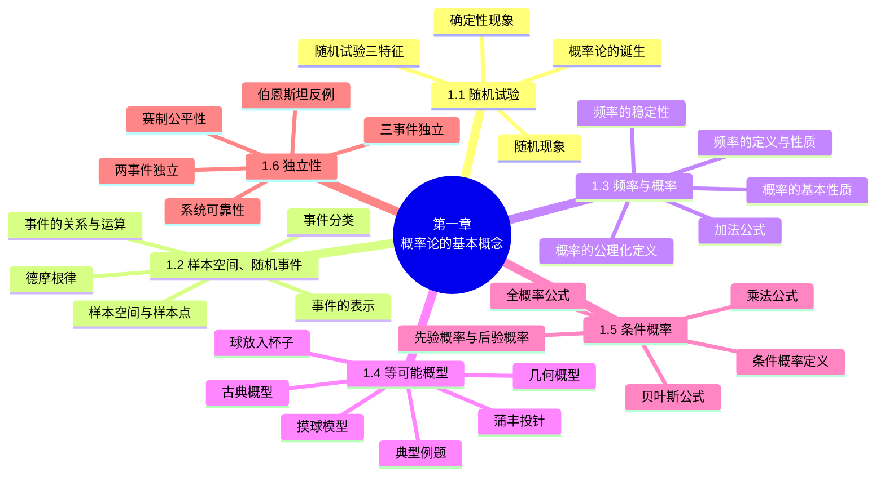

# 第一章 概率论的基本概念

> **本章主线**：从随机试验出发，用**样本空间**刻画随机现象的全部可能结果，用**随机事件**描述我们关心的部分结果；事件之间有包含、相等、并、交、差、互斥、对立等关系，并满足**德摩根律**。为了定量刻画"事件发生的可能性大小"，先用**频率**作统计经验，再经**公理化**定义出**概率**，并推出概率的基本性质。在等可能（古典、几何）概型下，概率可用"比值"计算；在部分信息已知（条件）下，引入**条件概率**、**乘法公式**、**全概率公式**与**贝叶斯公式**；最后讨论事件之间的**独立性**，把"互不影响"的直观转化为乘积公式，并用于系统可靠性、抽签公平性、赛制公平性等实际问题。

## 1.1 随机试验

### 1.1.1 概率论的诞生

**概率论**是研究随机现象统计规律性的学科。它起源于 17 世纪中叶，当时人们为回答赌博中提出的问题（如"分赌注问题"）而开始研究；经过几个世纪的发展，如今已广泛应用于自然科学、工程技术、经济管理、社会调查等各个领域，在通讯工程中概率论可用以提高信号的抗干扰能力，在自动控制、可靠性理论、人工智能等现代技术中更是不可或缺的数学工具。

### 1.1.2 确定性现象与随机现象

自然界和社会生活中观察到的现象，按其结果能否预先确定分为两类：

1. **确定性现象**：在一定条件下必然发生（或必然不发生）的现象。例如：
   - 向上抛一枚硬币，硬币必然下落；
   - 同性电荷必然相互排斥；
   - 标准大气压下，水加热到 $100^\circ\text{C}$ 时必然沸腾。
2. **随机现象**：在相同条件下重复试验，结果不止一个，且事先不能确定会出现哪一个结果的现象。例如：
   - 在相同条件下掷一枚均匀的硬币，观察可能出现的面，结果可能是正面，也可能是反面；
   - 用同一门炮向同一目标射击，观察弹落点的情况，弹落点会各不相同；
   - 抛掷一枚骰子，观察出现的点数，出现几点事先不能确定；
   - 从一批含有正品和次品的产品中任意抽取一件，抽到的是正品还是次品，事先不能确定。

> 对随机现象，一次观察的结果具有**偶然性**；但在相同条件下大量重复观察时，其结果会呈现出某种**统计规律性**，这种规律性称为**随机现象的统计规律性**。概率论正是研究随机现象统计规律性的一门数学学科。

### 1.1.3 随机试验的定义

具有以下三个特征的试验称为**随机试验**，记为 $E$：

1. **可在相同条件下重复进行**；
2. **试验的可能结果不止一个，并且能事先明确所有可能的结果**；
3. **进行一次试验之前不能确定哪一个结果会出现**。

> 本书以后提到的"试验"均指随机试验。随机试验的每一个可能结果称为一个**基本事件**（见 1.2 节）。

---

## 1.2 样本空间、随机事件

### 1.2.1 样本空间与样本点

**定义**：对于随机试验 $E$，尽管在每次试验之前不能预知试验的结果，但试验的**所有可能结果**组成的集合是已知的。称这个集合为**样本空间**，记为 $S$（或 $\Omega$）。样本空间的元素（即试验的每一个可能结果）称为**样本点**，记为 $e$。

**例 1** 写出下列随机试验的样本空间：

1. 抛掷一枚硬币，观察字面、花面出现的情况：$S = \{\text{字}, \text{花}\}$；
2. 抛掷一枚骰子，观察出现的点数：$S = \{1, 2, 3, 4, 5, 6\}$；
3. 从一批产品中依次任选三件，记录出现正品与次品的情况：$S = \{$由正品、次品组成的三位字母组合$\}$；
4. 记录某公共汽车站某日某时刻的等车人数：$S = \{0, 1, 2, \dots\}$；
5. 考察某地区 12 月份的平均气温：$S = \{t \mid t \text{ 为该地区 12 月可能的平均气温}\}$；
6. 从一批灯泡中任取一只，测试其寿命：$S = \{t \mid t \geq 0\}$，即 $[0, +\infty)$；
7. 记录某城市 120 急救电话台一昼夜接到的呼叫次数：$S = \{0, 1, 2, \dots\}$。

### 1.2.2 随机事件的定义与分类

**定义**：随机试验 $E$ 的**样本空间** $S$ 的**子集**称为 $E$ 的**随机事件**，简称**事件**。在每次试验中，当且仅当这一子集中的**一个**样本点出现时，称这一**事件发生**。

1. **基本事件**：由一个样本点组成的单点集。例如"出现 1 点"、"出现 2 点"等。
2. **复合事件**：由多个样本点组成的事件。例如"点数不大于 4"、"点数为偶数"等。
3. **必然事件**：样本空间 $S$ 本身（每次试验必然发生），如"点数不大于 6"。
4. **不可能事件**：空集 $\varnothing$（每次试验必不发生），如"点数大于 6"。

### 1.2.3 事件间的关系与运算

设试验 $E$ 的样本空间为 $S$，$A$、$B$、$A_k$（$k = 1, 2, \dots$）是 $E$ 的事件。

1. **包含关系** $A \subset B$：事件 $A$ 发生必导致事件 $B$ 发生。此时 $A$ 的样本点都包含于 $B$ 中。
2. **相等关系** $A = B$：$A \subset B$ 且 $B \subset A$（两个事件包含同样的样本点）。
3. **事件的和（并）** $A \cup B$：事件 $A \cup B$ 发生 $\iff$ $A$ 发生 **或** $B$ 发生（至少有一个发生）。类似地，$n$ 个事件的和 $\bigcup_{k=1}^{n} A_k$；可列个事件的和 $\bigcup_{k=1}^{\infty} A_k$。
4. **事件的积（交）** $A \cap B$（或 $AB$）：事件 $AB$ 发生 $\iff$ $A$ 发生 **且** $B$ 发生（同时发生）。类似地，$n$ 个事件的积 $\bigcap_{k=1}^{n} A_k$；可列个事件的积 $\bigcap_{k=1}^{\infty} A_k$。
5. **差事件** $A - B$：事件 $A - B$ 发生 $\iff$ $A$ 发生而 $B$ 不发生。
6. **互不相容（互斥）**：若 $AB = \varnothing$，称 $A$ 与 $B$ **互不相容**（两事件不能同时发生）。
7. **对立事件（逆事件）** $\bar{A}$：若 $AB = \varnothing$ 且 $A \cup B = S$，称 $A$ 与 $B$ 互为**对立事件**，$B$ 记作 $\bar{A}$。即 $\bar{A}$ 由 $S$ 中不属于 $A$ 的样本点组成。

> 注意：互不相容与对立不同——对立必互斥，但互斥不一定对立。两个互斥事件可以"都不发生"，而两个对立事件中必有一个发生且仅有一个发生。

**运算律**：

1. **交换律**：$A \cup B = B \cup A$，$AB = BA$；
2. **结合律**：$(A \cup B) \cup C = A \cup (B \cup C)$，$(AB)C = A(BC)$；
3. **分配律**：$A(B \cup C) = AB \cup AC$，$A \cup BC = (A \cup B)(A \cup C)$；
4. **德摩根律（对偶律）**：$\overline{A \cup B} = \bar{A} \cap \bar{B}$，$\overline{AB} = \bar{A} \cup \bar{B}$。

> 德摩根律可推广到任意多个事件：
> $$\overline{\bigcup_{k=1}^{n} A_k} = \bigcap_{k=1}^{n} \bar{A}_k, \qquad \overline{\bigcap_{k=1}^{n} A_k} = \bigcup_{k=1}^{n} \bar{A}_k$$
> 它的直观意义是："至少一个发生"的对立是"全都不发生"；"全都发生"的对立是"至少一个不发生"。

**集合与事件的对应关系**：

| 记号 | 概率论中的含义 | 集合论中的含义 |
| :--: | :-- | :-- |
| $S$ | 样本空间（必然事件） | 空间 |
| $\varnothing$ | 不可能事件 | 空集 |
| $e$ | 基本事件（样本点） | 元素 |
| $A$ | 随机事件 | 子集 |
| $\bar{A}$ | $A$ 的对立事件 | $A$ 的补集 |
| $A \subset B$ | 事件 $A$ 发生导致 $B$ 发生 | $A$ 是 $B$ 的子集 |
| $A = B$ | 事件 $A$ 与 $B$ 相等 | $A$ 与 $B$ 相等 |
| $A \cup B$ | 事件 $A$ 与 $B$ 至少一个发生 | $A$ 与 $B$ 的并集 |
| $A \cap B$ | 事件 $A$ 与 $B$ 同时发生 | $A$ 与 $B$ 的交集 |
| $A - B$ | 事件 $A$ 发生而 $B$ 不发生 | $A$ 与 $B$ 的差集 |
| $AB = \varnothing$ | 事件 $A$ 与 $B$ 互不相容 | $A$ 与 $B$ 不相交 |

### 1.2.4 事件的表示

**例 2** 设 $A$、$B$、$C$ 为三个事件，用 $A$、$B$、$C$ 的运算关系表示下列各事件：

1. $A$ 发生，$B$ 与 $C$ 不发生：$A\bar{B}\bar{C}$；
2. $A$ 与 $B$ 都发生，而 $C$ 不发生：$AB\bar{C}$；
3. 三个事件中至少有一个发生：$A \cup B \cup C$；
4. 三个事件中恰有一个发生：$A\bar{B}\bar{C} \cup \bar{A}B\bar{C} \cup \bar{A}\bar{B}C$；
5. 三个事件中至少有两个发生：$AB \cup AC \cup BC$；
6. 三个事件都不发生：$\bar{A}\bar{B}\bar{C}$；
7. 三个事件中不多于一个发生：$A\bar{B}\bar{C} \cup \bar{A}B\bar{C} \cup \bar{A}\bar{B}C \cup \bar{A}\bar{B}\bar{C}$；
8. 三个事件中不多于两个发生：$\overline{ABC}$（即 $\bar{A} \cup \bar{B} \cup \bar{C}$）；
9. 三个事件中恰有两个发生：$AB\bar{C} \cup A\bar{B}C \cup \bar{A}BC$；
10. 三个事件中至少一个不发生：$\bar{A} \cup \bar{B} \cup \bar{C}$。

**例 3** 设一个工人生产了四个零件，$A_i$ 表示他生产的第 $i$ 个零件是正品（$i = 1, 2, 3, 4$），试用 $A_i$ 表示下列各事件：

1. 没有一个是次品：$A_1 A_2 A_3 A_4$；
2. 至少有一个是次品：$\overline{A_1 A_2 A_3 A_4}$（即 $\bar{A}_1 \cup \bar{A}_2 \cup \bar{A}_3 \cup \bar{A}_4$）；
3. 只有一个是次品：$\bar{A}_1 A_2 A_3 A_4 \cup A_1 \bar{A}_2 A_3 A_4 \cup A_1 A_2 \bar{A}_3 A_4 \cup A_1 A_2 A_3 \bar{A}_4$；
4. 至少有三个不是次品：$A_1 A_2 A_3 A_4 \cup$（恰有一个次品的四种情形）；
5. 恰好有三个是次品：$A_1 \bar{A}_2 \bar{A}_3 \bar{A}_4 \cup \bar{A}_1 A_2 \bar{A}_3 \bar{A}_4 \cup \bar{A}_1 \bar{A}_2 A_3 \bar{A}_4 \cup \bar{A}_1 \bar{A}_2 \bar{A}_3 A_4$；
6. 至多有一个是次品：$A_1 A_2 A_3 A_4 \cup$（恰有一个次品的四种情形）。

---

## 1.3 频率与概率

### 1.3.1 频率的定义与性质

**定义**：在相同条件下进行 $n$ 次试验，若事件 $A$ 发生 $n_A$ 次，则称 $n_A$ 为事件 $A$ 发生的**频数**，比值

$$f_n(A) = \frac{n_A}{n}$$

称为事件 $A$ 在这 $n$ 次试验中发生的**频率**。

**频率的性质**：

1. $0 \leq f_n(A) \leq 1$；
2. $f_n(S) = 1$（必然事件在每次试验中都发生）；
3. 若 $A_1, A_2, \dots, A_k$ 是两两互不相容的事件，则
$$f_n\left(\bigcup_{i=1}^{k} A_i\right) = \sum_{i=1}^{k} f_n(A_i)$$

### 1.3.2 频率的稳定性

大量重复试验表明，当试验次数 $n$ 增大时，频率 $f_n(A)$ 会在**某个常数**附近摆动，并逐渐稳定于该常数，这种现象称为**频率的稳定性**。历史上有人作过抛硬币试验，其结果如下：

| 试验者 | 抛掷次数 $n$ | 正面次数 $n_A$ | 频率 $n_A / n$ |
| :-- | --: | --: | --: |
| 摩根 | 2048 | 1061 | 0.5181 |
| 蒲丰 | 4040 | 2048 | 0.5069 |
| K. 皮尔逊 | 12000 | 6019 | 0.5016 |
| K. 皮尔逊 | 24000 | 12012 | 0.5005 |

> 频率的稳定性揭示了随机现象的统计规律性：频率稳定于某个常数的"统计规律"，启发我们用该常数来刻画事件发生的可能性大小——这就是概率。但注意：频率具有随机波动性（对不同的试验序列取值可能不同），而概率是唯一确定的常数，频率只是概率的"经验近似"：**频率（波动）$\xrightarrow{n \to \infty}$ 概率（稳定）**。

### 1.3.3 概率的公理化定义

**定义**：设 $E$ 是随机试验，$S$ 是它的样本空间。对 $E$ 的每一个事件 $A$ 赋予一个实数，记为 $P(A)$，若它满足下列三个条件：

1. **非负性**：对每个事件 $A$，有 $P(A) \geq 0$；
2. **规范性**：$P(S) = 1$；
3. **可列可加性**：若 $A_1, A_2, \dots$ 是两两互不相容的事件，则
$$P\left(\bigcup_{k=1}^{\infty} A_k\right) = \sum_{k=1}^{\infty} P(A_k)$$

则称 $P(A)$ 为事件 $A$ 的**概率**。

### 1.3.4 概率的基本性质

由概率的公理化定义可推出以下性质：

1. **不可能事件的概率为零**：$P(\varnothing) = 0$。
2. **有限可加性**：若 $A_1, A_2, \dots, A_n$ 两两互不相容，则
$$P\left(\bigcup_{k=1}^{n} A_k\right) = \sum_{k=1}^{n} P(A_k)$$
3. **对立事件概率**：$P(\bar{A}) = 1 - P(A)$。
4. **单调性**：若 $A \subset B$，则 $P(A) \leq P(B)$，且 $P(B - A) = P(B) - P(A)$。
5. **有界性**：对任意事件 $A$，$0 \leq P(A) \leq 1$。
6. **加法公式（两事件的加法公式）**：对任意两个事件 $A$、$B$，
$$P(A \cup B) = P(A) + P(B) - P(AB)$$

**加法公式的推广**：对任意 $n$ 个事件 $A_1, A_2, \dots, A_n$，有
$$P\left(\bigcup_{i=1}^{n} A_i\right) = \sum_{i=1}^{n} P(A_i) - \sum_{1 \leq i < j \leq n} P(A_i A_j) + \sum_{1 \leq i < j < k \leq n} P(A_i A_j A_k) - \dots + (-1)^{n-1} P(A_1 A_2 \cdots A_n)$$

**例 4** 设事件 $A$、$B$ 的概率分别为 $\dfrac{1}{3}$ 和 $\dfrac{1}{2}$，求在下列三种情况下 $P(B - A)$ 的值：

1. $A$ 与 $B$ 互斥：此时 $B - A = B$，故 $P(B - A) = P(B) = \dfrac{1}{2}$；
2. $A \subset B$：此时 $P(B - A) = P(B) - P(A) = \dfrac{1}{2} - \dfrac{1}{3} = \dfrac{1}{6}$；
3. $P(AB) = \dfrac{1}{8}$：由 $B = (B - A) \cup AB$ 且 $B - A$ 与 $AB$ 互斥，得
$$P(B - A) = P(B) - P(AB) = \frac{1}{2} - \frac{1}{8} = \frac{3}{8}$$

---

## 1.4 等可能概型

### 1.4.1 古典概型（等可能概型）的定义

**定义**：若随机试验满足以下两个条件，则称该试验为**等可能概型**（**古典概型**）：

1. **试验的样本空间只包含有限个元素**（有限性）；
2. **试验中每个基本事件发生的可能性相同**（等可能性）。

**古典概型中事件概率的计算公式**：设试验 $E$ 的样本空间由 $n$ 个样本点构成，$A$ 为 $E$ 的任意一个事件且包含 $m$ 个样本点，则事件 $A$ 出现的概率记为

$$P(A) = \frac{m}{n} = \frac{A \text{ 所包含基本事件的个数}}{\text{基本事件总数}}$$

### 1.4.2 古典概型的基本模型

**模型一：摸球模型**

1. **无放回地摸球**（问题 1）：设袋中有 4 只白球和 2 只黑球，现从袋中无放回地依次摸出 2 只球，求这 2 只球都是白球的概率。
$$P(A) = \frac{C_4^2}{C_6^2} = \frac{6}{15} = \frac{2}{5}$$
2. **有放回地摸球**（问题 2）：设袋中有 4 只红球和 6 只黑球，现从袋中有放回地摸球 3 次，求前 2 次摸到黑球、第 3 次摸到红球的概率。
$$P(A) = \frac{6 \times 6 \times 4}{10 \times 10 \times 10} = \frac{144}{1000} = 0.144$$

> 有放回抽样与不放回抽样结果不同：有放回时各次抽取相互独立（每次都是从同样数量的球中取），不放回时后一次的结果受前一次影响（样本空间随抽取次数收缩）。

**课堂练习**：

- **电话号码问题**：在 7 位数的电话号码中，第一位不能为 0，求数字 0 出现 3 次的概率（答案：$p = \dfrac{C_9^1 C_6^3 \cdot 1^3 \cdot 9^3}{9 \times 10^6}$）；
- **骰子问题**：掷 3 颗均匀骰子，求点数之和为 4 的概率（答案：$p = \dfrac{3}{6^3}$）。

**模型二：球放入杯子模型**

1. **杯子容量无限**（问题 1）：把 4 个球放到 3 个杯子中去（每个杯子可放任意多个球），求第 1、2 个杯子中各有两个球的概率。
$$p = \frac{C_4^2 C_2^2}{3^4} = \frac{6}{81} = \frac{2}{27}$$
2. **每个杯子只能放一个球**（问题 2）：把 4 个球放到 10 个杯子中去，每个杯子只能放一个球，求第 1 至第 4 个杯子各放一个球的概率。
$$p = \frac{P_4^4}{P_{10}^4} = \frac{4 \times 3 \times 2 \times 1}{10 \times 9 \times 8 \times 7} = \frac{1}{210}$$

**课堂练习**：

- **分房问题**：将张三、李四、王五 3 人等可能地分配到 3 间房中去，试求每个房间恰有 1 人的概率（答案：$\dfrac{2}{9}$）；
- **生日问题**：某班有 20 个学生都是同一年出生的，求有 10 个学生生日是 1 月 1 日、另外 10 个学生生日是 12 月 31 日的概率（答案：$p = \dfrac{C_{20}^{10} C_{10}^{10}}{365^{20}}$）。

### 1.4.3 古典概型典型例题

**例 5（硬币问题）** 将一枚硬币抛掷三次。

1. 设事件 $A_1$ 为"恰有一次出现正面"，求 $P(A_1)$：
$$S = \{HHH, HHT, HTH, THH, HTT, THT, TTH, TTT\}, \quad A_1 = \{HTT, THT, TTH\}, \quad P(A_1) = \frac{3}{8}$$
2. 设事件 $A_2$ 为"至少有一次出现正面"，求 $P(A_2)$：
$$A_2 = \{HHH, HHT, HTH, THH, HTT, THT, TTH\}, \quad P(A_2) = \frac{7}{8}$$

**例 6（超几何分布）** 设有 $N$ 件产品，其中有 $D$ 件次品，今从中任取 $n$ 件，问其中恰有 $k$（$k \leq D$）件次品的概率是多少？
$$p = \frac{C_D^k \, C_{N-D}^{n-k}}{C_N^n}$$

**例 7（整除问题）** 在 1~2000 的整数中随机地取一个数，问取到的整数既不能被 6 整除、又不能被 8 整除的概率是多少？

- 设 $A$ = "取到的数能被 6 整除"，$B$ = "取到的数能被 8 整除"；
- 因 $333 < \dfrac{2000}{6} < 334$，故 $P(A) = \dfrac{333}{2000}$；又 $\dfrac{2000}{8} = 250$，故 $P(B) = \dfrac{250}{2000}$；因 $\dfrac{2000}{24} = 83.\overline{3}$，故 $P(AB) = \dfrac{83}{2000}$；
- 所求（既不能被 6 整除又不能被 8 整除）为
$$P(\bar{A}\bar{B}) = P(\overline{A \cup B}) = 1 - \big[P(A) + P(B) - P(AB)\big] = 1 - \frac{333 + 250 - 83}{2000} = 1 - \frac{500}{2000} = \frac{3}{4}$$

**例 8（分组问题）** 将 15 名新生随机地平均分配到 3 个班中去，这 15 名新生中有 3 名是优秀生。求：

1. 每个班各分配到 1 名优秀生的概率：
$$p = \frac{3! \times C_{12}^4 C_8^4 C_4^4}{C_{15}^5 C_{10}^5 C_5^5} = \frac{25}{91}$$
2. 3 名优秀生分配在同一班的概率：
$$p = \frac{3 \times C_{12}^2 C_{10}^5 C_5^5}{C_{15}^5 C_{10}^5 C_5^5} = \frac{6}{91}$$

**例 9（接待站问题）** 某接待站在某一周曾接待过 12 次来访，已知这 12 次接待都是在**周二和周四**进行的，问是否可以推断接待时间是有规定的？

- 若接待时间没有规定，12 次来访都在周二、周四进行的概率为
$$p = \frac{2^{12}}{7^{12}} = \left(\frac{2}{7}\right)^{12} \approx 0.0000003$$
- 这一概率非常小，说明"接待时间没有规定"的假设与观测事实严重不符，因而可以推断接待时间是有规定的（**小概率事件在实际中几乎是不可能发生的**）。

**例 10（生日问题）** 假设每人的生日在一年 365 天中的任一天是等可能的（都等于 $1/365$），求 64 个人中至少有 2 人生日相同的概率。

- 64 个人生日各不相同的概率为
$$p_1 = \frac{365 \cdot 364 \cdots (365 - 64 + 1)}{365^{64}}$$
- 故 64 个人中至少有 2 人生日相同的概率为
$$p = 1 - \frac{365 \cdot 364 \cdots (365 - 64 + 1)}{365^{64}} = 0.997$$

> 随机选取 $n$（$n \leq 365$）个人，其生日各不相同的概率为 $\dfrac{365 \times 364 \times \cdots \times (365 - n + 1)}{365^{n}}$。用软件包数值计算得：

| 人数 $n$ | 10 | 20 | 30 | 40 | 50 | 60 |
| :-- | --: | --: | --: | --: | --: | --: |
| 至少有两人生日相同的概率 | 0.117 | 0.411 | 0.706 | 0.891 | 0.970 | 0.994 |

> 当 $n = 50$ 时概率已超过 0.97——即 50 人的班级中几乎必然出现生日相同的人。这一结果看似"违反直觉"，实则是古典概型"对立事件"思想的典型应用（先算"全部生日互不相同"的概率，再用 $P(\bar{A}) = 1 - P(A)$）。

### 1.4.4 几何概型

**定义**：当随机试验的样本空间是某个区域，并且任意一点落在度量（长度、面积、体积）相同的子区域是**等可能**的，则事件 $A$ 的概率可定义为

$$P(A) = \frac{S_A \text{ 的度量}}{S \text{ 的度量}}$$

其中 $S$ 是样本空间的度量，$S_A$ 是构成事件 $A$ 的子区域的度量。这样借助于几何上的度量来合理规定的概率称为**几何概型**。

> 说明：当古典概型的试验结果为**连续无穷多个**时，就归结为几何概型。几何概型是古典概型在"无限且均匀"情形下的推广。

**例 11（会面问题）** 甲、乙两人相约在 0 到 $T$ 这段时间内，在预定地点会面。先到的人等候另一个人，经过时间 $t$（$t < T$）后离去。设每人在 0 到 $T$ 这段时间内各时刻到达该地是等可能的，且两人到达的时刻互不牵连。求甲、乙两人能会面的概率。

- 设 $x$、$y$ 分别为甲、乙两人到达的时刻，则 $0 \leq x \leq T$，$0 \leq y \leq T$，点 $(x, y)$ 均匀分布在边长为 $T$ 的正方形内；
- 两人会面的充要条件为 $|x - y| \leq t$，对应正方形内两条直线 $y - x = t$ 与 $x - y = t$ 之间的带状区域；
- 由几何概型，阴影部分面积与正方形面积之比即为所求：
$$p = \frac{T^2 - (T - t)^2}{T^2} = 1 - \left(1 - \frac{t}{T}\right)^2$$

**例 12（公共汽车问题）** 甲、乙两人约定在下午 1 时到 2 时之间到某站乘公共汽车，又这段时间内有四班公共汽车，它们的开车时刻分别为 1:15、1:30、1:45、2:00。如果甲、乙约定：(1) 见车就乘；(2) 最多等一辆车。求甲、乙同乘一车的概率。假定甲、乙两人到达车站的时刻是互相不牵连的，且每人在 1 时到 2 时的任何时刻到达车站是等可能的。

- 设 $x$、$y$ 分别为甲、乙两人到达的时刻，则 $1 \leq x \leq 2$，$1 \leq y \leq 2$，点 $(x, y)$ 均匀分布在边长为 1 的正方形内；
- (1) **见车就乘**：同乘一车当且仅当两人落在同一班车的发车间隔内（四个间隔：1:00–1:15、1:15–1:30、1:30–1:45、1:45–2:00，各占边长 $\dfrac{1}{4}$），故
$$p = \frac{4 \times \left(\dfrac{1}{4}\right)^2}{(2 - 1)^2} = \frac{1}{4}$$
- (2) **最多等一辆车**：同乘一车的情形包括"同乘一辆车"（概率 $\dfrac{1}{4}$）与"相差一班车"（共 3 对相邻班次，每对概率 $2 \times \left(\dfrac{1}{4}\right)^2 = \dfrac{1}{8}$），故
$$p = \frac{1}{4} + 3 \times \frac{1}{16} \times 2 = \frac{1}{4} + \frac{6}{16} = \frac{5}{8}$$

**例 13（蒲丰投针）** 1777 年，法国科学家蒲丰（Buffon）提出了投针试验问题：平面上画有等距离为 $a$（$a > 0$）的一些平行直线，现向此平面任意投掷一根长为 $b$（$b < a$）的针，试求针与某一平行直线相交的概率。

- 以 $x$ 表示针投到平面上时，针的中点 $M$ 到最近的一条平行直线的距离，$\varphi$ 表示针与该平行直线的夹角，则针落在平面上的位置可由 $(x, \varphi)$ 完全确定；
- 投针试验的所有可能结果与矩形区域 $S = \left\{(x, \varphi) \;\middle|\; 0 \leq x \leq \dfrac{a}{2},\; 0 \leq \varphi \leq \pi\right\}$ 中的所有点一一对应，这是一个几何概型问题；
- 针与平行直线相交的条件为 $x \leq \dfrac{b}{2} \sin\varphi$，故所求概率为
$$P = \frac{\displaystyle\int_0^{\pi} \frac{b}{2} \sin\varphi \, d\varphi}{\dfrac{a}{2} \cdot \pi} = \frac{b}{\dfrac{a\pi}{2}} = \frac{2b}{a\pi}$$

**蒲丰投针试验的应用及意义（蒙特卡罗方法）**：由蒲丰投针公式 $P = \dfrac{2b}{a\pi}$ 可反解出 $\pi = \dfrac{2b}{aP}$，用大量投针的频率 $P \approx f_n$ 即可近似估计 $\pi$ 的值。历史上 Wolf（1850，$n = 5000$，$\pi \approx 3.1596$）、Fox（1884，$n = 1030$，$\pi \approx 3.1595$）、Lazzerini（1901，$n = 3408$，$\pi \approx 3.1415929$）等人都做过此类试验。这种用随机试验（随机模拟）近似计算数值的方法称为**蒙特卡罗（Monte Carlo）方法**，它是现代计算数学中处理复杂数值问题的常用手段。

---

## 1.5 条件概率

### 1.5.1 条件概率的定义

**定义**：设 $A$、$B$ 是两个事件，且 $P(A) > 0$，称

$$P(B \mid A) = \frac{P(AB)}{P(A)}$$

为在事件 $A$ 发生的条件下事件 $B$ 发生的**条件概率**。

**条件概率的性质**（与普通概率性质平行）：

1. $0 \leq P(B \mid A) \leq 1$；
2. $P(S \mid A) = 1$，$P(\varnothing \mid A) = 0$；
3. 若 $B_1, B_2, \dots$ 两两互不相容，则
$$P\left(\bigcup_{k=1}^{\infty} B_k \;\middle|\; A\right) = \sum_{k=1}^{\infty} P(B_k \mid A)$$

> 条件概率 $P(B \mid A)$ 本质上是在"缩小了的样本空间" $A$ 上计算概率：事件 $A$ 发生以后，样本空间由 $S$ 收缩为 $A$，事件 $B$ 在 $A$ 中的"份额" $AB$ 与 $A$ 之比即为条件概率。

**例 14（不放回抽样）** 一盒子装有 4 只产品，其中有 3 只一等品、1 只二等品。从中取产品两次，每次任取一只，作不放回抽样。设事件 $A$ 为"第一次取到的是一等品"、事件 $B$ 为"第二次取到的是一等品"，求条件概率 $P(B \mid A)$。

- 将产品编号：1、2、3 为一等品，4 号为二等品，以 $(i, j)$ 表示第一次、第二次分别取到第 $i$ 号、第 $j$ 号产品；
- 样本空间 $S$ 含 $4 \times 3 = 12$ 个样本点；$A$ 含 $3 \times 3 = 9$ 个样本点；$AB$ 含 $3 \times 2 = 6$ 个样本点；
- 由条件概率公式（此处可直接用古典概型数样本点）：
$$P(B \mid A) = \frac{P(AB)}{P(A)} = \frac{6/12}{9/12} = \frac{2}{3}$$

（直观上：第一次取走 1 只一等品后，袋中剩 2 只一等品、1 只二等品共 3 只，第二次取到一等品的概率即为 2/3。）

**例 15（动物寿命）** 某种动物由出生算起活 20 岁以上的概率为 0.8，活到 25 岁以上的概率为 0.4。如果现在有一个 20 岁的这种动物，问它能活到 25 岁以上的概率是多少？

- 设 $A$ 表示"能活 20 岁以上"的事件，$B$ 表示"能活 25 岁以上"的事件，则 $B \subset A$，$AB = B$；
$$P(B \mid A) = \frac{P(AB)}{P(A)} = \frac{P(B)}{P(A)} = \frac{0.4}{0.8} = \frac{1}{2}$$

### 1.5.2 乘法公式

**乘法公式**：设 $P(A) > 0$，则

$$P(AB) = P(A)\,P(B \mid A)$$

**推广**：设 $P(A_1 A_2 \cdots A_{n-1}) > 0$，则

$$P(A_1 A_2 \cdots A_n) = P(A_1)\,P(A_2 \mid A_1)\,P(A_3 \mid A_1 A_2) \cdots P(A_n \mid A_1 A_2 \cdots A_{n-1})$$

**例 16（抓阄是否与次序有关？）** 五个阄，其中两个阄内写着"有"字，三个阄内不写字，五人依次抓取，问各人抓到"有"字阄的概率是否相同？

- 设 $A_i$ 表示"第 $i$ 人抓到有字阄"的事件（$i = 1, 2, 3, 4, 5$），则 $P(A_1) = \dfrac{2}{5}$；
- 对第 2 人，由全概率分解：
$$P(A_2) = P(A_1)\,P(A_2 \mid A_1) + P(\bar{A}_1)\,P(A_2 \mid \bar{A}_1) = \frac{2}{5} \cdot \frac{1}{4} + \frac{3}{5} \cdot \frac{2}{4} = \frac{2}{5}$$
- 继续算下去可得 $P(A_3) = P(A_4) = P(A_5) = \dfrac{2}{5}$，**故抓阄与次序无关，各人抓到"有"字阄的概率都相同（都是 2/5）**——先抓不占便宜，后抓不吃亏，这解释了日常生活中"抓阄"的公平性原理。

**例 17（波利亚罐子模型）** 设袋中装有 $r$ 只红球、$t$ 只白球，每次自袋中随机取出一球，然后放回并再放入 $c$ 只与所取出的球同色的球（即"增殖回置"，此模型被波利亚用来作为描述传染病的数学模型）。如此连续进行 $n$ 次，求第 $n$ 次取出红球的概率。

- 用乘法公式逐步计算（每步条件概率的分母每次增加 $c$ 个球）；
- 结论：$P(\text{第 } n \text{ 次取出红球}) = \dfrac{r}{r + t}$，**与 $n$ 无关**——尽管罐中红球的个数随抽取会动态变化，但每次取出红球的概率始终等于最初红球所占比例。

**例 18（透镜合格率）** 设某光学仪器厂制造的透镜，第一次落下时打破的概率为 1/2，若第一次未打破，第二次落下时打破的概率为 7/10，若前两次未打破，第三次落下时打破的概率为 9/10。试求透镜落下三次而未打破的概率。

- 以 $A_i$（$i = 1, 2, 3$）表示事件"透镜第 $i$ 次落下打破"，以 $B$ 表示事件"透镜落下三次而未打破"，则 $B = \bar{A}_1 \bar{A}_2 \bar{A}_3$；
- 由乘法公式：
$$P(B) = P(\bar{A}_1)\,P(\bar{A}_2 \mid \bar{A}_1)\,P(\bar{A}_3 \mid \bar{A}_1 \bar{A}_2) = \frac{1}{2} \times \frac{3}{10} \times \frac{1}{10} = \frac{3}{200}$$

### 1.5.3 全概率公式

**定义（样本空间的划分）**：设 $S$ 为样本空间，若事件 $B_1, B_2, \dots, B_n$ 满足：

1. $B_1, B_2, \dots, B_n$ **两两互不相容**；
2. $B_1 \cup B_2 \cup \dots \cup B_n = S$，

则称 $B_1, B_2, \dots, B_n$ 为样本空间 $S$ 的一个**划分**。

**全概率公式**：设 $B_1, B_2, \dots, B_n$ 为样本空间 $S$ 的一个划分，且 $P(B_i) > 0$（$i = 1, 2, \dots, n$），则对任一事件 $A$，有

$$P(A) = \sum_{i=1}^{n} P(B_i)\,P(A \mid B_i)$$

> 直观理解：事件 $A$ 的发生"分解"为若干互不相交的路径，每条路径的概率是"先到达 $B_i$ 再在 $B_i$ 条件下发生 $A$"之积，最后相加——这正是**化整为零、各个击破**的思想。全概率公式是"由因索果"：已知各种原因 $B_i$ 发生的概率及在各原因下 $A$ 发生的概率，求 $A$ 发生的总概率。

**例 19（多厂产品）** 有一批同一型号的产品，已知其中由一厂生产的占 30%，二厂生产的占 50%，三厂生产的占 20%，又知这三个厂的产品次品率分别为 2%、1%、1%，问从这批产品中任取一件是次品的概率是多少？

- 设事件 $A$ 为"任取一件为次品"，事件 $B_i$ 为"任取一件为 $i$ 厂的产品"（$i = 1, 2, 3$），则 $B_1, B_2, B_3$ 是 $S$ 的一个划分；
- $P(B_1) = 0.3$，$P(B_2) = 0.5$，$P(B_3) = 0.2$；$P(A \mid B_1) = 0.02$，$P(A \mid B_2) = 0.01$，$P(A \mid B_3) = 0.01$；
- 由全概率公式：
$$P(A) = 0.02 \times 0.3 + 0.01 \times 0.5 + 0.01 \times 0.2 = 0.006 + 0.005 + 0.002 = 0.013$$

### 1.5.4 贝叶斯公式

**贝叶斯公式**：设试验 $E$ 的样本空间为 $S$，$A$ 为 $E$ 的事件，$B_1, B_2, \dots, B_n$ 为 $S$ 的一个划分，且 $P(A) > 0$，$P(B_i) > 0$（$i = 1, 2, \dots, n$），则

$$P(B_i \mid A) = \frac{P(A \mid B_i)\,P(B_i)}{\displaystyle \sum_{j=1}^{n} P(A \mid B_j)\,P(B_j)}, \qquad i = 1, 2, \dots, n$$

> 直观理解：**贝叶斯公式是"执果索因"**——已知结果 $A$ 发生了，反过来推断"原因 $B_i$"的可能性大小。分母就是全概率公式（$A$ 发生的总概率），分子是"$A$ 由 $B_i$ 引起的概率"。**先验概率**（试验前已知的原因概率 $P(B_i)$）在获得信息 $A$ 之后被修正为**后验概率** $P(B_i \mid A)$。

**例 20（电子元件）** 某电子设备制造厂所用的元件是由三家元件制造厂提供的。根据以往的记录有以下的数据：

| 元件制造厂 | 次品率 | 提供元件的份额 |
| :--: | --: | --: |
| 1 | 0.02 | 0.15 |
| 2 | 0.01 | 0.80 |
| 3 | 0.03 | 0.05 |

设这三家工厂的产品在仓库中是均匀混合的，且无区别的标志。(1) 在仓库中随机地取一只元件，求它是次品的概率；(2) 若已知取到的是次品，为分析此次品出自何厂，需求出此次品由三家工厂生产的概率分别是多少。

- 设 $A$ 表示"取到的是一只次品"，$B_i$（$i = 1, 2, 3$）表示"所取到的产品是由第 $i$ 家工厂提供的"，则 $B_1, B_2, B_3$ 是样本空间 $S$ 的一个划分；
- 已知 $P(B_1) = 0.15$，$P(B_2) = 0.80$，$P(B_3) = 0.05$；$P(A \mid B_1) = 0.02$，$P(A \mid B_2) = 0.01$，$P(A \mid B_3) = 0.03$；
- (1) 由全概率公式：
$$P(A) = P(A \mid B_1)P(B_1) + P(A \mid B_2)P(B_2) + P(A \mid B_3)P(B_3) = 0.003 + 0.008 + 0.0015 = 0.0125$$
- (2) 由贝叶斯公式：
$$P(B_1 \mid A) = \frac{0.02 \times 0.15}{0.0125} = 0.24, \qquad P(B_2 \mid A) = \frac{0.01 \times 0.80}{0.0125} = 0.64, \qquad P(B_3 \mid A) = \frac{0.03 \times 0.05}{0.0125} = 0.12$$
- 故这只次品来自**第 2 家工厂**的可能性最大。

**例 21（机器调整）** 对以往数据分析结果表明，当机器调整得良好时，产品的合格率为 98%，而当机器发生某种故障时，其合格率为 55%。每天早上机器开动时，机器调整良好的概率为 95%。试求已知某日早上第一件产品是合格品时，机器调整得良好的概率是多少？

- 设 $A$ 为事件"产品合格"，$B$ 为事件"机器调整良好"，则 $P(A \mid B) = 0.98$，$P(A \mid \bar{B}) = 0.55$，$P(B) = 0.95$，$P(\bar{B}) = 0.05$；
- 由贝叶斯公式：
$$P(B \mid A) = \frac{P(A \mid B)\,P(B)}{P(A \mid B)\,P(B) + P(A \mid \bar{B})\,P(\bar{B})} = \frac{0.98 \times 0.95}{0.98 \times 0.95 + 0.55 \times 0.05} = \frac{0.931}{0.9585} = 0.97$$
- 即当生产出第一件产品是合格品时，机器调整良好的概率为 **0.97**。

> **先验概率与后验概率**：上题中概率 0.95 是由以往的数据分析得到的，叫做**先验概率**；而在得到信息之后再重新加以修正的概率 0.97 叫做**后验概率**。贝叶斯公式给出了由先验概率计算后验概率的一般方法。

**例 22（癌症筛查）** 根据以往的临床记录，某种诊断癌症的试验具有如下的效果：若以 $A$ 表示事件"试验反应为阳性"，以 $C$ 表示事件"被诊断者患有癌症"，则有 $P(A \mid C) = 0.95$，$P(\bar{A} \mid \bar{C}) = 0.95$。现在对自然人群进行普查，设被试验的人患有癌症的概率为 0.005，即 $P(C) = 0.005$，试求 $P(C \mid A)$。

- 因为 $P(A \mid C) = 0.95$，$P(A \mid \bar{C}) = 1 - P(\bar{A} \mid \bar{C}) = 0.05$，$P(C) = 0.005$，$P(\bar{C}) = 0.995$；
- 由贝叶斯公式：
$$P(C \mid A) = \frac{P(A \mid C)\,P(C)}{P(A \mid C)\,P(C) + P(A \mid \bar{C})\,P(\bar{C})} = \frac{0.95 \times 0.005}{0.95 \times 0.005 + 0.05 \times 0.995} = \frac{0.00475}{0.0545} = 0.087$$
- 即平均 1000 个具有阳性反应的人中大约只有 **87 人**患有癌症。

> 启示：即使试验本身相当可靠（对癌症者阳性率 0.95、对无癌者阴性率 0.95），在患病率很低的普查中，试验阳性者真正患病的概率也只有约 8.7%。**先验概率（患病率）对后验判断影响极大**——这是贝叶斯思想的核心警示，也是医学筛查、机器学习分类中不可忽视的"基率谬误"。

### 1.5.5 条件概率与积事件概率的区别

- $P(AB)$ 表示在样本空间 $S$ 中 $AB$ 发生的概率；$P(B \mid A)$ 表示在缩小的样本空间 $S_A$ 中 $B$ 发生的概率；
- 用古典概率公式：
$$P(B \mid A) = \frac{AB \text{ 中基本事件数}}{S_A \text{ 中基本事件数}}, \qquad P(AB) = \frac{AB \text{ 中基本事件数}}{S \text{ 中基本事件数}}$$
- 一般来说，$P(B \mid A)$ 比 $P(AB)$ 大。

---

## 1.6 独立性

### 1.6.1 事件的相互独立性

**引例**：盒中有 5 个球（3 绿 2 红），每次取出一个，有放回地取两次。记 $A$ = "第一次取出绿球"，$B$ = "第二次取出绿球"。由于有放回，第一次的取球结果不影响第二次取到绿球的可能性，即 $P(B \mid A) = P(B)$，这种"互不影响"的关系就是独立性。

**定义**：设 $A$、$B$ 是两个事件，若

$$P(AB) = P(A)\,P(B)$$

则称事件 $A$ 与 $B$ **相互独立**，简称 $A$、$B$ **独立**。

> 事件 $A$ 与事件 $B$ 相互独立，是指事件 $A$ 的发生不影响事件 $B$ 发生的概率（反之亦然）。当 $P(A) > 0$ 时，$A$ 与 $B$ 独立 $\iff$ $P(B \mid A) = P(B)$。

**两事件相互独立与两事件互斥的关系**：

- 若 $A$、$B$ 相互独立（且 $P(A) > 0$，$P(B) > 0$），则 $A$、$B$ **不互斥**（因为 $P(AB) = P(A)P(B) > 0$，不可能有 $AB = \varnothing$）；
- 若 $A$、$B$ 互斥（且 $P(A) > 0$，$P(B) > 0$），则 $A$、$B$ **不独立**（因为 $P(AB) = 0 \neq P(A)P(B)$）；
- 即：**两事件相互独立与两事件互斥之间没有必然联系，且在两事件概率都为正时二者不能同时成立**——二者之间没有"独立 $\Rightarrow$ 互斥"或"互斥 $\Rightarrow$ 独立"的蕴含关系。

### 1.6.2 三事件的独立性

**定义（三事件两两相互独立）**：设 $A$、$B$、$C$ 是三个事件，若满足

$$P(AB) = P(A)P(B), \qquad P(AC) = P(A)P(C), \qquad P(BC) = P(B)P(C)$$

则称事件 $A$、$B$、$C$ **两两相互独立**。

**定义（三事件相互独立）**：设 $A$、$B$、$C$ 是三个事件，若满足

$$P(AB) = P(A)P(B), \qquad P(AC) = P(A)P(C), \qquad P(BC) = P(B)P(C), \qquad P(ABC) = P(A)P(B)P(C)$$

则称事件 $A$、$B$、$C$ **相互独立**。

> **三个事件相互独立 $\Rightarrow$ 三个事件两两相互独立**（前三条自然成立）；但**三个事件两两相互独立 $\nRightarrow$ 三个事件相互独立**——还必须加上 $P(ABC) = P(A)P(B)P(C)$（见例 25 伯恩斯坦反例）。

**$n$ 个事件相互独立的定义**：设 $A_1, A_2, \dots, A_n$ 为 $n$ 个事件，若对任意 $k$（$2 \leq k \leq n$）及任意 $1 \leq i_1 < i_2 < \dots < i_k \leq n$，都有

$$P(A_{i_1} A_{i_2} \cdots A_{i_k}) = P(A_{i_1})\,P(A_{i_2}) \cdots P(A_{i_k})$$

则称 $A_1, A_2, \dots, A_n$ 为**相互独立**的事件。

### 1.6.3 几个重要定理

**定理 1**：设 $A$、$B$ 是两个事件，若 $A$ 与 $B$ 相互独立，则下列各对事件也相互独立：

1. $A$ 与 $\bar{B}$；
2. $\bar{A}$ 与 $B$；
3. $\bar{A}$ 与 $\bar{B}$。

> 证明思路（以 $A$ 与 $\bar{B}$ 独立为例）：$A = AB \cup A\bar{B}$，且 $AB$ 与 $A\bar{B}$ 互斥，故 $P(A) = P(AB) + P(A\bar{B})$，再由 $P(AB) = P(A)P(B)$ 得 $P(A\bar{B}) = P(A) - P(A)P(B) = P(A)\big(1 - P(B)\big) = P(A)P(\bar{B})$，即 $A$ 与 $\bar{B}$ 独立。其余两对同理。

**定理 2**：

1. 若事件 $A_1, A_2, \dots, A_n$（$n \geq 2$）相互独立，则其中任意 $k$（$2 \leq k \leq n$）个事件也是相互独立的；
2. 若 $n$ 个事件 $A_1, A_2, \dots, A_n$（$n \geq 2$）相互独立，则将 $A_1, A_2, \dots, A_n$ 中任意多个事件换成它们的对立事件，所得的 $n$ 个事件仍相互独立。

> 由定理 2 的结论 2 立即可得"至少一个发生"型问题的通法：若 $A_1, A_2, \dots, A_n$ 相互独立，则
> $$P\left(\bigcup_{i=1}^{n} A_i\right) = 1 - \prod_{i=1}^{n} \left(1 - P(A_i)\right)$$

### 1.6.4 例题讲解

**例 23（射击问题）** 设每一名机枪射击手击落飞机的概率都是 0.2，若 10 名机枪射击手同时向一架飞机射击，问击落飞机的概率是多少？

- 设事件 $A_i$ 为"第 $i$ 名射手击落飞机"（$i = 1, 2, \dots, 10$），事件 $B$ 为"击落飞机"，则 $B = A_1 \cup A_2 \cup \dots \cup A_{10}$；
- 10 名射手同时射击相互独立，由对立事件与独立性：
$$P(B) = 1 - P(\bar{A}_1 \bar{A}_2 \cdots \bar{A}_{10}) = 1 - P(\bar{A}_1)P(\bar{A}_2) \cdots P(\bar{A}_{10}) = 1 - (0.8)^{10} = 0.893$$

**例 24（三人射击，全概率公式与独立性的综合）** 甲、乙、丙三人同时对飞机进行射击，三人击中的概率分别为 0.4、0.5、0.7。飞机被一人击中而被击落的概率为 0.2，被两人击中而被击落的概率为 0.6，若三人都击中飞机必定被击落，求飞机被击落的概率。

- 设 $A_i$ 表示"有 $i$ 个人击中飞机"，$A$、$B$、$C$ 分别表示甲、乙、丙击中飞机，则 $P(A) = 0.4$，$P(B) = 0.5$，$P(C) = 0.7$，三人射击相互独立；
- 恰有一人击中：$A_1 = A\bar{B}\bar{C} \cup \bar{A}B\bar{C} \cup \bar{A}\bar{B}C$，
$$P(A_1) = 0.4 \times 0.5 \times 0.3 + 0.6 \times 0.5 \times 0.3 + 0.6 \times 0.5 \times 0.7 = 0.06 + 0.09 + 0.21 = 0.36$$
- 恰有两人击中：$A_2 = AB\bar{C} \cup A\bar{B}C \cup \bar{A}BC$，得 $P(A_2) = 0.14 + 0.06 + 0.21 = 0.41$；
- 三人全击中：$A_3 = ABC$，得 $P(A_3) = 0.4 \times 0.5 \times 0.7 = 0.14$；
- 由全概率公式，飞机被击落的概率为
$$P = 0.2 \times 0.36 + 0.6 \times 0.41 + 1 \times 0.14 = 0.072 + 0.246 + 0.14 = 0.458$$

**例 25（伯恩斯坦反例）** 一个均匀的正四面体，其第一面染成红色，第二面染成白色，第三面染成黑色，而第四面同时染上红、白、黑三种颜色。现以 $A$、$B$、$C$ 分别记投一次四面体出现红、白、黑颜色朝下的事件，问 $A$、$B$、$C$ 是否相互独立？

- 由于在四面体中红、白、黑分别出现在两个面上，因此 $P(A) = P(B) = P(C) = \dfrac{1}{2}$；
- 又由题意知 $P(AB) = P(BC) = P(AC) = \dfrac{1}{4}$，故有
$$P(AB) = P(A)P(B) = \frac{1}{4}, \qquad P(BC) = P(B)P(C) = \frac{1}{4}, \qquad P(AC) = P(A)P(C) = \frac{1}{4}$$
即三事件 $A$、$B$、$C$ **两两独立**；
- 但由于 $P(ABC) = \dfrac{1}{4} \neq \dfrac{1}{8} = P(A)P(B)P(C)$，因此 $A$、$B$、$C$ **不相互独立**。

> 结论：**两两独立不一定相互独立**。"两两独立"只保证任意两个事件的关系互不影响，而"相互独立"还要求三个事件同时考虑时也满足乘积公式。

**例 26（骰子问题）** 同时抛掷一对骰子，共抛两次，求两次所得点数分别为 7 与 11 的概率。

- 设事件 $A_i$ 为"第 $i$ 次得 7 点"（$i = 1, 2$），事件 $B_i$ 为"第 $i$ 次得 11 点"（$i = 1, 2$），事件 $A$ 为"两次所得点数分别为 7 与 11"；
- 一对骰子掷一次得 7 点有 6 种方式，得 11 点有 2 种方式，样本空间共 $6 \times 6 = 36$ 个等可能结果，故 $P(A_i) = \dfrac{6}{36}$，$P(B_i) = \dfrac{2}{36}$；
- 两次抛掷相互独立，且"第一次 7、第二次 11"与"第一次 11、第二次 7"互斥：
$$P(A) = P(A_1 B_2 \cup B_1 A_2) = P(A_1)P(B_2) + P(B_1)P(A_2) = \frac{6}{36} \times \frac{2}{36} + \frac{2}{36} \times \frac{6}{36} = \frac{1}{54}$$

**例 27（串并联系统）** 一个元件（或系统）能正常工作的概率称为元件（或系统）的**可靠性**。设有 4 个独立工作的元件 1、2、3、4 按先串联再并联的方式联结（称为**串并联系统**），设第 $i$ 个元件的可靠性为 $p_i$（$i = 1, 2, 3, 4$）。试求系统的可靠性。

- 以 $A_i$（$i = 1, 2, 3, 4$）表示事件"第 $i$ 个元件正常工作"，以 $A$ 表示系统正常工作，则
$$A = A_1 A_2 \cup A_3 A_4$$
- 由事件的独立性，得系统的可靠性：
$$P(A) = P(A_1 A_2) + P(A_3 A_4) - P(A_1 A_2 A_3 A_4) = p_1 p_2 + p_3 p_4 - p_1 p_2 p_3 p_4$$

**例 28（乐器验收）** 要验收一批（100 件）乐器。验收方案如下：自该批乐器中随机地取 3 件测试（设 3 件乐器的测试是相互独立的），如果 3 件中至少有一件在测试中被认为音色不纯，则这批乐器就被拒绝接收。设一件音色不纯的乐器经测试查出其为音色不纯的概率为 0.95；而一件音色纯的乐器经测试被误认为不纯的概率为 0.01。如果已知这 100 件乐器中恰有 4 件是音色不纯的，试问这批乐器被接收的概率是多少？

- 设以 $H_i$（$i = 0, 1, 2, 3$）表示事件"随机地取出 3 件乐器，其中恰有 $i$ 件音色不纯"，则 $H_0, H_1, H_2, H_3$ 是 $S$ 的一个划分；以 $A$ 表示事件"这批乐器被接收"；
- 一件音色纯的乐器经测试被认为音色纯的概率为 0.99，一件音色不纯的乐器经测试被认为音色纯的概率为 0.05，且三件乐器的测试是相互独立的，于是有
$$P(A \mid H_0) = (0.99)^3, \qquad P(A \mid H_1) = (0.99)^2 \times 0.05, \qquad P(A \mid H_2) = 0.99 \times (0.05)^2, \qquad P(A \mid H_3) = (0.05)^3$$
- 而 $P(H_0) = \dfrac{C_{96}^3}{C_{100}^3}$，$P(H_1) = \dfrac{C_4^1 C_{96}^2}{C_{100}^3}$，$P(H_2) = \dfrac{C_4^2 C_{96}^1}{C_{100}^3}$，$P(H_3) = \dfrac{C_4^3}{C_{100}^3}$；
- 故由全概率公式：
$$P(A) = \sum_{i=0}^{3} P(A \mid H_i)\,P(H_i) = 0.8574 + 0.0055 + 0 + 0 = 0.8629$$

**例 29（乒乓球赛制公平性）** 甲、乙两人进行乒乓球比赛，每局甲胜的概率为 $p$（$p \geq \dfrac{1}{2}$），问对甲而言，采用三局二胜制有利，还是采用五局三胜制有利？设各局胜负相互独立。

- **三局二胜制**：甲最终获胜，胜局情况可能是"甲甲"、"乙甲甲"、"甲乙甲"，这三种情况互不相容，由独立性得甲最终获胜的概率为
$$p_1 = p^2 + 2p^2(1 - p)$$
- **五局三胜制**：甲最终获胜，至少需比赛 3 局，且最后一局必需是甲胜，而前面甲需胜二局（如比赛四局，胜局情况可能是"甲乙甲甲"、"乙甲甲甲"、"甲甲乙甲"），由独立性得甲最终获胜的概率为
$$p_2 = p^3 + C_3^2\, p^3 (1 - p) + C_4^2\, p^3 (1 - p)^2$$
- 作差：
$$p_2 - p_1 = p^2(6p^3 - 15p^2 + 12p - 3) = 3p^2(p - 1)^2(2p - 1)$$
- 当 $p > \dfrac{1}{2}$ 时，$p_2 > p_1$；当 $p = \dfrac{1}{2}$ 时，$p_2 = p_1 = \dfrac{1}{2}$。

> 结论：**当 $p > \dfrac{1}{2}$ 时，对甲（水平高者）来说采用五局三胜制有利**——局数越多，实力强的一方越不容易被"爆冷"淘汰；赛制越长越能体现真实水平，这是体育竞技中长盘赛制设计的概率依据。

---

### 知识定位与框架衔接

**前置知识**：集合论基础（并、交、差、补与运算律，尤其是德摩根律）是本章全部内容的形式化语言；排列组合计数（加法原理、乘法原理、排列 $P_n^r$、组合 $C_n^r$）是古典概型计算的必备工具；一元微积分（定积分求面积/体积）支撑几何概型。

**后置知识**：本章的随机事件与概率是后续各章的共同基础——随机变量（第二章）把事件用实数函数化；二维随机变量与数字特征（第三、四章）把概率推广为分布函数、期望与方差；大数定律与中心极限定理（第五章）从理论层面回答"频率稳定于概率"的深层原因。特别是全概率公式与贝叶斯公式，是马尔可夫链、贝叶斯统计推断的直接入口。

**故事比喻**：可以把本章想象成"描述随机世界"的三步曲——先"画地图"（样本空间把一切可能结果画出来），再"圈重点"（随机事件把关心的结果圈出来），最后"称分量"（概率给每个事件称出可能性的大小）。而条件概率与独立性，则是"地图上新增信息后重新称重"（条件）与"两块区域互不影响时概率相乘"（独立）的两把钥匙。

**四个灵魂问题**：

1. **"概率到底是什么？"** —— 频率是随机的经验值，概率是公理化定义的确定常数；二者通过"频率的稳定性"联系起来：频率（波动）$\xrightarrow{n \to \infty}$ 概率（稳定）。
2. **"什么时候概率可以'数出来'？"** —— 古典概型（有限且等可能）与几何概型（无限但均匀）是仅有的两类可以"数（量）出来"的概型，其余情形只能靠公理化性质与公式推算。
3. **"已知部分信息后，概率如何更新？"** —— 条件概率把样本空间缩小到"已知条件"，乘法公式、全概率公式、贝叶斯公式分别解决"链条相乘""由因索果""执果索因"三类问题；先验概率在获得信息后被修正为后验概率。
4. **"互不影响如何数学化？"** —— 独立性用乘积公式 $P(AB) = P(A)P(B)$ 定义，但要警惕：两两独立推不出相互独立（伯恩斯坦反例）。

**本章小结**：第一章建立了概率论的完整概念骨架——随机试验、样本空间与随机事件（描述），频率与公理化概率（度量），古典/几何概型（直接计算），条件概率与三大公式（信息更新），独立性（结构简化）。这一骨架将贯穿全书，务必在熟练掌握的基础上进入第二章。

---

## 课件 PDF

<iframe src="https://naimore3.github.io/Naimore3-s-Learning-Notes/课程笔记/大二上/概率论与数理统计/第一章/第一章.pdf" style="width: 100%; height: 600px; border: none;"></iframe>

PDF 原文：[第一章 概率论的基本概念](https://naimore3.github.io/Naimore3-s-Learning-Notes/课程笔记/大二上/概率论与数理统计/第一章/第一章.pdf)
