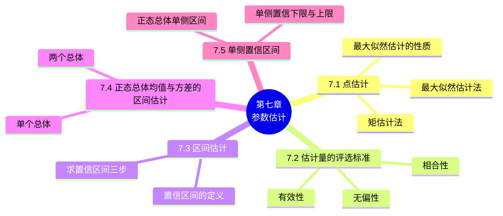

# 第七章 参数估计

> **本章主线**：第六章建立了样本与抽样分布的概念，本章开始用样本推断总体——当总体 $X$ 的分布函数形式已知但含未知参数 $\theta$ 时，用样本估计 $\theta$ 的问题称为**参数估计**。本章先介绍**点估计**的两种方法：**矩估计法**（用样本矩估计总体矩）与**最大似然估计法**（选取使似然函数最大的参数值），并给出最大似然估计的不变性；然后用**无偏性、有效性、相合性**三个标准评选估计量（样本均值 $\bar{X}$ 无偏、样本方差 $S^2$ 无偏而 $\frac{1}{n}\sum(X_i-\bar{X})^2$ 有偏等）；由于点估计不能反映精度，引入**区间估计**——构造以 $1-\alpha$ 概率包含参数真值的置信区间，并系统给出正态总体下均值（$\sigma^2$ 已知用 $z$ 区间、未知用 $t$ 区间）、方差（$\chi^2$ 区间）、两总体均值差与方差比（$t$、$F$ 区间）的置信区间，最后介绍**单侧置信区间**（寿命下限、废品率上限）。

## 7.1 点估计

### 7.1.1 点估计问题的提法

设总体 $X$ 的分布函数形式已知，但它的一个或多个参数为未知，借助总体 $X$ 的一个样本来估计总体未知参数的值的问题称为**点估计问题**。

**例 1（着火次数）** 在某炸药制造厂，一天中发生着火现象的次数 $X$ 是一个随机变量，假设它服从以 $\lambda > 0$ 为参数的泊松分布，参数 $\lambda$ 为未知。设有以下的样本值，试估计参数 $\lambda$：

| 着火次数 $k$ | 0 | 1 | 2 | 3 | 4 | 5 | 6 |
| :--: | :--: | :--: | :--: | :--: | :--: | :--: | :--: |
| 发生 $k$ 次着火的天数 $n_k$ | 75 | 90 | 54 | 22 | 6 | 2 | 1 | （$\sum = 250$）|

- 因为 $X \sim \pi(\lambda)$，所以 $\lambda = E(X)$，用样本均值来估计总体的均值 $E(X)$：
$$\bar{x} = \frac{\sum_{k=0}^{6} k n_k}{\sum n_k} = \frac{1}{250}(0\times75 + 1\times90 + 2\times54 + 3\times22 + 4\times6 + 5\times2 + 6\times1) = 1.22$$
- 故 $E(X) = \lambda$ 的估计为 **1.22**。

**点估计问题的一般提法**：设总体 $X$ 的分布函数 $F(x;\theta)$ 的形式已知，$\theta$ 是待估参数，$X_1, X_2, \dots, X_n$ 是 $X$ 的一个样本，$x_1, x_2, \dots, x_n$ 为相应的一个样本值。点估计问题就是要构造一个适当的统计量 $\hat{\theta}(X_1, X_2, \dots, X_n)$，用它的观察值 $\hat{\theta}(x_1, x_2, \dots, x_n)$ 来估计未知参数 $\theta$：

- $\hat{\theta}(X_1, X_2, \dots, X_n)$ 称为 $\theta$ 的**估计量**；
- $\hat{\theta}(x_1, x_2, \dots, x_n)$ 称为 $\theta$ 的**估计值**；
- 二者通称估计，简记为 $\hat{\theta}$。

**例 2（断头次数）** 在某纺织厂细纱机上的断头次数 $X$ 服从以 $\lambda > 0$ 为参数的泊松分布，参数 $\lambda$ 为未知。现检查了 150 只纱锭在某一时间段内断头的次数（数据：断头 $k$ 次的有 45、60、32、9、2、1、1 只，$k = 0,1,\dots,6$），试估计参数 $\lambda$。

- 先确定一个统计量 $\bar{X}$，再计算出 $\bar{X}$ 的观察值 $\bar{x}$，把 $\bar{x}$ 作为参数 $\lambda$ 的估计值：$\bar{x} = 1.133$，$\lambda$ 的估计值为 **1.133**。

### 7.1.2 估计量的求法

由于估计量是样本的函数、是随机变量，故对不同的样本值得到的参数值往往不同，如何求估计量是关键问题。常用构造估计量的方法有两种：**矩估计法**和**最大似然估计法**。

**1. 矩估计法**

设 $X$ 为连续型随机变量，其概率密度为 $f(x;\theta_1, \theta_2, \dots, \theta_k)$；或 $X$ 为离散型随机变量，其分布律为 $P\{X = x\} = p(x;\theta_1, \theta_2, \dots, \theta_k)$，其中 $\theta_1, \theta_2, \dots, \theta_k$ 为待估参数。若 $X_1, X_2, \dots, X_n$ 为来自 $X$ 的样本，假设总体 $X$ 的前 $k$ 阶矩存在，且均为 $\theta_1, \theta_2, \dots, \theta_k$ 的函数，即

$$\mu_l = E(X^l) = \int_{-\infty}^{+\infty} x^l f(x;\theta_1, \dots, \theta_k)\,dx \quad (X \text{ 为连续型}), \qquad \mu_l = E(X^l) = \sum_{x \in R_X} x^l p(x;\theta_1, \dots, \theta_k) \quad (X \text{ 为离散型})$$

其中 $R_X$ 是 $x$ 可能取值的范围，$l = 1, 2, \dots, k$。

因为样本矩 $A_l = \dfrac{1}{n}\sum_{i=1}^{n} X_i^l$ 依概率收敛于相应的总体矩 $\mu_l$（$l = 1, 2, \dots, k$），样本矩的连续函数依概率收敛于相应的总体矩的连续函数。

**矩估计法的定义**：用样本矩来估计总体矩，用样本矩的连续函数来估计总体矩的连续函数，这种估计法称为**矩估计法**。

**矩估计法的具体做法**：令

$$\mu_l = A_l, \qquad l = 1, 2, \dots, k$$

这是一个包含 $k$ 个未知参数 $\theta_1, \theta_2, \dots, \theta_k$ 的方程组，解出其中 $\theta_1, \theta_2, \dots, \theta_k$。用方程组的解 $\hat{\theta}_1, \hat{\theta}_2, \dots, \hat{\theta}_k$ 分别作为 $\theta_1, \theta_2, \dots, \theta_k$ 的估计量，这个估计量称为**矩估计量**；矩估计量的观察值称为**矩估计值**。

**例 3（均匀分布 $[0, \theta]$）** 设总体 $X$ 在 $[0, \theta]$ 上服从均匀分布，其中 $\theta$（$\theta > 0$）未知，$(X_1, X_2, \dots, X_n)$ 是来自总体 $X$ 的样本，求 $\theta$ 的估计量。

- 因为 $\mu_1 = E(X) = \dfrac{\theta}{2}$，根据矩估计法令 $\dfrac{\hat{\theta}}{2} = A_1 = \bar{X}$；
- 所以 $\hat{\theta} = 2\bar{X}$ 为所求 $\theta$ 的估计量。

**例 4（均匀分布 $[a, b]$）** 设总体 $X$ 在 $[a, b]$ 上服从均匀分布，其中 $a$、$b$ 未知，$(X_1, X_2, \dots, X_n)$ 是来自总体 $X$ 的样本，求 $a$、$b$ 的估计量。

- $\mu_1 = E(X) = \dfrac{a+b}{2}$，$\mu_2 = E(X^2) = D(X) + [E(X)]^2 = \dfrac{(b-a)^2}{12} + \dfrac{(a+b)^2}{4}$；
- 令 $\dfrac{a+b}{2} = A_1$，$\dfrac{(b-a)^2}{12} + \dfrac{(a+b)^2}{4} = A_2$，即 $\begin{cases} a + b = 2A_1, \\ b - a = \sqrt{12(A_2 - A_1^2)}; \end{cases}$
- 解方程组得到 $a$、$b$ 的矩估计量分别为
$$\hat{a} = A_1 - \sqrt{3(A_2 - A_1^2)} = \bar{X} - \sqrt{\frac{3}{n}\sum_{i=1}^{n}(X_i - \bar{X})^2}, \qquad \hat{b} = A_1 + \sqrt{3(A_2 - A_1^2)} = \bar{X} + \sqrt{\frac{3}{n}\sum_{i=1}^{n}(X_i - \bar{X})^2}$$

**例 5（几何分布）** 设总体 $X$ 服从几何分布，即有分布律 $P\{X = k\} = p(1-p)^{k-1}$（$k = 1, 2, \dots$），其中 $p$（$0 < p < 1$）未知，$(X_1, X_2, \dots, X_n)$ 是来自总体 $X$ 的样本，求 $p$ 的估计量。

- $\mu_1 = E(X) = \sum_{k=1}^{\infty} k\,p(1-p)^{k-1} = \dfrac{1}{p}$；
- 令 $\dfrac{1}{\hat{p}} = A_1 = \bar{X}$，所以 $\hat{p} = \dfrac{1}{\bar{X}}$ 为所求 $p$ 的估计量。

**例 6（均值与方差）** 设总体 $X$ 的均值 $\mu$ 和方差 $\sigma^2$ 都存在，且有 $\sigma^2 > 0$，但 $\mu$ 和 $\sigma^2$ 均为未知，又设 $X_1, X_2, \dots, X_n$ 是一个样本，求 $\mu$ 和 $\sigma^2$ 的矩估计量。

- $\mu_1 = E(X) = \mu$，$\mu_2 = E(X^2) = D(X) + [E(X)]^2 = \sigma^2 + \mu^2$；
- 令 $\begin{cases} \mu = A_1, \\ \sigma^2 + \mu^2 = A_2, \end{cases}$ 解方程组得到矩估计量分别为
$$\hat{\mu} = A_1 = \bar{X}, \qquad \hat{\sigma}^2 = A_2 - A_1^2 = \frac{1}{n}\sum_{i=1}^{n} X_i^2 - \bar{X}^2 = \frac{1}{n}\sum_{i=1}^{n}(X_i - \bar{X})^2$$

> 上例表明：**总体均值与方差的矩估计量的表达式不因不同的总体分布而异**。例如 $X \sim N(\mu, \sigma^2)$，$\mu$、$\sigma^2$ 未知，即得 $\mu$、$\sigma^2$ 的矩估计量 $\hat{\mu} = \bar{X}$，$\hat{\sigma}^2 = \dfrac{1}{n}\sum_{i=1}^{n}(X_i - \bar{X})^2$。
> 一般地，用样本均值 $\bar{X} = \dfrac{1}{n}\sum_{i=1}^{n} X_i$ 作为总体 $X$ 的均值的矩估计，用样本二阶中心矩 $B_2 = \dfrac{1}{n}\sum_{i=1}^{n}(X_i - \bar{X})^2$ 作为总体 $X$ 的方差的矩估计。

**2. 最大似然估计法**

**(1) 设总体 $X$ 属离散型**——**似然函数的定义**：设分布律 $P\{X = k\} = p(x;\theta)$，$\theta$ 为待估参数，$\theta \in \Theta$（$\Theta$ 是 $\theta$ 可能的取值范围），$X_1, X_2, \dots, X_n$ 是来自总体 $X$ 的样本，则 $X_1, X_2, \dots, X_n$ 的联合分布律为 $\prod_{i=1}^{n} p(x_i;\theta)$。又设 $x_1, x_2, \dots, x_n$ 为相应于样本的一个样本值，则样本取到观察值 $x_1, x_2, \dots, x_n$（即事件 $\{X_1 = x_1, \dots, X_n = x_n\}$ 发生）的概率为

$$L(\theta) = L(x_1, x_2, \dots, x_n;\theta) = \prod_{i=1}^{n} p(x_i;\theta), \qquad \theta \in \Theta$$

$L(\theta)$ 称为**样本似然函数**。

**最大似然估计法**：得到样本值 $x_1, x_2, \dots, x_n$ 时，选取使似然函数 $L(\theta)$ 取得最大值的 $\hat{\theta}$ 作为未知参数 $\theta$ 的估计值，即

$$L(x_1, x_2, \dots, x_n;\hat{\theta}) = \max_{\theta \in \Theta} L(x_1, x_2, \dots, x_n;\theta)$$

这样得到的 $\hat{\theta}(x_1, x_2, \dots, x_n)$ 称为参数 $\theta$ 的**最大似然估计值**，$\hat{\theta}(X_1, X_2, \dots, X_n)$ 称为**最大似然估计量**。

**(2) 设总体 $X$ 属连续型**——**似然函数的定义**：设概率密度为 $f(x;\theta)$，$\theta$ 为待估参数，$\theta \in \Theta$，$X_1, X_2, \dots, X_n$ 是来自总体 $X$ 的样本，则 $X_1, X_2, \dots, X_n$ 的联合密度为 $\prod_{i=1}^{n} f(x_i;\theta)$。随机点落在点 $(x_1, x_2, \dots, x_n)$ 的邻域（边长分别为 $dx_1, dx_2, \dots, dx_n$ 的 $n$ 维立方体）内的概率近似地为 $\prod_{i=1}^{n} f(x_i;\theta)dx_i$，定义

$$L(\theta) = L(x_1, x_2, \dots, x_n;\theta) = \prod_{i=1}^{n} f(x_i;\theta)$$

$L(\theta)$ 称为样本的似然函数。若 $L(x_1, x_2, \dots, x_n;\hat{\theta}) = \max_{\theta \in \Theta} L(x_1, x_2, \dots, x_n;\theta)$，则称 $\hat{\theta}(x_1, x_2, \dots, x_n)$ 为参数 $\theta$ 的最大似然估计值，$\hat{\theta}(X_1, X_2, \dots, X_n)$ 为最大似然估计量。

> 最大似然估计法是由**费舍尔**引进的。直观思想："已发生的事件具有最大概率"——选择使观察到的样本最"像"（似然最大）的参数值。

**求最大似然估计量的步骤**：

1. **写出似然函数**：$L(\theta) = \prod_{i=1}^{n} p(x_i;\theta)$ 或 $L(\theta) = \prod_{i=1}^{n} f(x_i;\theta)$；
2. **取对数**：$\ln L(\theta) = \sum_{i=1}^{n} \ln p(x_i;\theta)$ 或 $\ln L(\theta) = \sum_{i=1}^{n} \ln f(x_i;\theta)$；
3. **对 $\theta$ 求导**并令 $\dfrac{d\ln L(\theta)}{d\theta} = 0$（对数似然方程），解方程即得未知参数 $\theta$ 的最大似然估计值 $\hat{\theta}$。

最大似然估计法也适用于分布中含有多个未知参数的情况。此时只需令 $\dfrac{\partial \ln L}{\partial \theta_i} = 0$（$i = 1, 2, \dots, k$）（对数似然方程组），解出由 $k$ 个方程组成的方程组，即可得各未知参数 $\theta_i$ 的最大似然估计值 $\hat{\theta}_i$。

**例 7（两点分布）** 设 $X \sim B(1, p)$，$X_1, X_2, \dots, X_n$ 是来自 $X$ 的一个样本，求 $p$ 的最大似然估计量。

- $X$ 的分布律为 $P\{X = x\} = p^x(1-p)^{1-x}$（$x = 0, 1$），似然函数
$$L(p) = \prod_{i=1}^{n} p^{x_i}(1-p)^{1-x_i} = p^{\sum x_i}(1-p)^{n - \sum x_i}$$
- $\ln L(p) = \left(\sum_{i=1}^{n} x_i\right)\ln p + \left(n - \sum_{i=1}^{n} x_i\right)\ln(1-p)$；
- 令 $\dfrac{d}{dp}\ln L(p) = \dfrac{\sum x_i}{p} - \dfrac{n - \sum x_i}{1-p} = 0$，解得 $p$ 的最大似然估计值 $\hat{p} = \dfrac{1}{n}\sum_{i=1}^{n} x_i = \bar{x}$；
- $p$ 的最大似然估计量为 $\hat{p} = \dfrac{1}{n}\sum_{i=1}^{n} X_i = \bar{X}$。**这一估计量与矩估计量是相同的**。

**例 8（泊松分布）** 设 $X$ 服从参数为 $\lambda$（$\lambda > 0$）的泊松分布，$X_1, X_2, \dots, X_n$ 是来自 $X$ 的一个样本，求 $\lambda$ 的最大似然估计量。

- 因为 $X$ 的分布律为 $P\{X = x\} = \dfrac{\lambda^x}{x!}e^{-\lambda}$（$x = 0, 1, 2, \dots$），所以 $\lambda$ 的似然函数为
$$L(\lambda) = \prod_{i=1}^{n} \frac{\lambda^{x_i}}{x_i!}e^{-\lambda} = \frac{\lambda^{\sum x_i} e^{-n\lambda}}{\prod_{i=1}^{n}(x_i!)}$$
- $\ln L(\lambda) = -n\lambda + \left(\sum_{i=1}^{n} x_i\right)\ln\lambda - \sum_{i=1}^{n}\ln(x_i!)$；
- 令 $\dfrac{d}{d\lambda}\ln L(\lambda) = -n + \dfrac{\sum x_i}{\lambda} = 0$，解得 $\lambda$ 的最大似然估计值 $\hat{\lambda} = \dfrac{1}{n}\sum_{i=1}^{n} x_i = \bar{x}$；
- $\lambda$ 的最大似然估计量为 $\hat{\lambda} = \bar{X}$。**这一估计量与矩估计量是相同的**。

**例 9（正态分布）** 设总体 $X \sim N(\mu, \sigma^2)$，$\mu$、$\sigma^2$ 为未知参数，$x_1, x_2, \dots, x_n$ 是来自 $X$ 的一个样本值，求 $\mu$ 和 $\sigma^2$ 的最大似然估计量。

- $X$ 的概率密度为 $f(x;\mu,\sigma^2) = \dfrac{1}{\sqrt{2\pi}\,\sigma}e^{-\frac{(x-\mu)^2}{2\sigma^2}}$，似然函数
$$L(\mu, \sigma^2) = \prod_{i=1}^{n} \frac{1}{\sqrt{2\pi}\,\sigma}e^{-\frac{(x_i-\mu)^2}{2\sigma^2}}$$
- $\ln L(\mu, \sigma^2) = -\dfrac{n}{2}\ln(2\pi) - \dfrac{n}{2}\ln\sigma^2 - \dfrac{1}{2\sigma^2}\sum_{i=1}^{n}(x_i - \mu)^2$；
- 令 $\begin{cases} \dfrac{\partial}{\partial\mu}\ln L = 0, \\ \dfrac{\partial}{\partial\sigma^2}\ln L = 0, \end{cases}$ 由 $\dfrac{1}{\sigma^2}\left[\sum x_i - n\mu\right] = 0$ 解得 $\hat{\mu} = \bar{x}$；由 $-\dfrac{n}{2\sigma^2} + \dfrac{1}{2(\sigma^2)^2}\sum(x_i-\mu)^2 = 0$ 解得 $\hat{\sigma}^2 = \dfrac{1}{n}\sum_{i=1}^{n}(x_i - \bar{x})^2$；
- 故 $\mu$ 和 $\sigma^2$ 的最大似然估计量分别为 $\hat{\mu} = \bar{X}$，$\hat{\sigma}^2 = \dfrac{1}{n}\sum_{i=1}^{n}(X_i - \bar{X})^2$。**它们与相应的矩估计量相同**。

**例 10（均匀分布 $[a, b]$）** 设总体 $X$ 在 $[a, b]$ 上服从均匀分布，其中 $a$、$b$ 未知，$x_1, x_2, \dots, x_n$ 是来自总体 $X$ 的一个样本值，求 $a$、$b$ 的最大似然估计量。

- 记 $x_{(l)} = \min(x_1, x_2, \dots, x_n)$，$x_{(h)} = \max(x_1, x_2, \dots, x_n)$，$X$ 的概率密度为 $f(x;a,b) = \begin{cases} \dfrac{1}{b-a}, & a \leq x \leq b, \\ 0, & \text{其他}; \end{cases}$
- 因为 $a \leq x_1, x_2, \dots, x_n \leq b$ 等价于 $a \leq x_{(l)}$、$x_{(h)} \leq b$，作为 $a$、$b$ 的函数的似然函数为
$$L(a, b) = \begin{cases} \dfrac{1}{(b-a)^n}, & a \leq x_{(l)},\; b \geq x_{(h)}, \\ 0, & \text{其他}; \end{cases}$$
- 于是对于满足条件 $a \leq x_{(l)}$、$b \geq x_{(h)}$ 的任意 $a$、$b$ 有 $L(a, b) = \dfrac{1}{(b-a)^n} \leq \dfrac{1}{(x_{(h)} - x_{(l)})^n}$，即似然函数 $L(a, b)$ 在 $a = x_{(l)}$、$b = x_{(h)}$ 时取到最大值；
- $a$、$b$ 的最大似然估计值为 $\hat{a} = x_{(l)} = \min\limits_{1 \leq i \leq n} x_i$，$\hat{b} = x_{(h)} = \max\limits_{1 \leq i \leq n} x_i$；
- $a$、$b$ 的最大似然估计量为 $\hat{a} = \min\limits_{1 \leq i \leq n} X_i$，$\hat{b} = \max\limits_{1 \leq i \leq n} X_i$。

> 注意：例 4（矩估计）与例 10（最大似然估计）对 $U[a,b]$ 给出的估计量不同——矩估计用样本均值与二阶矩，最大似然估计用极值。

**最大似然估计的性质**：设 $\theta$ 的函数 $u = u(\theta)$（$\theta \in \Theta$）具有单值反函数 $\theta = \theta(u)$。又设 $\hat{\theta}$ 是 $X$ 的概率密度函数 $f(x;\theta)$（形式已知）中的参数 $\theta$ 的最大似然估计，则 $\hat{u} = u(\hat{\theta})$ 是 $u(\theta)$ 的最大似然估计。

**证明**：因为 $\hat{\theta}$ 是 $\theta$ 的最大似然估计值，所以 $L(x_1, \dots, x_n;\hat{\theta}) = \max_{\theta \in \Theta} L(x_1, \dots, x_n;\theta)$。由于 $\hat{u} = u(\hat{\theta})$、$\hat{\theta} = \theta(\hat{u})$，故 $L(x_1, \dots, x_n;\theta(\hat{u})) = \max_{u} L(x_1, \dots, x_n;\theta(u))$，于是 $\hat{u} = u(\hat{\theta})$ 是 $u(\theta)$ 的最大似然估计。此性质可以推广到总体分布中含有多个未知参数的情况。

**例**：如例 9 中 $\sigma^2$ 的最大似然估计值为 $\hat{\sigma}^2 = \dfrac{1}{n}\sum(X_i - \bar{X})^2$，函数 $u = u(\sigma^2) = \sqrt{\sigma^2}$ 有单值反函数 $\sigma^2 = u^2$（$u \geq 0$），故标准差 $\sigma$ 的最大似然估计值为 $\hat{\sigma} = \sqrt{\hat{\sigma}^2} = \sqrt{\dfrac{1}{n}\sum_{i=1}^{n}(X_i - \bar{X})^2}$。

**小结**：两种求点估计的方法——**矩估计法**、**最大似然估计法**。在统计问题中往往先使用最大似然估计法，在最大似然估计法使用不方便时，再用矩估计法。

---

## 7.2 估计量的评选标准

### 7.2.1 问题的提出

从前一节可以看到，对于同一个参数，用不同的估计方法求出的估计量可能不相同（如例 4 和例 10）。而且，很明显，原则上任何统计量都可以作为未知参数的估计量。问题：(1) 对于同一个参数究竟采用哪一个估计量好？(2) 评价估计量的标准是什么？下面介绍几个常用标准。

### 7.2.2 无偏性

若 $X_1, X_2, \dots, X_n$ 为总体 $X$ 的一个样本，$\theta \in \Theta$ 是包含在总体 $X$ 的分布中的待估参数（$\Theta$ 是 $\theta$ 的取值范围），若估计量 $\hat{\theta}$ 的数学期望 $E(\hat{\theta}) = \theta$（对所有 $\theta \in \Theta$ 成立），则称 $\hat{\theta}$ 为 $\theta$ 的**无偏估计量**。

**无偏估计的实际意义**：**无系统误差**。

**例 1（样本矩的无偏性）** 设总体 $X$ 的 $k$ 阶矩 $\mu_k = E(X^k)$（$k \geq 1$）存在，又设 $X_1, X_2, \dots, X_n$ 是 $X$ 的一个样本，试证明不论总体服从什么分布，$k$ 阶样本矩 $A_k = \dfrac{1}{n}\sum_{i=1}^{n} X_i^k$ 是 $k$ 阶总体矩 $\mu_k$ 的无偏估计。

- 因为 $X_1, X_2, \dots, X_n$ 与 $X$ 同分布，故有 $E(X_i^k) = E(X^k) = \mu_k$（$i = 1, 2, \dots, n$），即 $E(A_k) = \dfrac{1}{n}\sum_{i=1}^{n} E(X_i^k) = \mu_k$；
- 故 $k$ 阶样本矩 $A_k$ 是 $k$ 阶总体矩 $\mu_k$ 的无偏估计。

**特别的**：不论总体 $X$ 服从什么分布，只要它的数学期望存在，$\bar{X}$ 总是总体 $X$ 的数学期望 $\mu_1 = E(X)$ 的无偏估计量。

**例 2（样本方差的修正）** 对于均值 $\mu$、方差 $\sigma^2 > 0$ 都存在的总体，若 $\mu$、$\sigma^2$ 均为未知，则 $\sigma^2$ 的估计量 $\hat{\sigma}^2 = \dfrac{1}{n}\sum_{i=1}^{n}(X_i - \bar{X})^2$ 是**有偏的**（即不是无偏估计）。

- $\hat{\sigma}^2 = \dfrac{1}{n}\sum_{i=1}^{n} X_i^2 - \bar{X}^2 = A_2 - \bar{X}^2$，因为 $E(A_2) = \mu_2 = \sigma^2 + \mu^2$，又因为 $E(\bar{X}^2) = D(\bar{X}) + [E(\bar{X})]^2 = \dfrac{\sigma^2}{n} + \mu^2$，所以
$$E(\hat{\sigma}^2) = E(A_2) - E(\bar{X}^2) = \frac{n-1}{n}\sigma^2 \neq \sigma^2$$
  所以 $\hat{\sigma}^2$ 是有偏的；
- 若以 $\dfrac{n}{n-1}$ 乘 $\hat{\sigma}^2$，所得到的估计量就是无偏的（这种方法称为**无偏化**）：
$$E\left(\frac{n}{n-1}\hat{\sigma}^2\right) = \frac{n}{n-1}E(\hat{\sigma}^2) = \sigma^2$$
- 因为 $\dfrac{n}{n-1}\hat{\sigma}^2 = \dfrac{1}{n-1}\sum_{i=1}^{n}(X_i - \bar{X})^2 = S^2$，即 $S^2$ 是 $\sigma^2$ 的无偏估计，**故通常取 $S^2$ 作 $\sigma^2$ 的估计量**。

**例 3（正态总体 $\sigma$ 的无偏估计）** 设 $X_1, X_2, \dots, X_n$ 是来自正态总体 $N(\mu, \sigma^2)$ 的样本，试求 $\sigma^2$ 的无偏估计量。

- 由第六章定理二知 $\dfrac{(n-1)S^2}{\sigma^2} \sim \chi^2(n-1)$，利用 $\chi^2$ 分布的期望（$E(\chi^2) = n$，即 $E\left(\dfrac{(n-1)S^2}{\sigma^2}\right) = n-1$）直接得 $E(S^2) = \sigma^2$（故 $S^2$ 是 $\sigma^2$ 的无偏估计）；
- 进一步可算得 $E(S) = \sqrt{\dfrac{2}{n-1}}\cdot\dfrac{\Gamma\left(\frac{n}{2}\right)}{\Gamma\left(\frac{n-1}{2}\right)}\sigma \neq \sigma$，故 $S$ **不是** $\sigma$ 的无偏估计量，而 $\sqrt{\dfrac{n-1}{2}}\cdot\dfrac{\Gamma\left(\frac{n-1}{2}\right)}{\Gamma\left(\frac{n}{2}\right)}S$ 是 $\sigma$ 的无偏估计量。

**例 4（均匀分布 $[0,\theta]$ 的两个无偏估计）** 设总体 $X$ 在 $[0, \theta]$ 上服从均匀分布，参数 $\theta > 0$，$X_1, X_2, \dots, X_n$ 是来自总体 $X$ 的样本，试证明 $2\bar{X}$ 和 $\dfrac{n+1}{n}\max(X_1, X_2, \dots, X_n)$ 都是 $\theta$ 的无偏估计。

- 因为 $E(2\bar{X}) = 2E(\bar{X}) = 2E(X) = 2 \times \dfrac{\theta}{2} = \theta$，所以 $2\bar{X}$ 是 $\theta$ 的无偏估计量；
- 因为 $X_h = \max(X_1, \dots, X_n)$ 的概率密度为 $\dfrac{nx^{n-1}}{\theta^n}$（$0 \leq x \leq \theta$），所以 $E(X_h) = \displaystyle \int_0^{\theta} x \cdot \frac{nx^{n-1}}{\theta^n}\,dx = \frac{n}{n+1}\theta$，故有 $E\left(\dfrac{n+1}{n}X_h\right) = \theta$，即 $\dfrac{n+1}{n}\max(X_1, \dots, X_n)$ 也是 $\theta$ 的无偏估计量。

**例 5（指数分布的两个无偏估计）** 设总体 $X$ 服从参数为 $\theta$ 的指数分布，概率密度 $f(x;\theta) = \begin{cases} \dfrac{1}{\theta}e^{-x/\theta}, & x > 0, \\ 0, & \text{其他}, \end{cases}$ 其中参数 $\theta > 0$，又设 $X_1, X_2, \dots, X_n$ 是来自总体 $X$ 的样本，试证 $\bar{X}$ 和 $nZ = n[\min(X_1, X_2, \dots, X_n)]$ 都是 $\theta$ 的无偏估计。

- 因为 $E(\bar{X}) = E(X) = \theta$，所以 $\bar{X}$ 是 $\theta$ 的无偏估计量；
- 而 $Z = \min(X_1, X_2, \dots, X_n)$ 服从参数为 $\dfrac{\theta}{n}$ 的指数分布（概率密度 $f_{\min}(x;\theta) = \begin{cases} \dfrac{n}{\theta}e^{-nx/\theta}, & x > 0, \\ 0, & \text{其他} \end{cases}$），故知 $E(Z) = \dfrac{\theta}{n}$，$E(nZ) = \theta$，所以 $nZ$ 也是 $\theta$ 的无偏估计量。

> 由以上两例可知：**一个参数可以有不同的无偏估计量**。

### 7.2.3 有效性

由于方差是随机变量取值与其数学期望的偏离程度，所以**无偏估计以方差小者为好**。若 $\hat{\theta}_1$、$\hat{\theta}_2$ 都是 $\theta$ 的无偏估计量，且 $D(\hat{\theta}_1) < D(\hat{\theta}_2)$，则称 $\hat{\theta}_1$ 较 $\hat{\theta}_2$ **有效**。

**例 6（续例 5）** 试证当 $n > 1$ 时，$\theta$ 的无偏估计量 $\bar{X}$ 较 $nZ$ 有效。

- 由于 $D(X) = \theta^2$，故有 $D(\bar{X}) = \dfrac{\theta^2}{n}$；又因为 $D(Z) = \dfrac{\theta^2}{n^2}$，故有 $D(nZ) = \theta^2$；
- 当 $n > 1$ 时，$D(nZ) > D(\bar{X})$，故 $\theta$ 的无偏估计量 $\bar{X}$ 较 $nZ$ 有效。

**例 7（续例 4）** 在例 4 中已证明 $\hat{\theta}_1 = 2\bar{X}$ 和 $\hat{\theta}_2 = \dfrac{n+1}{n}\max\{X_1, X_2, \dots, X_n\}$ 都是 $\theta$ 的无偏估计量，现证当 $n \geq 2$ 时 $\hat{\theta}_2$ 较 $\hat{\theta}_1$ 有效。

- 由于 $D(\hat{\theta}_1) = 4D(\bar{X}) = \dfrac{4}{n}D(X) = \dfrac{\theta^2}{3n}$（$X \sim U[0,\theta]$ 时 $D(X) = \dfrac{\theta^2}{12}$）；
- $D(\hat{\theta}_2) = \left(\dfrac{n+1}{n}\right)^2 D(X_h)$，又因为 $E(X_h) = \dfrac{n}{n+1}\theta$，$E(X_h^2) = \dfrac{n}{n+2}\theta^2$，故 $D(X_h) = E(X_h^2) - [E(X_h)]^2 = \dfrac{n}{(n+1)^2(n+2)}\theta^2$，从而
$$D(\hat{\theta}_2) = \frac{1}{n(n+2)}\theta^2$$
- 又 $n \geq 2$，所以 $D(\hat{\theta}_2) < D(\hat{\theta}_1)$，$\hat{\theta}_2$ 较 $\hat{\theta}_1$ 有效。

### 7.2.4 相合性

若估计量 $\hat{\theta}$ 依概率收敛于参数 $\theta$，即 $\forall \varepsilon > 0$，$\lim_{n \to \infty} P\{|\hat{\theta} - \theta| < \varepsilon\} = 1$，则称 $\hat{\theta}$ 为 $\theta$ 的**相合估计量**。

- 例如由第六章知，样本 $k$（$k \geq 1$）阶矩是总体 $X$ 的 $k$ 阶矩 $\mu_k = E(X^k)$ 的相合估计量；进而若待估参数 $\theta = g(\mu_1, \mu_2, \dots, \mu_k)$，其中 $g$ 为连续函数，则 $\theta$ 的矩估计量 $\hat{\theta} = g(A_1, A_2, \dots, A_k)$ 是 $\theta$ 的相合估计量。

**例 8** 试证：样本均值 $\bar{X}$ 是总体均值 $\mu$ 的相合估计量，样本方差 $S^2 = \dfrac{1}{n-1}\sum_{i=1}^{n}(X_i - \bar{X})^2$ 及样本的二阶中心矩 $B_2 = \dfrac{1}{n}\sum_{i=1}^{n}(X_i - \bar{X})^2$ 都是总体方差 $\sigma^2$ 的相合估计量。

- 由大数定律（辛钦定理）知，$\forall \varepsilon > 0$，有 $\lim_{n \to \infty} P\left\{\left|\dfrac{1}{n}\sum X_i - \mu\right| < \varepsilon\right\} = 1$，所以 $\bar{X}$ 是 $\mu$ 的相合估计量；
- 又 $B_2 = \dfrac{1}{n}\sum(X_i - \bar{X})^2 = A_2 - \bar{X}^2$（$A_2$ 是样本二阶原点矩），由大数定律知 $A_2$ 依概率收敛于 $E(X^2)$，$\bar{X}$ 依概率收敛于 $E(X)$，故 $B_2 = A_2 - \bar{X}^2$ 依概率收敛于 $E(X^2) - [E(X)]^2 = \sigma^2$，所以 $B_2$ 是 $\sigma^2$ 的相合估计量；
- 又 $\lim_{n \to \infty} \dfrac{n}{n-1} = 1$，所以 $S^2 = \dfrac{n}{n-1}B_2$ 也是 $\sigma^2$ 的相合估计量。

**小结**：估计量的评选的三个标准——**无偏性**、**有效性**、**相合性**。相合性是对估计量的一个基本要求，不具备相合性的估计量是不予以考虑的。由最大似然估计法得到的估计量，在一定条件下也具有相合性。估计量的相合性只有当样本容量相当大时才能显示出优越性，这在实际中往往难以做到，因此在工程中往往使用无偏性和有效性这两个标准。

---

## 7.3 区间估计

### 7.3.1 置信区间的定义

**定义**：设总体 $X$ 的分布函数 $F(x;\theta)$ 含有一个未知参数 $\theta$，对于给定值 $\alpha$（$0 < \alpha < 1$），若由样本 $X_1, X_2, \dots, X_n$ 确定的两个统计量 $\underline{\theta} = \underline{\theta}(X_1, \dots, X_n)$ 和 $\overline{\theta} = \overline{\theta}(X_1, \dots, X_n)$ 满足

$$P\{\underline{\theta}(X_1, X_2, \dots, X_n) < \theta < \overline{\theta}(X_1, X_2, \dots, X_n)\} = 1 - \alpha$$

则称随机区间 $(\underline{\theta}, \overline{\theta})$ 是 $\theta$ 的**置信度为 $1-\alpha$ 的置信区间**，$\underline{\theta}$ 和 $\overline{\theta}$ 分别称为置信度为 $1-\alpha$ 的**双侧置信区间的置信下限和置信上限**，$1-\alpha$ 为**置信度**。

**关于定义的说明**：被估计的参数 $\theta$ 虽然未知，但它是一个**常数**，没有随机性，而区间 $(\underline{\theta}, \overline{\theta})$ 是**随机的**。因此定义中表达式的本质是：随机区间 $(\underline{\theta}, \overline{\theta})$ 以 $1-\alpha$ 的概率**包含着参数 $\theta$ 的真值**，而不能说参数 $\theta$ 以 $1-\alpha$ 的概率落入随机区间。

若反复抽样多次（各次得到的样本容量相等，都是 $n$），每个样本值确定一个区间，每个这样的区间或包含 $\theta$ 的真值或不包含 $\theta$ 的真值。按伯努利大数定理，在这样多的区间中，包含 $\theta$ 真值的约占 $100(1-\alpha)\%$，不包含的约占 $100\alpha\%$。例如若 $\alpha = 0.01$，反复抽样 1000 次，则得到的 1000 个区间中不包含 $\theta$ 真值的约为 10 个。

### 7.3.2 求置信区间的一般步骤（共 3 步）

1. **寻求一个样本 $X_1, X_2, \dots, X_n$ 的函数** $Z = Z(X_1, X_2, \dots, X_n;\theta)$，其中仅包含待估参数 $\theta$，并且 $Z$ 的分布已知且不依赖于任何未知参数（包括 $\theta$）；
2. **对于给定的置信度 $1-\alpha$，定出两个常数 $a$、$b$**，使 $P\{a < Z(X_1, X_2, \dots, X_n;\theta) < b\} = 1-\alpha$；
3. **若能从 $a < Z < b$ 得到等价的不等式 $\underline{\theta} < \theta < \overline{\theta}$**，其中 $\underline{\theta}$、$\overline{\theta}$ 都是统计量，那么 $(\underline{\theta}, \overline{\theta})$ 就是 $\theta$ 的一个置信度为 $1-\alpha$ 的置信区间。

**性质**：样本容量 $n$ 固定，置信水平 $1-\alpha$ 增大，置信区间长度增大，可信程度增大，区间估计精度降低；置信水平 $1-\alpha$ 固定，样本容量 $n$ 增大，置信区间长度减小，可信程度不变，区间估计精度提高。

### 7.3.3 典型例题

**例 1（均匀分布 $[0,\theta]$）** 设总体 $X$ 在 $[0, \theta]$ 上服从均匀分布，其中 $\theta$（$\theta > 0$）未知，$(X_1, X_2, \dots, X_n)$ 是来自总体 $X$ 的样本，给定 $\alpha$，求 $\theta$ 的置信水平为 $1-\alpha$ 的置信区间。

- 令 $X_h = \max\{X_1, X_2, \dots, X_n\}$，由上节例 4 可知 $\dfrac{n+1}{n}X_h$ 是 $\theta$ 的无偏估计；
- 考察包括待估参数 $\theta$ 的随机变量 $\dfrac{X_h}{\theta}$，其概率密度为 $g(z) = \begin{cases} nz^{n-1}, & 0 \leq z \leq 1, \\ 0, & \text{其他}; \end{cases}$
- 对于给定的 $\alpha$，可定出两个常数 $a$、$b$（$0 < a < b \leq 1$），满足 $P\left\{a < \dfrac{X_h}{\theta} < b\right\} = 1-\alpha$，即 $1-\alpha = \int_a^b nz^{n-1}\,dz = b^n - a^n$；
- 于是 $P\left\{\dfrac{X_h}{b} < \theta < \dfrac{X_h}{a}\right\} = 1-\alpha$，$\left(\dfrac{X_h}{b}, \dfrac{X_h}{a}\right)$ 为置信区间。

**例 2（正态总体 $\sigma^2$ 已知）** 设 $X_1, X_2, \dots, X_n$ 是来自正态总体 $N(\mu, \sigma^2)$ 的样本，其中 $\sigma^2$ 为已知，$\mu$ 为未知，求 $\mu$ 的置信水平为 $1-\alpha$ 的置信区间。

- 因为 $\bar{X}$ 是 $\mu$ 的无偏估计，且 $U = \dfrac{\bar{X}-\mu}{\sigma/\sqrt{n}} \sim N(0,1)$ 是不依赖于任何未知参数的随机变量；
- 由标准正态分布的上 $\alpha$ 分位点的定义知 $P\left\{\left|\dfrac{\bar{X}-\mu}{\sigma/\sqrt{n}}\right| < z_{\alpha/2}\right\} = 1-\alpha$，即
$$P\left\{\bar{X} - \frac{\sigma}{\sqrt{n}}z_{\alpha/2} < \mu < \bar{X} + \frac{\sigma}{\sqrt{n}}z_{\alpha/2}\right\} = 1-\alpha$$
- 于是得 $\mu$ 的一个置信水平为 $1-\alpha$ 的置信区间 $\left(\bar{X} - \dfrac{\sigma}{\sqrt{n}}z_{\alpha/2},\; \bar{X} + \dfrac{\sigma}{\sqrt{n}}z_{\alpha/2}\right)$，常写成 $\bar{X} \pm \dfrac{\sigma}{\sqrt{n}}z_{\alpha/2}$，其置信区间的长度为 $\dfrac{2\sigma}{\sqrt{n}}z_{\alpha/2}$。

**数值示例**：若取 $n = 16$，$\sigma = 1$，$\alpha = 0.05$，查表可得 $z_{\alpha/2} = z_{0.025} = 1.96$，得置信水平为 0.95 的置信区间 $\bar{X} \pm \dfrac{1}{\sqrt{16}}\times 1.96$。由一个样本值算得样本均值的观察值 $\bar{x} = 5.20$，则置信区间为 $(5.20 \pm 0.49)$，即 $(4.71, 5.69)$。

**置信区间的选择（长度比较）**：在例 2 中如果给定 $\alpha = 0.05$，则又有 $P\{-z_{0.04} < Z < z_{0.01}\} = 0.95$，即 $\left(\bar{X} - \dfrac{\sigma}{\sqrt{n}}z_{0.01},\; \bar{X} + \dfrac{\sigma}{\sqrt{n}}z_{0.04}\right)$ 也是 $\mu$ 的置信水平为 0.95 的置信区间，其长度为 $\dfrac{\sigma}{\sqrt{n}}(z_{0.04} + z_{0.01})$。比较两个置信区间的长度：$L_1 = 2\dfrac{\sigma}{\sqrt{n}}z_{0.025} = 3.92\dfrac{\sigma}{\sqrt{n}}$，$L_2 = \dfrac{\sigma}{\sqrt{n}}(z_{0.04}+z_{0.01}) = 4.08\dfrac{\sigma}{\sqrt{n}}$，显然 $L_1 < L_2$——置信区间短表示估计的精度高。

> 说明：对于概率密度的图形是单峰且关于纵坐标轴对称的情况，易证取 $a$ 和 $b$ 关于原点对称时，能使置信区间长度最小。

**例 3（工件长度）** 设某工件的长度 $X$ 服从正态分布 $N(\mu, 16)$，今抽 9 件测量其长度，得数据如下（单位：mm）：142, 138, 150, 165, 156, 148, 132, 135, 160。试求参数 $\mu$ 的置信水平为 95% 的置信区间。

- 根据例 2，$\mu$ 的置信度为 $1-\alpha$ 的置信区间为 $\left(\bar{X} \pm \dfrac{\sigma}{\sqrt{n}}z_{\alpha/2}\right)$；
- 由 $n = 9$，$\sigma = 4$，$\alpha = 0.05$，$z_{0.025} = 1.96$，$\bar{x} = 147.333$ 知：
$$\left(147.333 - \frac{4}{3}\times 1.96,\; 147.333 + \frac{4}{3}\times 1.96\right) = (144.720, 149.946)$$
- $\mu$ 的置信度为 0.95 的置信区间为 $(144.720, 149.946)$。

**小结**：点估计不能反映估计的精度，故而本节引入了**区间估计**。求置信区间的一般步骤（分三步）。

---

## 7.4 正态总体均值与方差的区间估计

### 7.4.1 单个总体 $N(\mu, \sigma^2)$ 的情况

设给定置信水平为 $1-\alpha$，并设 $X_1, X_2, \dots, X_n$ 为总体 $N(\mu, \sigma^2)$ 的样本，$\bar{X}$、$S^2$ 分别是样本均值和样本方差。

**1. $\sigma^2$ 已知，$\mu$ 的置信区间（$z$ 区间）**：由上节例 2 可知，$\mu$ 的置信度为 $1-\alpha$ 的置信区间为

$$\left(\bar{X} \pm \frac{\sigma}{\sqrt{n}}z_{\alpha/2}\right)$$

**例 1（包糖机）** 包糖机某日开工包了 12 包糖，称得质量（单位：克）分别为 506, 500, 495, 488, 504, 486, 505, 513, 521, 520, 512, 485。假设重量服从正态分布，且标准差为 $\sigma = 10$，试求糖包的平均质量 $\mu$ 的 $1-\alpha$ 置信区间（分别取 $\alpha = 0.10$ 和 $\alpha = 0.05$）。

- $\sigma = 10$，$n = 12$，计算得 $\bar{x} = 502.92$；
- (1) 当 $\alpha = 0.10$ 时，$1-\dfrac{\alpha}{2} = 0.95$，查表得 $z_{\alpha/2} = z_{0.05} = 1.645$：
$$\bar{x} - \frac{10}{\sqrt{12}}\times 1.645 = 502.92 - 4.75 = 498.17, \qquad \bar{x} + \frac{10}{\sqrt{12}}\times 1.645 = 502.92 + 4.75 = 507.67$$
  即 $\mu$ 的置信度为 90% 的置信区间为 $(498.17, 507.67)$；
- (2) 当 $\alpha = 0.05$ 时，$1-\dfrac{\alpha}{2} = 0.975$，查表得 $z_{0.025} = 1.96$，同理可得 $\mu$ 的置信度为 95% 的置信区间为 $(497.26, 508.58)$。

**2. $\sigma^2$ 未知，$\mu$ 的置信区间（$t$ 区间）**：推导过程如下——由于区间 $\left(\bar{X} \pm \dfrac{\sigma}{\sqrt{n}}z_{\alpha/2}\right)$ 中含有未知参数 $\sigma$，不能直接使用此区间；但因为 $S^2$ 是 $\sigma^2$ 的无偏估计，可用 $S$ 替换 $\sigma$，又根据第六章定理三知 $\dfrac{\bar{X}-\mu}{S/\sqrt{n}} \sim t(n-1)$，则

$$P\left\{-t_{\alpha/2}(n-1) < \frac{\bar{X}-\mu}{S/\sqrt{n}} < t_{\alpha/2}(n-1)\right\} = 1-\alpha$$

即 $P\left\{\bar{X} - \dfrac{S}{\sqrt{n}}t_{\alpha/2}(n-1) < \mu < \bar{X} + \dfrac{S}{\sqrt{n}}t_{\alpha/2}(n-1)\right\} = 1-\alpha$，故 $\mu$ 的置信度为 $1-\alpha$ 的置信区间为

$$\left(\bar{X} \pm \frac{S}{\sqrt{n}}t_{\alpha/2}(n-1)\right)$$

**例 2（糖果）** 有一大批糖果，现从中随机地取 16 袋，称得重量（克）如下：506, 508, 499, 503, 504, 510, 497, 512, 514, 505, 493, 496, 506, 502, 509, 496。设袋装糖果的重量服从正态分布，试求总体均值 $\mu$ 的置信度为 0.95 的置信区间。

- $\alpha = 0.05$，$n-1 = 15$，查 $t$ 分布表可知 $t_{0.025}(15) = 2.1315$，计算得 $\bar{x} = 503.75$，$s = 6.2022$；
- 得 $\mu$ 的置信度为 95% 的置信区间 $\left(503.75 \pm \dfrac{6.2022}{4}\times 2.1315\right)$，即估计袋装糖果重量的均值在 **500.4 克与 507.1 克**之间，这个估计的可信程度为 95%；
- 若依此区间内任一值作为 $\mu$ 的近似值，其误差不大于 $\dfrac{6.2022}{4}\times 2.1315 \times 2 = 6.61$（克），这个误差的可信度为 95%。

**例 3（续例 1，$\sigma$ 未知）** 如果只假设糖包的重量服从正态分布 $N(\mu, \sigma^2)$，试求糖包重量 $\mu$ 的 95% 的置信区间。

- 此时 $\sigma$ 未知，$n = 12$，$\alpha = 0.05$，$\bar{x} = 502.92$，$s = 12.35$，查 $t$ 分布表可知 $t_{0.025}(11) = 2.201$；
- 于是 $\dfrac{s}{\sqrt{n}}t_{\alpha/2}(n-1) = \dfrac{12.35}{\sqrt{12}}\times 2.201 = 7.85$；
- 得 $\mu$ 的置信度为 95% 的置信区间 $(495.07, 510.77)$。

**例 4（置信区间长度的期望）** 设 $X_1, X_2, \dots, X_n$ 是来自正态总体 $N(\mu, \sigma^2)$ 的样本，其中 $\sigma^2$ 和 $\mu$ 为未知参数，设随机变量 $L$ 是关于 $\mu$ 的置信度为 $1-\alpha$ 的置信区间的长度，求 $E(L^2)$。

- 当 $\sigma^2$ 未知时，$\mu$ 的置信度为 $1-\alpha$ 的置信区间为 $\left(\bar{X} \pm \dfrac{S}{\sqrt{n}}t_{\alpha/2}(n-1)\right)$，置信区间长度 $L = \dfrac{2S}{\sqrt{n}}t_{\alpha/2}(n-1)$；
- 于是 $L^2 = \dfrac{4S^2}{n}[t_{\alpha/2}(n-1)]^2$；
- 又 $E(S^2) = E\left[\dfrac{1}{n-1}\sum(X_i-\bar{X})^2\right] = \dfrac{1}{n-1}\left[\sum_{i=1}^{n} E(X_i^2) - nE(\bar{X}^2)\right] = \dfrac{1}{n-1}\left[n(\sigma^2+\mu^2) - n\left(\dfrac{\sigma^2}{n}+\mu^2\right)\right] = \sigma^2$；
- 于是 $E(L^2) = \dfrac{4}{n}[t_{\alpha/2}(n-1)]^2 E(S^2) = \dfrac{4}{n}[t_{\alpha/2}(n-1)]^2\sigma^2$。

**3. $\mu$ 未知，$\sigma^2$ 的置信区间（$\chi^2$ 区间）**：根据实际需要只介绍 $\mu$ 未知的情况。推导过程如下——因为 $S^2$ 是 $\sigma^2$ 的无偏估计，根据第六章定理二知 $\dfrac{(n-1)S^2}{\sigma^2} \sim \chi^2(n-1)$，则

$$P\left\{\chi_{1-\alpha/2}^2(n-1) < \frac{(n-1)S^2}{\sigma^2} < \chi_{\alpha/2}^2(n-1)\right\} = 1-\alpha$$

即 $P\left\{\dfrac{(n-1)S^2}{\chi_{\alpha/2}^2(n-1)} < \sigma^2 < \dfrac{(n-1)S^2}{\chi_{1-\alpha/2}^2(n-1)}\right\} = 1-\alpha$，于是得方差 $\sigma^2$ 的置信度为 $1-\alpha$ 的置信区间

$$\left(\frac{(n-1)S^2}{\chi_{\alpha/2}^2(n-1)},\; \frac{(n-1)S^2}{\chi_{1-\alpha/2}^2(n-1)}\right)$$

进一步可得标准差 $\sigma$ 的置信区间（对各端点开方）。

> 注意：在密度函数不对称时（如 $\chi^2$ 分布和 $F$ 分布），习惯上仍取对称的分位点（$\alpha/2$ 与 $1-\alpha/2$）来确定置信区间。

**例 5（续例 2，$\sigma$ 的区间）** 求例 2 中总体标准差 $\sigma$ 的置信度为 0.95 的置信区间。

- $\dfrac{\alpha}{2} = 0.025$，$1-\dfrac{\alpha}{2} = 0.975$，$n-1 = 15$，查 $\chi^2$ 分布表可知 $\chi_{0.025}^2(15) = 27.488$，$\chi_{0.975}^2(15) = 6.262$；
- 计算得 $s = 6.2022$，方差区间为 $\left(\dfrac{15 \times 6.2022^2}{27.488},\; \dfrac{15 \times 6.2022^2}{6.262}\right) = (20.99, 92.15)$；
- 代入公式得标准差的置信区间 $(\sqrt{20.99}, \sqrt{92.15}) = (4.58, 9.60)$。

**例 6（续例 1，$\sigma^2$ 与 $\sigma$ 的区间）** 求例 1 中总体方差 $\sigma^2$ 和标准差 $\sigma$ 的置信度为 0.95 的置信区间。

- $\dfrac{\alpha}{2} = 0.025$，$1-\dfrac{\alpha}{2} = 0.975$，$n-1 = 11$，查 $\chi^2$ 分布表可知 $\chi_{0.025}^2(11) = 21.920$，$\chi_{0.975}^2(11) = 3.816$；
- 方差 $\sigma^2$ 的置信区间为 $(78.97, 453.64)$；
- 标准差 $\sigma$ 的置信区间为 $(8.87, 21.30)$。

### 7.4.2 两个总体 $N(\mu_1, \sigma_1^2)$、$N(\mu_2, \sigma_2^2)$ 的情况

设给定置信度为 $1-\alpha$，并设 $X_1, X_2, \dots, X_{n_1}$ 为第一个总体的样本，$Y_1, Y_2, \dots, Y_{n_2}$ 为第二个总体的样本，$\bar{X}$、$\bar{Y}$ 分别是两个总体的样本均值，$S_1^2$、$S_2^2$ 分别是两个总体的样本方差。讨论两个总体**均值差**和**方差比**的估计问题。

**1. 均值差 $\mu_1 - \mu_2$ 的置信区间**

**(1) $\sigma_1^2$ 和 $\sigma_2^2$ 均为已知**：因为 $\bar{X}$、$\bar{Y}$ 分别是 $\mu_1$、$\mu_2$ 的无偏估计，所以 $\bar{X} - \bar{Y}$ 是 $\mu_1 - \mu_2$ 的无偏估计。由 $\bar{X} \sim N\left(\mu_1, \dfrac{\sigma_1^2}{n_1}\right)$，$\bar{Y} \sim N\left(\mu_2, \dfrac{\sigma_2^2}{n_2}\right)$ 及独立性可知 $\bar{X} - \bar{Y} \sim N\left(\mu_1 - \mu_2, \dfrac{\sigma_1^2}{n_1} + \dfrac{\sigma_2^2}{n_2}\right)$，即 $\dfrac{(\bar{X}-\bar{Y}) - (\mu_1-\mu_2)}{\sqrt{\dfrac{\sigma_1^2}{n_1} + \dfrac{\sigma_2^2}{n_2}}} \sim N(0, 1)$，由此得 $\mu_1 - \mu_2$ 的置信区间为

$$\left((\bar{X}-\bar{Y}) \pm z_{\alpha/2}\sqrt{\frac{\sigma_1^2}{n_1} + \frac{\sigma_2^2}{n_2}}\right)$$

**(2) $\sigma_1^2$ 和 $\sigma_2^2$ 均为未知**：只要 $n_1$ 和 $n_2$ 都很大（实用上 $> 50$ 即可），则可用 $S_1^2$、$S_2^2$ 分别替换 $\sigma_1^2$、$\sigma_2^2$ 得到近似置信区间。

**(3) $\sigma_1^2 = \sigma_2^2 = \sigma^2$，但 $\sigma^2$ 为未知**：用合并样本方差 $S_w^2 = \dfrac{(n_1-1)S_1^2 + (n_2-1)S_2^2}{n_1 + n_2 - 2}$，由第六章定理四知 $\dfrac{(\bar{X}-\bar{Y}) - (\mu_1-\mu_2)}{S_w\sqrt{\dfrac{1}{n_1} + \dfrac{1}{n_2}}} \sim t(n_1 + n_2 - 2)$，故 $\mu_1 - \mu_2$ 的置信区间为

$$\left((\bar{X}-\bar{Y}) \pm t_{\alpha/2}(n_1 + n_2 - 2)\,S_w\sqrt{\frac{1}{n_1} + \frac{1}{n_2}}\right)$$

**例 7（步枪枪口速度）** 为比较 I、II 两种型号步枪子弹的枪口速度，随机地取 I 型子弹 10 发，得到枪口速度的平均值为 $\bar{x}_1 = 500$（m/s），标准差 $s_1 = 1.10$（m/s）；随机地取 II 型子弹 20 发，得枪口速度平均值为 $\bar{x}_2 = 496$（m/s），标准差 $s_2 = 1.20$（m/s）。假设两总体都可认为近似地服从正态分布，且由生产过程可认为它们的方差相等，求两总体均值差 $\mu_1 - \mu_2$ 的置信区间（置信度 0.95）。

- 由题意，两总体样本独立且方差相等（但未知），$\dfrac{\alpha}{2} = 0.025$，$n_1 = 10$，$n_2 = 20$，$n_1 + n_2 - 2 = 28$，查 $t$ 分布表可知 $t_{0.025}(28) = 2.0484$；
- 合并方差 $S_w^2 = \dfrac{(10-1)\times 1.10^2 + (20-1)\times 1.20^2}{28} = 1.3661$，$s_w = \sqrt{S_w^2} = 1.1688$；
- $\bar{x}_1 - \bar{x}_2 = 4$，得均值差置信区间 $(4 \pm 0.93)$，即 $(3.07, 4.93)$。

**例 8（催化剂）** 为提高某一化学生产过程的得率，试图采用一种新的催化剂。设采用原来的催化剂进行了 $n_1 = 8$ 次试验，得到得率的平均值 $\bar{x}_1 = 91.73$，样本方差 $s_1^2 = 3.89$；又采用新的催化剂进行了 $n_2 = 8$ 次试验，得到得率的平均值 $\bar{x}_2 = 93.75$，样本方差 $s_2^2 = 4.02$。假设两总体都可认为近似地服从正态分布，且方差相等，求两总体均值差 $\mu_1 - \mu_2$ 的置信区间（置信度 0.95）。

- 由题意，两总体样本独立且方差相等（但未知），合并方差 $S_w^2 = \dfrac{7\times 3.89 + 7\times 4.02}{14} = 3.955$，$s_w = 1.989$，$t_{0.025}(14) = 2.1448$；
- $\bar{x}_1 - \bar{x}_2 = -2.02$，得均值差置信区间 $(-2.02 \pm 2.13)$，即 $(-4.15, 0.11)$。

**2. 方差比 $\dfrac{\sigma_1^2}{\sigma_2^2}$ 的置信区间（$F$ 区间）**：推导过程如下——由于 $\dfrac{(n_1-1)S_1^2}{\sigma_1^2} \sim \chi^2(n_1-1)$，$\dfrac{(n_2-1)S_2^2}{\sigma_2^2} \sim \chi^2(n_2-1)$，且由假设知两者相互独立，根据 $F$ 分布的定义知

$$\frac{S_1^2/\sigma_1^2}{S_2^2/\sigma_2^2} \sim F(n_1-1, n_2-1)$$

即 $\dfrac{S_1^2}{S_2^2}\cdot\dfrac{\sigma_2^2}{\sigma_1^2} \sim F(n_1-1, n_2-1)$，故 $\dfrac{\sigma_1^2}{\sigma_2^2}$ 的置信区间为

$$\left(\frac{S_1^2/S_2^2}{F_{\alpha/2}(n_1-1, n_2-1)},\; \frac{S_1^2/S_2^2}{F_{1-\alpha/2}(n_1-1, n_2-1)}\right)$$

其中 $F_{1-\alpha/2}(n_1-1, n_2-1) = \dfrac{1}{F_{\alpha/2}(n_2-1, n_1-1)}$。

**例 9（机器内径）** 研究由机器 A 和机器 B 生产的钢管内径，随机抽取机器 A 生产的管子 18 只，测得样本方差为 $s_1^2 = 0.34$（$\text{mm}^2$）；抽取机器 B 生产的管子 13 只，测得样本方差为 $s_2^2 = 0.29$（$\text{mm}^2$）。设两样本相互独立，且设由机器 A 和机器 B 生产的钢管内径分别服从正态分布 $N(\mu_1, \sigma_1^2)$、$N(\mu_2, \sigma_2^2)$，$\mu_i$、$\sigma_i^2$（$i = 1, 2$）均未知，求方差比 $\dfrac{\sigma_1^2}{\sigma_2^2}$ 的置信区间（$\alpha = 0.10$）。

- $n_1 = 18$，$n_2 = 13$，$\alpha = 0.10$，$s_1^2 = 0.34$，$s_2^2 = 0.29$；
- $F_{\alpha/2}(n_1-1, n_2-1) = F_{0.05}(17, 12) = 2.59$，$F_{1-\alpha/2}(17, 12) = F_{0.95}(17, 12) = \dfrac{1}{F_{0.05}(12, 17)} = \dfrac{1}{2.38}$；
- 方差比置信区间 $\left(\dfrac{0.34}{0.29}\times\dfrac{1}{2.59},\; \dfrac{0.34}{0.29}\times 2.38\right) = (0.45, 2.79)$。

**例 10（机床加工精度）** 甲、乙两台机床加工同一种零件，在机床甲加工的零件中抽取 9 个样品，在机床乙加工的零件中抽取 6 个样品，并分别测得它们的长度，由所给数据算得 $s_1^2 = 0.245$，$s_2^2 = 0.357$。在置信度 0.98 下，试求这两台机床加工精度之比 $\dfrac{\sigma_1}{\sigma_2}$ 的置信区间。假定测量值都服从正态分布，方差分别为 $\sigma_1^2$、$\sigma_2^2$。

- $n_1 = 9$，$n_2 = 6$，$\alpha = 0.02$，$\dfrac{\alpha}{2} = 0.01$；
- $F_{\alpha/2}(n_1-1, n_2-1) = F_{0.01}(8, 5) = 10.3$，$F_{1-\alpha/2}(8, 5) = \dfrac{1}{F_{0.01}(5, 8)} = \dfrac{1}{6.63}$；
- 方差比 $\dfrac{\sigma_1^2}{\sigma_2^2}$ 的置信区间为 $\left(\dfrac{0.245}{0.357}\times\dfrac{1}{10.3},\; \dfrac{0.245}{0.357}\times 6.63\right) = (0.0666, 4.55)$；
- 精度之比 $\dfrac{\sigma_1}{\sigma_2}$ 的置信区间为 $(\sqrt{0.0666}, \sqrt{4.55}) = (0.258, 2.133)$。

---

## 7.5 单侧置信区间

### 7.5.1 问题的引入

在以上各节的讨论中，对于未知参数 $\theta$，我们给出两个统计量 $\underline{\theta}$、$\overline{\theta}$，得到 $\theta$ 的双侧置信区间 $(\underline{\theta}, \overline{\theta})$。但在某些实际问题中——例如对于设备、元件的寿命来说，平均寿命长是我们希望的，我们关心的是平均寿命的"**下限**"；与之相反，在考虑产品的废品率 $p$ 时，我们常关心参数 $p$ 的"**上限**"——这就引出了**单侧置信区间**的概念。

### 7.5.2 单侧置信区间的定义

**定义**：对于给定值 $\alpha$（$0 < \alpha < 1$），若由样本 $X_1, X_2, \dots, X_n$ 确定的统计量 $\underline{\theta} = \underline{\theta}(X_1, X_2, \dots, X_n)$，对于任意 $\theta \in \Theta$ 满足

$$P\{\theta > \underline{\theta}\} \geq 1 - \alpha$$

则称随机区间 $(\underline{\theta}, +\infty)$ 是 $\theta$ 的置信水平为 $1-\alpha$ 的**单侧置信区间**，$\underline{\theta}$ 称为 $\theta$ 的置信水平为 $1-\alpha$ 的**单侧置信下限**。

又如果统计量 $\overline{\theta} = \overline{\theta}(X_1, X_2, \dots, X_n)$ 对于任意 $\theta \in \Theta$ 满足 $P\{\theta < \overline{\theta}\} \geq 1-\alpha$，则称随机区间 $(-\infty, \overline{\theta})$ 是 $\theta$ 的置信水平为 $1-\alpha$ 的**单侧置信区间**，$\overline{\theta}$ 称为 $\theta$ 的置信水平为 $1-\alpha$ 的**单侧置信上限**。

### 7.5.3 正态总体均值与方差的单侧置信区间

设正态总体 $X$ 的均值是 $\mu$、方差是 $\sigma^2$（均为未知），$X_1, X_2, \dots, X_n$ 是一个样本。由 $\dfrac{\bar{X}-\mu}{S/\sqrt{n}} \sim t(n-1)$，有

$$P\left\{\frac{\bar{X}-\mu}{S/\sqrt{n}} < t_\alpha(n-1)\right\} = 1-\alpha, \qquad \text{即} \qquad P\left\{\mu > \bar{X} - \frac{S}{\sqrt{n}}t_\alpha(n-1)\right\} = 1-\alpha$$

于是得 $\mu$ 的一个置信水平为 $1-\alpha$ 的**单侧置信区间** $\left(\bar{X} - \dfrac{S}{\sqrt{n}}t_\alpha(n-1),\; +\infty\right)$，$\mu$ 的置信水平为 $1-\alpha$ 的**置信下限**为 $\bar{X} - \dfrac{S}{\sqrt{n}}t_\alpha(n-1)$。

又根据 $\dfrac{(n-1)S^2}{\sigma^2} \sim \chi^2(n-1)$，有 $P\left\{\dfrac{(n-1)S^2}{\sigma^2} > \chi_{1-\alpha}^2(n-1)\right\} = 1-\alpha$，即 $P\left\{\sigma^2 < \dfrac{(n-1)S^2}{\chi_{1-\alpha}^2(n-1)}\right\} = 1-\alpha$，于是得 $\sigma^2$ 的置信水平为 $1-\alpha$ 的**单侧置信上限** $\dfrac{(n-1)S^2}{\chi_{1-\alpha}^2(n-1)}$。

**例 1（灯泡寿命下限）** 设从一批灯泡中随机地取 5 只作寿命试验，测得寿命（以小时计）为 1050, 1100, 1120, 1250, 1280。设灯泡寿命服从正态分布，求灯泡寿命平均值的置信水平为 0.95 的单侧置信下限。

- $1-\alpha = 0.95$，$n = 5$，$\bar{x} = 1160$，$s^2 = 9950$，$t_\alpha(n-1) = t_{0.05}(4) = 2.1318$；
- $\mu$ 的置信水平为 0.95 的置信下限为 $\bar{x} - \dfrac{s}{\sqrt{n}}t_{0.05}(4) = 1160 - \dfrac{\sqrt{9950}}{\sqrt{5}}\times 2.1318 = 1160 - 95.1 = 1064.9$（小时）。

**例 2（均匀分布 $[0,\theta]$ 的单侧区间）** 设总体 $X$ 在 $[0, \theta]$ 上服从均匀分布，其中 $\theta$（$\theta > 0$）未知，$(X_1, X_2, \dots, X_n)$ 是来自总体 $X$ 的样本，给定 $\alpha$，求 $\theta$ 的置信水平为 $1-\alpha$ 的置信下限和置信上限。

- 令 $X_h = \max\{X_1, X_2, \dots, X_n\}$，$\dfrac{X_h}{\theta}$ 的概率密度为 $nz^{n-1}$（$0 \leq z \leq 1$）；
- **置信下限**：对于给定的 $\alpha$，找 $0 < \theta_1 \leq 1$，使 $P\left\{\theta_1 > \dfrac{X_h}{\theta}\right\} = 1-\alpha$，即 $1-\alpha = \int_0^{\theta_1} nz^{n-1}\,dz = \theta_1^n$，于是 $\theta_1 = \sqrt[n]{1-\alpha}$，所以 $P\left\{\dfrac{X_h}{\sqrt[n]{1-\alpha}} < \theta\right\} = 1-\alpha$，$\theta$ 的置信水平为 $1-\alpha$ 的置信下限 $\underline{\theta} = \dfrac{X_h}{\sqrt[n]{1-\alpha}}$；
- **置信上限**：对于给定的 $\alpha$，找 $0 < \theta_2 < 1$，使 $P\left\{\theta_2 < \dfrac{X_h}{\theta}\right\} = 1-\alpha$，即 $1-\alpha = \int_{\theta_2}^{1} nz^{n-1}\,dz = 1 - \theta_2^n$，于是 $\theta_2 = \sqrt[n]{\alpha}$，所以 $P\left\{\theta < \dfrac{X_h}{\sqrt[n]{\alpha}}\right\} = 1-\alpha$，$\theta$ 的置信水平为 $1-\alpha$ 的置信上限 $\overline{\theta} = \dfrac{X_h}{\sqrt[n]{\alpha}}$。

**小结**：单侧置信区间用于只关心参数"下限"（如平均寿命）或"上限"（如废品率）的场合——平均寿命给出单侧置信下限 $\underline{\mu}$，废品率等给出单侧置信上限 $\overline{p}$。

---

### 知识定位与框架衔接

**前置知识**：第六章的样本、统计量、三大抽样分布（$\chi^2$、$t$、$F$）与正态总体的四个分布定理是本章全部置信区间的"枢轴量"来源；大数定律（第五章）保证样本矩依概率收敛于总体矩（矩估计的合理性）；期望与方差的性质（第四章）用于无偏性与有效性的计算；极值分布（第三章 max/min）用于 $\max(X_1,\dots,X_n)$ 的密度与 $\theta$ 的无偏估计。

**后置知识**：本章是数理统计的核心应用——点估计（矩估计、最大似然估计）与区间估计（正态总体的 $z$、$t$、$\chi^2$、$F$ 区间）是第八章假设检验的基础（检验统计量往往就是估计量的标准化形式）；最大似然估计贯穿现代统计与机器学习（逻辑回归、EM 算法均以似然函数为核心）；置信区间是工程中"用样本判断总体参数范围"的标准工具。

**故事比喻**：可以把点估计想象成"用样本猜一个数"（如用样本均值 $\bar{x}$ 猜总体均值 $\mu$），而区间估计是"用样本画一个范围"（以 $1-\alpha$ 的把握框住 $\mu$）。估计量的评选标准像是"挑选算命先生"——无偏性（平均而言不骗人）、有效性（每次算得都稳定）、相合性（样本越多越准）。

**四个灵魂问题**：

1. **"矩估计与最大似然估计怎么选？"** —— 矩估计简单直观（令样本矩 = 总体矩），对任何分布都可用且无需知道具体分布形式；最大似然估计更精细（充分利用分布信息），通常更优、具有不变性，但在似然函数难以处理时（如 $U[a,b]$）矩估计更方便——实践中先试最大似然，不便时用矩估计。
2. **"为什么样本方差用 $S^2 = \dfrac{1}{n-1}\sum(X_i-\bar{X})^2$ 而不是 $\dfrac{1}{n}$？"** —— $\dfrac{1}{n}$ 版本是有偏的：$E = \dfrac{n-1}{n}\sigma^2$（低估方差）；除以 $n-1$ 后 $E(S^2) = \sigma^2$ 无偏——这正是"无偏化"的产物。
3. **"置信区间里的 $1-\alpha$ 到底是什么意思？"** —— 是"区间包含真值的概率"而非"真值落入区间的概率"（$\theta$ 是常数，区间是随机的）；反复抽样时约 $100(1-\alpha)\%$ 的区间包含 $\theta$。$\alpha$ 越小区间越长、可信度越高、精度越低。
4. **"为什么 $\sigma$ 已知用 $z$ 区间、$\sigma$ 未知用 $t$ 区间？"** —— $\sigma$ 已知时枢轴量 $\dfrac{\bar{X}-\mu}{\sigma/\sqrt{n}} \sim N(0,1)$；$\sigma$ 未知时用 $S$ 替换 $\sigma$，枢轴量 $\dfrac{\bar{X}-\mu}{S/\sqrt{n}} \sim t(n-1)$——$t$ 分布自动补偿了 $S$ 估计 $\sigma$ 的不确定性（$n$ 小时尾部更厚）。

**本章小结**：第七章完成了数理统计的"估计"任务——点估计（矩估计法与最大似然估计法）给出参数的单个估计值，无偏性、有效性、相合性三个标准用于评选估计量；区间估计（置信区间）给出参数的范围并附带可信程度，正态总体的 $z$、$t$、$\chi^2$、$F$ 区间覆盖了单总体与双总体的均值、方差（标准差）、均值差、方差比，单侧置信区间则满足"只看下限/上限"的实际需求。这些方法直接服务于第八章的假设检验。

---

## 课件 PDF

<iframe src="https://naimore3.github.io/Naimore3-s-Learning-Notes/课程笔记/大二上/概率论与数理统计/第七章/第七章.pdf" style="width: 100%; height: 600px; border: none;"></iframe>

PDF 原文：[第七章 参数估计](https://naimore3.github.io/Naimore3-s-Learning-Notes/课程笔记/大二上/概率论与数理统计/第七章/第七章.pdf)
