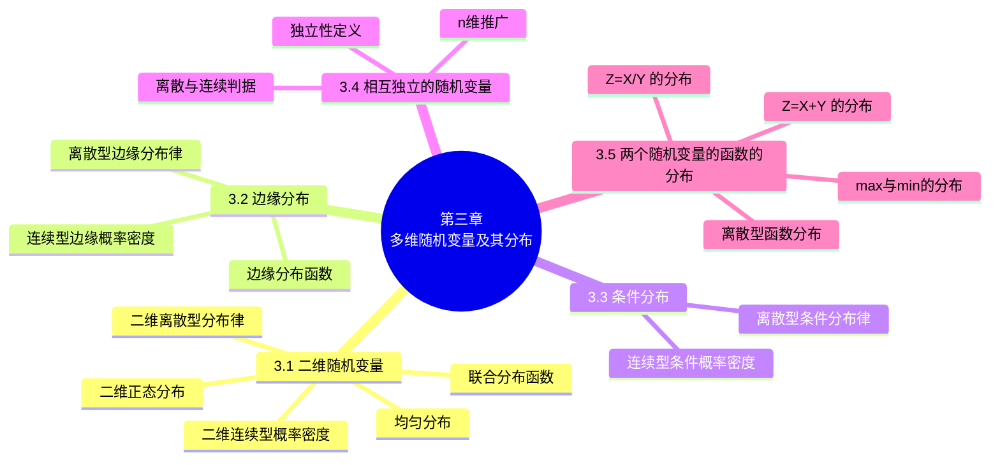

# 第三章 多维随机变量及其分布

> **本章主线**：第二章研究了单个随机变量，本章把它推广到**二维随机变量** $(X, Y)$——其概率规律用**联合分布函数** $F(x,y) = P\{X \leq x, Y \leq y\}$、**联合分布律**（离散）或**联合概率密度**（连续）完整刻画。由联合分布可"压缩"出**边缘分布**（只看 $X$ 或只看 $Y$），也可在固定一个变量的取值条件下得到**条件分布**；联合、边缘、条件三者关系密切。当 $F(x,y) = F_X(x)F_Y(y)$ 时称 $X$ 与 $Y$ **相互独立**。最后研究**两个随机变量的函数的分布**：离散情形合并同值概率，连续情形重点讨论 $Z = X+Y$（卷积）、$Z = X/Y$、$M = \max(X,Y)$ 与 $N = \min(X,Y)$ 三大类，并给出正态、Gamma、指数等常见分布的组合性质。

## 3.1 二维随机变量

### 3.1.1 二维随机变量及其分布函数

**定义**：设 $E$ 是一个随机试验，它的样本空间是 $S = \{e\}$，设 $X = X(e)$ 和 $Y = Y(e)$ 是定义在 $S$ 上的随机变量，由它们构成的一个向量 $(X, Y)$ 叫作**二维随机向量**或**二维随机变量**。

- **实例 1**：炮弹的弹着点的位置 $(X, Y)$ 就是一个二维随机变量；
- **实例 2**：考查某一地区学前儿童的发育情况，则儿童的身高 $H$ 和体重 $W$ 就构成二维随机变量 $(H, W)$。

> 说明：二维随机变量 $(X, Y)$ 的性质不仅与 $X$、$Y$ 有关，而且还依赖于这两个随机变量的**相互关系**。

**二维随机变量的分布函数（联合分布函数）**：设 $(X, Y)$ 是二维随机变量，对于任意实数 $x$、$y$，二元函数：

$$F(x, y) = P\{(X \leq x) \cap (Y \leq y)\} = P\{X \leq x, Y \leq y\}$$

称为二维随机变量 $(X, Y)$ 的**分布函数**，或称为随机变量 $X$ 和 $Y$ 的**联合分布函数**。$F(x, y)$ 的函数值就是随机点落在以 $(x, y)$ 为右上顶点的"左下无穷矩形区域" $\{X \leq x, Y \leq y\}$ 内的概率。

**分布函数的性质**：

1. $F(x, y)$ 是变量 $x$ 和 $y$ 的**不减函数**：对于任意固定的 $y$，当 $x_2 > x_1$ 时 $F(x_2, y) \geq F(x_1, y)$；对于任意固定的 $x$，当 $y_2 > y_1$ 时 $F(x, y_2) \geq F(x, y_1)$。
2. $0 \leq F(x, y) \leq 1$，且有
$$F(-\infty, y) = \lim_{x \to -\infty} F(x, y) = 0, \qquad F(x, -\infty) = \lim_{y \to -\infty} F(x, y) = 0$$
$$F(-\infty, -\infty) = \lim_{\substack{x \to -\infty \\ y \to -\infty}} F(x, y) = 0, \qquad F(+\infty, +\infty) = \lim_{\substack{x \to +\infty \\ y \to +\infty}} F(x, y) = 1$$
3. $F(x, y) = F(x+0, y)$，$F(x, y) = F(x, y+0)$，即 $F(x, y)$ **关于 $x$ 右连续，关于 $y$ 也右连续**。
4. 对于任意 $(x_1, y_1)$、$(x_2, y_2)$，$x_1 < x_2$，$y_1 < y_2$，有
$$F(x_2, y_2) - F(x_2, y_1) + F(x_1, y_1) - F(x_1, y_2) \geq 0$$

性质 4 证明：随机点落在矩形 $\{x_1 < X \leq x_2,\; y_1 < Y \leq y_2\}$ 内的概率非负，即
$$P\{x_1 < X \leq x_2,\; y_1 < Y \leq y_2\} = F(x_2, y_2) - F(x_2, y_1) - F(x_1, y_2) + F(x_1, y_1) \geq 0$$

### 3.1.2 二维离散型随机变量

**定义**：若二维随机变量 $(X, Y)$ 所取的可能值是有限对或无限可列多对，则称 $(X, Y)$ 为**二维离散型随机变量**。

**二维离散型随机变量的分布律（联合分布律）**：设二维离散型随机变量 $(X, Y)$ 所有可能取的值为 $(x_i, y_j)$（$i, j = 1, 2, \dots$），记

$$P\{X = x_i, Y = y_j\} = p_{ij}, \qquad i, j = 1, 2, \dots$$

称此为二维离散型随机变量 $(X, Y)$ 的**分布律**，或随机变量 $X$ 和 $Y$ 的**联合分布律**。其中

$$p_{ij} \geq 0, \qquad \sum_{i=1}^{\infty} \sum_{j=1}^{\infty} p_{ij} = 1$$

二维随机变量 $(X, Y)$ 的分布律也可表示为表格形式：

| $X \backslash Y$ | $y_1$ | $y_2$ | $\dots$ | $y_j$ | $\dots$ |
| :--: | :--: | :--: | :--: | :--: | :--: |
| $x_1$ | $p_{11}$ | $p_{12}$ | $\dots$ | $p_{1j}$ | $\dots$ |
| $x_2$ | $p_{21}$ | $p_{22}$ | $\dots$ | $p_{2j}$ | $\dots$ |
| $\vdots$ | $\vdots$ | $\vdots$ | | $\vdots$ | |
| $x_i$ | $p_{i1}$ | $p_{i2}$ | $\dots$ | $p_{ij}$ | $\dots$ |
| $\vdots$ | $\vdots$ | $\vdots$ | | $\vdots$ | |

**例 1（条件取值）** 设随机变量 $X$ 在 1、2、3、4 四个整数中等可能地取值，另一个随机变量 $Y$ 在 $1 \sim X$ 中等可能地取一整数值。试求 $(X, Y)$ 的分布律。

- $\{X = i, Y = j\}$ 的取值情况是：$i = 1, 2, 3, 4$，$j$ 取不大于 $i$ 的正整数，且由乘法公式得
$$P\{X = i, Y = j\} = P\{Y = j \mid X = i\}\,P\{X = i\} = \frac{1}{i} \cdot \frac{1}{4}, \qquad i = 1, 2, 3, 4,\; j \leq i$$

- 于是 $(X, Y)$ 的分布律为

| $X \backslash Y$ | 1 | 2 | 3 | 4 |
| :--: | :--: | :--: | :--: | :--: |
| 1 | $\dfrac{1}{4}$ | $\dfrac{1}{8}$ | $\dfrac{1}{12}$ | $\dfrac{1}{16}$ |
| 2 | 0 | $\dfrac{1}{8}$ | $\dfrac{1}{12}$ | $\dfrac{1}{16}$ |
| 3 | 0 | 0 | $\dfrac{1}{12}$ | $\dfrac{1}{16}$ |
| 4 | 0 | 0 | 0 | $\dfrac{1}{16}$ |

> 验证：第 $i$ 列的和恰为 $\dfrac{1}{4}$（$P\{X = i\} = \dfrac{1}{4}$），各列概率互不相交、总和为 1。

**例 2（超几何二维）** 从一个装有 3 支蓝色、2 支红色、3 支绿色圆珠笔的盒子里随机抽取两支，若 $X$、$Y$ 分别表示抽出的蓝笔数和红笔数，求 $(X, Y)$ 的分布律。

- $(X, Y)$ 所取的可能值是 $(0,0)$、$(0,1)$、$(1,0)$、$(1,1)$、$(0,2)$、$(2,0)$；
- 由组合计数（$C_8^2 = 28$ 种等可能取法）：

| $(X, Y)$ | $(0,0)$ | $(0,1)$ | $(1,0)$ | $(1,1)$ | $(0,2)$ | $(2,0)$ |
| :--: | :--: | :--: | :--: | :--: | :--: | :--: |
| $P$ | $\dfrac{C_3^0 C_2^0 C_3^2}{C_8^2} = \dfrac{3}{28}$ | $\dfrac{C_3^0 C_2^1 C_3^1}{C_8^2} = \dfrac{3}{14}$ | $\dfrac{C_3^1 C_2^0 C_3^1}{C_8^2} = \dfrac{9}{28}$ | $\dfrac{C_3^1 C_2^1 C_3^0}{C_8^2} = \dfrac{3}{14}$ | $\dfrac{C_3^0 C_2^2 C_3^0}{C_8^2} = \dfrac{1}{28}$ | $\dfrac{C_3^2 C_2^0 C_3^0}{C_8^2} = \dfrac{3}{28}$ |

- 故所求分布律为

| $X \backslash Y$ | 0 | 1 | 2 |
| :--: | :--: | :--: | :--: |
| 0 | $\dfrac{3}{28}$ | $\dfrac{9}{28}$ | $\dfrac{3}{28}$ |
| 1 | $\dfrac{3}{14}$ | $\dfrac{3}{14}$ | 0 |
| 2 | $\dfrac{1}{28}$ | 0 | 0 |

（总和 $= \dfrac{3+9+3+6+6+1}{28} = 1$。）

**例 3（不放回抽样）** 一个袋中有三个球，依次标有数字 1、2、2，从中任取一个，不放回袋中，再任取一个。设每次取球时各球被取到的可能性相等，以 $X$、$Y$ 分别记第一次和第二次取到的球上标有的数字，求 $(X, Y)$ 的分布律与分布函数。

- $(X, Y)$ 的可能取值为 $(1,2)$、$(2,1)$、$(2,2)$：
$$P\{X=1, Y=2\} = \frac{1}{3} \cdot \frac{2}{2} = \frac{1}{3}, \qquad P\{X=2, Y=1\} = \frac{2}{3} \cdot \frac{1}{2} = \frac{1}{3}, \qquad P\{X=2, Y=2\} = \frac{2}{3} \cdot \frac{1}{2} = \frac{1}{3}$$
  即 $p_{11} = 0$，$p_{12} = p_{21} = p_{22} = \dfrac{1}{3}$，分布律为

| $X \backslash Y$ | 1 | 2 |
| :--: | :--: | :--: |
| 1 | 0 | $\dfrac{1}{3}$ |
| 2 | $\dfrac{1}{3}$ | $\dfrac{1}{3}$ |

- 求分布函数 $F(x, y) = \sum_{x_i \leq x,\; y_j \leq y} p_{ij}$：
  - (1) 当 $x < 1$ 或 $y < 1$ 时，$F(x, y) = 0$；
  - (2) 当 $1 \leq x < 2$、$1 \leq y < 2$ 时，$F(x, y) = p_{11} = 0$；
  - (3) 当 $1 \leq x < 2$、$y \geq 2$ 时，$F(x, y) = p_{11} + p_{12} = \dfrac{1}{3}$；
  - (4) 当 $x \geq 2$、$1 \leq y < 2$ 时，$F(x, y) = p_{11} + p_{21} = \dfrac{1}{3}$；
  - (5) 当 $x \geq 2$、$y \geq 2$ 时，$F(x, y) = p_{11} + p_{21} + p_{12} + p_{22} = 1$；

所以 $(X, Y)$ 的分布函数为
$$F(x, y) = \begin{cases} 0, & x < 1 \text{ 或 } y < 1, \\ \dfrac{1}{3}, & 1 \leq x < 2,\; y \geq 2, \text{ 或 } x \geq 2,\; 1 \leq y < 2, \\ 1, & x \geq 2,\; y \geq 2. \end{cases}$$

> 离散型随机变量 $(X, Y)$ 的分布函数可归纳为 $F(x, y) = \sum_{x_i \leq x} \sum_{y_j \leq y} p_{ij}$，其中和式是对一切满足 $x_i \leq x$、$y_j \leq y$ 的 $i$、$j$ 求和。

### 3.1.3 二维连续型随机变量

**定义**：对于二维随机变量 $(X, Y)$ 的分布函数 $F(x, y)$，如果存在非负的函数 $f(x, y)$ 使对于任意 $x$、$y$ 有

$$F(x, y) = \int_{-\infty}^{y} \int_{-\infty}^{x} f(u, v)\,du\,dv$$

则称 $(X, Y)$ 是**连续型的二维随机变量**，函数 $f(x, y)$ 称为二维随机变量 $(X, Y)$ 的**概率密度**，或称为随机变量 $X$ 和 $Y$ 的**联合概率密度**。

**性质**：

1. $f(x, y) \geq 0$；
2. $\displaystyle \int_{-\infty}^{+\infty} \int_{-\infty}^{+\infty} f(x, y)\,dx\,dy = F(+\infty, +\infty) = 1$；
3. 设 $G$ 是 $xoy$ 平面上的一个区域，点 $(X, Y)$ 落在 $G$ 内的概率为
$$P\{(X, Y) \in G\} = \iint_{G} f(x, y)\,dx\,dy$$
4. 若 $f(x, y)$ 在 $(x, y)$ 连续，则有 $\dfrac{\partial^2 F(x, y)}{\partial x \partial y} = f(x, y)$。

**几何说明**：几何上 $z = f(x, y)$ 表示空间的一个曲面，$\displaystyle \int_{-\infty}^{+\infty} \int_{-\infty}^{+\infty} f(x, y)\,dx\,dy = 1$ 表示介于 $f(x, y)$ 和 $xoy$ 平面之间的空间区域的**全部体积等于 1**；$P\{(X, Y) \in G\} = \iint_G f$ 的值等于以 $G$ 为底、以曲面 $z = f(x, y)$ 为顶面的**柱体体积**。

**例 4** 设二维随机变量 $(X, Y)$ 具有概率密度

$$f(x, y) = \begin{cases} 2e^{-(2x+y)}, & x > 0,\; y > 0, \\ 0, & \text{其它}. \end{cases}$$

(1) 求分布函数 $F(x, y)$；(2) 求概率 $P\{Y \leq X\}$。

- (1) $F(x, y) = \displaystyle \int_{-\infty}^{y} \int_{-\infty}^{x} f(u, v)\,du\,dv = \begin{cases} \displaystyle \int_0^y \int_0^x 2e^{-(2u+v)}\,du\,dv, & x > 0,\; y > 0, \\ 0, & \text{其他}, \end{cases}$
$$F(x, y) = \begin{cases} (1 - e^{-2x})(1 - e^{-y}), & x > 0,\; y > 0, \\ 0, & \text{其他}. \end{cases}$$
- (2) 将 $(X, Y)$ 看作是平面上随机点的坐标，即有 $\{Y \leq X\} = \{(X, Y) \in G\}$（$G$ 为直线 $y = x$ 下方的第一象限区域）：
$$P\{Y \leq X\} = \iint_{G} f(x, y)\,dx\,dy = \int_0^{+\infty} \int_y^{+\infty} 2e^{-(2x+y)}\,dx\,dy = \int_0^{+\infty} e^{-2y} \cdot e^{-y} \,dy = \int_0^{+\infty} e^{-3y} \,dy = \frac{1}{3}$$

### 3.1.4 两个常用的分布

**1. 均匀分布**

**定义**：设 $D$ 是平面上的有界区域，其面积为 $S$，若二维随机变量 $(X, Y)$ 具有概率密度

$$f(x, y) = \begin{cases} \dfrac{1}{S}, & (x, y) \in D, \\ 0, & \text{其他}, \end{cases}$$

则称 $(X, Y)$ 在 $D$ 上服从**均匀分布**。

**例 5** 已知随机变量 $(X, Y)$ 在 $D$ 上服从均匀分布，试求 $(X, Y)$ 的分布密度及分布函数，其中 $D$ 为 $x$ 轴、$y$ 轴及直线 $y = x+1$ 所围成的三角形区域。

- 三角形区域 $D$ 的面积为 $S = \dfrac{1}{2}$，故 $f(x, y) = \begin{cases} 2, & (x, y) \in D, \\ 0, & \text{其他}. \end{cases}$
- 求分布函数 $F(x, y) = \iint f(u,v)\,du\,dv$，分区域讨论：
  - 当 $x < -1$ 或 $y < 0$ 时，$F(x, y) = 0$；
  - 当 $-1 \leq x < 0$、$0 \leq y < x+1$ 时，$F(x, y) = (2x - y + 2)y$；
  - 当 $-1 \leq x < 0$、$y \geq x+1$ 时，$F(x, y) = (x+1)^2$；
  - 当 $x \geq 0$、$0 \leq y < 1$ 时，$F(x, y) = (2 - y)y$；
  - 当 $x \geq 1$、$y \geq 1$ 时，$F(x, y) = 1$；

故 $(X, Y)$ 的分布函数为
$$F(x, y) = \begin{cases} 0, & x < -1 \text{ 或 } y < 0, \\ (2x - y + 2)y, & -1 \leq x < 0,\; 0 \leq y < x+1, \\ (x+1)^2, & -1 \leq x < 0,\; y \geq x+1, \\ (2-y)y, & x \geq 0,\; 0 \leq y < 1, \\ 1, & x \geq 1,\; y \geq 1. \end{cases}$$

（边界 $y = x+1$ 处 $(2x - y + 2)y = (x+1)^2$ 连续；$x = 0$ 处 $(2x - y + 2)y = (2-y)y$ 连续。）

**2. 二维正态分布**

若二维随机变量 $(X, Y)$ 具有概率密度

$$f(x, y) = \frac{1}{2\pi\sigma_1\sigma_2\sqrt{1-\rho^2}} \exp\left\{-\frac{1}{2(1-\rho^2)}\left[\frac{(x-\mu_1)^2}{\sigma_1^2} - 2\rho\frac{(x-\mu_1)(y-\mu_2)}{\sigma_1\sigma_2} + \frac{(y-\mu_2)^2}{\sigma_2^2}\right]\right\}$$

（$-\infty < x < +\infty$，$-\infty < y < +\infty$），其中 $\mu_1$、$\mu_2$、$\sigma_1$、$\sigma_2$、$\rho$ 均为常数，且 $\sigma_1 > 0$，$\sigma_2 > 0$，$-1 < \rho < 1$，则称 $(X, Y)$ 服从参数为 $\mu_1, \mu_2, \sigma_1, \sigma_2, \rho$ 的**二维正态分布**，记为

$$(X, Y) \sim N(\mu_1, \mu_2, \sigma_1^2, \sigma_2^2, \rho)$$

### 3.1.5 n 维随机变量的推广

**定义**：设 $E$ 是一个随机试验，它的样本空间是 $S = \{e\}$，设 $X_1 = X_1(e)$，$X_2 = X_2(e)$，$\dots$，$X_n = X_n(e)$ 是定义在 $S$ 上的随机变量，由它们构成的一个 $n$ 维向量 $(X_1, X_2, \dots, X_n)$ 叫做 **n 维随机向量**或 **n 维随机变量**。

对于任意 $n$ 个实数 $x_1, x_2, \dots, x_n$，$n$ 元函数

$$F(x_1, x_2, \dots, x_n) = P\{X_1 \leq x_1, X_2 \leq x_2, \dots, X_n \leq x_n\}$$

称为随机变量 $(X_1, X_2, \dots, X_n)$ 的**联合分布函数**。

---

## 3.2 边缘分布

### 3.2.1 边缘分布函数

设 $F(x, y)$ 为随机变量 $(X, Y)$ 的分布函数，则 $F(x, y) = P\{X \leq x, Y \leq y\}$。令 $y \to +\infty$，称

$$P\{X \leq x\} = P\{X \leq x, Y < +\infty\} = F(x, +\infty)$$

为随机变量 $(X, Y)$ 关于 $X$ 的**边缘分布函数**，记为 $F_X(x) = F(x, +\infty)$。

同理令 $x \to +\infty$，得 $(X, Y)$ 关于 $Y$ 的边缘分布函数：

$$F_Y(y) = F(+\infty, y) = P\{X < +\infty, Y \leq y\} = P\{Y \leq y\}$$

> 直观理解：边缘分布就是"只看其中一个变量"的分布——把联合分布函数中的另一个变量推到 $+\infty$，即对该变量不做任何限制。

### 3.2.2 离散型随机变量的边缘分布律

设二维离散型随机变量 $(X, Y)$ 的联合分布律为 $P\{X = x_i, Y = y_j\} = p_{ij}$（$i, j = 1, 2, \dots$）。记

$$p_{i\cdot} = \sum_{j=1}^{\infty} p_{ij} = P\{X = x_i\}, \qquad i = 1, 2, \dots$$
$$p_{\cdot j} = \sum_{i=1}^{\infty} p_{ij} = P\{Y = y_j\}, \qquad j = 1, 2, \dots$$

分别称 $p_{i\cdot}$（$i = 1, 2, \dots$）和 $p_{\cdot j}$（$j = 1, 2, \dots$）为 $(X, Y)$ 关于 $X$ 和关于 $Y$ 的**边缘分布律**。

> 求法：在联合分布律的表格中，**各行相加得 $Y$ 的边缘分布律，各列相加得 $X$ 的边缘分布律**（即"行和"与"列和"）。注意：**联合分布可以确定边缘分布，但边缘分布一般不能确定联合分布**。

**例 1（由联合分布求边缘分布）** 已知 $(X, Y)$ 的分布律为

| $X \backslash Y$ | 0 | 1 |
| :--: | :--: | :--: |
| 0 | $\dfrac{16}{49}$ | $\dfrac{12}{49}$ |
| 1 | $\dfrac{12}{49}$ | $\dfrac{9}{49}$ |

求其边缘分布律。

- 关于 $X$：$P\{X = 0\} = \dfrac{16}{49} + \dfrac{12}{49} = \dfrac{28}{49} = \dfrac{4}{7}$，$P\{X = 1\} = \dfrac{12}{49} + \dfrac{9}{49} = \dfrac{21}{49} = \dfrac{3}{7}$；
- 关于 $Y$：$P\{Y = 0\} = \dfrac{16}{49} + \dfrac{12}{49} = \dfrac{4}{7}$，$P\{Y = 1\} = \dfrac{12}{49} + \dfrac{9}{49} = \dfrac{3}{7}$；

即 $X$ 与 $Y$ 的边缘分布律都为 $\left(\dfrac{4}{7}, \dfrac{3}{7}\right)$。

**例 2（整除计数）** 一整数 $N$ 等可能地在 $1, 2, 3, \dots, 10$ 十个值中取一个值。设 $D = D(N)$ 是能整除 $N$ 的正整数的个数，$F = F(N)$ 是能整除 $N$ 的素数的个数。试写出 $D$ 和 $F$ 的联合分布律，并求边缘分布律。

- 列表计算：

| 样本点 | 1 | 2 | 3 | 4 | 5 | 6 | 7 | 8 | 9 | 10 |
| :--: | :--: | :--: | :--: | :--: | :--: | :--: | :--: | :--: | :--: | :--: |
| $D$ | 1 | 2 | 2 | 3 | 2 | 4 | 2 | 4 | 3 | 4 |
| $F$ | 0 | 1 | 1 | 1 | 1 | 2 | 1 | 1 | 1 | 2 |

- 由此得 $D$ 和 $F$ 的联合分布律与边缘分布律：

| $D \backslash F$ | 1 | 2 | 3 | 4 | $P\{F = j\}$ |
| :--: | :--: | :--: | :--: | :--: | :--: |
| 0 | $\dfrac{1}{10}$ | 0 | 0 | 0 | $\dfrac{1}{10}$ |
| 1 | 0 | $\dfrac{4}{10}$ | $\dfrac{2}{10}$ | $\dfrac{1}{10}$ | $\dfrac{7}{10}$ |
| 2 | 0 | 0 | 0 | $\dfrac{2}{10}$ | $\dfrac{2}{10}$ |
| $P\{D = i\}$ | $\dfrac{1}{10}$ | $\dfrac{4}{10}$ | $\dfrac{2}{10}$ | $\dfrac{3}{10}$ | 1 |

- 将边缘分布律单独表示为：$D$ 的分布律 $p_k$：$1$（$\dfrac{1}{10}$）、$2$（$\dfrac{4}{10}$）、$3$（$\dfrac{2}{10}$）、$4$（$\dfrac{3}{10}$）；$F$ 的分布律 $p_k$：$0$（$\dfrac{1}{10}$）、$1$（$\dfrac{7}{10}$）、$2$（$\dfrac{2}{10}$）。

### 3.2.3 连续型随机变量的边缘分布

对于连续型随机变量 $(X, Y)$，设它的概率密度为 $f(x, y)$，由于

$$F_X(x) = F(x, +\infty) = \int_{-\infty}^{x}\left[\int_{-\infty}^{+\infty} f(x, y)\,dy\right] dx$$

记

$$f_X(x) = \int_{-\infty}^{+\infty} f(x, y)\,dy$$

称其为随机变量 $(X, Y)$ 关于 $X$ 的**边缘概率密度**。

同理可得 $Y$ 的边缘分布函数与边缘概率密度：

$$F_Y(y) = F(+\infty, y) = \int_{-\infty}^{y}\int_{-\infty}^{+\infty} f(x, y)\,dx\,dy, \qquad f_Y(y) = \int_{-\infty}^{+\infty} f(x, y)\,dx$$

> 求法：连续情形的边缘密度就是"对另一个变量在全空间积分"——$f_X(x)$ 对 $y$ 积分，$f_Y(y)$ 对 $x$ 积分。

**例 3** 设随机变量 $X$ 和 $Y$ 具有联合概率密度

$$f(x, y) = \begin{cases} 6, & x^2 \leq y \leq x, \\ 0, & \text{其他}. \end{cases}$$

求边缘概率密度 $f_X(x)$、$f_Y(y)$。

- 区域 $\{x^2 \leq y \leq x\}$ 由曲线 $y = x$ 与 $y = x^2$ 围成，$x \in [0, 1]$；
- 当 $0 \leq x \leq 1$ 时，
$$f_X(x) = \int_{x^2}^{x} 6\,dy = 6(x - x^2), \qquad f_X(x) = \begin{cases} 6(x - x^2), & 0 \leq x \leq 1, \\ 0, & \text{其他}; \end{cases}$$
- 当 $0 \leq y \leq 1$ 时（$x^2 \leq y$ 即 $x \geq \sqrt{y}$，$y \leq x$ 即 $x \leq y$）：
$$f_Y(y) = \int_{\sqrt{y}}^{y} 6\,dx = 6(\sqrt{y} - y), \qquad f_Y(y) = \begin{cases} 6(\sqrt{y} - y), & 0 \leq y \leq 1, \\ 0, & \text{其他}. \end{cases}$$

（验证：$\int_0^1 6(x - x^2)\,dx = 1$，$\int_0^1 6(\sqrt{y} - y)\,dy = 1$。）

**例 4（二维正态的边缘分布）** 设二维随机变量 $(X, Y)$ 服从二维正态分布 $N(\mu_1, \mu_2, \sigma_1^2, \sigma_2^2, \rho)$，试求其边缘概率密度。

- $f_X(x) = \int_{-\infty}^{+\infty} f(x, y)\,dy$。利用配方技巧
$$\frac{(y-\mu_2)^2}{\sigma_2^2} - 2\rho\frac{(x-\mu_1)(y-\mu_2)}{\sigma_1\sigma_2} = \left[\frac{y-\mu_2}{\sigma_2} - \rho\frac{x-\mu_1}{\sigma_1}\right]^2 - \rho^2\frac{(x-\mu_1)^2}{\sigma_1^2}$$
  令 $t = \dfrac{1}{\sqrt{1-\rho^2}}\left(\dfrac{y-\mu_2}{\sigma_2} - \rho\dfrac{x-\mu_1}{\sigma_1}\right)$，利用 $\int_{-\infty}^{+\infty} e^{-t^2/2}\,dt = \sqrt{2\pi}$ 得
$$f_X(x) = \frac{1}{\sqrt{2\pi}\,\sigma_1} e^{-\frac{(x-\mu_1)^2}{2\sigma_1^2}}, \qquad -\infty < x < +\infty$$
- 同理可得 $f_Y(y) = \dfrac{1}{\sqrt{2\pi}\,\sigma_2} e^{-\frac{(y-\mu_2)^2}{2\sigma_2^2}}$。

> **结论：二维正态分布的两个边缘分布都是一维正态分布**——$X \sim N(\mu_1, \sigma_1^2)$，$Y \sim N(\mu_2, \sigma_2^2)$，且边缘分布与参数 $\rho$ 无关。

**请同学们思考**：边缘分布均为正态分布的随机变量，其联合分布一定是二维正态分布吗？

- 答：**不一定**。举一反例：令 $(X, Y)$ 的联合密度函数为
$$f(x, y) = \frac{1}{2\pi} e^{-\frac{x^2+y^2}{2}}(1 + \sin x \sin y)$$
显然 $(X, Y)$ 不服从二维正态分布，但是
$$f_X(x) = \frac{1}{\sqrt{2\pi}} e^{-\frac{x^2}{2}}, \qquad f_Y(y) = \frac{1}{\sqrt{2\pi}} e^{-\frac{y^2}{2}}$$
因此**边缘分布均为正态分布的随机变量，其联合分布不一定是二维正态分布**。

---

## 3.3 条件分布

考虑一大群人，从其中随机挑选一个人，分别用 $X$ 和 $Y$ 记此人的体重和身高，则 $X$ 和 $Y$ 都是随机变量，他们都有自己的分布。现在如果限制 $Y$ 取值从 1.5m 到 1.6m，在这个限制下求 $X$ 的分布——这就是条件分布问题。

### 3.3.1 离散型随机变量的条件分布

**定义**：设 $(X, Y)$ 是二维离散型随机变量，对于固定的 $j$，若 $P\{Y = y_j\} > 0$，则称

$$P\{X = x_i \mid Y = y_j\} = \frac{P\{X = x_i, Y = y_j\}}{P\{Y = y_j\}} = \frac{p_{ij}}{p_{\cdot j}}$$

为在 $Y = y_j$ 条件下随机变量 $X$ 的**条件分布律**。

对于固定的 $i$，若 $P\{X = x_i\} > 0$，则称

$$P\{Y = y_j \mid X = x_i\} = \frac{P\{X = x_i, Y = y_j\}}{P\{X = x_i\}} = \frac{p_{ij}}{p_{i\cdot}}$$

为在 $X = x_i$ 条件下随机变量 $Y$ 的**条件分布律**。其中 $i, j = 1, 2, \dots$。

**例 1（机器人的螺栓与焊点）** 在一汽车工厂中，一辆汽车有两道工序是由机器人完成的：其一是紧固 3 只螺栓，其二是焊接 2 处焊点。以 $X$ 表示螺栓紧固得不良的数目，以 $Y$ 表示焊点焊接得不良的数目。据积累的资料知 $(X, Y)$ 具有分布律：

| $Y \backslash X$ | 0 | 1 | 2 | 3 | $P\{Y = j\}$ |
| :--: | :--: | :--: | :--: | :--: | :--: |
| 0 | 0.840 | 0.030 | 0.020 | 0.010 | 0.900 |
| 1 | 0.060 | 0.010 | 0.008 | 0.002 | 0.080 |
| 2 | 0.010 | 0.005 | 0.004 | 0.001 | 0.020 |
| $P\{X = i\}$ | 0.910 | 0.045 | 0.032 | 0.013 | 1.000 |

(1) 求在 $X = 1$ 的条件下，$Y$ 的条件分布律；(2) 求在 $Y = 0$ 的条件下，$X$ 的条件分布律。

- (1) 由上述分布律的表格可得
$$P\{Y = 0 \mid X = 1\} = \frac{0.030}{0.045} = \frac{6}{9}, \qquad P\{Y = 1 \mid X = 1\} = \frac{0.010}{0.045} = \frac{2}{9}, \qquad P\{Y = 2 \mid X = 1\} = \frac{0.005}{0.045} = \frac{1}{9}$$
  即在 $X = 1$ 的条件下，$Y$ 的条件分布律为

| $Y = k$ | 0 | 1 | 2 |
| :--: | :--: | :--: | :--: |
| $P\{Y = k \mid X = 1\}$ | $\dfrac{6}{9}$ | $\dfrac{2}{9}$ | $\dfrac{1}{9}$ |

- (2) 同理可得在 $Y = 0$ 的条件下，$X$ 的条件分布律为

| $X = k$ | 0 | 1 | 2 | 3 |
| :--: | :--: | :--: | :--: | :--: |
| $P\{X = k \mid Y = 0\}$ | $\dfrac{84}{90}$ | $\dfrac{3}{90}$ | $\dfrac{2}{90}$ | $\dfrac{1}{90}$ |

**例 2（射击到命中两次）** 一射手进行射击，击中目标的概率为 $p$（$0 < p < 1$），射击到击中目标两次为止。设以 $X$ 表示首次击中目标所进行的射击次数，以 $Y$ 表示总共进行的射击次数。试求 $X$ 和 $Y$ 的联合分布律及条件分布律。

- 由题意知 $X$ 取 $m$ 且 $Y$ 取 $n$ 时（第 $m$ 次首次命中、第 $n$ 次第二次命中，中间 $n - m - 1$ 次未命中）：
$$P\{X = m, Y = n\} = p \cdot p \cdot (1-p)^{n-2} = p^2 q^{n-2}, \qquad q = 1 - p, \; n = 2, 3, \dots;\; m = 1, 2, \dots, n-1$$
- 边缘分布律：对 $X$，$P\{X = m\} = \sum_{n=m+1}^{\infty} p^2 q^{n-2} = \dfrac{p^2 q^{m-1}}{1 - q} = pq^{m-1}$（几何分布：首次命中在第 $m$ 次）；对 $Y$，$P\{Y = n\} = \sum_{m=1}^{n-1} p^2 q^{n-2} = (n-1)p^2 q^{n-2}$；
- 条件分布律：
$$P\{X = m \mid Y = n\} = \frac{p^2 q^{n-2}}{(n-1)p^2 q^{n-2}} = \frac{1}{n-1}, \qquad m = 1, 2, \dots, n-1$$
$$P\{Y = n \mid X = m\} = \frac{p^2 q^{n-2}}{pq^{m-1}} = pq^{n-m-1}, \qquad n = m+1, m+2, \dots$$

### 3.3.2 连续型随机变量的条件分布

**定义**：设二维随机变量 $(X, Y)$ 的概率密度为 $f(x, y)$，$(X, Y)$ 关于 $Y$ 的边缘概率密度为 $f_Y(y)$。若对于固定的 $y$，$f_Y(y) > 0$，则称 $\dfrac{f(x, y)}{f_Y(y)}$ 为在 $Y = y$ 的条件下 $X$ 的**条件概率密度**，记为

$$f_{X \mid Y}(x \mid y) = \frac{f(x, y)}{f_Y(y)}$$

称 $\displaystyle \int_{-\infty}^{x} f_{X \mid Y}(x \mid y)\,dx = \int_{-\infty}^{x} \frac{f(x, y)}{f_Y(y)}\,dx$ 为在 $Y = y$ 的条件下 $X$ 的**条件分布函数**，记为 $F_{X \mid Y}(x \mid y) = P\{X \leq x \mid Y = y\}$。

同理定义在 $X = x$ 的条件下 $Y$ 的条件分布函数为

$$F_{Y \mid X}(y \mid x) = P\{Y \leq y \mid X = x\} = \int_{-\infty}^{y} \frac{f(x, y)}{f_X(x)}\,dy$$

**请同学们思考**：为什么不能用条件概率的定义来直接定义条件分布函数 $F_{X \mid Y}(x \mid y)$？

- 答：条件分布是指在一个随机变量取某个确定值的条件下，另一个随机变量的分布，即 $F_{X \mid Y}(x \mid y) = P\{X \leq x \mid Y = y\}$。由于 $P\{Y = y\}$ 可能为零（连续型时一定为零），故直接用条件概率来定义时会出现**分母为零**。因此，在条件分布中，作为条件的随机变量的取值是确定的数，需通过"密度之比"来定义。

> 联合分布、边缘分布、条件分布的关系：**边缘分布与条件分布都可由联合分布导出；反之，联合分布 = 边缘分布 × 条件分布（即 $f(x,y) = f_X(x) f_{Y\mid X}(y \mid x) = f_Y(y) f_{X \mid Y}(x \mid y)$）**。

**例 3（圆域上的条件分布）** 设 $G$ 是平面上的有界区域，其面积为 $A$。若二维随机变量 $(X, Y)$ 在圆域 $x^2 + y^2 \leq 1$ 上服从均匀分布，求条件概率密度 $f_{X \mid Y}(x \mid y)$。

- 由题意知随机变量 $(X, Y)$ 的概率密度为 $f(x, y) = \begin{cases} \dfrac{1}{\pi}, & x^2 + y^2 \leq 1, \\ 0, & \text{其它}; \end{cases}$
- 边缘概率密度为
$$f_Y(y) = \int_{-\infty}^{+\infty} f(x, y)\,dx = \begin{cases} \displaystyle \int_{-\sqrt{1-y^2}}^{\sqrt{1-y^2}} \frac{1}{\pi}\,dx = \frac{2}{\pi}\sqrt{1-y^2}, & -1 \leq y \leq 1, \\ 0, & \text{其他}; \end{cases}$$
- 于是当 $-1 < y < 1$ 时，有
$$f_{X \mid Y}(x \mid y) = \frac{f(x, y)}{f_Y(y)} = \begin{cases} \dfrac{1/\pi}{(2/\pi)\sqrt{1-y^2}} = \dfrac{1}{2\sqrt{1-y^2}}, & -\sqrt{1-y^2} \leq x \leq \sqrt{1-y^2}, \\ 0, & \text{其他}. \end{cases}$$

> 直观理解：在 $Y = y$ 条件下，$X$ 服从"截线" $[-\sqrt{1-y^2}, \sqrt{1-y^2}]$ 上的均匀分布。

**例 4（条件分布求边缘分布）** 设数 $X$ 在区间 $(0, 1)$ 上随机地取值，当观察到 $X = x$（$0 < x < 1$）时，数 $Y$ 在区间 $(x, 1)$ 上随机地取值。求 $Y$ 的概率密度 $f_Y(y)$。

- 由题意知 $X$ 具有概率密度 $f_X(x) = \begin{cases} 1, & 0 < x < 1, \\ 0, & \text{其它}; \end{cases}$
- 对于任意给定的值 $x$（$0 < x < 1$），在 $X = x$ 的条件下，$Y$ 的条件概率密度为 $f_{Y \mid X}(y \mid x) = \begin{cases} \dfrac{1}{1-x}, & 0 < x < y < 1, \\ 0, & \text{其它}; \end{cases}$
- 因此 $X$ 和 $Y$ 的联合概率密度为
$$f(x, y) = f_{Y \mid X}(y \mid x)\,f_X(x) = \begin{cases} \dfrac{1}{1-x}, & 0 < x < y < 1, \\ 0, & \text{其它}; \end{cases}$$
- 故得 $Y$ 的边缘概率密度
$$f_Y(y) = \int_{-\infty}^{+\infty} f(x, y)\,dx = \begin{cases} \displaystyle \int_0^y \frac{1}{1-x}\,dx = -\ln(1-y), & 0 < y < 1, \\ 0, & \text{其它}. \end{cases}$$

（验证：$\int_0^1 -\ln(1-y)\,dy = 1$。）

---

## 3.4 相互独立的随机变量

### 3.4.1 定义

设 $F(x, y)$ 及 $F_X(x)$、$F_Y(y)$ 分别是二维随机变量 $(X, Y)$ 的分布函数及边缘分布函数。若对于所有 $x$、$y$ 有

$$P\{X \leq x, Y \leq y\} = P\{X \leq x\}\,P\{Y \leq y\}$$

即

$$F(x, y) = F_X(x)\,F_Y(y)$$

则称随机变量 $X$ 和 $Y$ 是**相互独立**的。

**说明**：

1. 若离散型随机变量 $(X, Y)$ 的联合分布律为 $P\{X = i, Y = j\} = p_{ij}$（$i, j = 1, 2, \dots$），则 $X$ 与 $Y$ 相互独立 $\iff$ 对所有 $i, j$ 有
$$p_{ij} = p_{i\cdot} \cdot p_{\cdot j}$$
2. 设连续型随机变量 $(X, Y)$ 的联合概率密度为 $f(x, y)$，边缘概率密度分别为 $f_X(x)$、$f_Y(y)$，则 $X$ 与 $Y$ 相互独立 $\iff$ 对所有 $x, y$ 有
$$f(x, y) = f_X(x)\,f_Y(y)$$
3. $X$ 和 $Y$ 相互独立，则 $f(X)$ 和 $g(Y)$ 也相互独立（$f$、$g$ 为连续函数）。

**例 1（含参数的分布律）** 已知 $(X, Y)$ 的分布律为

| $(X, Y)$ | $(1,1)$ | $(1,2)$ | $(1,3)$ | $(2,1)$ | $(2,2)$ | $(2,3)$ |
| :--: | :--: | :--: | :--: | :--: | :--: | :--: |
| $p_{ij}$ | $\dfrac{1}{6}$ | $\dfrac{1}{9}$ | $\dfrac{1}{18}$ | $\dfrac{1}{3}$ | $\alpha$ | $\beta$ |

(1) 求 $\alpha$ 与 $\beta$ 应满足的条件；(2) 若 $X$ 与 $Y$ 相互独立，求 $\alpha$ 与 $\beta$ 的值。

- 将 $(X, Y)$ 的分布律改写为表格：

| $X \backslash Y$ | 1 | 2 | 3 | $p_{i\cdot}$ |
| :--: | :--: | :--: | :--: | :--: |
| 1 | $\dfrac{1}{6}$ | $\dfrac{1}{9}$ | $\dfrac{1}{18}$ | $\dfrac{1}{3}$ |
| 2 | $\dfrac{1}{3}$ | $\alpha$ | $\beta$ | $\dfrac{1}{3} + \alpha + \beta$ |
| $p_{\cdot j}$ | $\dfrac{1}{2}$ | $\dfrac{1}{9} + \alpha$ | $\dfrac{1}{18} + \beta$ | $\dfrac{2}{3} + \alpha + \beta$ |

- (1) 由分布律的性质知 $\alpha \geq 0$，$\beta \geq 0$，$\dfrac{2}{3} + \alpha + \beta = 1$，故 $\alpha$ 与 $\beta$ 应满足的条件是：$\alpha \geq 0$，$\beta \geq 0$ 且 $\alpha + \beta = \dfrac{1}{3}$；
- (2) 因为 $X$ 与 $Y$ 相互独立，所以有 $p_{ij} = p_{i\cdot} \cdot p_{\cdot j}$（$i = 1, 2;\; j = 1, 2, 3$）。特别有
$$p_{12} = p_{1\cdot} \cdot p_{\cdot 2} \;\Rightarrow\; \frac{1}{9} = \frac{1}{3}\left(\frac{1}{9} + \alpha\right) \;\Rightarrow\; \alpha = \frac{2}{9}$$
  又 $\alpha + \beta = \dfrac{1}{3}$，得 $\beta = \dfrac{1}{9}$。

**例 2（独立变量的联合密度）** 设随机变量 $X$ 和 $Y$ 相互独立，并且 $X$ 服从 $N(a, \sigma^2)$，$Y$ 在 $[-b, b]$ 上服从均匀分布，求 $(X, Y)$ 的联合概率密度。

- 由于 $X$ 与 $Y$ 相互独立，所以 $f(x, y) = f_X(x) \cdot f_Y(y)$；
- 又 $f_X(x) = \dfrac{1}{\sqrt{2\pi}\,\sigma} e^{-\frac{(x-a)^2}{2\sigma^2}}$（$-\infty < x < +\infty$），$f_Y(y) = \begin{cases} \dfrac{1}{2b}, & -b \leq y \leq b, \\ 0, & \text{其他}; \end{cases}$
- 得 $f(x, y) = \dfrac{1}{2b} \cdot \dfrac{1}{\sqrt{2\pi}\,\sigma} e^{-\frac{(x-a)^2}{2\sigma^2}}$，其中 $-\infty < x < +\infty$，$-b \leq y \leq b$；当 $y > b$（或 $y < -b$）时 $f(x, y) = 0$。

**例 3（独立离散变量的联合分布律）** 设两个独立的随机变量 $X$ 与 $Y$ 的分布律为

| $X$ | 1 | 3 | | $Y$ | 2 | 4 |
| :--: | :--: | :--: | :--: | :--: | :--: | :--: |
| $P_X$ | 0.3 | 0.7 | | $P_Y$ | 0.6 | 0.4 |

求随机变量 $(X, Y)$ 的分布律。

- 因为 $X$ 与 $Y$ 相互独立，所以 $P\{X = x_i, Y = y_j\} = P\{X = x_i\}\,P\{Y = y_j\}$；
$$P\{X=1, Y=2\} = 0.3 \times 0.6 = 0.18, \quad P\{X=1, Y=4\} = 0.3 \times 0.4 = 0.12$$
$$P\{X=3, Y=2\} = 0.7 \times 0.6 = 0.42, \quad P\{X=3, Y=4\} = 0.7 \times 0.4 = 0.28$$
- 因此 $(X, Y)$ 的联合分布律为

| $X \backslash Y$ | 2 | 4 |
| :--: | :--: | :--: |
| 1 | 0.18 | 0.12 |
| 3 | 0.42 | 0.28 |

**例 4（时间差问题）** 一负责人到达办公室的时间均匀分布在 8~12 时，他的秘书到达办公室的时间均匀分布在 7~9 时，设他们两人到达的时间相互独立，求他们到达办公室的时间相差不超过 5 分钟的概率。

- 设 $X$ 和 $Y$ 分别是负责人和他的秘书到达办公室的时间，由假设 $X$ 和 $Y$ 的概率密度分别为
$$f_X(x) = \begin{cases} \dfrac{1}{4}, & 8 < x < 12, \\ 0, & \text{其它}, \end{cases} \qquad f_Y(y) = \begin{cases} \dfrac{1}{2}, & 7 < y < 9, \\ 0, & \text{其它}; \end{cases}$$
- 由于 $X$、$Y$ 相互独立，得 $(X, Y)$ 的概率密度为 $f(x, y) = f_X(x)f_Y(y) = \begin{cases} \dfrac{1}{8}, & 8 < x < 12,\; 7 < y < 9, \\ 0, & \text{其它}; \end{cases}$
- 相差不超过 5 分钟即 $|X - Y| \leq \dfrac{1}{12}$（小时），故
$$P\left\{|X - Y| \leq \frac{1}{12}\right\} = \iint_{G} f(x, y)\,dx\,dy = \frac{1}{8} \times (G \text{ 的面积})$$
  而 $G$ 的面积 $= \Delta ABC$ 的面积 $-$ $\Delta AB'C'$ 的面积 $= \dfrac{1}{2}\left(\dfrac{13}{12}\right)^2 - \dfrac{1}{2}\left(\dfrac{11}{12}\right)^2 = \dfrac{1}{6}$；
- 于是 $P\left\{|X - Y| \leq \dfrac{1}{12}\right\} = \dfrac{1}{8} \times \dfrac{1}{6} = \dfrac{1}{48}$。因此负责人和他的秘书到达办公室的时间相差不超过 5 分钟的概率为 $\dfrac{1}{48}$。

### 3.4.2 二维随机变量的推广与重要结论

**n 维随机变量的分布函数**：n 维随机变量 $(X_1, X_2, \dots, X_n)$ 的分布函数 $F(x_1, x_2, \dots, x_n) = P\{X_1 \leq x_1, X_2 \leq x_2, \dots, X_n \leq x_n\}$，其中 $x_1, x_2, \dots, x_n$ 为任意实数。

**概率密度函数**：若存在非负函数 $f(x_1, x_2, \dots, x_n)$，使对于任意实数 $x_1, x_2, \dots, x_n$ 有 $F(x_1, \dots, x_n) = \int_{-\infty}^{x_1} \cdots \int_{-\infty}^{x_n} f(u_1, \dots, u_n)\,du_1 \cdots du_n$，则称 $f$ 为 $(X_1, \dots, X_n)$ 的概率密度函数。

**边缘分布**：如 $F_{X_1}(x_1) = F(x_1, +\infty, \dots, +\infty)$ 称为关于 $X_1$ 的边缘分布函数；$F_{X_1, X_2}(x_1, x_2) = F(x_1, x_2, +\infty, \dots, +\infty)$ 称为关于 $(X_1, X_2)$ 的边缘分布函数；其它依次类推。边缘概率密度如 $f_{X_1}(x_1) = \int \cdots \int f(x_1, \dots, x_n)\,dx_2 \cdots dx_n$，同理可得 $k$（$1 \leq k < n$）维边缘概率密度。

**相互独立性**：若对于所有的 $x_1, x_2, \dots, x_n$ 有 $F(x_1, x_2, \dots, x_n) = F_{X_1}(x_1) F_{X_2}(x_2) \cdots F_{X_n}(x_n)$，则称 $X_1, X_2, \dots, X_n$ 是**相互独立**的。若对于所有的 $x_1, \dots, x_m, y_1, \dots, y_n$ 有 $F(x_1, \dots, x_m, y_1, \dots, y_n) = F_1(x_1, \dots, x_m) F_2(y_1, \dots, y_n)$（其中 $F_1$、$F_2$、$F$ 依次为 $(X_1, \dots, X_m)$、$(Y_1, \dots, Y_n)$ 和 $(X_1, \dots, X_m, Y_1, \dots, Y_n)$ 的分布函数），则称随机变量 $(X_1, \dots, X_m)$ 与 $(Y_1, \dots, Y_n)$ 相互独立。

**重要结论（定理）**：设 $(X_1, X_2, \dots, X_m)$ 和 $(Y_1, Y_2, \dots, Y_n)$ 相互独立，则 $X_i$（$i = 1, 2, \dots, m$）和 $Y_j$（$j = 1, 2, \dots, n$）相互独立。又若 $h$、$g$ 是连续函数，则 $h(X_1, X_2, \dots, X_m)$ 和 $g(Y_1, Y_2, \dots, Y_n)$ 相互独立。

---

## 3.5 两个随机变量的函数的分布

有一大群人，令 $X$ 和 $Y$ 分别表示一个人的年龄和体重，$Z$ 表示该人的血压，并且已知 $Z$ 与 $X$、$Y$ 的函数关系 $Z = g(X, Y)$，如何通过 $X$、$Y$ 的分布确定 $Z$ 的分布？——下面讨论随机变量函数的分布。

### 3.5.1 离散型随机变量的函数的分布

**结论**：若二维离散型随机变量的联合分布律为 $P\{X = x_i, Y = y_j\} = p_{ij}$（$i, j = 1, 2, \dots$），则随机变量函数 $Z = g(X, Y)$ 的分布律为

$$P\{Z = z_k\} = P\{g(X, Y) = z_k\} = \sum_{z_k = g(x_i, y_j)} p_{ij}, \qquad k = 1, 2, \dots$$

（即把满足 $g(x_i, y_j) = z_k$ 的所有 $(x_i, y_j)$ 的概率相加。）

**例 1（和与差）** 设随机变量 $(X, Y)$ 的分布律为

| $X \backslash Y$ | $-2$ | $-1$ | 0 |
| :--: | :--: | :--: | :--: |
| $-1$ | $\dfrac{1}{12}$ | $\dfrac{1}{12}$ | $\dfrac{3}{12}$ |
| $\dfrac{1}{2}$ | $\dfrac{2}{12}$ | $\dfrac{1}{12}$ | 0 |
| 3 | $\dfrac{2}{12}$ | 0 | $\dfrac{2}{12}$ |

求 (1) $X + Y$、(2) $X - Y$ 的分布律。

- 逐点计算后合并相同值：$X + Y$ 的可能值为 $-3, -2, -1, -\dfrac{3}{2}, -\dfrac{1}{2}, 1, 3$；$X - Y$ 的可能值为 $-\dfrac{5}{2}, -\dfrac{3}{2}, 0, 1, 3, 5$；
- 所以 $X + Y$、$X - Y$ 的分布律分别为

| $X + Y$ | $-3$ | $-2$ | $-1$ | $-\dfrac{3}{2}$ | $-\dfrac{1}{2}$ | 1 | 3 |
| :--: | :--: | :--: | :--: | :--: | :--: | :--: | :--: |
| $P$ | $\dfrac{1}{12}$ | $\dfrac{1}{12}$ | $\dfrac{3}{12}$ | $\dfrac{2}{12}$ | $\dfrac{1}{12}$ | $\dfrac{2}{12}$ | $\dfrac{2}{12}$ |

| $X - Y$ | $-\dfrac{5}{2}$ | $-\dfrac{3}{2}$ | 0 | 1 | 3 | 5 |
| :--: | :--: | :--: | :--: | :--: | :--: | :--: |
| $P$ | $\dfrac{1}{12}$ | $\dfrac{4}{12}$ | $\dfrac{2}{12}$ | $\dfrac{1}{12}$ | $\dfrac{2}{12}$ | $\dfrac{2}{12}$ |

> 注：PDF 中 $X - Y$ 的结果按取值大小排序书写，此处按计算得到的取值列出；两组分布的概率总和均为 1（$X+Y$：$1+1+3+2+1+2+2 = 12$；$X-Y$：$1+4+2+1+2+2 = 12$）。

**例 2（独立变量的和）** 设两个独立的随机变量 $X$ 与 $Y$ 的分布律为 $X$：$1$（0.3）、$3$（0.7）；$Y$：$2$（0.6）、$4$（0.4）。求随机变量 $Z = X + Y$ 的分布律。

- 因为 $X$ 与 $Y$ 相互独立，所以 $P\{X = x_i, Y = y_j\} = P\{X = x_i\}P\{Y = y_j\}$，联合分布律为 $(1,2)$: 0.18、$(1,4)$: 0.12、$(3,2)$: 0.42、$(3,4)$: 0.28；
- 逐点相加并合并：$Z = X + Y$ 的取值为 $3$（0.18）、$5$（$0.12 + 0.42 = 0.54$）、$7$（0.28）；

所以

| $Z = X + Y$ | 3 | 5 | 7 |
| :--: | :--: | :--: | :--: |
| $P$ | 0.18 | 0.54 | 0.28 |

**例 3（最大值）** 设相互独立的两个随机变量 $X$、$Y$ 具有同一分布律，且 $X$ 的分布律为 $X$：$0$（0.5）、$1$（0.5）。试求 $Z = \max(X, Y)$ 的分布律。

- 因为 $X$ 与 $Y$ 相互独立，所以 $P\{X = i, Y = j\} = P\{X = i\}P\{Y = j\}$，联合分布律为四格各 $\dfrac{1}{2} \times \dfrac{1}{2} = \dfrac{1}{4}$；
- 利用 $P\{\max(X, Y) = i\} = P\{X = i, Y < i\} + P\{X \leq i, Y = i\}$：
$$P\{\max(X, Y) = 0\} = P\{X = 0, Y = 0\} = \frac{1}{4}$$
$$P\{\max(X, Y) = 1\} = P\{X = 1, Y = 0\} + P\{X = 0, Y = 1\} + P\{X = 1, Y = 1\} = \frac{3}{4}$$

故 $Z = \max(X, Y)$ 的分布律为 $Z$：$0$（$\dfrac{1}{4}$）、$1$（$\dfrac{3}{4}$）。

### 3.5.2 连续型随机变量的函数的分布：$Z = X + Y$ 的分布

设 $(X, Y)$ 的概率密度为 $f(x, y)$，则 $Z = X + Y$ 的分布函数为

$$F_Z(z) = P\{Z \leq z\} = \iint_{x + y \leq z} f(x, y)\,dx\,dy = \int_{-\infty}^{+\infty}\left[\int_{-\infty}^{z-y} f(x, y)\,dx\right] dy$$

令 $x = u - y$ 换序后求导，得 $Z$ 的概率密度函数为

$$f_Z(z) = \int_{-\infty}^{+\infty} f(x, z - x)\,dx$$

由于 $X$ 与 $Y$ 对称，也可写为 $f_Z(z) = \int_{-\infty}^{+\infty} f(z - y, y)\,dy$。

**当 $X$、$Y$ 独立时**（卷积公式）：

$$f_Z(z) = \int_{-\infty}^{+\infty} f_X(x)\,f_Y(z - x)\,dx \qquad \text{或} \qquad f_Z(z) = \int_{-\infty}^{+\infty} f_X(z - y)\,f_Y(y)\,dy$$

**例 4（正态之和）** 设两个独立的随机变量 $X$ 与 $Y$ 都服从标准正态分布，求 $Z = X + Y$ 的概率密度。

- 由于 $f_X(x) = \dfrac{1}{\sqrt{2\pi}} e^{-\frac{x^2}{2}}$，$f_Y(y) = \dfrac{1}{\sqrt{2\pi}} e^{-\frac{y^2}{2}}$，由卷积公式：
$$f_Z(z) = \int_{-\infty}^{+\infty} \frac{1}{2\pi} e^{-\frac{x^2}{2}} e^{-\frac{(z-x)^2}{2}} \,dx = \frac{1}{2\pi} e^{-\frac{z^2}{4}} \int_{-\infty}^{+\infty} e^{-\left(x - \frac{z}{2}\right)^2} \,dx = \frac{1}{\sqrt{4\pi}} e^{-\frac{z^2}{4}}$$
- 即 $Z$ 服从 $N(0, 2)$ 分布。

> **一般结论**：设 $X$、$Y$ 相互独立且 $X \sim N(\mu_1, \sigma_1^2)$，$Y \sim N(\mu_2, \sigma_2^2)$，则 $Z = X + Y$ 仍然服从正态分布，且有
> $$Z \sim N(\mu_1 + \mu_2, \sigma_1^2 + \sigma_2^2)$$
> **有限个相互独立的正态随机变量的线性组合仍然服从正态分布**。

**例 5（串联电阻之和）** 在一简单电路中，两电阻 $R_1$ 和 $R_2$ 串联联接，设 $R_1$、$R_2$ 相互独立，它们的概率密度均为 $f(x) = \begin{cases} \dfrac{10 - x}{50}, & 0 \leq x \leq 10, \\ 0, & \text{其他}. \end{cases}$ 求电阻 $R = R_1 + R_2$ 的概率密度。

- 卷积条件：$\begin{cases} 0 < x < 10, \\ 0 < z - x < 10, \end{cases}$ 即 $\begin{cases} 0 < x < 10, \\ z - 10 < x < z, \end{cases}$ 分两段积分：
$$f_R(z) = \begin{cases} \displaystyle \int_0^z f(x) f(z-x)\,dx, & 0 \leq z < 10, \\ \displaystyle \int_{z-10}^{10} f(x) f(z-x)\,dx, & 10 \leq z \leq 20, \\ 0, & \text{其他}; \end{cases}$$
- 代入 $f(x) = \dfrac{10-x}{50}$、$f(z-x) = \dfrac{10-(z-x)}{50}$ 计算得
$$f_R(z) = \begin{cases} \dfrac{600z - 60z^2 + z^3}{15000}, & 0 \leq z < 10, \\ \dfrac{(20 - z)^3}{15000}, & 10 \leq z < 20, \\ 0, & \text{其他}. \end{cases}$$

（验证：$\int_0^{10} \frac{600z - 60z^2 + z^3}{15000}\,dz + \int_{10}^{20} \frac{(20-z)^3}{15000}\,dz = 1$，总概率为 1。）

**例 6（Gamma 分布之和）** 设 $X_1$、$X_2$ 相互独立且分别服从参数为 $\alpha_1, \beta$ 与 $\alpha_2, \beta$ 的 $\Gamma$ 分布（$X_1 \sim \Gamma(\alpha_1, \beta)$，$X_2 \sim \Gamma(\alpha_2, \beta)$），概率密度分别为 $f_{X_1}(x) = \dfrac{\beta}{\Gamma(\alpha_1)}(\beta x)^{\alpha_1 - 1} e^{-\beta x}$（$x > 0$）与 $f_{X_2}(y) = \dfrac{\beta}{\Gamma(\alpha_2)}(\beta y)^{\alpha_2 - 1} e^{-\beta y}$（$y > 0$）。试证明 $X_1 + X_2$ 服从参数为 $\alpha_1 + \alpha_2, \beta$ 的 $\Gamma$ 分布。

- 由卷积公式，当 $z < 0$ 时 $f_Z(z) = 0$；当 $z > 0$ 时
$$f_Z(z) = \int_0^z \frac{\beta}{\Gamma(\alpha_1)}(\beta x)^{\alpha_1 - 1} e^{-\beta x} \cdot \frac{\beta}{\Gamma(\alpha_2)}[\beta(z-x)]^{\alpha_2 - 1} e^{-\beta(z-x)} \,dx$$
- 令 $x = zt$ 化简，并利用概率密度归一性确定归一常数，得
$$f_Z(z) = \begin{cases} \dfrac{\beta}{\Gamma(\alpha_1 + \alpha_2)}(\beta z)^{\alpha_1 + \alpha_2 - 1} e^{-\beta z}, & z > 0, \\ 0, & \text{其他}. \end{cases}$$
- 因此 $X_1 + X_2$ 服从参数为 $\alpha_1 + \alpha_2, \beta$ 的 $\Gamma$ 分布。

> 此结论可推广到 $n$ 个相互独立的 $\Gamma$ 分布变量之和的情况：$\sum_{i=1}^{n} X_i \sim \Gamma\left(\sum_{i=1}^{n} \alpha_i, \beta\right)$。

### 3.5.3 连续型随机变量的函数的分布：$Z = \dfrac{X}{Y}$ 的分布

设 $(X, Y)$ 的概率密度为 $f(x, y)$，则 $Z = \dfrac{X}{Y}$ 的分布函数为

$$F_Z(z) = P\{Z \leq z\} = P\left\{\frac{X}{Y} \leq z\right\} = \iint_{G_1} f(x, y)\,dx\,dy + \iint_{G_2} f(x, y)\,dx\,dy$$

其中 $G_1$（$y > 0$，$x \leq yz$）与 $G_2$（$y < 0$，$x \geq yz$）为直线 $x = yz$ 分出的两个区域。令 $u = x/y$ 换元求导，得 $Z$ 的概率密度为

$$f_Z(z) = \int_{0}^{+\infty} y f(yz, y)\,dy - \int_{-\infty}^{0} y f(yz, y)\,dy = \int_{-\infty}^{+\infty} |y|\,f(yz, y)\,dy$$

**当 $X$、$Y$ 独立时**：

$$f_Z(z) = \int_{-\infty}^{+\infty} |y|\,f_X(yz)\,f_Y(y)\,dy$$

**例 7（寿命之比）** 设 $X$、$Y$ 分别表示两只不同型号的灯泡的寿命，$X$、$Y$ 相互独立，它们的概率密度分别为 $f(x) = \begin{cases} e^{-x}, & x > 0, \\ 0, & \text{其他}, \end{cases}$ 与 $f(y) = \begin{cases} 2e^{-2y}, & y > 0, \\ 0, & \text{其他}. \end{cases}$ 试求 $Z = \dfrac{X}{Y}$ 的概率密度函数。

- 联合密度 $f(x, y) = \begin{cases} 2e^{-x}e^{-2y}, & x > 0,\; y > 0, \\ 0, & \text{其他}; \end{cases}$
- 由公式，当 $z > 0$ 时
$$f_Z(z) = \int_0^{+\infty} 2y e^{-yz} e^{-2y}\,dy = \int_0^{+\infty} 2y e^{-y(2+z)}\,dy = \frac{2}{(2+z)^2}$$
- 当 $z \leq 0$ 时 $f_Z(z) = 0$。得
$$f_Z(z) = \begin{cases} \dfrac{2}{(2+z)^2}, & z > 0, \\ 0, & z \leq 0. \end{cases}$$

（验证：$\int_0^{+\infty} \frac{2}{(2+z)^2}\,dz = 1$。）

### 3.5.4 连续型随机变量的函数的分布：$M = \max(X, Y)$ 与 $N = \min(X, Y)$ 的分布

设 $X$、$Y$ 是两个相互独立的随机变量，它们的分布函数分别为 $F_X(x)$ 和 $F_Y(y)$，则有

$$F_{\max}(z) = P\{M \leq z\} = P\{X \leq z, Y \leq z\} = P\{X \leq z\}\,P\{Y \leq z\} = F_X(z)\,F_Y(z)$$
$$F_{\min}(z) = P\{N \leq z\} = 1 - P\{N > z\} = 1 - P\{X > z, Y > z\} = 1 - P\{X > z\}\,P\{Y > z\} = 1 - [1 - F_X(z)][1 - F_Y(z)]$$

**推广**：设 $X_1, X_2, \dots, X_n$ 是 $n$ 个相互独立的随机变量，它们的分布函数分别为 $F_{X_i}(x_i)$（$i = 1, 2, \dots, n$），则 $M = \max(X_1, \dots, X_n)$ 及 $N = \min(X_1, \dots, X_n)$ 的分布函数分别为

$$F_{\max}(z) = F_{X_1}(z) F_{X_2}(z) \cdots F_{X_n}(z), \qquad F_{\min}(z) = 1 - [1 - F_{X_1}(z)][1 - F_{X_2}(z)] \cdots [1 - F_{X_n}(z)]$$

若 $X_1, X_2, \dots, X_n$ 相互独立且具有相同的分布函数 $F(x)$，则

$$F_{\max}(z) = [F(z)]^n, \qquad F_{\min}(z) = 1 - [1 - F(z)]^n$$

**例 8（系统的三种联接方式）** 设系统 $L$ 由两个相互独立的子系统 $L_1$、$L_2$ 联接而成，连接的方式分别为 (i) 串联、(ii) 并联、(iii) 备用（当系统 $L_1$ 损坏时，系统 $L_2$ 开始工作）。设 $L_1$、$L_2$ 的寿命分别为 $X$、$Y$，已知它们的概率密度分别为

$$f_X(x) = \begin{cases} \alpha e^{-\alpha x}, & x > 0, \\ 0, & x \leq 0, \end{cases} \qquad f_Y(y) = \begin{cases} \beta e^{-\beta y}, & y > 0, \\ 0, & y \leq 0, \end{cases}$$

其中 $\alpha > 0$，$\beta > 0$ 且 $\alpha \neq \beta$。试分别就以上三种联接方式写出 $L$ 的寿命 $Z$ 的概率密度。

- **（i）串联**：当 $L_1$、$L_2$ 中有一个损坏时系统 $L$ 就停止工作，所以这时 $L$ 的寿命为 $Z = \min(X, Y)$。由 $F_X(x) = \begin{cases} 1 - e^{-\alpha x}, & x > 0, \\ 0, & x \leq 0, \end{cases}$ 与 $F_Y(y) = \begin{cases} 1 - e^{-\beta y}, & y > 0, \\ 0, & y \leq 0, \end{cases}$ 得
$$F_{\min}(z) = 1 - [1 - F_X(z)][1 - F_Y(z)] = \begin{cases} 1 - e^{-(\alpha+\beta)z}, & z > 0, \\ 0, & z \leq 0, \end{cases} \quad \Rightarrow \quad f_{\min}(z) = \begin{cases} (\alpha + \beta) e^{-(\alpha+\beta)z}, & z > 0, \\ 0, & z \leq 0. \end{cases}$$
- **（ii）并联**：当且仅当 $L_1$、$L_2$ 都损坏时系统 $L$ 才停止工作，所以这时 $L$ 的寿命为 $Z = \max(X, Y)$：
$$F_{\max}(z) = F_X(z)F_Y(z) = \begin{cases} (1 - e^{-\alpha z})(1 - e^{-\beta z}), & z > 0, \\ 0, & z \leq 0, \end{cases}$$
$$f_{\max}(z) = \begin{cases} \alpha e^{-\alpha z} + \beta e^{-\beta z} - (\alpha + \beta) e^{-(\alpha+\beta)z}, & z > 0, \\ 0, & z \leq 0. \end{cases}$$
- **（iii）备用**：当系统 $L_1$ 损坏时，系统 $L_2$ 才开始工作，因此整个系统 $L$ 的寿命 $Z$ 是 $L_1$、$L_2$ 两者之和，即 $Z = X + Y$。当 $z > 0$ 时，
$$f_Z(z) = \int_{-\infty}^{+\infty} f_X(z - y) f_Y(y)\,dy = \int_0^z \alpha e^{-\alpha(z-y)} \beta e^{-\beta y}\,dy = \alpha\beta e^{-\alpha z} \int_0^z e^{-(\beta-\alpha)y}\,dy = \frac{\alpha\beta}{\beta - \alpha}\left(e^{-\alpha z} - e^{-\beta z}\right)$$
  当 $z \leq 0$ 时 $f_Z(z) = 0$，于是 $Z = X + Y$ 的概率密度为
$$f(z) = \begin{cases} \dfrac{\alpha\beta}{\beta - \alpha}\left(e^{-\alpha z} - e^{-\beta z}\right), & z > 0, \\ 0, & z \leq 0. \end{cases}$$

> 三种联接方式的可靠性排序（直觉）：串联最不可靠（任一损坏即失效），备用与并联更可靠；当 $\alpha = \beta$ 时备用情形的密度退化为 $\alpha^2 z e^{-\alpha z}$（$\Gamma(2, \alpha)$ 分布）。

---

### 知识定位与框架衔接

**前置知识**：第二章的分布律、概率密度、分布函数是本章的单变量基础；联合分布函数的矩形概率公式、条件概率与乘法公式（第一章）支撑条件分布；独立性（第一章）推广为随机变量的独立性。

**后置知识**：本章的联合、边缘、条件分布是数理统计的基石——协方差与相关系数（第四章）正是由联合分布刻画 $X$、$Y$ 的线性相关程度；$Z = X+Y$、$Z = X/Y$ 的分布直接导出统计量（样本均值、t 统计量、F 统计量）的分布；二维正态分布是多元统计分析的基础模型；$\max/\min$ 分布用于极值统计与可靠性理论。

**故事比喻**：可以把二维随机变量想象成"双人合奏"——联合分布是总谱（两个人一起怎么响），边缘分布是"只听一个人的声部"，条件分布是"已知对方怎么弹、我这边怎么响"，独立则是"两个人各弹各的、互不干扰"。而 $X+Y$ 的卷积就像"把两段旋律叠加"。

**四个灵魂问题**：

1. **"联合分布能推出边缘分布和条件分布，反过来行吗？"** —— 联合 → 边缘 ✓（积分/求和掉另一个变量）；联合 → 条件 ✓（比值）；但边缘 + 边缘一般不能推出联合（需独立性这个额外条件）；边缘正态也推不出联合正态（有反例）。
2. **"二维正态分布与一维正态有何关系？"** —— 二维正态的两个边缘都是一维正态，且边缘与相关系数 $\rho$ 无关；但反之不成立。
3. **"$X$ 与 $Y$ 独立的本质是什么？"** —— 对任意 $x, y$：$F(x,y) = F_X(x)F_Y(y)$（连续等价于 $f(x,y) = f_X(x)f_Y(y)$，离散等价于 $p_{ij} = p_{i\cdot}p_{\cdot j}$）；独立意味着"已知 $X$ 不改变 $Y$ 的分布"（条件分布 = 边缘分布）。
4. **"两个独立随机变量的函数分布怎么求？"** —— $Z = X+Y$ 用卷积 $f_Z(z) = \int f_X(x)f_Y(z-x)\,dx$；$Z = X/Y$ 用 $f_Z(z) = \int |y| f_X(yz) f_Y(y)\,dy$；$\max$ 用分布函数相乘，$\min$ 用 $1 - [1-F]^n$ 的对立事件技巧。

**本章小结**：第三章把随机变量从一维推广到多维——联合分布函数、联合分布律、联合概率密度三种工具完整刻画 $(X, Y)$；边缘分布"压缩"出单变量分布，条件分布"固定"一个变量看另一个；独立性给出联合分布可分解为边缘乘积的判据；两个随机变量的函数分布（和、商、最大、最小）提供了构造新分布的一般方法。这些工具将在第四章数字特征与后续数理统计中大显身手。

---

## 课件 PDF

<iframe src="https://naimore3.github.io/Naimore3-s-Learning-Notes/课程笔记/大二上/概率论与数理统计/第三章/第三章.pdf" style="width: 100%; height: 600px; border: none;"></iframe>

PDF 原文：[第三章 多维随机变量及其分布](https://naimore3.github.io/Naimore3-s-Learning-Notes/课程笔记/大二上/概率论与数理统计/第三章/第三章.pdf)
