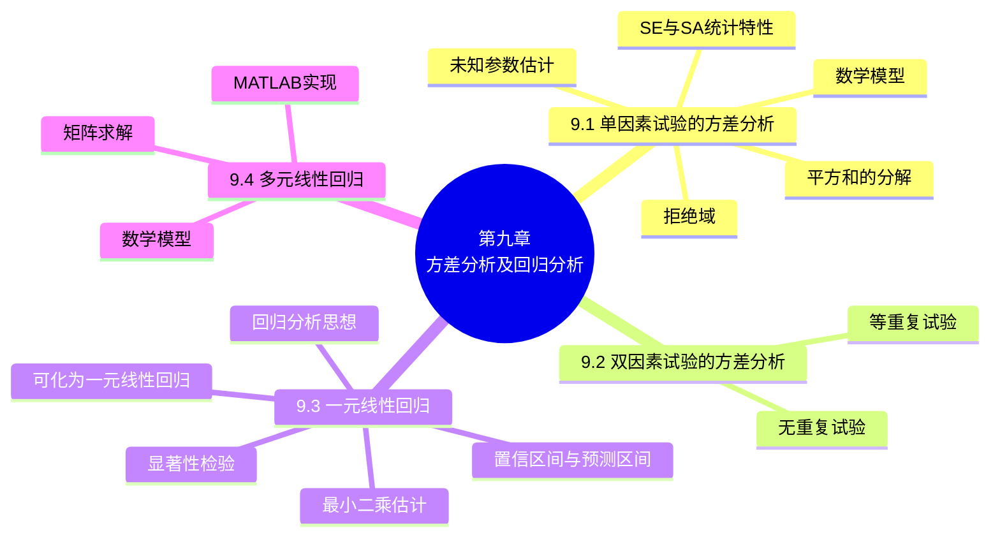

# 第九章 方差分析及回归分析

> **本章主线**：本章把第八章的假设检验推广到更复杂的实际问题。**方差分析**用于检验"多个（同方差）正态总体的均值是否相等"——通过把总偏差平方和分解为组内（误差）平方和与组间（效应）平方和，构造 $F$ 统计量检验各水平效应是否为零，涵盖**单因素试验**（$s$ 个水平）与**双因素试验**（等重复含交互作用、无重复两种情况）的方差分析表。**回归分析**用于研究变量之间的**相关关系**——一元线性回归模型 $Y = a + bx + \varepsilon$ 用最小二乘（最大似然）估计参数，检验回归显著性（$t$ 检验）、给出系数与回归函数值的置信区间与预测区间，并处理可化为一元线性回归的曲线问题；最后推广到**多元线性回归**（矩阵形式 $\hat{B} = (X'X)^{-1}X'Y$）及 MATLAB 实现（regress、polyfit、rstool、stepwise）。

## 9.1 单因素试验的方差分析

### 9.1.1 单因素试验

**方差分析**——根据试验的结果进行分析，鉴别各个有关因素对试验结果的影响程度。

- **试验指标**——试验中要考察的指标；
- **因素**——影响试验指标的条件（分为可控因素与不可控因素）；
- **水平**——因素所处的状态；
- **单因素试验**——在一项试验中只有一个因素改变；**多因素试验**——在一项试验中有多个因素在改变。

**例 1（铝合金板厚度）** 设有三台机器，用来生产规格相同的铝合金薄板。取样，测量薄板的厚度精确至千分之一厘米，得结果如下表（表 9.1）：

| 机器Ⅰ | 机器Ⅱ | 机器Ⅲ |
| :--: | :--: | :--: |
| 0.236 | 0.257 | 0.258 |
| 0.238 | 0.253 | 0.264 |
| 0.248 | 0.255 | 0.259 |
| 0.245 | 0.254 | 0.267 |
| 0.243 | 0.261 | 0.262 |

试验指标：薄板的厚度；因素：机器；水平：不同的三台机器是因素的三个不同的水平。假定除机器这一因素外其他条件相同，属于**单因素试验**。试验目的：考察各台机器所生产的薄板的厚度有无显著的差异，即考察机器这一因素对厚度有无显著的影响。

**例 2（电路响应时间）** 下表列出了随机选取的、用于计算器的四种类型的电路的响应时间（以毫秒计，表 9.2）：类型Ⅰ：19, 22, 20, 18；类型Ⅱ：15, 21, 33, 27；类型Ⅲ：20, 40, 15, 18, 26；类型Ⅳ：16, 17, 18, 22, 19。试验指标：电路的响应时间；因素：电路类型；水平：四种电路类型为因素的四个不同水平。单因素试验，考察电路类型这一因素对响应时间有无显著的影响。

**例 3（火箭射程，双因素）** 一火箭用四种燃料、三种推进器作射程试验，每种燃料与每种推进器的组合各发射火箭两次，得射程如下（表 9.3，以海里计）：燃料 $A_1$：58.2, 52.6, 56.2, 41.2, 65.3, 60.8；$A_2$：49.1, 42.8, 54.1, 50.5, 51.6, 48.4；$A_3$：60.1, 58.3, 70.9, 73.2, 39.2, 40.7；$A_4$：75.8, 71.5, 58.2, 51.0, 48.7, 41.4。试验指标：射程；因素：推进器和燃料；水平：推进器 3 个、燃料 4 个。双因素试验。

**问题分析（例 1）** 在每一个水平下进行独立试验，结果是一个随机变量，将数据看成是来自三个总体的样本值。设总体均值分别为 $\mu_1, \mu_2, \mu_3$，检验假设 $H_0: \mu_1 = \mu_2 = \mu_3$，$H_1: \mu_1, \mu_2, \mu_3$ 不全相等。进一步假设各总体均为正态变量，且各总体的方差相等，但参数均未知。问题——**检验同方差的多个正态总体均值是否相等**；解决方法——**方差分析法**。

### 9.1.2 数学模型

设因素 $A$ 有 $s$ 个水平 $A_1, A_2, \dots, A_s$，在水平 $A_j$（$j = 1, 2, \dots, s$）下进行 $n_j$（$n_j \geq 2$）次独立试验，得到表 9.4 的结果（第 $j$ 列样本 $X_{1j}, X_{2j}, \dots, X_{n_j j}$，样本总和 $T_{\cdot j}$，样本均值 $\bar{X}_{\cdot j}$，总体均值 $\mu_j$）。

**假设**：

1. 各个水平 $A_j$（$j = 1, 2, \dots, s$）下的样本 $X_{1j}, X_{2j}, \dots, X_{n_j j}$ 来自具有相同方差 $\sigma^2$、均值分别为 $\mu_j$（$j = 1, 2, \dots, s$）的正态总体 $N(\mu_j, \sigma^2)$，$\mu_j$ 与 $\sigma^2$ 均未知；
2. 不同水平 $A_j$ 下的样本之间相互独立。

因为 $X_{ij} \sim N(\mu_j, \sigma^2)$，所以 $X_{ij} - \mu_j \sim N(0, \sigma^2)$。记 $X_{ij} - \mu_j = \varepsilon_{ij}$ 表示随机误差，那么 $X_{ij}$ 可写成

$$X_{ij} = \mu_j + \varepsilon_{ij}, \qquad \varepsilon_{ij} \sim N(0, \sigma^2), \text{ 各 } \varepsilon_{ij} \text{ 独立}, \qquad i = 1, 2, \dots, n_j,\; j = 1, 2, \dots, s, \qquad \mu_j \text{ 与 } \sigma^2 \text{ 均未知}$$

——**单因素试验方差分析的数学模型**。

**需要解决的问题**：

1. 检验假设 $H_0: \mu_1 = \mu_2 = \dots = \mu_s$，$H_1: \mu_1, \mu_2, \dots, \mu_s$ 不全相等；
2. 估计未知参数 $\mu_1, \mu_2, \dots, \mu_s, \sigma^2$。

**数学模型的等价形式**：记 $n = \sum_{j=1}^{s} n_j$，$\mu = \dfrac{1}{n}\sum_{j=1}^{s} n_j \mu_j$（**总平均**），$\delta_j = \mu_j - \mu$（$j = 1, 2, \dots, s$，称为**水平 $A_j$ 的效应**，表示水平 $A_j$ 下的总体平均值与总平均的差异），且 $n_1\delta_1 + n_2\delta_2 + \dots + n_s\delta_s = 0$。原数学模型可改写为

$$X_{ij} = \mu + \delta_j + \varepsilon_{ij}, \qquad \varepsilon_{ij} \sim N(0, \sigma^2), \text{ 各 } \varepsilon_{ij} \text{ 独立}, \qquad i = 1, 2, \dots, n_j,\; j = 1, 2, \dots, s, \qquad \sum_{j=1}^{s} n_j \delta_j = 0$$

检验假设 $H_0: \mu_1 = \mu_2 = \dots = \mu_s$ 等价于 $H_0: \delta_1 = \delta_2 = \dots = \delta_s = 0$。

### 9.1.3 平方和的分解

记 $\bar{X} = \dfrac{1}{n}\sum_{j=1}^{s}\sum_{i=1}^{n_j} X_{ij}$ 为数据的总平均，$\bar{X}_{\cdot j} = \dfrac{1}{n_j}\sum_{i=1}^{n_j} X_{ij}$ 为水平 $A_j$ 下的样本平均值，则**总偏差平方和（总变差）**

$$S_T = \sum_{j=1}^{s}\sum_{i=1}^{n_j}(X_{ij} - \bar{X})^2 = \sum_{j=1}^{s}\sum_{i=1}^{n_j}\left[(X_{ij} - \bar{X}_{\cdot j}) + (\bar{X}_{\cdot j} - \bar{X})\right]^2$$

交叉项 $\sum_{j=1}^{s}\sum_{i=1}^{n_j}(X_{ij} - \bar{X}_{\cdot j})(\bar{X}_{\cdot j} - \bar{X}) = 0$（对每个 $j$ 求和后 $\sum_i (X_{ij} - \bar{X}_{\cdot j}) = 0$），故

$$S_T = S_E + S_A$$

其中

$$S_E = \sum_{j=1}^{s}\sum_{i=1}^{n_j}(X_{ij} - \bar{X}_{\cdot j})^2 \quad \text{（误差平方和）}, \qquad S_A = \sum_{j=1}^{s}\sum_{i=1}^{n_j}(\bar{X}_{\cdot j} - \bar{X})^2 = \sum_{j=1}^{s} n_j(\bar{X}_{\cdot j} - \bar{X})^2 = \sum_{j=1}^{s} n_j \bar{X}_{\cdot j}^2 - n\bar{X}^2 \quad \text{（效应平方和）}$$

### 9.1.4 $S_E$、$S_A$ 的统计特性

- $\sum_{i=1}^{n_j}(X_{ij} - \bar{X}_{\cdot j})^2$ 是 $N(\mu_j, \sigma^2)$ 的样本方差的 $n_j - 1$ 倍，即 $\dfrac{\sum_{i=1}^{n_j}(X_{ij} - \bar{X}_{\cdot j})^2}{\sigma^2} \sim \chi^2(n_j - 1)$。又由于各 $X_{ij}$ 独立，由 $\chi^2$ 分布的可加性知 $\dfrac{S_E}{\sigma^2} \sim \chi^2\left(\sum_{j=1}^{s}(n_j - 1)\right) = \chi^2(n - s)$。故 **$S_E$ 的自由度为 $n - s$**，且 $E(S_E) = (n-s)\sigma^2$；
- 因为 $\sum_{j=1}^{s} n_j(\bar{X}_{\cdot j} - \bar{X}) = \sum_{j=1}^{s}\sum_{i=1}^{n_j} X_{ij} - n\bar{X} = 0$，所以 $S_A$ 的自由度为 $s - 1$。又因为 $\bar{X} \sim N(\mu, \sigma^2/n)$，可算得
$$E(S_A) = E\left[\sum_{j=1}^{s} n_j \bar{X}_{\cdot j}^2 - n\bar{X}^2\right] = (s-1)\sigma^2 + \sum_{j=1}^{s} n_j \delta_j^2$$
- $S_A$ 与 $S_E$ **独立**；$H_0$ 为真时 $S_A/\sigma^2 \sim \chi^2(s-1)$。

### 9.1.5 假设检验问题的拒绝域

检验假设 $H_0: \delta_1 = \delta_2 = \dots = \delta_s = 0$，$H_1: \delta_1, \delta_2, \dots, \delta_s$ 不全为零。

- $H_0$ 为真时 $S_A/\sigma^2 \sim \chi^2(s-1)$，$E\left(\dfrac{S_A}{s-1}\right) = \sigma^2$，即 $\dfrac{S_A}{s-1}$ 是 $\sigma^2$ 的无偏估计；$H_1$ 为真时 $\sum_{j=1}^{s} n_j \delta_j^2 > 0$，$E\left(\dfrac{S_A}{s-1}\right) = \sigma^2 + \dfrac{1}{s-1}\sum_{j=1}^{s} n_j \delta_j^2 > \sigma^2$；
- 因为 $E(S_E) = (n-s)\sigma^2$，所以 $E\left(\dfrac{S_E}{n-s}\right) = \sigma^2$，即不管 $H_0$ 是否为真，$\dfrac{S_E}{n-s}$ 都是 $\sigma^2$ 的无偏估计；
- 考虑比值 $F = \dfrac{S_A/(s-1)}{S_E/(n-s)}$：分子和分母相互独立；分母的数学期望始终是 $\sigma^2$；$H_0$ 为真时分子的期望为 $\sigma^2$，$H_0$ 不真时分子取值有偏大的趋势。故拒绝域形如 $F = \dfrac{S_A/(s-1)}{S_E/(n-s)} \geq k$；
- 因为 $H_0$ 为真时 $S_A/\sigma^2 \sim \chi^2(s-1)$，$S_E/\sigma^2 \sim \chi^2(n-s)$，所以 $H_0$ 为真时 $F = \dfrac{S_A/(s-1)}{S_E/(n-s)} \sim F(s-1, n-s)$。

**检验假设 $H_0: \delta_1 = \dots = \delta_s = 0$ 的拒绝域为**

$$F = \frac{S_A/(s-1)}{S_E/(n-s)} \geq F_\alpha(s-1, n-s)$$

**单因素试验方差分析表**：

| 方差来源 | 平方和 | 自由度 | 均方 | F 比 |
| :-- | :--: | :--: | :--: | :--: |
| 因素 $A$ | $S_A$ | $s-1$ | $\bar{S}_A = \dfrac{S_A}{s-1}$ | $F = \dfrac{\bar{S}_A}{\bar{S}_E}$ |
| 误差 | $S_E$ | $n-s$ | $\bar{S}_E = \dfrac{S_E}{n-s}$ | |
| 总和 | $S_T$ | $n-1$ | | |

**实用计算公式**：记 $T_{\cdot j} = \sum_{i=1}^{n_j} X_{ij}$，$T_{\cdot\cdot} = \sum_{j=1}^{s}\sum_{i=1}^{n_j} X_{ij}$，则

$$S_T = \sum_{j=1}^{s}\sum_{i=1}^{n_j} X_{ij}^2 - \frac{T_{\cdot\cdot}^2}{n}, \qquad S_A = \sum_{j=1}^{s}\frac{T_{\cdot j}^2}{n_j} - \frac{T_{\cdot\cdot}^2}{n}, \qquad S_E = S_T - S_A$$

**例 4（铝合金板）** 例 1 中取 $\alpha = 0.05$，检验假设 $H_0: \mu_1 = \mu_2 = \mu_3$，$H_1: \mu_1, \mu_2, \mu_3$ 不全相等。

- $s = 3$，$n_1 = n_2 = n_3 = 5$，$n = 15$，计算得 $S_T = 0.00124533$，$S_A = 0.00105333$，$S_E = 0.000192$；

| 方差来源 | 平方和 | 自由度 | 均方 | F 比 |
| :-- | :--: | :--: | :--: | :--: |
| 因素 $A$ | 0.00105333 | 2 | 0.00052667 | 32.92 |
| 误差 | 0.000192 | 12 | 0.000016 | |
| 总和 | 0.00124533 | 14 | | |

- $F = 32.92 > F_{0.05}(2, 12) = 3.89$，在水平 0.05 下**拒绝 $H_0$**——各机器生产的薄板厚度有显著差异。

### 9.1.6 未知参数的估计

由 $E(\bar{X}) = \mu$，$E(\bar{X}_{\cdot j}) = \mu_j$（$j = 1, 2, \dots, s$），$E(S_E/(n-s)) = \sigma^2$，可得无偏估计

$$\hat{\mu} = \bar{X}, \qquad \hat{\mu}_j = \bar{X}_{\cdot j}, \qquad \hat{\sigma}^2 = \frac{S_E}{n-s}, \qquad \hat{\delta}_j = \bar{X}_{\cdot j} - \bar{X}, \quad j = 1, 2, \dots, s$$

若拒绝 $H_0$，需对两总体 $N(\mu_j, \sigma^2)$、$N(\mu_k, \sigma^2)$ 的均值差 $\mu_j - \mu_k = \delta_j - \delta_k$ 作出区间估计。因为 $E(\bar{X}_{\cdot j} - \bar{X}_{\cdot k}) = \mu_j - \mu_k$，$D(\bar{X}_{\cdot j} - \bar{X}_{\cdot k}) = \sigma^2\left(\dfrac{1}{n_j} + \dfrac{1}{n_k}\right)$，且 $\bar{X}_{\cdot j} - \bar{X}_{\cdot k}$ 与 $\hat{\sigma}^2 = S_E/(n-s)$ 独立，故 $\dfrac{(\bar{X}_{\cdot j} - \bar{X}_{\cdot k}) - (\mu_j - \mu_k)}{\hat{\sigma}\sqrt{\dfrac{1}{n_j} + \dfrac{1}{n_k}}} \sim t(n-s)$，均值差 $\mu_j - \mu_k$ 的置信水平为 $1-\alpha$ 的置信区间为

$$\left(\bar{X}_{\cdot j} - \bar{X}_{\cdot k} \pm t_{\alpha/2}(n-s)\,\hat{\sigma}\sqrt{\frac{1}{n_j} + \frac{1}{n_k}}\right)$$

**例 5（例 4 的参数估计）** 求例 4 中的未知参数 $\sigma^2$、$\mu_j$、$\delta_j$（$j = 1, 2, 3$）的点估计及均值差的置信水平为 0.95 的置信区间。

- $\hat{\sigma}^2 = \dfrac{S_E}{n-s} = 0.000016$；$\hat{\mu}_1 = \bar{x}_{\cdot 1} = 0.242$，$\hat{\mu}_2 = \bar{x}_{\cdot 2} = 0.256$，$\hat{\mu}_3 = \bar{x}_{\cdot 3} = 0.262$；
- $\hat{\mu} = \bar{x} = 0.253$，$\hat{\delta}_1 = \bar{x}_{\cdot 1} - \bar{x} = -0.011$，$\hat{\delta}_2 = \bar{x}_{\cdot 2} - \bar{x} = 0.003$，$\hat{\delta}_3 = \bar{x}_{\cdot 3} - \bar{x} = 0.009$；
- 因为 $t_{0.025}(n-s) = t_{0.025}(12) = 2.1788$，$t_{0.025}(12)\hat{\sigma}\sqrt{\dfrac{1}{n_j} + \dfrac{1}{n_k}} = 2.1788 \times 0.004 \times \sqrt{\dfrac{2}{5}} \approx 0.006$，所以
  - $\mu_1 - \mu_2$ 的置信区间为 $(0.242 - 0.256 \pm 0.006) = (-0.020, -0.008)$；
  - $\mu_1 - \mu_3$ 的置信区间为 $(0.242 - 0.262 \pm 0.006) = (-0.026, -0.014)$；
  - $\mu_2 - \mu_3$ 的置信区间为 $(0.256 - 0.262 \pm 0.006) = (-0.012, 0)$。

**例 6（电路响应时间）** 设四种类型电路的响应时间的总体均为正态，且各总体的方差相同，但参数均未知，各样本相互独立。取水平 $\alpha = 0.05$ 检验各类型电路的响应时间是否有显著差异（用 MATLAB 中 `anova1` 函数求解）。

**小结**：单因素试验方差分析的步骤——(1) 建立数学模型；(2) 分解平方和；(3) 研究统计特性；(4) 进行假设检验；(5) 估计未知参数。

---

## 9.2 双因素试验的方差分析

### 9.2.1 双因素等重复试验的方差分析

设因素 $A$ 有 $r$ 个水平 $A_1, A_2, \dots, A_r$，因素 $B$ 有 $s$ 个水平 $B_1, B_2, \dots, B_s$，对每个组合 $(A_i, B_j)$ 重复试验 $t$ 次，观测值记为 $X_{ijk}$（$i = 1, \dots, r$，$j = 1, \dots, s$，$k = 1, \dots, t$），如表 9.8。

**假设**：$X_{ijk} \sim N(\mu_{ij}, \sigma^2)$，各 $X_{ijk}$ 独立，$\mu_{ij}$、$\sigma^2$ 均为未知参数。

**记号**：记总平均 $\mu = \dfrac{1}{rs}\sum_{i=1}^{r}\sum_{j=1}^{s}\mu_{ij}$，$\mu_{i\cdot} = \dfrac{1}{s}\sum_{j=1}^{s}\mu_{ij}$，$\mu_{\cdot j} = \dfrac{1}{r}\sum_{i=1}^{r}\mu_{ij}$；**水平 $A_i$ 的效应** $\alpha_i = \mu_{i\cdot} - \mu$（$i = 1, \dots, r$），**水平 $B_j$ 的效应** $\beta_j = \mu_{\cdot j} - \mu$（$j = 1, \dots, s$），且 $\sum_{i=1}^{r}\alpha_i = 0$，$\sum_{j=1}^{s}\beta_j = 0$。则

$$\mu_{ij} = \mu + \alpha_i + \beta_j + \gamma_{ij}, \qquad \gamma_{ij} = \mu_{ij} - \mu_{i\cdot} - \mu_{\cdot j} + \mu$$

其中 $\gamma_{ij}$ 称为**水平 $A_i$ 和水平 $B_j$ 的交互效应**，且 $\sum_{i=1}^{r}\gamma_{ij} = 0$（$j = 1, \dots, s$），$\sum_{j=1}^{s}\gamma_{ij} = 0$（$i = 1, \dots, r$）——**双因素试验方差分析的数学模型**。

**检验假设**：

$$H_{01}: \alpha_1 = \alpha_2 = \dots = \alpha_r = 0, \quad H_{11}: \alpha_1, \alpha_2, \dots, \alpha_r \text{ 不全为零};$$
$$H_{02}: \beta_1 = \beta_2 = \dots = \beta_s = 0, \quad H_{12}: \beta_1, \beta_2, \dots, \beta_s \text{ 不全为零};$$
$$H_{03}: \gamma_{11} = \gamma_{12} = \dots = \gamma_{rs} = 0, \quad H_{13}: \gamma_{11}, \gamma_{12}, \dots, \gamma_{rs} \text{ 不全为零}.$$

**检验步骤**：1. 分解平方和；2. 研究统计特性；3. 确定拒绝域。

**1. 分解平方和**：记 $\bar{X} = \dfrac{1}{rst}\sum_{i=1}^{r}\sum_{j=1}^{s}\sum_{k=1}^{t} X_{ijk}$（总平均），$\bar{X}_{ij\cdot} = \dfrac{1}{t}\sum_{k=1}^{t} X_{ijk}$，$\bar{X}_{i\cdot\cdot} = \dfrac{1}{st}\sum_{j=1}^{s}\sum_{k=1}^{t} X_{ijk}$，$\bar{X}_{\cdot j\cdot} = \dfrac{1}{rt}\sum_{i=1}^{r}\sum_{k=1}^{t} X_{ijk}$，则总偏差平方和可分解为

$$S_T = \sum_{i=1}^{r}\sum_{j=1}^{s}\sum_{k=1}^{t}\left[(X_{ijk} - \bar{X}_{ij\cdot}) + (\bar{X}_{i\cdot\cdot} - \bar{X}) + (\bar{X}_{\cdot j\cdot} - \bar{X}) + (\bar{X}_{ij\cdot} - \bar{X}_{i\cdot\cdot} - \bar{X}_{\cdot j\cdot} + \bar{X})\right]^2$$

$$S_T = S_E + S_A + S_B + S_{A \times B}$$

（$S_E$ 误差平方和、$S_A$ 因素 $A$ 的效应平方和、$S_B$ 因素 $B$ 的效应平方和、$S_{A\times B}$ 因素 $A$、$B$ 的交互效应平方和。）

**2. 研究统计特性**（自由度与数学期望）：

| 平方和 | 自由度 | 数学期望 |
| :--: | :--: | :-- |
| $S_T$ | $rst - 1$ | |
| $S_E$ | $rs(t-1)$ | $rs(t-1)\sigma^2$ |
| $S_A$ | $r - 1$ | $(r-1)\sigma^2 + st\sum_{i=1}^{r}\alpha_i^2$ |
| $S_B$ | $s - 1$ | $(s-1)\sigma^2 + rt\sum_{j=1}^{s}\beta_j^2$ |
| $S_{A\times B}$ | $(r-1)(s-1)$ | $(r-1)(s-1)\sigma^2 + t\sum_{i=1}^{r}\sum_{j=1}^{s}\gamma_{ij}^2$ |

**3. 确定拒绝域**：当 $H_{01}: \alpha_1 = \dots = \alpha_r = 0$ 为真时，$F_A = \dfrac{S_A/(r-1)}{S_E/(rs(t-1))} \sim F(r-1, rs(t-1))$。取显著性水平为 $\alpha$，得假设 $H_{01}$ 的拒绝域为 $F_A \geq F_\alpha(r-1, rs(t-1))$；类似地，$H_{02}$ 的拒绝域为 $F_B = \dfrac{S_B/(s-1)}{S_E/(rs(t-1))} \geq F_\alpha(s-1, rs(t-1))$；$H_{03}$ 的拒绝域为 $F_{A\times B} = \dfrac{S_{A\times B}/((r-1)(s-1))}{S_E/(rs(t-1))} \geq F_\alpha((r-1)(s-1), rs(t-1))$。

**表 9.9 双因素试验的方差分析表**：

| 方差来源 | 平方和 | 自由度 | 均方 | F 比 |
| :-- | :--: | :--: | :--: | :--: |
| 因素 $A$ | $S_A$ | $r-1$ | $\bar{S}_A = \dfrac{S_A}{r-1}$ | $F_A = \dfrac{\bar{S}_A}{\bar{S}_E}$ |
| 因素 $B$ | $S_B$ | $s-1$ | $\bar{S}_B = \dfrac{S_B}{s-1}$ | $F_B = \dfrac{\bar{S}_B}{\bar{S}_E}$ |
| 交互作用 | $S_{A\times B}$ | $(r-1)(s-1)$ | $\bar{S}_{A\times B} = \dfrac{S_{A\times B}}{(r-1)(s-1)}$ | $F_{A\times B} = \dfrac{\bar{S}_{A\times B}}{\bar{S}_E}$ |
| 误差 | $S_E$ | $rs(t-1)$ | $\bar{S}_E = \dfrac{S_E}{rs(t-1)}$ | |
| 总和 | $S_T$ | $rst-1$ | | |

**例 1（火箭射程）** 例 3 的火箭射程数据假设符合双因素方差分析模型所需的条件，在水平 0.05 下检验不同燃料（因素 $A$）、不同推进器（因素 $B$）下的射程是否有显著差异，交互作用是否显著（用 MATLAB 中 `anova2(a, 2)` 函数求解）。

**例 2（金属材料强度）** 在某种金属材料的生产过程中，对热处理温度（因素 $B$）与时间（因素 $A$）各取两个水平，产品强度的测定结果（相对值）为：$A_1B_1$：38.0, 38.6；$A_1B_2$：47.0, 44.8；$A_2B_1$：45.0, 43.8；$A_2B_2$：42.4, 40.8。设各水平搭配下强度的总体服从正态分布且方差相同，各样本独立。问热处理温度、时间以及这两者的交互作用对产品强度是否有显著的影响（显著性水平 0.05，用 `anova2(a, 2)` 求解）。

### 9.2.2 双因素无重复试验的方差分析

检验两个因素的交互效应，对两个因素的每一组合至少要做两次试验。如果已知不存在交互作用，或已知交互作用对试验的指标影响很小，则可以不考虑交互作用——对两个因素的每一组合只做一次试验，也可以对各因素的效应进行分析，即**双因素无重复试验的方差分析**（表 9.14）。

**假设**：$X_{ij} \sim N(\mu_{ij}, \sigma^2)$，各 $X_{ij}$ 独立，$\mu_{ij}$、$\sigma^2$ 均为未知参数。由于不存在交互作用，$\gamma_{ij} = 0$，$\mu_{ij} = \mu + \alpha_i + \beta_j$。

**检验假设**：$H_{01}: \alpha_1 = \dots = \alpha_r = 0$；$H_{02}: \beta_1 = \dots = \beta_s = 0$。

**表 9.15 双因素无重复试验的方差分析表**：

| 方差来源 | 平方和 | 自由度 | 均方 | F 比 |
| :-- | :--: | :--: | :--: | :--: |
| 因素 $A$ | $S_A$ | $r-1$ | $\bar{S}_A = \dfrac{S_A}{r-1}$ | $F_A = \dfrac{\bar{S}_A}{\bar{S}_E}$ |
| 因素 $B$ | $S_B$ | $s-1$ | $\bar{S}_B = \dfrac{S_B}{s-1}$ | $F_B = \dfrac{\bar{S}_B}{\bar{S}_E}$ |
| 误差 | $S_E$ | $(r-1)(s-1)$ | $\bar{S}_E = \dfrac{S_E}{(r-1)(s-1)}$ | |
| 总和 | $S_T$ | $rs-1$ | | |

取显著性水平为 $\alpha$，$H_{01}$ 的拒绝域为 $F_A \geq F_\alpha(r-1, (r-1)(s-1))$；$H_{02}$ 的拒绝域为 $F_B \geq F_\alpha(s-1, (r-1)(s-1))$。

**例 3（空气颗粒物）** 下面给出了在某 5 个不同地点、不同时间空气中的颗粒状物（以 $\text{mg/m}^3$ 计）的含量的数据（因素 A 时间：1975 年 10 月、1976 年 1 月、1976 年 5 月、1996 年 8 月；因素 B 地点 1~5）：

| 时间 \ 地点 | 1 | 2 | 3 | 4 | 5 | $T_{i\cdot}$ |
| :--: | :--: | :--: | :--: | :--: | :--: | :--: |
| 1975 年 10 月 | 76 | 67 | 81 | 56 | 51 | 331 |
| 1976 年 1 月 | 82 | 69 | 96 | 59 | 70 | 376 |
| 1976 年 5 月 | 68 | 59 | 67 | 54 | 42 | 290 |
| 1996 年 8 月 | 63 | 56 | 64 | 58 | 37 | 278 |
| $T_{\cdot j}$ | 289 | 251 | 308 | 227 | 200 | 1275 |

设本题符合模型中的条件，在显著性水平为 0.05 下检验：在不同时间下颗粒状物含量的均值有无显著差异，在不同地点下颗粒状物含量的均值有无显著差异（用 `anova2(a)` 求解）。

---

## 9.3 一元线性回归

### 9.3.1 回归分析的基本思想

变量之间的关系分为**确定性关系**与**相关关系**（如身高和体重）。相关关系的特征是：变量之间的关系很难用精确的方法表示出来。确定性关系在实际问题中往往通过相关关系表示出来；另一方面，当对事物内部规律了解得更加深刻时，相关关系也有可能转化为确定性关系。

**回归分析**——处理变量之间的相关关系的一种数学方法，它是最常用的数理统计方法（分为一元线性回归分析、多元线性回归分析、非线性回归分析）。

设随机变量 $Y$（因变量）和普通变量 $x$（自变量）之间存在着相关关系，$F(y|x)$ 表示当 $x$ 取确定值时 $Y$ 的分布函数。考察 $Y$ 的数学期望 $E(Y)$——称为 **$Y$ 关于 $x$ 的回归函数** $\mu(x)$。因为对随机变量 $\eta$，当 $c = E(\eta)$ 时 $E[(\eta-c)^2]$ 达到最小，所以在一切 $x$ 的函数中以回归函数 $\mu(x)$ 作为 $Y$ 的近似，均方误差 $E[(Y-\mu(x))^2]$ 为最小。实际问题中的 $\mu(x)$ 一般未知。**回归分析的任务**——根据试验数据估计回归函数；讨论回归函数中参数的点估计、区间估计；对回归函数中的参数或回归函数本身进行假设检验；利用回归函数进行预测与控制等等。

**问题的一般提法**：对 $x$ 的一组不完全相同的值 $x_1, x_2, \dots, x_n$，设 $Y_1, Y_2, \dots, Y_n$ 分别是在 $x_1, x_2, \dots, x_n$ 处对 $Y$ 的独立观察结果，称 $(x_1, Y_1), (x_2, Y_2), \dots, (x_n, Y_n)$ 是一个样本，对应的样本值记为 $(x_1, y_1), (x_2, y_2), \dots, (x_n, y_n)$。利用样本来估计 $Y$ 关于 $x$ 的回归函数 $\mu(x)$。

**求解步骤**：

1. **推测回归函数的形式**：方法一，根据专业知识或经验公式确定；方法二，作散点图观察。

**例 1（温度对得率）** 为研究某一化学反应过程中温度 $x$（°C）对产品得率 $Y$（%）的影响，测得数据如下：温度 $x$：100, 110, 120, 130, 140, 150, 160, 170, 180, 190；得率 $Y$：45, 51, 54, 61, 66, 70, 74, 78, 85, 89。观察散点图，$\mu(x)$ 具有线性函数 $a + bx$ 的形式。

### 9.3.2 一元线性回归的数学模型

**假设**：对于 $x$ 的每一个值有 $Y \sim N(a + bx, \sigma^2)$，$a$、$b$、$\sigma^2$ 都是不依赖于 $x$ 的未知参数。记 $\varepsilon = Y - (a + bx)$，那么

$$Y = a + bx + \varepsilon, \qquad \varepsilon \sim N(0, \sigma^2)$$

——**一元线性回归模型**（$x$ 的线性函数 + 随机误差）。

### 9.3.3 未知参数 $a$、$b$ 的估计

对于样本 $(x_1, Y_1), (x_2, Y_2), \dots, (x_n, Y_n)$，$Y_i = a + bx_i + \varepsilon_i$，$\varepsilon_i \sim N(0, \sigma^2)$ 各 $\varepsilon_i$ 相互独立，于是 $Y_i \sim N(a + bx_i, \sigma^2)$。用**最大似然估计**估计未知参数 $a$、$b$：对于任意一组观察值 $y_1, y_2, \dots, y_n$，样本的似然函数为 $L = \left(\dfrac{1}{\sigma\sqrt{2\pi}}\right)^n\exp\left[-\dfrac{1}{2\sigma^2}\sum_{i=1}^{n}(y_i - a - bx_i)^2\right]$，$L$ 取最大值等价于 $Q(a, b) = \sum_{i=1}^{n}(y_i - a - bx_i)^2$ 取最小值。令 $\dfrac{\partial Q}{\partial a} = -2\sum_{i=1}^{n}(y_i - a - bx_i) = 0$，$\dfrac{\partial Q}{\partial b} = -2\sum_{i=1}^{n}(y_i - a - bx_i)x_i = 0$，得**正规方程组**

$$\begin{cases} na + \left(\sum_{i=1}^{n} x_i\right)b = \sum_{i=1}^{n} y_i, \\ \left(\sum_{i=1}^{n} x_i\right)a + \left(\sum_{i=1}^{n} x_i^2\right)b = \sum_{i=1}^{n} x_i y_i, \end{cases}$$

解得（当 $\sum(x_i - \bar{x})^2 \neq 0$ 时）

$$\hat{b} = \frac{\sum_{i=1}^{n}(x_i - \bar{x})(y_i - \bar{y})}{\sum_{i=1}^{n}(x_i - \bar{x})^2}, \qquad \hat{a} = \bar{y} - \hat{b}\bar{x}, \qquad \text{其中 } \bar{x} = \frac{1}{n}\sum_{i=1}^{n} x_i, \; \bar{y} = \frac{1}{n}\sum_{i=1}^{n} y_i$$

称 $\hat{y} = \hat{a} + \hat{b}x$ 为**回归方程**（回归直线）。由于 $\hat{a} = \bar{y} - \hat{b}\bar{x}$，**回归直线通过散点图的几何中心 $(\bar{x}, \bar{y})$**。

记

$$S_{xx} = \sum_{i=1}^{n}(x_i - \bar{x})^2, \qquad S_{yy} = \sum_{i=1}^{n}(y_i - \bar{y})^2, \qquad S_{xy} = \sum_{i=1}^{n}(x_i - \bar{x})(y_i - \bar{y})$$

**例 2（例 1 的回归方程）** 例 1 中的随机变量 $Y$ 符合一元线性回归模型所述的条件，求 $Y$ 关于 $x$ 的线性回归方程（用 MATLAB 中 `polytool(x, y, 1, 0.05)` 求解）。

**$\sigma^2$ 的估计**：$E\{[Y - (a+bx)]^2\} = E(\varepsilon^2) = \sigma^2$，$\sigma$ 越小，用回归函数 $\mu(x) = a + bx$ 作为 $Y$ 的近似导致的均方误差就越小。记 $\hat{y}_i = \hat{y}_{x=x_i} = \hat{a} + \hat{b}x_i$ 为 $x_i$ 处的**残差**，残差平方和

$$Q_e = \sum_{i=1}^{n}(y_i - \hat{y}_i)^2 = \sum_{i=1}^{n}\left[y_i - \bar{y} - \hat{b}(x_i - \bar{x})\right]^2 = S_{yy} - \hat{b}S_{xy}$$

可以证明 $\dfrac{Q_e}{\sigma^2} \sim \chi^2(n-2)$，从而 $E\left(\dfrac{Q_e}{\sigma^2}\right) = n-2$，$E\left(\dfrac{Q_e}{n-2}\right) = \sigma^2$，$\sigma^2$ 的无偏估计量为

$$\hat{\sigma}^2 = \frac{Q_e}{n-2} = \frac{1}{n-2}\left[S_{yy} - \hat{b}S_{xy}\right]$$

**例 3（例 2 的方差估计）** 求例 2 中方差的无偏估计：$Q_e = \sum_{i=1}^{10}(\text{residuals})^2 = 7.2236$，$\hat{\sigma}^2 = \dfrac{7.2236}{8} = 0.9030$。

### 9.3.4 线性假设的显著性检验

检验假设 $H_0: b = 0$，$H_1: b \neq 0$。由 $\hat{b} \sim N\left(b, \dfrac{\sigma^2}{S_{xx}}\right)$，$\dfrac{(n-2)\hat{\sigma}^2}{\sigma^2} = \dfrac{Q_e}{\sigma^2} \sim \chi^2(n-2)$，并且 $\hat{b}$、$Q_e$ 相互独立，因此 $\dfrac{\hat{b} - b}{\hat{\sigma}}\sqrt{S_{xx}} \sim t(n-2)$。当 $H_0$ 为真时 $b = 0$，此时 $t = \dfrac{\hat{b}}{\hat{\sigma}}\sqrt{S_{xx}} \sim t(n-2)$，并且 $E(\hat{b}) = b = 0$，得 $H_0$ 的拒绝域为

$$|t| = \left|\frac{\hat{b}}{\hat{\sigma}}\sqrt{S_{xx}}\right| \geq t_{\alpha/2}(n-2)$$

- **拒绝 $H_0: b = 0$**，认为回归效果显著；
- **接受 $H_0: b = 0$**，认为回归效果不显著。

回归效果不显著的原因分析：(1) 影响 $Y$ 取值的，除 $x$ 及随机误差外还有其他不可忽略的因素；(2) $E(Y)$ 与 $x$ 的关系不是线性的；(3) $Y$ 与 $x$ 不存在关系。

**例 4（例 2 的显著性检验）** 检验例 2 中的回归效果是否显著，取显著性水平为 0.05。已知 $\hat{b} = 0.4830$，$S_{xx} = 8250$，$\hat{\sigma}^2 = 0.9030$，查表得 $t_{\alpha/2}(n-2) = t_{0.025}(8) = 2.3060$。$t = \dfrac{0.4830}{\sqrt{0.9030}}\sqrt{8250} = 46.25 > 2.3060$，拒绝 $H_0: b = 0$，认为回归效果显著。

### 9.3.5 系数 $b$ 的置信区间

当回归效果显著时，对系数 $b$ 作区间估计。系数 $b$ 的置信水平为 $1-\alpha$ 的置信区间为

$$\left(\hat{b} \pm t_{\alpha/2}(n-2)\,\frac{\hat{\sigma}}{\sqrt{S_{xx}}}\right)$$

例如求例 1 中 $b$ 的置信水平为 0.95 的置信区间：$\left(0.4830 \pm 2.3060 \times \sqrt{\dfrac{0.9030}{8250}}\right) = (0.45894, 0.50712)$。

### 9.3.6 回归函数函数值的点估计和置信区间

$\mu(x) = a + bx$ 在 $x = x_0$ 处的估计量：$\hat{Y}_0 = \hat{\mu}(x_0) = \hat{a} + \hat{b}x_0$。因为 $E(\hat{Y}_0) = a + bx_0$，所以估计量是无偏的。由 $\dfrac{\hat{Y}_0 - (a + bx_0)}{\sigma\sqrt{\dfrac{1}{n} + \dfrac{(x_0-\bar{x})^2}{S_{xx}}}} \sim N(0, 1)$ 及 $\dfrac{(n-2)\hat{\sigma}^2}{\sigma^2} = \dfrac{Q_e}{\sigma^2} \sim \chi^2(n-2)$，且 $Q_e$、$\hat{Y}_0$ 相互独立，得 $\mu(x_0) = a + bx_0$ 的置信水平为 $1-\alpha$ 的置信区间为

$$\left(\hat{Y}_0 \pm t_{\alpha/2}(n-2)\,\hat{\sigma}\sqrt{\frac{1}{n} + \frac{(x_0-\bar{x})^2}{S_{xx}}}\right), \qquad \text{或} \qquad \left(\hat{a} + \hat{b}x_0 \pm t_{\alpha/2}(n-2)\,\hat{\sigma}\sqrt{\frac{1}{n} + \frac{(x_0-\bar{x})^2}{S_{xx}}}\right)$$

### 9.3.7 $Y$ 的观察值的点预测和预测区间

设 $Y_0$ 是在 $x = x_0$ 处对 $Y$ 的观察结果，$Y_0 = a + bx_0 + \varepsilon_0$，$\varepsilon_0 \sim N(0, \sigma^2)$。给定置信水平为 $1-\alpha$，$Y_0$ 的预测区间为

$$\left(\hat{Y}_0 \pm t_{\alpha/2}(n-2)\,\hat{\sigma}\sqrt{1 + \frac{1}{n} + \frac{(x_0-\bar{x})^2}{S_{xx}}}\right)$$

**例 5（续例 2）** (1) 求回归函数 $\mu(x)$ 在 $x = 125$ 处的值 $\mu(125)$ 的置信水平为 0.95 的置信区间，求在 $x = 125$ 处 $Y$ 的新观察值 $Y_0$ 的置信水平为 0.95 的预测区间；(2) 求在 $x = x_0$ 处 $Y$ 的新观察值 $Y_0$ 的置信水平为 0.95 的预测区间。

- (1) 已知 $\hat{b} = 0.4830$，$\hat{a} = -2.7394$，$S_{xx} = 8250$，$\hat{\sigma}^2 = 0.9030$，$\bar{x} = 145$，查表得 $t_{0.025}(8) = 2.3060$；
- 计算 $\hat{Y}_0 = \hat{Y}_{x=125} = -2.7394 + 0.4830 \times 125 = 57.64$；
- $t_{\alpha/2}(n-2)\hat{\sigma}\sqrt{\dfrac{1}{n} + \dfrac{(x_0-\bar{x})^2}{S_{xx}}} = 0.84$（$\mu(125)$ 置信区间的半宽）；$t_{\alpha/2}(n-2)\hat{\sigma}\sqrt{1 + \dfrac{1}{n} + \dfrac{(x_0-\bar{x})^2}{S_{xx}}} = 2.34$（$Y_0$ 预测区间的半宽）；
- 回归函数 $\mu(x)$ 在 $x = 125$ 处的值 $\mu(125)$ 的置信水平为 0.95 的置信区间为 $57.64 \pm 0.84$，即 $(56.80, 58.48)$；在 $x_0 = 125$ 处 $Y$ 的新观察值 $Y_0$ 的置信水平为 0.95 的预测区间为 $57.64 \pm 2.34$，即 $(55.30, 59.98)$。

### 9.3.8 可化为一元线性回归的问题

方法——通过适当的**变量变换**，化成一元线性回归问题进行分析处理。

- **指数函数 $Y = \alpha e^{\beta x}\varepsilon$**：两边取对数，$\ln Y = \ln\alpha + \beta x + \ln\varepsilon$，令 $Y' = a + bx' + \varepsilon'$，$\varepsilon' \sim N(0, \sigma^2)$；
- **幂函数 $Y = \alpha x^\beta \varepsilon$**：两边取对数，$\ln Y = \ln\alpha + \beta\ln x + \ln\varepsilon$，得 $Y' = a + bx' + \varepsilon'$。

**例 6（旧轿车价格）** 表 9.18 是 1957 年美国旧轿车价格的调查资料，以 $x$ 表示轿车的使用年数、$Y$ 表示相应的平均价格（美元）：年数 $x$：1, 2, 3, 4, 5, 6, 7, 8, 9, 10；价格 $Y$：2651, 1943, 1494, 1087, 765, 538, 484, 290, 226, 204。求 $Y$ 关于 $x$ 的回归方程。

- 作散点图观察，选择指数模型 $Y = \alpha e^{\beta x}\varepsilon$，令 $\ln Y = Y'$，$\ln\alpha = a$，$\beta = b$，$x = x'$，$\ln\varepsilon = \varepsilon'$；
- 数据变换后求回归方程得 $\hat{b} = -0.2977$，$\hat{a} = 8.1646$，$\hat{y}' = -0.2977x + 8.1646$；
- 线性假设的显著性检验：$t = \dfrac{\hat{b}}{\hat{\sigma}}\sqrt{S_{xx}} = 32.3693 > t_{0.025}(8) = 2.3060$，线性回归效果高度显著；
- 代回原变量得**曲线回归方程** $\hat{y} = \exp(\hat{y}') = \exp(-0.2977x + 8.1646) = 3514.3\,e^{-0.2977x}$。

**小结**：回归分析的任务是研究变量之间的相关关系；一元线性回归的步骤——(1) 推测回归函数；(2) 建立回归模型；(3) 估计未知参数；(4) 进行假设检验；(5) 预测与控制。可化为一元线性回归的问题，关键：选择适当的变量代换。

---

## 9.4 多元线性回归

### 9.4.1 多元线性回归的数学模型

实际问题中的随机变量 $Y$ 通常与多个普通变量 $x_1, x_2, \dots, x_p$（$p > 1$）有关。对于自变量 $x_1, x_2, \dots, x_p$ 的一组确定值，$Y$ 具有一定的分布；若 $Y$ 的数学期望存在，则它是 $x_1, x_2, \dots, x_p$ 的函数。若 $\mu(x_1, x_2, \dots, x_p)$ 是 $x_1, x_2, \dots, x_p$ 的线性函数，则得**多元线性回归模型**

$$Y = b_0 + b_1 x_1 + \dots + b_p x_p + \varepsilon, \qquad \varepsilon \sim N(0, \sigma^2)$$

### 9.4.2 数学模型的分析与求解

设 $(x_{11}, x_{12}, \dots, x_{1p}, y_1), \dots, (x_{n1}, x_{n2}, \dots, x_{np}, y_n)$ 是一个样本，用最大似然估计法估计参数。取 $\hat{b}_0, \hat{b}_1, \dots, \hat{b}_p$，使 $Q = \sum_{i=1}^{n}(y_i - b_0 - b_1 x_{i1} - \dots - b_p x_{ip})^2$ 达到最小。令 $\dfrac{\partial Q}{\partial b_0} = 0$，$\dfrac{\partial Q}{\partial b_j} = 0$（$j = 1, 2, \dots, p$），化简得**正规方程组**

$$\begin{cases} b_0 n + b_1\sum x_{i1} + b_2\sum x_{i2} + \dots + b_p\sum x_{ip} = \sum y_i, \\ b_0\sum x_{i1} + b_1\sum x_{i1}^2 + b_2\sum x_{i1}x_{i2} + \dots + b_p\sum x_{i1}x_{ip} = \sum x_{i1}y_i, \\ \vdots \\ b_0\sum x_{ip} + b_1\sum x_{ip}x_{i1} + b_2\sum x_{ip}x_{i2} + \dots + b_p\sum x_{ip}^2 = \sum x_{ip}y_i \end{cases}$$

引入矩阵 $X = \begin{pmatrix} 1 & x_{11} & x_{12} & \dots & x_{1p} \\ 1 & x_{21} & x_{22} & \dots & x_{2p} \\ \vdots & \vdots & \vdots & & \vdots \\ 1 & x_{n1} & x_{n2} & \dots & x_{np} \end{pmatrix}$，$Y = \begin{pmatrix} y_1 \\ y_2 \\ \vdots \\ y_n \end{pmatrix}$，$B = \begin{pmatrix} b_0 \\ b_1 \\ \vdots \\ b_p \end{pmatrix}$，正规方程组的矩阵形式为 $(X'X)B = X'Y$，最大似然估计值为

$$\hat{B} = \begin{pmatrix} \hat{b}_0 \\ \hat{b}_1 \\ \vdots \\ \hat{b}_p \end{pmatrix} = (X'X)^{-1}X'Y$$

$\mu(x_1, x_2, \dots, x_p) = b_0 + b_1 x_1 + \dots + b_p x_p$ 的估计是 $\hat{y} = \hat{b}_0 + \hat{b}_1 x_1 + \hat{b}_2 x_2 + \dots + \hat{b}_p x_p$——**P 元经验线性回归方程**。

### 9.4.3 MATLAB 中回归分析的实现

**多元线性回归**：1. 确定回归系数的点估计值，用命令 `b = regress(Y, X)`；2. 求回归系数的点估计和区间估计并检验回归模型，用命令 `[b, bint, r, rint, stats] = regress(Y, X, alpha)`；3. 画出残差及其置信区间，用命令 `rcoplot(r, rint)`。

**符号说明**：(1) $X$、$Y$ 为数据矩阵，$b = \hat{B} = (X'X)^{-1}X'Y$（一元线性回归取 $p = 1$）；(2) `alpha` 为显著性水平，默认为 0.05；(3) `bint` 为回归系数的区间估计；(4) `r` 与 `rint` 分别为残差及其置信区间；(5) `stats` 是用于检验回归模型的统计量，有三个数值：第一个是**相关系数 $r^2$**（越接近 1 说明回归方程越显著）；第二个是 **$F$ 值**（$F > F_{1-\alpha}(p, n-p-1)$ 时拒绝 $H_0$，$F$ 越大回归方程越显著）；第三个是与 $F$ 对应的概率 $p$（$p < \alpha$ 时拒绝，回归模型成立）。

**例 1（身高与腿长）** 测得 16 名女子的身高和腿长如下（单位：cm）：身高：143, 145, 146, 147, 149, 150, 153, 154, 155, 156, 157, 158, 159, 160, 162, 164；腿长：88, 85, 88, 91, 92, 93, 93, 95, 96, 98, 97, 96, 98, 99, 100, 102。试研究这些数据之间的关系。

- 用 MATLAB `regress` 求解得 $\hat{b}_0 = -16.0730$，$\hat{b}_1 = 0.7194$；$\hat{b}_0$ 的置信区间 $(-33.7071, 1.5612)$，$\hat{b}_1$ 的置信区间 $(0.6047, 0.834)$；
- $r^2 = 0.9282$，$F = 180.9531$，$p = 0.0000$。$p < 0.05$，回归模型 $y = -16.0730 + 0.7194x$ 成立。

**一元多项式回归**：1. 确定多项式系数，用命令 `[p, S] = polyfit(x, y, m)`（$p = (a_1, a_2, \dots, a_{m+1})$ 确定多项式 $y = a_1 x^m + a_2 x^{m-1} + \dots + a_m x + a_{m+1}$，$S$ 是估计预测误差的矩阵；也可用 `polytool(x, y, m)`）；2. 预测和预测误差估计，用命令 `Y = polyval(p, x)` 求回归多项式在 $x$ 处的预测值 $Y$，`[Y, DELTA] = polyconf(p, x, S, alpha)` 求预测值 $Y$ 及显著性为 $1-\alpha$ 的置信区间 $Y \pm \text{DELTA}$（`alpha` 默认 0.05）。一元多项式回归可化为多元线性回归求解。

**例 2（单价与批量）** 某种产品每件平均单价 $Y$（元）与批量 $x$（件）之间的关系的一组数据：$x$：20, 25, 30, 35, 40, 50, 60, 65, 70, 75, 80, 90；$y$：1.81, 1.70, 1.65, 1.55, 1.48, 1.40, 1.30, 1.26, 1.24, 1.21, 1.20, 1.18。试用一元二次多项式进行回归分析（用 `[p, S] = polyfit(x, y, 2)` 求解，也可化为多元线性回归 `X = [ones(12,1), x', (x.^2)']`，结果一致）。

**多元二项式回归**：`rstool(x, y, 'model', alpha)`，其中 `model` 为下列四种模型之一（默认为线性）：线性 $y = \beta_0 + \beta_1 x_1 + \dots + \beta_m x_m$；纯二次 $y = \beta_0 + \beta_1 x_1 + \dots + \beta_m x_m + \sum_{j=1}^{m}\beta_{jj}x_j^2$；交叉 $y = \beta_0 + \beta_1 x_1 + \dots + \beta_m x_m + \sum_{1 \leq j \neq k \leq m}\beta_{jk}x_j x_k$；完全二次 $y = \beta_0 + \beta_1 x_1 + \dots + \beta_m x_m + \sum_{1 \leq j, k \leq m}\beta_{jk}x_j x_k$。`rstool` 输出交互式画面，其中剩余标准差最接近于零的模型回归效果最好。

**例 3（商品需求量）** 设某商品的需求量与消费者的平均收入、商品价格的统计数据如下（需求量：100, 75, 80, 70, 50, 65, 90, 100, 110, 60；收入：1000, 600, 1200, 500, 300, 400, 1300, 1100, 1300, 300；价格：5, 7, 6, 6, 8, 7, 5, 4, 3, 9），建立回归模型，预测平均收入为 1000、价格为 6 时的商品需求量。

- 选择纯二次模型 $y = \beta_0 + \beta_1 x_1 + \beta_2 x_2 + \beta_{11}x_1^2 + \beta_{22}x_2^2$，用 `rstool(x, y, 'purequadratic')` 求解；
- 化为多元线性回归求解，回归模型的统计量：相关系数 $r^2 = 0.9702$ 接近于 1，回归方程显著；$F = 40.6656 > F_{0.95}(4, 5) = 6.26$，回归方程显著；$p = 0.0005 < \alpha = 0.05$，回归模型成立。

**逐步回归分析**：在实际问题中，影响因变量的因素很多，而这些因素之间可能存在多重共线性。为得到可靠的回归模型，需要一种方法能有效地从众多因素中挑选出对因变量贡献大的因素。如果采用多元线性回归分析，回归方程稳定性差、预测可靠性低；如果采用了影响小的变量、遗漏了重要变量，可能导致估计量产生偏倚和不一致性。"**最优**"的回归方程应该包含所有有影响的变量而不包括影响不显著的变量。选择"最优"回归方程的方法：1. 从所有可能的变量组合的回归方程中选择最优者；2. 从包含全部变量的回归方程中逐次剔除不显著因子；3. 从一个变量开始，把变量逐个引入方程；4. "有进有出"的逐步回归分析。

**逐步回归分析法**在筛选变量方面比较理想，是目前较常用的方法。它从一个自变量开始，根据自变量作用的显著程度从大到小地依次逐个引入回归方程，但当引入的自变量由于后面变量的引入而变得不显著时要将其剔除掉。引入一个自变量或从回归方程中剔除一个自变量，为逐步回归的一步，对于每一步都进行检验，以确保每次引入新的显著性变量前回归方程中只包含作用显著的变量。反复进行上面的过程，直到没有不显著的变量从回归方程中剔除，也没有显著变量可引入到回归方程。函数：`stepwise(x, y, inmodel, alpha)`。

**例 4（水泥放热）** 水泥凝固时放出的热量 $y$ 与水泥中的四种化学成分 $x_1, x_2, x_3, x_4$ 有关（13 组数据），试用逐步回归法确定一个线性模型（用 `stepwise(x, y)` 求解）。对变量 $y$ 和 $x_1, x_2$ 作线性回归，回归模型为 $\hat{y} = \hat{b}_0 + \hat{b}_1 x_1 + \hat{b}_2 x_2$，三个统计量表明回归效果显著。

**小结**：多元线性回归的数学模型 $Y = b_0 + b_1 x_1 + \dots + b_p x_p + \varepsilon$；求解 $\hat{B} = (X'X)^{-1}X'Y$，$\hat{y} = \hat{b}_0 + \hat{b}_1 x_1 + \dots + \hat{b}_p x_p$；MATLAB 中回归分析的实现——多元线性回归 `regress`、一元多项式回归 `polyfit`、多元二项式回归 `rstool`、逐步回归分析 `stepwise`。

---

### 知识定位与框架衔接

**前置知识**：第八章的 $F$ 检验与 $\chi^2$ 分布是方差分析的统计工具（$F = \dfrac{S_A/(s-1)}{S_E/(n-s)}$）；第六章的 $\chi^2$ 分布可加性与正态样本分布支撑平方和的分布推导；第四章的期望方差性质用于计算 $E(S_A)$、$E(S_E)$；第七章的最大似然估计法用于回归参数的估计（最小二乘是最大似然的等价形式）；第八章的 $t$ 检验用于回归系数的显著性检验。

**后置知识**：本章是数理统计的应用篇——方差分析是试验设计、质量控制与农业/生物统计的核心工具（ANOVA、随机区组设计）；一元线性回归是最小二乘理论与相关分析的起点，其置信区间/预测区间框架推广为广义线性模型与机器学习中的回归任务；多元线性回归的矩阵形式（$\hat{B} = (X'X)^{-1}X'Y$）是计量经济学、数据分析中回归建模的标准形式；逐步回归与模型选择是特征选择（LASSO、前向/后向选择）的雏形。

**故事比喻**：可以把方差分析想象成"厨师评比"——多个厨师（因素水平）做同一道菜（试验指标），把"菜品差异"分解为"厨师手艺差异"（组间 $S_A$）与"随机品尝误差"（组内 $S_E$），若手艺差异显著大于随机误差（$F$ 比足够大），就判定厨师们的手艺确有差别。回归分析则像"找规律"——在散点图上画一条最贴近所有点的直线（最小二乘），并评估这条线"靠谱程度"（$t$ 检验、$r^2$、置信区间），再用它预测新 $x$ 处的 $y$。

**四个灵魂问题**：

1. **"为什么方差分析不用两两 $t$ 检验？"** —— 对 $s$ 个水平两两做 $t$ 检验需 $C_s^2$ 次且多重比较会累积第一类错误；方差分析用一次 $F$ 检验同时判断"所有均值是否相等"，并可通过平方和分解度量各因素（含交互作用）的贡献。
2. **"$F$ 比为什么能检验均值相等？"** —— $F = \dfrac{S_A/(s-1)}{S_E/(n-s)}$：分母 $\dfrac{S_E}{n-s}$ 恒是 $\sigma^2$ 的无偏估计；分子在 $H_0$（效应为零）时为 $\sigma^2$ 的无偏估计，$H_1$ 时偏大（多出 $\dfrac{1}{s-1}\sum n_j\delta_j^2$）——分子显著大于分母即拒绝 $H_0$。
3. **"最小二乘与最大似然为何等价？"** —— 正态误差下似然函数 $L \propto \exp\left[-\dfrac{1}{2\sigma^2}\sum(y_i - a - bx_i)^2\right]$，最大化 $L$ 即最小化残差平方和 $Q(a,b)$——最小二乘估计正是正态模型下的最大似然估计。
4. **"回归中的置信区间与预测区间有何区别？"** —— 置信区间是"回归函数值 $\mu(x_0)$ 的区间"（半宽 $\hat{\sigma}\sqrt{\dfrac{1}{n}+\dfrac{(x_0-\bar{x})^2}{S_{xx}}}$，$x_0$ 越靠近 $\bar{x}$ 越窄）；预测区间是"新观察值 $Y_0$ 的区间"（半宽 $\hat{\sigma}\sqrt{1+\dfrac{1}{n}+\dfrac{(x_0-\bar{x})^2}{S_{xx}}}$，多出误差项 $\sigma$，总是更宽）——预测的不确定性大于估计。

**本章小结**：第九章完成了数理统计的两个高级应用——**方差分析**（单因素与双因素，通过平方和分解与 $F$ 检验判断各因素及交互作用对试验指标的影响是否显著，并给出参数与均值差的估计）与**回归分析**（一元线性回归的最小二乘估计、显著性检验、置信区间与预测区间、可线性化的曲线回归，多元线性回归的矩阵求解与 MATLAB 实现）。至此，《概率论与数理统计》全课程从概率论（一~五章）到数理统计（六~九章）形成完整闭环。

---

## 课件 PDF

<iframe src="https://naimore3.github.io/Naimore3-s-Learning-Notes/课程笔记/大二上/概率论与数理统计/第九章/第九章.pdf" style="width: 100%; height: 600px; border: none;"></iframe>

PDF 原文：[第九章 方差分析及回归分析](https://naimore3.github.io/Naimore3-s-Learning-Notes/课程笔记/大二上/概率论与数理统计/第九章/第九章.pdf)
