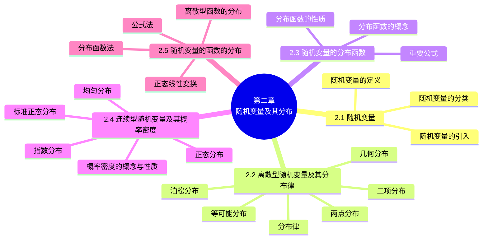

# 第二章 随机变量及其分布

> **本章主线**：第一章用事件描述随机现象，本章引入**随机变量**——定义在样本空间上的单值实值函数，把随机事件"数量化"，从而可用数学分析的方法研究随机现象。对**离散型随机变量**，用**分布律**（取值与概率的对应表）完整刻画其概率规律，并给出两点、等可能、二项、泊松、几何五种常见分布，其中二项分布是两点分布的推广，又在 $np = \lambda$ 时逼近泊松分布。对一般随机变量，引入**分布函数** $F(x) = P\{X \leq x\}$ 统一刻画取值规律（单调、右连续、极限 0 与 1）。对**连续型随机变量**，用**概率密度** $f(x)$（分布函数的导数）刻画，并给出均匀、指数、正态三大常见分布，正态分布是概率论中最重要的分布。最后研究**随机变量的函数的分布**：离散情形合并同值概率，连续情形用"分布函数法"或"公式法"求密度。

## 2.1 随机变量

### 2.1.1 随机变量的引入

概率论是从数量上来研究随机现象内在规律性的。为了更方便有力地研究随机现象，就要用数学分析的方法来研究，因此为了便于数学上的推导和计算，就需将任意的随机事件**数量化**。当把一些非数量表示的随机事件用数字来表示时，就建立起了随机变量的概念。

**实例 1（颜色数量化）** 在一装有红球、白球的袋中任摸一个球，观察摸出球的颜色。样本空间 $S = \{\text{红}, \text{白}\}$ 是非数量的，可采用下列方法将其数量化：

$$X(\text{红}) = 1, \qquad X(\text{白}) = 0$$

即 $X(e) = \begin{cases} 1, & e = \text{红}, \\ 0, & e = \text{白}. \end{cases}$ 这样便将非数量的 $S = \{\text{红}, \text{白}\}$ 数量化了。

**实例 2（样本点本身就是数量）** 抛掷骰子，观察出现的点数，$S = \{1, 2, 3, 4, 5, 6\}$。取恒等变换 $X(e) = e$，即 $X(1) = 1, \dots, X(6) = 6$，且有 $P\{X = i\} = \dfrac{1}{6}$（$i = 1, 2, \dots, 6$）。

### 2.1.2 随机变量的定义

**定义**：设 $E$ 是随机试验，它的样本空间是 $S = \{e\}$。如果对于每一个 $e \in S$，有一个实数 $X(e)$ 与之对应，这样就得到一个定义在 $S$ 上的**单值实值函数** $X(e)$，称 $X(e)$ 为**随机变量**。

**说明**：

1. **随机变量与普通的函数不同**：随机变量是一个函数，但它与普通的函数有着本质的差别——普通函数是定义在实数轴上的，而随机变量是定义在样本空间上的（样本空间的元素不一定是实数）。
2. **随机变量的取值具有一定的概率规律**：随机变量随着试验的结果不同而取不同的值，由于试验的各个结果的出现具有一定的概率，因此随机变量的取值也有一定的概率规律。
3. **随机变量与随机事件的关系**：随机事件包容在随机变量这个范围更广的概念之内。或者说：随机事件是从**静态的观点**研究随机现象，而随机变量则是从**动态的观点**研究随机现象。

**实例 3（硬币）** 掷一个硬币，观察出现的面，共有两个结果：$e_1 =$（反面朝上）、$e_2 =$（正面朝上）。若用 $X$ 表示掷一个硬币出现正面的次数，则 $X(e_1) = 0$，$X(e_2) = 1$，即 $X(e)$ 是一个随机变量。

**实例 4（两个孩子）** 在有两个孩子的家庭中，考虑其性别，共有 4 个样本点：$e_1 =$（男, 男）、$e_2 =$（男, 女）、$e_3 =$（女, 男）、$e_4 =$（女, 女）。若用 $X$ 表示该家女孩子的个数，则 $X(e_1) = 0$，$X(e_2) = X(e_3) = 1$，$X(e_4) = 2$。

**实例 5** 设盒中有 5 个球（2 白 3 黑），从中任抽 3 个，则 $X(e) =$ 抽得的白球数是一个随机变量，且 $X(e)$ 的所有可能取值为 $0, 1, 2$。

**实例 6** 设某射手每次射击打中目标的概率是 0.8，现该射手射了 30 次，则 $X(e) =$ 射中目标的次数是一个随机变量，所有可能取值为 $0, 1, 2, 3, \dots, 30$。

**实例 7** 设某射手每次射击打中目标的概率是 0.8，现该射手不断向目标射击，直到击中目标为止，则 $X(e) =$ 所需射击次数是一个随机变量，所有可能取值为 $1, 2, 3, \dots$（可列无限多个）。

**实例 8** 某公共汽车站每隔 5 分钟有一辆汽车通过，如果某人到达该车站的时刻是随机的，则 $X(e) =$ 此人的等车时间是一个随机变量，所有可能取值为 $[0, 5]$（连续充满区间）。

### 2.1.3 随机变量的分类

随机变量分为**离散型**（所取的可能值是有限多个或无限可列个）与**非离散型**（其中最主要的是**连续型**，所取的可能值可以连续地充满某个区间）。

1. **离散型随机变量**：例如掷骰子出现的点数（可能值 $1, 2, \dots, 6$）、连续射击直至命中时的射击次数（可能值 $1, 2, 3, \dots$）、射 30 次击中目标的次数（可能值 $0, 1, \dots, 30$）。
2. **连续型随机变量**：例如灯泡的寿命（取值范围 $[0, +\infty)$）、测量某零件尺寸时的测量误差（取值范围 $(a, b)$）。

> **小结**：概率论是从数量上来研究随机现象内在规律性的，因此需将随机事件数量化——随机变量是定义在样本空间上的一种**特殊的函数**；随机变量的分类：**离散型、连续型**。

---

## 2.2 离散型随机变量及其分布律

### 2.2.1 分布律的定义

**定义**：设离散型随机变量 $X$ 所有可能取的值为 $x_k$（$k = 1, 2, \dots$），$X$ 取各个可能值的概率，即事件 $\{X = x_k\}$ 的概率，为

$$P\{X = x_k\} = p_k, \qquad k = 1, 2, \dots$$

称此为离散型随机变量 $X$ 的**分布律**。

**性质**：

1. $p_k \geq 0, \qquad k = 1, 2, \dots$；
2. $\displaystyle \sum_{k=1}^{\infty} p_k = 1$。

离散型随机变量的分布律也可表示为表格形式：

| $X$ | $x_1$ | $x_2$ | $\dots$ | $x_k$ | $\dots$ |
| :--: | :--: | :--: | :--: | :--: | :--: |
| $p_k$ | $p_1$ | $p_2$ | $\dots$ | $p_k$ | $\dots$ |

**例 1（信号灯）** 设一汽车在开往目的地的道路上需经过四组信号灯，每组信号灯以 $1/2$ 的概率允许或禁止汽车通过。以 $X$ 表示汽车首次停下时，它已通过的信号灯的组数（设各组信号灯的工作是相互独立的），求 $X$ 的分布律。

- 设 $p$ 为每组信号灯禁止汽车通过的概率，则 $X$ 的分布律为

| $X$ | 0 | 1 | 2 | 3 | 4 |
| :--: | :--: | :--: | :--: | :--: | :--: |
| $p_k$ | $p$ | $(1-p)p$ | $(1-p)^2 p$ | $(1-p)^3 p$ | $(1-p)^4$ |

- 将 $p = \dfrac{1}{2}$ 代入得

| $X$ | 0 | 1 | 2 | 3 | 4 |
| :--: | :--: | :--: | :--: | :--: | :--: |
| $p_k$ | 0.5 | 0.25 | 0.125 | 0.0625 | 0.0625 |

> 注意 $P\{X = 4\} = (1-p)^4$ 表示四组信号灯全部允许通过（汽车未停下），其概率为 $0.0625$，验证 $\sum p_k = 0.5 + 0.25 + 0.125 + 0.0625 + 0.0625 = 1$。

### 2.2.2 常见离散型随机变量的概率分布

**1. 两点分布（(0—1) 分布）**

设随机变量 $X$ 只可能取 0 与 1 两个值，它的分布律为

| $X$ | 0 | 1 |
| :--: | :--: | :--: |
| $p_k$ | $1-p$ | $p$ |

则称 $X$ 服从 **(0—1) 分布**或**两点分布**。

- **实例 1（抛硬币）**：$X = \begin{cases} 0, & e = \text{正面}, \\ 1, & e = \text{反面}, \end{cases}$ 分布律为 $P\{X=0\} = P\{X=1\} = \dfrac{1}{2}$。
- **实例 2（产品检验）**：200 件产品中，有 190 件合格品、10 件不合格品，随机抽取一件，规定 $X = \begin{cases} 1, & \text{取得不合格品}, \\ 0, & \text{取得合格品}, \end{cases}$ 则 $P\{X=0\} = \dfrac{190}{200}$，$P\{X=1\} = \dfrac{10}{200}$，$X$ 服从 (0—1) 分布。

> 说明：两点分布是最简单的一种分布，任何一个只有两种可能结果的随机现象——比如新生婴儿是男还是女、明天是否下雨、种籽是否发芽等——都属于两点分布。

**2. 等可能分布**

如果随机变量 $X$ 的分布律为

| $X$ | $a_1$ | $a_2$ | $\dots$ | $a_n$ |
| :--: | :--: | :--: | :--: | :--: |
| $p_k$ | $\dfrac{1}{n}$ | $\dfrac{1}{n}$ | $\dots$ | $\dfrac{1}{n}$ |

其中 $a_i \neq a_j$（$i \neq j$），则称 $X$ 服从**等可能分布**。

- **实例**：抛掷骰子并记出现的点数为随机变量 $X$，则 $P\{X = i\} = \dfrac{1}{6}$（$i = 1, 2, \dots, 6$），$X$ 服从等可能分布（离散的均匀分布）。

**3. 二项分布**

**(1) 重复独立试验**：将试验 $E$ 重复进行 $n$ 次，若各次试验的结果互不影响，即每次试验结果出现的概率都不依赖于其它各次试验的结果，则称这 $n$ 次试验是**相互独立**的，或称为 $n$ 次重复独立试验。

**(2) n 重伯努利试验**：设试验 $E$ 只有两个可能结果 $A$ 及 $\bar{A}$，则称 $E$ 为**伯努利试验**。设 $P(A) = p$（$0 < p < 1$），此时 $P(\bar{A}) = 1 - p$。将 $E$ 独立地重复地进行 $n$ 次，则称这一串重复的独立试验为 **n 重伯努利试验**。

- 实例 1：抛一枚硬币观察得到正面或反面，若将硬币抛 $n$ 次，就是 n 重伯努利试验；
- 实例 2：抛一颗骰子 $n$ 次，观察是否"出现 1 点"，就是 n 重伯努利试验。

**(3) 二项概率公式**：若 $X$ 表示 n 重伯努利试验中事件 $A$ 发生的次数，则 $X$ 所有可能取的值为 $0, 1, 2, \dots, n$。当 $X = k$（$0 \leq k \leq n$）时，即 $A$ 在 $n$ 次试验中发生了 $k$ 次。$A$ 在 $n$ 次试验中发生 $k$ 次的方式共有 $C_n^k$ 种，且两两互不相容，因此 $A$ 在 $n$ 次试验中发生 $k$ 次的概率为

$$P\{X = k\} = C_n^k \, p^k (1 - p)^{n-k}, \qquad k = 0, 1, \dots, n$$

记 $q = 1 - p$，得 $X$ 的分布律为

| $X$ | 0 | 1 | $\dots$ | $k$ | $\dots$ | $n$ |
| :--: | :--: | :--: | :--: | :--: | :--: | :--: |
| $p_k$ | $q^n$ | $C_n^1 p q^{n-1}$ | $\dots$ | $C_n^k p^k q^{n-k}$ | $\dots$ | $p^n$ |

称这样的分布为**二项分布**，记为 $X \sim b(n, p)$。

> 注意：**二项分布 $n = 1$ 时就是两点分布**。二项分布是 (0—1) 分布的推广——若每次试验成功的概率为 $p$，设 $X_i = \begin{cases} 1, & \text{第 } i \text{ 次试验成功}, \\ 0, & \text{第 } i \text{ 次试验失败}, \end{cases}$（$i = 1, 2, \dots, n$），它们都服从 (0—1) 分布且相互独立，则 $X = X_1 + X_2 + \dots + X_n$ 服从参数为 $(n, p)$ 的二项分布。

**例 2（元件抽查）** 按规定，某种型号电子元件的使用寿命超过 1500 小时的为一级品。已知某一大批产品的一级品率为 0.2，现在从中随机地抽查 20 只，问 20 只元件中恰有 $k$ 只（$k = 0, 1, \dots, 20$）一级品的概率是多少？

- 分析：这是**不放回抽样**。但由于这批元件的总数很大，且抽查元件的数量相对于元件的总数来说又很小，因而此抽样可近似当作**放回抽样**来处理。
- 把检查一只元件是否为一级品看成是一次试验，检查 20 只元件相当于做 20 重伯努利试验。
- 以 $X$ 记 20 只元件中一级品的只数，则 $X \sim b(20, 0.2)$，因此所求概率为

$$P\{X = k\} = C_{20}^k (0.2)^k (0.8)^{20-k}, \qquad k = 0, 1, \dots, 20$$

| $k$ | 0 | 1 | 2 | 3 | 4 | 5 |
| :--: | :--: | :--: | :--: | :--: | :--: | :--: |
| $P\{X=k\}$ | 0.012 | 0.058 | 0.137 | 0.205 | 0.218 | 0.175 |

| $k$ | 6 | 7 | 8 | 9 | 10 | $\geq 11$ |
| :--: | :--: | :--: | :--: | :--: | :--: | :--: |
| $P\{X=k\}$ | 0.109 | 0.055 | 0.022 | 0.007 | 0.002 | $< 0.001$ |

**例 3（射击 400 次）** 某人进行射击，设每次射击的命中率为 0.02，独立射击 400 次，试求至少击中两次的概率。

- 设击中的次数为 $X$，则 $X \sim b(400, 0.02)$，分布律为 $P\{X = k\} = C_{400}^k (0.02)^k (0.98)^{400-k}$（$k = 0, 1, \dots, 400$）；
- 用对立事件转化：
$$P\{X \geq 2\} = 1 - P\{X = 0\} - P\{X = 1\} = 1 - (0.98)^{400} - 400(0.02)(0.98)^{399} = 0.9972$$

**4. 泊松分布**

设随机变量 $X$ 所有可能取的值为 $0, 1, 2, \dots$，而取各个值的概率为

$$P\{X = k\} = \frac{\lambda^k e^{-\lambda}}{k!}, \qquad k = 0, 1, 2, \dots$$

其中 $\lambda > 0$ 是常数，则称 $X$ 服从**参数为 $\lambda$ 的泊松分布**，记为 $X \sim \pi(\lambda)$。

**泊松分布的背景及应用**：二十世纪初卢瑟福和盖克两位科学家在观察与分析放射性物质放出的粒子个数的情况时，他们做了 2608 次观察（每次时间为 7.5 秒），发现放射性物质在规定的一段时间内，其放射的粒子数 $X$ 服从泊松分布。在生物学、医学、工业统计、保险科学及公用事业的排队等问题中，泊松分布是常见的——例如地震、火山爆发、特大洪水、交换台的电话呼唤次数、商场接待的顾客数、交通事故次数等，都服从泊松分布。

> **二项分布与泊松分布的关系（泊松定理）**：以 $n, p$（$np = \lambda$）为参数的二项分布，当 $n \to \infty$ 时趋于以 $\lambda$ 为参数的泊松分布，即
> $$P\{X = k\} = C_n^k \, p^k (1-p)^{n-k} \approx \frac{(np)^k e^{-np}}{k!}, \qquad k = 0, 1, 2, \dots, n$$
> 实际应用中，当 $n$ 大 $p$ 小（一般 $n \geq 10$、$p \leq 0.1$）时，用泊松分布近似二项分布效果很好。

**例 4（汽车站事故）** 有一繁忙的汽车站，每天有大量汽车通过，设每辆汽车在一天的某段时间内出事故的概率为 0.0001，在每天的该段时间内有 1000 辆汽车通过，问出事故的次数不小于 2 的概率是多少？

- 设 1000 辆车通过时出事故的次数为 $X$，则 $X \sim b(1000, 0.0001)$，所求概率为
$$P\{X \geq 2\} = 1 - P\{X = 0\} - P\{X = 1\} = 1 - (0.9999)^{1000} - C_{1000}^1 (0.0001)(0.9999)^{999}$$
- 因 $n$ 大 $p$ 小，可利用泊松定理计算：$\lambda = np = 1000 \times 0.0001 = 0.1$，
$$P\{X \geq 2\} \approx 1 - \frac{e^{-0.1} \cdot 0.1^0}{0!} - \frac{e^{-0.1} \cdot 0.1^1}{1!} = 0.0047$$

**例 5（合理配备维修工人）** 为了保证设备正常工作，需配备适量的维修工人（工人配备多了就浪费，配备少了又要影响生产）。现有同类型设备 300 台，各台工作是相互独立的，发生故障的概率都是 0.01。在通常情况下一台设备的故障可由一个人来处理，问至少需配备多少工人，才能保证设备发生故障但不能及时维修的概率小于 0.01？

- 设需配备 $N$ 人，记同一时刻发生故障的设备台数为 $X$，则 $X \sim b(300, 0.01)$，所需解决的问题是确定最小的 $N$，使得 $P\{X \leq N\} \geq 0.99$；
- 由泊松定理（$\lambda = np = 3$）：
$$P\{X \leq N\} \approx \sum_{k=0}^{N} \frac{3^k e^{-3}}{k!} \geq 0.99, \qquad \text{即} \qquad \sum_{k=N+1}^{\infty} \frac{3^k e^{-3}}{k!} \leq 0.01$$
- 查表可求得满足此式最小的 $N$ 是 **8**。故至少需配备 **8 个工人**，才能保证设备发生故障但不能及时维修的概率小于 0.01。

**例 6（两种维修方案比较）** 设有 80 台同类型设备，各台工作是相互独立的，发生故障的概率都是 0.01，且一台设备的故障能由一个人处理。考虑两种配备维修工人的方法：其一是由四人维护，每人负责 20 台；其二是由 3 人共同维护 80 台。试比较这两种方法在设备发生故障时不能及时维修的概率的大小。

- **按第一种方法**：以 $X$ 记"第 1 人维护的 20 台中同一时刻发生故障的台数"，以 $A_i$（$i = 1, 2, 3, 4$）表示事件"第 $i$ 人维护的 20 台中发生故障时不能及时维修"，则 80 台中发生故障而不能及时维修的概率为
$$P(A_1 \cup A_2 \cup A_3 \cup A_4) \geq P(A_1) = P\{X \geq 2\}$$
  而 $X \sim b(20, 0.01)$，又 $\lambda = np = 0.2$，故有
$$P\{X \geq 2\} \approx \sum_{k=2}^{\infty} \frac{(0.2)^k e^{-0.2}}{k!} = 0.0175$$
  即有 $P(A_1 \cup A_2 \cup A_3 \cup A_4) \geq 0.0175$。
- **按第二种方法**：以 $Y$ 记 80 台中同一时刻发生故障的台数，则有 $Y \sim b(80, 0.01)$，又 $\lambda = np = 0.8$，故 80 台中发生故障而不能及时维修的概率为
$$P\{Y \geq 4\} \approx \sum_{k=4}^{\infty} \frac{(0.8)^k e^{-0.8}}{k!} = 0.0091$$

> 结论：**第二种方法（3 人共同维护 80 台）更好**——集中维修比分散维修更能有效利用人力，这体现了"集中力量"在排队论中的优势。

**5. 几何分布**

若随机变量 $X$ 的分布律为

| $X$ | 1 | 2 | $\dots$ | $k$ | $\dots$ |
| :--: | :--: | :--: | :--: | :--: | :--: |
| $p_k$ | $p$ | $qp$ | $\dots$ | $q^{k-1}p$ | $\dots$ |

其中 $p + q = 1$，则称 $X$ 服从**几何分布**。

**实例（首次成功）**：设某批产品的次品率为 $p$，对该批产品做有放回的抽样检查，直到第一次抽到一只次品为止（在此之前抽到的全是正品），那么所抽到的产品数 $X$ 是一个随机变量，求 $X$ 的分布律。

- $X$ 所取的可能值是 $1, 2, 3, \dots$。设 $A_i$ 表示"抽到的第 $i$ 个产品是正品"，则
$$P\{X = k\} = P(\bar{A}_1 \bar{A}_2 \cdots \bar{A}_{k-1} A_k) = (1-p)(1-p) \cdots (1-p) \cdot p = q^{k-1} p, \qquad k = 1, 2, \dots$$
- 所以 $X$ 服从几何分布。

> 说明：几何分布可作为描述某个试验"首次成功"的概率模型——前 $k-1$ 次都失败、第 $k$ 次才首次成功的概率为 $q^{k-1}p$。

### 2.2.3 离散型分布小结

1. **二项分布是 (0—1) 分布的推广**：$X = X_1 + X_2 + \dots + X_n \sim b(n, p)$（每个 $X_i$ 服从 (0—1) 分布且相互独立）；
2. **二项分布趋于泊松分布**：以 $n, p$（$np = \lambda$）为参数的二项分布，当 $n \to \infty$ 时趋于以 $\lambda$ 为参数的泊松分布。

| 分布 | 关系 |
| :-- | :-- |
| 两点分布 | $n = 1$ 时的二项分布 |
| 二项分布 | 两点分布的推广（$n$ 次独立重复伯努利试验） |
| 泊松分布 | 二项分布当 $n \to \infty$、$np = \lambda$ 时的极限分布 |
| 等可能分布 | 离散情形的均匀分布 |
| 几何分布 | "首次成功"模型 |

---

## 2.3 随机变量的分布函数

### 2.3.1 分布函数的概念

对于随机变量 $X$，我们不仅要知道 $X$ 取哪些值、取这些值的概率，而且更重要的是想知道 $X$ 在**任意有限区间** $(a, b)$ 内取值的概率。例如求随机变量 $X$ 落在区间 $(x_1, x_2]$ 内的概率：

$$P\{x_1 < X \leq x_2\} = P\{X \leq x_2\} - P\{X \leq x_1\} = F(x_2) - F(x_1)$$

**定义**：设 $X$ 是一个随机变量，$x$ 是任意实数，函数

$$F(x) = P\{X \leq x\}$$

称为 $X$ 的**分布函数**。

**说明**：

1. 分布函数主要研究随机变量在某一区间内取值的概率情况；
2. 分布函数 $F(x)$ 是 $x$ 的一个**普通实函数**（不再是随机性的对象，而是确定性的函数）。

**实例（抛硬币）** 抛掷均匀硬币，令 $X = \begin{cases} 1, & \text{出正面}, \\ 0, & \text{出反面}. \end{cases}$ 求随机变量 $X$ 的分布函数。

- $P\{X = 1\} = P\{X = 0\} = \dfrac{1}{2}$；
- 当 $x < 0$ 时，$F(x) = P\{X \leq x\} = 0$；
- 当 $0 \leq x < 1$ 时，$F(x) = P\{X \leq x\} = P\{X = 0\} = \dfrac{1}{2}$；
- 当 $x \geq 1$ 时，$F(x) = P\{X = 0\} + P\{X = 1\} = 1$；

故

$$F(x) = \begin{cases} 0, & x < 0, \\ \dfrac{1}{2}, & 0 \leq x < 1, \\ 1, & x \geq 1. \end{cases}$$

### 2.3.2 分布函数的性质

1. **单调不减**：若 $x_1 < x_2$，则 $F(x_1) \leq F(x_2)$。
   证明：由 $x_1 < x_2$ 知 $\{X \leq x_1\} \subset \{X \leq x_2\}$，得 $P\{X \leq x_1\} \leq P\{X \leq x_2\}$，即 $F(x_1) \leq F(x_2)$。
2. **极限性质**：$\displaystyle \lim_{x \to -\infty} F(x) = 0$，$\displaystyle \lim_{x \to +\infty} F(x) = 1$。
   （当 $x$ 越来越小时 $P\{X \leq x\}$ 越来越小趋于 0；当 $x \to +\infty$ 时 $X$ 必然落在 $(-\infty, +\infty)$ 内，故概率趋于 1。）
3. **右连续**：$F(x)$ 是右连续的，即 $\displaystyle \lim_{x \to x_0^+} F(x) = F(x_0)$。任一分布函数处处右连续。

离散型随机变量的分布函数是右连续的**阶梯函数**，在取值点 $x_k$ 处跳跃，跳跃高度恰为 $p_k$：

$$F(x) = \sum_{x_i \leq x} p_i$$

**重要公式**：对任意实数 $a < b$，有

$$P\{a < X \leq b\} = F(b) - F(a)$$

证明：因为 $\{X \leq b\} = \{X \leq a\} \cup \{a < X \leq b\}$，且 $\{X \leq a\} \cap \{a < X \leq b\} = \varnothing$，所以 $P\{X \leq b\} = P\{X \leq a\} + P\{a < X \leq b\}$，故 $P\{a < X \leq b\} = F(b) - F(a)$。

### 2.3.3 例题讲解

**例 7（硬币三次）** 将一枚硬币连掷三次，$X$ 表示"三次中正面出现的次数"，求 $X$ 的分布律及分布函数，并求下列概率值：$P\{1 < X < 3\}$、$P\{X \geq 5.5\}$、$P\{1 < X \leq 3\}$。

- 设 $H$—正面，$T$—反面，则 $S = \{HHH, HHT, HTH, THH, HTT, THT, TTH, TTT\}$，$X$ 的分布律为

| $X$ | 0 | 1 | 2 | 3 |
| :--: | :--: | :--: | :--: | :--: |
| $p_k$ | $\dfrac{1}{8}$ | $\dfrac{3}{8}$ | $\dfrac{3}{8}$ | $\dfrac{1}{8}$ |

- 求分布函数：当 $x < 0$ 时 $F(x) = 0$；当 $0 \leq x < 1$ 时 $F(x) = P\{X=0\} = \dfrac{1}{8}$；当 $1 \leq x < 2$ 时 $F(x) = \dfrac{1}{8} + \dfrac{3}{8} = \dfrac{4}{8}$；当 $2 \leq x < 3$ 时 $F(x) = \dfrac{1}{8} + \dfrac{3}{8} + \dfrac{3}{8} = \dfrac{7}{8}$；当 $x \geq 3$ 时 $F(x) = 1$，故

$$F(x) = \begin{cases} 0, & x < 0, \\ \dfrac{1}{8}, & 0 \leq x < 1, \\ \dfrac{4}{8}, & 1 \leq x < 2, \\ \dfrac{7}{8}, & 2 \leq x < 3, \\ 1, & x \geq 3. \end{cases}$$

- 计算概率：
$$P\{1 < X < 3\} = P\{X \leq 3\} - P\{X \leq 1\} - P\{X = 3\} = F(3) - F(1) - P\{X=3\} = 1 - \frac{4}{8} - \frac{1}{8} = \frac{3}{8}$$
$$P\{X \geq 5.5\} = 1 - P\{X < 5.5\} = 1 - 1 + 0 = 0$$
$$P\{1 < X \leq 3\} = F(3) - F(1) = 1 - \frac{4}{8} = \frac{1}{2}$$

**例 8（由分布律求分布函数）** 设随机变量 $X$ 的分布律为

| $X$ | $-1$ | 2 | 3 |
| :--: | :--: | :--: | :--: |
| $p_k$ | $\dfrac{1}{4}$ | $\dfrac{1}{2}$ | $\dfrac{1}{4}$ |

求 $X$ 的分布函数，并求 $P\left\{X \leq \dfrac{1}{2}\right\}$、$P\left\{\dfrac{3}{2} < X \leq \dfrac{5}{2}\right\}$、$P\{2 \leq X \leq 3\}$。

- 由于 $X$ 仅在 $x = -1, 2, 3$ 处概率不为 0，且 $F(x) = P\{X \leq x\}$，得

$$F(x) = \begin{cases} 0, & x < -1, \\ \dfrac{1}{4}, & -1 \leq x < 2, \\ \dfrac{3}{4}, & 2 \leq x < 3, \\ 1, & x \geq 3. \end{cases}$$

- 由 $F(x) = P\{X \leq x\}$ 得
$$P\left\{X \leq \frac{1}{2}\right\} = F\left(\frac{1}{2}\right) = \frac{1}{4}, \qquad P\left\{\frac{3}{2} < X \leq \frac{5}{2}\right\} = F\left(\frac{5}{2}\right) - F\left(\frac{3}{2}\right) = \frac{3}{4} - \frac{1}{4} = \frac{1}{2}$$
$$P\{2 \leq X \leq 3\} = F(3) - F(2) + P\{X = 2\} = 1 - \frac{3}{4} + \frac{1}{2} = \frac{3}{4}$$

> 注意第三个等式中 $P\{2 \leq X \leq 3\}$ 含端点 $X = 2$，需在 $F(3) - F(2)$ 基础上**加回** $P\{X = 2\}$；一般地 $P\{a \leq X \leq b\} = F(b) - F(a) + P\{X = a\}$（离散型）。

**请同学们思考**：不同的随机变量，它们的分布函数一定也不相同吗？

- 答：**不一定**。例如抛均匀硬币，令 $X_1 = \begin{cases} 1, & \text{出正面}, \\ -1, & \text{出反面}, \end{cases}$ $X_2 = \begin{cases} -1, & \text{出正面}, \\ 1, & \text{出反面}, \end{cases}$ $X_1$ 与 $X_2$ 在样本空间上的对应法则不同，是两个不同的随机变量，但它们却有相同的分布函数
$$F(x) = \begin{cases} 0, & x < -1, \\ \dfrac{1}{2}, & -1 \leq x < 1, \\ 1, & x \geq 1. \end{cases}$$

> 结论：**分布函数相同 $\not\Rightarrow$ 随机变量相同**——分布函数只刻画"取值不超过 $x$ 的概率"这一统计规律，不关心样本空间到实数的具体对应方式。

**例 9（靶子问题，引出连续型）** 一个靶子是半径为 2m 的圆盘，设击中靶上任一同心圆盘上的点的概率与该圆盘的面积成正比，并设射击都能中靶。以 $X$ 表示弹着点与圆心的距离，试求随机变量 $X$ 的分布函数。

- 当 $x < 0$ 时，$\{X \leq x\}$ 是不可能事件，于是 $F(x) = 0$；
- 当 $0 \leq x \leq 2$ 时，$P\{0 \leq X \leq x\} = kx^2$（$k$ 是常数），由 $P\{0 \leq X \leq 2\} = 1$ 得 $4k = 1$，即 $k = \dfrac{1}{4}$，因而 $P\{0 \leq X \leq x\} = \dfrac{x^2}{4}$，于是 $F(x) = P\{X \leq x\} = P\{X < 0\} + P\{0 \leq X \leq x\} = \dfrac{x^2}{4}$；
- 当 $x \geq 2$ 时，$F(x) = 1$；

故 $X$ 的分布函数为

$$F(x) = \begin{cases} 0, & x < 0, \\ \dfrac{x^2}{4}, & 0 \leq x < 2, \\ 1, & x \geq 2. \end{cases}$$

其图形为一连续曲线。若记 $f(t) = \begin{cases} \dfrac{t}{2}, & 0 < t < 2, \\ 0, & \text{其它}, \end{cases}$ 则 $F(x) = \displaystyle \int_{-\infty}^{x} f(t)\,dt$——$F(x)$ 恰是非负函数 $f(t)$ 在区间 $(-\infty, x]$ 上的积分，此时称 $X$ 为**连续型随机变量**。

> 注意：两类随机变量的分布函数图形的特点不一样——离散型的分布函数是阶梯（跳跃）函数，连续型的分布函数是连续函数。

---

## 2.4 连续型随机变量及其概率密度

### 2.4.1 概率密度的概念与性质

**定义**：如果对于随机变量 $X$ 的分布函数 $F(x)$，存在非负函数 $f(x)$，使对于任意实数 $x$ 有

$$F(x) = \int_{-\infty}^{x} f(t)\,dt$$

则称 $X$ 为**连续型随机变量**，其中 $f(x)$ 称为 $X$ 的**概率密度函数**，简称**概率密度**。

**性质**：

1. $f(x) \geq 0$；
2. $\displaystyle \int_{-\infty}^{+\infty} f(x)\,dx = 1$（由 $1 = F(+\infty) = \int_{-\infty}^{+\infty} f(x)\,dx$ 得）；
3. $P\{x_1 < X \leq x_2\} = F(x_2) - F(x_1) = \displaystyle \int_{x_1}^{x_2} f(x)\,dx$；
4. 若 $f(x)$ 在点 $x$ 处连续，则有 $F'(x) = f(x)$。

**同时得以下计算公式**：

$$P\{X \leq a\} = F(a) = \int_{-\infty}^{a} f(x)\,dx, \qquad P\{X > a\} = 1 - P\{X \leq a\} = 1 - F(a) = \int_{a}^{+\infty} f(x)\,dx$$

**注意（单点概率为零）**：对于任意可能值 $a$，连续型随机变量取 $a$ 的概率等于零，即

$$P\{X = a\} = \lim_{\Delta x \to 0} \int_{a}^{a+\Delta x} f(x)\,dx = 0$$

由此可得

$$P\{a \leq X \leq b\} = P\{a < X \leq b\} = P\{a \leq X < b\} = P\{a < X < b\}$$

即**连续型随机变量取值落在某一区间的概率与区间的开闭无关**。

> 注意辨析：
> - 若 $X$ 是连续型随机变量，$\{X = a\}$ 是不可能事件，则有 $P\{X = a\} = 0$（概率为零但事件未必不可能）；
> - 若 $P\{X = a\} = 0$，则**不能确定** $\{X = a\}$ 是不可能事件；
> - 若 $X$ 为离散型随机变量，则 $\{X = a\}$ 是不可能事件 $\iff$ $P\{X = a\} = 0$。

**例 10（求常数与分布函数）** 设随机变量 $X$ 具有概率密度

$$f(x) = \begin{cases} kx, & 0 \leq x < 3, \\ 2 - \dfrac{x}{2}, & 3 \leq x \leq 4, \\ 0, & \text{其它}. \end{cases}$$

(1) 确定常数 $k$；(2) 求 $X$ 的分布函数；(3) 求 $P\left\{1 < X \leq \dfrac{7}{2}\right\}$。

- (1) 由 $\displaystyle \int_{-\infty}^{+\infty} f(x)\,dx = 1$，得 $\displaystyle \int_0^3 kx\,dx + \int_3^4 \left(2 - \frac{x}{2}\right) dx = 1$，解之得 $k = \dfrac{1}{6}$；
- (2) 由 $F(x) = \displaystyle \int_{-\infty}^{x} f(t)\,dt$ 得

$$F(x) = \begin{cases} 0, & x < 0, \\ \dfrac{x^2}{12}, & 0 \leq x < 3, \\ -3 + 2x - \dfrac{x^2}{4}, & 3 \leq x < 4, \\ 1, & x \geq 4. \end{cases}$$

  （在 $x = 3$ 处 $F(3) = \dfrac{9}{12} = \dfrac{3}{4}$ 且 $-3 + 6 - \dfrac{9}{4} = \dfrac{3}{4}$，分布函数连续。）

- (3) $P\left\{1 < X \leq \dfrac{7}{2}\right\} = F\left(\dfrac{7}{2}\right) - F(1) = \left(-3 + 7 - \dfrac{49}{16}\right) - \dfrac{1}{12} = \dfrac{41}{48}$。

**例 11（arcsin 分布）** 设连续型随机变量 $X$ 的分布函数为

$$F(x) = \begin{cases} 0, & x \leq -a, \\ A + B \arcsin \dfrac{x}{a}, & -a < x \leq a, \\ 1, & x > a. \end{cases}$$

求：(1) 系数 $A$、$B$ 的值；(2) $P\left\{-a < X < \dfrac{a}{2}\right\}$；(3) 随机变量 $X$ 的概率密度。

- (1) 因为 $X$ 是连续型随机变量，所以 $F(x)$ 连续，故有 $F(-a) = \lim\limits_{x \to -a^+} F(x)$，$F(a) = \lim\limits_{x \to a^+} F(x)$，即
$$A + B \arcsin(-1) = A - \frac{\pi}{2}B = 0, \qquad A + B \arcsin(1) = A + \frac{\pi}{2}B = 1$$
  解之得 $A = \dfrac{1}{2}$，$B = \dfrac{1}{\pi}$；
- (2) $P\left\{-a < X < \dfrac{a}{2}\right\} = F\left(\dfrac{a}{2}\right) - F(-a) = \dfrac{1}{2} + \dfrac{1}{\pi}\arcsin\left(\dfrac{1}{2}\right) - 0 = \dfrac{1}{2} + \dfrac{1}{\pi} \cdot \dfrac{\pi}{6} = \dfrac{2}{3}$；
- (3) 随机变量 $X$ 的概率密度为

$$f(x) = F'(x) = \begin{cases} \dfrac{1}{\pi \sqrt{a^2 - x^2}}, & -a < x < a, \\ 0, & \text{其它}. \end{cases}$$

### 2.4.2 常见连续型随机变量的分布

**1. 均匀分布**

**定义**：设连续型随机变量 $X$ 具有概率密度

$$f(x) = \begin{cases} \dfrac{1}{b-a}, & a < x < b, \\ 0, & \text{其它}, \end{cases}$$

则称 $X$ 在区间 $(a, b)$ 上服从**均匀分布**，记为 $X \sim U(a, b)$。

**均匀分布的意义**：在区间 $(a, b)$ 上服从均匀分布的随机变量 $X$，落在区间 $(a, b)$ 中**任意等长度的子区间**内的可能性是相同的——落在长度为 $l$ 的子区间内的概率为 $p = \dfrac{l}{b-a}$，只与长度有关，与位置无关。

**分布函数**：

$$F(x) = \begin{cases} 0, & x < a, \\ \dfrac{x-a}{b-a}, & a \leq x < b, \\ 1, & x \geq b. \end{cases}$$

**例 12（电阻）** 设电阻值 $R$ 是一个随机变量，均匀分布在 $900\Omega \sim 1100\Omega$。求 $R$ 的概率密度及 $R$ 落在 $950\Omega \sim 1050\Omega$ 的概率。

- 由题意，$R$ 的概率密度为 $f(r) = \begin{cases} \dfrac{1}{1100-900} = \dfrac{1}{200}, & 900 < r \leq 1100, \\ 0, & \text{其他}. \end{cases}$
- 故有 $P\{950 < R \leq 1050\} = \displaystyle \int_{950}^{1050} \frac{1}{200}\,dr = \frac{100}{200} = 0.5$。

**例 13（均匀分布 + 二项分布综合）** 设随机变量 $X$ 在 $[2, 5]$ 上服从均匀分布，现对 $X$ 进行三次独立观测，试求至少有两次观测值大于 3 的概率。

- $X$ 的分布密度函数为 $f(x) = \begin{cases} \dfrac{1}{3}, & 2 \leq x \leq 5, \\ 0, & \text{其他}. \end{cases}$
- 设 $A$ 表示"对 $X$ 的观测值大于 3"，即 $A = \{X > 3\}$，则 $P(A) = P\{X > 3\} = \displaystyle \int_3^5 \frac{1}{3}\,dx = \frac{2}{3}$；
- 设 $Y$ 表示 3 次独立观测中观测值大于 3 的次数，则 $Y \sim b\left(3, \dfrac{2}{3}\right)$，因而有
$$P\{Y \geq 2\} = C_3^2 \left(\frac{2}{3}\right)^2 \left(\frac{1}{3}\right) + C_3^3 \left(\frac{2}{3}\right)^3 = \frac{12}{27} + \frac{8}{27} = \frac{20}{27}$$

**2. 指数分布**

**定义**：设连续型随机变量 $X$ 的概率密度为

$$f(x) = \begin{cases} \dfrac{1}{\theta} e^{-x/\theta}, & x > 0, \\ 0, & x \leq 0, \end{cases}$$

其中 $\theta > 0$ 为常数，则称 $X$ 服从**参数为 $\theta$ 的指数分布**。

**分布函数**：

$$F(x) = \begin{cases} 1 - e^{-x/\theta}, & x > 0, \\ 0, & x \leq 0. \end{cases}$$

**应用与背景**：某些元件或设备的寿命服从指数分布——例如无线电元件的寿命、电力设备的寿命、动物的寿命等都服从指数分布。

**例 14（日光灯管，指数分布的"无记忆性"）** 设某类日光灯管的使用寿命 $X$ 服从参数为 $\theta = 2000$ 的指数分布（单位：小时）。(1) 任取一只这种灯管，求能正常使用 1000 小时以上的概率；(2) 有一只这种灯管已经正常使用了 1000 小时以上，求还能使用 1000 小时以上的概率。

- $X$ 的分布函数为 $F(x) = \begin{cases} 1 - e^{-x/2000}, & x \geq 0, \\ 0, & x < 0. \end{cases}$
- (1) $P\{X > 1000\} = 1 - F(1000) = e^{-1/2} \approx 0.607$；
- (2) 由条件概率：
$$P\{X > 2000 \mid X > 1000\} = \frac{P\{X > 2000\}}{P\{X > 1000\}} = \frac{1 - F(2000)}{1 - F(1000)} = \frac{e^{-1}}{e^{-1/2}} = e^{-1/2} \approx 0.607$$

> **指数分布的重要性质："无记忆性"**：$P\{X > s + t \mid X > s\} = P\{X > t\}$。已经使用了 $s$ 小时的元件还能再使用 $t$ 小时的概率，与它全新时能使用 $t$ 小时的概率相同——元件"不记得"自己已经工作了多久，这既是数学上的优美性质，也说明指数分布是"无老化"模型（用于描述寿命时是理想化假设）。

**3. 正态分布（高斯分布）**

**定义**：设连续型随机变量 $X$ 的概率密度为

$$f(x) = \frac{1}{\sqrt{2\pi}\,\sigma} e^{-\frac{(x-\mu)^2}{2\sigma^2}}, \qquad -\infty < x < +\infty$$

其中 $\mu$、$\sigma$（$\sigma > 0$）为常数，则称 $X$ 服从**参数为 $\mu, \sigma$ 的正态分布**或**高斯分布**，记为 $X \sim N(\mu, \sigma^2)$。

**正态概率密度函数的几何特征**：

1. 曲线关于 $x = \mu$ **对称**；
2. 当 $x = \mu$ 时，$f(x)$ 取得**最大值** $\dfrac{1}{\sqrt{2\pi}\,\sigma}$；
3. 当 $x \to \pm\infty$ 时，$f(x) \to 0$；
4. 曲线在 $x = \mu \pm \sigma$ 处有**拐点**；
5. 曲线以 $x$ 轴为**渐近线**；
6. 当固定 $\sigma$、改变 $\mu$ 的大小时，$f(x)$ 图形的形状不变，只是沿着 $x$ 轴作平移变换；
7. 当固定 $\mu$、改变 $\sigma$ 的大小时，$f(x)$ 图形的对称轴不变，而形状在改变：$\sigma$ 越小，图形越高越瘦；$\sigma$ 越大，图形越矮越胖。

**正态分布的分布函数**：

$$F(x) = \frac{1}{\sqrt{2\pi}\,\sigma} \int_{-\infty}^{x} e^{-\frac{(t-\mu)^2}{2\sigma^2}} \,dt$$

**正态分布的应用与背景**：正态分布是最常见最重要的一种分布——例如测量误差、人的生理特征尺寸（身高、体重等）、正常情况下生产的产品尺寸（直径、长度、重量、高度）、炮弹的弹落点等，都近似服从正态分布。一个变量如果受到**大量微小的、独立的随机因素**的影响，那么这个变量一般是一个正态随机变量。另一方面，有些分布（如二项分布、泊松分布）的极限分布是正态分布。所以，无论在实践中还是在理论上，**正态分布是概率论中最重要的一种分布**。

### 2.4.3 正态分布下的概率计算

正态分布密度函数的原函数不是初等函数，$P\{X \leq x\} = F(x)$ 无法解析表达，通常有两种方法：方法一，利用 MATLAB 软件包计算；方法二，**转化为标准正态分布查表计算**。

**标准正态分布**：当正态分布 $N(\mu, \sigma^2)$ 中的 $\mu = 0$、$\sigma = 1$ 时，这样的正态分布称为**标准正态分布**，记为 $N(0, 1)$。标准正态分布的概率密度表示为

$$\varphi(x) = \frac{1}{\sqrt{2\pi}} e^{-\frac{x^2}{2}}, \qquad -\infty < x < +\infty$$

标准正态分布的分布函数表示为

$$\Phi(x) = \int_{-\infty}^{x} \frac{1}{\sqrt{2\pi}} e^{-\frac{t^2}{2}} \,dt, \qquad -\infty < x < +\infty$$

**例 15** 已知 $X \sim N(0, 1)$，求 $P\{1.25 \leq X < 2\}$。

$$P\{1.25 \leq X < 2\} = \Phi(2) - \Phi(1.25) = 0.9772 - 0.8944 = 0.0828$$

**标准化（重要定理）**：设 $X \sim N(\mu, \sigma^2)$，则 $Z = \dfrac{X - \mu}{\sigma} \sim N(0, 1)$。

证明：$Z$ 的分布函数为
$$P\{Z \leq x\} = P\left\{\frac{X - \mu}{\sigma} \leq x\right\} = P\{X \leq \mu + \sigma x\} = \frac{1}{\sqrt{2\pi}\,\sigma} \int_{-\infty}^{\mu + \sigma x} e^{-\frac{(t-\mu)^2}{2\sigma^2}} \,dt$$
令 $\dfrac{t - \mu}{\sigma} = u$，得 $P\{Z \leq x\} = \dfrac{1}{\sqrt{2\pi}} \int_{-\infty}^{x} e^{-\frac{u^2}{2}} \,du = \Phi(x)$，故 $Z \sim N(0, 1)$。

**例 16** 已知 $X \sim N(\mu, \sigma^2)$，求 $P\{c \leq X \leq d\}$。

$$P\{c \leq X \leq d\} = F(d) - F(c) = \Phi\left(\frac{d - \mu}{\sigma}\right) - \Phi\left(\frac{c - \mu}{\sigma}\right)$$

**例 17（对称性）** 证明 $\Phi(-x) = 1 - \Phi(x)$。

$$\Phi(-x) = \int_{-\infty}^{-x} \frac{1}{\sqrt{2\pi}} e^{-\frac{u^2}{2}} \,du = \int_{x}^{+\infty} \frac{1}{\sqrt{2\pi}} e^{-\frac{u^2}{2}} \,du = \int_{-\infty}^{+\infty} \frac{1}{\sqrt{2\pi}} e^{-\frac{u^2}{2}} \,du - \int_{-\infty}^{x} \frac{1}{\sqrt{2\pi}} e^{-\frac{u^2}{2}} \,du = 1 - \Phi(x)$$

> 由对称性立即可得：$P\{X < \mu - a\} = P\{X > \mu + a\}$；$P\{|X - \mu| < \sigma\} \approx 0.6826$，$P\{|X - \mu| < 2\sigma\} \approx 0.9544$，$P\{|X - \mu| < 3\sigma\} \approx 0.9974$（$3\sigma$ 准则）。

**例 18（温度调节器）** 将一温度调节器放置在贮存着某种液体的容器内。调节器整定在 $d^\circ\text{C}$，液体的温度 $X$（以 ${}^\circ\text{C}$ 计）是一个随机变量，且 $X \sim N(d, 0.5^2)$。(1) 若 $d = 90$，求 $X$ 小于 89 的概率；(2) 若要求保持液体的温度至少为 $80^\circ\text{C}$ 的概率不低于 0.99，问 $d$ 至少为多少？

- (1) 所求概率为
$$P\{X < 89\} = \Phi\left(\frac{89 - 90}{0.5}\right) = \Phi(-2) = 1 - \Phi(2) = 1 - 0.9772 = 0.0228$$
- (2) $P\{X > 80\} \geq 0.99 \iff 1 - P\{X \leq 80\} \geq 0.99 \iff 1 - \Phi\left(\dfrac{80 - d}{0.5}\right) \geq 0.99$，即
$$\Phi\left(\frac{80 - d}{0.5}\right) \leq 0.01 = \Phi(-2.327), \qquad \text{即} \quad \frac{80 - d}{0.5} \leq -2.327 \quad \Rightarrow \quad d \geq 81.1635$$

> 小结：连续型随机变量 $F(x) = \int_{-\infty}^{x} f(t)\,dt$，分布函数与概率密度相互确定；常见连续型随机变量的分布有均匀分布、正态分布（高斯分布）、指数分布；正态分布是概率论中最重要的分布。

---

## 2.5 随机变量的函数的分布

设 $g(x)$ 是定义在随机变量 $X$ 的一切可能值 $x$ 的集合上的函数，若随机变量 $Y$ 随着 $X$ 取值 $x$ 的值而取 $y = g(x)$ 的值，则称随机变量 $Y$ 为随机变量 $X$ 的**函数**，记作 $Y = g(X)$。问题：已知 $X$ 的分布，求 $Y = g(X)$ 的分布。

### 2.5.1 离散型随机变量的函数的分布

**例 19** 设 $X$ 的分布律为

| $X$ | $-1$ | 0 | 1 | 2 |
| :--: | :--: | :--: | :--: | :--: |
| $p$ | $\dfrac{1}{4}$ | $\dfrac{1}{4}$ | $\dfrac{1}{4}$ | $\dfrac{1}{4}$ |

求 $Y = X^2$ 的分布律。

- $Y$ 的可能值为 $0, 1, 4$（$(-1)^2 = 1^2 = 1$ 合并）；
- $P\{Y = 0\} = P\{X = 0\} = \dfrac{1}{4}$；
- $P\{Y = 1\} = P\{(X = -1) \cup (X = 1)\} = P\{X = -1\} + P\{X = 1\} = \dfrac{1}{4} + \dfrac{1}{4} = \dfrac{1}{2}$；
- $P\{Y = 4\} = P\{X = 2\} = \dfrac{1}{4}$；

故 $Y$ 的分布律为

| $Y$ | 0 | 1 | 4 |
| :--: | :--: | :--: | :--: |
| $p$ | $\dfrac{1}{4}$ | $\dfrac{1}{2}$ | $\dfrac{1}{4}$ |

**离散型随机变量的函数的分布的求法**：如果 $X$ 是离散型随机变量，其函数 $Y = g(X)$ 也是离散型随机变量。若 $X$ 的分布律为

| $X$ | $x_1$ | $x_2$ | $\dots$ | $x_k$ | $\dots$ |
| :--: | :--: | :--: | :--: | :--: | :--: |
| $p_k$ | $p_1$ | $p_2$ | $\dots$ | $p_k$ | $\dots$ |

则 $Y = g(X)$ 的分布律为

| $Y = g(X)$ | $g(x_1)$ | $g(x_2)$ | $\dots$ | $g(x_k)$ | $\dots$ |
| :--: | :--: | :--: | :--: | :--: | :--: |
| $p_k$ | $p_1$ | $p_2$ | $\dots$ | $p_k$ | $\dots$ |

若 $g(x_k)$ 中有值相同的，应**将相应的 $p_k$ 合并**。

**例 20** 设

| $X$ | $-1$ | 1 | 2 |
| :--: | :--: | :--: | :--: |
| $p_k$ | $\dfrac{1}{6}$ | $\dfrac{2}{6}$ | $\dfrac{3}{6}$ |

求 $Y = X^2 - 5$ 的分布律。

- $Y$ 的可能值：$(-1)^2 - 5 = -4$，$1^2 - 5 = -4$，$2^2 - 5 = -1$；
- 合并相同值：$P\{Y = -4\} = \dfrac{1}{6} + \dfrac{2}{6} = \dfrac{1}{2}$，$P\{Y = -1\} = \dfrac{3}{6} = \dfrac{1}{2}$；

故 $Y$ 的分布律为

| $Y$ | $-4$ | $-1$ |
| :--: | :--: | :--: |
| $p$ | $\dfrac{1}{2}$ | $\dfrac{1}{2}$ |

### 2.5.2 连续型随机变量的函数的分布

**方法一：分布函数法**（一般方法，通用）

先求 $Y = g(X)$ 的分布函数 $F_Y(y) = P\{Y \leq y\} = P\{g(X) \leq y\} = \displaystyle \int_{g(x) \leq y} f_X(x)\,dx$，再对 $F_Y(y)$ 求导得到 $Y$ 的概率密度 $f_Y(y) = F_Y'(y)$。

**例 21** 设随机变量 $X$ 的概率密度为 $f_X(x) = \begin{cases} \dfrac{x}{8}, & 0 < x < 4, \\ 0, & \text{其他}, \end{cases}$ 求随机变量 $Y = 2X + 8$ 的概率密度。

- 第一步，先求 $Y = 2X + 8$ 的分布函数：
$$F_Y(y) = P\{Y \leq y\} = P\{2X + 8 \leq y\} = P\left\{X \leq \frac{y-8}{2}\right\} = \int_{-\infty}^{\frac{y-8}{2}} f_X(x)\,dx$$
- 第二步，由分布函数求概率密度：
$$f_Y(y) = F_Y'(y) = f_X\left(\frac{y-8}{2}\right)\left(\frac{y-8}{2}\right)' = \frac{1}{8}\left(\frac{y-8}{2}\right) \cdot \frac{1}{2} = \frac{y-8}{32}, \qquad 8 < y < 16$$
  故 $f_Y(y) = \begin{cases} \dfrac{y-8}{32}, & 8 < y < 16, \\ 0, & \text{其他}. \end{cases}$

**例 22** 设随机变量 $X$ 的概率密度为 $f_X(x) = \begin{cases} 0, & x < 0, \\ x^3 e^{-x^2}, & x \geq 0, \end{cases}$ 求随机变量 $Y = X^2$ 和 $Y = 2X + 3$ 的概率密度。

- **先求 $Y = X^2$ 的分布函数**（注意 $y > 0$ 时 $\{X^2 \leq y\} = \{-\sqrt{y} \leq X \leq \sqrt{y}\}$）：
$$F_Y(y) = P\{X^2 \leq y\} = P\{-\sqrt{y} \leq X \leq \sqrt{y}\} = F_X(\sqrt{y}) - F_X(-\sqrt{y})$$
- 再由分布函数求概率密度（$f_X(-\sqrt{y}) = 0$ 因 $-\sqrt{y} < 0$）：
$$f_Y(y) = F_Y'(y) = f_X(\sqrt{y})(\sqrt{y})' - f_X(-\sqrt{y})(-\sqrt{y})' = (\sqrt{y})^3 e^{-y} \cdot \frac{1}{2\sqrt{y}} = \frac{y}{2} e^{-y}, \qquad y > 0$$
  故 $f_Y(y) = \begin{cases} \dfrac{y}{2} e^{-y}, & y > 0, \\ 0, & y \leq 0. \end{cases}$
- **当 $Y = 2X + 3$ 时**：$y = 2x + 3 \Rightarrow x = \dfrac{y-3}{2}$，
$$f_Y(y) = F_Y'(y) = f_X\left(\frac{y-3}{2}\right)\left(\frac{y-3}{2}\right)' = \left(\frac{y-3}{2}\right)^3 e^{-\left(\frac{y-3}{2}\right)^2} \cdot \frac{1}{2}, \qquad y \geq 3$$
  故 $f_Y(y) = \begin{cases} \dfrac{1}{2}\left(\dfrac{y-3}{2}\right)^3 e^{-\left(\frac{y-3}{2}\right)^2}, & y \geq 3, \\ 0, & y < 3. \end{cases}$

**方法二：公式法**（当 $g$ 单调时的简化方法）

**定理**：设随机变量 $X$ 具有概率密度 $f_X(x)$，其中 $-\infty < x < +\infty$，又设函数 $g(x)$ 处处可导，且恒有 $g'(x) > 0$（或恒有 $g'(x) < 0$），则称 $Y = g(X)$ 是连续型随机变量，其概率密度为

$$f_Y(y) = \begin{cases} f_X[h(y)]\,|h'(y)|, & \alpha < y < \beta, \\ 0, & \text{其他}, \end{cases}$$

其中 $\alpha = \min(g(-\infty), g(+\infty))$，$\beta = \max(g(-\infty), g(+\infty))$，$h(y)$ 是 $g(x)$ 的反函数。

**例 23（正态的线性变换）** 设随机变量 $X \sim N(\mu, \sigma^2)$，试证明 $X$ 的线性函数 $Y = aX + b$（$a \neq 0$）也服从正态分布。

- $X$ 的概率密度为 $f_X(x) = \dfrac{1}{\sqrt{2\pi}\,\sigma} e^{-\frac{(x-\mu)^2}{2\sigma^2}}$；
- 设 $y = g(x) = ax + b$，得 $x = h(y) = \dfrac{y - b}{a}$，知 $h'(y) = \dfrac{1}{a} \neq 0$，$|h'(y)| = \dfrac{1}{|a|}$；
- 由公式得 $Y = aX + b$ 的概率密度为
$$f_Y(y) = \frac{1}{|a|} f_X\left(\frac{y - b}{a}\right) = \frac{1}{|a|\sqrt{2\pi}\,\sigma} e^{-\frac{\left(\frac{y-b}{a} - \mu\right)^2}{2\sigma^2}} = \frac{1}{\sqrt{2\pi}\,|a|\sigma} e^{-\frac{[y - (b + a\mu)]^2}{2(a\sigma)^2}}$$
- 故 $Y = aX + b \sim N(a\mu + b, (a\sigma)^2)$。

> 特别地，取 $a = \dfrac{1}{\sigma}$、$b = -\dfrac{\mu}{\sigma}$ 得 $Z = \dfrac{X - \mu}{\sigma} \sim N(0, 1)$——与 2.4.3 节的标准化定理一致。

**例 24（电压的正弦变换）** 设电压 $V = A\sin\Theta$，其中 $A$ 是一个已知的正常数，相角 $\Theta$ 是一个随机变量，且有 $\Theta \sim U\left(-\dfrac{\pi}{2}, \dfrac{\pi}{2}\right)$，试求电压 $V$ 的概率密度。

- 因为 $v = g(\theta) = A\sin\theta$ 在 $\left(-\dfrac{\pi}{2}, \dfrac{\pi}{2}\right)$ 上恒有 $g'(\theta) = A\cos\theta > 0$，所以反函数为 $\theta = h(v) = \arcsin\dfrac{v}{A}$，$h'(v) = \dfrac{1}{\sqrt{A^2 - v^2}}$；
- 又由 $\Theta \sim U\left(-\dfrac{\pi}{2}, \dfrac{\pi}{2}\right)$，知 $\Theta$ 的概率密度为 $f(\theta) = \begin{cases} \dfrac{1}{\pi}, & -\dfrac{\pi}{2} < \theta < \dfrac{\pi}{2}, \\ 0, & \text{其他}; \end{cases}$
- 由定理得 $V = A\sin\Theta$ 的概率密度为
$$\varphi(v) = \begin{cases} \dfrac{1}{\pi} \cdot \dfrac{1}{\sqrt{A^2 - v^2}}, & -A < v < A, \\ 0, & \text{其他}. \end{cases}$$

（验证：$\displaystyle \int_{-A}^{A} \frac{1}{\pi\sqrt{A^2 - v^2}}\,dv = \frac{1}{\pi}\left[\arcsin\frac{v}{A}\right]_{-A}^{A} = \frac{1}{\pi}\left(\frac{\pi}{2} + \frac{\pi}{2}\right) = 1$。）

**请同学们思考**：设 $g(x)$ 是连续函数，若 $X$ 是离散型随机变量，则 $Y = g(X)$ 也是离散型随机变量吗？若 $X$ 是连续型的又怎样？

- 答：若 $X$ 是离散型随机变量，它的取值是有限个或可列无限多个，因此 $Y$ 的取值也是有限个或可列无限多个，故 $Y$ 是离散型随机变量。
- 若 $X$ 是连续型随机变量，那么 $Y$ **不一定是**连续型随机变量。例如设 $X$ 在 $(0, 2)$ 上服从均匀分布，概率密度为 $f(x) = \begin{cases} \dfrac{1}{2}, & 0 < x < 2, \\ 0, & \text{其他}, \end{cases}$ 又设连续函数 $y = g(x) = \begin{cases} x, & 0 \leq x \leq 1, \\ 1, & 1 < x \leq 2, \end{cases}$ 则 $Y = g(X)$ 的分布函数可以计算出来：
  - 由于 $Y$ 的取值为 $[0, 1]$，当 $y < 0$ 时 $F_Y(y) = 0$；当 $y > 1$ 时 $F_Y(y) = 1$；
  - 当 $0 \leq y \leq 1$ 时，$F_Y(y) = P\{Y \leq y\} = P\{g(X) \leq y\} = P\{X \leq y\} = \displaystyle \int_0^y \frac{1}{2}\,dx = \frac{y}{2}$；

  故 $Y$ 的分布函数为 $F_Y(y) = \begin{cases} 0, & y < 0, \\ \dfrac{y}{2}, & 0 \leq y \leq 1, \\ 1, & y > 1. \end{cases}$ 因为 $F_Y(y)$ 在 $y = 1$ 处间断，故 $Y = g(X)$ 不是连续型随机变量；又因为 $F_Y(y)$ 不是阶梯函数，故 $Y = g(X)$ 也不是离散型随机变量。

### 2.5.3 小结

1. **离散型随机变量的函数的分布**：若 $Y = g(X)$ 且 $X$ 的分布律为 $P\{X = x_k\} = p_k$，则 $Y = g(X)$ 的分布律为 $P\{Y = g(x_k)\} = p_k$，$g(x_k)$ 中有值相同的将相应的 $p_k$ **合并**。
2. **连续型随机变量的函数的分布**：
   - 方法 1（分布函数法）：$F_Y(y) = P\{Y \leq y\} = P\{g(X) \leq y\} = \displaystyle \int_{g(x) \leq y} f_X(x)\,dx$，再对 $f_Y(y)$ 求导得到 $Y$ 的密度函数；
   - 方法 2（公式法）：$f_Y(y) = \begin{cases} f_X[h(y)]\,|h'(y)|, & \alpha < y < \beta, \\ 0, & \text{其他}, \end{cases}$ 注意条件（$g$ 处处可导且单调）。

---

### 知识定位与框架衔接

**前置知识**：第一章的样本空间、事件、概率及其性质是本章全部内容的基础；分布函数 $F(x) = P\{X \leq x\}$ 正是"事件 $\{X \leq x\}$ 的概率"随 $x$ 变化的函数；二项分布的概率计算依赖第一章的独立性；条件概率思想支撑 2.5 节"合并同值概率"与分布函数法中的事件分解。

**后置知识**：本章的分布律、概率密度与分布函数是后续各章的共同语言——第三章"多维随机变量及其分布"把单变量推广到随机向量（联合分布、边缘分布、条件分布）；第四章"随机变量的数字特征"用期望、方差等概括分布；第五章"大数定律与中心极限定理"从理论上说明二项、泊松等分布为何"趋于"正态分布。特别是**正态分布**，贯穿数理统计的估计与检验全过程。

**故事比喻**：可以把随机变量想象成"给随机世界配上标尺"——样本空间里的每个结果都被贴上一个数字标签（随机变量），于是"事件"变成"取值的范围"，"概率"变成"标尺上的度量"。分布律是"离散点的质量表"，概率密度是"连续线上的密度分布"，而分布函数则是"从最左边一路累加过来的累计质量表"——三个视角描述同一个随机变量，各有各的用处。

**四个灵魂问题**：

1. **"随机变量与普通函数有何不同？"** —— 随机变量是定义在样本空间（而非实数轴）上的单值实值函数，且其取值带有概率规律；分布函数 $F(x)$ 才是真正意义上的"普通实函数"。
2. **"如何完整刻画一个随机变量？"** —— 离散型用分布律 $\{p_k\}$（满足 $p_k \geq 0$ 且 $\sum p_k = 1$）；连续型用概率密度 $f(x)$（满足 $f(x) \geq 0$ 且 $\int f = 1$）；统一用分布函数 $F(x) = P\{X \leq x\}$。
3. **"连续型随机变量取单点的概率为什么是 0？"** —— $P\{X = a\} = \int_a^a f(x)\,dx = 0$，但 $\{X = a\}$ 未必是不可能事件；连续型概率只"积"区间，不"点"单点。
4. **"二项、泊松、正态三大分布如何相连？"** —— 二项是两点分布的推广；$n$ 大 $p$ 小时二项逼近泊松（$\lambda = np$）；$n$ 大时二项又逼近正态——三者构成离散到连续的"极限链条"。

**本章小结**：第二章用随机变量把概率论"数量化"——分布律、分布函数、概率密度三种工具完整刻画随机变量的概率规律；两点、等可能、二项、泊松、几何（离散）与均匀、指数、正态（连续）八大常见分布各有典型背景；随机变量函数的分布提供了"由已知分布推新分布"的一般方法。这一章的工具箱将直接服务于后续多维随机变量与数字特征的研究。

---

## 课件 PDF

<iframe src="https://naimore3.github.io/Naimore3-s-Learning-Notes/课程笔记/大二上/概率论与数理统计/第二章/第二章.pdf" style="width: 100%; height: 600px; border: none;"></iframe>

PDF 原文：[第二章 随机变量及其分布](https://naimore3.github.io/Naimore3-s-Learning-Notes/课程笔记/大二上/概率论与数理统计/第二章/第二章.pdf)
