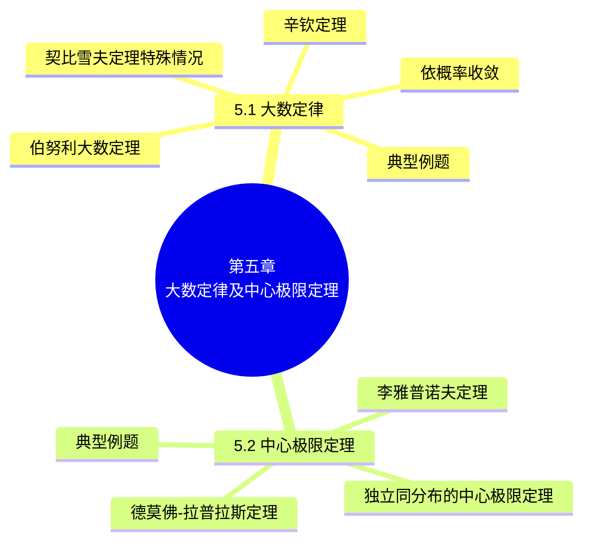

# 第五章 大数定律及中心极限定理

> **本章主线**：第一章的"频率稳定于概率"是一个经验事实，本章用**大数定律**把它上升为严格的数学定理——契比雪夫定理的特殊情况（独立同分布、方差存在时算术平均依概率收敛于期望）、伯努利大数定理（频率依概率收敛于概率）、辛钦定理（去掉方差条件后算术平均仍收敛于期望）。在此基础上引入**依概率收敛**的概念。另一方面，大量独立随机变量之和的分布趋于正态分布——**中心极限定理**给出了严格的表述：独立同分布的中心极限定理、李雅普诺夫定理（不必同分布）、德莫佛-拉普拉斯定理（二项分布的正态逼近），使我们可以用正态分布近似计算大样本下二项分布及一般和的概率。

## 5.1 大数定律

### 5.1.1 问题的引入

**实例（频率的稳定性）**：随着试验次数的增加，事件发生的频率逐渐稳定于某个常数（第一章 1.3 节已见：抛硬币试验中频率稳定于 0.5）。启示：从实践中人们发现**大量测量值的算术平均值有稳定性**——例如测量某物理量多次，取平均能消除随机误差。

问题：如何用严格的数学语言刻画"频率稳定于概率"与"算术平均稳定于期望"？——这就是大数定律。

### 5.1.2 定理一（契比雪夫定理的特殊情况）

**定理**：设随机变量 $X_1, X_2, \dots, X_n, \dots$ 相互独立，且具有相同的数学期望和方差：$E(X_k) = \mu$，$D(X_k) = \sigma^2$（$k = 1, 2, \dots$），作前 $n$ 个随机变量的算术平均 $\bar{X} = \dfrac{1}{n}\sum_{k=1}^{n} X_k$，则对于任意正数 $\varepsilon$ 有

$$\lim_{n \to \infty} P\{|\bar{X} - \mu| < \varepsilon\} = \lim_{n \to \infty} P\left\{\left|\frac{1}{n}\sum_{k=1}^{n} X_k - \mu\right| < \varepsilon\right\} = 1$$

**证明**：由期望与方差的性质，
$$E\left[\frac{1}{n}\sum_{k=1}^{n} X_k\right] = \frac{1}{n}\sum_{k=1}^{n} E(X_k) = \frac{1}{n} \cdot n\mu = \mu, \qquad D\left[\frac{1}{n}\sum_{k=1}^{n} X_k\right] = \frac{1}{n^2}\sum_{k=1}^{n} D(X_k) = \frac{1}{n^2} \cdot n\sigma^2 = \frac{\sigma^2}{n}$$
由契比雪夫不等式（第四章）可得
$$P\left\{\left|\frac{1}{n}\sum_{k=1}^{n} X_k - \mu\right| < \varepsilon\right\} \geq 1 - \frac{\sigma^2}{\varepsilon^2 n}$$
在上式中令 $n \to \infty$，并注意到概率不能大于 1，则
$$\lim_{n \to \infty} P\left\{\left|\frac{1}{n}\sum_{k=1}^{n} X_k - \mu\right| < \varepsilon\right\} = 1$$

**关于定理一的说明**：当 $n$ 很大时，随机变量 $X_1, X_2, \dots, X_n$ 的算术平均 $\dfrac{1}{n}\sum_{k=1}^{n} X_k$ 接近于数学期望 $E(X_1) = E(X_2) = \dots = E(X_k) = \mu$（这个接近是**概率意义下的接近**）。即在定理条件下，$n$ 个随机变量的算术平均，当 $n$ 无限增加时，**几乎变成一个常数**。

### 5.1.3 依概率收敛

**定义**：设 $Y_1, Y_2, \dots, Y_n$ 是一个随机变量序列，$a$ 是一个常数，若对于任意正数 $\varepsilon$ 有

$$\lim_{n \to \infty} P\{|Y_n - a| < \varepsilon\} = 1$$

则称序列 $Y_1, Y_2, \dots, Y_n$ **依概率收敛于** $a$，记为 $Y_n \xrightarrow{P} a$。

> 定理一的另一种叙述：在上述定理条件下，序列 $\bar{X} = \dfrac{1}{n}\sum_{k=1}^{n} X_k$ 依概率收敛于 $\mu$，即 $\bar{X} \xrightarrow{P} \mu$。

**依概率收敛序列的性质**：设 $X_n \xrightarrow{P} a$，$Y_n \xrightarrow{P} b$，又设函数 $g(x, y)$ 在点 $(a, b)$ 连续，则

$$g(X_n, Y_n) \xrightarrow{P} g(a, b)$$

**证明**：因为 $g(x, y)$ 在 $(a, b)$ 连续，$\forall \varepsilon > 0$，$\exists \delta > 0$，使得当 $|x - a| + |y - b| < \delta$ 时，$|g(x, y) - g(a, b)| < \varepsilon$。于是
$$\{|g(X_n, Y_n) - g(a, b)| \geq \varepsilon\} \subset \{|X_n - a| + |Y_n - b| \geq \delta\} \subset \left\{|X_n - a| \geq \frac{\delta}{2}\right\} \cup \left\{|Y_n - b| \geq \frac{\delta}{2}\right\}$$
因此
$$P\{|g(X_n, Y_n) - g(a, b)| \geq \varepsilon\} \leq P\left\{|X_n - a| \geq \frac{\delta}{2}\right\} + P\left\{|Y_n - b| \geq \frac{\delta}{2}\right\} \xrightarrow{n \to \infty} 0$$
故 $\lim_{n \to \infty} P\{|g(X_n, Y_n) - g(a, b)| < \varepsilon\} = 1$。[证毕]

### 5.1.4 定理二（伯努利大数定理）

**定理**：设 $n_A$ 是 $n$ 次独立重复试验中事件 $A$ 发生的次数，$p$ 是事件 $A$ 在每次试验中发生的概率，则对于任意正数 $\varepsilon > 0$，有

$$\lim_{n \to \infty} P\left\{\left|\frac{n_A}{n} - p\right| < \varepsilon\right\} = 1 \qquad \text{或} \qquad \lim_{n \to \infty} P\left\{\left|\frac{n_A}{n} - p\right| \geq \varepsilon\right\} = 0$$

**证明**：引入随机变量 $X_k = \begin{cases} 0, & \text{若在第 } k \text{ 次试验中 } A \text{ 不发生}, \\ 1, & \text{若在第 } k \text{ 次试验中 } A \text{ 发生}, \end{cases}$（$k = 1, 2, \dots$），显然 $n_A = X_1 + X_2 + \dots + X_n$。因为 $X_1, X_2, \dots, X_n, \dots$ 是相互独立的，且 $X_k$ 服从以 $p$ 为参数的 $(0-1)$ 分布，所以 $E(X_k) = p$，$D(X_k) = p(1-p)$（$k = 1, 2, \dots$）。根据定理一有
$$\lim_{n \to \infty} P\left\{\left|\frac{1}{n}(X_1 + X_2 + \dots + X_n) - p\right| < \varepsilon\right\} = 1, \qquad \text{即} \qquad \lim_{n \to \infty} P\left\{\left|\frac{n_A}{n} - p\right| < \varepsilon\right\} = 1$$

**关于伯努利定理的说明**：伯努利定理表明事件发生的频率 $\dfrac{n_A}{n}$ **依概率收敛于事件的概率 $p$**，它以严格的数学形式表达了**频率的稳定性**。故而当 $n$ 很大时，事件发生的频率与概率有较大偏差的可能性很小。在实际应用中，当试验次数很大时，便可以用事件发生的频率来代替事件的概率。

### 5.1.5 定理三（辛钦定理）

**定理**：设随机变量 $X_1, X_2, \dots, X_n, \dots$ 相互独立，服从同一分布，且具有数学期望 $E(X_k) = \mu$（$k = 1, 2, \dots$），则对于任意正数 $\varepsilon$，有

$$\lim_{n \to \infty} P\left\{\left|\frac{1}{n}\sum_{k=1}^{n} X_k - \mu\right| < \varepsilon\right\} = 1$$

**关于辛钦定理的说明**：

1. 与定理一相比，**不要求方差存在**——只要求同分布且期望存在；
2. **伯努利定理是辛钦定理的特殊情况**（$(0-1)$ 分布的算术平均即频率）。

### 5.1.6 典型例题

**例 1** 设随机变量 $X_1, X_2, \dots, X_n, \dots$ 相互独立，具有如下分布律：

| $X_n$ | $-na$ | 0 | $na$ |
| :--: | :--: | :--: | :--: |
| $P$ | $\dfrac{1}{2n^2}$ | $1 - \dfrac{1}{n^2}$ | $\dfrac{1}{2n^2}$ |

问是否满足契比雪夫定理？

- **独立性**依题意可知；检验是否具有数学期望：
$$E(X_n) = -na \cdot \frac{1}{2n^2} + 0 \cdot \left(1 - \frac{1}{n^2}\right) + na \cdot \frac{1}{2n^2} = 0$$
  说明每一个随机变量都有数学期望；
- 检验是否具有有限方差：
$$E(X_n^2) = 2(na)^2 \cdot \frac{1}{2n^2} = a^2, \qquad D(X_n) = E(X_n^2) - [E(X_n)]^2 = a^2$$
  说明离散型随机变量有有限方差；
- 故满足契比雪夫定理的条件。

**例 2** 设随机变量 $X_1, X_2, \dots, X_n, \dots$ 独立同分布，且 $E(X_k) = 0$，$D(X_k) = \sigma^2$（$k = 1, 2, \dots$），证明对任意正数 $\varepsilon$ 有

$$\lim_{n \to \infty} P\left\{\left|\frac{1}{n}\sum_{k=1}^{n} X_k^2 - \sigma^2\right| < \varepsilon\right\} = 1$$

- 因为 $X_1, X_2, \dots, X_n, \dots$ 是相互独立的，所以 $X_1^2, X_2^2, \dots, X_n^2, \dots$ 也是相互独立的；
- 由 $E(X_k) = 0$，得 $E(X_k^2) = D(X_k) + [E(X_k)]^2 = \sigma^2$（$k = 1, 2, \dots$）；
- 由辛钦定理知：对于任意正数 $\varepsilon$，有 $\lim_{n \to \infty} P\left\{\left|\frac{1}{n}\sum_{k=1}^{n} X_k^2 - \sigma^2\right| < \varepsilon\right\} = 1$。

> 注：例 2 说明样本二阶原点矩 $\dfrac{1}{n}\sum X_k^2$ 依概率收敛于总体二阶原点矩 $\sigma^2$——这是"矩估计法"的理论依据。

**小结**：三个大数定理——**契比雪夫定理的特殊情况**（独立同分布、方差存在）、**伯努利大数定理**（频率收敛于概率）、**辛钦定理**（去掉方差条件）。频率的稳定性是概率定义的客观基础，而伯努利大数定理以严密的数学形式论证了频率的稳定性。

---

## 5.2 中心极限定理

### 5.2.1 问题的引入

**实例（射击偏差）**：考察射击命中点与靶心距离的偏差。这种偏差是大量微小的偶然因素造成的微小误差的总和，这些因素包括：瞄准误差、测量误差、子弹制造过程方面（如外形、重量等）的误差以及射击时武器的振动、气象因素（如风速、风向、能见度、温度等）的作用。所有这些不同因素所引起的微小误差是相互独立的，并且它们中每一个对总和产生的影响不大。

**问题**：某个随机变量是由大量相互独立且均匀小的随机变量相加而成的，研究其概率分布情况。

### 5.2.2 定理四（独立同分布的中心极限定理）

**定理**：设随机变量 $X_1, X_2, \dots, X_n, \dots$ 相互独立，服从同一分布，且具有数学期望和方差：$E(X_k) = \mu$，$D(X_k) = \sigma^2 > 0$（$k = 1, 2, \dots$），则随机变量之和的**标准化变量**

$$Y_n = \frac{\sum_{k=1}^{n} X_k - E\left(\sum_{k=1}^{n} X_k\right)}{\sqrt{D\left(\sum_{k=1}^{n} X_k\right)}} = \frac{\sum_{k=1}^{n} X_k - n\mu}{\sqrt{n}\,\sigma}$$

的分布函数 $F_n(x)$ 对于任意 $x$ 满足

$$\lim_{n \to \infty} F_n(x) = \lim_{n \to \infty} P\left\{\frac{\sum_{k=1}^{n} X_k - n\mu}{\sqrt{n}\,\sigma} \leq x\right\} = \int_{-\infty}^{x} \frac{1}{\sqrt{2\pi}} e^{-\frac{t^2}{2}}\,dt = \Phi(x)$$

**定理四表明**：当 $n$ 充分大时，$\sum_{k=1}^{n} X_k$ 近似服从正态分布 $N(n\mu, n\sigma^2)$（无论 $X_k$ 服从什么分布），即

$$\sum_{k=1}^{n} X_k \;\dot{\sim}\; N(n\mu, n\sigma^2), \qquad \frac{1}{n}\sum_{k=1}^{n} X_k \;\dot{\sim}\; N\left(\mu, \frac{\sigma^2}{n}\right)$$

### 5.2.3 定理五（李雅普诺夫定理）

**定理**：设随机变量 $X_1, X_2, \dots, X_n, \dots$ 相互独立，它们具有数学期望和方差：$E(X_k) = \mu_k$，$D(X_k) = \sigma_k^2 \neq 0$（$k = 1, 2, \dots$），记 $B_n^2 = \sum_{k=1}^{n} \sigma_k^2$。若存在正数 $\delta$，使得当 $n \to \infty$ 时，

$$\frac{1}{B_n^{2+\delta}} \sum_{k=1}^{n} E\{|X_k - \mu_k|^{2+\delta}\} \to 0$$

则随机变量之和的标准化变量

$$Z_n = \frac{\sum_{k=1}^{n} X_k - E\left(\sum_{k=1}^{n} X_k\right)}{\sqrt{D\left(\sum_{k=1}^{n} X_k\right)}} = \frac{\sum_{k=1}^{n} X_k - \sum_{k=1}^{n} \mu_k}{B_n}$$

的分布函数 $F_n(x)$ 对于任意 $x$ 满足

$$\lim_{n \to \infty} F_n(x) = \lim_{n \to \infty} P\left\{\frac{\sum_{k=1}^{n} X_k - \sum_{k=1}^{n} \mu_k}{B_n} \leq x\right\} = \int_{-\infty}^{x} \frac{1}{\sqrt{2\pi}} e^{-\frac{t^2}{2}}\,dt = \Phi(x)$$

**定理五表明**：无论各个随机变量 $X_1, X_2, \dots, X_n, \dots$ 服从什么分布，只要满足定理的条件，那么它们的和 $\sum_{k=1}^{n} X_k$ 当 $n$ 很大时**近似地服从正态分布**（如实例中射击偏差服从正态分布）。

> 李雅普诺夫定理的条件（$2+\delta$ 阶绝对矩条件）比定理四更弱——它允许 $X_k$ **不必同分布**，只需各"微小项"对总和的贡献均匀地小。

### 5.2.4 定理六（德莫佛-拉普拉斯定理）

**定理**：设随机变量 $\eta_n$（$n = 1, 2, \dots$）服从参数为 $n$、$p$（$0 < p < 1$）的二项分布，则对于任意 $x$，恒有

$$\lim_{n \to \infty} P\left\{\frac{\eta_n - np}{\sqrt{np(1-p)}} \leq x\right\} = \int_{-\infty}^{x} \frac{1}{\sqrt{2\pi}} e^{-\frac{t^2}{2}}\,dt = \Phi(x)$$

**证明**：根据第四章第二节例题可知 $\eta_n = \sum_{k=1}^{n} X_k$，其中 $X_1, X_2, \dots, X_n$ 是相互独立的、服从同一 $(0-1)$ 分布的随机变量，分布律为 $P\{X_k = i\} = p^i(1-p)^{1-i}$（$i = 0, 1$）。因为 $E(X_k) = p$，$D(X_k) = p(1-p)$（$k = 1, 2, \dots, n$），根据定理四得

$$\lim_{n \to \infty} P\left\{\frac{\eta_n - np}{\sqrt{np(1-p)}} \leq x\right\} = \Phi(x)$$

**定理六表明**：**正态分布是二项分布的极限分布**——当 $n$ 充分大时，可以利用该定理来计算二项分布的概率。

> 实际应用：$X \sim b(n, p)$，当 $n$ 很大时 $X \;\dot{\sim}\; N(np, np(1-p))$，即 $P\{a < X \leq b\} \approx \Phi\left(\dfrac{b - np}{\sqrt{np(1-p)}}\right) - \Phi\left(\dfrac{a - np}{\sqrt{np(1-p)}}\right)$。

### 5.2.5 典型例题

**例 1（噪声电压之和）** 一加法器同时收到 20 个噪声电压 $V_k$（$k = 1, 2, \dots, 20$），设它们是相互独立的随机变量，且都在区间 $(0, 10)$ 上服从均匀分布，记 $V = \sum_{k=1}^{20} V_k$，求 $P\{V > 105\}$ 的近似值。

- $E(V_k) = \dfrac{0+10}{2} = 5$，$D(V_k) = \dfrac{(10-0)^2}{12} = \dfrac{100}{12}$（$k = 1, 2, \dots, 20$）；
- 由定理四，随机变量 $Z = \dfrac{V - 20 \times 5}{\sqrt{20 \times \frac{100}{12}}}$ 近似服从正态分布 $N(0, 1)$；
- $P\{V > 105\} = P\left\{\dfrac{V - 100}{\sqrt{20 \times \frac{100}{12}}} > \dfrac{105 - 100}{\sqrt{20 \times \frac{100}{12}}}\right\} = P\{Z > 0.387\} \approx 1 - \Phi(0.387) = 0.349$。

> 注：课件（浙大教材）此例的题设区间为 $(0, 10)$（$E = 5$，$D = 100/12$ 与之自洽），此处按之书写。

**例 2（船舶海浪）** 一船舶在某海区航行，已知每遭受一次海浪的冲击，纵摇角大于 3° 的概率为 $1/3$。若船舶遭受了 90000 次波浪冲击，问其中有 29500~30500 次纵摇角大于 3° 的概率是多少？

- 将船舶每遭受一次海浪的冲击看作一次试验，并假设各次试验是独立的，在 90000 次波浪冲击中纵摇角大于 3° 的次数为 $X$，则 $X$ 是一个随机变量，且 $X \sim b\left(90000, \dfrac{1}{3}\right)$，分布律为 $P\{X = k\} = C_{90000}^k\left(\dfrac{1}{3}\right)^k\left(\dfrac{2}{3}\right)^{90000-k}$（$k = 1, \dots, 90000$）；
- 所求概率为 $P\{29500 < X \leq 30500\}$，直接计算很麻烦，利用德莫佛-拉普拉斯定理（$np = 30000$，$\sqrt{np(1-p)} = \sqrt{20000}$）：
$$P\{29500 < X \leq 30500\} \approx \Phi\left(\frac{30500 - np}{\sqrt{np(1-p)}}\right) - \Phi\left(\frac{29500 - np}{\sqrt{np(1-p)}}\right) = \Phi\left(\frac{5}{\sqrt{2}}\right) - \Phi\left(-\frac{5}{\sqrt{2}}\right) = 0.9995$$

**例 3（保险公司亏本概率）** 某保险公司的老年人寿保险有 1 万人参加，每人每年交 200 元。若老人在该年内死亡，公司付给家属 1 万元。设老年人死亡率为 0.017，试求保险公司在一年内的这项保险中亏本的概率。

- 设 $X$ 为一年中投保老人的死亡数，则 $X \sim B(n, p)$，其中 $n = 10000$，$p = 0.017$；
- 保险公司亏本的概率（死亡赔偿 $10000X$ 超过保费收入 $10000 \times 200$，即 $X > 200$）：
$$P\{10000X > 10000 \times 200\} = P\{X > 200\} = P\left\{\frac{X - np}{\sqrt{np(1-p)}} > \frac{200 - np}{\sqrt{np(1-p)}}\right\}$$
- 其中 $np = 170$，$\sqrt{np(1-p)} = \sqrt{167.11} \approx 12.93$，$\dfrac{200 - 170}{12.93} = 2.321$，由德莫佛-拉普拉斯定理：
$$P\{X > 200\} \approx 1 - \Phi(2.321) \approx 0.01$$

> 保险公司亏本的概率约为 1%，说明该险种定价在统计意义上是安全的。

**例 4（家长会）** 对于一个学生而言，来参加家长会的家长人数是一个随机变量。设一个学生无家长、1 名家长、2 名家长来参加会议的概率分别为 0.05、0.8、0.15。若学校共有 400 名学生，设各学生参加会议的家长数相互独立，且服从同一分布。(1) 求参加会议的家长数 $X$ 超过 450 的概率；(2) 求有 1 名家长来参加会议的学生数不多于 340 的概率。

- (1) 以 $X_k$（$k = 1, 2, \dots, 400$）记第 $k$ 个学生来参加会议的家长数，则 $X_k$ 的分布律为

| $X_k$ | 0 | 1 | 2 |
| :--: | :--: | :--: | :--: |
| $p_k$ | 0.05 | 0.8 | 0.15 |

  易知 $E(X_k) = 1.1$，$D(X_k) = 0.19$（$k = 1, 2, \dots, 400$）。而 $X = \sum_{k=1}^{400} X_k$，根据独立同分布的中心极限定理，随机变量 $\dfrac{X - 400 \times 1.1}{\sqrt{400 \times 0.19}}$ 近似服从正态分布 $N(0, 1)$，于是
$$P\{X > 450\} = P\left\{\frac{X - 400 \times 1.1}{\sqrt{400 \times 0.19}} > \frac{450 - 400 \times 1.1}{\sqrt{400 \times 0.19}}\right\} = 1 - P\left\{\frac{X - 440}{\sqrt{76}} \leq 1.147\right\} \approx 1 - \Phi(1.147) = 0.1257$$

- (2) 以 $Y$ 记有一名家长来参加会议的学生数，则 $Y \sim b(400, 0.8)$，由德莫佛-拉普拉斯定理知（$np = 320$，$\sqrt{np(1-p)} = 8$）：
$$P\{Y \leq 340\} = P\left\{\frac{Y - 400 \times 0.8}{\sqrt{400 \times 0.8 \times 0.2}} \leq \frac{340 - 320}{8}\right\} \approx \Phi(2.5) = 0.9938$$

> 注：第 (1) 问中 $\Phi(1.147) \approx 0.8744$，故精确值约为 0.1257（课件的 0.1357 系查表笔误）。

**例 5（均匀分布平方和）** 设随机变量 $X_1, X_2, \dots, X_n$ 相互独立，且 $X_i$ 在区间 $(-1, 1)$ 上服从均匀分布（$i = 1, 2, \dots, n$），试证当 $n$ 充分大时，随机变量 $Z_n = \dfrac{1}{n}\sum_{i=1}^{n} X_i^2$ 近似服从正态分布，并指出其分布参数。

- 记 $Y_i = X_i^2$（$i = 1, 2, \dots, n$），则
$$E(Y_i) = E(X_i^2) = D(X_i) = \frac{[1 - (-1)]^2}{12} = \frac{1}{3}, \qquad D(Y_i) = E(Y_i^2) - [E(Y_i)]^2 = E(X_i^4) - [E(Y_i)]^2$$
- 因为 $E(X_i^4) = \displaystyle \int_{-1}^{1} x^4 \cdot \frac{1}{2}\,dx = \frac{1}{5}$，所以 $D(Y_i) = \dfrac{1}{5} - \left(\dfrac{1}{3}\right)^2 = \dfrac{4}{45}$；
- 因为 $X_1, X_2, \dots, X_n$ 相互独立，所以 $Y_1, Y_2, \dots, Y_n$ 相互独立；
- 根据独立同分布的中心极限定理，$n \cdot Z_n = \sum_{i=1}^{n} X_i^2 = \sum_{i=1}^{n} Y_i$ 近似服从正态分布 $N\left(\dfrac{n}{3}, \dfrac{4n}{45}\right)$；
- 故 $Z_n$ 近似地服从正态分布 $N\left(\dfrac{1}{3}, \dfrac{4}{45n}\right)$。

---

### 知识定位与框架衔接

**前置知识**：第四章的契比雪夫不等式是定理一证明的直接工具；期望、方差的性质（第四章）用于计算算术平均的期望与方差；$(0-1)$ 分布、二项分布（第二章）是伯努利定理与德莫佛-拉普拉斯定理的原料；依概率收敛与第一章"频率稳定于概率"的直觉相呼应。

**后置知识**：本章是概率论的收官章，也是数理统计的理论入口——大数定律保证样本均值、样本矩"依概率收敛"于总体参数（矩估计的合理性）；中心极限定理则直接导出大样本下样本均值的正态近似，是区间估计与假设检验（假设检验、置信区间）的基石；正态分布在数理统计中的核心地位部分正源于中心极限定理。

**故事比喻**：可以把大数定律想象成"水滴石穿"——一滴水（单个随机变量）微不足道，但成千上万滴水（大量独立同分布变量）的合力（算术平均）稳定地趋向一个确定值（期望），误差被"平均掉"了。中心极限定理则是"众声喧哗成旋律"——无数独立的小噪声叠加，最终合成了优美的正态曲线。

**四个灵魂问题**：

1. **"大数定律到底'大'在哪里？"** —— 大在"大量"：当独立同分布变量的个数 $n \to \infty$ 时，算术平均依概率收敛于期望；它把"频率稳定于概率"的经验事实严格化，是"用频率估计概率、用样本均值估计期望"的理论依据。
2. **"契比雪夫、伯努利、辛钦三个大数定律有何区别？"** —— 契比雪夫：独立同分布且方差存在（证明依赖契比雪夫不等式）；伯努利：$(0-1)$ 分布特例（频率 → 概率），是辛钦的特殊情况；辛钦：只需同分布 + 期望存在（去掉方差条件），条件最弱。
3. **"中心极限定理告诉我们什么？"** —— 大量独立随机变量之和（在适当标准化后）近似服从标准正态分布，**与各变量自身的分布无关**——这是正态分布"无处不在"的根本原因。
4. **"德莫佛-拉普拉斯定理有什么用？"** —— 二项分布 $b(n,p)$ 在 $n$ 大时用 $N(np, np(1-p))$ 近似，避免了 $C_n^k p^k(1-p)^{n-k}$ 的巨额计算——与第二章"二项逼近泊松"（$n$ 大 $p$ 小）互补：$n$ 大时无论 $p$ 如何都可用正态逼近。

**本章小结**：第五章用大数定律（契比雪夫、伯努利、辛钦）为"频率稳定于概率、平均稳定于期望"提供了严格的数学保证，用中心极限定理（独立同分布、李雅普诺夫、德莫佛-拉普拉斯）揭示了"大量独立随机变量之和趋于正态"的普适规律。这两类定理共同完成了概率论从"描述随机性"到"驾驭随机性"的跨越，也为数理统计的估计与检验奠定了理论基础。

---

## 课件 PDF

<iframe src="https://naimore3.github.io/Naimore3-s-Learning-Notes/课程笔记/大二上/概率论与数理统计/第五章/第五章.pdf" style="width: 100%; height: 600px; border: none;"></iframe>

PDF 原文：[第五章 大数定律及中心极限定理](https://naimore3.github.io/Naimore3-s-Learning-Notes/课程笔记/大二上/概率论与数理统计/第五章/第五章.pdf)
