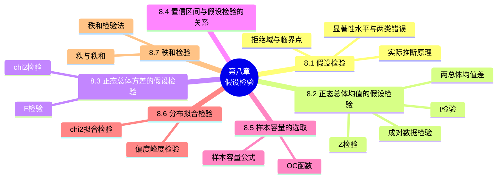

# 第八章 假设检验

> **本章主线**：第七章解决了"用样本估计参数"（估计），本章解决"用样本判断关于总体的假设是否成立"（检验）。核心思想是**实际推断原理**（小概率事件在一次试验中几乎不可能发生）：先提出原假设 $H_0$ 与备择假设 $H_1$，构造**检验统计量**并确定**拒绝域**，若样本观察值落入拒绝域则拒绝 $H_0$。本章系统给出正态总体均值（$\sigma^2$ 已知用 $Z$ 检验、未知用 $t$ 检验，含单总体、双总体、成对数据三种情形）与方差（$\chi^2$ 检验、$F$ 检验）的检验法及拒绝域汇总表 8.1；阐明**置信区间与假设检验的对应关系**（接受域即置信区间）；引入**施行特征函数（OC 函数）**用于控制第二类错误并选取样本容量；最后介绍**分布拟合检验**（$\chi^2$ 拟合检验法、偏度峰度检验）与**秩和检验**（非参数检验）两大非参数方法。

## 8.1 假设检验

### 8.1.1 假设检验的基本原理

在总体的分布函数完全未知或只知其形式、但不知其参数的情况下，为了推断总体的某些性质，提出某些关于总体的假设（例如提出总体服从泊松分布的假设；又如对于正态总体提出数学期望等于 $\mu_0$ 的假设等）。**假设检验**就是根据样本对所提出的假设作出判断：是接受，还是拒绝。

如何利用样本值对一个具体的假设进行检验？通常借助于直观分析和理论分析相结合的做法，其基本原理就是人们在实际问题中经常采用的所谓**实际推断原理**："一个小概率事件在一次试验中几乎是不可能发生的"。

**实例（包装机）** 某车间用一台包装机包装葡萄糖，包得的袋装糖重是一个随机变量，它服从正态分布。当机器正常时，其均值为 0.5 千克，标准差为 0.015 千克。某日开工后为检验包装机是否正常，随机地抽取它所包装的糖 9 袋，称得净重（千克）为：0.497, 0.506, 0.518, 0.524, 0.498, 0.511, 0.520, 0.515, 0.512，问机器是否正常？

- 分析：用 $\mu$ 和 $\sigma$ 分别表示这一天袋装糖重总体 $X$ 的均值和标准差。由长期实践可知标准差较稳定，设 $\sigma = 0.015$，则 $X \sim N(\mu, 0.015^2)$，其中 $\mu$ 未知。问题：根据样本值判断 $\mu = 0.5$ 还是 $\mu \neq 0.5$。
- 提出两个对立假设 $H_0: \mu = \mu_0 = 0.5$ 和 $H_1: \mu \neq \mu_0$。再利用已知样本作出判断：是接受假设 $H_0$（拒绝假设 $H_1$），还是拒绝假设 $H_0$（接受假设 $H_1$）。如果接受 $H_0$，则 $\mu = \mu_0$，即认为机器工作是正常的；否则认为不正常。
- 由于要检验的假设涉及总体均值，故可借助样本均值来判断。因为 $\bar{X}$ 是 $\mu$ 的无偏估计量，所以若 $H_0$ 为真，则 $|\bar{x} - \mu_0|$ 不应太大。当 $H_0$ 为真时 $\dfrac{\bar{X} - \mu_0}{\sigma/\sqrt{n}} \sim N(0,1)$，衡量 $|\bar{x}-\mu_0|$ 的大小可归结为衡量 $\left|\dfrac{\bar{x}-\mu_0}{\sigma/\sqrt{n}}\right|$ 的大小，于是选定一个适当的正数 $k$：当观察值满足 $\left|\dfrac{\bar{x}-\mu_0}{\sigma/\sqrt{n}}\right| \geq k$ 时拒绝 $H_0$，反之接受 $H_0$。因为当 $H_0$ 为真时 $Z = \dfrac{\bar{X}-\mu_0}{\sigma/\sqrt{n}} \sim N(0,1)$，由标准正态分布分位点的定义得 $k = z_{\alpha/2}$。
- 检验过程：若取定 $\alpha = 0.05$，则 $k = z_{\alpha/2} = z_{0.025} = 1.96$。又已知 $n = 9$，$\sigma = 0.015$，由样本算得 $\bar{x} = 0.511$，即有 $\dfrac{\bar{x}-\mu_0}{\sigma/\sqrt{n}} = \dfrac{0.511 - 0.5}{0.015/3} = 2.2 > 1.96$，于是**拒绝假设 $H_0$**，认为包装机工作不正常。
- 以上所采取的检验法是符合实际推断原理的。由于通常 $\alpha$ 总是取得很小（一般取 $\alpha = 0.01, 0.05$），因而当 $H_0$ 为真、即 $\mu = \mu_0$ 时，$\left\{\left|\dfrac{\bar{X}-\mu_0}{\sigma/\sqrt{n}}\right| \geq z_{\alpha/2}\right\}$ 是一个小概率事件。根据实际推断原理，如果 $H_0$ 为真，由一次试验得到满足不等式 $\left|\dfrac{\bar{x}-\mu_0}{\sigma/\sqrt{n}}\right| \geq z_{\alpha/2}$ 的观察值 $\bar{x}$ 几乎是不会发生的；在一次试验中居然得到了这样的观察值，则我们有理由怀疑原假设 $H_0$ 的正确性，因而拒绝 $H_0$。若观察值满足 $\left|\dfrac{\bar{x}-\mu_0}{\sigma/\sqrt{n}}\right| < z_{\alpha/2}$，则没有理由拒绝假设 $H_0$，因而只能接受 $H_0$。

### 8.1.2 假设检验的相关概念

1. **显著性水平**：当样本容量固定时，选定 $\alpha$ 后数 $k$ 就可以确定，然后按照统计量 $Z = \dfrac{\bar{x}-\mu_0}{\sigma/\sqrt{n}}$ 的观察值的绝对值大于等于 $k$ 还是小于 $k$ 来作决定。如果 $|z| \geq k$，则称 $\bar{x}$ 与 $\mu_0$ 的差异是**显著的**，拒绝 $H_0$；反之，如果 $|z| < k$，则称 $\bar{x}$ 与 $\mu_0$ 的差异是**不显著的**，接受 $H_0$。数 $\alpha$ 称为**显著性水平**——上述判断是在显著性水平 $\alpha$ 之下作出的。
2. **检验统计量**：统计量 $Z = \dfrac{\bar{X}-\mu_0}{\sigma/\sqrt{n}}$ 称为**检验统计量**。
3. **原假设与备择假设**：假设检验问题通常叙述为"在显著性水平 $\alpha$ 下，检验假设 $H_0: \mu = \mu_0$，$H_1: \mu \neq \mu_0$"，或称为"在显著性水平 $\alpha$ 下，针对 $H_1$ 检验 $H_0$"。$H_0$ 称为**原假设或零假设**，$H_1$ 称为**备择假设**。
4. **拒绝域与临界点**：当检验统计量取某个区域 $C$ 中的值时我们拒绝原假设 $H_0$，则称区域 $C$ 为**拒绝域**，拒绝域的边界点称为**临界点**。如在前面实例中，拒绝域为 $|z| \geq z_{\alpha/2}$，临界点为 $z = -z_{\alpha/2}$、$z = z_{\alpha/2}$。
5. **两类错误及记号**：假设检验的依据是"小概率事件在一次试验中很难发生"，但很难发生不等于不发生，因而假设检验所作出的结论有可能是错误的。这种错误有两类：
   - **第一类错误（弃真错误）**：当原假设 $H_0$ 为真，观察值却落入拒绝域而作出了拒绝 $H_0$ 的判断——"以真为假"。犯第一类错误的概率是显著性水平 $\alpha$；
   - **第二类错误（取伪错误）**：当原假设 $H_0$ 不真，而观察值却落入接受域而作出了接受 $H_0$ 的判断——"以假为真"。犯第二类错误的概率记为 $P\{\text{当 } H_0 \text{ 不真接受 } H_0\}$ 或 $P_{\mu \in H_1}\{\text{接受 } H_0\}$。
   - 当样本容量 $n$ 一定时，若减少犯第一类错误的概率，则犯第二类错误的概率往往增大；若要使犯两类错误的概率都减小，除非**增加样本容量**。
6. **显著性检验**：只对犯第一类错误的概率加以控制，而不考虑犯第二类错误的概率的检验，称为**显著性检验**。
7. **双边备择假设与双边假设检验**：在 $H_0: \mu = \mu_0$ 和 $H_1: \mu \neq \mu_0$ 中，备择假设 $H_1$ 表示 $\mu$ 可能大于 $\mu_0$，也可能小于 $\mu_0$，称为**双边备择假设**；形如 $H_0: \mu = \mu_0$，$H_1: \mu \neq \mu_0$ 的假设检验称为**双边假设检验**。
8. **右边检验与左边检验**：形如 $H_0: \mu = \mu_0$，$H_1: \mu > \mu_0$ 的假设检验称为**右边检验**；形如 $H_0: \mu = \mu_0$，$H_1: \mu < \mu_0$ 的称为**左边检验**。右边检验与左边检验统称为**单边检验**。
9. **单边检验的拒绝域**：设总体 $X \sim N(\mu, \sigma^2)$，$\sigma$ 为已知，给定显著性水平 $\alpha$，则
   - **右边检验的拒绝域**为 $z = \dfrac{\bar{x}-\mu_0}{\sigma/\sqrt{n}} \geq z_\alpha$；
   - **左边检验的拒绝域**为 $z = \dfrac{\bar{x}-\mu_0}{\sigma/\sqrt{n}} \leq -z_\alpha$。

**证明**（右边检验）：检验 $H_0: \mu \leq \mu_0$，$H_1: \mu > \mu_0$，取检验统计量 $Z = \dfrac{\bar{X}-\mu_0}{\sigma/\sqrt{n}}$。因 $H_0$ 中的全部 $\mu$ 都比 $H_1$ 中的 $\mu$ 要小，当 $H_1$ 为真时观察值 $\bar{x}$ 往往偏大，因此拒绝域的形式为 $\bar{x} \geq k$（$k$ 为待定正常数）。由 $P\{H_0 \text{ 为真拒绝 } H_0\} = P_{\mu \leq \mu_0}\{\bar{X} \geq k\}$，因 $\mu \leq \mu_0$ 时 $\dfrac{\bar{X}-\mu}{\sigma/\sqrt{n}} \geq \dfrac{\bar{X}-\mu_0}{\sigma/\sqrt{n}}$（事件包含），故
$$P_{\mu \leq \mu_0}\left\{\frac{\bar{X}-\mu_0}{\sigma/\sqrt{n}} \geq \frac{k-\mu_0}{\sigma/\sqrt{n}}\right\} \leq P_{\mu \leq \mu_0}\left\{\frac{\bar{X}-\mu}{\sigma/\sqrt{n}} \geq \frac{k-\mu_0}{\sigma/\sqrt{n}}\right\}$$
要控制 $P\{H_0 \text{ 为真拒绝 } H_0\} \leq \alpha$，只需令 $P_{\mu \leq \mu_0}\left\{\dfrac{\bar{X}-\mu}{\sigma/\sqrt{n}} \geq \dfrac{k-\mu_0}{\sigma/\sqrt{n}}\right\} = \alpha$。因为 $\dfrac{\bar{X}-\mu}{\sigma/\sqrt{n}} \sim N(0,1)$，所以 $\dfrac{k-\mu_0}{\sigma/\sqrt{n}} = z_\alpha$，$k = \mu_0 + \dfrac{\sigma}{\sqrt{n}}z_\alpha$，故右边检验的拒绝域为 $\bar{x} \geq \mu_0 + \dfrac{\sigma}{\sqrt{n}}z_\alpha$，即 $z = \dfrac{\bar{x}-\mu_0}{\sigma/\sqrt{n}} \geq z_\alpha$。左边检验同理得拒绝域 $z \leq -z_\alpha$。

### 8.1.3 假设检验的一般步骤

1. 根据实际问题的要求，提出原假设 $H_0$ 及备择假设 $H_1$；
2. 给定显著性水平 $\alpha$ 以及样本容量 $n$；
3. 确定检验统计量以及拒绝域形式；
4. 按 $P\{H_0 \text{ 为真拒绝 } H_0\} = \alpha$ 求出拒绝域；
5. 取样，根据样本观察值确定接受还是拒绝 $H_0$。

### 8.1.4 典型例题

**例 1（推进器燃烧率）** 某工厂生产的固体燃料推进器的燃烧率服从正态分布 $N(\mu, \sigma^2)$，$\mu = 40$ cm/s，$\sigma = 2$ cm/s。现用新方法生产了一批推进器，随机取 $n = 25$ 只，测得燃烧率的样本均值为 $\bar{x} = 41.25$ cm/s。设在新方法下总体均方差仍为 2 cm/s，问用新方法生产的推进器的燃烧率是否较以往生产的推进器的燃烧率有显著的提高？取显著水平 $\alpha = 0.05$。

- 根据题意需要检验假设 $H_0: \mu \leq \mu_0 = 40$（新方法没有提高燃烧率），$H_1: \mu > \mu_0$（新方法提高了燃烧率），这是**右边检验问题**，拒绝域为 $z = \dfrac{\bar{x}-\mu_0}{\sigma/\sqrt{n}} \geq z_{0.05} = 1.645$；
- 因为 $z = \dfrac{41.25 - 40}{2/5} = 3.125 > 1.645$，$z$ 值落在拒绝域中，故在显著性水平 $\alpha = 0.05$ 下**拒绝 $H_0$**，即认为这批推进器的燃烧率较以往有显著提高。

**例 2（确定临界常数）** 设 $(X_1, X_2, \dots, X_n)$ 是来自正态总体 $N(\mu, 100)$ 的一个样本，要检验 $H_0: \mu = 0$（$H_1: \mu \neq 0$），在下列两种情况下分别确定常数 $d$，使得以 $W_1$ 为拒绝域的检验犯第一类错误的概率为 0.05：(1) $n = 1$，$W_1 = \{x_1 \mid |x_1| > d\}$；(2) $n = 25$，$W_1 = \{(x_1, \dots, x_{25}) \mid |\bar{x}| > d\}$。

- (1) $n = 1$ 时，若 $H_0$ 成立，则 $\dfrac{X_1}{10} \sim N(0,1)$：
$$P(X_1 \in W_1) = P(|X_1| > d) = P\left(\left|\frac{X_1}{10}\right| > \frac{d}{10}\right) = 2\left[1 - \Phi\left(\frac{d}{10}\right)\right] = 0.05$$
  即 $\Phi\left(\dfrac{d}{10}\right) = 0.975$，$\dfrac{d}{10} = 1.96$，$d = 19.6$；
- (2) $n = 25$ 时，若 $H_0$ 成立，则 $\dfrac{\bar{X}}{2} \sim N(0,1)$（$\bar{X} \sim N(0, 4)$），同理 $P((X_1,\dots,X_{25}) \in W_1) = 2\left[1 - \Phi\left(\dfrac{d}{2}\right)\right] = 0.05$，得 $\Phi\left(\dfrac{d}{2}\right) = 0.975$，$\dfrac{d}{2} = 1.96$，$d = 3.92$。

**例 3（两类错误的关系）** 设 $(X_1, X_2, \dots, X_n)$ 是来自正态总体 $N(\mu, 9)$ 的一个样本，其中 $\mu$ 为未知参数，检验 $H_0: \mu = \mu_0$（$H_1: \mu \neq \mu_0$），拒绝域 $W_1 = \{(x_1, \dots, x_n) \mid |\bar{x} - \mu_0| \geq C\}$。(1) 确定常数 $C$，使显著性水平为 0.05；(2) 在固定样本容量 $n = 25$ 的情况下，分析犯两类错误的概率 $\alpha$ 和 $\beta$ 之间的关系。

- (1) 若 $H_0$ 成立，则 $\dfrac{\sqrt{n}(\bar{X}-\mu_0)}{3} \sim N(0,1)$：
$$P((X_1, \dots, X_n) \in W_1) = P(|\bar{X}-\mu_0| \geq C) = 2\left[1 - \Phi\left(\frac{\sqrt{n}C}{3}\right)\right] = 0.05$$
  即 $\Phi\left(\dfrac{\sqrt{n}C}{3}\right) = 0.975$，$\dfrac{\sqrt{n}C}{3} = 1.96$，$C = \dfrac{5.88}{\sqrt{n}}$；
- (2) $n = 25$ 时，$\alpha = 2\left[1 - \Phi\left(\dfrac{5C}{3}\right)\right]$；若 $H_0$ 不成立，不妨假设 $\mu = \mu_1 \neq \mu_0$，则
$$\beta = P((X_1, \dots, X_n) \in W_1) = P(|\bar{X} - \mu_0| < C) = \Phi\left(\frac{5(C + \mu_0 - \mu_1)}{3}\right) - \Phi\left(\frac{5(-C + \mu_0 - \mu_1)}{3}\right)$$
- 当 $C$ 较小时，$\alpha$ 较大、$\beta$ 较小；当 $C$ 较大时，$\alpha$ 较小、$\beta$ 较大。由于 $\mu$ 是任取的，所以对所有 $\mu \neq \mu_0$ 上面的关系成立。

**小结**：假设检验的基本原理、相关概念和一般步骤；假设检验的两类错误（$H_0$ 为真时接受 $H_0$ 正确、拒绝 $H_0$ 犯第 I 类错误；$H_0$ 不真时接受 $H_0$ 犯第 II 类错误、拒绝 $H_0$ 正确）。

---

## 8.2 正态总体均值的假设检验

### 8.2.1 单个总体 $N(\mu, \sigma^2)$ 均值 $\mu$ 的检验

**$\sigma^2$ 已知（$Z$ 检验法）**：检验问题 $H_0: \mu = \mu_0$，$H_1: \mu \neq \mu_0$ 的拒绝域为 $|z| = \left|\dfrac{\bar{x}-\mu_0}{\sigma/\sqrt{n}}\right| \geq z_{\alpha/2}$；右边检验 $z \geq z_\alpha$；左边检验 $z \leq -z_\alpha$。

**一个有用的结论**：检验问题 $H_0: \mu \leq \mu_0$，$H_1: \mu > \mu_0$ 和检验问题 $H_0: \mu = \mu_0$，$H_1: \mu > \mu_0$ **有相同的拒绝域**。

**证明**：在检验问题 $H_0: \mu \leq \mu_0$，$H_1: \mu > \mu_0$ 中，合理的检验法则是：若观察值 $\bar{x}$ 与 $\mu_0$ 的差过分大，即 $\bar{x} - \mu_0 \geq k$，则拒绝 $H_0$ 接受 $H_1$。由标准正态分布函数 $\Phi(\cdot)$ 的单调性可知
$$P\{\text{拒绝 } H_0 \mid H_0 \text{ 为真}\} = P_{\mu \leq \mu_0}(\bar{x} - \mu_0 \geq k) = 1 - \Phi\left(\frac{(\mu_0+k)-\mu}{\sigma/\sqrt{n}}\right) = \Phi\left(\frac{\mu-(\mu_0+k)}{\sigma/\sqrt{n}}\right) \leq \Phi\left(\frac{-k}{\sigma/\sqrt{n}}\right)$$
因此要控制 $P\{\text{拒绝 } H_0 \mid H_0 \text{ 为真}\} \leq \alpha$，只需令 $\Phi\left(\dfrac{-k}{\sigma/\sqrt{n}}\right) \leq \alpha$，即 $k = (\sigma/\sqrt{n})z_\alpha$。故拒绝域为 $\bar{x} - \mu_0 \geq (\sigma/\sqrt{n})z_\alpha$，即 $\dfrac{\bar{x}-\mu_0}{\sigma/\sqrt{n}} \geq z_\alpha$——与 $H_0: \mu = \mu_0$ 时的右边检验拒绝域相同。尽管原假设 $H_0$ 的形式不同、实际意义也不同，但对于相同的显著性水平 $\alpha$，它们的拒绝域相同；第二类形式的检验问题可归结为第一类形式讨论。

**例 1（切割机）** 某切割机在正常工作时，切割每段金属棒的平均长度为 10.5 cm，标准差是 0.15 cm。今从一批产品中随机抽取 15 段进行测量，其结果如下：10.4, 10.6, 10.1, 10.4, 10.5, 10.3, 10.3, 10.2, 10.9, 10.6, 10.8, 10.5, 10.7, 10.2, 10.7。假定切割的长度服从正态分布，且标准差没有变化，试问该机工作是否正常？（$\alpha = 0.05$）

- 因为 $X \sim N(\mu, \sigma^2)$，$\sigma = 0.15$，要检验假设 $H_0: \mu = 10.5$，$H_1: \mu \neq 10.5$；
- $n = 15$，$\bar{x} = 10.48$，$\alpha = 0.05$，则 $\dfrac{\bar{x}-\mu_0}{\sigma/\sqrt{n}} = \dfrac{10.48 - 10.5}{0.15/\sqrt{15}} = -0.516$；
- 双边检验用 $z_{0.025} = 1.96$，于是 $\left|\dfrac{\bar{x}-\mu_0}{\sigma/\sqrt{n}}\right| = 0.516 < 1.96$，故接受 $H_0$，认为该机工作正常。

**$\sigma^2$ 未知（$t$ 检验法）**：设总体 $X \sim N(\mu, \sigma^2)$，其中 $\mu$、$\sigma^2$ 未知，显著性水平为 $\alpha$。求检验问题 $H_0: \mu = \mu_0$，$H_1: \mu \neq \mu_0$ 的拒绝域。由于 $\sigma$ 未知，不能利用 $Z = \dfrac{\bar{X}-\mu_0}{\sigma/\sqrt{n}}$ 来确定拒绝域，故用 $S$ 来取代 $\sigma$，即采用 $t = \dfrac{\bar{X}-\mu_0}{S/\sqrt{n}}$ 作为检验统计量。当观察值 $|t| = \left|\dfrac{\bar{x}-\mu_0}{s/\sqrt{n}}\right|$ 过分大时就拒绝 $H_0$。根据第六章定理三，当 $H_0$ 为真时 $\dfrac{\bar{X}-\mu_0}{S/\sqrt{n}} \sim t(n-1)$，由 $P\{当 H_0 为真拒绝 H_0\} = P_{\mu_0}\left\{\left|\dfrac{\bar{X}-\mu_0}{S/\sqrt{n}}\right| \geq k\right\} = \alpha$ 得 $k = t_{\alpha/2}(n-1)$，故拒绝域为

$$|t| = \left|\frac{\bar{x}-\mu_0}{s/\sqrt{n}}\right| \geq t_{\alpha/2}(n-1)$$

上述利用 $t$ 统计量得出的检验法称为 **$t$ 检验法**。对于正态总体 $N(\mu, \sigma^2)$，当 $\sigma^2$ 未知时关于 $\mu$ 的单边检验的拒绝域在表 8.1 中给出。在实际中，正态总体的方差常为未知，所以我们常用 $t$ 检验法来检验关于正态总体均值的检验问题。

**例 2（续例 1，$\sigma$ 未知）** 如果在例 1 中只假定切割的长度服从正态分布，问该机切割的金属棒的平均长度有无显著变化？（$\alpha = 0.05$）

- 依题意 $X \sim N(\mu, \sigma^2)$，$\mu$、$\sigma^2$ 均为未知，要检验假设 $H_0: \mu = 10.5$，$H_1: \mu \neq 10.5$；
- $n = 15$，$\bar{x} = 10.48$，$\alpha = 0.05$，$s = 0.237$，$t = \dfrac{10.48 - 10.5}{0.237/\sqrt{15}} = -0.327$；
- 查表得 $t_{\alpha/2}(n-1) = t_{0.025}(14) = 2.1448 > |t| = 0.327$，故接受 $H_0$，认为金属棒的平均长度无显著变化。

**例 3（电子元件寿命）** 某种电子元件的寿命 $X$（以小时计）服从正态分布，$\mu$、$\sigma^2$ 均为未知。现测得 16 只元件的寿命如下：159, 280, 101, 212, 224, 379, 179, 264, 222, 362, 168, 250, 149, 260, 485, 170。问是否有理由认为元件的平均寿命大于 225 小时？

- 依题意需检验假设 $H_0: \mu \leq \mu_0 = 225$，$H_1: \mu > 225$，取 $\alpha = 0.05$，$n = 16$，$\bar{x} = 241.5$，$s = 98.7259$；
- 查表得 $t_{0.05}(15) = 1.7531$，而 $t = \dfrac{\bar{x}-\mu_0}{s/\sqrt{n}} = \dfrac{241.5 - 225}{98.7259/4} = 0.6685 < 1.7531$；
- 故接受 $H_0$，认为元件的平均寿命不大于 225 小时。

### 8.2.2 两个总体 $N(\mu_1, \sigma_1^2)$、$N(\mu_2, \sigma_2^2)$ 均值差的检验（$t$ 检验）

利用 $t$ 检验法检验具有相同方差的两正态总体均值差的假设。设 $X_1, \dots, X_{n_1}$ 为来自 $N(\mu_1, \sigma^2)$ 的样本，$Y_1, \dots, Y_{n_2}$ 为来自 $N(\mu_2, \sigma^2)$ 的样本，且两样本独立（注意两总体的方差相等），$\bar{X}$、$\bar{Y}$ 是样本均值，$S_1^2$、$S_2^2$ 是样本方差，$\mu_1$、$\mu_2$、$\sigma^2$ 均为未知，取显著性水平为 $\alpha$。

检验 $H_0: \mu_1 - \mu_2 = \delta$，$H_1: \mu_1 - \mu_2 \neq \delta$ 时，检验统计量为 $t = \dfrac{\bar{X}-\bar{Y}-\delta}{S_w\sqrt{\dfrac{1}{n_1}+\dfrac{1}{n_2}}}$，其中 $S_w^2 = \dfrac{(n_1-1)S_1^2 + (n_2-1)S_2^2}{n_1+n_2-2}$。当 $H_0$ 为真时，根据第六章定理四知 $t \sim t(n_1 + n_2 - 2)$，其拒绝域的形式为 $P\{H_0 为真拒绝 H_0\} = \alpha$，得 $k = t_{\alpha/2}(n_1 + n_2 - 2)$，故拒绝域为

$$|t| \geq t_{\alpha/2}(n_1 + n_2 - 2)$$

关于均值差的其它两个检验问题（右边、左边）的拒绝域见表 8.1（常用 $\delta = 0$ 的情况）。当两个正态总体的方差均为已知（不一定相等）时，可用 $Z$ 检验法来检验两正态总体均值差的假设问题（见表 8.1）。

**例 4（平炉试验）** 在平炉上进行一项试验以确定改变操作方法的建议是否会增加钢的得率，试验是在同一只平炉上进行的。先采用标准方法炼一炉，然后用建议的新方法炼一炉，以后交替进行，各炼了 10 炉，其得率分别为：(1) 标准方法：78.1, 72.4, 76.2, 74.3, 77.4, 78.4, 76.0, 75.5, 76.7, 77.3；(2) 新方法：79.1, 81.0, 77.3, 79.1, 80.0, 78.1, 79.1, 77.3, 80.2, 82.1。设这两个样本相互独立，且分别来自正态总体 $N(\mu_1, \sigma^2)$ 和 $N(\mu_2, \sigma^2)$，$\mu_1$、$\mu_2$、$\sigma^2$ 均为未知，问建议的新操作方法能否提高得率？（取 $\alpha = 0.05$）

- 需要检验假设 $H_0: \mu_1 - \mu_2 \geq 0$（新方法不提高），$H_1: \mu_1 - \mu_2 < 0$（新方法提高得率）；
- 分别求出样本均值和样本方差：$n_1 = 10$，$\bar{x} = 76.23$，$s_1^2 = 3.325$；$n_2 = 10$，$\bar{y} = 79.43$，$s_2^2 = 2.225$；
- 查表可知 $t_{0.05}(18) = 1.7341$，表 8.1 知其拒绝域为 $t \leq -t_\alpha(n_1 + n_2 - 2)$；
- 计算得 $t = \dfrac{\bar{x}-\bar{y}}{s_w\sqrt{\dfrac{1}{n_1}+\dfrac{1}{n_2}}} = -4.295 \leq -t_{0.05}(18) = -1.7341$，所以**拒绝 $H_0$**，即认为建议的新操作方法较原来的方法为优。

**例 5（机床加工）** 有甲、乙两台机床加工相同的产品，从这两台机床加工的产品中随机地抽取若干件，测得产品直径（mm）为：机床甲：20.5, 19.8, 19.7, 20.4, 20.1, 20.0, 19.0, 19.9；机床乙：19.7, 20.8, 20.5, 19.8, 19.4, 20.6, 19.2。试比较甲、乙两台机床加工的产品直径有无显著差异？假定两台机床加工的产品直径都服从正态分布，且总体方差相等。（$\alpha = 0.05$）

- 需要检验假设 $H_0: \mu_1 = \mu_2$，$H_1: \mu_1 \neq \mu_2$；$n_1 = 8$，$\bar{x} = 19.925$，$s_1^2 = 0.216$；$n_2 = 7$，$\bar{y} = 20.000$，$s_2^2 = 0.397$；
- 查表可知 $t_{0.025}(13) = 2.160$，计算得 $t = \dfrac{19.925 - 20.000}{s_w\sqrt{\dfrac{1}{8}+\dfrac{1}{7}}} = -0.265$，$|t| = 0.265 < 2.160$，所以接受 $H_0$，即甲、乙两台机床加工的产品直径无显著差异。

### 8.2.3 基于成对数据的检验（$t$ 检验）

有时为了比较两种产品、两种仪器、两种方法等的差异，我们常在相同的条件下作对比试验，得到一批**成对的观察值**，然后分析观察数据作出推断，这种方法常称为**逐对比较法**。

**例 6（光谱仪）** 有两台光谱仪 $I_x$、$I_y$，用来测量材料中某种金属的含量，为鉴定它们的测量结果有无显著差异，制备了 9 件试块（它们的成分、金属含量、均匀性等各不相同），现在分别用这两台机器对每一试块测量一次，得到 9 对观察值如下：

| $x$（%）| 0.20 | 0.30 | 0.40 | 0.50 | 0.60 | 0.70 | 0.80 | 0.90 | 1.00 |
| :--: | :--: | :--: | :--: | :--: | :--: | :--: | :--: | :--: | :--: |
| $y$（%）| 0.10 | 0.21 | 0.52 | 0.32 | 0.78 | 0.59 | 0.68 | 0.77 | 0.89 |
| $d = x - y$ | 0.10 | 0.09 | -0.12 | 0.18 | -0.18 | 0.11 | 0.12 | 0.13 | 0.11 |

问能否认为这两台仪器的测量结果有显著的差异？（$\alpha = 0.01$）

- 本题中的数据是成对的，即对同一试块测出一对数据。一对与另一对之间的差异是由各种因素（材料成分、金属含量、均匀性等）引起的——这表明不能将光谱仪 $I_x$ 对 9 个试块的测量结果（表中第一行）看成是一个样本，同样也不能将第二行看成一个样本，因此不能用表 8.1 中第 4 栏的检验法作检验；
- 而同一对中两个数据的差异则可看成是仅由这两台仪器性能的差异所引起的。设 $d_1, d_2, \dots, d_n$ 来自正态总体 $N(\mu_d, \sigma^2)$，这里 $\mu_d$、$\sigma^2$ 均为未知。若两台机器的性能一样，则各对数据的差异 $d_i$ 属随机误差，其均值为零。要检验假设 $H_0: \mu_d = 0$，$H_1: \mu_d \neq 0$；
- 设 $d_1, \dots, d_n$ 的样本均值为 $\bar{d}$、样本方差为 $s^2$，按单个正态总体均值的 $t$ 检验知拒绝域为 $|t| = \left|\dfrac{\bar{d}-0}{s/\sqrt{n}}\right| \geq t_{\alpha/2}(n-1)$；
- 由 $n = 9$，$t_{\alpha/2}(8) = t_{0.005}(8) = 3.3554$，$\bar{d} = 0.06$，$s = 0.1227$，可知 $t = \dfrac{0.06}{0.1227/3} = 1.467 < 3.3554$，所以接受 $H_0$，认为这两台仪器的测量结果无显著的差异。

### 8.2.4 正态总体均值、方差的检验法汇总（表 8.1）

| 原假设 $H_0$ | 检验统计量 | 备择假设 $H_1$ | 拒绝域 |
| :-- | :-- | :--: | :-- |
| 1. $\mu \leq \mu_0$（$\mu \geq \mu_0$） $\mu = \mu_0$（$\sigma^2$ 已知） | $Z = \dfrac{\bar{X}-\mu_0}{\sigma/\sqrt{n}}$ | $\mu > \mu_0$ $\mu < \mu_0$ $\mu \neq \mu_0$ | $z \geq z_\alpha$ $z \leq -z_\alpha$ $|z| \geq z_{\alpha/2}$ |
| 2. $\mu \leq \mu_0$（$\mu \geq \mu_0$） $\mu = \mu_0$（$\sigma^2$ 未知） | $t = \dfrac{\bar{X}-\mu_0}{S/\sqrt{n}}$ | $\mu > \mu_0$ $\mu < \mu_0$ $\mu \neq \mu_0$ | $t \geq t_\alpha(n-1)$ $t \leq -t_\alpha(n-1)$ $|t| \geq t_{\alpha/2}(n-1)$ |
| 3. $\mu_1-\mu_2 \leq \delta$（$\geq \delta$） $\mu_1-\mu_2 = \delta$（$\sigma_1^2, \sigma_2^2$ 已知） | $Z = \dfrac{\bar{X}-\bar{Y}-\delta}{\sqrt{\dfrac{\sigma_1^2}{n_1}+\dfrac{\sigma_2^2}{n_2}}}$ | $\mu_1-\mu_2 > \delta$ $\mu_1-\mu_2 < \delta$ $\mu_1-\mu_2 \neq \delta$ | $z \geq z_\alpha$ $z \leq -z_\alpha$ $|z| \geq z_{\alpha/2}$ |
| 4. $\mu_1-\mu_2 \leq \delta$（$\geq \delta$） $\mu_1-\mu_2 = \delta$（$\sigma_1^2=\sigma_2^2=\sigma^2$ 未知） | $t = \dfrac{\bar{X}-\bar{Y}-\delta}{S_w\sqrt{\dfrac{1}{n_1}+\dfrac{1}{n_2}}}$，$S_w^2 = \dfrac{(n_1-1)S_1^2+(n_2-1)S_2^2}{n_1+n_2-2}$ | $\mu_1-\mu_2 > \delta$ $\mu_1-\mu_2 < \delta$ $\mu_1-\mu_2 \neq \delta$ | $t \geq t_\alpha(n_1+n_2-2)$ $t \leq -t_\alpha(n_1+n_2-2)$ $|t| \geq t_{\alpha/2}(n_1+n_2-2)$ |
| 5. $\sigma^2 \leq \sigma_0^2$（$\geq \sigma_0^2$） $\sigma^2 = \sigma_0^2$（$\mu$ 未知） | $\chi^2 = \dfrac{(n-1)S^2}{\sigma_0^2}$ | $\sigma^2 > \sigma_0^2$ $\sigma^2 < \sigma_0^2$ $\sigma^2 \neq \sigma_0^2$ | $\chi^2 \geq \chi_\alpha^2(n-1)$ $\chi^2 \leq \chi_{1-\alpha}^2(n-1)$ $\chi^2 \geq \chi_{\alpha/2}^2(n-1)$ 或 $\chi^2 \leq \chi_{1-\alpha/2}^2(n-1)$ |
| 6. $\sigma_1^2 \leq \sigma_2^2$（$\geq \sigma_2^2$） $\sigma_1^2 = \sigma_2^2$（$\mu_1, \mu_2$ 未知） | $F = \dfrac{S_1^2}{S_2^2}$ | $\sigma_1^2 > \sigma_2^2$ $\sigma_1^2 < \sigma_2^2$ $\sigma_1^2 \neq \sigma_2^2$ | $F \geq F_\alpha(n_1-1, n_2-1)$ $F \leq F_{1-\alpha}(n_1-1, n_2-1)$ $F \geq F_{\alpha/2}(n_1-1, n_2-1)$ 或 $F \leq F_{1-\alpha/2}(n_1-1, n_2-1)$ |
| 7. $\mu_D \leq 0$（$\geq 0$） $\mu_D = 0$（成对数据） | $t = \dfrac{\bar{D}-0}{S_D/\sqrt{n}}$ | $\mu_D > 0$ $\mu_D < 0$ $\mu_D \neq 0$ | $t \geq t_\alpha(n-1)$ $t \leq -t_\alpha(n-1)$ $|t| \geq t_{\alpha/2}(n-1)$ |

---

## 8.3 正态总体方差的假设检验

### 8.3.1 单个总体 $N(\mu, \sigma^2)$ 的情况（$\chi^2$ 检验法）

设总体 $X \sim N(\mu, \sigma^2)$，$\mu$、$\sigma^2$ 均为未知，$X_1, X_2, \dots, X_n$ 为来自总体 $X$ 的样本，要求检验假设 $H_0: \sigma^2 = \sigma_0^2$，$H_1: \sigma^2 \neq \sigma_0^2$（$\sigma_0$ 为已知常数），设显著水平为 $\alpha$。

由于 $S^2$ 是 $\sigma^2$ 的无偏估计，当 $H_0$ 为真时，比值 $\dfrac{s^2}{\sigma_0^2}$ 在 1 附近摆动，不应过分大于 1 或过分小于 1。根据第六章，当 $H_0$ 为真时 $\dfrac{(n-1)S^2}{\sigma_0^2} \sim \chi^2(n-1)$。为了计算方便，习惯上取 $P\{H_0 为真拒绝 H_0\} = \alpha$ 的两个尾部各 $\alpha/2$，得**拒绝域为**

$$\frac{(n-1)s^2}{\sigma_0^2} \leq \chi_{1-\alpha/2}^2(n-1) \quad \text{或} \quad \frac{(n-1)s^2}{\sigma_0^2} \geq \chi_{\alpha/2}^2(n-1)$$

单边检验问题的拒绝域（设显著水平为 $\alpha$）：右边检验 $H_0: \sigma^2 \leq \sigma_0^2$，$H_1: \sigma^2 > \sigma_0^2$ 的拒绝域为 $\chi^2 = \dfrac{(n-1)s^2}{\sigma_0^2} \geq \chi_\alpha^2(n-1)$；左边检验的拒绝域为 $\chi^2 \leq \chi_{1-\alpha}^2(n-1)$。上述检验法称为 **$\chi^2$ 检验法**。

**例 1（电池寿命波动）** 某厂生产的某种型号的电池，其寿命长期以来服从方差 $\sigma^2 = 5000$（小时²）的正态分布，现有一批这种电池，从它生产情况来看寿命的波动性有所变化。现随机取 26 只电池，测出其寿命的样本方差 $s^2 = 9200$（小时²）。问根据这一数据能否推断这批电池的寿命的波动性较以往的有显著的变化？（$\alpha = 0.02$）

- 要检验假设 $H_0: \sigma^2 = 5000$，$H_1: \sigma^2 \neq 5000$，$n = 26$，$\alpha = 0.02$，$\sigma_0^2 = 5000$；
- $\chi_{\alpha/2}^2(n-1) = \chi_{0.01}^2(25) = 44.314$，$\chi_{1-\alpha/2}^2(n-1) = \chi_{0.99}^2(25) = 11.524$，拒绝域为 $\chi^2 \leq 11.524$ 或 $\chi^2 \geq 44.314$；
- 因为 $\dfrac{(n-1)s^2}{\sigma_0^2} = \dfrac{25 \times 9200}{5000} = 46 > 44.314$，所以**拒绝 $H_0$**，认为这批电池的寿命的波动性较以往有显著的变化。

**例 2（切割机标准差）** 如果只假设切割长度服从正态分布，问该机切割的金属棒长度的标准差有无显著变化？（$\alpha = 0.05$）

- 因为总体 $X \sim N(\mu, \sigma^2)$，$\mu$、$\sigma^2$ 均为未知，要检验假设 $H_0: \sigma = 0.15$，$H_1: \sigma \neq 0.15$，即 $H_0: \sigma^2 = 0.0225$，$H_1: \sigma^2 \neq 0.0225$；
- $n = 15$，$\bar{x} = 10.48$，$\alpha = 0.05$，$s^2 = 0.056$，因为 $\dfrac{(n-1)s^2}{\sigma_0^2} = \dfrac{14 \times 0.056}{0.0225} = 34.844$；
- 查表得 $\chi_{0.975}^2(14) = 5.629$，$\chi_{0.025}^2(14) = 26.119$，于是 $34.844 > 26.119$，所以**拒绝 $H_0$**，认为该机切割的金属棒长度的标准差有显著变化。

**例 3（铜丝折断力）** 某厂生产的铜丝的折断力指标服从正态分布，现随机抽取 9 根检查其折断力，测得数据如下（单位：千克）：289, 268, 285, 284, 286, 285, 286, 298, 292。问是否可相信该厂生产的铜丝的折断力的方差为 20？（$\alpha = 0.05$）

- 按题意要检验 $H_0: \sigma^2 = 20$，$H_1: \sigma^2 \neq 20$，$n = 9$，$\bar{x} = 287.89$，$s^2 = 20.36$；
- 查表得 $\chi_{0.975}^2(8) = 2.18$，$\chi_{0.025}^2(8) = 17.5$，于是 $\dfrac{(n-1)s^2}{\sigma_0^2} = \dfrac{8 \times 20.36}{20} = 8.14$，$2.18 < 8.14 < 17.5$；
- 故接受 $H_0$，认为该厂生产铜丝的折断力的方差为 20。

**例 4（自动车床精度）** 某自动车床生产的产品尺寸服从正态分布，按规定产品尺寸的方差 $\sigma^2$ 不得超过 0.1。为检验该自动车床的工作精度，随机取 25 件产品，测得样本方差 $s^2 = 0.1975$，$\bar{x} = 3.86$。问该车床生产的产品是否达到所要求的精度？（$\alpha = 0.05$）

- 要检验假设 $H_0: \sigma^2 \leq 0.1$，$H_1: \sigma^2 > 0.1$，$n = 25$，$\chi_{0.05}^2(24) = 36.415$；
- 因为 $\dfrac{(n-1)s^2}{\sigma_0^2} = \dfrac{24 \times 0.1975}{0.1} = 47.4 > 36.415$，所以**拒绝 $H_0$**，认为该车床生产的产品没有达到所要求的精度。

### 8.3.2 两个总体 $N(\mu_1, \sigma_1^2)$、$N(\mu_2, \sigma_2^2)$ 的情况（$F$ 检验法）

设 $X_1, \dots, X_{n_1}$ 为来自 $N(\mu_1, \sigma_1^2)$ 的样本，$Y_1, \dots, Y_{n_2}$ 为来自 $N(\mu_2, \sigma_2^2)$ 的样本，两样本独立，其样本方差为 $S_1^2$、$S_2^2$，$\mu_1$、$\mu_2$、$\sigma_1^2$、$\sigma_2^2$ 均为未知。需要检验假设 $H_0: \sigma_1^2 \leq \sigma_2^2$，$H_1: \sigma_1^2 > \sigma_2^2$（右边检验）。

当 $H_0$ 为真时 $E(S_1^2) = \sigma_1^2 \leq \sigma_2^2 = E(S_2^2)$；当 $H_1$ 为真时 $E(S_1^2) = \sigma_1^2 > \sigma_2^2 = E(S_2^2)$，即比值 $\dfrac{S_1^2}{S_2^2}$ 往往偏大。要控制 $P\{H_0 为真拒绝 H_0\} \leq \alpha$，根据第六章定理四知 $\dfrac{S_1^2/S_2^2}{\sigma_1^2/\sigma_2^2} \sim F(n_1-1, n_2-1)$，检验问题的**拒绝域为**

$$F = \frac{s_1^2}{s_2^2} \geq F_\alpha(n_1-1, n_2-1)$$

上述检验法称为 **$F$ 检验法**。

**例 5（平炉方差齐性）** 试对 8.2 节例 4 中的数据检验假设 $H_0: \sigma_1^2 = \sigma_2^2$，$H_1: \sigma_1^2 \neq \sigma_2^2$（取 $\alpha = 0.01$）。

- $n_1 = n_2 = 10$，拒绝域见表 8.1：$\dfrac{s_1^2}{s_2^2} \geq F_{0.005}(9, 9) = 6.54$ 或 $\dfrac{s_1^2}{s_2^2} \leq F_{0.995}(9, 9) = \dfrac{1}{6.54} = 0.153$；
- 因为 $s_1^2 = 3.325$，$s_2^2 = 2.225$，所以 $\dfrac{s_1^2}{s_2^2} = 1.49$，$0.153 < 1.49 < 6.54$，故接受 $H_0$，认为两总体方差相等（两总体方差相等也称两总体具有**方差齐性**）。

**例 6（机器 A/B）** 试对第七章第五节例 9 中的数据检验假设 $H_0: \sigma_1^2 \leq \sigma_2^2$，$H_1: \sigma_1^2 > \sigma_2^2$（取 $\alpha = 0.1$）。

- $n_1 = 18$，$n_2 = 13$，$F_\alpha(n_1-1, n_2-1) = F_{0.1}(17, 12) = 1.96$，拒绝域为 $\dfrac{s_1^2}{s_2^2} \geq 1.96$；
- 因为 $s_1^2 = 0.34$，$s_2^2 = 0.29$，$\dfrac{s_1^2}{s_2^2} = 1.17 < 1.96$，故接受 $H_0$，认为两总体具有方差齐性。

**例 7（两台车床）** 两台车床加工同一零件，分别取 6 件和 9 件测量直径，得 $s_x^2 = 0.345$，$s_y^2 = 0.357$。假定零件直径服从正态分布，能否据此断定 $\sigma_x^2 = \sigma_y^2$？（$\alpha = 0.05$）

- 本题为方差齐性检验：$H_0: \sigma_x^2 = \sigma_y^2$，$H_1: \sigma_x^2 \neq \sigma_y^2$；
- $F_{0.025}(5, 8) = 4.82$，$F_{0.975}(5, 8) = \dfrac{1}{F_{0.025}(8, 5)} = 0.148$，取统计量 $F = \dfrac{s_x^2}{s_y^2} = \dfrac{0.345}{0.357} = 0.966$；
- $0.148 < F < 4.82$，故接受 $H_0$，认为 $\sigma_x^2 = \sigma_y^2$。

**例 8（两个计算机系统）** 分别用两个不同的计算机系统检索 10 个资料，测得平均检索时间及方差（秒）如下：$\bar{x} = 3.097$，$\bar{y} = 3.179$，$s_x^2 = 2.67$，$s_y^2 = 1.21$。假定检索时间服从正态分布，问这两系统检索资料有无明显差别？（$\alpha = 0.05$）

- 根据题中条件，首先应检验方差的齐性：$H_0: \sigma_x^2 = \sigma_y^2$，$H_1: \sigma_x^2 \neq \sigma_y^2$；
- $F_{0.025}(9, 9) = 4.03$，$F_{0.975}(9, 9) = \dfrac{1}{F_{0.025}(9, 9)} = 0.248$，取统计量 $F = \dfrac{s_x^2}{s_y^2} = \dfrac{2.67}{1.21} = 2.21$，$0.248 < F < 4.03$，故接受 $H_0$，认为 $\sigma_x^2 = \sigma_y^2$；
- 再验证 $\mu_x = \mu_y$：假设 $H_0: \mu_x = \mu_y$，$H_1: \mu_x \neq \mu_y$，当 $H_0$ 为真时 $t \sim t(n_1 + n_2 - 2)$，$n_1 = n_2 = 10$，$t_{0.025}(18) = 2.101$；
- 由样本算得 $t = \dfrac{\bar{x}-\bar{y}}{s_w\sqrt{\dfrac{1}{n_1}+\dfrac{1}{n_2}}} \approx -0.13$，$|t| < 2.101$，故接受 $H_0$，认为两系统检索资料时间无明显差别。

---

## 8.4 置信区间与假设检验之间的关系

### 8.4.1 置信区间与双边检验之间的对应关系

设 $(X_1, X_2, \dots, X_n)$ 是一个来自总体的样本，$(\underline{\theta}(X_1, \dots, X_n), \overline{\theta}(X_1, \dots, X_n))$ 是参数 $\theta$ 的一个置信水平为 $1-\alpha$ 的置信区间，则对于任意的 $\theta \in \Theta$，有 $P_\theta\{\underline{\theta} < \theta < \overline{\theta}\} \geq 1-\alpha$。特别当 $\theta = \theta_0$ 时，$P_{\theta_0}\{\underline{\theta} < \theta_0 < \overline{\theta}\} \geq 1-\alpha$，即 $P_{\theta_0}\{(\theta_0 \leq \underline{\theta}) \cup (\theta_0 \geq \overline{\theta})\} \leq \alpha$——这给出了显著水平为 $\alpha$ 的检验问题 $H_0: \theta = \theta_0$，$H_1: \theta \neq \theta_0$ 的**拒绝域**（$\theta_0$ 落在置信区间之外）与接受域（$\theta_0$ 落在置信区间之内）。

反之，对于任意的 $\theta_0 \in \Theta$，考虑显著水平为 $\alpha$ 的假设检验问题，若假设它的接受域为 $\underline{\theta}(x_1, \dots, x_n) < \theta_0 < \overline{\theta}(x_1, \dots, x_n)$，则由 $\theta_0$ 的任意性知 $(\underline{\theta}, \overline{\theta})$ 是参数 $\theta$ 的一个置信水平为 $1-\alpha$ 的置信区间。

> **结论：双边假设检验的接受域，就是相应的置信水平为 $1-\alpha$ 的置信区间**——二者互为对偶。

**例 1** 设 $X \sim N(\mu, 1)$，$\mu$ 未知，$\alpha = 0.05$，$n = 16$，且由一样本算得 $\bar{x} = 5.20$，于是得到参数 $\mu$ 的一个置信水平为 0.95 的置信区间 $\left(\bar{x} \pm \dfrac{1}{\sqrt{16}}z_{0.025}\right) = (5.20 \pm 0.49) = (4.71, 5.69)$。考虑检验问题 $H_0: \mu = 5.5$，$H_1: \mu \neq 5.5$，因为 $5.5 \in (4.71, 5.69)$，所以接受 $H_0$。

### 8.4.2 置信区间与单边检验之间的对应关系

1. 置信水平为 $1-\alpha$ 的**单侧置信区间** $(-\infty, \overline{\theta}(X_1, \dots, X_n))$ 与显著水平为 $\alpha$ 的**左边检验**问题 $H_0: \theta \geq \theta_0$，$H_1: \theta < \theta_0$ 有类似的对应关系：若已求得单侧置信区间 $(-\infty, \overline{\theta})$，则当 $\theta_0 \in (-\infty, \overline{\theta}(x_1, \dots, x_n))$ 时接受 $H_0$；当 $\theta_0 \notin (-\infty, \overline{\theta}(x_1, \dots, x_n))$ 时拒绝 $H_0$。
2. 置信水平为 $1-\alpha$ 的**单侧置信区间** $(\underline{\theta}(X_1, \dots, X_n), +\infty)$ 与显著水平为 $\alpha$ 的**右边检验**问题 $H_0: \theta \leq \theta_0$，$H_1: \theta > \theta_0$ 也有类似的对应关系：当 $\theta_0 \in (\underline{\theta}(x_1, \dots, x_n), +\infty)$ 时接受 $H_0$；当 $\theta_0 \notin (\underline{\theta}(x_1, \dots, x_n), +\infty)$ 时拒绝 $H_0$。

**例 2** 数据如上例。试求右边检验问题 $H_0: \mu \leq \mu_0$，$H_1: \mu > \mu_0$ 的接受域，并求 $\mu$ 的单侧置信下限（$\alpha = 0.05$）。

- 检验问题的拒绝域为 $z = \dfrac{\bar{x}-\mu_0}{1/\sqrt{16}} \geq z_{0.05} = 1.645$，即 $\mu_0 \leq \bar{x} - \dfrac{1}{4}\times 1.645 = 5.20 - 0.41 = 4.79$；
- 故检验问题的接受域为 $\mu_0 > 4.79$，单侧置信区间 $(4.79, +\infty)$，单侧置信下限 $\underline{\mu} = 4.79$。

---

## 8.5 样本容量的选取

### 8.5.1 施行特征函数（OC 函数）

在某些实际问题中，我们除了希望控制犯第 I 类错误的概率外，往往还希望控制犯第 II 类错误的概率。以上在进行假设检验时，总是预先给出显著性水平以控制犯第 I 类错误的概率，而犯第 II 类错误的概率则依赖于样本容量的选择。本节将阐明如何选取样本的容量使得犯第 II 类错误的概率控制在预先给定的限度内，为此引入**施行特征函数**。

**定义**：若 $C$ 是参数 $\theta$ 的某检验问题的一个检验法，$\beta(\theta) = P_\theta(\text{接受 } H_0)$ 称为检验法 $C$ 的**施行特征函数**或 **OC 函数**，其图形称为 **OC 曲线**。施行特征函数的作用：适当地选取样本的容量，使得犯第 II 类错误的概率控制在预先给定的限度内。

### 8.5.2 $Z$ 检验法的 OC 函数

**1. 右边检验问题**：假设检验 $H_0: \mu \leq \mu_0$，$H_1: \mu > \mu_0$ 的 OC 函数是

$$\beta(\mu) = P_\mu(\text{接受 } H_0) = P_\mu\left\{\frac{\bar{X}-\mu_0}{\sigma/\sqrt{n}} < z_\alpha\right\} = P_\mu\left\{\frac{\bar{X}-\mu}{\sigma/\sqrt{n}} < z_\alpha - \frac{\mu-\mu_0}{\sigma/\sqrt{n}}\right\} = \Phi(z_\alpha - \lambda)$$

其中 $\lambda = \dfrac{\mu-\mu_0}{\sigma/\sqrt{n}}$。此 OC 函数是 $\mu$ 的递减函数。根据 OC 函数可以确定样本容量 $n$，使当真值 $\mu \geq \mu_0 + \delta$（$\delta > 0$ 为取定的值）时，犯第 II 类错误的概率不超过给定的 $\beta$。因为 $\beta(\mu)$ 是 $\mu$ 的递减函数，故当 $\mu \geq \mu_0 + \delta$ 时 $\beta(\mu_0 + \delta) \geq \beta(\mu)$，于是只要 $\beta(\mu_0 + \delta) = \Phi\left(z_\alpha - \dfrac{\sqrt{n}\delta}{\sigma}\right) \leq \beta$，即 $n$ 满足

$$n \geq \left(\frac{(z_\alpha + z_\beta)\sigma}{\delta}\right)^2$$

就能使犯第 II 类错误的概率不超过给定的 $\beta$。

**2. 左边检验问题**：假设检验 $H_0: \mu \geq \mu_0$，$H_1: \mu < \mu_0$ 的 OC 函数是 $\beta(\mu) = \Phi(z_\alpha + \lambda)$，$\lambda = \dfrac{\mu-\mu_0}{\sigma/\sqrt{n}}$。只要样本容量 $n$ 满足 $n \geq \left(\dfrac{(z_\alpha + z_\beta)\sigma}{\delta}\right)^2$ 就能使犯第 II 类错误的概率不超过给定的 $\beta$。

**3. 双边检验问题**：假设检验 $H_0: \mu = \mu_0$，$H_1: \mu \neq \mu_0$ 的 OC 函数是

$$\beta(\mu) = P_\mu(\text{接受 } H_0) = P_\mu\left\{-z_{\alpha/2} < \frac{\bar{X}-\mu_0}{\sigma/\sqrt{n}} < z_{\alpha/2}\right\} = \Phi(z_{\alpha/2} - \lambda) + \Phi(z_{\alpha/2} + \lambda) - 1, \qquad \lambda = \frac{\mu-\mu_0}{\sigma/\sqrt{n}}$$

只要样本容量 $n$ 满足 $n \geq \left(\dfrac{(z_{\alpha/2} + z_\beta)\sigma}{\delta}\right)^2$，就能使犯第 II 类错误的概率不超过给定的 $\beta$。

**例 1（工业产品质量抽验方案）** 设有一大批产品，产品质量指标 $x \sim N(\mu, \sigma^2)$。以 $\mu$ 小者为佳，厂方要求所确定的验收方案对高质量的产品（$\mu \leq \mu_0$）能以高概率 $1-\alpha$ 为买方所接受；买方则要求低质产品（$\mu \geq \mu_0 + \delta$）能以高概率 $1-\beta$ 被拒绝。$\alpha$、$\beta$ 由买方和厂方协商给出，并采取一次抽样确定该批产品是否为买方所接受。问应怎样安排抽验方案。已知 $\mu_0 = 120$，$\delta = 20$，$\sigma^2 = 900$，$\alpha$、$\beta$ 均取 0.05。

- 检验问题 $H_0: \mu \leq \mu_0$，$H_1: \mu \geq \mu_0 + \delta$，由 $Z$ 检验拒绝域为 $z = \dfrac{\bar{x}-\mu_0}{\sigma/\sqrt{n}} \geq z_\alpha$，OC 函数 $\beta(\mu) = \Phi\left(z_\alpha - \dfrac{\mu-\mu_0}{\sigma/\sqrt{n}}\right)$；
- 现在要求当 $\mu \geq \mu_0 + \delta$ 时 $\beta(\mu) \leq \beta$，因为 $\beta(\mu)$ 是 $\mu$ 的递减函数，只需 $\beta(\mu_0 + \delta) = \beta$；
- 由于 $n \geq \left(\dfrac{(z_\alpha + z_\beta)\sigma}{\delta}\right)^2 = \left(\dfrac{(1.645 + 1.645) \times 30}{20}\right)^2 = 24.35$，故取 $n = 25$；
- 且当 $\bar{x}$ 的观察值满足 $\dfrac{\bar{x}-\mu_0}{\sigma/\sqrt{n}} \geq z_\alpha = z_{0.05} = 1.645$，即 $\bar{x} \geq 120 + \dfrac{30}{5}\times 1.645 = 129.87$ 时，买方就拒绝这批产品；而当 $\bar{x} < 129.87$ 时，买方就接受这批产品。

**例 2（均值取两值之一）** 设正态总体的方差 $\sigma^2$ 为已知值，均值 $\mu$ 只取 $\mu_0$ 或 $\mu_1$（$\mu_0 > \mu_1$）两值之一，$\bar{x}$ 为总体的容量为 $n$ 的样本均值，设显著性水平为 $\alpha$。在检验假设 $H_0: \mu = \mu_0$，$H_1: \mu = \mu_1 < \mu_0$ 时，犯第 II 类错误的概率是 $\beta$，试验证：$\beta = \Phi\left(z_\alpha + \dfrac{\mu_1-\mu_0}{\sigma/\sqrt{n}}\right)$，并由此导出关系式 $z_\alpha + z_\beta = -\dfrac{\mu_1-\mu_0}{\sigma/\sqrt{n}}$ 及 $n = (z_\alpha + z_\beta)^2\dfrac{\sigma^2}{(\mu_1-\mu_0)^2}$。

- 当方差已知时此检验问题可用 $Z$ 检验法，OC 函数
$$\beta(\mu) = P_\mu\left\{\frac{\bar{X}-\mu_0}{\sigma/\sqrt{n}} > -z_\alpha\right\} = 1 - \Phi\left(-z_\alpha - \frac{\mu-\mu_0}{\sigma/\sqrt{n}}\right) = \Phi\left(z_\alpha + \frac{\mu-\mu_0}{\sigma/\sqrt{n}}\right)$$
- 故当 $\mu \in H_1$ 时，犯第 II 类错误的概率 $\beta = \beta(\mu_1) = \Phi\left(z_\alpha + \dfrac{\mu_1-\mu_0}{\sigma/\sqrt{n}}\right)$；
- 又 $\Phi(-z_\beta) = \beta$，即 $z_\alpha + \dfrac{\mu_1-\mu_0}{\sigma/\sqrt{n}} = -z_\beta$，所以 $z_\alpha + z_\beta = -\dfrac{\mu_1-\mu_0}{\sigma/\sqrt{n}}$，从而 $n = (z_\alpha + z_\beta)^2\dfrac{\sigma^2}{(\mu_1-\mu_0)^2}$。

### 8.5.3 $t$ 检验法的 OC 函数

**1. 右边检验问题**：假设检验 $H_0: \mu \leq \mu_0$，$H_1: \mu > \mu_0$ 的 OC 函数是 $\beta(\mu) = P_\mu\left\{\dfrac{\bar{X}-\mu_0}{S/\sqrt{n}} < t_\alpha(n-1)\right\}$。其中 $\dfrac{\bar{X}-\mu_0}{S/\sqrt{n}} = \left(\dfrac{\bar{X}-\mu}{\sigma/\sqrt{n}} + \lambda\right)\dfrac{\sigma}{S}$，$\lambda = \dfrac{\mu-\mu_0}{\sigma/\sqrt{n}}$——当 $\lambda = 0$ 时它是通常的 $t(n-1)$ 变量。若给定 $\alpha$、$\beta$ 以及 $\delta > 0$，则可从附表 6 查得所需容量 $n$，使当 $\mu \in H_1$ 且 $\dfrac{\mu-\mu_0}{\sigma} \geq \delta$ 时犯第 II 类错误的概率不超过给定的 $\beta$。
**2. 左边检验问题**：类似，从附表 6 查得 $n$，使当 $\mu \in H_1$ 且 $\dfrac{\mu-\mu_0}{\sigma} \leq -\delta$ 时犯第 II 类错误的概率不超过 $\beta$。
**3. 双边检验问题**：类似，从附表 6 查得 $n$，使当 $\mu \in H_1$ 且 $\left|\dfrac{\mu-\mu_0}{\sigma}\right| \geq \delta$ 时犯第 II 类错误的概率不超过 $\beta$。

**例 3** 考虑在显著水平 $\alpha = 0.05$ 下进行 $t$ 检验，$H_0: \mu \leq 68$，$H_1: \mu > 68$。(1) 要求在 $H_1$ 中 $\mu \geq \mu_1 = 68 + \sigma$ 时，犯第 II 类错误的概率不超过 $\beta = 0.05$，求所需样本容量；(2) 若样本容量 $n = 30$，问在 $H_1$ 中 $\mu = \mu_1 = 68 + 0.75\sigma$ 时犯第 II 类错误的概率是多少？

- (1) $\alpha = \beta = 0.05$，$\mu_0 = 68$，$\delta = \dfrac{\mu_1-\mu_0}{\sigma} = \dfrac{(68+\sigma)-68}{\sigma} = 1$，查表 6 知 $n = 13$；
- (2) $\alpha = 0.05$，$n = 30$，$\delta = \dfrac{\mu_1-\mu_0}{\sigma} = \dfrac{(68+0.75\sigma)-68}{\sigma} = 0.75$，查表 6 知 $\beta = 0.01$。

**例 4** 考虑在显著水平 $\alpha = 0.05$ 下进行 $t$ 检验，$H_0: \mu = 14$，$H_1: \mu \neq 14$，要求在 $H_1$ 中 $\left|\dfrac{\mu-14}{\sigma}\right| \geq 0.4$ 时犯第 II 类错误的概率不超过 $\beta = 0.1$，求所需样本容量。

- $\alpha = 0.05$，$\beta = 0.1$，$\delta = 0.4$，查表 6 知 $n = 68$。

**求样本容量的一种近似方法**：若只给出 $\alpha$、$\beta$ 及 $\mu_1-\mu_0$，怎样确定所需样本容量？先适当取一值 $n_1$，抽取容量为 $n_1$ 的样本，根据这一样本计算 $s^2$ 的值，以 $s^2$ 作为 $\sigma^2$ 的估计，算出 $\delta$ 的近似值。由 $\alpha$、$\beta$、$\delta$ 的值查附表 6 定出样本容量，记为 $n_2$。若 $n_1 \geq n_2$，则取 $n_1$ 作为所求的容量；否则再抽 $n_2 - n_1$ 个独立观察值与原来抽得的观察值合并，重新计算 $\delta$ 的近似值，然后用 $\delta$ 的新近似值和 $\alpha$、$\beta$ 查附表 6，再次定出样本容量 $n_3$。若 $n_2 \geq n_3$，则取 $n_2$ 作为所求的容量；否则再按上述方法重复进行。一般只需试少数几次就可以得到所求的样本容量 $n$。

**5. 两个正态总体均值差的 $t$ 检验问题**：若两个正态总体 $N(\mu_1, \sigma_1^2)$、$N(\mu_2, \sigma_2^2)$ 中 $\sigma_1^2 = \sigma_2^2 = \sigma^2$（$\sigma^2$ 未知），均值差 $\mu_1-\mu_2$ 的检验问题 $H_0: \mu_1-\mu_2 = 0$，$H_1: \mu_1-\mu_2 \neq 0$（$> 0$ 或 $< 0$），当分别自两个总体取得的相互独立的样本容量 $n_1 = n_2 = n$ 时，给定 $\alpha$、$\beta$ 及 $\dfrac{\mu_1-\mu_0}{\sigma}$ 的值后，可以查附表 7 得到所需的样本容量。

**例 5（汽车燃料）** 需比较两种汽车用的燃料的辛烷值，得数据（燃料 A：81, 84, 79, 76, 82, 83, 84, 80, 79, 82, 81, 79；燃料 B：76, 74, 78, 79, 80, 79, 82, 76, 81, 79, 82, 78）。燃料的辛烷值越高，燃料质量越好。因燃料 B 较燃料 A 价格便宜，因此如果两者辛烷值相同时则使用燃料 B，但若含量的均值差 $\mu_A - \mu_B \geq 5$ 则使用燃料 A。设两总体的分布均可认为是正态的，而两个样本相互独立。问应采用哪种燃料？（$\alpha = \beta = 0.01$）

- 在显著水平 $\alpha = 0.01$ 下检验假设 $H_0: \mu_A - \mu_B \leq 0$，$H_1: \mu_A - \mu_B > 0$，并要求 $\mu_A - \mu_B \geq 5$ 时犯第 II 类错误的概率不超过 $\beta = 0.01$；
- 所取的样本容量 $n_A = n_B = 12$，且 $\bar{x}_A = 80.83$，$\bar{x}_B = 78.67$，$s_A^2 = 5.61$，$s_B^2 = 6.06$。经水平为 0.1 的 $F$ 检验知 $\sigma_A^2 = \sigma_B^2 = \sigma^2$，取 $\hat{\sigma}^2 = \dfrac{s_A^2 + s_B^2}{2} = 5.835$ 作为 $\sigma^2$ 的点估计，于是 $\delta = \dfrac{5}{\hat{\sigma}} = 2.07$，查表（$\alpha = \beta = 0.01$，$\delta = 2.07$）知所需 $n \approx 12$，现 $n = 12$，故已近似地满足要求；
- 右边检验的拒绝域为 $t = \dfrac{\bar{x}_A - \bar{x}_B}{s_w\sqrt{\dfrac{1}{n_A}+\dfrac{1}{n_B}}} \geq t_{0.01}(22) = 2.5083$；
- 由样本观察值算得 $t = 2.19 < 2.5083$，故接受 $H_0$，即采用 B 种燃料。

**小结**：两种检验法的 OC 函数（右边 $\beta(\mu) = \Phi(z_\alpha - \lambda)$、左边 $\beta(\mu) = \Phi(z_\alpha + \lambda)$、双边 $\beta(\mu) = \Phi(z_{\alpha/2}-\lambda) + \Phi(z_{\alpha/2}+\lambda) - 1$，$\lambda = \dfrac{\mu-\mu_0}{\sigma/\sqrt{n}}$）；$t$ 检验法的 OC 函数由附表 6 查样本容量。

---

## 8.6 分布拟合检验

### 8.6.1 $\chi^2$ 拟合检验法

这是在总体的分布未知的情况下，根据样本 $X_1, X_2, \dots, X_n$ 来检验关于总体分布的假设 $H_0$：总体 $X$ 的分布函数为 $F(x)$，$H_1$：总体 $X$ 的分布函数不是 $F(x)$ 的一种方法。

**说明**：(1) 在这里备择假设 $H_1$ 可以不必写出；(2) 若总体 $X$ 为离散型，则上述假设相当于 $H_0$：$X$ 的分布律为 $p_i = P\{X = x_i\}$；(3) 若总体 $X$ 为连续型，则上述假设相当于 $H_0$：$X$ 的概率密度为 $f(x)$；(4) 在使用 $\chi^2$ 检验法检验假设 $H_0$ 时，若 $F(x)$ 的形式已知但其参数值未知，需要先用**最大似然估计法**估计参数，然后作检验。

将随机试验可能结果的全体 $\Omega$ 分为 $k$ 个互不相容的事件 $A_1, A_2, \dots, A_k$（$\sum A_i = \Omega$，$A_i A_j = \varnothing$）。于是在假设 $H_0$ 下可以计算 $p_i = P(A_i)$（或 $\hat{p}_i = \hat{P}(A_i)$）。在 $n$ 次试验中事件 $A_i$ 出现的频率 $\dfrac{f_i}{n}$ 与 $p_i$（或 $\hat{p}_i$）往往有差异，但一般来说若 $H_0$ 为真且试验次数又多时，这种差异不应很大。

**皮尔逊定理**：设检验假设 $H_0$ 的统计量为

$$\chi^2 = \sum_{i=1}^{k} \frac{n}{p_i}\left(\frac{f_i}{n} - p_i\right)^2 = \sum_{i=1}^{k}\frac{(f_i - np_i)^2}{np_i} \qquad \text{或} \qquad \chi^2 = \sum_{i=1}^{k}\left(\frac{f_i^2}{np_i} - n\right)$$

若 $n$ 充分大（$\geq 50$），则当 $H_0$ 为真时（不论 $H_0$ 中的分布属什么分布），上统计量总是**近似地服从自由度为 $k-r-1$ 的 $\chi^2$ 分布**，其中 $r$ 是被估计的参数的个数。于是如果在假设 $H_0$ 下 $\chi^2 = \sum_{i=1}^{k}\dfrac{(f_i - np_i)^2}{np_i} \geq \chi_\alpha^2(k-r-1)$，则在显著性水平 $\alpha$ 下拒绝 $H_0$，否则就接受 $H_0$。

**例 1（骰子匀称性）** 把一颗骰子重复抛掷 300 次，结果如下：

| 出现的点数 | 1 | 2 | 3 | 4 | 5 | 6 |
| :--: | :--: | :--: | :--: | :--: | :--: | :--: |
| 出现的频数 | 40 | 70 | 48 | 60 | 52 | 30 |

试检验这颗骰子的六个面是否匀称？（取 $\alpha = 0.05$）

- 根据题意需要检验假设 $H_0$：这颗骰子的六个面是匀称的（即 $H_0: P\{X = i\} = \dfrac{1}{6}$，$i = 1, 2, \dots, 6$），取 $\Omega_i = \{i\}$，事件 $A_i = \{X = i\}$ 互不相容；
- 在 $H_0$ 为真的前提下 $p_i = P(A_i) = \dfrac{1}{6}$，计算 $\chi^2 = \sum_{i=1}^{k}\dfrac{(f_i - np_i)^2}{np_i}$，其中 $np_i = 50$：
$$\chi^2 = \frac{(40-50)^2 + (70-50)^2 + (48-50)^2 + (60-50)^2 + (52-50)^2 + (30-50)^2}{50} = 20.16$$
- 自由度为 $6 - 1 = 5$，查 $\chi^2(5)$ 表得 $\chi_{0.05}^2 = 11.07$，$\chi^2 = 20.16 > 11.07$，所以**拒绝 $H_0$**，认为这颗骰子的六个面不是匀称的。

**例 2（$\alpha$ 粒子数服从泊松分布？）** 在一试验中，每隔一定时间观察一次由某种铀所放射的到达计数器上的 $\alpha$ 粒子数，共观察了 100 次，得结果如下表：

| $i$ | 0 | 1 | 2 | 3 | 4 | 5 | 6 | 7 | 8 | 9 | 10 | 11 | $\geq 12$ |
| :--: | :--: | :--: | :--: | :--: | :--: | :--: | :--: | :--: | :--: | :--: | :--: | :--: | :--: |
| $f_i$ | 1 | 5 | 16 | 17 | 26 | 11 | 9 | 9 | 2 | 1 | 2 | 1 | 0 |

其中 $f_i$ 是观察到有 $i$ 个 $\alpha$ 粒子的次数。从理论上考虑 $X$ 应服从泊松分布 $P\{X = i\} = \dfrac{e^{-\lambda}\lambda^i}{i!}$，问是否符合实际？（$\alpha = 0.05$）

- 所求问题为：在水平 0.05 下检验假设 $H_0$：总体 $X$ 服从泊松分布 $P\{X = i\} = \dfrac{e^{-\lambda}\lambda^i}{i!}$。由于在 $H_0$ 中参数 $\lambda$ 未具体给出，故先估计 $\lambda$，由最大似然估计法得 $\lambda = \bar{x} = 4.2$；
- 则 $\hat{p}_i = \hat{P}\{X = i\} = \dfrac{e^{-4.2}4.2^i}{i!}$，如 $\hat{p}_0 = e^{-4.2} = 0.015$，$\hat{p}_3 = \dfrac{e^{-4.2}4.2^3}{3!} = 0.185$，$\hat{p}_{12} = \hat{P}\{X \geq 12\} = 1 - \sum_{i=0}^{11}\hat{p}_i = 0.002$；
- 计算表（表 8.3）中 $np_i < 5$ 的组予以合并，使得每组均有 $np_i \geq 5$（如 $A_0, A_1$ 合并，$A_8 \sim A_{12}$ 合并），并组后 $k = 8$，故 $\chi^2$ 的自由度为 $8 - 1 - 1 = 6$；
- $\chi^2 = \sum \dfrac{f_i^2}{np_i} - n = 106.281 - 100 = 6.2815$，$\chi_\alpha^2(k-r-1) = \chi_{0.05}^2(6) = 12.592 > 6.2815$，故**接受 $H_0$**，认为样本来自泊松分布总体。

**例 3（地震间隔服从指数分布？）** 自 1965 年 1 月 1 日至 1971 年 2 月 9 日共 2231 天中，全世界记录到里氏震级 4 级和 4 级以上地震共 162 次，统计如下（$X$ 表示相继两次地震间隔天数，$Y$ 表示出现的频数，$\alpha = 0.05$）：

| $X$ | 0-4 | 5-9 | 10-14 | 15-19 | 20-24 | 25-29 | 30-34 | 35-39 | $\geq 40$ |
| :--: | :--: | :--: | :--: | :--: | :--: | :--: | :--: | :--: | :--: |
| $Y$ | 50 | 31 | 26 | 17 | 10 | 8 | 6 | 6 | 8 |

试检验相继两次地震间隔天数 $X$ 服从指数分布。

- 所求问题为：在水平 0.05 下检验假设 $H_0$：$X$ 的概率密度 $f(x) = \begin{cases} \dfrac{1}{\theta}e^{-x/\theta}, & x > 0, \\ 0, & x \leq 0. \end{cases}$ 由于参数 $\theta$ 未具体给出，先估计 $\theta$，由最大似然估计法得 $\hat{\theta} = \bar{x} = \dfrac{2231}{162} = 13.77$；
- $X$ 为连续型随机变量，将 $X$ 可能取值区间 $[0, +\infty)$ 分为 $k = 9$ 个互不重叠的子区间；$X$ 的分布函数的估计为 $\hat{F}(x) = 1 - e^{-x/13.77}$（$x > 0$），概率 $\hat{p}_i = \hat{P}(A_i) = \hat{F}(a_{i+1}) - \hat{F}(a_i)$（如 $\hat{p}_2 = \hat{F}(9.5) - \hat{F}(4.5) = 0.2196$）；
- 合并尾部使每组 $np_i \geq 5$ 后 $k = 8$，$r = 1$，$\chi^2 = 163.5633 - 162 = 1.5633$，$\chi_\alpha^2(k-r-1) = \chi_{0.05}^2(6) = 12.592 > 1.5633$，故在水平 0.05 下**接受 $H_0$**，认为样本服从指数分布。

**例 4（头颅宽度服从正态分布？）** 下面列出了 84 个依特拉斯坎人男子的头颅的最大宽度（mm）：141, 148, 132, 138, 154, 142, 150, 146, 155, 158, 150, 140, 147, 148, 144, 150, 149, 145, 149, 158, 143, 141, 144, 144, 126, 140, 144, 142, 141, 140, 145, 135, 147, 146, 141, 136, 140, 146, 142, 137, 148, 154, 137, 139, 143, 140, 131, 143, 141, 149, 148, 135, 148, 152, 143, 144, 141, 143, 147, 146, 150, 132, 142, 142, 143, 153, 149, 146, 149, 138, 142, 149, 142, 137, 134, 144, 146, 147, 140, 142, 140, 137, 152, 145。试验证这些数据是否来自正态总体？（$\alpha = 0.1$）

- 所求问题为检验假设 $H_0$：$X$ 的概率密度 $f(x) = \dfrac{1}{\sqrt{2\pi}\,\sigma}e^{-\frac{(x-\mu)^2}{2\sigma^2}}$。由于参数 $\mu$、$\sigma^2$ 未具体给出，先估计：由最大似然估计法得 $\hat{\mu} = 143.8$，$\hat{\sigma}^2 = 36$（$\hat{\sigma} = 6$）；
- 将 $X$ 可能取值区间 $(-\infty, +\infty)$ 分为 7 个小区间，概率 $\hat{p}_i$ 用 $\hat{\Phi}$ 计算（如 $\hat{p}_2 = \hat{P}\{129.5 \leq x < 134.5\} = \Phi\left(\dfrac{134.5-143.8}{6}\right) - \Phi\left(\dfrac{129.5-143.8}{6}\right) = \Phi(-1.55) - \Phi(-2.38) = 0.0519$）；
- 合并尾部使每组 $np_i \geq 5$ 后 $k = 5$，$r = 2$，$\chi^2 = 87.67 - 84 = 3.67$，$\chi_\alpha^2(k-r-1) = \chi_{0.1}^2(2) = 4.605 > 3.67$，故在水平 0.1 下**接受 $H_0$**，认为样本服从正态分布。

**例 5（鱼塘比例）** 一农场 10 年前在一鱼塘里按如下比例 20 : 15 : 40 : 25 投放了四种鱼（鲑鱼、鲈鱼、竹夹鱼和鲇鱼）的鱼苗。现在在鱼塘里获得一样本如下：

| 序号 | 1 | 2 | 3 | 4 |
| :--: | :--: | :--: | :--: | :--: |
| 种类 | 鲑鱼 | 鲈鱼 | 竹夹鱼 | 鲇鱼 |
| 数量（条）| 132 | 100 | 200 | 168 |

检验各鱼类数量的比例较 10 年前是否有显著改变？（取 $\alpha = 0.05$）

- 用 $X$ 记鱼种类的序号，根据题意需检验假设 $H_0$：各鱼类数量比例仍为 $p_1 = 0.20$，$p_2 = 0.15$，$p_3 = 0.40$，$p_4 = 0.25$（$n = 600$）；
- 计算 $\sum \dfrac{f_i^2}{np_i} = \dfrac{132^2}{120} + \dfrac{100^2}{90} + \dfrac{200^2}{240} + \dfrac{168^2}{150} = 611.14$，故 $\chi^2 = 611.14 - 600 = 11.14$；
- $k = 4$，$r = 0$，$\chi_{0.05}^2(3) = 7.815 < 11.14$，故**拒绝 $H_0$**，认为各鱼类数量之比较 10 年前有显著改变。

### 8.6.2 偏度、峰度检验

**1. 问题的提出**：根据中心极限定理，正态分布随机变量较广泛地存在于客观世界，因此当研究一连续型总体时，人们往往先考察它是否服从正态分布。$\chi^2$ 检验法虽然是检验总体分布的较一般的方法，但用它来检验总体的正态性时犯第 II 类错误的概率往往较大。在对检验正态总体的种种方法进行比较后，认为"偏度、峰度检验法"和"夏皮罗-威尔克法"较为有效（此处只介绍前一种）。

**2. 随机变量的偏度和峰度的定义**：随机变量 $X$ 的偏度和峰度指的是 $X$ 的标准化变量 $\dfrac{X - E(X)}{\sqrt{D(X)}}$ 的三阶中心矩和四阶中心矩：

$$v_1 = E\left[\left(\frac{X - E(X)}{\sqrt{D(X)}}\right)^3\right] = \frac{E[(X-E(X))^3]}{(D(X))^{3/2}}, \qquad v_2 = E\left[\left(\frac{X - E(X)}{\sqrt{D(X)}}\right)^4\right] = \frac{E[(X-E(X))^4]}{(D(X))^2}$$

**3. 样本偏度和样本峰度的定义**：设 $X_1, X_2, \dots, X_n$ 是来自总体 $X$ 的样本，则 $G_1 = \dfrac{B_3}{B_2^{3/2}}$、$G_2 = \dfrac{B_4}{B_2^2}$ 分别称为**样本偏度**和**样本峰度**，其中 $B_k$（$k = 2, 3, 4$）是样本 $k$ 阶中心矩。

**4. 偏度、峰度检验法**：设 $X_1, X_2, \dots, X_n$ 是来自总体 $X$ 的样本，检验假设 $H_0$：$X$ 为正态总体。由第六章知样本偏度 $G_1$ 和样本峰度 $G_2$ 分别依概率收敛于总体偏度 $v_1$ 和总体峰度 $v_2$。因此当 $H_0$ 为真且 $n$ 充分大时，一般地 $G_1$ 与 $v_1 = 0$ 的偏离不应太大，$G_2$ 与 $v_2 = 3$ 的偏离不应太大。故从直观来看当 $|u_1|$ 或 $|u_2|$ 过大时就拒绝 $H_0$。取显著性水平为 $\alpha$，$H_0$ 的拒绝域为 $|u_1| \geq k_1$ 或 $|u_2| \geq k_2$，其中 $k_1$ 和 $k_2$ 由 $P_{H_0}\{|u_1| > k_1\} = \dfrac{\alpha}{2}$、$P_{H_0}\{|u_2| > k_2\} = \dfrac{\alpha}{2}$ 决定，即 $k_1 = z_{\alpha/4}$，$k_2 = z_{\alpha/4}$，于是得拒绝域

$$|u_1| \geq z_{\alpha/4} \quad \text{或} \quad |u_2| \geq z_{\alpha/4}$$

以上检验法称为**偏度、峰度检验法**。使用该检验法时注意**样本容量应大于 100**。

**例 5（续，偏度峰度检验正态性）** 试用偏度、峰度检验法检验本节例 4 中的数据是否来自正态总体？（$\alpha = 0.1$）

- 检验假设 $H_0$：数据来自正态总体。这里 $\alpha = 0.1$，$n = 84$，$\sigma_1 = \sqrt{\dfrac{6(n-2)}{(n+1)(n+3)}} = 0.2579$，$\sigma_2 = \sqrt{\dfrac{24n(n-2)(n-3)}{(n+1)^2(n+3)(n+5)}} = 0.4892$，$\mu_2 = 3 - \dfrac{6}{n+1} = 2.9294$；
- 计算样本中心矩：$B_2 = A_2 - A_1^2 = 35.2246$，$B_3 = A_3 - 3A_2A_1 + 2A_1^3 = -28.5$，$B_4 = A_4 - 4A_3A_1 + 6A_2A_1^2 - 3A_1^4 = 3840$（其中 $A_k$ 为 $k$ 阶样本矩）；
- 则样本偏度和样本峰度为 $G_1 = \dfrac{B_3}{B_2^{3/2}} = -0.1363$，$G_2 = \dfrac{B_4}{B_2^2} = 3.0948$；
- 因为 $z_{\alpha/4} = z_{0.025} = 1.96$，于是拒绝域为 $|u_1| \geq 1.96$ 或 $|u_2| \geq 1.96$。因为 $u_1 = \dfrac{G_1}{\sigma_1} = 0.5285 < 1.96$，$u_2 = \dfrac{G_2 - \mu_2}{\sigma_2} = 0.3381 < 1.96$，故接受 $H_0$，认为数据来自正态分布的总体。

---

## 8.7 秩和检验

### 8.7.1 基本概念

**1. 假设中的等价问题**：设有两个连续型总体，它们的概率密度函数分别为 $f_1(x)$、$f_2(x)$（均为未知），已知 $f_1(x) = f_2(x-a)$，$a$ 为未知常数。设两个总体的均值存在，分别记为 $\mu_1$、$\mu_2$。由于 $f_1$、$f_2$ 最多只差一平移，此时检验 $\mu_1 = \mu_2$、$\mu_1 < \mu_2$、$\mu_1 > \mu_2$ 分别等价于检验 $a = 0$、$a > 0$、$a < 0$。

**2. 秩的定义**：设 $X$ 为一总体，将容量为 $n$ 的样本观察值按自小到大的次序编号排列成 $x_{(1)} < x_{(2)} < \dots < x_{(n)}$，称 $x_{(i)}$ 的足标 $i$ 为 $x_{(i)}$ 的**秩**（$i = 1, 2, \dots, n$）。例如某旅行团人员的行李重量数据为 34, 39, 41, 28, 33（kg），因为 $28 < 33 < 34 < 39 < 41$，故重量 33 的秩为 2。

**特殊情况**：如果在排列大小时出现了相同大小的观察值，则其秩的定义为足标的平均值。例如抽得的样本观察值按次序排成 0, 1, 1, 1, 2, 3, 3，则 3 个 1 的秩均为 $\dfrac{2+3+4}{3} = 3$，两个 3 的秩均为 $\dfrac{6+7}{2} = 6.5$。

**3. 秩和的定义**：现设 1、2 两总体分别抽取容量为 $n_1$、$n_2$ 的样本，且设两样本独立（这里总假定 $n_1 \leq n_2$）。将这 $n_1 + n_2$ 个观察值放在一起按自小到大的次序排列，求出每个观察值的秩，然后将属于第 1 个总体的样本观察值的秩相加，其和记为 $R_1$，称为**第 1 样本的秩和**；其余观察值的秩的总和记作 $R_2$，称为**第 2 样本的秩和**。显然 $R_1$ 和 $R_2$ 是离散型随机变量。

**4. 秩和检验法的定义**：秩和检验法是一种**非参数检验法**，它是一种用样本秩来代替样本值的检验法。用秩和检验法可以检验两个总体的分布函数是否相等的问题。

**分析**：当 $H_0$ 为真时 $f_1(x) = f_2(x)$，此时两个独立样本实际上来自同一个总体，故而第 1 样本中诸元素的秩应该随机地、分散地在自然数 $1 \sim n_1 + n_2$ 中取值，一般来说不应该过分集中取较小的或较大的值。因为 $\dfrac{1}{2}n_1(n_1+1) \leq R_1 \leq \dfrac{1}{2}n_1(n_1 + 2n_2 + 1)$，所以当 $H_0$ 为真时秩和 $R_1$ 一般来说不应该取太靠近上述不等式两端的值。因而当 $R_1$ 的值 $r_1$ 过分大或过分小时，我们都拒绝 $H_0$。在给定显著性水平 $\alpha$ 下，$H_0$ 的拒绝域为

$$R_1 \leq C_U\left(\frac{\alpha}{2}\right) \quad \text{或} \quad R_1 \geq C_L\left(\frac{\alpha}{2}\right)$$

**6. 求临界点的方法**：以 $n_1 = 3$、$n_2 = 4$ 为例。当 $n_1 = 3$、$n_2 = 4$ 时，第 1 个样本中各观察值的秩的不同取法共有 $C_7^3 = 35$ 种，且等可能，由此可求得 $R_1$ 的分布律和分布函数：

| $R_1$ | 6 | 7 | 8 | 9 | 10 | 11 | 12 | 13 | 14 | 15 | 16 | 17 | 18 |
| :--: | :--: | :--: | :--: | :--: | :--: | :--: | :--: | :--: | :--: | :--: | :--: | :--: | :--: |
| $P\{R_1 = r_1\}$ | $\dfrac{1}{35}$ | $\dfrac{1}{35}$ | $\dfrac{2}{35}$ | $\dfrac{3}{35}$ | $\dfrac{4}{35}$ | $\dfrac{4}{35}$ | $\dfrac{5}{35}$ | $\dfrac{4}{35}$ | $\dfrac{4}{35}$ | $\dfrac{3}{35}$ | $\dfrac{2}{35}$ | $\dfrac{1}{35}$ | $\dfrac{1}{35}$ |
| $P\{R_1 \leq r_1\}$ | $\dfrac{1}{35}$ | $\dfrac{2}{35}$ | $\dfrac{4}{35}$ | $\dfrac{7}{35}$ | $\dfrac{11}{35}$ | $\dfrac{15}{35}$ | $\dfrac{20}{35}$ | $\dfrac{24}{35}$ | $\dfrac{28}{35}$ | $\dfrac{31}{35}$ | $\dfrac{33}{35}$ | $\dfrac{34}{35}$ | 1 |

例如给定 $\alpha = 0.2$，由上表可知 $P_{a=0}\{R_1 \leq 7\} = \dfrac{2}{35} = 0.057 < 0.1 = \dfrac{\alpha}{2}$，$P_{a=0}\{R_1 \geq 17\} = \dfrac{2}{35} = 0.057 < 0.1$，则 $C_U(0.1) = 7$，$C_L(0.1) = 17$。故当 $n_1 = 3$、$n_2 = 4$ 时，拒绝域为 $R_1 \leq 7$ 或 $R_1 \geq 17$，犯第 I 类错误的概率是 $0.057 + 0.057 = 0.114$。

**7. 左边检验和右边检验**：$r_1 \leq C_U(\alpha)$（显著性水平为 $\alpha$）为左边检验的拒绝域，临界点 $C_U(\alpha)$ 是满足 $P_{a=0}\{R_1 \leq C_U(\alpha)\} \leq \alpha$ 的最大整数；$r_1 \geq C_L(\alpha)$ 为右边检验的拒绝域，临界点 $C_L(\alpha)$ 是满足 $P_{a=0}\{R_1 \geq C_L(\alpha)\} \leq \alpha$ 的最小整数。

**8. 特殊情况 (1)（大样本近似）**：可以证明当 $H_0$ 为真时（即 $a = 0$），$E(R_1) = \dfrac{1}{2}n_1(n_1 + n_2 + 1)$，$D(R_1) = \dfrac{1}{12}n_1n_2(n_1 + n_2 + 1)$。而当 $n_1, n_2 \geq 10$、$H_0$ 为真时，近似地有 $Z = \dfrac{R_1 - E(R_1)}{\sqrt{D(R_1)}}$ 近似服从 $N(0,1)$。因此当 $n_1, n_2 \geq 10$ 时选 $Z$ 作检验统计量，在显著性水平 $\alpha$ 下，双边检验、右边检验、左边检验的拒绝域分别为 $|z| \geq z_{\alpha/2}$、$z \geq z_\alpha$、$z \leq -z_\alpha$。

**9. 特殊情况 (2)（相同秩的修正）**：将两个样本 $n_1 + n_2 = n$ 个元素按自小到大的次序排列，若出现秩相同的组，设其中有 $t_i$ 个数的秩为 $a_i$（$i = 1, 2, \dots, k$，$a_1 < \dots < a_k$），则当 $H_0$ 为真时 $R_1$ 的均值仍为 $E(R_1) = \dfrac{n_1(n_1+n_2+1)}{2}$，而 $R_1$ 的方差修正为

$$\sigma_{R_1}^2 = \frac{n_1n_2\left[n(n^2-1) - \sum_{i=1}^{k}t_i(t_i^2-1)\right]}{12n(n-1)}$$

当 $k$ 不大时附表 8 仍能使用，但表中为近似值。而当 $n_1, n_2 \geq 10$、$H_0$ 为真且 $k$ 不大时，选 $Z = \dfrac{R_1 - \mu_{R_1}}{\sigma_{R_1}}$ 作检验统计量。

### 8.7.2 典型例题

**例 1（血清对白血病的作用）** 为查明某种血清是否会抑制白血病，选取患白血病已到晚期的老鼠 9 只，其中有 5 只接受这种治疗，另 4 只则不作这种治疗。设两样本相互独立。从试验开始时计算，其存活时间（以月计）如下：

| 不作治疗 | 1.9 | 0.5 | 0.9 | 2.1 |
| :--: | :--: | :--: | :--: | :--: |
| 接受治疗 | 3.1 | 5.3 | 1.4 | 4.6 | 2.8 |

设治疗与否的存活时间的概率密度至多只差一个平移。问这种血清对白血病是否有抑制作用？（在显著性水平 $\alpha = 0.05$ 下）

- 需要检验老鼠的存活期是否有增长，用 $\mu_1$ 和 $\mu_2$ 分别表示不作治疗和接受治疗的老鼠的存活时间总体的均值，需要检验的假设是 $H_0: \mu_1 = \mu_2$，$H_1: \mu_1 < \mu_2$。这里 $n_1 = 4$，$n_2 = 5$，$\alpha = 0.05$；
- 先求对应于 $n_1 = 4$ 的一组观察值的秩和，将两组数据放在一起按自小到大的次序排列（对来自第 1 总体的数据下面加下划线表示）：

| 数据 | 0.5 | 0.9 | 1.4 | 1.9 | 2.1 | 2.8 | 3.1 | 4.6 | 5.3 |
| :--: | :--: | :--: | :--: | :--: | :--: | :--: | :--: | :--: | :--: |
| 秩 | 1 | 2 | 3 | 4 | 5 | 6 | 7 | 8 | 9 |

- 所以 $R_1$ 的观察值为 $r_1 = 1 + 2 + 4 + 5 = 12$。查附表 8 知 $C_U(0.05) = 12$，即拒绝域为 $r_1 \leq 12$；
- 而现在 $r_1 = 12$，故**拒绝 $H_0$**，认为这种血清对白血病有抑制作用。

**例 2（两公司商品质量）** 某商店为了确定向公司 A 或公司 B 购买某种商品，将 A、B 公司以往各次进货的次品率进行比较，数据如下（设两样本独立，两公司商品的次品率的密度最多只差一个平移，显著性水平 $\alpha = 0.05$）：A：7.0, 3.5, 9.6, 8.1, 6.2, 5.1, 10.4, 4.0, 2.0, 10.5；B：5.7, 3.2, 4.2, 11.0, 9.7, 6.9, 3.6, 4.8, 5.6, 8.4, 10.1, 5.5, 12.3。

- 用 $\mu_A$ 和 $\mu_B$ 记公司 A、B 的商品次品率总体的均值，需要检验的假设是 $H_0: \mu_A = \mu_B$，$H_1: \mu_A \neq \mu_B$；
- 先将数据按大小次序排列，得到对应于 $n_1 = 10$ 的样本的秩和为 $r_1 = 1 + 3 + 5 + 8 + 12 + 14 + 15 + 17 + 20 + 21 = 116$；
- 当 $H_0$ 为真时 $E(R_1) = \dfrac{1}{2}\times 10(10 + 13 + 1) = 120$，$D(R_1) = \dfrac{1}{12}\times 10 \times 13 \times 24 = 260$，故当 $H_0$ 为真时近似地有 $\dfrac{R_1 - 120}{\sqrt{260}}$ 服从 $N(0,1)$，拒绝域为 $\left|\dfrac{R_1-120}{\sqrt{260}}\right| \geq z_{0.025} = 1.96$；
- 现在 $R_1$ 的观察值为 $r_1 = 116$，$\dfrac{116-120}{\sqrt{260}} = -0.25$，$|z| = 0.25 < 1.96$，故接受 $H_0$，认为两个公司商品的质量无显著差异。

**例 3（两位化验员）** 两位化验员各自读得某种液体粘度如下（化验员 A：82, 73, 91, 84, 77, 98, 81, 79, 87, 85；化验员 B：80, 76, 92, 86, 74, 96, 83, 79, 80, 75, 79）。设数据可以认为来自仅均值可能有差异的总体的样本，在显著性水平 $\alpha = 0.05$ 下检验假设 $H_0: \mu_1 = \mu_2$，$H_1: \mu_1 > \mu_2$。

- 将两样本的元素混合按自小到大次序排列并求秩（79 出现 3 次、80 出现 2 次，取平均秩）：

| 数据 | 73 | 74 | 75 | 76 | 77 | 79 | 79 | 79 | 80 | 80 | 81 | 82 | 83 | 84 | 85 | 86 | 87 | 91 | 92 | 96 | 98 |
| :--: | :--: | :--: | :--: | :--: | :--: | :--: | :--: | :--: | :--: | :--: | :--: | :--: | :--: | :--: | :--: | :--: | :--: | :--: | :--: | :--: | :--: |
| 秩 | 1 | 2 | 3 | 4 | 5 | 7 | 7 | 7 | 9.5 | 9.5 | 11 | 12 | 13 | 14 | 15 | 16 | 17 | 18 | 19 | 20 | 21 |

- 这里 $n_1 = 10$，$n_2 = 11$，$n = 21$，$\alpha = 0.05$。$E(R_1) = \dfrac{n_1(n_1+n_2+1)}{2} = \dfrac{10 \times 22}{2} = 110$；
- 相同秩：3 个 79（$t = 3$）、2 个 80（$t = 2$），$k = 2$，$\sum_{i=1}^{k}t_i(t_i^2-1) = 3\times(9-1) + 2\times(4-1) = 30$，故
$$\sigma_{R_1}^2 = \frac{10 \times 11\left[21(21^2-1) - 30\right]}{12 \times 21 \times 20} = 201$$
  故当 $H_0$ 为真时近似地有 $R_1 \sim N(110, 201)$，拒绝域为 $\dfrac{R_1 - 110}{\sqrt{201}} \geq z_{0.05} = 1.645$；
- 现在 $R_1$ 的观察值为 $r_1 = 121$，$\dfrac{121-110}{\sqrt{201}} = 0.776 < 1.645$，故接受 $H_0$，认为两个化验员所测得的数据无显著差异。

---

### 知识定位与框架衔接

**前置知识**：第七章的置信区间、枢轴量与分位点直接复用为检验统计量与拒绝域（$z$、$t$、$\chi^2$、$F$ 分位点）；第六章的三大抽样分布与正态总体四大定理是检验统计量分布的依据；第五章的中心极限定理支撑分布拟合检验（正态性检验）与大样本近似（秩和检验的 $Z$ 统计量）；第三章的 max/min 与样本分布用于 OC 函数与两类错误分析。

**后置知识**：本章是概率论与数理统计的收官——假设检验与第七章参数估计共同构成统计推断的两大支柱；$\chi^2$ 拟合检验、偏度峰度检验与秩和检验是非参数统计的基础（Bootstrap、KS 检验、Wilcoxon 秩和检验均源于此）；OC 函数与两类错误分析是质量管理（OC 曲线、抽验方案）与决策理论的工具；表 8.1 的七类检验贯穿方差分析、回归分析的假设检验部分。

**故事比喻**：假设检验像"法庭审判"——$H_0$ 是"被告无罪"（原假设，受保护），只有当证据（样本）强烈指向有罪（观察值落入拒绝域）时才判有罪（拒绝 $H_0$），且判错（第一类错误）的概率控制在 $\alpha$ 以内；"显著性水平"是陪审团标准，"拒绝域"是有罪判决的临界证据量，而"OC 函数"则是评估判决系统在不同真实情况下出错概率的"评分表"。秩和检验则像"不看具体分数、只看名次排名"的裁判——非参数方法只利用样本的秩信息。

**四个灵魂问题**：

1. **"为什么叫'显著性'检验？"** —— 若观察值落入拒绝域，称 $\bar{x}$ 与 $\mu_0$ 的差异"显著"（不是偶然的抽样波动，而是系统性差异）；$\alpha$ 就是判定"显著"的门槛——只控制第一类错误（弃真），不控制第二类错误（取伪），故称显著性检验。
2. **"$\alpha$、$\beta$ 两类错误如何权衡？"** —— 第一类错误（$H_0$ 真却拒绝，弃真）概率 $\alpha$；第二类错误（$H_0$ 假却接受，取伪）概率 $\beta$。$n$ 固定时 $\alpha \downarrow \Rightarrow \beta \uparrow$；要同时减小只能增大样本容量 $n$——这就是 8.5 节用 OC 函数定 $n$ 的目的。
3. **"何时用 $z$、$t$、$\chi^2$、$F$ 检验？"** —— 检验均值：$\sigma^2$ 已知用 $Z$（$N(0,1)$ 分位点），$\sigma^2$ 未知用 $t$；检验方差：单总体用 $\chi^2$（$\dfrac{(n-1)S^2}{\sigma_0^2}$），双总体方差比用 $F$（$\dfrac{S_1^2}{S_2^2}$）；成对数据用 $d$ 的 $t$ 检验——统计量的选择由"枢轴量的已知分布"决定（见表 8.1 七类汇总）。
4. **"参数检验与非参数检验（秩和检验）有何区别？"** —— 参数检验（$z/t/\chi^2/F$）假设总体分布形式已知（正态），只检验参数；秩和检验不假设具体分布（只需"至多差一平移"），用秩代替样本值，稳健但效率略低——当正态性假设存疑时用秩和检验。

**本章小结**：第八章完成了数理统计的"检验"任务——以实际推断原理为基础，建立了假设检验的概念体系（原假设/备择假设、显著性水平、拒绝域、两类错误）与一般步骤；给出了正态总体均值（$Z$、$t$ 检验：单总体、双总体、成对数据）与方差（$\chi^2$、$F$ 检验）的完整检验表（表 8.1）；阐明了置信区间与假设检验的对偶关系；用 OC 函数控制第二类错误并确定样本容量；最后以 $\chi^2$ 拟合检验、偏度峰度检验、秩和检验覆盖了分布未知时的非参数检验场景。至此，数理统计"估计 + 检验"两大任务全部完成。

---

## 课件 PDF

<iframe src="https://naimore3.github.io/Naimore3-s-Learning-Notes/课程笔记/大二上/概率论与数理统计/第八章/第八章.pdf" style="width: 100%; height: 600px; border: none;"></iframe>

PDF 原文：[第八章 假设检验](https://naimore3.github.io/Naimore3-s-Learning-Notes/课程笔记/大二上/概率论与数理统计/第八章/第八章.pdf)
