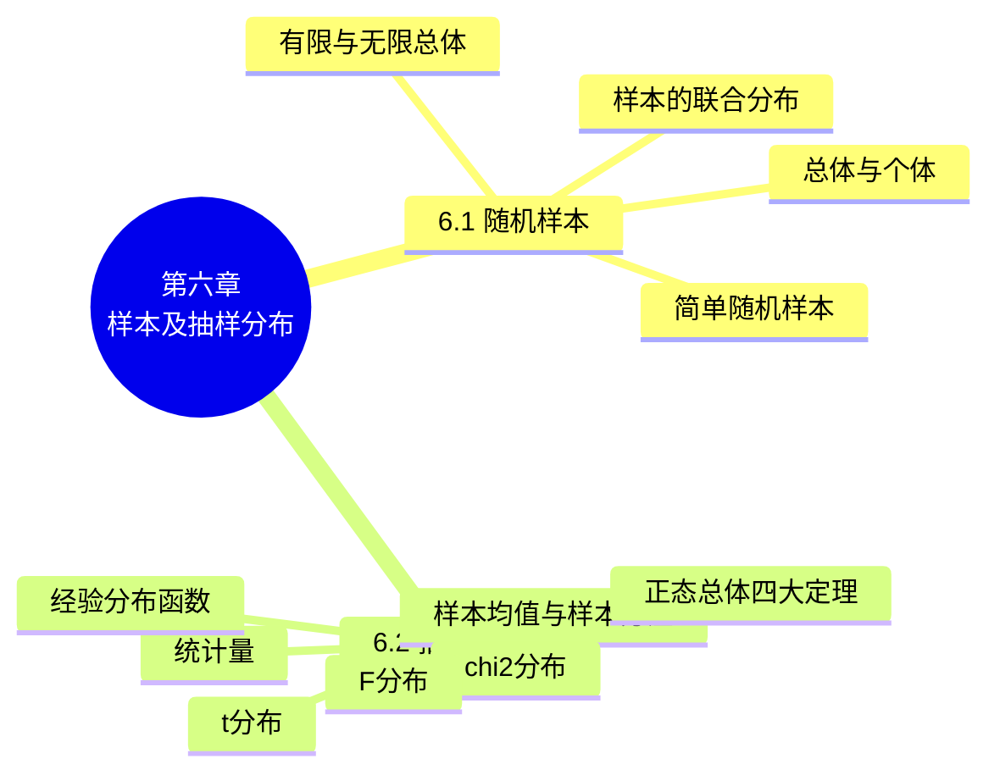

# 第六章 样本及抽样分布

> **本章主线**：前五章研究随机变量及其分布（概率论），从本章起转入**数理统计**——从实际数据（样本）出发推断总体规律。本章建立数理统计的基本概念：**总体**（研究对象的某项数量指标 $X$ 的分布）、**个体**、**简单随机样本**（独立同分布的一组 $X_i$，其联合分布为各分量分布之积）。然后引入**统计量**（不含未知参数的样本函数，如样本均值 $\bar{X}$、样本方差 $S^2$、样本矩、经验分布函数），它们是用样本推断总体的"原材料"。最后给出数理统计中最常用的三个**抽样分布**——$\chi^2$ 分布、$t$ 分布（学生氏分布）、$F$ 分布——以及正态总体下样本均值与样本方差的四个分布定理，它们是区间估计与假设检验的直接工具。

## 6.1 随机样本

### 6.1.1 总体与个体

**定义**：试验的全部可能的观察值称为**总体**；总体中的每个可能观察值称为**个体**。

- **实例 1**：在研究 2000 名学生的年龄时，这些学生的年龄的全体就构成一个总体，每个学生的年龄就是个体。

**有限总体和无限总体**：

- **实例 2**：某工厂 10 月份生产的灯泡寿命所组成的总体中，个体的总数就是 10 月份生产的灯泡数，这是一个**有限总体**；而该工厂生产的所有灯泡寿命所组成的总体是一个**无限总体**，它包括以往生产和今后生产的灯泡寿命。当有限总体包含的个体的总数很大时，可近似地将它看成是无限总体。

**总体分布**：

- **实例 3**：在 2000 名大学一年级学生的年龄中，年龄指标值为 15、16、17、18、19、20 的依次有 9、21、132、1207、588、43 名，它们在总体中所占比率依次为 $\dfrac{9}{2000},\dfrac{21}{2000},\dfrac{132}{2000},\dfrac{1207}{2000},\dfrac{588}{2000},\dfrac{43}{2000}$，即学生年龄的取值有一定的分布。

**一般地**，我们所研究的总体，即研究对象的某项数量指标 $X$，其取值在客观上有一定的分布，$X$ 是一个随机变量。

**总体分布的定义**：我们把数量指标取不同数值的比率叫做**总体分布**。如实例 3 中，总体就是数集 $\{15, 16, 17, 18, 19, 20\}$，总体分布为

| 年龄 | 15 | 16 | 17 | 18 | 19 | 20 |
| :--: | :--: | :--: | :--: | :--: | :--: | :--: |
| 比率 | $\dfrac{9}{2000}$ | $\dfrac{21}{2000}$ | $\dfrac{132}{2000}$ | $\dfrac{1207}{2000}$ | $\dfrac{588}{2000}$ | $\dfrac{43}{2000}$ |

> 说明 1：一个总体对应一个随机变量 $X$，我们将不区分总体和相应的随机变量，统称为**总体 $X$**。
> 说明 2：在实际中遇到的总体往往是有限总体，它对应一个离散型随机变量；当总体中包含的个体的个数很大时，在理论上可认为它是一个无限总体。

### 6.1.2 随机样本的定义

**1. 样本的定义**：设 $X$ 是具有分布函数 $F$ 的随机变量，若 $X_1, X_2, \dots, X_n$ 是具有同一分布函数 $F$、相互独立的随机变量，则称 $X_1, X_2, \dots, X_n$ 为从分布函数 $F$（或总体 $F$、或总体 $X$）得到的**容量为 $n$ 的简单随机样本**，简称**样本**。它们的观察值 $x_1, x_2, \dots, x_n$ 称为**样本值**，又称为 $X$ 的 $n$ 个独立的观察值。

**2. 简单随机抽样的定义**：获得简单随机样本的抽样方法称为**简单随机抽样**。根据定义得：若 $X_1, X_2, \dots, X_n$ 为 $F$ 的一个样本，则 $X_1, X_2, \dots, X_n$ 的联合分布函数为

$$F^*(x_1, x_2, \dots, x_n) = \prod_{i=1}^{n} F(x_i)$$

又若 $X$ 具有概率密度 $f$，则 $X_1, X_2, \dots, X_n$ 的联合概率密度为

$$f^*(x_1, x_2, \dots, x_n) = \prod_{i=1}^{n} f(x_i)$$

> 简单随机样本的本质：**独立**且**同分布**（与总体 $X$ 同分布）——样本的联合分布是各分量分布的乘积。

**例 4（指数总体）** 设总体 $X$ 服从参数为 $\lambda$（$\lambda > 0$）的指数分布，$(X_1, X_2, \dots, X_n)$ 是来自总体的样本，求样本 $(X_1, X_2, \dots, X_n)$ 的概率密度。

- 总体 $X$ 的概率密度为 $f(x) = \begin{cases} \lambda e^{-\lambda x}, & x > 0, \\ 0, & x \leq 0, \end{cases}$
- 因为 $X_1, X_2, \dots, X_n$ 相互独立，且与 $X$ 有相同的分布，所以 $(X_1, X_2, \dots, X_n)$ 的概率密度为
$$f_n(x_1, x_2, \dots, x_n) = \prod_{i=1}^{n} f(x_i) = \begin{cases} \lambda^n e^{-\lambda \sum_{i=1}^{n} x_i}, & x_i > 0, \\ 0, & \text{其他}. \end{cases}$$

**例 5（两点分布总体）** 设总体 $X$ 服从两点分布 $B(1, p)$，其中 $0 < p < 1$，$(X_1, X_2, \dots, X_n)$ 是来自总体的样本，求样本 $(X_1, X_2, \dots, X_n)$ 的分布律。

- 总体 $X$ 的分布律为 $P\{X = i\} = p^i(1-p)^{1-i}$（$i = 0, 1$）；
- 因为 $X_1, X_2, \dots, X_n$ 相互独立，且与 $X$ 有相同的分布，所以 $(X_1, X_2, \dots, X_n)$ 的分布律为
$$P\{X_1 = x_1, X_2 = x_2, \dots, X_n = x_n\} = P\{X_1 = x_1\}\,P\{X_2 = x_2\} \cdots P\{X_n = x_n\} = p^{\sum_{i=1}^{n} x_i}(1-p)^{n - \sum_{i=1}^{n} x_i}$$
其中 $x_1, x_2, \dots, x_n$ 在集合 $\{0, 1\}$ 中取值。

---

## 6.2 抽样分布

### 6.2.1 基本概念

**1. 统计量的定义**：设 $X_1, X_2, \dots, X_n$ 是来自总体 $X$ 的一个样本，$g(X_1, X_2, \dots, X_n)$ 是 $X_1, X_2, \dots, X_n$ 的函数，若 $g$ 中**不含未知参数**，则称 $g(X_1, X_2, \dots, X_n)$ 是一个**统计量**。设 $x_1, x_2, \dots, x_n$ 是相应于样本的样本值，则称 $g(x_1, x_2, \dots, x_n)$ 是 $g(X_1, X_2, \dots, X_n)$ 的**观察值**。

**实例 1（判断统计量）** 设 $X_1, X_2, X_3$ 是来自总体 $N(\mu, \sigma^2)$ 的一个样本，其中 $\mu$ 为已知，$\sigma^2$ 为未知，判断下列各式哪些是统计量，哪些不是：

- $T_1 = X_1$ ✓；$T_2 = X_1 + X_2 e^{X_3}$ ✓；$T_3 = \dfrac{1}{3}(X_1 + X_2 + X_3)$ ✓；$T_4 = \max(X_1, X_2, X_3)$ ✓；$T_5 = X_1 + X_2 - 2\mu$ ✓（$\mu$ 已知）；$T_6 = \dfrac{1}{\sigma^2}(X_1^2 + X_2^2 + X_3^2)$ ✗（**含未知参数 $\sigma^2$**，不是统计量）。

> 判定要点：统计量中出现的只能是样本的函数与**已知常数**，不能含未知参数。

**2. 几个常用统计量的定义**：设 $X_1, X_2, \dots, X_n$ 是来自总体的一个样本，$x_1, x_2, \dots, x_n$ 是这一样本的观察值。

1. **样本平均值**：$\bar{X} = \dfrac{1}{n}\sum_{i=1}^{n} X_i$，其观察值 $\bar{x} = \dfrac{1}{n}\sum_{i=1}^{n} x_i$；
2. **样本方差**：$S^2 = \dfrac{1}{n-1}\sum_{i=1}^{n}(X_i - \bar{X})^2 = \dfrac{1}{n-1}\left(\sum_{i=1}^{n} X_i^2 - n\bar{X}^2\right)$，其观察值 $s^2 = \dfrac{1}{n-1}\sum_{i=1}^{n}(x_i - \bar{x})^2$；
3. **样本标准差**：$S = \sqrt{S^2} = \sqrt{\dfrac{1}{n-1}\sum_{i=1}^{n}(X_i - \bar{X})^2}$，其观察值 $s = \sqrt{\dfrac{1}{n-1}\sum_{i=1}^{n}(x_i - \bar{x})^2}$；
4. **样本 $k$ 阶（原点）矩**：$A_k = \dfrac{1}{n}\sum_{i=1}^{n} X_i^k$（$k = 1, 2, \dots$），其观察值 $\alpha_k = \dfrac{1}{n}\sum_{i=1}^{n} x_i^k$；
5. **样本 $k$ 阶中心矩**：$B_k = \dfrac{1}{n}\sum_{i=1}^{n}(X_i - \bar{X})^k$（$k = 2, 3, \dots$），其观察值 $b_k = \dfrac{1}{n}\sum_{i=1}^{n}(x_i - \bar{x})^k$。

> 注：样本方差用 $n-1$ 作分母（而非 $n$），是为保证 $S^2$ 是总体方差 $\sigma^2$ 的无偏估计（见第七章）。

**由以上定义得下述结论**：若总体 $X$ 的 $k$ 阶矩 $E(X^k)$ 记成 $\mu_k$ 存在，则当 $n \to \infty$ 时，

$$A_k \xrightarrow{P} \mu_k, \qquad k = 1, 2, \dots$$

**证明**：因为 $X_1, X_2, \dots, X_n$ 独立且与 $X$ 同分布，所以 $X_1^k, X_2^k, \dots, X_n^k$ 独立且与 $X^k$ 同分布，故有 $E(X_1^k) = E(X_2^k) = \dots = E(X_n^k) = \mu_k$。再根据第五章辛钦定理知 $\dfrac{1}{n}\sum_{i=1}^{n} X_i^k \xrightarrow{P} \mu_k$（$k = 1, 2, \dots$）；由第五章关于依概率收敛的序列的性质知 $g(A_1, A_2, \dots, A_k) \xrightarrow{P} g(\mu_1, \mu_2, \dots, \mu_k)$，其中 $g$ 是连续函数。

> 以上结论是下一章所要介绍的**矩估计法**的理论根据。

**3. 经验分布函数**：总体分布函数 $F(x)$ 相应的统计量称为**经验分布函数**。做法如下：设 $X_1, X_2, \dots, X_n$ 是总体 $F$ 的一个样本，用 $S(x)$（$-\infty < x < +\infty$）表示 $X_1, X_2, \dots, X_n$ 中不大于 $x$ 的随机变量的个数，定义经验分布函数 $F_n(x)$ 为 $F_n(x) = \dfrac{1}{n} S(x)$。对于一个样本值，$F_n(x)$ 的观察值容易求得（$F_n(x)$ 的观察值仍以 $F_n(x)$ 表示）。

**实例 2**：设总体 $F$ 具有一个样本值 1, 2, 3，则经验分布函数 $F_3(x)$ 的观察值为

$$F_3(x) = \begin{cases} 0, & x < 1, \\ \dfrac{1}{3}, & 1 \leq x < 2, \\ \dfrac{2}{3}, & 2 \leq x < 3, \\ 1, & x \geq 3. \end{cases}$$

**实例 3**：设总体 $F$ 具有一个样本值 1, 1, 2，则经验分布函数 $F_3(x)$ 的观察值为

$$F_3(x) = \begin{cases} 0, & x < 1, \\ \dfrac{2}{3}, & 1 \leq x < 2, \\ 1, & x \geq 2. \end{cases}$$

**一般地**：设 $x_1, x_2, \dots, x_n$ 是总体 $F$ 的一个容量为 $n$ 的样本值，先将 $x_1, x_2, \dots, x_n$ 按自小到大的次序排列并重新编号 $x_{(1)} \leq x_{(2)} \leq \dots \leq x_{(n)}$，则经验分布函数 $F_n(x)$ 的观察值为

$$F_n(x) = \begin{cases} 0, & x < x_{(1)}, \\ \dfrac{k}{n}, & x_{(k)} \leq x < x_{(k+1)},\; k = 1, 2, \dots, n-1, \\ 1, & x \geq x_{(n)}. \end{cases}$$

**格里汶科定理**：对于任一实数 $x$，当 $n \to \infty$ 时，$F_n(x)$ 以概率 1 一致收敛于分布函数 $F(x)$，即

$$P\left\{\lim_{n \to \infty} \sup_{-\infty < x < +\infty} |F_n(x) - F(x)| = 0\right\} = 1$$

对于任一实数 $x$，当 $n$ 充分大时，经验分布函数的任一个观察值 $F_n(x)$ 与总体分布函数 $F(x)$ 只有微小的差别，从而在实际上可当作 $F(x)$ 来使用。

### 6.2.2 常见分布

统计量的分布称为**抽样分布**。以下三个分布是数理统计中最常用的抽样分布。

**1. $\chi^2$ 分布**

设 $X_1, X_2, \dots, X_n$ 是来自总体 $N(0, 1)$ 的样本，则称统计量 $\chi^2 = X_1^2 + X_2^2 + \dots + X_n^2$ 服从**自由度为 $n$ 的 $\chi^2$ 分布**，记为 $\chi^2 \sim \chi^2(n)$。

**自由度**：指 $\chi^2 = X_1^2 + \dots + X_n^2$ 中右端包含独立变量的个数。

$\chi^2(n)$ 分布的概率密度为

$$f(y) = \begin{cases} \dfrac{1}{2^{n/2}\Gamma\left(\frac{n}{2}\right)} y^{\frac{n}{2}-1} e^{-y/2}, & y > 0, \\ 0, & \text{其他}. \end{cases}$$

**证明**：因为 $\chi^2(1)$ 分布即为 $\Gamma\left(\dfrac{1}{2}, 2\right)$ 分布（标准正态平方即 $\Gamma$ 分布），又因为 $X_i \sim N(0, 1)$，由定义 $X_i^2 \sim \chi^2(1)$，即 $X_i^2 \sim \Gamma\left(\dfrac{1}{2}, 2\right)$（$i = 1, 2, \dots, n$）。因为 $X_1, X_2, \dots, X_n$ 相互独立，所以 $X_1^2, X_2^2, \dots, X_n^2$ 也相互独立，根据 $\Gamma$ 分布的可加性知 $\chi^2 = \sum_{i=1}^{n} X_i^2 \sim \Gamma\left(\dfrac{n}{2}, 2\right)$。

**性质 1（可加性）**：若 $\chi_1^2 \sim \chi^2(n_1)$，$\chi_2^2 \sim \chi^2(n_2)$ 且相互独立，则 $\chi_1^2 + \chi_2^2 \sim \chi^2(n_1 + n_2)$。（此性质可以推广到多个随机变量的情形。）

**性质 2（期望与方差）**：$E(\chi^2) = n$，$D(\chi^2) = 2n$。

**证明**：因为 $X_i \sim N(0, 1)$，所以 $E(X_i^2) = D(X_i) = 1$；又 $E(X_i^4) = 3$（标准正态四阶矩），故 $D(X_i^2) = E(X_i^4) - [E(X_i^2)]^2 = 3 - 1 = 2$（$i = 1, 2, \dots, n$）。故
$$E(\chi^2) = E\left(\sum_{i=1}^{n} X_i^2\right) = \sum_{i=1}^{n} E(X_i^2) = n, \qquad D(\chi^2) = D\left(\sum_{i=1}^{n} X_i^2\right) = \sum_{i=1}^{n} D(X_i^2) = 2n$$

**上 $\alpha$ 分位点**：对于给定的正数 $\alpha$（$0 < \alpha < 1$），称满足条件

$$P\{\chi^2 > \chi_\alpha^2(n)\} = \int_{\chi_\alpha^2(n)}^{+\infty} f(y)\,dy = \alpha$$

的点 $\chi_\alpha^2(n)$ 为 $\chi^2(n)$ 分布的**上 $\alpha$ 分位点**。对于不同的 $\alpha$、$n$，可以通过查表求得（$\chi^2$ 分布表只详列到 $n = 45$ 为止）。

**例 2（$\chi^2$ 分位点查表）**：$\chi_{0.025}^2(8) = 17.535$，$\chi_{0.975}^2(10) = 3.247$，$\chi_{0.1}^2(25) = 34.382$。

**费舍尔（R. A. Fisher）近似**：当 $n > 45$ 时，可以利用近似公式 $\chi_\alpha^2(n) \approx \dfrac{1}{2}\left(z_\alpha + \sqrt{2n - 1}\right)^2$ 求得 $n > 45$ 时上 $\alpha$ 分位点的近似值。例如 $\chi_{0.05}^2(50) \approx \dfrac{1}{2}(1.645 + \sqrt{99})^2 = 67.221$，而查详表可得 $\chi_{0.05}^2(50) = 67.505$。

**2. $t$ 分布（学生氏分布）**

设 $X \sim N(0, 1)$，$Y \sim \chi^2(n)$，且 $X$、$Y$ 独立，则称随机变量 $t = \dfrac{X}{\sqrt{Y/n}}$ 服从**自由度为 $n$ 的 $t$ 分布**，记为 $t \sim t(n)$。$t$ 分布又称**学生氏（Student）分布**。

$t(n)$ 分布的概率密度函数为

$$h(t) = \frac{\Gamma\left(\frac{n+1}{2}\right)}{\sqrt{n\pi}\,\Gamma\left(\frac{n}{2}\right)}\left(1 + \frac{t^2}{n}\right)^{-\frac{n+1}{2}}, \qquad -\infty < t < +\infty$$

**性质**：当 $n$ 充分大时，其图形类似于标准正态变量概率密度的图形。因为 $\lim_{n \to \infty} h(t) = \dfrac{1}{\sqrt{2\pi}} e^{-\frac{t^2}{2}}$，所以当 $n$ 足够大时 $t$ 分布近似于 $N(0, 1)$ 分布；但对于较小的 $n$，$t$ 分布与 $N(0, 1)$ 分布相差很大。

**上 $\alpha$ 分位点**：对于给定的 $\alpha$（$0 < \alpha < 1$），称满足条件 $P\{t > t_\alpha(n)\} = \int_{t_\alpha(n)}^{+\infty} h(t)\,dt = \alpha$ 的点 $t_\alpha(n)$ 为 $t(n)$ 分布的**上 $\alpha$ 分位点**。由分布的对称性知 $t_{1-\alpha}(n) = -t_\alpha(n)$；当 $n > 45$ 时，$t_\alpha(n) \approx z_\alpha$。

**例 3（$t$ 分位点查表）**：$t_{0.05}(10) = 1.8125$，$t_{0.025}(15) = 2.1315$。

**3. $F$ 分布**

设 $U \sim \chi^2(n_1)$，$V \sim \chi^2(n_2)$，且 $U$、$V$ 独立，则称随机变量 $F = \dfrac{U/n_1}{V/n_2}$ 服从**自由度为 $(n_1, n_2)$ 的 $F$ 分布**，记为 $F \sim F(n_1, n_2)$。

$F(n_1, n_2)$ 分布的概率密度为

$$\psi(y) = \begin{cases} \dfrac{\Gamma\left(\frac{n_1+n_2}{2}\right)\left(\frac{n_1}{n_2}\right)^{\frac{n_1}{2}}}{\Gamma\left(\frac{n_1}{2}\right)\Gamma\left(\frac{n_2}{2}\right)} \cdot \dfrac{y^{\frac{n_1}{2}-1}}{\left[1 + \frac{n_1 y}{n_2}\right]^{\frac{n_1+n_2}{2}}}, & y > 0, \\ 0, & \text{其他}. \end{cases}$$

**性质（倒数性质）**：根据定义可知，若 $F \sim F(n_1, n_2)$，则 $\dfrac{1}{F} \sim F(n_2, n_1)$。

**上 $\alpha$ 分位点**：对于给定的 $\alpha$（$0 < \alpha < 1$），称满足条件 $P\{F > F_\alpha(n_1, n_2)\} = \int_{F_\alpha(n_1, n_2)}^{+\infty} \psi(y)\,dy = \alpha$ 的点 $F_\alpha(n_1, n_2)$ 为 $F(n_1, n_2)$ 分布的**上 $\alpha$ 分位点**。

**例 4（$F$ 分位点查表）**：$F_{0.025}(7, 8) = 4.90$，$F_{0.05}(14, 30) = 2.31$。

**重要关系式**：$F_{1-\alpha}(n_1, n_2) = \dfrac{1}{F_\alpha(n_2, n_1)}$。

**证明**：因为 $F \sim F(n_1, n_2)$，所以
$$1 - \alpha = P\{F > F_{1-\alpha}(n_1, n_2)\} = P\left\{\frac{1}{F} < \frac{1}{F_{1-\alpha}(n_1, n_2)}\right\} = 1 - P\left\{\frac{1}{F} \geq \frac{1}{F_{1-\alpha}(n_1, n_2)}\right\}$$
即 $P\left\{\dfrac{1}{F} > \dfrac{1}{F_{1-\alpha}(n_1, n_2)}\right\} = \alpha$。因为 $\dfrac{1}{F} \sim F(n_2, n_1)$，所以 $P\left\{\dfrac{1}{F} > F_\alpha(n_2, n_1)\right\} = \alpha$，比较后得 $\dfrac{1}{F_{1-\alpha}(n_1, n_2)} = F_\alpha(n_2, n_1)$，即 $F_{1-\alpha}(n_1, n_2) = \dfrac{1}{F_\alpha(n_2, n_1)}$。

**例**：$F_{0.95}(12, 9) = \dfrac{1}{F_{0.05}(9, 12)} = \dfrac{1}{2.80} = 0.357$。

### 6.2.3 正态总体的样本均值与样本方差的分布

设 $X_1, X_2, \dots, X_n$ 是来自正态总体 $N(\mu, \sigma^2)$ 的样本，$\bar{X}$ 是样本均值，则正态总体的样本均值和样本方差有以下两个重要定理。

**定理一**：设 $X_1, X_2, \dots, X_n$ 是来自正态总体 $N(\mu, \sigma^2)$ 的样本，$\bar{X}$ 是样本均值，则有

$$\bar{X} \sim N\left(\mu, \frac{\sigma^2}{n}\right)$$

**定理二**：设 $X_1, X_2, \dots, X_n$ 是总体 $N(\mu, \sigma^2)$ 的样本，$\bar{X}$、$S^2$ 分别是样本均值和样本方差，则有

1. $\dfrac{(n-1)S^2}{\sigma^2} \sim \chi^2(n-1)$；
2. $\bar{X}$ 与 $S^2$ **独立**。

**定理三**：设 $X_1, X_2, \dots, X_n$ 是总体 $N(\mu, \sigma^2)$ 的样本，$\bar{X}$、$S^2$ 分别是样本均值和样本方差，则有

$$\frac{\bar{X} - \mu}{S/\sqrt{n}} \sim t(n-1)$$

**证明**：因为 $\dfrac{\bar{X} - \mu}{\sigma/\sqrt{n}} \sim N(0, 1)$，$\dfrac{(n-1)S^2}{\sigma^2} \sim \chi^2(n-1)$，且两者独立，由 $t$ 分布的定义知
$$\frac{\bar{X} - \mu}{S/\sqrt{n}} = \frac{\dfrac{\bar{X} - \mu}{\sigma/\sqrt{n}}}{\sqrt{\dfrac{(n-1)S^2}{\sigma^2}/(n-1)}} \sim t(n-1)$$

**定理四（两正态总体的样本均值差与方差比）**：设 $X_1, X_2, \dots, X_{n_1}$ 与 $Y_1, Y_2, \dots, Y_{n_2}$ 分别是具有相同方差的两正态总体 $N(\mu_1, \sigma^2)$、$N(\mu_2, \sigma^2)$ 的样本，且这两个样本互相独立。设 $\bar{X} = \dfrac{1}{n_1}\sum_{i=1}^{n_1} X_i$，$\bar{Y} = \dfrac{1}{n_2}\sum_{i=1}^{n_2} Y_i$ 分别是这两个样本的均值，$S_1^2 = \dfrac{1}{n_1-1}\sum_{i=1}^{n_1}(X_i - \bar{X})^2$，$S_2^2 = \dfrac{1}{n_2-1}\sum_{i=1}^{n_2}(Y_i - \bar{Y})^2$ 分别是这两个样本的方差，则有

1. $\dfrac{S_1^2/S_2^2}{\sigma_1^2/\sigma_2^2} \sim F(n_1 - 1, n_2 - 1)$；
2. 当 $\sigma_1^2 = \sigma_2^2 = \sigma^2$ 时，$\dfrac{(\bar{X} - \bar{Y}) - (\mu_1 - \mu_2)}{S_w\sqrt{\dfrac{1}{n_1} + \dfrac{1}{n_2}}} \sim t(n_1 + n_2 - 2)$，

其中 $S_w^2 = \dfrac{(n_1-1)S_1^2 + (n_2-1)S_2^2}{n_1 + n_2 - 2}$，$S_w = \sqrt{S_w^2}$。

**证明**：

1. 由定理二，$\dfrac{(n_1-1)S_1^2}{\sigma_1^2} \sim \chi^2(n_1-1)$，$\dfrac{(n_2-1)S_2^2}{\sigma_2^2} \sim \chi^2(n_2-1)$。由假设 $S_1^2$、$S_2^2$ 独立，则由 $F$ 分布的定义知
$$\frac{(n_1-1)S_1^2}{(n_1-1)\sigma_1^2} \bigg/ \frac{(n_2-1)S_2^2}{(n_2-1)\sigma_2^2} = \frac{S_1^2/S_2^2}{\sigma_1^2/\sigma_2^2} \sim F(n_1-1, n_2-1)$$
2. 因为 $\bar{X} - \bar{Y} \sim N\left(\mu_1 - \mu_2, \dfrac{\sigma^2}{n_1} + \dfrac{\sigma^2}{n_2}\right)$，所以
$$U = \frac{(\bar{X} - \bar{Y}) - (\mu_1 - \mu_2)}{\sigma\sqrt{\dfrac{1}{n_1} + \dfrac{1}{n_2}}} \sim N(0, 1)$$
   又 $\dfrac{(n_1-1)S_1^2}{\sigma^2} \sim \chi^2(n_1-1)$，$\dfrac{(n_2-1)S_2^2}{\sigma^2} \sim \chi^2(n_2-1)$，且它们相互独立，故由 $\chi^2$ 分布的可加性知
$$V = \frac{(n_1-1)S_1^2 + (n_2-1)S_2^2}{\sigma^2} \sim \chi^2(n_1 + n_2 - 2)$$
   由于 $U$ 与 $V$ 相互独立，按 $t$ 分布的定义，
$$\frac{U}{\sqrt{V/(n_1 + n_2 - 2)}} = \frac{(\bar{X} - \bar{Y}) - (\mu_1 - \mu_2)}{S_w\sqrt{\dfrac{1}{n_1} + \dfrac{1}{n_2}}} \sim t(n_1 + n_2 - 2)$$

---

### 知识定位与框架衔接

**前置知识**：第二章的常见分布（尤其正态分布）是定义 $\chi^2$、$t$、$F$ 分布的原料；第三章的独立性与第四章的 $\Gamma$ 分布可加性支撑 $\chi^2$ 分布推导；第五章的辛钦定理与依概率收敛用于证明样本矩收敛于总体矩；第四章的期望方差性质用于 $\chi^2$ 分布的期望方差计算。

**后置知识**：本章是数理统计的起点——样本均值 $\bar{X}$ 与样本方差 $S^2$ 是第七章参数估计、第八章假设检验的核心统计量；$\chi^2$、$t$、$F$ 三个抽样分布及正态总体的四个定理（$\bar{X} \sim N(\mu, \sigma^2/n)$、$\frac{(n-1)S^2}{\sigma^2} \sim \chi^2(n-1)$、$\frac{\bar{X}-\mu}{S/\sqrt{n}} \sim t(n-1)$、方差比 $\sim F$）是置信区间、假设检验、方差分析、回归分析中一切检验统计量的分布来源。

**故事比喻**：可以把"总体"想象成一座巨大的矿山（全部矿石的品位分布），"样本"是从矿山里随机挖出的一小批矿石（独立同分布的几个观测值），"统计量"是把这批矿石加工成能反映整座矿山的"化验指标"（样本均值 ≈ 平均品位，样本方差 ≈ 品位波动）。而 $\chi^2$、$t$、$F$ 三个分布，则是"化验指标的尺子"——知道样本来自正态总体时，这些尺子告诉我们化验指标会怎么波动。

**四个灵魂问题**：

1. **"为什么样本均值用 $\bar{X}$、样本方差用 $S^2$ 两个统计量就够了？"** —— 它们是总体期望与方差的最自然估计；样本 $k$ 阶矩（$A_k$）依概率收敛于总体 $k$ 阶矩（辛钦定理），为矩估计奠基；$S^2$ 用 $n-1$ 作分母是为保证无偏性。
2. **"$\chi^2$、$t$、$F$ 三个分布从哪来？"** —— $\chi^2$ 是标准正态的平方和；$t$ 是标准正态除以 $\sqrt{\chi^2/自由度}$；$F$ 是两个 $\chi^2$ 除以各自自由度之比——三者层层递进，都源于正态样本。
3. **"为什么 $t$ 分布和标准正态长得像？"** —— $t = \dfrac{\bar{X}-\mu}{S/\sqrt{n}}$ 用样本标准差 $S$ 代替了总体标准差 $\sigma$；当 $n$ 很大时 $S$ 很接近 $\sigma$，$t$ 分布趋于 $N(0,1)$；$n$ 较小时 $t$ 分布尾部更厚（体现 $S$ 的随机性带来的不确定性）。
4. **"经验分布函数有什么用？"** —— 格里汶科定理保证 $F_n(x)$ 以概率 1 一致收敛于总体分布函数 $F(x)$，即"样本足够多时经验分布 ≈ 总体分布"——这是非参数统计（如 Bootstrap、KS 检验）的理论基础。

**本章小结**：第六章完成了从概率论到数理统计的过渡——总体与样本的概念、统计量与常用统计量（样本均值、样本方差、样本矩）、经验分布函数及其收敛性（格里汶科定理），加上 $\chi^2$、$t$、$F$ 三大抽样分布与正态总体的四大分布定理。这些工具将直接服务于第七章的参数估计与第八章的假设检验。

---

## 课件 PDF

<iframe src="https://naimore3.github.io/Naimore3-s-Learning-Notes/课程笔记/大二上/概率论与数理统计/第六章/第六章.pdf" style="width: 100%; height: 600px; border: none;"></iframe>

PDF 原文：[第六章 样本及抽样分布](https://naimore3.github.io/Naimore3-s-Learning-Notes/课程笔记/大二上/概率论与数理统计/第六章/第六章.pdf)
