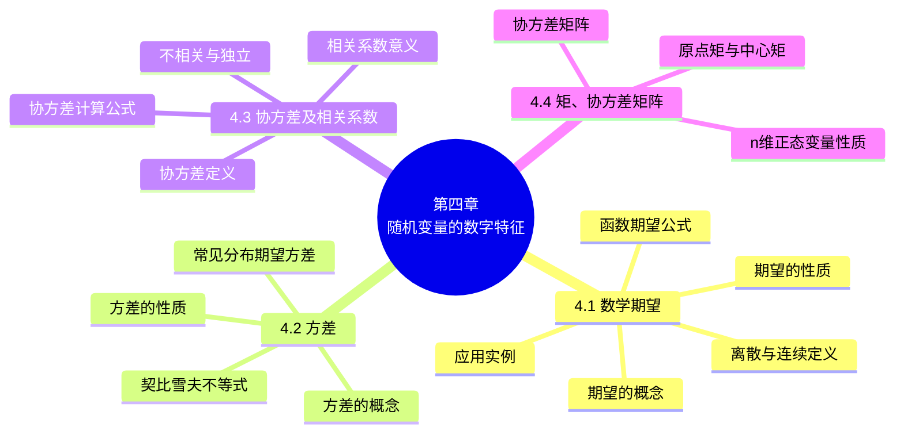

# 第四章 随机变量的数字特征

> **本章主线**：前三章用分布函数、分布律、概率密度完整刻画随机变量，但"完整"不等于"方便"——很多场合只需几个关键数字就能抓住随机变量的主要特征。本章引入**数字特征**：**数学期望** $E(X)$ 刻画随机变量取值的"中心"（加权平均），并给出四条运算性质与随机变量函数的期望公式；**方差** $D(X) = E\{[X-E(X)]^2\}$ 刻画取值的**分散程度**，并导出常见分布（两点、二项、泊松、均匀、指数、正态）的期望与方差，以及**契比雪夫不等式** $P\{|X-\mu| \geq \varepsilon\} \leq \sigma^2/\varepsilon^2$。对两个随机变量，用**协方差** $\mathrm{Cov}(X,Y)$ 与**相关系数** $\rho_{XY}$ 刻画线性相关程度（独立 ⇒ 不相关，但反之不成立）；最后推广到**矩**与**协方差矩阵**，并给出 n 维正态变量的四条重要性质。

## 4.1 数学期望

### 4.1.1 数学期望的概念

**引例 1（分赌本问题——产生背景）** A、B 两人赌技相同，各出赌金 100 元，并约定先胜三局者为胜，取得全部 200 元。由于出现意外情况，在 A 胜 2 局、B 胜 1 局时不得不终止赌博。如果要分赌金，该如何分配才算公平？

- 分析：假设继续赌两局，则结果有以下四种情况：AA、AB、BA、BB。把已赌过的三局（A 胜 2 局、B 胜 1 局）与上述结果相结合（A、B 赌完五局）：
  - AA、AB、BA：A 最终获胜（A 共胜 3 局）；
  - BB：B 最终获胜（B 共胜 3 局）。
  故在赌技相同的情况下，A、B 最终获胜的可能性大小之比为 **3 : 1**，即 A 应获得赌金的 $\dfrac{3}{4}$，而 B 只能获得赌金的 $\dfrac{1}{4}$。
- 因此 A 能"期望"得到的数目应为 $200 \times \dfrac{3}{4} + 0 \times \dfrac{1}{4} = 150$（元），而 B 能"期望"得到的数目为 $200 \times \dfrac{1}{4} + 0 \times \dfrac{3}{4} = 50$（元）。
- 若设随机变量 $X$ 为：在 A 胜 2 局、B 胜 1 局的前提下，继续赌下去 A 最终所得的赌金，则 $X$ 所取可能值为 200、0，其概率分别为 $\dfrac{3}{4}$、$\dfrac{1}{4}$。因而 A 期望所得的赌金即为 $X$ 的"期望"值：
$$E(X) = 200 \times \frac{3}{4} + 0 \times \frac{1}{4} = 150 \text{（元）}$$
即为 **$X$ 的可能值与其概率之积的累加**。

**引例 2（射击问题）** 设某射击手在同样的条件下瞄准靶子相继射击 90 次，命中环数记录如下：

| 命中环数 $k$ | 0 | 1 | 2 | 3 | 4 | 5 |
| :--: | :--: | :--: | :--: | :--: | :--: | :--: |
| 命中次数 $n_k$ | 2 | 13 | 15 | 10 | 20 | 30 |
| 频率 $n_k/n$ | $\dfrac{2}{90}$ | $\dfrac{13}{90}$ | $\dfrac{15}{90}$ | $\dfrac{10}{90}$ | $\dfrac{20}{90}$ | $\dfrac{30}{90}$ |

- 平均射中环数 $= \dfrac{\text{射中靶的总环数}}{\text{射击次数}} = \sum_{k=0}^{5} k \cdot \dfrac{n_k}{n} = 3.37$；
- 设射手命中的环数为随机变量 $Y$，由于频率随试验随机波动，但"平均射中环数"的稳定值为 $\sum k \cdot p_k$（频率 $\xrightarrow{n \to \infty}$ 概率）——"平均射中环数"等于**射中环数的可能值与其概率之积的累加**。

**离散型随机变量的数学期望**：

**定义**：设离散型随机变量 $X$ 的分布律为 $P\{X = x_k\} = p_k$（$k = 1, 2, \dots$）。若级数 $\sum_{k=1}^{\infty} x_k p_k$ **绝对收敛**，则称级数 $\sum_{k=1}^{\infty} x_k p_k$ 为随机变量 $X$ 的**数学期望**，记为 $E(X)$，即

$$E(X) = \sum_{k=1}^{\infty} x_k p_k$$

**关于定义的几点说明**：

1. $E(X)$ 是一个**实数**，而非变量，它是一种**加权平均**，与一般的平均值不同，它从本质上体现了随机变量 $X$ 取可能值的真正的平均值，也称**均值**；
2. 级数的**绝对收敛性**保证了级数的和不随级数各项次序的改变而改变——数学期望是反映随机变量 $X$ 取可能值的平均值，它不应随可能值的排列次序而改变；
3. 随机变量的数学期望与一般变量的算术平均值不同。例如 $X$ 的分布律为 $X$：1（0.02）、2（0.98），算术平均值为 $\dfrac{1+2}{2} = 1.5$，而 $E(X) = 1 \times 0.02 + 2 \times 0.98 = 1.98$。当随机变量 $X$ 取各个可能值是等概率分布时，$X$ 的期望值与算术平均值相等。

**实例 1（谁的技术比较好？）** 甲、乙两个射手，他们射击的分布律分别为：

| 击中环数 | 8 | 9 | 10 |
| :--: | :--: | :--: | :--: |
| 甲射手概率 | 0.3 | 0.1 | 0.6 |
| 乙射手概率 | 0.2 | 0.5 | 0.3 |

- 设甲、乙射手击中的环数分别为 $X_1$、$X_2$：
$$E(X_1) = 8 \times 0.3 + 9 \times 0.1 + 10 \times 0.6 = 9.3 \text{（环）}, \qquad E(X_2) = 8 \times 0.2 + 9 \times 0.5 + 10 \times 0.3 = 9.1 \text{（环）}$$
- 故**甲射手的技术比较好**。

**实例 2（发行彩票的创收利润）** 某一彩票中心发行彩票 10 万张，每张 2 元。设头等奖 1 个（奖金 1 万元），二等奖 2 个（奖金各 5 千元），三等奖 10 个（奖金各 1 千元），四等奖 100 个（奖金各 100 元），五等奖 1000 个（奖金各 10 元）。每张彩票的成本费为 0.3 元，请计算彩票发行单位的创收利润。

- 设每张彩票中奖的数额为随机变量 $X$，则其分布律为 $X$：10000（$\dfrac{1}{10^5}$）、5000（$\dfrac{2}{10^5}$）、1000（$\dfrac{10}{10^5}$）、100（$\dfrac{100}{10^5}$）、10（$\dfrac{1000}{10^5}$）、0（$p_0$）；
- 每张彩票平均能得到奖金
$$E(X) = 10000 \times \frac{1}{10^5} + 5000 \times \frac{2}{10^5} + \dots + 0 \times p_0 = 0.5 \text{（元）}$$
- 每张彩票平均可赚 $2 - 0.5 - 0.3 = 1.2$（元），因此彩票发行单位发行 10 万张彩票的创收利润为 $100000 \times 1.2 = 120000$（元）。

**实例 3（如何确定投资决策方向？）** 某人有 10 万元现金，想投资于某项目，预估成功的机会为 30%，可得利润 8 万元；失败的机会为 70%，将损失 2 万元。若存入银行，同期间的利率为 5%，问是否作此项投资？

- 设 $X$ 为投资利润，则分布律为 $X$：8（0.3）、$-2$（0.7），$E(X) = 8 \times 0.3 - 2 \times 0.7 = 1$（万元）；
- 存入银行的利息：$10 \times 5\% = 0.5$（万元）；
- 因为 $E(X) = 1 > 0.5$，**故应选择投资**。

**实例 4（商店的销售策略）** 某商店对某种家用电器的销售采用先使用后付款的方式，记使用寿命为 $X$（以年计），规定：$X \leq 1$ 一台付款 1500 元；$1 < X \leq 2$ 一台付款 2000 元；$2 < X \leq 3$ 一台付款 2500 元；$X > 3$ 一台付款 3000 元。设寿命 $X$ 服从指数分布，概率密度为 $f(x) = \begin{cases} \dfrac{1}{10} e^{-x/10}, & x > 0, \\ 0, & x \leq 0, \end{cases}$ 试求该商店一台家用电器收费 $Y$ 的数学期望。

- $P\{X \leq 1\} = \displaystyle \int_0^1 \frac{1}{10} e^{-x/10}\,dx = 1 - e^{-0.1} = 0.0952$；
- $P\{1 < X \leq 2\} = e^{-0.1} - e^{-0.2} = 0.0861$；$P\{2 < X \leq 3\} = e^{-0.2} - e^{-0.3} = 0.0779$；$P\{X > 3\} = e^{-0.3} = 0.7408$；
- 因而一台收费 $Y$ 的分布律为 $Y$：1500（0.0952）、2000（0.0861）、2500（0.0779）、3000（0.7408）；
- 得 $E(Y) = 1500 \times 0.0952 + 2000 \times 0.0861 + 2500 \times 0.0779 + 3000 \times 0.7408 = 2732.15$，即平均一台家用电器收费 **2732.15 元**。

**实例 5（分组验血）** 在一个人数很多的团体中普查某种疾病，为此要抽验 $N$ 个人的血，可以用两种方法进行：(i) 将每个人的血分别去化验，这就需化验 $N$ 次；(ii) 按 $k$ 个人一组进行分组，把从 $k$ 个人抽来的血混合在一起进行化验——如果这混合血液呈阴性反应，就说明 $k$ 个人的血都呈阴性反应，这 $k$ 个人的血就只需验一次；若呈阳性，则再对这 $k$ 个人的血液分别进行化验，这样 $k$ 个人的血共最多需化验 $k+1$ 次。假设每个人化验呈阳性的概率为 $p$，且这些人的化验反应是相互独立的。试说明当 $p$ 较小时，选取适当的 $k$，按第二种方法可以减少化验的次数，并说明 $k$ 取什么值时最适宜。

- 血液呈阳性反应的概率为 $p$，呈阴性反应的概率为 $q = 1 - p$，因而 $k$ 个人的混合血呈阴性反应的概率为 $q^k$，呈阳性反应的概率为 $1 - q^k$；
- 设以 $k$ 个人为一组时，组内每人的血化验的次数为 $X$，则 $X$ 为一随机变量，且其分布律为 $X$：$\dfrac{1}{k}$（$q^k$）、$\dfrac{k+1}{k}$（$1 - q^k$）；
- $X$ 的数学期望为
$$E(X) = \frac{1}{k} q^k + \left(1 + \frac{1}{k}\right)(1 - q^k) = 1 - q^k + \frac{1}{k}$$
- $N$ 个人平均需化验的次数为 $N\left(1 - q^k + \dfrac{1}{k}\right)$。因此只要选择 $k$ 使 $1 - q^k + \dfrac{1}{k} < 1$，则 $N$ 个人平均需化验的次数 $< N$。当 $p$ 固定时，选取 $k$ 使得 $L = 1 - q^k + \dfrac{1}{k}$ 小于 1 且取到最小值，此时可得到最好的分组方法。

**实例 6（客车候车时间）** 按规定，某车站每天 8:00~9:00、9:00~10:00 都恰有一辆客车到站，但到站的时刻是随机的，且两者到站的时间相互独立。其规律为：到站时刻 8:10（$\dfrac{1}{6}$）、8:30（$\dfrac{3}{6}$）、8:50（$\dfrac{2}{6}$），第二班（9:10、9:30、9:50）概率相同。(i) 一旅客 8:00 到车站，求他候车时间的数学期望；(ii) 一旅客 8:20 到车站，求他候车时间的数学期望。

- 设旅客的候车时间为 $X$（以分计）。
- **(i) 8:00 到站**：$X$ 的分布律为 $X$：10（$\dfrac{1}{6}$）、30（$\dfrac{3}{6}$）、50（$\dfrac{2}{6}$），
$$E(X) = 10 \times \frac{1}{6} + 30 \times \frac{3}{6} + 50 \times \frac{2}{6} = 33.33 \text{（分）}$$
- **(ii) 8:20 到站**：8:10 的车已开走。若第一班 8:30 到则等 10 分（$\dfrac{3}{6}$），8:50 到则等 30 分（$\dfrac{2}{6}$）；若第一班已在 8:10 到（$\dfrac{1}{6}$），则只能等第二班：9:10 到等 50 分（$\dfrac{1}{6} \times \dfrac{1}{6}$）、9:30 到等 70 分（$\dfrac{1}{6} \times \dfrac{3}{6}$）、9:50 到等 90 分（$\dfrac{1}{6} \times \dfrac{2}{6}$），故
$$E(X) = 10 \times \frac{3}{6} + 30 \times \frac{2}{6} + 50 \times \frac{1}{6}\cdot\frac{1}{6} + 70 \times \frac{1}{6}\cdot\frac{3}{6} + 90 \times \frac{1}{6}\cdot\frac{2}{6} = 27.22 \text{（分）}$$

（验证：$\dfrac{3}{6}+\dfrac{2}{6}+\dfrac{1}{36}+\dfrac{3}{36}+\dfrac{2}{36} = 1$。）

**连续型随机变量的数学期望**：

**定义**：设连续型随机变量 $X$ 的概率密度为 $f(x)$，若积分 $\displaystyle \int_{-\infty}^{+\infty} x f(x)\,dx$ 绝对收敛，则称积分 $\displaystyle \int_{-\infty}^{+\infty} x f(x)\,dx$ 的值为随机变量 $X$ 的数学期望，记为 $E(X)$，即

$$E(X) = \int_{-\infty}^{+\infty} x f(x)\,dx$$

**实例 7（顾客平均等待多长时间？）** 设顾客在某银行的窗口等待服务的时间 $X$（以分计）服从指数分布，其概率密度为 $f(x) = \begin{cases} \dfrac{1}{5} e^{-x/5}, & x > 0, \\ 0, & x \leq 0, \end{cases}$ 试求顾客等待服务的平均时间。

$$E(X) = \int_{-\infty}^{+\infty} x f(x)\,dx = \int_0^{+\infty} x \cdot \frac{1}{5} e^{-x/5}\,dx = 5 \text{（分钟）}$$

因此顾客平均等待 5 分钟就可得到服务。

### 4.1.2 数学期望的性质

1. **设 $C$ 是常数，则有 $E(C) = C$**。证明：$E(X) = E(C) = 1 \times C = C$。
2. **设 $X$ 是一个随机变量，$C$ 是常数，则有 $E(CX) = CE(X)$**。证明：$E(CX) = \sum_k Cx_k p_k = C\sum_k x_k p_k = CE(X)$。例如 $E(X) = 5$，则 $E(3X) = 3E(X) = 15$。
3. **设 $X$、$Y$ 是两个随机变量，则有 $E(X + Y) = E(X) + E(Y)$**。
4. **设 $X$、$Y$ 是相互独立的随机变量，则有 $E(XY) = E(X)E(Y)$**。

> 说明：连续型随机变量 $X$ 的数学期望与离散型随机变量数学期望的性质类似。

**实例 8（机场班车）** 一机场班车载有 20 位旅客自机场开出，旅客有 10 个车站可以下车。如到达一个车站没有旅客下车就不停车，以 $X$ 表示停车的次数，求 $E(X)$（设每位旅客在各个车站下车是等可能的，并设各旅客是否下车相互独立）。

- 引入随机变量 $X_i = \begin{cases} 0, & \text{在第 } i \text{ 站没有人下车}, \\ 1, & \text{在第 } i \text{ 站有人下车}, \end{cases}$（$i = 1, 2, \dots, 10$），则 $X = X_1 + X_2 + \dots + X_{10}$；
- 则有 $P\{X_i = 0\} = \left(\dfrac{9}{10}\right)^{20}$，$P\{X_i = 1\} = 1 - \left(\dfrac{9}{10}\right)^{20}$，由此 $E(X_i) = 1 - \left(\dfrac{9}{10}\right)^{20}$；
- 由期望的性质 3（和的期望等于期望的和）：
$$E(X) = E(X_1) + \dots + E(X_{10}) = 10\left[1 - \left(\frac{9}{10}\right)^{20}\right] = 8.784 \text{（次）}$$

> 技巧：把"停车的次数"分解为 10 个 0-1 随机变量之和，避免了求 $X$ 的完整分布——这是"**期望线性性**"（性质 3 无需独立性）的经典应用。

### 4.1.3 随机变量函数的数学期望

**1. 离散型随机变量函数的数学期望**：设随机变量 $X$ 的分布律为 $P\{X = x_k\} = p_k$（$k = 1, 2, \dots$）。若 $Y = g(X)$，则

$$E(g(X)) = \sum_{k=1}^{\infty} g(x_k)\,p_k$$

（说明：无需先求 $Y = g(X)$ 的分布律，直接用 $X$ 的分布律加权求和即可。）

**2. 连续型随机变量函数的数学期望**：若 $X$ 是连续型的，它的分布密度为 $f(x)$，则

$$E(g(X)) = \int_{-\infty}^{+\infty} g(x)\,f(x)\,dx$$

**3. 二维随机变量函数的数学期望**：

- 设 $X$、$Y$ 为离散型随机变量，$g(x, y)$ 为二元函数，则 $E[g(X, Y)] = \sum_i \sum_j g(x_i, y_j)\,p_{ij}$（其中 $(X, Y)$ 的联合概率分布为 $p_{ij}$）；
- 设 $X$、$Y$ 为连续型随机变量，$g(x, y)$ 为二元函数，则 $E[g(X, Y)] = \displaystyle \int_{-\infty}^{+\infty} \int_{-\infty}^{+\infty} g(x, y)\,f(x, y)\,dx\,dy$（其中 $(X, Y)$ 的联合概率密度为 $f(x, y)$）。

**实例 9** 设 $(X, Y)$ 的分布律为

| $X \backslash Y$ | 1 | 2 | 3 |
| :--: | :--: | :--: | :--: |
| $-1$ | 0.2 | 0.1 | 0 |
| 0 | 0.1 | 0 | 0.3 |
| 1 | 0.1 | 0.1 | 0.1 |

求：$E(X)$、$E(Y)$、$E\left(\dfrac{Y}{X}\right)$、$E[(X-Y)^2]$。

- $X$ 的边缘分布律为 $X$：1（0.4）、2（0.2）、3（0.4），得 $E(X) = 1 \times 0.4 + 2 \times 0.2 + 3 \times 0.4 = 2$；
- $Y$ 的边缘分布律为 $Y$：$-1$（0.3）、0（0.4）、1（0.3），得 $E(Y) = -1 \times 0.3 + 0 \times 0.4 + 1 \times 0.3 = 0$；
- 逐点计算 $E\left(\dfrac{Y}{X}\right)$（七个非零概率点）：
$$E\left(\frac{Y}{X}\right) = (-1)(0.2) + 0(0.1) + 1(0.1) + \left(-\frac{1}{2}\right)(0.1) + \frac{1}{2}(0.1) + 0(0.3) + \frac{1}{3}(0.1) = -\frac{1}{15}$$
- 逐点计算 $(X-Y)^2$ 的值（4、1、0、9、1、9、4）后合并：
$$E[(X-Y)^2] = 4 \times 0.3 + 1 \times 0.2 + 0 \times 0.1 + 9 \times 0.4 = 5$$

**实例 10（如何确定产量？）** 某公司计划开发一种新产品市场，并试图确定该产品的产量。他们估计出售一件产品可获利 $m$ 元，而积压一件产品导致 $n$ 元的损失。再者，他们预测销售量 $Y$（件）服从指数分布，其概率密度为 $f_Y(y) = \begin{cases} \dfrac{1}{\theta} e^{-y/\theta}, & y > 0, \\ 0, & y \leq 0, \end{cases}$（$\theta > 0$）。问若要获得利润的数学期望最大，应生产多少件产品（$m$、$n$、$\theta$ 均为已知）？

- 设生产 $x$ 件，则获利 $Q$ 是 $x$ 的函数：
$$Q = Q(x) = \begin{cases} mY - n(x - Y), & \text{若 } Y < x, \\ mx, & \text{若 } Y \geq x; \end{cases}$$
- $E(Q) = \displaystyle \int_0^x [my - n(x-y)]\frac{1}{\theta} e^{-y/\theta}\,dy + \int_x^{+\infty} mx \cdot \frac{1}{\theta} e^{-y/\theta}\,dy = (m+n)\theta - (m+n)\theta e^{-x/\theta} - nx$；
- 令 $\dfrac{d}{dx} E(Q) = (m+n)e^{-x/\theta} - n = 0$，得 $x = -\theta \ln\left(\dfrac{n}{m+n}\right)$；
- 又 $\dfrac{d^2}{dx^2} E(Q) = -\dfrac{m+n}{\theta} e^{-x/\theta} < 0$，因此当 $x = -\theta \ln\left(\dfrac{n}{m+n}\right)$ 时 $E(Q)$ 取得最大值。

**实例 11（卖报问题）** 设某卖报人每日的潜在卖报数 $\xi$ 服从参数为 $\lambda$ 的泊松分布。如果每卖出一份报可得报酬 $a$，卖不掉而退回则每份赔偿 $b$，若某日卖报人买进 $n$ 份报，试求其期望所得，进一步再求最佳的卖报份数。

- 若记其真正卖报数为 $\eta$，则 $\eta = \begin{cases} \xi, & \xi < n, \\ n, & \xi \geq n, \end{cases}$ 其分布为 $P\{\eta = k\} = \begin{cases} \dfrac{\lambda^k}{k!} e^{-\lambda}, & k < n, \\ \sum_{i=n}^{\infty} \dfrac{\lambda^i}{i!} e^{-\lambda}, & k = n; \end{cases}$
- 记所得为 $\zeta$，则 $\zeta = g(\eta) = \begin{cases} a\eta - b(n - \eta), & \eta < n, \\ an, & \eta = n; \end{cases}$
- 因此期望所得为
$$M(n) = E[g(\eta)] = \sum_{k=0}^{n-1} \frac{\lambda^k}{k!} e^{-\lambda}[ka - (n-k)b] + \left(\sum_{k=n}^{\infty} \frac{\lambda^k}{k!} e^{-\lambda}\right) na$$
$$= (a+b)\lambda\sum_{k=0}^{n-2}\frac{\lambda^k}{k!}e^{-\lambda} - n(a+b)\sum_{k=0}^{n-1}\frac{\lambda^k}{k!}e^{-\lambda} + na$$
- 当 $a$、$b$、$\lambda$ 给定后，求 $n$ 使 $M(n)$ 达到极大（可利用软件包求解并演示计算结果）。

---

## 4.2 方差

### 4.2.1 随机变量方差的概念及性质

**概念的引入**：方差是一个常用来体现随机变量取值**分散程度**的量。例如有两批灯泡，其平均寿命都是 $E(X) = 1000$ 小时，但第一批的寿命集中在 1000 附近，第二批的寿命则分散得很开——仅凭期望无法区分，需要引入方差。

**方差的定义**：设 $X$ 是一个随机变量，若 $E\{[X - E(X)]^2\}$ 存在，则称 $E\{[X - E(X)]^2\}$ 为 $X$ 的**方差**，记为 $D(X)$ 或 $\mathrm{Var}(X)$，即

$$D(X) = \mathrm{Var}(X) = E\{[X - E(X)]^2\}$$

称 $\sqrt{D(X)}$ 为 $X$ 的**标准差**或**均方差**，记为 $\sigma(X)$。

**方差的意义**：方差是一个常用来体现随机变量 $X$ 取值分散程度的量。如果 $D(X)$ 值大，表示 $X$ 取值分散程度大，$E(X)$ 的代表性差；而如果 $D(X)$ 值小，则表示 $X$ 的取值比较集中，以 $E(X)$ 作为随机变量的代表性好。

**随机变量方差的计算**：

1. **利用定义计算**：
   - 离散型：$D(X) = \sum_k [x_k - E(X)]^2 p_k$（其中 $P\{X = x_k\} = p_k$ 是 $X$ 的分布律）；
   - 连续型：$D(X) = \displaystyle \int_{-\infty}^{+\infty} [x - E(X)]^2 f(x)\,dx$（其中 $f(x)$ 为 $X$ 的概率密度）。
2. **利用公式计算**：
$$D(X) = E(X^2) - [E(X)]^2$$
   证明：$D(X) = E\{[X - E(X)]^2\} = E\{X^2 - 2XE(X) + [E(X)]^2\} = E(X^2) - 2E(X)E(X) + [E(X)]^2 = E(X^2) - [E(X)]^2$。

**方差的性质**：

1. **设 $C$ 是常数，则有 $D(C) = 0$**。证明：$D(C) = E(C^2) - [E(C)]^2 = C^2 - C^2 = 0$。
2. **设 $X$ 是一个随机变量，$C$ 是常数，则有 $D(CX) = C^2 D(X)$**。证明：$D(CX) = E\{[CX - E(CX)]^2\} = C^2 E\{[X - E(X)]^2\} = C^2 D(X)$。
3. **设 $X$、$Y$ 相互独立，$D(X)$、$D(Y)$ 存在，则 $D(X \pm Y) = D(X) + D(Y)$**。证明中交叉项 $E\{[X-E(X)][Y-E(Y)]\} = 0$（由独立性）。
4. **$D(X) = 0$ 的充要条件是 $X$ 以概率 1 取常数 $C$**，即 $P\{X = C\} = 1$。

**推广**：若 $X_1, X_2, \dots, X_n$ 相互独立，则 $D(X_1 + X_2 + \dots + X_n) = D(X_1) + D(X_2) + \dots + D(X_n)$。

### 4.2.2 重要概率分布的方差

**1. 两点分布**：已知 $X$ 的分布律为 $X$：1（$p$）、0（$1-p$），则
$$E(X) = 1 \cdot p + 0 \cdot q = p, \qquad D(X) = E(X^2) - [E(X)]^2 = 1^2 \cdot p + 0^2 \cdot (1-p) - p^2 = pq$$

**2. 二项分布**：设 $X \sim b(n, p)$，分布律为 $P\{X = k\} = C_n^k p^k (1-p)^{n-k}$（$k = 0, 1, 2, \dots, n$），则
$$E(X) = \sum_{k=0}^{n} k\,C_n^k p^k (1-p)^{n-k} = np \sum_{k=1}^{n} \frac{(n-1)!}{(k-1)![(n-1)-(k-1)]!} p^{k-1}(1-p)^{(n-1)-(k-1)} = np[p + (1-p)]^{n-1} = np$$
- 用 $E[X(X-1)]$ 的技巧求 $E(X^2)$：
$$E(X^2) = E[X(X-1)] + E(X) = n(n-1)p^2[p + (1-p)]^{n-2} + np = (n^2 - n)p^2 + np$$
$$D(X) = E(X^2) - [E(X)]^2 = (n^2 - n)p^2 + np - (np)^2 = np(1-p)$$

**3. 泊松分布**：设 $X \sim \pi(\lambda)$，分布律为 $P\{X = k\} = \dfrac{\lambda^k}{k!} e^{-\lambda}$（$k = 0, 1, 2, \dots$），则
$$E(X) = \sum_{k=0}^{\infty} k \cdot \frac{\lambda^k}{k!} e^{-\lambda} = \lambda e^{-\lambda} \sum_{k=1}^{\infty} \frac{\lambda^{k-1}}{(k-1)!} = \lambda e^{-\lambda} \cdot e^{\lambda} = \lambda$$
$$E(X^2) = E[X(X-1)] + E(X) = \lambda^2 e^{-\lambda} \sum_{k=2}^{\infty} \frac{\lambda^{k-2}}{(k-2)!} + \lambda = \lambda^2 + \lambda$$
$$D(X) = E(X^2) - [E(X)]^2 = \lambda^2 + \lambda - \lambda^2 = \lambda$$

**4. 均匀分布**：设 $X \sim U(a, b)$，概率密度为 $f(x) = \begin{cases} \dfrac{1}{b-a}, & a < x < b, \\ 0, & \text{其他}, \end{cases}$ 则
$$E(X) = \int_a^b x \cdot \frac{1}{b-a}\,dx = \frac{1}{2}(a+b), \qquad D(X) = \int_a^b x^2 \cdot \frac{1}{b-a}\,dx - \left(\frac{a+b}{2}\right)^2 = \frac{(b-a)^2}{12}$$

> 结论：**均匀分布的数学期望位于区间的中点**。

**5. 指数分布**：设 $X$ 服从指数分布，概率密度为 $f(x) = \begin{cases} \dfrac{1}{\theta} e^{-x/\theta}, & x > 0, \\ 0, & x \leq 0, \end{cases}$（$\theta > 0$），则
$$E(X) = \int_0^{+\infty} x \cdot \frac{1}{\theta} e^{-x/\theta}\,dx = \left[-x e^{-x/\theta}\right]_0^{+\infty} + \int_0^{+\infty} e^{-x/\theta}\,dx = \theta$$
$$D(X) = \int_0^{+\infty} x^2 \cdot \frac{1}{\theta} e^{-x/\theta}\,dx - \theta^2 = 2\theta^2 - \theta^2 = \theta^2$$

**6. 正态分布**：设 $X \sim N(\mu, \sigma^2)$，概率密度为 $f(x) = \dfrac{1}{\sqrt{2\pi}\,\sigma} e^{-\frac{(x-\mu)^2}{2\sigma^2}}$，则
$$E(X) = \int_{-\infty}^{+\infty} x f(x)\,dx \xrightarrow{t = \frac{x-\mu}{\sigma}} \frac{1}{\sqrt{2\pi}}\int_{-\infty}^{+\infty}(\mu + \sigma t) e^{-t^2/2}\,dt = \mu$$
$$D(X) = \int_{-\infty}^{+\infty}(x-\mu)^2 f(x)\,dx \xrightarrow{t = \frac{x-\mu}{\sigma}} \frac{\sigma^2}{\sqrt{2\pi}}\int_{-\infty}^{+\infty} t^2 e^{-t^2/2}\,dt = \frac{\sigma^2}{\sqrt{2\pi}} \cdot \sqrt{2\pi} = \sigma^2$$

**常见分布的数学期望与方差汇总表**：

| 分布 | 参数 | 数学期望 | 方差 |
| :-- | :-- | :--: | :--: |
| 两点分布 | $0 < p < 1$ | $p$ | $p(1-p)$ |
| 二项分布 | $n \geq 1$，$0 < p < 1$ | $np$ | $np(1-p)$ |
| 泊松分布 | $\lambda > 0$ | $\lambda$ | $\lambda$ |
| 均匀分布 | $a < b$ | $\dfrac{a+b}{2}$ | $\dfrac{(b-a)^2}{12}$ |
| 指数分布 | $\theta > 0$ | $\theta$ | $\theta^2$ |
| 正态分布 | $\mu$，$\sigma > 0$ | $\mu$ | $\sigma^2$ |

### 4.2.3 例题讲解

**例 1** 设随机变量 $X$ 具有概率密度 $f(x) = \begin{cases} 1 + x, & -1 \leq x < 0, \\ 1 - x, & 0 \leq x < 1, \\ 0, & \text{其他}, \end{cases}$ 求 $D(X)$。

- $E(X) = \displaystyle \int_{-1}^{0} x(1+x)\,dx + \int_0^1 x(1-x)\,dx = 0$；
- $E(X^2) = \displaystyle \int_{-1}^{0} x^2(1+x)\,dx + \int_0^1 x^2(1-x)\,dx = \frac{1}{6}$；
- 于是 $D(X) = E(X^2) - [E(X)]^2 = \dfrac{1}{6} - 0 = \dfrac{1}{6}$。

**例 2（活塞与气缸）** 设活塞的直径（以 cm 计）$X \sim N(22.40, 0.03^2)$，气缸的直径 $Y \sim N(22.50, 0.04^2)$，$X$、$Y$ 相互独立。任取一只活塞、任取一只气缸，求活塞能装入气缸的概率。

- 因为 $X \sim N(22.40, 0.03^2)$，$Y \sim N(22.50, 0.04^2)$，所以 $X - Y \sim N(-0.10, 0.0025)$（期望 $-0.10$，方差 $0.03^2 + 0.04^2 = 0.0025$）；
- 故有 $P\{X < Y\} = P\{X - Y < 0\}$：
$$P\{X < Y\} = P\left\{\frac{(X-Y) - (-0.10)}{\sqrt{0.0025}} < \frac{0 - (-0.10)}{\sqrt{0.0025}}\right\} = \Phi(2) = 0.9772$$

**例 3** 设连续型随机变量 $X$ 的概率密度为 $f(x) = \begin{cases} \cos x, & 0 \leq x \leq \dfrac{\pi}{2}, \\ 0, & \text{其他}, \end{cases}$ 求随机变量 $Y = X^2$ 的方差 $D(Y)$。

- $E(X^2) = \displaystyle \int_0^{\pi/2} x^2 \cos x\,dx = \frac{\pi^2}{4} - 2$；
- $E(X^4) = \displaystyle \int_0^{\pi/2} x^4 \cos x\,dx = \frac{\pi^4}{16} - 3\pi^2 + 24$；
- 因为 $D(X^2) = E(X^4) - [E(X^2)]^2$，所以
$$D(X^2) = \left(\frac{\pi^4}{16} - 3\pi^2 + 24\right) - \left(\frac{\pi^2}{4} - 2\right)^2 = 20 - 2\pi^2$$

**例 4** 设 $X \sim \begin{pmatrix} -2 & 0 & 1 & 3 \\ \dfrac{1}{3} & \dfrac{1}{2} & \dfrac{1}{12} & \dfrac{1}{12} \end{pmatrix}$，求 $D(2X^3 + 5)$。

- $D(2X^3 + 5) = D(2X^3) + D(5) = 4D(X^3) = 4[E(X^6) - (E(X^3))^2]$；
- $E(X^6) = (-2)^6 \times \dfrac{1}{3} + 0 \times \dfrac{1}{2} + 1^6 \times \dfrac{1}{12} + 3^6 \times \dfrac{1}{12} = \dfrac{64}{3} + \dfrac{1}{12} + \dfrac{729}{12} = \dfrac{493}{6}$；
- $[E(X^3)]^2 = \left[(-2)^3 \times \dfrac{1}{3} + 0 + 1^3 \times \dfrac{1}{12} + 3^3 \times \dfrac{1}{12}\right]^2 = \left(-\dfrac{8}{3} + \dfrac{28}{12}\right)^2 = \left(-\dfrac{1}{3}\right)^2 = \dfrac{1}{9}$；
- 故 $D(2X^3 + 5) = 4\left(\dfrac{493}{6} - \dfrac{1}{9}\right) = \dfrac{2954}{9}$。

### 4.2.4 契比雪夫不等式

**定理（契比雪夫不等式）**：设随机变量 $X$ 具有数学期望 $E(X) = \mu$、方差 $D(X) = \sigma^2$，则对于任意正数 $\varepsilon$，不等式

$$P\{|X - \mu| \geq \varepsilon\} \leq \frac{\sigma^2}{\varepsilon^2}$$

成立。

**证明**（取连续型随机变量的情况来证明）：设 $X$ 的概率密度为 $f(x)$，则
$$P\{|X - \mu| \geq \varepsilon\} = \int_{|x-\mu| \geq \varepsilon} f(x)\,dx \leq \int_{|x-\mu| \geq \varepsilon} \frac{(x-\mu)^2}{\varepsilon^2} f(x)\,dx \leq \frac{1}{\varepsilon^2} \int_{-\infty}^{+\infty} (x-\mu)^2 f(x)\,dx = \frac{\sigma^2}{\varepsilon^2}$$

> 意义：契比雪夫不等式给出了"随机变量偏离其期望不小于 $\varepsilon$"的概率上界，只依赖方差 $\sigma^2$ 而不依赖具体分布——它是大数定律的理论基石。

---

## 4.3 协方差及相关系数

### 4.3.1 协方差与相关系数的概念

**问题的提出**：若随机变量 $X$ 和 $Y$ 相互独立，那么 $D(X + Y) = D(X) + D(Y)$。若随机变量 $X$ 和 $Y$ 不相互独立：
$$D(X + Y) = E(X+Y)^2 - [E(X+Y)]^2 = D(X) + D(Y) + 2E\{[X - E(X)][Y - E(Y)]\}$$
多出来的交叉项正是刻画 $X$、$Y$ 相关性的量——**协方差**。

**定义**：量 $E\{[X - E(X)][Y - E(Y)]\}$ 称为随机变量 $X$ 与 $Y$ 的**协方差**，记为 $\mathrm{Cov}(X, Y)$，即

$$\mathrm{Cov}(X, Y) = E\{[X - E(X)][Y - E(Y)]\}$$

而

$$\rho_{XY} = \frac{\mathrm{Cov}(X, Y)}{\sqrt{D(X)} \sqrt{D(Y)}}$$

称为随机变量 $X$ 与 $Y$ 的**相关系数**。

**说明**：

1. $X$ 和 $Y$ 的相关系数又称为**标准协方差**，它是一个**无量纲**的量；
2. 若随机变量 $X$ 和 $Y$ 相互独立，则
$$\mathrm{Cov}(X, Y) = E\{[X - E(X)][Y - E(Y)]\} = E[X - E(X)]\,E[Y - E(Y)] = 0$$
3. 若随机变量 $X$ 和 $Y$ 相互独立，则 $D(X + Y) = D(X) + D(Y) + 2\mathrm{Cov}(X, Y) = D(X) + D(Y)$。

### 4.3.2 协方差的计算公式与性质

**计算公式**：

1. $\mathrm{Cov}(X, Y) = E(XY) - E(X)E(Y)$；
   证明：$\mathrm{Cov}(X, Y) = E\{[X - E(X)][Y - E(Y)]\} = E[XY - YE(X) - XE(Y) + E(X)E(Y)] = E(XY) - E(X)E(Y)$。
2. $D(X + Y) = D(X) + D(Y) + 2\mathrm{Cov}(X, Y)$；
   $D(X - Y) = D(X) + D(Y) - 2\mathrm{Cov}(X, Y)$。

**性质**：

1. $\mathrm{Cov}(X, Y) = \mathrm{Cov}(Y, X)$；
2. $\mathrm{Cov}(aX, bY) = ab\,\mathrm{Cov}(X, Y)$，$a$、$b$ 为常数；
3. $\mathrm{Cov}(X_1 + X_2, Y) = \mathrm{Cov}(X_1, Y) + \mathrm{Cov}(X_2, Y)$。

**例 1（二维正态的相关系数）** 设 $(X, Y) \sim N(\mu_1, \mu_2, \sigma_1^2, \sigma_2^2, \rho)$，试求 $X$ 与 $Y$ 的相关系数。

- 由边缘分布知 $E(X) = \mu_1$，$E(Y) = \mu_2$，$D(X) = \sigma_1^2$，$D(Y) = \sigma_2^2$；
- 计算协方差（配方 + 变量代换 $t = \dfrac{1}{\sqrt{1-\rho^2}}\left(\dfrac{y-\mu_2}{\sigma_2} - \rho\dfrac{x-\mu_1}{\sigma_1}\right)$，$u = \dfrac{x-\mu_1}{\sigma_1}$）：
$$\mathrm{Cov}(X, Y) = \int_{-\infty}^{+\infty}\int_{-\infty}^{+\infty} (x-\mu_1)(y-\mu_2) f(x,y)\,dx\,dy = \rho\sigma_1\sigma_2$$
- 于是 $\rho_{XY} = \dfrac{\mathrm{Cov}(X, Y)}{\sqrt{D(X)D(Y)}} = \dfrac{\rho\sigma_1\sigma_2}{\sigma_1\sigma_2} = \rho$。

> **结论：二维正态分布中参数 $\rho$ 正是 $X$ 与 $Y$ 的相关系数**——这也解释了 $\rho$ 名称的由来。

**例 2** 已知随机变量 $X$、$Y$ 分别服从 $N(1, 3^2)$、$N(0, 4^2)$，$\rho_{XY} = -\dfrac{1}{2}$，设 $Z = \dfrac{X}{3} + \dfrac{Y}{2}$。(1) 求 $Z$ 的数学期望和方差；(2) 求 $X$ 与 $Z$ 的相关系数；(3) 问 $X$ 与 $Z$ 是否相互独立？为什么？

- (1) 由 $E(X) = 1$，$D(X) = 9$，$E(Y) = 0$，$D(Y) = 16$：
$$E(Z) = \frac{1}{3}E(X) + \frac{1}{2}E(Y) = \frac{1}{3}$$
$$D(Z) = \frac{1}{9}D(X) + \frac{1}{4}D(Y) + \frac{1}{3}\mathrm{Cov}(X, Y) = \frac{1}{9}\cdot 9 + \frac{1}{4}\cdot 16 + \frac{1}{3}\rho_{XY}\sqrt{D(X)D(Y)} = 1 + 4 - 2 = 3$$
- (2) $\mathrm{Cov}(X, Z) = \dfrac{1}{3}\mathrm{Cov}(X, X) + \dfrac{1}{2}\mathrm{Cov}(X, Y) = \dfrac{1}{3}D(X) + \dfrac{1}{2}\rho_{XY}\sqrt{D(X)D(Y)} = 3 - 3 = 0$，故 $\rho_{XZ} = 0$；
- (3) 由二维正态随机变量"相关系数为零 $\iff$ 相互独立"的结论（见 4.4 节性质 4），可知 $X$ 与 $Z$ 是相互独立的。

### 4.3.3 相关系数的意义

**问题的提出**：问 $a$、$b$ 应如何选择，可使 $aX + b$ 最接近 $Y$？接近的程度又应如何来衡量？

- 设 $e = E[(Y - (a + bX))^2]$，则 $e$ 可用来衡量 $a + bX$ 近似表达 $Y$ 的好坏程度：当 $e$ 的值越小，表示 $a + bX$ 与 $Y$ 的近似程度越好；
- 展开 $e = E(Y^2) + b^2 E(X^2) + a^2 - 2bE(XY) + 2abE(X) - 2aE(Y)$，将 $e$ 分别关于 $a$、$b$ 求偏导数并令其等于零：
$$\begin{cases} \dfrac{\partial e}{\partial a} = 2a + 2bE(X) - 2E(Y) = 0, \\ \dfrac{\partial e}{\partial b} = 2bE(X^2) - 2E(XY) + 2aE(X) = 0, \end{cases}$$
- 解得 $b_0 = \dfrac{\mathrm{Cov}(X, Y)}{D(X)}$，$a_0 = E(Y) - E(X)\dfrac{\mathrm{Cov}(X, Y)}{D(X)}$；
- 将 $a_0$、$b_0$ 代入 $e$ 中，得
$$\min_{a,b} e = E[(Y - (a_0 + b_0 X))^2] = (1 - \rho_{XY}^2)D(Y)$$

**相关系数的意义**：当 $|\rho_{XY}|$ 较大时 $e$ 较小，表明 $X$、$Y$ 的线性关系联系较紧密；当 $|\rho_{XY}|$ 较小时，$X$、$Y$ 线性相关的程度较差。

**例 3（线性关系与不相关的辨析）** 设 $\Theta$ 服从 $[0, 2\pi]$ 的均匀分布，$\xi = \cos\Theta$，$\eta = \cos(\Theta + a)$，这里 $a$ 是常数，求 $\xi$ 和 $\eta$ 的相关系数。

- $E(\xi) = \dfrac{1}{2\pi}\int_0^{2\pi}\cos x\,dx = 0$，$E(\eta) = 0$；$E(\xi^2) = \dfrac{1}{2\pi}\int_0^{2\pi}\cos^2 x\,dx = \dfrac{1}{2}$，$E(\eta^2) = \dfrac{1}{2}$；
- $E(\xi\eta) = \dfrac{1}{2\pi}\int_0^{2\pi}\cos x \cos(x+a)\,dx = \dfrac{\cos a}{2}$；
- 由以上数据可得相关系数为 $\rho = \dfrac{\mathrm{Cov}(\xi,\eta)}{\sqrt{D(\xi)D(\eta)}} = \dfrac{\cos a/2}{1/2} = \cos a$；
- 当 $a = 0$ 时 $\rho = 1$，$\xi = \eta$；当 $a = \pi$ 时 $\rho = -1$，$\xi = -\eta$——存在线性关系；
- 当 $a = \dfrac{\pi}{2}$ 或 $a = \dfrac{3\pi}{2}$ 时 $\rho = 0$，$\xi$ 与 $\eta$ **不相关**；但此时 $\eta = \cos(\Theta + \frac{\pi}{2}) = -\sin\Theta$，有 $\xi^2 + \eta^2 = \cos^2\Theta + \sin^2\Theta = 1$，因此 $\xi$ 与 $\eta$ **不独立**（存在确定的函数关系却相关系数为 0）。

> **重要辨析**：
> - **相互独立 ⇒ 不相关**（独立时 $\mathrm{Cov}(X,Y) = 0$，故 $\rho = 0$）；
> - **不相关 $\not\Rightarrow$ 相互独立**——"不相关"仅指没有线性关系，仍可能存在非线性关系（如例 3 的 $\xi^2 + \eta^2 = 1$）。

**注意（不相关的充要条件）**：

1. $X$、$Y$ 不相关 $\iff \rho_{XY} = 0$；
2. $X$、$Y$ 不相关 $\iff \mathrm{Cov}(X, Y) = 0$；
3. $X$、$Y$ 不相关 $\iff E(XY) = E(X)E(Y)$。

**相关系数的性质**：

1. $|\rho_{XY}| \leq 1$。证明：由 $\min e = (1 - \rho_{XY}^2)D(Y) \geq 0$ 即得 $\rho_{XY}^2 \leq 1$。
2. $|\rho_{XY}| = 1$ 的充要条件是：存在常数 $a$、$b$ 使 $P\{Y = a + bX\} = 1$（即 $X$、$Y$ 以概率 1 有精确的线性关系）。证明：$\rho_{XY}^2 = 1 \Rightarrow E[(Y - (a_0 + b_0 X))^2] = 0 \Rightarrow D[Y - (a_0 + b_0 X)] = 0$ 且 $E[Y - (a_0 + b_0 X)] = 0$，由方差性质知 $P\{Y - (a_0 + b_0 X) = 0\} = 1$，即 $P\{Y = a_0 + b_0 X\} = 1$；反之亦然。

---

## 4.4 矩、协方差矩阵

### 4.4.1 矩的概念

**定义**：设 $X$ 和 $Y$ 是随机变量：

1. 若 $E(X^k)$（$k = 1, 2, \dots$）存在，称它为 $X$ 的 **k 阶原点矩**，简称 k 阶矩；
2. 若 $E\{[X - E(X)]^k\}$（$k = 2, 3, \dots$）存在，称它为 $X$ 的 **k 阶中心矩**；
3. 若 $E(X^k Y^l)$（$k, l = 1, 2, \dots$）存在，称它为 $X$ 和 $Y$ 的 **k+l 阶混合矩**；
4. 若 $E\{[X - E(X)]^k [Y - E(Y)]^l\}$（$k, l = 1, 2, \dots$）存在，称它为 $X$ 和 $Y$ 的 **k+l 阶混合中心矩**。

**说明**：

1. 以上数字特征都是**随机变量函数的数学期望**（统一用 $E(g(X))$ 或 $E(g(X,Y))$ 的框架）；
2. 随机变量 $X$ 的数学期望 $E(X)$ 是 $X$ 的**一阶原点矩**，方差 $D(X)$ 是**二阶中心矩**，协方差 $\mathrm{Cov}(X, Y)$ 是 $X$ 与 $Y$ 的**二阶混合中心矩**；
3. 在实际应用中，高于 4 阶的矩很少使用。

### 4.4.2 协方差矩阵

**定义**：设 $n$ 维随机变量 $(X_1, X_2, \dots, X_n)$ 的二阶混合中心矩 $c_{ij} = \mathrm{Cov}(X_i, X_j) = E\{[X_i - E(X_i)][X_j - E(X_j)]\}$（$i, j = 1, 2, \dots, n$）都存在，则称矩阵

$$C = \begin{pmatrix} c_{11} & c_{12} & \dots & c_{1n} \\ c_{21} & c_{22} & \dots & c_{2n} \\ \vdots & \vdots & & \vdots \\ c_{n1} & c_{n2} & \dots & c_{nn} \end{pmatrix}$$

为 n 维随机变量的**协方差矩阵**。

- 例如二维随机变量 $(X_1, X_2)$ 的协方差矩阵为 $C = \begin{pmatrix} c_{11} & c_{12} \\ c_{21} & c_{22} \end{pmatrix}$，其中 $c_{11} = E\{[X_1 - E(X_1)]^2\}$，$c_{12} = c_{21} = E\{[X_1 - E(X_1)][X_2 - E(X_2)]\}$，$c_{22} = E\{[X_2 - E(X_2)]^2\}$；
- 由于 $c_{ij} = c_{ji}$，所以**协方差矩阵为对称的非负定矩阵**。

**协方差矩阵的应用**：协方差矩阵可用来表示多维随机变量的概率密度，从而可通过协方差矩阵达到对多维随机变量的研究。以二维随机变量 $(X_1, X_2)$ 为例，其协方差矩阵为 $C = \begin{pmatrix} \sigma_1^2 & \rho\sigma_1\sigma_2 \\ \rho\sigma_1\sigma_2 & \sigma_2^2 \end{pmatrix}$，计算 $C^{-1}$ 与二次型 $(X-\mu)^T C^{-1}(X-\mu)$ 后，概率密度可写成

$$f(x_1, x_2) = \frac{1}{(2\pi)(\det C)^{1/2}} \exp\left\{-\frac{1}{2}(X-\mu)^T C^{-1}(X-\mu)\right\}$$

**推广**：n 维随机变量 $(X_1, X_2, \dots, X_n)$ 的概率密度可表示为

$$f(x_1, x_2, \dots, x_n) = \frac{1}{(2\pi)^{n/2}(\det C)^{1/2}} \exp\left\{-\frac{1}{2}(X-\mu)^T C^{-1}(X-\mu)\right\}$$

其中 $X = (x_1, x_2, \dots, x_n)^T$，$\mu = (\mu_1, \dots, \mu_n)^T = (E(X_1), \dots, E(X_n))^T$，$C = (c_{ij})$ 为协方差矩阵。

### 4.4.3 n 维正态变量的性质

1. **n 维随机变量 $(X_1, X_2, \dots, X_n)$ 的每一个分量 $X_i$（$i = 1, 2, \dots, n$）都是正态变量**；反之，若 $X_1, X_2, \dots, X_n$ 都是正态变量且相互独立，则 $(X_1, X_2, \dots, X_n)$ 是 n 维正态变量。
2. **n 维随机变量 $(X_1, X_2, \dots, X_n)$ 服从 n 维正态分布的充要条件是 $X_1, X_2, \dots, X_n$ 的任意线性组合 $l_1 X_1 + l_2 X_2 + \dots + l_n X_n$ 服从一维正态分布**（其中 $l_1, l_2, \dots, l_n$ 不全为零）。
3. 若 $(X_1, X_2, \dots, X_n)$ 服从 n 维正态分布，设 $Y_1, \dots, Y_k$ 是 $X_j$（$j = 1, 2, \dots, n$）的线性函数，则 $(Y_1, Y_2, \dots, Y_k)$ 也服从多维正态分布——**线性变换不变性**。
4. **设 $(X_1, \dots, X_n)$ 服从 n 维正态分布，则"$X_1, X_2, \dots, X_n$ 相互独立"与"$X_1, X_2, \dots, X_n$ 两两不相关"是等价的**。

> 性质 4 是正态分布独有的"福利"：对一般分布，独立 ⇒ 不相关，但不相关 ⇏ 独立（见 4.3.3 例 3）；而对（n 维）正态分布，两者完全等价——这解释了 4.3.2 例 2 中"$\rho_{XZ} = 0$ 即独立"的结论。

---

### 知识定位与框架衔接

**前置知识**：第二章的分布律、概率密度是计算期望与方差的原料；第三章的联合分布与边缘分布支撑协方差、相关系数与二维函数的期望；第三章的二维正态分布与"边缘正态 + 独立 ⇒ 联合正态"为 n 维正态性质铺垫。

**后置知识**：本章的数字特征是数理统计的骨架——样本均值与样本方差是 $E(X)$、$D(X)$ 的估计对象；契比雪夫不等式是证明大数定律（第五章）的核心工具；协方差矩阵是多元统计分析与机器学习（主成分分析、高斯判别分析）的基本数据结构；n 维正态的线性不变性支撑回归分析与最小二乘理论。

**故事比喻**：可以把数字特征想象成"给随机变量拍 X 光片"——期望是"重心"（分布往哪偏），方差是"胖瘦"（分布有多散），协方差与相关系数是"两根骨头的关系"（是否一起涨跌、关系多铁）。有了这几张"片子"，多数时候不必看完整的分布"全身照"。

**四个灵魂问题**：

1. **"期望与算术平均有何不同？"** —— 期望是加权平均（以概率为权重），是随机变量取值的"真正平均"；算术平均是等权重平均。两者仅在等可能分布时相等。
2. **"为什么要定义方差而不直接用 $E|X-\mu|$？"** —— 方差用平方消除正负号、便于求导与运算（$D(X) = E(X^2) - [E(X)]^2$、$D(CX) = C^2D(X)$），并与契比雪夫不等式自然衔接；标准差 $\sigma(X)$ 与 $X$ 同量纲便于解释。
3. **"不相关与独立到底差在哪？"** —— 不相关只说明"没有线性关系"（$\mathrm{Cov} = 0$）；独立是"任何函数关系都没有"。独立 ⇒ 不相关，反之不成立（例 3 的 $\xi = \cos\Theta$、$\eta = \cos(\Theta+\frac{\pi}{2})$ 有 $\xi^2+\eta^2=1$ 却不相关）；仅对二维/多维正态分布二者等价。
4. **"相关系数为什么能衡量线性关系的强弱？"** —— 最小二乘意义下 $\min\limits_{a,b} E[(Y-(a+bX))^2] = (1-\rho_{XY}^2)D(Y)$：$|\rho|$ 越接近 1，线性拟合的残差越小；$|\rho|=1$ 时 $Y$ 是 $X$ 的精确线性函数（以概率 1）。

**本章小结**：第四章用期望、方差、协方差、相关系数、矩与协方差矩阵六个数字特征，从"中心、分散、相关、形状"四个角度概括随机变量——期望与方差是单变量最重要的两个数字特征，协方差与相关系数刻画双变量线性关系，矩与协方差矩阵统一框架并通向 n 维正态。特别是契比雪夫不等式与 n 维正态的独立性/不相关性等价性质，直接服务于第五章大数定律与后续数理统计。

---

## 课件 PDF

<iframe src="https://naimore3.github.io/Naimore3-s-Learning-Notes/课程笔记/大二上/概率论与数理统计/第四章/第四章.pdf" style="width: 100%; height: 600px; border: none;"></iframe>

PDF 原文：[第四章 随机变量的数字特征](https://naimore3.github.io/Naimore3-s-Learning-Notes/课程笔记/大二上/概率论与数理统计/第四章/第四章.pdf)
