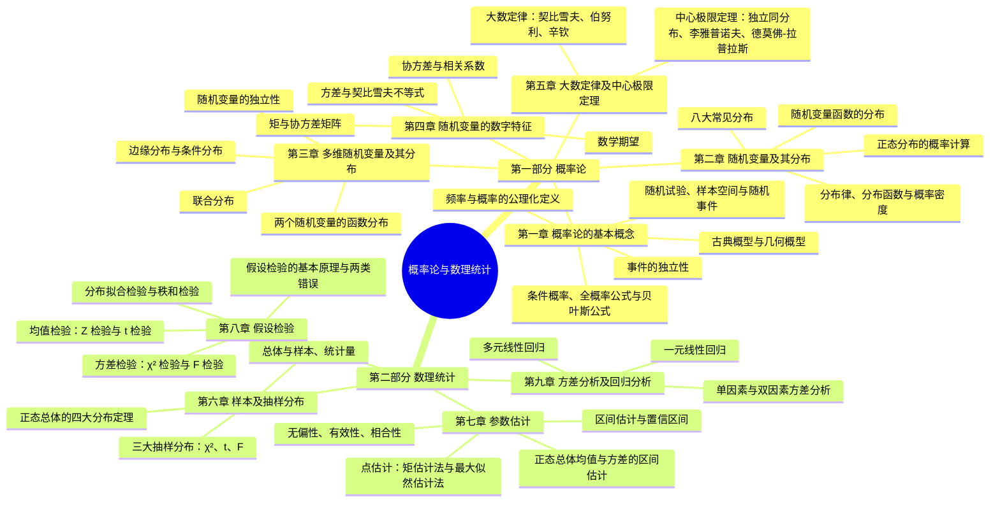

# 课程概览
## 基本信息
- 授课老师：杨建奎，戴金雨
- 课程成绩：90 分
- 这门课程整体难度较高。期中考核形式是撰写一篇论文，我只拿了 80 分。根据老师的说明，论文必须格式规范、内容切实有用，选题过于宏大反而不行。期末阶段则重在熟能生巧，需要背诵大量公式。总体而言，这门课是我学得比较好的一门课，期末考试的所有题目我都做完了。
## 知识结构

本课程分为**概率论**（第一~五章）与**数理统计**（第六~九章）两大部分：概率论部分从事件与概率出发，用随机变量及其分布、数字特征刻画随机现象，并以大数定律与中心极限定理收束；数理统计部分从样本出发，依次完成抽样分布、参数估计、假设检验两大统计推断任务，最后以方差分析与回归分析落地应用。整体框架如下：

1. **第一章 概率论的基本概念**
    - 建立概率论的完整概念骨架：随机试验、样本空间与随机事件（描述），频率与概率的公理化定义（度量），古典概型与几何概型（直接计算），条件概率、全概率公式与贝叶斯公式（信息更新），事件的独立性（结构简化）。
2. **第二章 随机变量及其分布**
    - 用随机变量把概率论"数量化"——分布律、分布函数、概率密度三种工具完整刻画随机变量的概率规律。
    - 两点、等可能、二项、泊松、几何（离散）与均匀、指数、正态（连续）八大常见分布及其典型背景，正态分布的概率计算。
    - 随机变量函数的分布提供"由已知分布推新分布"的一般方法。
3. **第三章 多维随机变量及其分布**
    - 把随机变量从一维推广到多维：联合分布函数、联合分布律、联合概率密度完整刻画 $(X, Y)$。
    - 边缘分布"压缩"出单变量分布，条件分布"固定"一个变量看另一个；独立性给出联合分布可分解为边缘乘积的判据。
    - 两个随机变量的函数分布（和、商、最大、最小）提供构造新分布的一般方法。
4. **第四章 随机变量的数字特征**
    - 期望、方差、协方差、相关系数、矩与协方差矩阵六个数字特征，从"中心、分散、相关、形状"四个角度概括随机变量。
    - 契比雪夫不等式与 n 维正态变量的"独立性 ⇔ 不相关性"性质，直接服务于大数定律与后续数理统计。
5. **第五章 大数定律及中心极限定理**
    - 大数定律（契比雪夫、伯努利、辛钦）为"频率稳定于概率、平均稳定于期望"提供严格的数学保证。
    - 中心极限定理（独立同分布、李雅普诺夫、德莫佛-拉普拉斯）揭示"大量独立随机变量之和趋于正态"的普适规律，完成概率论从"描述随机性"到"驾驭随机性"的跨越。
6. **第六章 样本及抽样分布**
    - 完成从概率论到数理统计的过渡：总体与样本、统计量、经验分布函数及其收敛性（格里汶科定理）。
    - χ²、t、F 三大抽样分布与正态总体的四大分布定理，是参数估计与假设检验的统计基础。
7. **第七章 参数估计**
    - 完成数理统计的"估计"任务：点估计（矩估计法与最大似然估计法），无偏性、有效性、相合性三个评选标准。
    - 区间估计给出置信区间的一般求法，正态总体的 $z$、$t$、χ²、$F$ 区间覆盖单总体与双总体的均值、方差、均值差、方差比，另有单侧置信区间。
8. **第八章 假设检验**
    - 完成数理统计的"检验"任务：以实际推断原理为基础，建立原假设/备择假设、显著性水平、拒绝域、两类错误等概念体系与一般步骤。
    - 正态总体均值（$Z$、$t$ 检验：单总体、双总体、成对数据）与方差（χ²、$F$ 检验）的完整检验表（表 8.1）；置信区间与假设检验的对偶关系。
    - OC 函数控制第二类错误并确定样本容量；χ² 拟合检验、偏度峰度检验与秩和检验覆盖分布未知时的非参数检验场景。
9. **第九章 方差分析及回归分析**
    - 数理统计的两个高级应用：方差分析（单因素与双因素，通过平方和分解与 $F$ 检验判断各因素及交互作用的影响是否显著）。
    - 回归分析（一元线性回归的最小二乘估计、显著性检验、置信区间与预测区间、可线性化的曲线回归；多元线性回归的矩阵求解与 MATLAB 实现）。至此全课程形成完整闭环。

### 知识定位与框架衔接

**前置知识**：高等数学（微积分、级数与多重积分——期望、方差、密度函数的计算基础）与线性代数（矩阵、向量——协方差矩阵、n 维正态、多元回归的矩阵工具）。第一章的事件与概率骨架贯穿全书，是后续一切推导的起点。

**后置知识**：数理统计部分（六~九章）是统计学习与机器学习的理论基础——参数估计与假设检验对应统计学习的核心范式（极大似然估计、显著性检验），方差分析与回归分析直接通向实验设计与线性模型，χ² 拟合检验与秩和检验则是非参数统计（Bootstrap、KS 检验、Wilcoxon 秩和检验）的入口。

**故事比喻**：概率论是"解释随机世界的语言"——给定模型，描述随机现象的规律；数理统计是"从数据反推世界的工具"——给定数据，反推模型与参数。整门课就像"先学会丈量世界（一~五章），再学会用有限数据做可靠决策（六~九章）"。

**四个灵魂问题**：

1. **"大数定律与中心极限定理各自回答什么问题？"** —— 大数定律回答"频率/平均是否收敛到概率/期望"（定性，保证一致性）；中心极限定理回答"收敛的速度与形状"（定量，给出近似正态分布），两者是数理统计推断合法性的根基。
2. **"参数估计与假设检验为何共用同一套抽样分布？"** —— 枢轴量与检验统计量都依赖统计量的精确分布（$z$、$t$、χ²、$F$）；区间估计的"置信水平"与假设检验的"显著性水平"一一对偶，第八章表 8.1 与第七章区间表可互相推出。
3. **"方差分析与回归分析的检验为何都归结为 $F$ 检验？"** —— 两者的统计量都是"组间/回归平方和与组内/残差平方和之比"，在正态假设下服从 $F$ 分布，本质都是"比较两个独立 χ² 变量"。
4. **"期中论文与期末公式如何备考？"** —— 论文重在选题落地：格式规范、切实有用，话题过大反而不易出彩；期末则熟能生巧，$z$、$t$、χ²、$F$ 四张表（抽样分布表 8.1、区间估计表、检验法汇总表）必须熟练到可直接调用。
