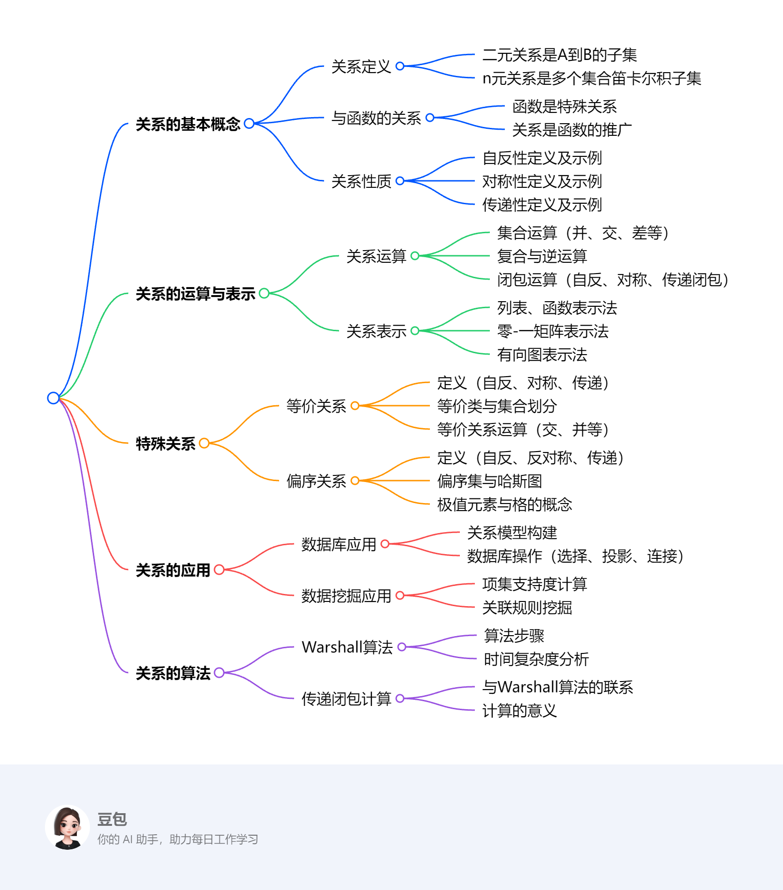

# 关系
该文档是离散数学课程中关系部分的教学资料，主要围绕关系的定义、性质、运算、表示方法、闭包以及特殊关系（等价关系和偏序关系）展开，还介绍了相关算法和在数据库中的应用，最后给出了作业题目。

1. **关系的基本概念**：关系是指定不同集合元素间关联的形式化手段，二元关系是从一个集合到另一个集合的子集，n元关系是多个集合笛卡尔积的子集。函数是特殊的关系，关系是函数的推广。关系具有自反、对称、传递等性质，不同性质可通过定义及集合、逻辑运算判断，如判断 “divides” 关系在不同整数集合上的性质。
2. **关系的运算与表示**：关系可进行并、交、差等集合运算和复合、逆运算，还有闭包运算，如自反闭包是添加所有自反元素，对称闭包是添加逆关系元素。关系可表示为列表、函数、矩阵和有向图，不同表示形式便于从不同角度理解和处理关系，如用零 - 一矩阵表示关系时可直观观察关系特性。
3. **特殊关系**
    - **等价关系**：满足自反、对称和传递性的二元关系，如整数的模m同余关系。等价关系可划分集合，每个划分块是一个等价类，集合的划分也可确定一个等价关系，二者相互对应，如整数模2同余关系将整数分为奇数和偶数两类。
    - **偏序关系**：满足自反、反对称和传递性的关系，如实数的小于等于关系、集合的包含关系。偏序集由集合和偏序关系组成，若偏序集中任意两个元素可比，则为全序集。可通过哈斯图直观表示有限偏序集，还可在偏序集中定义极值元素、上下界、格等概念，如在格中任意两个元素都有最小上界和最大下界。
4. **关系的应用**：在数据库中，n元关系可用于构建关系模型，数据库操作中的选择、投影、连接运算符基于关系运算实现数据筛选和处理。在数据挖掘中，通过计算项集的支持度等统计信息挖掘数据关联规则。
5. **算法相关**：计算关系的传递闭包可使用Warshall算法，其时间复杂度为 \(O(n^3)\) ，比直接计算 \(R^n\) 更高效，适用于处理大规模数据。 
