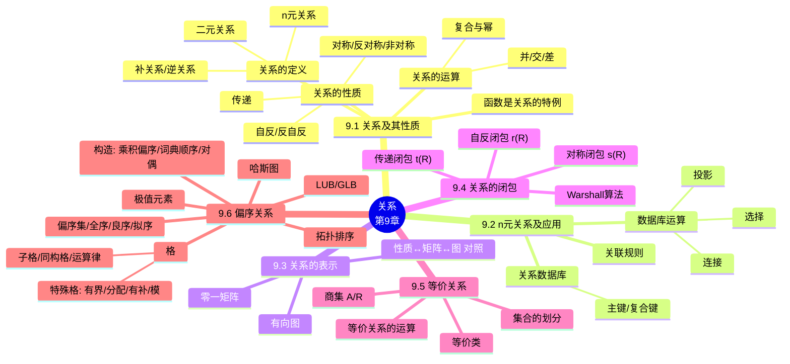

# 关系（Relations）

> **本章主线**：关系是什么（集合视角的定义）→ 如何刻画（六大性质）→ 如何表示（矩阵/图）→ 如何构造（闭包运算）→ 最重要的两类关系（**等价关系**：把元素"分堆"；**偏序关系**：把元素"排队"）→ 偏序的代数化（格）。
> 一句话版本：**关系是"元素之间是否相连"的精确数学语言**——等价关系负责分类，偏序关系负责排序。


```mermaid
mindmap
  root((关系<br/>第9章))
    9.1 关系及其性质
      关系的定义
        二元关系
        n元关系
        补关系/逆关系
      函数是关系的特例
      关系的性质
        自反/反自反
        对称/反对称/非对称
        传递
      关系的运算
        并/交/差
        复合与幂
    9.2 n元关系及应用
      关系数据库
        主键/复合键
      数据库运算
        选择
        投影
        连接
      关联规则
    9.3 关系的表示
      零一矩阵
      有向图
      性质↔矩阵↔图 对照
    9.4 关系的闭包
      自反闭包 r&lpar;R&rpar;
      对称闭包 s&lpar;R&rpar;
      传递闭包 t&lpar;R&rpar;
      Warshall算法
    9.5 等价关系
      等价类
      商集 A/R
      集合的划分
      等价关系的运算
    9.6 偏序关系
      偏序集/全序/良序/拟序
      构造: 乘积偏序/词典顺序/对偶
      哈斯图
      极值元素
      LUB/GLB
      拓扑排序
      格
        子格/同构格/运算律
        特殊格: 有界/分配/有补/模
```

---

## 9.1 关系及其性质（Relations and Their Properties）

### 9.1.1 关系的定义与基本概念

**关系的动机**：关系是刻画"两个或多个集合中哪些元素彼此相关"的**形式化手段**。例如：{学生}与{所选课程}、{商家}与{电话号码}、{整数}与{它的因子}、{程序变量}与{使用它的子程序}。用集合的"子集"来描述"相关"，是离散数学的核心思想之一。

**二元关系（binary relation）**：设 $A$、$B$ 为集合，从 $A$ 到 $B$ 的一个**二元关系** $R$ 是 $A \times B$ 的一个子集，即

$$R = \{(a,b) \mid a \in A,\ b \in B,\ a\,R\,b\}$$

1. 其中 $aRb$（读作"a 相关于 b"）表示 $(a,b) \in R$。
2. **注意**：两个集合的顺序至关重要——$A$ 到 $B$ 的关系与 $B$ 到 $A$ 的关系是不同对象。
3. **n 元关系（n-ary relation）**：设 $A_1, A_2, \ldots, A_n$ 为 $n$ 个集合，$R$ 是 $A_1 \times A_2 \times \cdots \times A_n$ 的一个子集；各 $A_i$ 称为关系的**域（domain）**，$n$ 称为关系的**度（degree）**，域的次序同样重要。
4. **谓词函数视角**：二元关系 $R$ 对应于一个谓词函数 $P_R: A \times B \to \{T, F\}$，例如谓词 "eats" $:= \{(a,b) \mid$ 生物 $a$ 吃食物 $b\}$。
5. **注意**：二元关系是"满足某规律的有序对的**全体**"，而不是单个有序对。

**基本派生关系**：

1. **补关系（complement）$\overline{R}$**：$\overline{R} := \{(a,b) \mid (a,b) \notin R\} = (A \times B) - R$。若论域取 $U = A \times B$，则补关系正是集合意义上的补；且 $\overline{\overline{R}} = R$（补的补是自身）。
2. **逆关系（inverse）$R^{-1}$**：$R^{-1} := \{(b,a) \mid (a,b) \in R\}$，是从 $B$ 到 $A$ 的关系。
    - 例：$<^{-1} = \{(b,a) \mid a < b\} = \{(b,a) \mid b > a\} = {>}$，即"小于"的逆是"大于"。
    - 例：若 $aRb \Leftrightarrow$ "a 吃 b"，则 $bR^{-1}a \Leftrightarrow$ "b 被 a 吃"（被动语态，直观地解释了"逆"的含义）。

### 9.1.2 函数是关系的特例

**函数 $f: A \to B$ 是一类特殊的二元关系**：它满足"对每个 $x \in A$，关系中恰好存在一个有序对 $(x, f(x))$"。

**关系是函数的推广（generalization）**：

- 允许 $A$ 中元素**没有映射**（未配对元素）；
- 允许**一对多**（一个元素映射到多个元素）；
- 也允许**多对一、多对多**。

> 一句话记忆：**函数 = 单值的关系；关系 = 多值化的函数**。

### 9.1.3 集合上的关系

**集合 $A$ 上的关系（relation on a set）**：从 $A$ 到 $A$ 的关系，即 $A^2 = A \times A$ 的子集。

- 例（整数集上的关系）：相等 $=$、大于 $>$、整除 $\mid$。
- 注意：此时 $A$ 与关系 $R$ 都可以是**无限集**。
- **恒等关系（identity relation）$I_A$**：$I_A := \{(a,a) \mid a \in A\}$，每个元素只与自身相关。

**例 4（整除关系）**：设 $A = \{1,2,3,4\}$，求关系 $R = \{(a,b) \mid a \text{ 整除 } b\}$ 中的有序对。

1. 对所有 $a \in A$：$a \mid a$ 恒成立 → $(1,1), (2,2), (3,3), (4,4)$。
2. $1$ 整除一切 → $(1,2), (1,3), (1,4)$。
3. $2 \mid 4$ → $(2,4)$；$2 \nmid 3$，$3$ 除自身外只被 $1$ 整除。
4. 故 $R = \{(1,1),(2,2),(3,3),(4,4),(1,2),(1,3),(1,4),(2,4)\}$。

> 该例演示的核心技巧：**枚举集合 $A$ 上的关系时，按"对角元 → 首行 → 其余"的顺序逐一验证，避免遗漏**。

**例 5（整数集上的六个关系）**：设 $R_1 = \{(a,b) \mid a \le b\}$，$R_2 = \{(a,b) \mid a > b\}$，$R_3 = \{(a,b) \mid a = b \text{ 或 } a = -b\}$，$R_4 = \{(a,b) \mid a = b\}$，$R_5 = \{(a,b) \mid a = b + 1\}$，$R_6 = \{(a,b) \mid a + b \le 3\}$。问哪些关系包含 $(1,1)$、$(1,2)$、$(2,1)$、$(1,-1)$、$(2,2)$？

**逐步验证**（以 $(1,1)$ 为例：$1 \le 1$ ✓ 属 $R_1$；$1 > 1$ ✗；$1 = 1$ ✓ 属 $R_3$；$1 = 1$ ✓ 属 $R_4$；$1 = 1+1$ ✗；$1+1 = 2 \le 3$ ✓ 属 $R_6$）。逐对检验得：

| 有序对 | $R_1$: $a \le b$ | $R_2$: $a > b$ | $R_3$: $a=b$ 或 $a=-b$ | $R_4$: $a=b$ | $R_5$: $a=b+1$ | $R_6$: $a+b \le 3$ |
|---|---|---|---|---|---|---|
| $(1, 1)$ | ✓ | ✗ | ✓ | ✓ | ✗ | ✓ |
| $(1, 2)$ | ✓ | ✗ | ✗ | ✗ | ✗ | ✓ |
| $(2, 1)$ | ✗ | ✓ | ✗ | ✗ | ✓ | ✓ |
| $(1, -1)$ | ✗ | ✗ | ✓ | ✗ | ✗ | ✓ |
| $(2, 2)$ | ✓ | ✗ | ✓ | ✓ | ✗ | ✗ |

**关系的计数**：设 $A$ 含 $n$ 个元素。

- $A^2$ 有 $n^2$ 个元素，$A^2$ 的子集共有 $2^{n^2}$ 个 → **集合 $A$ 上的关系总数 $= 2^{n^2}$**。
- 从 $A$ 到 $A$ 的函数总数为 $n^n$。两者比较：$n^n = (2^{\log n})^n = 2^{n \log n}$，增长速度**慢于** $2^{n^2}$。
- **自反关系的个数**：自反要求 $n$ 个对角元 $(a,a)$ 必须全部入选，其余 $n(n-1)$ 个非对角元（$a \ne b$）可选可不选，由乘法原理知**自反关系共有 $2^{n(n-1)}$ 个**。

> 口诀：**关系的个数"指数爆炸"：$n^2$ 个候选位置，每个位置可选可不选**。

### 9.1.4 关系的六大性质（Properties of Relations）

设 $R$ 是集合 $A$ 上的关系，则 $R$ 具有如下性质（**性质定义 = 判断标准**）：

#### 自反关系（reflexive）与反自反关系（irreflexive）

1. **自反**：对每个 $a \in A$，都有 $(a,a) \in R$（每个元素都与自身相关）。
    - 例：$A = \{1,2,3,4\}$ 上，$\{(1,1),(2,2),(3,3),(4,4)\}$ 自反（只含对角元）；$\le$、$=$ 自反。
2. **反自反**：对每个 $a \in A$，都有 $(a,a) \notin R$（任何元素都不与自身相关）。等价刻画：补关系 $\overline{R}$ 自反。
    - 例：$<$、$>$ 反自反。
3. **注意**：自反与反自反**不是互补**的——"不反自反"≠"反自反"。一个关系可以两者都不是（如 $R = \{(1,1)\}$ 在 $A = \{1,2\}$ 上：$1$ 与自身相关、$2$ 与自身不相关 → 既不满足"每个都有"也不满足"每个都没有"）。

#### 对称（symmetric）、反对称（antisymmetric）与非对称（asymmetric）

1. **对称**：只要 $(a,b) \in R$，就有 $(b,a) \in R$。等价刻画：$R = R^{-1}$。
    - 例：$=$、$R_3$（相等或相反数）、"是同班同学"。
2. **反对称**：只要 $(a,b) \in R$ 且 $(b,a) \in R$，就有 $a = b$（允许 $(a,a)$ 存在；不允许 $a \ne b$ 的双向关联）。等价刻画：$R \cap R^{-1} \subseteq I_A$。
    - 例：$\le$、$\subseteq$、整除。
3. **非对称（asymmetric）**：只要 $(a,b) \in R$，就有 $(b,a) \notin R$（严格单向，连 $(a,a)$ 都不允许）。
    - 例：$<$、$>$。
4. **注意**：对称与反对称**同样不是互补**（非此即彼是错觉）。
    - (1) 一个关系可以**同时对称且反对称**：此时它只可能是恒等关系 $I_A$ 的子集（只含 $(a,a)$ 型元素），例如 $=$。
    - (2) 也可以**既不对称也不反对称**：如 $R = \{(1,2),(2,1),(2,3)\}$ 于 $A = \{1,2,3\}$。

**验证技巧（等价命题）**：判断"对称/反对称"时，**只需看矩阵中主对角线以外的元素**：对称 ⇔ 矩阵是对称矩阵；反对称 ⇔ 当 $i \ne j$ 时 $M[i][j] = 1 \Rightarrow M[j][i] = 0$。

#### 传递关系（transitive）

**传递**：只要 $(a,b) \in R$ 且 $(b,c) \in R$，就有 $(a,c) \in R$。

- 例：$<$、$\le$、$=$、整除、$\subseteq$、"是…的祖先"（关系传递的典型）。
- 反例：$\{(1,2),(2,3)\}$ 不传递（缺 $(1,3)$）；$\{(1,1),(1,2)\}$ 呢？——检验：$(a,b) = (1,1)$、$(b,c) = (1,2)$ ⇒ 需要 $(1,2)$ ✓ 有；此外没有其他形如 $(a,b),(b,c)$ 的对 → $\{(1,1),(1,2)\}$ **是传递的**（小心！传递性只对"存在的对"提出要求，空前提恒真）。

#### 六大性质小结表

| 性质 | 判断标准（充要条件） | 典型例子 | 矩阵特征 | 图特征 |
|---|---|---|---|---|
| 自反 | $\forall a: (a,a) \in R$ | $\le$、$=$、整除 | 主对角线全 1 | 每个顶点都有自环 |
| 反自反 | $\forall a: (a,a) \notin R$ | $<$、$>$ | 主对角线全 0 | 无自环 |
| 对称 | $(a,b) \in R \Rightarrow (b,a) \in R$ | $=$、同班 | 对称矩阵 | 边成对出现（无向） |
| 反对称 | $(a,b),(b,a) \in R \Rightarrow a=b$ | $\le$、$\subseteq$ | 对称位不同时置 1 | 无双向边 |
| 非对称 | $(a,b) \in R \Rightarrow (b,a) \notin R$ | $<$ | 对称位 + 对角元均为 0 | 无双向边无自环 |
| 传递 | $(a,b),(b,c) \in R \Rightarrow (a,c) \in R$ | $\le$、整除 | $M_R^2 \le M_R$ | 沿路径走两步必有捷径 |

> 口诀：**自反看对角，对称看镜像，传递看捷径**；"反"与"不反"各管各，互不排斥。

### 9.1.5 关系的组合运算（Combining Relations）

关系是集合，因此可做**集合运算**；又因涉及有序对，还可做**复合运算**。

#### 集合运算（并、交、差、对称差）

设 $R_1$、$R_2$ 是从 $A$ 到 $B$ 的关系（$A \times B$ 的子集）：

- **并** $R_1 \cup R_2$、**交** $R_1 \cap R_2$、**差** $R_1 - R_2$、**对称差** $R_1 \oplus R_2$ —— 与集合定义完全一致。
- 例 17：设 $A = \{1,2,3\}$，$B = \{1,2,3,4\}$，$R_1 = \{(1,1),(2,2),(3,3)\}$，$R_2 = \{(1,1),(1,2),(1,3),(1,4)\}$，则
    - $R_1 \cap R_2 = \{(1,1)\}$；
    - $R_1 \cup R_2 = \{(1,1),(1,2),(1,3),(1,4),(2,2),(3,3)\}$；
    - $R_1 - R_2 = \{(2,2),(3,3)\}$；$R_2 - R_1 = \{(1,2),(1,3),(1,4)\}$。

#### 复合关系（composition）

**复合**：设 $R$ 是从 $A$ 到 $B$ 的关系，$S$ 是从 $B$ 到 $C$ 的关系，则 $S \circ R$（"S 复合 R"）是从 $A$ 到 $C$ 的关系，定义为：

$$S \circ R = \{(a,c) \mid \exists b \in B: (a,b) \in R \text{ 且 } (b,c) \in S\}$$

- 例 20：$R$ 是从 $\{1,2,3\}$ 到 $\{1,2,3,4\}$ 的关系 $R = \{(1,1),(1,4),(2,3),(3,1),(3,4)\}$，$S$ 是从 $\{1,2,3,4\}$ 到 $\{0,1,2\}$ 的关系 $S = \{(1,0),(2,0),(3,1),(3,2),(4,1)\}$，则
  $$S \circ R = \{(1,0),(1,1),(2,1),(2,2),(3,0),(3,1)\}$$
  例如 $(2,3) \in R$ 且 $(3,1), (3,2) \in S$，故 $(2,1), (2,2) \in S \circ R$。

**复合的复合 = 幂（powers）**：

1. $R^2 = R \circ R$（二元关系可自复合）；$R^3 = R \circ R^2$；一般 $R^{n+1} = R^n \circ R$，其中 $R^1 = R$。
2. **传递性用幂刻画（核心定理）**：$A$ 上关系 $R$ 是**传递的，当且仅当 $R^n \subseteq R$（对一切 $n = 1,2,3,\ldots$）**。
    - 直观：$R$ 传递 ⇔ 从 $a$ 沿 $R$ 走 $n$ 步能到 $b$，则一步就能到 $b$（"捷径存在"）。
    - 例：$R = \{(1,1),(2,1),(3,2),(4,3)\}$（"减一"关系）不是传递的：$R^2 = \{(1,1),(2,1),(3,1),(4,2)\} \nsubseteq R$（$(3,1)$、$(4,2) \notin R$，尽管 $(1,1) \in R$）。

> 口诀：**复合 = 走中间站**；传递 ⇔ "两跳必有直达"。

---

## 9.2 n 元关系及其应用（n-ary Relations and Their Applications）

### 9.2.1 关系数据库（Relational Databases）

**数据库（database）**：一个**记录（records / tuples）构成的集合**，本质上是某个 n 元关系 $R \subseteq A_1 \times \cdots \times A_n$（"数据库表"的数学抽象）。

1. 数据库由**记录（records / tuples）**组成，记录是 n 元组 $(a_1, \ldots, a_n)$，其中 $a_i \in A_i$。
2. **域（domain）$A_i$**：第 $i$ 个分量可取的值的集合；**元组的次序是固定的**。
3. 例（航空公司数据库）：记录 = (航班号, 起飞时间, 目的地, 出发地)；每条记录是一个 4 元组，属于 4 元关系。
4. 例（学生选课）：学号、姓名、所选课程、(成绩) → 元组如 (123, "张三", "离散数学", A)。
5. **函数性（functional）**：n 元关系 $R$ 在域 $A_i$ 上是**函数式的**，若每个值 $a_i \in A_i$ 至多出现在一个 n 元组中。
6. **数据库的内涵（intension / schema）与外延（extension）**：内涵是设计的永久部分——字段及其上的约束；外延是当前存储的记录集合（会随插入、删除而变化）。

**键（Keys）**：

1. **主键（primary key）**：能**唯一确定整条记录**的域组合（一个或多个域），即"两两记录在该域组合上取值不同"；等价地，$R$ 在该域上是函数式的。
    - 例：航班号可唯一确定航班 → 主键；学号可唯一确定学生。
2. **复合键（composite key）**：需要**多个域组合**才能唯一确定记录；有些数据库没有主键，只使用复合键。
    - 例：航班数据库的主键 = 航空公司 + 航班号；选课表中 (学号, 课程名) 才是主键——一个学生选多门课、一门课有多个学生，单独任一域都不唯一。
3. 插入新记录时须维持键的性质，主键的值**永不允许为 NULL**（空值）。

### 9.2.2 数据库操作（Operations on Databases）

**选择操作（selection）**：选出满足给定**条件 C** 的记录子集：

$$s_C(R) = \{(a_1,\ldots,a_n) \in R \mid \text{条件 } C(a_1,\ldots,a_n) \text{ 成立}\}$$

- 例：选出 102 航班 → $s_{\text{航班}=102}(R)$；选出"航行高度 > 3000 英尺" → $s_{\text{高度}>3000}(R)$。
- 类比：**行级筛选（filter rows）**。

**投影操作（projection）**：只保留**指定的若干分量**，其余分量去掉（并自动去重）：

$$P_{i_1,i_2,\ldots,i_m}(a_1,\ldots,a_n) = (a_{i_1}, a_{i_2}, \ldots, a_{i_m})$$

- 例：$P_{\text{航班},\text{日期}}(R)$ 只留航班与日期两列。
- 注意：投影结果中**重复的元组只保留一个**（集合语义）。
- 类比：**列级选择（pick columns）**。

**连接操作（join）**：把**两个关系**按公共分量拼接合并：若 $(A,B)$ 在 $R_1$ 中、$(B,C)$ 在 $R_2$ 中，则 $(A,B,C)$ 出现在连接 $J(R_1,R_2)$ 中（$A$、$B$、$C$ 可以分别是多个字段的序列，公共分量须全部对应相等）：

$$J(R_1, R_2)\ \text{的元组} = (a_1,\ldots,a_m,\ b_1,\ldots,b_n)$$

其中 $R_1$ 的元组 $(a_1,\ldots,a_m)$ 与 $R_2$ 的元组 $(b_1,\ldots,b_n)$ 在公共分量上取值一致。

- 例：$R_1$（教授, 课程）教学安排表、$R_2$（课程, 教室, 时间）教室安排表 → $J(R_1,R_2)$ 得到课程表 (教授, 课程, 教室, 时间)。
- 类比：**表连接（SQL JOIN ON 公共列）**。

**关联规则（association rule）与支持度（support）**：数据挖掘中，规则形如"买尿布的顾客通常也买啤酒"。设事务集 $T = \{t_1, t_2, \ldots, t_k\}$：

- 项目集 $I$ 的**计数** $\sigma(I) = |\{t_i \in T \mid I \subseteq t_i\}|$——包含项目集 $I$ 的事务个数；
- 项目集 $I$ 的**支持度** $\operatorname{support}(I) = \dfrac{\sigma(I)}{|T|}$——随机抽取一个事务包含 $I$ 的概率，用于衡量该模式出现的频率与统计显著性。

**数据库运算小结表**：

| 运算 | 对行/列的作用 | 数学定义 | 类比 |
|---|---|---|---|
| 选择 $s_C$ | 按条件筛**行** | 条件子集 | WHERE |
| 投影 $P_{i_1,\ldots,i_m}$ | 只留若干**列**（去重） | 分量映射 | SELECT 列 |
| 连接 $J$ | 按公共列拼接**两表** | 元组拼接 | JOIN |

> 口诀：**选择选行、投影取列、连接拼表**。

---

## 9.3 关系的表示（Representing Relations）

关系的两大表示法：**零一矩阵**（适合计算机处理与性质判定）与**有向图**（适合直观理解）。

### 9.3.1 用零一矩阵表示关系

**零一矩阵（zero–one matrix）**：设 $R$ 是从 $A = \{a_1,\ldots,a_m\}$ 到 $B = \{b_1,\ldots,b_n\}$ 的关系，$R$ 的矩阵 $M_R$ 是 $m \times n$ 矩阵，其 $(i,j)$ 元：

$$M_R[i][j] = 1 \iff (a_i, b_j) \in R; \qquad M_R[i][j] = 0 \iff (a_i, b_j) \notin R$$

- 例（喜欢关系）：Joe 喜欢 Susan 与 Mary，Fred 喜欢 Mary，Mark 喜欢 Sally；行 = Joe, Fred, Mark，列 = Susan, Mary, Sally：
  $$M_{Likes} = \begin{bmatrix} 1 & 1 & 0 \\ 0 & 1 & 0 \\ 0 & 0 & 1 \end{bmatrix}$$
- 例：$A=\{1,2,3\}$，$B=\{1,2\}$，$R=\{(2,1),(3,1),(3,2)\}$ → 矩阵 $\begin{bmatrix} 0 & 0 \\ 1 & 0 \\ 1 & 1 \end{bmatrix}$（行 = 1,2,3；列 = 1,2）。
- 例：$A=\{1,2,3,4\}$ 上 $R$ 含 $(1,1),(2,2),(3,3),(4,4),(1,2),(2,3),(1,3),(3,4)$ → $4 \times 4$ 矩阵，对角元全 1，另有 $(1,2),(2,3),(1,3),(3,4)$ 置 1。

**集合运算的矩阵表示（逐元素逻辑运算）**：

1. **并**：$M_{R_1 \cup R_2} = M_{R_1} \lor M_{R_2}$（逻辑或）。
2. **交**：$M_{R_1 \cap R_2} = M_{R_1} \land M_{R_2}$（逻辑与）。
3. **复合**：$M_{S \circ R} = M_R \odot M_S$（布尔积）。

**布尔积（Boolean product）**：$A$ 是 $m \times k$ 矩阵、$B$ 是 $k \times n$ 矩阵，布尔积 $A \odot B$ 是 $m \times n$ 矩阵，其 $(i,j)$ 元：

$$(A \odot B)[i][j] = \bigvee_{t=1}^{k} \left( A[i][t] \land B[t][j] \right)$$

即"先与后或"（类似于普通矩阵乘法把乘法换成 $\land$、加法换成 $\lor$）。注意维度要求：**内维必须相等**。

- 例：$A = \begin{bmatrix} 1 & 0 \\ 0 & 1 \\ 1 & 0 \end{bmatrix}$（3×2），$B = \begin{bmatrix} 1 & 1 & 0 \\ 0 & 1 & 1 \end{bmatrix}$（2×3）→ $A \odot B$ 是 3×3 矩阵：
    - 第 1 行：$(1\land 1)\lor(0\land 0)=1$，$(1\land 1)\lor(0\land 1)=1$，$(1\land 0)\lor(0\land 1)=0$ → $[1\ 1\ 0]$
    - 第 2 行：$(0\land 1)\lor(1\land 0)=0$，$(0\land 1)\lor(1\land 1)=1$，$(0\land 0)\lor(1\land 1)=1$ → $[0\ 1\ 1]$
    - 第 3 行：同第 1 行 → $[1\ 1\ 0]$

**幂的矩阵刻画**：$M_{R^n}$ = $M_R$ 的 $n$ 次布尔幂（即 $M_R \odot M_R \odot \cdots \odot M_R$，共 $n$ 次）。$R$ 传递 ⇔ 对所有 $n$，$M_{R^n} \le M_R$（逐元素 ≤）。

### 9.3.2 用有向图表示关系

**有向图（directed graph / digraph）**：设 $R$ 是集合 $A$ 上的关系，$R$ 的图表示由**顶点（vertices）= $A$ 的元素**与**有向边（directed edges）**组成：从 $a$ 到 $b$ 画有向边 $a \to b$ 当且仅当 $(a,b) \in R$。

- 例：$A = \{1,2,3,4\}$，$R = \{(1,1),(1,3),(2,3),(3,2),(3,4),(4,3)\}$：顶点 1,2,3,4；1 有自环与指向 3 的边；2 指向 3；3 指向 2、4；4 指向 3。
- 例：$A = \{1,2,3,4\}$，$R = \{(1,2),(1,3),(2,3),(2,4),(3,1),(4,2)\}$：1 出发指向 2、3；2 指向 3、4；3 指向 1；4 指向 2。

### 9.3.3 性质 ⇔ 矩阵 ⇔ 图 三视角对照表

| 性质 | 矩阵 $M_R$ 特征 | 有向图特征 |
|---|---|---|
| 自反 | 主对角线全 1 | 每个顶点都有**自环** |
| 反自反 | 主对角线全 0 | **无自环** |
| 对称 | 对称矩阵（$M = M^T$） | 边成对（双向），无向化 |
| 反对称 | 对称位不同时置 1（$i \ne j$） | 任意两顶点间至多一条边 |
| 非对称 | 对称位全 0 且对角全 0 | 无自环、无双向边 |
| 传递 | $M_R^2 \le M_R$ | 走两步能到 ⇒ 一步能到（有捷径） |

> 口诀：**矩阵看图看对角与镜像；传递性用"两步变一步"检验**。

---

## 9.4 关系的闭包（Closures of Relations）

### 9.4.1 闭包的思想：给关系"补课"

**动机**：一个关系 $R$ 可能缺少我们想要的性质（不自反、不对称、不传递）。**闭包（closure）**就是**在 $R$ 的基础上添加最少的有序对**，使它恰好获得该性质——"用最小代价补齐性质"。

**闭包**：设 $R$ 是集合 $A$ 上的关系，$R$ 的**自反闭包 $r(R)$**、**对称闭包 $s(R)$**、**传递闭包 $t(R)$** 分别定义如下：

$$r(R)：\text{包含 } R \text{ 且自反的 } A \text{ 上最小的关系}$$
$$s(R)：\text{包含 } R \text{ 且对称的 } A \text{ 上最小的关系}$$
$$t(R)：\text{包含 } R \text{ 且传递的 } A \text{ 上最小的关系}$$

**关键性质（保证闭包存在）**：

1. 闭包一定是**包含 $R$ 的关系**（$R \subseteq$ 闭包）。
2. 闭包满足对应的性质。
3. 闭包是**最小**的（任何同时包含 $R$ 且满足性质的 $A$ 上关系，都包含闭包）。
4. **多个性质同时补**：例如"自反且传递的闭包" = 先求 $r(R)$ 再求 $t(R)$，**顺序可以交换**（$r$ 与 $t$ 可交换——加自环不影响传递性；$s$ 与 $t$ 也可交换——两者都给出包含 $R$ 的最小对称传递关系）。

**记号**：$R^+ = t(R)$（传递闭包），$R^* = r(t(R))$（自反传递闭包）等（Rosen 符号）。

### 9.4.2 自反闭包与对称闭包的构造（定理 1、定理 2）

**定理 1（自反闭包）**：设 $R$ 是 $A$ 上的关系，则

$$r(R) = R \cup I_A \qquad (I_A \text{ 为恒等关系：加齐所有 } (a,a) \text{ 对角元})$$

- 例：$R = \{(1,1),(1,2),(2,1),(3,2)\}$ 于 $A=\{1,2,3\}$，则 $I_A = \{(1,1),(2,2),(3,3)\}$，$r(R) = R \cup I_A = \{(1,1),(1,2),(2,1),(2,2),(3,2),(3,3)\}$。
- 例：若 $A = \mathbb{Z}$，则 $r(\ne) = \mathbb{Z} \times \mathbb{Z}$（补上全部对角元后，任意两整数都"相关"）。

**定理 2（对称闭包）**：设 $R$ 是 $A$ 上的关系，则

$$s(R) = R \cup R^{-1} \qquad (\text{把所有边反向补上})$$

- 例：$R = \{(1,1),(1,2),(2,1),(3,2)\}$，$R^{-1} = \{(1,1),(2,1),(1,2),(2,3)\}$，$s(R) = R \cup R^{-1} = \{(1,1),(1,2),(2,1),(2,3),(3,2)\}$。
- 例：若 $A = \mathbb{Z}^+$，则 $s(<) = \ne$（小于补上反向的"大于"，恰为"不相等"）；若 $A = \mathbb{Z}$，则 $s(\le) = \mathbb{Z} \times \mathbb{Z}$（任意两整数必有一个不小于另一个）。

> 口诀：**自反补对角、对称补镜像**。

### 9.4.3 传递闭包的构造（定理 3 与路径刻画）

**路径（path）概念**：在关系 $R$ 的有向图中，从 $a$ 到 $b$ 的一条**长度为 $n$ 的路径**是一串顶点 $a = x_0, x_1, \ldots, x_n = b$，使得对每个 $i$ 都有 $(x_{i-1}, x_i) \in R$。

- 空边序列看作长度为 0 的路径（从 $a$ 到 $a$）；长度 ≥ 1 的从 $a$ 到自身的路径称为**回路（circuit / cycle）**。
- **路径与幂的对应**：存在长度为 $n$ 的 $a \to b$ 路径 ⇔ $(a,b) \in R^n$。

**定理 3（传递闭包的路径刻画）**：$R$ 是 $A$ 上的关系，$(a,b) \in t(R)$ 当且仅当**存在一条从 $a$ 到 $b$ 的长度 ≥ 1 的路径**（即从 $a$ 出发沿 $R$ 的边能走到 $b$）。

- 推论（矩阵形式）：令 $M_R$ 为 $R$ 的矩阵，$A$ 有 $n$ 个元素，则
  $$M_{t(R)} = M_R \lor M_R^2 \lor M_R^3 \lor \cdots \lor M_R^n$$
- 直观：$R^k$ 的元 $(a,b) = 1$ ⇔ 存在**恰好长度为 $k$** 的 $a \to b$ 路径；"长度 ≥ 1 且 ≤ n"的路径并起来就是传递闭包。

**为什么求和到 $n$ 就够**：若存在长度 > $n$ 的路径，中间必经过重复顶点，删去其中的环得到更短路径 → 最短路径长度 ≤ $n-1$。因此只需考虑 $k = 1, 2, \ldots, n$。

### 9.4.4 Warshall 算法（计算传递闭包的高效方法）

**动机**：直接布尔幂求和需 $\Theta(n^4)$（$n$ 次矩阵布尔乘，每次 $\Theta(n^3)$）。**Warshall 算法**用**动态规划**降到 $\Theta(n^3)$。

**核心思想**：按"中间顶点集合"递推。定义

$$W_k[i][j] = 1 \iff \text{存在路径 } a_i \to \cdots \to a_j，\text{其中间顶点只取自 } \{v_1, v_2, \ldots, v_k\}$$

1. **初始**：$W_0 = M_R$（不允许中间顶点，即直接边或自环）。
2. **递推**（$k = 1 \to n$）：新顶点 $v_k$ 被允许作为中间点：
   $$W_k[i][j] = W_{k-1}[i][j] \lor \left( W_{k-1}[i][k] \land W_{k-1}[k][j] \right)$$
   即：$i \to j$ 的路径若不经过 $v_k$ 已可行；或者"$i$ 能到 $v_k$"且"$v_k$ 能到 $j$"，则 $v_k$ 可作跳板。
3. **终止**：$W_n = M_{t(R)}$（中间顶点取尽所有顶点）。

**算法步骤（伪代码）**：

```
输入：n×n 零一矩阵 M_R（A = {a₁,…,aₙ}）
W := M_R
for k = 1 to n:
    for i = 1 to n:
        for j = 1 to n:
            W[i][j] := W[i][j] ∨ (W[i][k] ∧ W[k][j])
输出：W（即 t(R) 的矩阵）
```

**复杂度**：三层循环各 $n$ 次 → $\Theta(n^3)$（每次迭代在原矩阵上原地更新，$W_k$ 覆盖 $W_{k-1}$ 即可——"允许更多中间点"只会让 0 变 1，不会回退）。

**传递闭包例（完整手算）**：设 $A = \{1,2,3,4\}$，$R = \{(1,2),(2,3),(3,4),(2,1)\}$。

1. 初始矩阵：
   $$W_0 = M_R = \begin{bmatrix} 0 & 1 & 0 & 0 \\ 1 & 0 & 1 & 0 \\ 0 & 0 & 0 & 1 \\ 0 & 0 & 0 & 0 \end{bmatrix}$$
2. $k = 1$（允许顶点 1 作中间点）：第 1 列为 1 的行只有行 2，行 2 := 行 2 ∨ 行 1：
   $$W_1 = \begin{bmatrix} 0 & 1 & 0 & 0 \\ 1 & 1 & 1 & 0 \\ 0 & 0 & 0 & 1 \\ 0 & 0 & 0 & 0 \end{bmatrix}$$
3. $k = 2$（允许顶点 2）：第 2 列为 1 的行有行 1、行 2：行 1 := 行 1 ∨ 行 2，行 2 不变：
   $$W_2 = \begin{bmatrix} 1 & 1 & 1 & 0 \\ 1 & 1 & 1 & 0 \\ 0 & 0 & 0 & 1 \\ 0 & 0 & 0 & 0 \end{bmatrix}$$
4. $k = 3$（允许顶点 3）：第 3 列为 1 的行有行 1、行 2：行 1 := 行 1 ∨ 行 3，行 2 := 行 2 ∨ 行 3：
   $$W_3 = \begin{bmatrix} 1 & 1 & 1 & 1 \\ 1 & 1 & 1 & 1 \\ 0 & 0 & 0 & 1 \\ 0 & 0 & 0 & 0 \end{bmatrix}$$
5. $k = 4$（允许顶点 4）：第 4 列为 1 的行以全 0 的行 4 为跳板，不变：
   $$W_4 = M_{t(R)} = \begin{bmatrix} 1 & 1 & 1 & 1 \\ 1 & 1 & 1 & 1 \\ 0 & 0 & 0 & 1 \\ 0 & 0 & 0 & 0 \end{bmatrix}$$
   验证：1 → 2 → 3 → 4 路径全通（1 可达 1（经 1→2→1）、2、3、4；2 可达 1（经 2→1）、3、4；3 仅可达 4；4 无出边）✓。

**再例（幂求和法）**：$A = \{1,2,3\}$，$R = \{(1,1),(1,2),(2,3)\}$：$R^2 = \{(1,1),(1,2),(1,3)\}$（$(1,2) \in R$ 且 $(2,3) \in R$ ⇒ $(1,3) \in R^2$），$R^3 = R^2$，故 $t(R) = R \cup R^2 = \{(1,1),(1,2),(1,3),(2,3)\}$。

**Warshall 与布尔幂求和对比**：

| 方法 | 原理 | 时间复杂度 | 适用 |
|---|---|---|---|
| 布尔幂求和 $t(R) = R \cup R^2 \cup \cdots \cup R^n$ | 路径长度分解 | $\Theta(n^4)$ | 教学理解 |
| Warshall 算法 | 中间顶点动态规划 | $\Theta(n^3)$ | 实际计算 |

> 口诀：**Warshall 每次放一个新跳板，行并行的"或与"三步更新**。

### 9.4.5 三种闭包构造一览

| 闭包 | 记号 | 构造公式 | 直观操作 | 复杂度 |
|---|---|---|---|---|
| 自反闭包 | $r(R)$ | $R \cup I_A$ | 补全对角元 | $O(n)$ |
| 对称闭包 | $s(R)$ | $R \cup R^{-1}$ | 补反向边 | $O(n^2)$ |
| 传递闭包 | $t(R)$ | $R^+$，Warshall 矩阵 $W$ | 沿路径补捷径 | $\Theta(n^3)$ |

> 记忆链：**先自反、再对称、最难的是传递（路径可达性）**。

---

## 9.5 等价关系（Equivalence Relations）

### 9.5.1 等价关系的定义

**等价关系（equivalence relation）**：集合 $A$ 上的关系 $R$ 若**同时具有自反、对称、传递**三条性质，则称 $R$ 是 $A$ 上的等价关系；$(a,b) \in R$ 时称 $a$ 与 $b$ **等价**。

- 例："同班同学"（自反：自己是自己同学；对称：$a$ 与 $b$ 同班 ⇔ $b$ 与 $a$ 同班；传递：$a$、$b$ 同班且 $b$、$c$ 同班 ⇒ $a$、$c$ 同班）。
- 例：**同余关系（congruence）**：整数集上 $R = \{(a,b) \mid a \equiv b \pmod m\}$（$a$、$b$ 除以 $m$ 余数相同）是等价关系。
- 例：字符串的"同长"关系、实数的"小数部分相同"关系（$a - b \in \mathbb{Z}$）、"绝对值相同"关系都是等价关系。

### 9.5.2 等价类（Equivalence Classes）

**等价类**：设 $R$ 是 $A$ 上的等价关系，$a \in A$ 的**等价类**记作 $[a]$（或 $[a]_R$），定义为：

$$[a] = \{ s \in A \mid (a,s) \in R \} \qquad (\text{与 } a \text{ 相关的全体元素})$$

- 例：同余 mod 4 下，$[1] = \{\ldots, -7, -3, 1, 5, 9, \ldots\}$（所有除以 4 余 1 的整数）；$[0] = \{\ldots, -8, -4, 0, 4, 8, \ldots\}$。
- 每个 $b \in [a]$（包括 $a$ 自身）都称为等价类 $[a]$ 的一个**代表元（representative）**。
- **等价类的两种等价理解**：
    1. **集合视角**：与 $a$ 相关的所有元素构成的集合；
    2. **图视角**：等价关系的有向图中"连成一片"的连通分支——自反对称传递 ⇒ 不同连通分支之间无任何边（若两个类之间有边，通过对称和传递它们会合并成一类）。

**定理（等价类的基本性质）**：设 $R$ 是 $A$ 上的等价关系，$a$、$b \in A$，则下面三条**等价**（任意一条成立即等价类相等）：

1. $(a,b) \in R$（$a$ 与 $b$ 相关）；
2. $[a] = [b]$（等价类相同）；
3. $[a] \cap [b] \ne \varnothing$（两个等价类有公共元素）。

由此可推出：**$A$ 上等价关系 $R$ 的等价类构成了 $A$ 的一个划分**（任意两个不同的等价类不相交，且所有等价类之并恰为 $A$）。

### 9.5.3 商集（Quotient Set）与划分（Partition）

**商集（quotient set）**：$A$ 上等价关系 $R$ 的**全体等价类**构成的集合，记作 $A/R$（读作"A mod R"），又称"$R$ 诱导的划分"：

$$A/R = \{ [a] \mid a \in A \}$$

- 例：整数集 $\mathbb{Z}$ 上同余 mod 4 的商集 $\mathbb{Z}/\equiv_4 = \{[0],[1],[2],[3]\}$（恰 4 个等价类）。
- **秩（rank）**：商集 $A/R$ 的元素个数（即 $R$ 的等价类个数）称为 $R$ 的**秩**。

**求商集的步骤**：任选元素 $a$ 计算等价类 $[a]$；若 $[a] \ne A$，取不在其中的元素 $b$ 计算 $[b]$；重复直至所有元素都被覆盖。若 $A$ 可数无限，则归纳出等价类的规律后给出公式描述。

**划分（partition）**：集合 $A$ 的一个**划分**是由 $A$ 的**非空子集**构成的集合 $\{A_1, A_2, \ldots, A_k\}$，满足：

1. **互不相交**：$A_i \cap A_j = \varnothing$（$i \ne j$）；
2. **并集为全**：$A_1 \cup A_2 \cup \cdots \cup A_k = A$。

**核心双向定理（等价关系 ⇔ 划分）**：

- **方向 1**：等价关系 $R$ 的**等价类构成 $A$ 的一个划分**；
- **方向 2**：反过来，给定 $A$ 的一个划分 $\{A_1,\ldots,A_k\}$，定义关系 $R = \{(a,b) \mid a$、$b$ 属于同一块 $A_i\}$，则 $R$ **是等价关系**，且其等价类正是各块 $A_i$。

> 一句话：**等价关系与集合的划分一一对应**——"分堆"的标准就是等价关系，分出的"堆"就是等价类。

### 9.5.4 等价关系与划分对照表

| 概念 | 数学对象 | 例（同余 mod 4） |
|---|---|---|
| 等价关系 $R$ | 自反+对称+传递的关系 | $a \equiv b \pmod 4$ |
| 等价类 $[a]$ | 与 $a$ 相关的元素集 | $[1] = \{\ldots,-3,1,5,\ldots\}$ |
| 商集 $A/R$ | 所有等价类之集 | $\{[0],[1],[2],[3]\}$ |
| 划分 | 不相交且并满的块族 | $\{\{\ldots,0,4,\ldots\}, \{\ldots,1,5,\ldots\}, \ldots\}$ |

> 口诀：**等价关系负责"分堆"，商集 = 堆的集合，划分 = 堆的刻画**。

### 9.5.5 等价关系的运算与构造

1. **等价关系之交仍为等价关系**：若 $R_1$、$R_2$ 均为 $A$ 上等价关系，则 $R_1 \cap R_2$ 仍是等价关系——自反、对称、传递三条性质在交运算下保持（逐一验证：$\forall$ 元素的 $(a,a)$ 在两者中 ⇒ 在交中；对称、传递同理）。
2. **等价关系之并为相容关系（compatibility）**：$R_1 \cup R_2$ 保持自反与对称，但**不一定传递**——$(a,b)$ 可能来自 $R_1$ 而 $(b,c)$ 来自 $R_2$，无法保证 $(a,c)$。例：$A = \{a,b,c\}$，$R_1$ 把 $a$、$b$ 归一类，$R_2$ 把 $b$、$c$ 归一类，则 $R_1 \cup R_2$ 含 $(a,b)$、$(b,c)$ 却缺 $(a,c)$。
3. **传递闭包救场**：$R_1 \cup R_2$ 的传递闭包 $(R_1 \cup R_2)^*$ **必是等价关系**（自反、对称在传递扩张下保持，传递性由闭包保证）。
4. **分划的积与和**：等价关系与分划一一对应，两个等价关系对应着分划层面的两种运算：
    - **分划的积 $\pi_1 \cdot \pi_2$** 对应 $R_1 \cap R_2$：凡 $\pi_1$ 或 $\pi_2$ 中要求拆开的就拆开，使分划**更细**；
    - **分划的和 $\pi_1 + \pi_2$** 对应 $(R_1 \cup R_2)^*$：把在 $\pi_1$ 或 $\pi_2$ 中有联系的元素合并，使分划**更粗**。
    - 例（扑克牌）：同花关系与同点关系之交把 52 张牌分成 52 个单张类；两者之并的传递闭包把 52 张牌归为同一类。
5. **构造技巧**：在集合上按某种"相同特征"（同余、同长、同班、连通分量）定义的关系通常是等价关系，且其等价类正是"特征相同"的元素组。
6. **与闭包的联系**：若 $R$ 已对称且传递，则其自反闭包 $r(R) = R \cup I_A$ **自动成为等价关系**（补对角元不会破坏对称性与传递性——凡涉及 $(a,a)$ 的传递检验都平凡成立）。

> 本节主线：**等价关系 → 等价类（把元素分组）→ 商集（组之集）→ 划分（分组的数学刻画）→ 双向一一对应**。

---

## 9.6 偏序关系（Partial Orderings）

### 9.6.1 偏序、偏序集与全序

**偏序（partial ordering）**：集合 $A$ 上的关系 $R$ 若**同时具有自反、反对称、传递**三条性质，则称 $R$ 是 $A$ 上的一个**偏序**，记作 $\preceq$（读作"小于或等于"）；**偏序集（poset）**记作 $(S, \preceq)$。

- 例：$(\mathbb{Z}, \le)$、$(\mathbb{Z}^+, \ge)$ 是偏序集；$(2^S, \subseteq)$（集合包含关系）是偏序集；$(\mathbb{Z}^+, \mid)$（整除）是偏序集。
- **记号约定**：$a \preceq b$ 表示 $(a,b) \in R$；$a \prec b$ 表示 $a \preceq b$ 且 $a \ne b$（严格偏序，此时 $\prec$ 是**非自反且传递**的）。
- **注意区分**：偏序 = **自反 + 反对称 + 传递**（允许 $(a,a)$），不同于等价关系（自反+对称+传递）——**反对称 vs 对称**是二者的分水岭。

**可比性（comparable）**：偏序集 $(S, \preceq)$ 中，若 $a \preceq b$ 或 $b \preceq a$，则称 $a$、$b$ **可比**；否则称**不可比（incomparable）**。

- 例：$(\mathbb{Z}^+, \mid)$ 中 3 与 9 可比（$3 \mid 9$）；3 与 5 不可比（$3 \nmid 5$ 且 $5 \nmid 3$）。
- 例：$(2^S, \subseteq)$ 中 $\{1,2\}$ 与 $\{2,3\}$ 不可比。

**全序（total order / linear order）**：偏序集 $(S, \preceq)$ 中若**每对元素都可比**，则称 $\preceq$ 为**全序**（线性序），$(S, \preceq)$ 称为**全序集**或**链（chain）**。

- 例：$(\mathbb{Z}, \le)$ 是全序（任意两整数必有一个小）；$(\mathbb{Z}^+, \mid)$ **不是**全序（有不可比元素）。
- **全序 = 偏序 + 任意两两可比**。

**良序（well-ordering）**：偏序集 $(S, \preceq)$ 若为全序，且 $S$ 的**每个非空子集都有最小元素**，则称为**良序集**。

- 例：$(\mathbb{N}, \le)$（自然数）是良序集；$(\mathbb{Z}, \le)$（整数）**不是**良序集（$\mathbb{Z}$ 本身无最小元素）。
- **良序性重要用途**：**数学归纳法**的严格基础（良序原理：自然数集的任何非空子集有最小元素）。

**拟序（quasiorder）**：**传递且反自反**的关系称为**拟序**（即严格偏序），如 $\mathbb{Z}^+$ 上的 $<$、集合上的真包含 $\subset$。

### 9.6.2 构造新偏序：乘积偏序、词典顺序与对偶

**乘积偏序（product partial order）**：若 $(A, \preceq_1)$、$(B, \preceq_2)$ 是偏序集，则 $A \times B$ 上定义

$$(a,b) \preceq (a',b') \iff a \preceq_1 a' \text{ 且 } b \preceq_2 b'$$

$(A \times B, \preceq)$ 仍是偏序集，此序称为**乘积偏序**。

**词典顺序（lexicographic order）**：$A \times B$ 上定义

$$(a,b) \preceq (a',b') \iff a \prec_1 a' \ \text{或}\ (a = a' \text{ 且 } b \preceq_2 b')$$

即先按第一分量比较，相同时再按第二分量——正如字典"逐字母"比较。该定义可递归扩展到笛卡尔积 $A_1 \times A_2 \times \cdots \times A_n$。例：普通字母序下 "help" ≺ "helping"（"help" 是 "helping" 的前缀）。

**对偶（dual）**：若 $R$ 是 $A$ 上的偏序，则逆关系 $R^{-1}$ 也是 $A$ 上的偏序；$(A, R^{-1})$ 称为 $(A, R)$ 的**对偶**偏序集。例：$(\mathbb{Z}, \le)$ 的对偶是 $(\mathbb{Z}, \ge)$。

### 9.6.3 哈斯图（Hasse Diagrams）

**哈斯图**：偏序关系的简化图表示，删除冗余信息后只保留"紧邻"关系：

1. **去掉自环**（自反性隐含）；
2. **去掉由传递性可推出的边**（如 $a \preceq b$、$b \preceq c$ 已画，则 $a \preceq c$ 的边省去）；
3. **定向向上画**（若 $a \prec b$，则把 $b$ 画在 $a$ 的上方），于是**箭头可省略**，用"高低位置"表示方向。

- 例（$(\mathbb{Z}^+, \mid)$ 中 1、2、3、4、6、8、12 的哈斯图）：
  ```
         12
        /  \
       6    8
      / \  /
     2   3  4
      \ /  /
       1
  ```
  覆盖关系：$1 \prec 2$、$1 \prec 3$、$2 \prec 4$、$2 \prec 6$、$3 \prec 6$、$4 \prec 8$、$4 \prec 12$、$6 \prec 12$（仅画紧邻）。
- 例（$(2^{\{a,b,c\}}, \subseteq)$ 的哈斯图）：$\varnothing$ 在最底，$\{a\},\{b\},\{c\}$ 在其上，然后 $\{a,b\},\{a,c\},\{b,c\}$，最顶 $\{a,b,c\}$——逐层按包含关系排列。

**覆盖（covers）**：偏序集 $(S, \preceq)$ 中，若 $a \prec b$ 且不存在 $c$ 使得 $a \prec c \prec b$，则称 **$b$ 覆盖 $a$**（$a$ 与 $b$ 是"紧邻"的）。哈斯图只画**覆盖关系**对应的边。

### 9.6.4 极大元、极小元、最大元、最小元

设 $(S, \preceq)$ 是偏序集，$A \subseteq S$（$A$ 是非空子集）：

| 概念 | 定义 | 判别要点 |
|---|---|---|
| **$A$ 的极大元（maximal）** | $A$ 中不存在 $x$ 使得 $m \prec x$（$A$ 内没有比它更大的） | 只要 $A$ 内没有更大的 |
| **$A$ 的极小元（minimal）** | $A$ 中不存在 $x$ 使得 $x \prec m$（$A$ 内没有比它更小的） | 只要 $A$ 内没有更小的 |
| **$A$ 的最大元（greatest）** | $A$ 中每个 $x$ 都满足 $x \preceq m$（$m$ 比 $A$ 中所有元素都大或等） | 与 $A$ 中每个元素都可比且最大 |
| **$A$ 的最小元（least）** | $A$ 中每个 $x$ 都满足 $m \preceq x$ | 与 $A$ 中每个元素都可比且最小 |

**关键区别（易混点）**：

1. **极大/极小元**：只要求"**在 $A$ 内部**没有更大/更小"，**不要求与其他元素可比**。极大元、极小元**可能不止一个**。
2. **最大/最小元**：要求与 $A$ 中**每个元素都可比**（此时自然唯一）。最大元必是极大元，反之不然。
3. 例：$(\mathbb{Z}^+, \mid)$ 中 $S = \{2,3,4,6,8,12\}$：
    - 极大元：8、12（没有更大的）；极小元：2、3（没有更小的）。
    - 最大元、最小元：**不存在**（8 与 12 不可比，2 与 3 不可比）。
4. **存在性规律**：有限非空偏序集**必有**极大元、极小元；**未必有**最大元、最小元；最大元、最小元若存在则**唯一**。
5. **记号**：若最大元存在记作 $I$（称为**单位元**），若最小元存在记作 $0$（称为**零元**）。

### 9.6.5 上界、下界、最小上界（LUB）、最大下界（GLB）

设 $(S, \preceq)$ 偏序集，$A \subseteq S$：

| 概念 | 定义 |
|---|---|
| **$A$ 的上界（upper bound）** | 元素 $u \in S$，使得 $A$ 中每个 $a$ 都满足 $a \preceq u$（$u$ 在 $A$ 上方，可在 $A$ 外） |
| **$A$ 的下界（lower bound）** | 元素 $l \in S$，使得 $A$ 中每个 $a$ 都满足 $l \preceq a$ |
| **$A$ 的最小上界（least upper bound, lub）** | $A$ 的上界集合中的**最小元素**（若存在，记 $\sup A$） |
| **$A$ 的最大下界（greatest lower bound, glb）** | $A$ 的下界集合中的**最大元素**（若存在，记 $\inf A$） |

- 例：$(\mathbb{Z}^+, \mid)$ 中 $A = \{2, 3\}$：
    - $A$ 的上界：能被 2 和 3 整除的数 → 6, 12, 18, …（**lub = 6**，即 $\operatorname{lcm}(2,3)$）。
    - $A$ 的下界：2 和 3 的公因子 → 1（**glb = 1**，即 $\gcd(2,3)$）。
- 例：$(2^{\{a,b,c\}}, \subseteq)$ 中 $A = \{\{a,b\},\{b,c\}\}$：上界 = $\{a,b,c\}$（lub = $\{a,b,c\}$ = $A$ 之并）；下界 = $\varnothing$, $\{b\}$（glb = $\{b\}$ = $A$ 之交）。
- **注意**：上界/下界**未必存在**、也未必唯一；lub/glb 若存在则**唯一**（每个子集至多一个 lub、至多一个 glb）。整除关系下 lub = 最小公倍数、glb = 最大公约数——偏序语言统一了"并/交/公倍数/公约数"这些概念。

### 9.6.6 拓扑排序（Topological Sorting）

**拓扑排序**：给定偏序集 $(S, \preceq)$，把 $S$ 的元素**排成一个线性序列** $a_1, a_2, \ldots, a_n$，使得只要 $a_i \preceq a_j$（$i \ne j$），必有 $i < j$——即"偏序中靠前的元素在序列中靠前"，不违反任何偏序约束的线性化。

**算法（贪心，SORT）**：

1. 从当前集合中**任取一个极小元**（没有前驱的元素），把它放入序列；
2. 从集合中**删除该元素**及其相关关系；
3. 重复直到所有元素排完。

    - 例（课程先修关系）：假设课程 $c_1, c_2, c_3, c_4, c_5, c_6$ 的先修偏序：$c_1 \to c_2$、$c_1 \to c_3$、$c_3 \to c_4$、$c_3 \to c_5$、$c_2 \to c_6$、$c_4 \to c_6$、$c_5 \to c_6$。拓扑排序（多次选择）：
        - 极小元：$c_1$ → 输出 $c_1$；删 $c_1$ 后极小元：$c_2$、$c_3$ → 输出 $c_2$；
        - 再删 $c_2$：极小元 $c_3$ → 输出 $c_3$；删 $c_3$ 后极小元 $c_4$、$c_5$ → 输出 $c_4$；
        - 删 $c_4$：极小元 $c_5$ → 输出 $c_5$；最后 $c_6$。
        - 得一个合法序列：**$c_1, c_2, c_3, c_4, c_5, c_6$**（通常不唯一，如也可 $c_1, c_3, c_2, \ldots$）。

**应用**：项目调度、课程先修安排、编译器的依赖解析（按依赖序编译模块）、DAG 任务排序。

**存在性**：有限偏序集**必有**拓扑排序（每次删极小元，有限步完成）。

### 9.6.7 格（Lattices）

**格（lattice）**：偏序集 $(S, \preceq)$ 若满足——$S$ 中**任意两个元素组成的集合 $\{a,b\}$ 都有 lub 和 glb**——则称 $(S, \preceq)$ 为**格**。记 $\operatorname{lub}(\{a,b\}) = a \lor b$（**join/并**），$\operatorname{glb}(\{a,b\}) = a \land b$（**meet/交**）。

- 例：$(\mathbb{Z}^+, \mid)$ 是格：$a \lor b = \operatorname{lcm}(a,b)$，$a \land b = \gcd(a,b)$（任何两数都有最小公倍数和最大公约数）。
- 例：$(2^S, \subseteq)$ 是格：$A \lor B = A \cup B$，$A \land B = A \cap B$。
- 例：$(\mathbb{Z}, \le)$ 是格：$a \lor b = \max(a,b)$，$a \land b = \min(a,b)$。
- 例（因子格 $D_n$）：$D_{30} = \{1,2,3,5,6,10,15,30\}$ 在整除关系下是格，$a \lor b = \operatorname{lcm}(a,b)$、$a \land b = \gcd(a,b)$。
- 反例（不是格）：$S = \{a,b,c,d,e\}$，覆盖关系 $a \prec b$、$a \prec c$、$b \prec d$、$c \prec d$、$b \prec e$、$c \prec e$：$\{b,c\}$ 的上界是 $d$ 与 $e$，二者不可比 → **lub 不存在** → 不是格。（格要求**每对**元素都有 lub 与 glb，缺一个就不行。）

**格运算的基本性质**（设 $(L, \preceq)$ 是格）：

1. $a \lor b = b \iff a \le b$；$a \land b = a \iff a \le b$（偏序与运算互相翻译）。
2. **等幂律**：$a \lor a = a$，$a \land a = a$。
3. **交换律**：$a \lor b = b \lor a$，$a \land b = b \land a$。
4. **结合律**：$a \lor (b \lor c) = (a \lor b) \lor c$，$a \land (b \land c) = (a \land b) \land c$（故可无括号地写 $a \lor b \lor c$）。
5. **吸收律**：$a \lor (a \land b) = a$，$a \land (a \lor b) = a$。
6. **保序性**：$a \le b \Rightarrow a \lor c \le b \lor c$、$a \land c \le b \land c$；若 $a \le b$ 且 $c \le d$，则 $a \lor c \le b \lor d$、$a \land c \le b \land d$。

**子格（sublattice）**：$(L, \preceq)$ 的**非空子集** $S$，若对任意 $a, b \in S$ 都有 $a \lor b \in S$、$a \land b \in S$，则 $S$ 是 $L$ 的**子格**。例：$(D_n, \mid)$ 是 $(\mathbb{Z}^+, \mid)$ 的子格。

**同构格（isomorphic lattices）**：若偏序同构 $f: L_1 \to L_2$ 保持格运算——$f(a \land b) = f(a) \land f(b)$、$f(a \lor b) = f(a) \lor f(b)$——则称两个格**同构**；作为偏序集同构的格必为同构格（格性在同构下保持）。

### 9.6.8 特殊格：有界格、分配格、有补格、模格

**有界格（bounded lattice）**：具有最大元 $I$ 与最小元 $0$ 的格。对一切 $a \in L$：

$$0 \le a \le I;\qquad a \lor 0 = a;\quad a \land 0 = 0;\quad a \lor I = I;\quad a \land I = a$$

- 例：$(P(S), \subseteq)$ 有界，最大元 $S$、最小元 $\varnothing$。
- **定理：任何有限格必有界**——最大元 $I = a_1 \lor a_2 \lor \cdots \lor a_n$，最小元 $0 = a_1 \land a_2 \land \cdots \land a_n$。

**分配格（distributive lattice）**：对任意 $a, b, c \in L$ 满足分配律：

$$a \land (b \lor c) = (a \land b) \lor (a \land c); \qquad a \lor (b \land c) = (a \lor b) \land (a \lor c)$$

- 例：$(P(S), \subseteq)$ 是分配格（并、交互相分配）。
- **刻画定理**：格 $L$ 非分配，当且仅当它含有同构于**钻石格 $M_3$** 或**五角格 $N_5$** 之一的子格。

**有补格（complemented lattice）**：在有界格 $L$ 中，若 $a'$ 满足 $a \lor a' = I$ 且 $a \land a' = 0$，称 $a'$ 是 $a$ 的**补元（complement）**（$0' = I$，$I' = 0$）；**每个元素都有补元的有界格**称为**有补格**。

- **注意**：补元**不必存在，也不必唯一**——一个元素可以有多个补元（如钻石格 $M_3$ 中每个元素都有补，中间层的元素各有 2 个补）。
- **定理（补元唯一性）**：在**有界分配格**中，若补元存在则**唯一**。证明（用分配律）：设 $a'$、$a''$ 都是 $a$ 的补元，则
  $$a' = a' \lor 0 = a' \lor (a \land a'') = (a' \lor a) \land (a' \lor a'') = I \land (a' \lor a'') = a' \lor a''$$
  同理 $a'' = a' \lor a''$，故 $a' = a''$。

**模格（modular lattice）**：满足**模律**的格：对任意 $a, b, c \in L$，若 $a \le c$，则

$$a \lor (b \land c) = (a \lor b) \land c$$

- 例：钻石格 $M_3$ 是**模格但不是分配格**（$a \lor (b \land c) = a \lor 0 = a$，而 $(a \lor b) \land (a \lor c) = I \land I = I$，分配律失效、模律却成立）。
- 关系链：**分配格 ⊂ 模格 ⊂ 格**；格可按"是否有界 / 是否有补 / 是否分配 / 是否模"组合出各种类型。

### 9.6.9 偏序相关概念对照表

| 概念 | 要求（在偏序基础上） | 例 | 是否一定存在 |
|---|---|---|---|
| 偏序集 | 自反+反对称+传递 | $(\mathbb{Z}^+, \mid)$ | — |
| 拟序 | 传递+反自反（严格偏序） | $(\mathbb{Z}^+, <)$、真包含 | — |
| 全序 | 任意两两可比 | $(\mathbb{Z}, \le)$ | 不一定 |
| 良序 | 全序 + 每个非空子集有最小元 | $(\mathbb{N}, \le)$ | 不一定 |
| 哈斯图 | 偏序的覆盖图 | $(\mathbb{Z}^+, \mid)$ 的覆盖图 | — |
| 拓扑排序 | 偏序的线性化序列 | 先修课程序列 | 有限偏序必有 |
| 格 | 任意两元素有 lub 与 glb | $(2^S, \subseteq)$ | 不一定 |

> 口诀：**偏序分堆靠不可比、全序全可比、良序每堆有最小、拟序就是严格版；哈斯图省自环省传递、只画紧邻；拓扑排序每次取极小元；格 = 每对都有上下确界**。

---

### 知识定位与框架衔接

#### 前置知识（地基，来自离散数学（上）与本章之前内容）

1. **集合论**：子集、笛卡尔积 $A \times B$、集合运算（并/交/差/补）——关系本身就是"笛卡尔积的子集"，集合运算直接决定关系的运算。
2. **函数**：单值映射——函数是"恰好一对一的"特殊关系，关系是函数的推广；逆函数对应逆关系。
3. **矩阵与图论基础**：零一矩阵、布尔运算（与/或）、有向图——关系用矩阵/图表示后，性质的判定变成"看矩阵"与"看图"。

#### 后置知识（上层建筑，离散数学（下）后续章节）

1. **图论（第10章 图、树）**：关系的图表示就是有向图；传递闭包 = 可达性；Warshall 算法与图的最短路思想同源；等价类 = 连通分量。
2. **代数结构（第11章 格与布尔代数、半群与群）**：格 = "任意两元素有 lub/glb 的偏序集"，其运算律（等幂/交换/结合/吸收）与有界、分配、有补格直接引出布尔代数；偏序结构与代数结构在这里合流。
3. **数据库与算法（应用层）**：关系数据库的键/选择/投影/连接就是本章 n 元关系的直接应用；拓扑排序是工程依赖解析、任务调度的标准算法。

#### 本章在整个课程中的位置（打地基比喻）

- 本章是离散数学的**"关系地基"**：从集合出发，把"相关"形式化为集合子集，然后系统研究它的性质、表示、构造与两类最重要的特例。
- **等价关系 = 分类器**：为后续"按特征分堆"（同余类、图连通分量、状态等价）提供统一语言；
- **偏序关系 = 排序器**：为后续"排队/排序/调度"（拓扑排序、格、布尔代数）提供统一语言。
- 学习节奏建议：**先抓六大性质与判定技巧 → 再抓闭包的"补课"思想（含 Warshall）→ 最后吃透等价/偏序两座大山**；9.5 与 9.6 是全章最常考、最核心的两节。

#### 核心灵魂问题（学完本章应能回答）

1. **为什么"函数"是"关系"的特例，而"关系"是"函数"的推广？** —— 关系允许一对多、允许无映射；函数是"恰好一个像"的关系，二者通过"单值性"相连。
2. **等价关系与划分为什么一一对应？传递闭包为什么等于"沿路径可达"？** —— 等价类的集合构成划分；反过来划分定义等价关系。$t(R)$ 的矩阵 = $R$ 的各次布尔幂取并，本质是"路径可达性矩阵"。
3. **偏序、全序、良序、格有什么区别？为什么极大元 ≠ 最大元？** —— 全序 = 偏序 + 两两可比；良序 = 全序 + 每非空子集有最小元；格 = 偏序 + 每对元素有 lub/glb；极大元只要求"内部无敌"，最大元要求"与全体可比且最大"，后者蕴含前者。

> **一句话总结本章**：**关系 = 笛卡尔积的子集**；**六大性质**（自反/反自反、对称/反对称/非对称、传递）给出刻画标准；**矩阵与图**给出表示与判定工具；**闭包**用最少代价补全性质；**等价关系**负责把集合分成堆，**偏序关系**负责把集合排成序，最终通过**格**汇入代数结构。

---

## 课件 PDF

<iframe src="./Relations and Their Properties.pdf" width="100%" height="800px" style="border: none;"></iframe>

[打开 PDF](./Relations and Their Properties.pdf)
