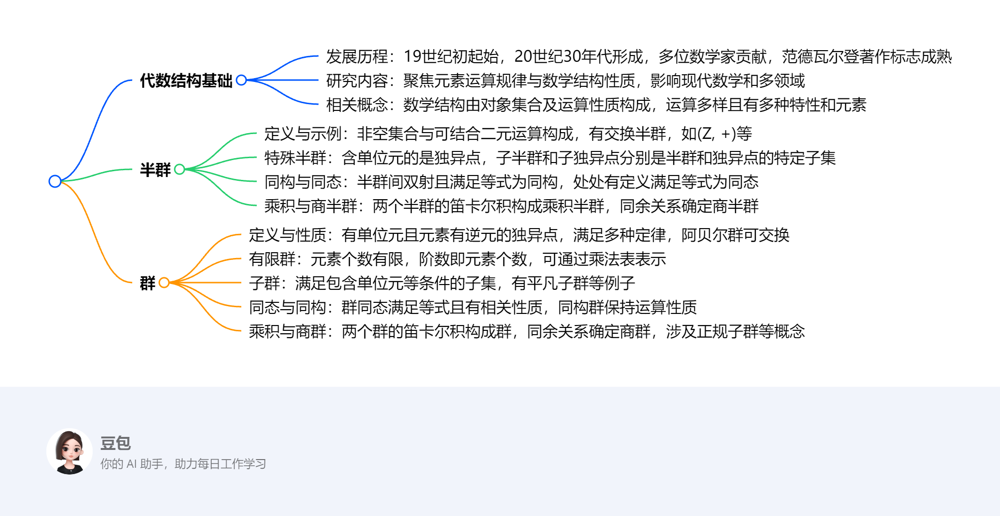

# 半群和群
该文档围绕代数结构中的半群和群展开，主要介绍相关概念、性质、运算及定理，为近世代数或抽象代数学的学习提供基础，在数学及计算机科学等领域有重要应用。

1. **代数结构基础**
    - **发展历程**：起始于19世纪初，形成于20世纪30年代，众多数学家如阿贝尔、伽罗瓦等做出杰出贡献，范德瓦尔登出版《近世代数学》标志着抽象代数成熟。
    - **研究内容**：以研究元素运算规律和由运算公理定义的数学结构性质为中心，对现代数学和其他科学领域有重要影响。
    - **相关概念**：数学结构由定义了运算及性质的对象集合构成。二元运算结合两个对象，一元运算作用于一个对象，运算具有封闭性、交换律、结合律、分配律等性质，部分运算存在单位元、逆元。
2. **半群**
    - **定义与示例**：非空集合S与S上可结合的二元运算 * 构成半群，记为(S, *)。如(Z, +)、(P(S), ∪)是半群，(Z, -)不是半群。若 * 满足交换律，则(S, *)是交换半群。
    - **特殊半群**：含单位元的半群是独异点，如(P(S), ∪) 、( \(S^{S}\) , *) 。子半群是半群的封闭子集，子独异点是独异点的封闭且含单位元的子集。
    - **同构与同态**：两个半群间的双射且满足 \(f(a^{*} b)=f(a)^{* \prime} f(b)\) 是同构；处处有定义且满足该等式的函数是同态。同态下，子半群的像是子半群，交换半群的同态像是交换半群。
    - **乘积与商半群**：两个半群 (S, *) 和 (T, *') 的笛卡尔积S×T，按 ( \(s_{1}\) , \(t_{1}\) ) *" ( \(s_{2}\) , \(t_{2}\) ) = ( \(s_{1}\) * \(s_{2}\) , \(t_{1}\) *' \(t_{2}\) ) 构成乘积半群；半群上的同余关系R可确定商半群S/R，还有同态基本定理相关结论。
3. **群**
    - **定义与性质**：群是有单位元且每个元素都有逆元的独异点。群满足结合律、消去律，元素的逆元唯一，方程 \(ax = b\) 和 \(ya = b\) 有唯一解。阿贝尔群满足交换律。
    - **有限群**：元素个数有限的群，其阶数即元素个数，可通过乘法表表示，不同阶数的有限群结构不同。
    - **子群**：满足包含单位元、运算封闭、元素逆元也在其中的子集是子群，如群G及其单位元构成的子集是平凡子群。
    - **同态与同构**：群同态 \(f: G \to G'\) 满足 \(f(ab)=f(a)f(b)\) ，且 \(f(e)=e'\) ， \(f(a^{-1})=(f(a))^{-1}\)  ，子群的同态像是子群。同构群保持群运算性质，结构相同。
    - **乘积与商群**：两个群 \(G_{1}\) 和 \(G_{2}\) 的笛卡尔积 \(G_{1}×G_{2}\) 按 ( \(a_{1}\) , \(b_{1}\) )( \(a_{2}\) , \(b_{2}\) ) = ( \(a_{1}a_{2}\) , \(b_{1}b_{2}\) ) 构成群；群上的同余关系R可确定商群G/R，还有正规子群、左陪集、右陪集等概念及相关定理。 
