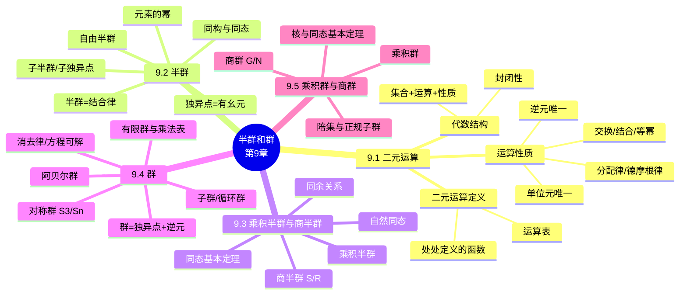

# 半群和群（Semigroups and Groups）

> **本章主线**：从"集合 + 运算"出发，按"叠加条件"的阶梯逐步构造代数结构：**二元运算**（处处定义的函数）→ 加**结合律**得 **半群** → 加**幺元**得 **独异点** → 加**逆元**得 **群**；再用三种"结构之间的关系"把它们串起来——**同态/同构**（保运算的映射）、**同余关系**（保运算的等价关系）、**商结构**（$S/R$、$G/N$，由等价类构成的新结构）。
> 一句话版本：**半群管"结合"，独异点补"幺元"，群补"逆元"；同态是"保运算的映射"，同余是"保运算的等价"，商结构是"按等价类重造的结构"**。

```mermaid
mindmap
  root((半群和群<br/>第9章))
    9.1 二元运算
      代数结构
        集合+运算+性质
        封闭性
      二元运算定义
        处处定义的函数
        运算表
      运算性质
        交换/结合/等幂
        分配律/德摩根律
        单位元唯一
        逆元唯一
    9.2 半群
      半群=结合律
      自由半群
      独异点=有幺元
      子半群/子独异点
      元素的幂
      同构与同态
    9.3 乘积半群与商半群
      乘积半群
      同余关系
      商半群 S/R
      自然同态
      同态基本定理
    9.4 群
      群=独异点+逆元
      阿贝尔群
      消去律/方程可解
      有限群与乘法表
      对称群 S3/Sn
      子群/循环群
    9.5 乘积群与商群
      乘积群
      商群 G/N
      陪集与正规子群
      核与同态基本定理
```

---

## 9.1 二元运算（Binary Operations Revisited）

### 9.1.1 代数结构：集合、运算与性质

**代数结构（algebraic structure）**是抽象代数研究的中心对象：一组对象（集合）配上定义在其上的运算以及这些运算满足的性质，共同构成一个**数学结构（mathematical structure）**或数学系统。

1. 例 1：集合族配上**并、交、补**三种运算及其性质，构成一个（离散）数学结构，记作 $[\text{sets}, \cup, \cap, \overline{\phantom{x}}]$。
2. 例 2：全体 $3 \times 3$ 矩阵配上**加法、乘法、转置**，构成数学结构 $[3\times3\ \text{matrices}, +, \times, {}^T]$。

**封闭性（closure）**：若一个结构中的运算作用于该结构任意对象后，结果仍在同一对象集合内，则称该结构对此运算**封闭**。

1. 例：$[5\times5\ \text{matrices}, +, \times, {}^T]$ 对加法封闭——两个 $5\times5$ 矩阵之和仍是 $5\times5$ 矩阵。
2. 例：$[\text{odd integers}, +, \times]$ 对加法**不封闭**（两个奇数之和是偶数）；但对乘法**封闭**（奇数乘奇数仍是奇数）。

**历史背景**：代数结构理论起始于 19 世纪初、形成于 20 世纪 30 年代。阿贝尔（N. H. Abel）解决了"构造任意次数的可用根式求解的方程"问题；伽罗瓦（E. Galois）接手其未竟事业，从**方程根的置换**入手研究方程的可解性，并于 1831 年首次提出"**群**"这一术语，把具有封闭性的置换集合称为群，创立了**群论**与**伽罗瓦群**理论——$n$ 次方程共有 $n!$ 个根的置换，其置换集合关于置换乘法构成群，方程的可解性就反映在该置换群的性质中，从而把代数方程可解性问题转化为置换群及其子群的结构分析问题。德·摩根（A. De Morgan）、布尔（G. Boole）等也做出杰出贡献；范德瓦尔登（B. L. Van Der Waerden）根据诺特（A. E. Noether）与阿廷（E. Artin）的讲稿，于 1930、1931 年出版《近世代数学》一、二卷，标志着抽象代数的成熟。

代数结构理论对现代数学（拓扑学、泛函分析等）与计算机科学（编码理论等）都有重要影响。本章介绍代数结构的一般概念与实例、基本性质，以及**群、同态、同构、同余关系**等核心概念。

### 9.1.2 二元运算的定义

**二元运算（binary operation）**：集合 $A$ 上的一个二元运算是**处处定义的函数** $f: A \times A \to A$。它必须满足两条：

1. $f$ 对 $A \times A$ 中每个有序对 $(a,b)$ 都指派一个 $A$ 中的元素 $f(a,b)$（**处处定义**）；
2. 因为二元运算是函数，每个有序对只能指派**唯一**一个 $A$ 中的元素（**单值性**）。

通常用符号 $\ast$ 代替 $f$，并把 $(a,b)$ 在 $\ast$ 下的像记作 $a \ast b$（而非 $\ast(a,b)$）。若对任意 $a, b \in A$ 都有 $a \ast b \in A$，则称 **$A$ 对运算 $\ast$ 封闭（closed）**。

**判定例（哪些"运算"不是二元运算）**：

| 载体 $A$ | 定义 | 是否二元运算 | 原因 |
|---|---|---|---|
| $\mathbb{Z}$ | $a \ast b = a + b$ | ✓ | 处处定义、结果唯一 |
| $\mathbb{R}$ | $a \ast b = a / b$ | ✗ | $3 \ast 0$ 无定义（不能除以 0） |
| $\mathbb{Z}^+$ | $a \ast b = a - b$ | ✗ | $2 \ast 5 = -3 \notin \mathbb{Z}^+$（不封闭） |
| $\mathbb{Z}$ | $a \ast b$ = 小于 $a$ 和 $b$ 的某个数 | ✗ | 不唯一：$8 \ast 6$ 可以是 5、4、3、1…… 此时 $\ast$ 是从 $A \times A$ 到 $A$ 的关系而非函数 |
| $\mathbb{Z}$ | $a \ast b = \max\{a,b\}$ | ✓ | 例如 $2 \ast 4 = 4$，$-3 \ast (-5) = -3$ |
| $\mathcal{P}(S)$ | $V \ast W = V \cup W$ | ✓ | 并仍是 $S$ 的子集 |

**要点**：

1. 同一集合上可以定义**许多不同**的二元运算（例：$\mathcal{P}(S)$ 上的 $\cup$ 与 $\cap$ 都是二元运算）。
2. 布尔矩阵集（$n\times n$ 零一矩阵）上 $A \ast B = A \lor B$ 是二元运算；格 $L$ 上 $a \ast b = a \lor b$ 也是二元运算。

**运算表（table）**：当 $A = \{a_1, a_2, \ldots, a_n\}$ 是有限集时，可用**表**定义二元运算：第 $i$ 行第 $j$ 列填 $a_i \ast a_j$。

**二元运算的个数**：若 $|A| = n$，则运算表有 $n^2$ 个格子，每格有 $n$ 种填法，由乘法原理知 $A$ 上共有 $n^{n^2}$ 个二元运算。

- 例：$A = \{a, b\}$（$n=2$）时，共 $2^{2^2} = 2^4 = 16$ 个二元运算。

> 口诀：**一个格子 $n$ 种填法，$n^2$ 个格子共 $n^{n^2}$ 种运算——运算的个数"指数爆炸"**。

### 9.1.3 运算的基本性质

设 $\ast$ 是集合 $A$ 上的二元运算，对一切 $a, b, c \in A$，可考察下列性质：

| 性质 | 定义（充要条件） | 典型例 | 反例 |
|---|---|---|---|
| **交换律（commutative）** | $a \ast b = b \ast a$ | $\mathbb{Z}$ 上的加法、格上的 $\lor$/$\land$ | 减法：$2-3 \ne 3-2$ |
| **结合律（associative）** | $(a \ast b) \ast c = a \ast (b \ast c)$ | $\mathbb{Z}$ 上的加法、集合的并 | 减法：$2-(3-5) \ne (2-3)-5$ |
| **等幂律（idempotent）** | $a \ast a = a$ | 格上的 $\lor$/$\land$ | 加法一般不满足 |

**判定要点**：

1. **运算表判交换**：二元运算交换，**当且仅当**其运算表关于主对角线**对称**。
2. **性质的含义**：运算具有某性质，指该性质对结构中的**任意**对象都成立；只要存在一个反例，运算就不具有该性质。
3. 例 15：格 $L$ 上的运算 $a \ast b = a \land b$ 交换、结合，且满足等幂律 $a \land a = a$。

**分配律（distributive）**：若结构有两个二元运算 $\square$ 与 $\triangle$，则分配律具有如下模式：

$$x \square (y \triangle z) = (x \square y) \triangle (x \square z)$$

1. 例：实数上 $a \cdot (b + c) = a \cdot b + a \cdot c$；
2. 例：集合结构 $[\text{sets}, \cup, \cap, \overline{\phantom{x}}]$ 有**两条**分配律：$A \cup (B \cap C) = (A \cup B) \cap (A \cup C)$，$A \cap (B \cup C) = (A \cap B) \cup (A \cap C)$。

**德·摩根律（De Morgan's laws）**：若结构有一个一元运算 $\ast$ 与两个二元运算 $\square$、$\triangle$，则德·摩根律为

$$(x \square y)^{\ast} = x^{\ast} \triangle y^{\ast}, \qquad (x \triangle y)^{\ast} = x^{\ast} \square y^{\ast}$$

1. 例：集合上 $\overline{A \cup B} = \overline{A} \cap \overline{B}$、$\overline{A \cap B} = \overline{A} \cup \overline{B}$ 成立；
2. 反例：$[\text{real numbers}, +, \times, \overline{\phantom{x}}]$ 不满足德·摩根律（实数的"补"没有意义）。

### 9.1.4 单位元与逆元

**单位元（identity）**：若结构中存在一个特殊对象 $e$，对集合中一切 $x$ 都有 $x \square e = e \square x = x$，则称 $e$ 是运算 $\square$ 的**单位元**（也称幺元）。

**定理 1：单位元是唯一的**。

- 证明：设 $i$ 也具有单位元性质，即 $x \square i = i \square x = x$。取 $x = e$：一方面 $e \square i = e$（$i$ 是单位元）；另一方面 $e \square i = i$（$e$ 是单位元）。故 $i = e$，至多存在一个单位元。
- 例 10：$n\times n$ 矩阵结构中，$I_n$ 是矩阵乘法的单位元，$n\times n$ **零矩阵**是矩阵加法的单位元。

**逆元（inverse）**：若二元运算 $\square$ 有单位元 $e$，且 $x \square y = y \square x = e$，则称 $y$ 是 $x$ 的 $\square$-**逆元**。

**定理 2：若 $\square$ 满足结合律且 $x$ 有 $\square$-逆元 $y$，则 $y$ 唯一**。

- 证明：设 $z$ 也是 $x$ 的逆元，则 $(z \square x) \square y = e \square y = y$，而 $z \square (x \square y) = z \square e = z$。由结合律 $(z \square x) \square y = z \square (x \square y)$，故 $y = z$。
- 例 11：$3\times3$ 矩阵结构中，矩阵 $A = [a_{ij}]$ 的加法逆元是 $-A = [-a_{ij}]$；整数结构 $[\mathbb{Z}, +, \times]$ 中只有 $1$ 与 $-1$ 有乘法逆元。

### 9.1.5 从运算构造偏序：例 16 详解

**例 16**：设 $\ast$ 是集合 $A$ 上的二元运算，满足对任意 $a, b, c \in A$：

1. **等幂律**：$a = a \ast a$；
2. **交换律**：$a \ast b = b \ast a$；
3. **结合律**：$a \ast (b \ast c) = (a \ast b) \ast c$。

在 $A$ 上定义关系 $\preceq$：$a \preceq b$ 当且仅当 $a = a \ast b$。证明 $(A, \preceq)$ 是偏序集，且对一切 $a, b \in A$ 有 $\operatorname{GLB}(a, b) = a \ast b$。

**第 1 步：证明 $\preceq$ 是偏序（自反、反对称、传递）**：

1. **自反**：由等幂律，$a = a \ast a$，故 $a \preceq a$ 对一切 $a \in A$ 成立。
2. **反对称**：设 $a \preceq b$ 且 $b \preceq a$，则 $a = a \ast b$ 且 $b = b \ast a$。由交换律 $a = a \ast b = b \ast a = b$，故 $a = b$。
3. **传递**：设 $a \preceq b$ 且 $b \preceq c$，则 $a = a \ast b$、$b = b \ast c$。于是
   $$a = a \ast b = a \ast (b \ast c) = (a \ast b) \ast c = a \ast c$$
   故 $a \preceq c$。

**第 2 步：证明 $a \ast b$ 是 $\{a, b\}$ 的下界**：

1. $a \ast b = a \ast (b \ast b) = (a \ast b) \ast b$，故 $a \ast b \preceq b$；
2. 同理 $a \ast b = b \ast a = b \ast (a \ast a) = (b \ast a) \ast a$，故 $a \ast b \preceq a$；
3. 因此 $a \ast b$ 是 $a$ 与 $b$ 的一个下界。

**第 3 步：证明 $a \ast b$ 是最大下界（GLB）**：设 $c \preceq a$ 且 $c \preceq b$，则 $c = c \ast a$、$c = c \ast b$。于是

$$c = (c \ast a) \ast b = c \ast (a \ast b)$$

故 $c \preceq a \ast b$。任何下界都不超过 $a \ast b$，所以 $a \ast b = \operatorname{GLB}(a, b)$。

> 该例演示的核心思想：**满足等幂、交换、结合的运算自动在集合上诱导出一个偏序，且该运算恰好是"取最大下界"**——这正是格中 meet（交）运算的原型，也是 9.1 与偏序章节之间的桥梁。

---

## 9.2 半群（Semigroups）

### 9.2.1 半群的定义与实例

**半群（semigroup）**：**非空集合 $S$ 连同定义在 $S$ 上的一个结合二元运算 $\ast$** 称为一个**半群**，记作 $(S, \ast)$（或简记为 $S$）。其中 $a \ast b$ 称为 $a$ 与 $b$ 的**积**。若 $\ast$ 还满足交换律，则 $(S, \ast)$ 称为**交换半群（commutative semigroup）**。

1. 例：$(\mathbb{Z}, +)$ 是交换半群。
2. 例：$\mathcal{P}(S)$（$S$ 的幂集）配上并运算构成交换半群。
3. 反例：$\mathbb{Z}$ 配**减法**不是半群——减法不满足结合律。

**自由半群（free semigroup）**：设 $A = \{a_1, a_2, \ldots, a_n\}$ 是非空集合，$A^{\ast}$ 表示 $A$ 中元素的一切**有限序列**的集合；对 $\alpha = a_1 a_2 \cdots a_n$、$\beta = b_1 b_2 \cdots b_k$，定义**连接（catenation）**运算：

$$\alpha \cdot \beta = a_1 a_2 \cdots a_n b_1 b_2 \cdots b_k$$

连接运算是结合的（对任意 $\alpha, \beta, \gamma \in A^{\ast}$ 有 $\alpha \cdot (\beta \cdot \gamma) = (\alpha \cdot \beta) \cdot \gamma$），故 $(A^{\ast}, \cdot)$ 是半群，称为**由 $A$ 生成的自由半群**。

### 9.2.2 广义结合律

**定理 1（广义结合律）**：若 $a_1, a_2, \ldots, a_n$（$n \ge 3$）是半群中的任意元素，则对它们**以任意方式插入括号**形成的所有乘积都相等。

1. 例如 $((a_1 \ast a_2) \ast a_3) \ast a_4$、$a_1 \ast (a_2 \ast (a_3 \ast a_4))$、$(a_1 \ast (a_2 \ast a_3)) \ast a_4$ 三者相等。
2. 因此半群中的乘积可以**不加括号**地写为 $a_1 \ast a_2 \ast \cdots \ast a_n$——这是结合律带给记号的最大便利。

### 9.2.3 幺元与独异点（Monoid）

**幺元（identity）**：半群 $(S, \ast)$ 中的元素 $e$ 称为**幺元**（单位元），若对一切 $a \in S$ 有 $e \ast a = a \ast e = a$。**幺元若存在则唯一**（由 9.1 定理 1）。

1. 例：$0$ 是 $(\mathbb{Z}, +)$ 的幺元；
2. 例：$(\mathbb{Z}^+, +)$ **没有**幺元（不存在正整数 $e$ 使 $e + a = a$）。

**独异点（monoid，含幺半群）**：**有幺元的半群**称为**独异点**。

- 例 10：半群 $\mathcal{P}(S)$（并运算）的幺元是 $\varnothing$：$\varnothing \cup A = A = A \cup \varnothing$ 对一切 $A \in \mathcal{P}(S)$ 成立，故 $\mathcal{P}(S)$ 是独异点。

### 9.2.4 子半群与子独异点

**子半群（subsemigroup）**：设 $(S, \ast)$ 是半群，$T$ 是 $S$ 的子集。若 $T$ 对运算 $\ast$ **封闭**，则 $(T, \ast)$ 称为 $(S, \ast)$ 的**子半群**。

**子独异点（submonoid）**：设 $(S, \ast)$ 是幺元为 $e$ 的独异点，$T$ 是 $S$ 的**非空**子集。若 $T$ 对 $\ast$ 封闭且 $e \in T$，则 $(T, \ast)$ 称为 $(S, \ast)$ 的**子独异点**。

**要点与实例**：

1. 结合律在半群的任何子集中都成立，故子半群 $(T, \ast)$ 本身也是半群；同理，子独异点本身也是独异点。
2. 例：设 $T$ 是全体偶数的集合，则 $(T, \times)$ 是独异点 $(\mathbb{Z}, \times)$ 的子半群，但**不是**子独异点——$\mathbb{Z}$ 的乘法幺元 $1 \notin T$。
3. 任一半群 $S$ 是自身的子半群；任一独异点 $S$ 是自身的子独异点；$T = \{e\}$（仅含幺元的子集）也是子独异点。

> 口诀：**子半群只看"封闭"，子独异点还要"幺元在内"**——差就差在 $e$ 是否被包含。

### 9.2.5 元素的幂

设 $(S, \ast)$ 是半群，$a \in S$，$n \in \mathbb{Z}^+$。递归定义 $a$ 的幂：

$$a^1 = a, \qquad a^n = a^{n-1} \ast a \quad (n \ge 2)$$

若 $(S, \ast)$ 是独异点（幺元 $e$），则补充定义 $a^0 = e$。对非负整数 $m, n$ 有：

$$a^m \ast a^n = a^{m+n}$$

**例 16（由 $a$ 生成的子半群/子独异点）**：

1. 若 $(S, \ast)$ 是半群，$a \in S$，则 $T = \{a^i \mid i \in \mathbb{Z}^+\}$ 是 $(S, \ast)$ 的子半群；
2. 若 $(S, \ast)$ 是独异点，则 $T = \{a^i \mid i \in \mathbb{Z}^+ \text{ 或 } i = 0\}$ 是子独异点。
3. 这样的 $T$ 称为**由 $a$ 生成的**（子半群/子独异点）——它正是后续"循环群"概念的来源。

### 9.2.6 同构与同态

#### 同构映射（Isomorphism）

**同构映射**：设 $(S, \ast)$ 与 $(T, \ast')$ 是两个半群，函数 $f: S \to T$ 称为从 $(S, \ast)$ 到 $(T, \ast')$ 的**同构**，若 $f$ 是 $S$ 到 $T$ 的**一一对应**（双射），且对一切 $a, b \in S$ 有：

$$f(a \ast b) = f(a) \ast' f(b)$$

若存在这样的同构，则称 $(S, \ast)$ 与 $(T, \ast')$ **同构**，记作 $S \cong T$。

1. 若 $f$ 是同构，则 $f^{-1}$ 存在且是 $T$ 到 $S$ 的一一对应；**$f^{-1}$ 也是同构**。
2. **判定同构的四步法**：
    - 第 1 步：定义函数 $f: S \to T$，且定义域 $\operatorname{Dom}(f) = S$；
    - 第 2 步：证明 $f$ 是**单射**（one-to-one）；
    - 第 3 步：证明 $f$ 是**满射**（onto）；
    - 第 4 步：证明 $f(a \ast b) = f(a) \ast' f(b)$（**保持运算**）。

**例 17（$(\mathbb{Z}, +)$ 与偶数加法半群同构）**：设 $T$ 是全体偶数的集合，证明 $(\mathbb{Z}, +)$ 与 $(T, +)$ 同构。

1. **定义**：取 $f: \mathbb{Z} \to T$，$f(a) = 2a$。
2. **单射**：设 $f(a_1) = f(a_2)$，则 $2a_1 = 2a_2$，故 $a_1 = a_2$。
3. **满射**：对任意偶数 $b$，取 $a = b/2 \in \mathbb{Z}$，则 $f(a) = f(b/2) = 2(b/2) = b$。
4. **保运算**：$f(a+b) = 2(a+b) = 2a + 2b = f(a) + f(b)$。

故 $(\mathbb{Z}, +) \cong (T, +)$。Q.E.D.

> 该例演示的核心技巧：**同构常取"伸缩映射"（乘以非零常数）**——它保持加法结构，只是把"刻度"放大了一倍。

**例 18（运算表重排判同构）**：设 $S = \{a, b, c\}$、$T = \{x, y, z\}$，映射 $f(a) = y$、$f(b) = x$、$f(c) = z$。把 $S$ 的运算表中元素替换为它们的像并重新排列表格，恰好得到 $T$ 的运算表，故 $S$ 与 $T$ 同构。

**要点**：有限半群是否同构，可通过比较"重排后的运算表是否一致"来判断——**同构 = 换个名字看，结构完全一样**。

**定理 2（同构保幺元）**：设 $(S, \ast)$ 与 $(T, \ast')$ 是幺元分别为 $e$、$e'$ 的独异点，$f: S \to T$ 是同构，则 $f(e) = e'$。

- 证明：对任意 $b \in T$，由 $f$ 满射，存在 $a \in S$ 使 $f(a) = b$。由 $a = a \ast e$ 得 $b = f(a) = f(a \ast e) = f(a) \ast' f(e) = b \ast' f(e)$；同理 $b = f(e) \ast' b$。故 $f(e)$ 是 $T$ 的幺元，由幺元唯一性 $f(e) = e'$。Q.E.D.
- **推论**：若 $(S, \ast)$ 有幺元而 $(T, \ast')$ 没有，则二者**不可能同构**。
    - 例 19：设 $T$ 是全体偶数的集合、$\ast$ 是普通乘法，则 $(\mathbb{Z}, \times)$ 与 $(T, \times)$ **不同构**——$\mathbb{Z}$ 有乘法幺元 $1$，而 $T$ 中没有（偶数集里不存在乘法幺元）。

#### 同态映射（Homomorphism）

**同态映射**：设 $(S, \ast)$ 与 $(T, \ast')$ 是两个半群，**处处定义的函数** $f: S \to T$ 称为**同态**，若对一切 $a, b \in S$ 有：

$$f(a \ast b) = f(a) \ast' f(b)$$

若 $f$ 还是**满射**，则称 $T$ 是 $S$ 的**同态像（homomorphic image）**。

**同态与同构的区别**：同构要求双射（单射 + 满射），同态只要求保运算；同态若加上双射即为同构。**同构 = 双射的同态**。

**例 20（奇偶性同态）**：设 $A = \{0, 1\}$，$(A^{\ast}, \cdot)$ 是连接运算下的自由半群，$(A, +)$ 中 $+$ 按 $0+0=0$、$0+1=1$、$1+0=1$、$1+1=0$ 定义。定义 $f: A^{\ast} \to A$：

$$f(\alpha) = \begin{cases} 1 & \text{若 } \alpha \text{ 含有奇数个 } 1 \\ 0 & \text{若 } \alpha \text{ 含有偶数个 } 1 \end{cases}$$

则对任意 $\alpha, \beta \in A^{\ast}$ 有 $f(\alpha \cdot \beta) = f(\alpha) + f(\beta)$（"奇数个 1 与奇数个 1 相接 = 偶数个 1"，即模 2 加法），故 $f$ 是同态。

**通用观察**：无论同构还是同态，**"像的积 = 积的像"**（$f(a \ast b) = f(a) \ast' f(b)$）——这就是"保持运算"的确切含义。

**定理 3（满同态保幺元）**：设 $(S, \ast)$、$(T, \ast')$ 是幺元分别为 $e$、$e'$ 的独异点，$f: S \to T$ 是**满**同态，则 $f(e) = e'$（证明与定理 2 类似）。

**定理 4（子半群的同态像是子半群）**：设 $f$ 是半群 $(S, \ast)$ 到半群 $(T, \ast')$ 的同态，$S'$ 是 $(S, \ast)$ 的子半群，则 $f(S') = \{t \in T \mid t = f(s) \text{ 对某个 } s \in S'\}$ 是 $(T, \ast')$ 的子半群。

- 证明：任取 $t_1, t_2 \in f(S')$，存在 $s_1, s_2 \in S'$ 使 $t_1 = f(s_1)$、$t_2 = f(s_2)$。则 $t_1 \ast' t_2 = f(s_1) \ast' f(s_2) = f(s_1 \ast s_2) \in f(S')$（因 $S'$ 封闭），故 $f(S')$ 对 $\ast'$ 封闭；结合律在 $T$ 中成立，故在 $f(S')$ 中亦成立。Q.E.D.

**定理 5（交换性在同态像下保持）**：若 $f$ 是从**交换半群** $(S, \ast)$ 到半群 $(T, \ast')$ 的满同态，则 $(T, \ast')$ 也是交换半群。

- 证明：任取 $t_1, t_2 \in T$，存在 $s_1, s_2 \in S$ 使 $t_1 = f(s_1)$、$t_2 = f(s_2)$，则 $t_1 \ast' t_2 = f(s_1) \ast' f(s_2) = f(s_1 \ast s_2) = f(s_2 \ast s_1) = f(s_2) \ast' f(s_1) = t_2 \ast' t_1$。Q.E.D.

---

## 9.3 乘积半群与商半群（Products and Quotients of Semigroups）

### 9.3.1 乘积半群

**定理 1（乘积半群）**：若 $(S, \ast)$ 与 $(T, \ast')$ 是半群，则 $S \times T$ 配运算 $\ast''$（**逐分量运算**）是半群：

$$(s_1, t_1) \ast'' (s_2, t_2) = (s_1 \ast s_2,\ t_1 \ast' t_2)$$

- 若 $S$、$T$ 还是幺元分别为 $e_S$、$e_T$ 的独异点，则 $S \times T$ 是以 $(e_S, e_T)$ 为幺元的独异点。

**要点**：乘积结构的运算"各分量各算各的"，封闭、结合、幺元都在两个分量上分别继承——**结构的乘积 = 逐分量地继承运算与性质**。

### 9.3.2 同余关系（Congruence Relation）

**同余关系**：半群 $(S, \ast)$ 上的等价关系 $R$ 称为**同余关系**，若对任意 $a, a', b, b' \in S$：

$$a\,R\,a' \ \text{且}\ b\,R\,b' \implies (a \ast b)\,R\,(a' \ast b')$$

直观地说：**同余关系 = 与运算"相容"的等价关系**——"等价类之间的运算结果不依赖于代表元的选取"。

**例 1（模 2 同余是同余关系）**：考虑半群 $(\mathbb{Z}, +)$ 与等价关系 $a\,R\,b \iff a \equiv b \pmod 2$。

1. $R$ 是等价关系（自反、对称、传递，略）。
2. 验证同余性：设 $a \equiv b \pmod 2$ 且 $c \equiv d \pmod 2$，则 $2 \mid (a-b)$、$2 \mid (c-d)$，即存在整数 $m, n$ 使 $a - b = 2m$、$c - d = 2n$。
3. 相加得 $(a+c) - (b+d) = 2(m+n)$，故 $a + c \equiv b + d \pmod 2$，即 $(a+c)\,R\,(b+d)$。

故模 2 同余是 $(\mathbb{Z}, +)$ 上的同余关系。

**例 3（等价未必同余——易错警示）**：考虑半群 $(\mathbb{Z}, +)$ 与函数 $f(x) = x^2 - x - 2$，定义 $a\,R\,b \iff f(a) = f(b)$。$R$ 是等价关系（由"函数值相等"诱导），但**不是**同余关系：

1. $f(-1) = f(2) = 0$，故 $-1\,R\,2$；
2. $f(-2) = f(3) = 4$，故 $-2\,R\,3$；
3. 但 $f(-1 + (-2)) = f(-3) = 10$，而 $f(2 + 3) = f(5) = 18$，$10 \ne 18$，故 $(-1 + (-2))$ **不** $R$ $(2 + 3)$。

> 该例演示的易错点：**"同值关系"天然是等价关系，但往往与运算不相容**；检验同余关系必须额外验证"保运算"，光验证等价性是不够的。

### 9.3.3 商半群（Quotient Semigroup）

回顾：半群 $(S, \ast)$ 上的等价关系 $R$ 确定 $S$ 的一个**划分**。记 $[a] = R(a)$ 为含 $a$ 的等价类，$S/R$ 为一切等价类的集合。

**定理 2（商半群）**：设 $R$ 是半群 $(S, \ast)$ 上的同余关系，在 $S/R$ 上定义运算 $\odot$：

$$[a] \odot [b] = [a \ast b]$$

则 $\odot$ 是 $S/R$ 上的二元运算，且 $(S/R, \odot)$ 是半群，称为**商半群**（或因子半群）。

**证明**（分两步）：

1. **$\odot$ 是良定的（二元运算）**：设 $([a], [b]) = ([a'], [b'])$，则 $a\,R\,a'$、$b\,R\,b'$。由 $R$ 是同余关系，$a \ast b\,R\,a' \ast b'$，故 $[a \ast b] = [a' \ast b']$——运算结果不依赖代表元的选择。
2. **$\odot$ 结合**：$[a] \odot ([b] \odot [c]) = [a] \odot [b \ast c] = [a \ast (b \ast c)] = [(a \ast b) \ast c] = [a \ast b] \odot [c] = ([a] \odot [b]) \odot [c]$。

**推论（商独异点）**：若 $R$ 是独异点 $(S, \ast)$ 上的同余关系，则 $(S/R, \odot)$ 是独异点，$[e]$ 是幺元（其中 $e$ 是 $S$ 的幺元）。

**例 5（模 $n$ 剩余类 $Z_n$）**：$(\mathbb{Z}, +)$ 上定义 $a\,R\,b \iff a \equiv b \pmod n$。模 4 时各等价类为：

- $[0] = \{\ldots, -8, -4, 0, 4, 8, 12, \ldots\} = [4] = [8] = \cdots$
- $[1] = \{\ldots, -7, -3, 1, 5, 9, 13, \ldots\} = [5] = [9] = \cdots$
- $[2] = \{\ldots, -6, -2, 2, 6, 10, 14, \ldots\} = [6] = [10] = \cdots$
- $[3] = \{\ldots, -5, -1, 3, 7, 11, 15, \ldots\} = [7] = [11] = \cdots$

于是 $\mathbb{Z}/{\equiv} \pmod 4$（记作 $Z_4$）是以 $[0]$ 为幺元、运算 $[a] \ast [b] = [a+b]$ 的独异点。

### 9.3.4 自然同态与同态基本定理

**定理 3（自然同态）**：设 $R$ 是半群 $(S, \ast)$ 上的同余关系，$(S/R, \odot)$ 是对应的商半群，则函数

$$f_R: S \to S/R, \qquad f_R(a) = [a]$$

是**满同态**，称为**自然同态**。

- 证明：满射——任意 $[a] \in S/R$，$f_R(a) = [a]$；保运算——$f_R(a \ast b) = [a \ast b] = [a] \odot [b] = f_R(a) \odot f_R(b)$。Q.E.D.

**同态基本定理（Fundamental Homomorphism Theorem）**：设 $f: S \to T$ 是半群 $(S, \ast)$ 到半群 $(T, \ast')$ 的**满同态**，在 $S$ 上定义关系 $R$：

$$a\,R\,b \iff f(a) = f(b) \quad (a, b \in S)$$

则：

1. **$R$ 是同余关系**；
2. **$(T, \ast')$ 与商半群 $(S/R, \odot)$ 同构**。

**证明**（分四步）：

1. **$R$ 是等价关系**：自反（$f(a) = f(a)$）；对称（$f(a) = f(b) \Rightarrow f(b) = f(a)$）；传递（$f(a) = f(b)$ 且 $f(b) = f(c) \Rightarrow f(a) = f(c)$）。
2. **$R$ 是同余关系**：设 $a\,R\,a_1$、$b\,R\,b_1$，则 $f(a) = f(a_1)$、$f(b) = f(b_1)$。因 $f$ 是同态，$f(a \ast b) = f(a) \ast' f(b) = f(a_1) \ast' f(b_1) = f(a_1 \ast b_1)$，故 $(a \ast b)\,R\,(a_1 \ast b_1)$。
3. **构造 $\bar{f}: S/R \to T$，$\bar{f}([a]) = f(a)$**：
    - **良定（是函数）**：$[a] = [a'] \Rightarrow a\,R\,a' \Rightarrow f(a) = f(a')$；
    - **单射**：$\bar{f}([a]) = \bar{f}([a']) \Rightarrow f(a) = f(a') \Rightarrow a\,R\,a' \Rightarrow [a] = [a']$；
    - **满射**：任意 $b \in T$，由 $f$ 满射存在 $a \in S$ 使 $f(a) = b$，故 $\bar{f}([a]) = b$。
4. **$\bar{f}$ 保运算（是同构）**：$\bar{f}([a] \odot [b]) = \bar{f}([a \ast b]) = f(a \ast b) = f(a) \ast' f(b) = \bar{f}([a]) \ast' \bar{f}([b])$。Q.E.D.

**形象理解**：满同态 $f$ 把 $S$ 中"落到同一像"的元素粘成一个等价类；$S$ 被划分成若干"纤维"，商半群 $S/R$ 把每条纤维缩成一个点，得到的结构恰好与 $T$ 同构。课件用一个生活化的比喻：把人群按"同宿舍"分类，"同宿舍关系"就是同余关系，自然同态把每个人映射到其宿舍，商结构把每个宿舍当作一个整体——**掰手腕（arm wrestling）排名、按宿舍聚合，都是商结构的实例**。

**例 6（自由半群模去"1 的个数"）**：设 $A = \{0, 1\}$，$(\mathbb{N}, +)$ 是自然数加法半群。定义 $f: A^{\ast} \to \mathbb{N}$：

$$f(\alpha) = \alpha \text{ 中 } 1 \text{ 的个数}$$

$f$ 是满同态（$f(\alpha \cdot \beta) = f(\alpha) + f(\beta)$）。取 $R$：$\alpha\,R\,\beta \iff f(\alpha) = f(\beta)$。由同态基本定理，**$A^{\ast}/R \cong \mathbb{N}$**，其中自然同态为 $f_R(\alpha) = [\alpha]$，同构映射为 $\bar{f}([\alpha]) = f(\alpha)$。

---

## 9.4 群（Groups）

### 9.4.1 群的定义与阿贝尔群

**群（group）**：**群 $(G, \ast)$ 是带幺元 $e$ 的独异点，且每个元素都有逆元**——即 $G$ 配二元运算 $\ast$，满足以下三条公理（对任意 $a, b, c \in G$）：

1. **结合律**：$(a \ast b) \ast c = a \ast (b \ast c)$；
2. **幺元**：存在**唯一**元素 $e \in G$，使 $a \ast e = e \ast a = a$；
3. **逆元**：每个 $a \in G$ 都存在逆元 $a^{-1} \in G$，使 $a \ast a^{-1} = a^{-1} \ast a = e$（写作 $aa^{-1} = a^{-1}a = e$）。

等价的中文表述（四条件）：设 $\ast$ 是 $G$ 上的二元运算，若 1) **封闭**；2) **结合**；3) 存在**幺元**；4) 对任一元素存在**逆元**，则 $(G, \ast)$ 是群。

**阿贝尔群（Abelian group）**：若群 $G$ 中任意 $a, b$ 都满足 $ab = ba$（运算交换），则称 $G$ 为**阿贝尔群**（交换群）。

1. 例：$(\mathbb{Q}, +)$ 是群（且是阿贝尔群）；
2. 反例：$(\mathbb{Z}^+, +)$ **不是**群——正整数没有加法逆元。

**例 4（非零实数配 $a \ast b = ab/2$ 是阿贝尔群）**：设 $G$ 是全体非零实数的集合，定义 $a \ast b = ab/2$，证明 $(G, \ast)$ 是阿贝尔群。

1. **二元运算（封闭）**：若 $a, b \in G$，则 $ab/2$ 是非零实数，仍在 $G$ 中。
2. **结合律**：$(a \ast b) \ast c = (ab/2) \ast c = (ab)c/4$，$a \ast (b \ast c) = a \ast (bc/2) = a(bc)/4 = (ab)c/4$，二者相等。
3. **幺元是 $2$**：$a \ast 2 = (a)(2)/2 = a = (2)(a)/2 = 2 \ast a$。
4. **逆元是 $4/a$**：$a \ast (4/a) = a(4/a)/2 = 2 = (4/a)(a)/2 = (4/a) \ast a$。
5. **交换律**：$a \ast b = ab/2 = ba/2 = b \ast a$。

故 $(G, \ast)$ 是阿贝尔群。

> 该例演示的核心技巧：**运算可以"伪装"成乘法**——把普通乘法除以 $2$ 后，幺元变成 $2$、逆元变成 $4/a$；验证群的四条公理要逐条进行，尤其要警惕"幺元不一定是 0 或 1"。

**例（补充说明：有理数配 $a \ast b = a + b - ab$）**：设 $\ast$ 是 $\mathbb{Q}$ 上的运算 $a \ast b = a + b - ab$（由课件中封闭性检验式 $a + b - a \ast b \in \mathbb{Q}$ 还原）。讨论 $(\mathbb{Q}, \ast)$ 是否是群、是否有零元。

1. **封闭**：对任意 $a, b \in \mathbb{Q}$，$a + b - ab \in \mathbb{Q}$。
2. **结合与交换**：由表达式的对称性可直接验证 $a \ast (b \ast c) = (a \ast b) \ast c$ 且 $a \ast b = b \ast a$。
3. **幺元是 $0$**：$a \ast 0 = a + 0 - a \cdot 0 = a = 0 \ast a$。
4. **逆元**：解方程 $a \ast b = 0$：$a + b - ab = 0 \Rightarrow b(1-a) = -a \Rightarrow b = \dfrac{a}{a-1}$（当 $a \ne 1$ 时）。元素 $1$ **无逆元**（$1 \ast b = 1 + b - b = 1$ 恒成立，永不为幺元 $0$）。
5. **结论**：$(\mathbb{Q}, \ast)$ **不是群**（$1$ 无逆元），但存在**零元 $1$**（$a \ast 1 = a + 1 - a = 1$ 对一切 $a$ 成立，$1$ 吸收所有元素）。

> 该例演示的核心技巧：**"有幺元、有零元"不等于"是群"**——零元（吸收元）恰恰是唯一没有逆元的元素；判断"是群"必须逐一验证每个元素的逆元存在性。

### 9.4.2 群的基本性质

**定理 1（逆元唯一）**：群 $G$ 中每个元素 $a$ 在 $G$ 中**只有一个逆元**。

- 证明：设 $a'$、$a''$ 都是 $a$ 的逆元，则 $a' = a'e = a'(aa'') = (a'a)a'' = ea'' = a''$。Q.E.D.

**定理 2（消去律）**：设 $G$ 是群，$a, b, c \in G$，则：

- **左消去律**：$ab = ac \implies b = c$；
- **右消去律**：$ba = ca \implies b = c$。

- 证明（左消去）：$ab = ac$ 两边左乘 $a^{-1}$：$a^{-1}(ab) = a^{-1}(ac)$，由结合律 $(a^{-1}a)b = (a^{-1}a)c$，即 $eb = ec$，故 $b = c$。右消去律证明类似。Q.E.D.

**定理 3（逆元的两条运算律）**：设 $G$ 是群，$a, b \in G$，则：

1. $(a^{-1})^{-1} = a$——逆元的逆元是自身；
2. $(ab)^{-1} = b^{-1}a^{-1}$——**积的逆元 = 逆元的逆序积**（注意顺序反转！）。

- 证明 1：由 $a^{-1}a = aa^{-1} = e$ 及逆元唯一性（定理 1），$(a^{-1})^{-1} = a$。
- 证明 2：$(ab)(b^{-1}a^{-1}) = a(b(b^{-1}a^{-1})) = a((bb^{-1})a^{-1}) = a(ea^{-1}) = aa^{-1} = e$；同理 $(b^{-1}a^{-1})(ab) = e$。由逆元唯一性，$(ab)^{-1} = b^{-1}a^{-1}$。Q.E.D.

**定理 4（方程可解性）**：设 $G$ 是群，$a, b \in G$，则方程 $ax = b$ 与 $ya = b$ 在 $G$ 中都有**唯一解**（分别为 $x = a^{-1}b$、$y = ba^{-1}$）。

- 通俗理解：**群中"可以除以任何元素"**——逆元保证解存在，消去律保证解唯一。

### 9.4.3 有限群、乘法表与小阶群的分类

**有限群（finite group）**：若群 $G$ 只含有限个元素，则称 $G$ 为**有限群**，元素个数 $|G|$ 称为 $G$ 的**阶（order）**。有限群可以用**乘法表**表示。

**小阶群的分类（乘法表的强制填法）**：

| 阶 | 不同构的群 | 说明 |
|---|---|---|
| 1 | 唯一：$\{e\}$，$ee = e$ | 平凡群 |
| 2 | 唯一：$\{e, a\}$，$a^2 = e$ | $a$ 的逆元只能是 $a$ 自身（逆元不能是 $e$，因为 $ae = a \ne e$） |
| 3 | 唯一：$\{e, a, b\}$ | 由逆元存在性可唯一填表，同构于 $Z_3$ |
| 4 | 恰有两个：**克莱因四元群 $V$** 与**循环群 $Z_4$** | $V$ 中每个元素满足 $x^2 = e$；$Z_4$ 由某元素 $a$ 的幂生成 |

**例 5（$\{0,1\}$ 上的模 2 加法群）**：设 $B = \{0, 1\}$，$+$ 定义如下：

| $+$ | 0 | 1 |
|---|---|---|
| 0 | 0 | 1 |
| 1 | 1 | 0 |

则 $B$ 是群：封闭、结合（模 2 加法）、幺元 $0$、每个元素以自身为逆元（$0+0=0$、$1+1=0$）。

### 9.4.4 对称群与置换群：S₃ 与 Sₙ

**等边三角形的对称群 $S_3$**：给定顶点为 1、2、3 的等边三角形，考虑它的对称变换。

1. **三个旋转**（绕中心 $O$ 逆时针旋转 $120^\circ$、$240^\circ$、$360^\circ$ 即 $0^\circ$）：记作 $f_1, f_2, f_3$，可写成置换：
   $$f_1 = \begin{pmatrix} 1 & 2 & 3 \\ 1 & 2 & 3 \end{pmatrix},\quad f_2 = \begin{pmatrix} 1 & 2 & 3 \\ 2 & 3 & 1 \end{pmatrix},\quad f_3 = \begin{pmatrix} 1 & 2 & 3 \\ 3 & 1 & 2 \end{pmatrix}$$
2. **三个反射**（关于对称轴 $l_1, l_2, l_3$）：记作 $g_1, g_2, g_3$：
   $$g_1 = \begin{pmatrix} 1 & 2 & 3 \\ 1 & 3 & 2 \end{pmatrix},\quad g_2 = \begin{pmatrix} 1 & 2 & 3 \\ 3 & 2 & 1 \end{pmatrix},\quad g_3 = \begin{pmatrix} 1 & 2 & 3 \\ 2 & 1 & 3 \end{pmatrix}$$
3. 设 $S_3 = \{f_1, f_2, f_3, g_1, g_2, g_3\}$，引入运算 $\ast$（复合，先做后一个变换、再做前一个），乘法表如下：

| $\ast$ | $f_1$ | $f_2$ | $f_3$ | $g_1$ | $g_2$ | $g_3$ |
|---|---|---|---|---|---|---|
| $f_1$ | $f_1$ | $f_2$ | $f_3$ | $g_1$ | $g_2$ | $g_3$ |
| $f_2$ | $f_2$ | $f_3$ | $f_1$ | $g_3$ | $g_1$ | $g_2$ |
| $f_3$ | $f_3$ | $f_1$ | $f_2$ | $g_2$ | $g_3$ | $g_1$ |
| $g_1$ | $g_1$ | $g_2$ | $g_3$ | $f_1$ | $f_2$ | $f_3$ |
| $g_2$ | $g_2$ | $g_3$ | $g_1$ | $f_3$ | $f_1$ | $f_2$ |
| $g_3$ | $g_3$ | $g_1$ | $g_2$ | $f_2$ | $f_3$ | $f_1$ |

4. **例（计算 $f_2 \ast g_2$）**：
    - **几何法**：先关于 $l_2$ 反射、再旋转 $120^\circ$，几何上等价于关于 $l_1$ 反射，即 $f_2 \ast g_2 = g_1$。
    - **代数法（置换复合）**：$f_2 \circ g_2 = \begin{pmatrix} 1 & 2 & 3 \\ 2 & 3 & 1 \end{pmatrix} \circ \begin{pmatrix} 1 & 2 & 3 \\ 3 & 2 & 1 \end{pmatrix} = \begin{pmatrix} 1 & 2 & 3 \\ 1 & 3 & 2 \end{pmatrix} = g_1$。
    - 两种方法结果一致，且与乘法表第 $f_2$ 行第 $g_2$ 列相符。

**例 7（$n$ 次对称群）**：$n$ 个元素的一切**置换**在复合运算下构成 **$n!$ 阶群**，称为 **$n$ 次对称群 $S_n$**；由部分置换（$S_n$ 的子集）构成的群称为**置换群（permutation group）**。

> 口诀：**对称群 $S_n$ 管"一切置换"，阶是 $n!$；置换群只是其中的子群**。

### 9.4.5 子群

**子群（subgroup）**：设 $H$ 是群 $G$ 的子集，若满足：

1. $G$ 的幺元 $e \in H$；
2. **封闭**：若 $a, b \in H$，则 $ab \in H$；
3. **逆元**：若 $a \in H$，则 $a^{-1} \in H$。

则称 $H$ 是 $G$ 的**子群**。

**要点与实例**：

1. 对任意群 $G$，$G$ 自身与 $H = \{e\}$ 都是 $G$ 的子群，称为**平凡子群（trivial subgroups）**。
2. 例：$S_3$ 中 $H = \{f_1, f_2, f_3\}$（三个旋转）是子群——旋转复合旋转仍是旋转，且 $f_1$ 是幺元、每个旋转的逆仍是旋转。
3. 例 11：$S_n$ 中一切**偶置换**的集合 $A_n$ 是子群，称为 **$n$ 次交错群（alternating group）**（也叫 $n$ 次变换群）。
4. 判定要点：与子半群相比，子群的判定多了一条"**逆元封闭**"；与子独异点相比，还要保证"幺元在内"。

> 口诀：**子群三件套：幺元在、乘积在、逆元在**——三者缺一不可。

### 9.4.6 群的同态与同构

群的同态/同构定义与半群完全相同（保运算的映射），但群结构保证更多性质。

**例 13（$(\mathbb{R}, +)$ 与 $(\mathbb{R}^+, \times)$ 同构）**：设 $(G, \ast) = (\mathbb{R}, +)$，$(G', \ast') = (\mathbb{R}^+, \times)$，定义 $f(x) = e^x$。

1. 保运算：$f(x + y) = e^{x+y} = e^x \cdot e^y = f(x) \cdot f(y)$；
2. 双射：$f$ 有逆函数 $\ln$，故是一一对应。

故 $f$ 是同构，$(\mathbb{R}, +) \cong (\mathbb{R}^+, \times)$。**加法群与乘法群通过指数/对数相互转化**——这是"同构 = 换个视角结构相同"的典型例子。

**定理 5（群同态的三个性质）**：设 $f: G \to G'$ 是群 $G$ 到群 $G'$ 的同态，$e$、$e'$ 分别为 $G$、$G'$ 的幺元，则：

1. $f(e) = e'$（**幺元映到幺元**）；
2. 若 $a \in G$，则 $f(a^{-1}) = (f(a))^{-1}$（**逆元映到逆元**）；
3. 若 $H$ 是 $G$ 的子群，则 $f(H) = \{f(h) \mid h \in H\}$ 是 $G'$ 的子群。

**证明要点**：

- (a) 设 $x = f(e)$，则 $x \ast' x = f(e) \ast' f(e) = f(e \ast e) = f(e) = x$，两边右乘 $x^{-1}$ 得 $x = x \ast' x \ast' x^{-1} = x \ast' x^{-1} = e'$，故 $f(e) = e'$。
- (b) 由 $a \ast a^{-1} = e$ 得 $f(a \ast a^{-1}) = f(e) = e'$，即 $f(a) \ast' f(a^{-1}) = e'$；同理 $f(a^{-1}) \ast' f(a) = e'$，故 $f(a^{-1}) = (f(a))^{-1}$。
- (c) 由 9.2 定理 4（子半群的像是子半群）配合 (a)、(b) 即得。Q.E.D.

**同构保持群的一切"由运算定义的性质"**：

1. 例 16：$S_3$ 与 $Z_6$ 都是 6 阶群，但 $S_3$ **非阿贝尔**、$Z_6$ **阿贝尔**——阿贝尔性是同构下不变的性质，故 $S_3$ 与 $Z_6$ **不同构**。
2. 例 17（4 阶群的分类）：乘法表 9.5 给出的群（其中**每个元素都满足 $x^2 = e$**）称为**克莱因四元群（Klein 4-group）$V$**；表 9.6、9.7、9.8 给出的三个群彼此同构。$V$ 与它们不同构——$V$ 中每个元素都满足 $x^2 = e$，而其他表中并非如此（例如 $Z_4$ 中 $a^2 = b \ne e$）。

**循环群（cyclic group）**：检查表 9.7 可发现 $a^0 = e$、$a^1 = a$、$a^2 = b$、$a^3 = c$，即 $G = \{a^0, a^1, a^2, a^3\}$ 完全由 $a$ 的幂生成（回忆 9.2.5 的"由 $a$ 生成"）。这样的群称为**循环群（cyclic group）**。

---

## 9.5 乘积群与商群（Products and Quotients of Groups）

### 9.5.1 乘积群

**定理 1（乘积群）**：若 $G_1$、$G_2$ 是群，则 $G = G_1 \times G_2$ 配逐分量运算

$$(a_1, b_1)(a_2, b_2) = (a_1 a_2,\ b_1 b_2)$$

是群。

- 证明：由 9.3 定理 1，$G$ 是半群；幺元 $(e_1, e_2)$ 与逆元 $(a^{-1}, b^{-1})$ 的存在性容易验证。Q.E.D.

**例 1（$Z_2 \times Z_2 \cong V$）**：取 $G_1 = G_2 = Z_2$（元素简记为 0、1）。$G = Z_2 \times Z_2$ 是 4 阶群，而 4 阶群只有 $V$ 与 $Z_4$ 两类（见 9.4.3）。映射

$$f(e) = (0,0),\quad f(a) = (1,0),\quad f(b) = (0,1),\quad f(c) = (1,1)$$

给出 $V$ 与 $Z_2 \times Z_2$ 的同构，故 $V \cong Z_2 \times Z_2$。

**注（$Z_m \times Z_n$ 何时是循环的）**：对 $Z_2$ 与 $Z_3$ 重复上述过程可得 $Z_2 \times Z_3 \cong Z_6$。一般地：

$$Z_m \times Z_n \cong Z_{mn} \iff \gcd(m, n) = 1$$

（两个循环群的乘积仍是循环群，**当且仅当**二者的阶互素。）

**例 2（$B^n$：$n$ 位二进制串群）**：设 $B = \{0, 1\}$ 是模 2 加法群，则 $B^n = B \times B \times \cdots \times B$（$n$ 个因子）配运算

$$(x_1, x_2, \ldots, x_n) \oplus (y_1, y_2, \ldots, y_n) = (x_1 + y_1, x_2 + y_2, \ldots, x_n + y_n)$$

是群。其幺元是 $(0, 0, \ldots, 0)$，且**每个元素以自身为逆元**（$x \oplus x = 0$）。

### 9.5.2 商群

**定理 2（商群）**：设 $R$ 是群 $(G, \ast)$ 上的同余关系，则半群 $(G/R, \odot)$ 是群，其中运算 $\odot$ 定义为

$$[a] \odot [b] = [a \ast b]$$

- 证明：群是独异点，故 $G/R$ 是独异点（9.3 推论）。对任意 $[a] \in G/R$，$[a^{-1}] \in G/R$ 且 $[a] \odot [a^{-1}] = [a \ast a^{-1}] = [e]$，故 $[a]^{-1} = [a^{-1}]$。因此 $(G/R, \odot)$ 是群。Q.E.D.

**推论 1（自然同态是群同态）**：若 $R$ 是群 $G$ 上的同余关系，则 $f_R: G \to G/R$，$f_R(a) = [a]$ 是群同态。

**推论 2（群的同态基本定理）**：若 $f: G \to G'$ 是群 $G$ 到群 $G'$ 的**满同态**，$R$ 是 $G$ 上由 $a\,R\,b \iff f(a) = f(b)$ 定义的关系，则 $R$ 是同余关系，且

$$\bar{f}: G/R \to G', \qquad \bar{f}([a]) = f(a)$$

是从群 $(G/R, \odot)$ 到群 $(G', \ast')$ 的**同构**。

### 9.5.3 陪集与正规子群

**左陪集与右陪集**：设 $H$ 是群 $G$ 的子群，$a \in G$：

- $H$ 在 $G$ 中由 $a$ 决定的**左陪集（left coset）**：$aH = \{ah \mid h \in H\}$；
- $H$ 在 $G$ 中由 $a$ 决定的**右陪集（right coset）**：$Ha = \{ha \mid h \in H\}$。

**正规子群（normal subgroup）**：若对一切 $a \in G$ 都有 $aH = Ha$，则称子群 $H$ 是 $G$ 的**正规子群**。

**警告（易错点）**：$Ha = aH$ **不意味着**对每个 $h \in H$ 都有 $ha = ah$；它只意味着 $ha = ah'$ 对**某个** $h' \in H$ 成立——"整体相等、逐元未必相等"。

**计算陪集的技巧**：若 $a \in H$，则 $aH \subseteq H$（$H$ 封闭）；反过来，若 $h \in H$，则 $h = a(a^{-1}h)$ 且 $a^{-1}h \in H$，故 $H \subseteq aH$。所以 **$a \in H \implies aH = H$**。

**例 3（$S_3$ 中计算左陪集）**：设 $G = S_3$（对称群），$H = \{f_1, g_2\}$ 是 $G$ 的子群，计算 $H$ 在 $G$ 中的所有不同左陪集。

1. 由上面的技巧，$f_1 \in H$、$g_2 \in H$，故 $f_1H = g_2H = H$。
2. 查乘法表：
    - $f_2H = \{f_2 f_1, f_2 g_2\} = \{f_2, g_1\}$；
    - $f_3H = \{f_3 f_1, f_3 g_2\} = \{f_3, g_3\}$；
    - $g_1H = \{g_1 f_1, g_1 g_2\} = \{g_1, f_2\} = f_2H$；
    - $g_3H = \{g_3 f_1, g_3 g_2\} = \{g_3, f_3\} = f_3H$。
3. 故 $H$ 在 $G$ 中的**不同左陪集**为：$H$、$f_2H = \{f_2, g_1\}$、$f_3H = \{f_3, g_3\}$（共 3 个），恰好铺满 $S_3$ 的 6 个元素（$|H| = 2$，$6/2 = 3$ 个陪集）。

> 该例演示的核心技巧：**先利用"$a \in H \Rightarrow aH = H$"免算，再用乘法表逐行查出其余陪集；不同陪集互不相交，且把 $G$ 分划成大小相等的块**。

### 9.5.4 正规子群 ⇄ 同余关系：核与同态基本定理

**定理 3（同余关系的等价类构成正规子群）**：设 $R$ 是群 $G$ 上的同余关系，$H = [e]$ 为含幺元的等价类，则：

1. **$H$ 是 $G$ 的正规子群**；
2. 对每个 $a \in G$，$[a] = aH = Ha$。

**证明思路**（证明 $[a] = aH$）：

- $b \in [a] \iff [b] = [a]$（等价类性质）$\iff [e] = [a]^{-1}[b] = [a^{-1}b]$（$G/R$ 是群）$\iff a^{-1}b \in H \iff b \in aH$。故 $[a] = aH$。
- 对称地，$b \in [a] \iff H = [e] = [b][a]^{-1} = [ba^{-1}] \iff b \in Ha$，故 $[a] = Ha$。
- 于是 $aH = Ha$ 对一切 $a \in G$ 成立，$H$ 是正规子群。Q.E.D.

**记号约定**：结合推论 1 与定理 3，商群 $G/R$ 恰由正规子群 $N = [e]$ 的一切左陪集构成，其中运算为

$$(aN)(bN) = [a] \odot [b] = [ab] = abN$$

而 $f_R: G \to G/R$，$f_R(a) = aN$ 是 $G$ 到 $G/R$ 的同态。因此常把 $G/R$ 写作 **$G/N$**。

**定理 4（正规子群 ⇄ 同余关系）**：设 $N$ 是群 $G$ 的正规子群，$R$ 是 $G$ 上如下定义的关系：

$$a\,R\,b \iff a^{-1}b \in N$$

则：

1. $R$ 是 $G$ 上的同余关系；
2. $N$ 是相对于 $R$ 的等价类 $[e]$（其中 $e$ 是 $G$ 的幺元）。

**证明要点**：

1. **$R$ 是等价关系**：
    - 自反：$a^{-1}a = e \in N$，故 $a\,R\,a$；
    - 对称：$a\,R\,b \Rightarrow a^{-1}b \in N \Rightarrow (a^{-1}b)^{-1} = b^{-1}a \in N$（$N$ 对逆元封闭），故 $b\,R\,a$；
    - 传递：$a\,R\,b$ 且 $b\,R\,c \Rightarrow a^{-1}b \in N$、$b^{-1}c \in N \Rightarrow (a^{-1}b)(b^{-1}c) = a^{-1}c \in N$，故 $a\,R\,c$。
2. **$R$ 是同余关系**：设 $a\,R\,b$ 且 $c\,R\,d$，则 $a^{-1}b \in N$、$c^{-1}d \in N$。由 $N$ 正规，$Nd = dN$，故存在 $n \in N$ 使 $a^{-1}bd = dn$。于是
   $$(ac)^{-1}(bd) = (c^{-1}a^{-1})(bd) = c^{-1}(a^{-1}b)d = (c^{-1}d)n \in N$$
   故 $ac\,R\,bd$。
3. **$N = [e]$**：$x \in N \iff x^{-1}e = x^{-1} \in N \iff x\,R\,e \iff x \in [e]$（两个方向都成立）。Q.E.D.

**三大等价对象（核心总结）**：下列三者彼此等价、可以互相转化：

1. **群 $G$ 上的同余关系 $R$**；
2. **群 $G$ 的正规子群 $H$**（取 $H = [e]$，且 $[a] = aH$）；
3. **从 $G$ 到 $G/R$（或 $G'$）的同态**（自然同态 $f_R(a) = [a]$）。

**推论 2（核与同态基本定理的群版本）**：设 $f$ 是群 $(G, \ast)$ 到群 $(G', \ast')$ 的**满同态**，$f$ 的**核（kernel）**定义为

$$\ker(f) = \{a \in G \mid f(a) = e'\}$$

则：

1. **$\ker(f)$ 是 $G$ 的正规子群**；
2. **商群 $G/\ker(f)$ 同构于 $G'$**。

**例 6（求核）**：考虑同态 $f: \mathbb{Z} \to Z_n$，$f(m) = [r]$，其中 $r$ 是 $m$ 除以 $n$ 的余数。求 $\ker(f)$。

1. 整数 $m \in \ker(f)$，当且仅当 $f(m) = [0]$；
2. 当且仅当 $m$ 除以 $n$ 余 0，即 $m$ 是 $n$ 的倍数；
3. 故 **$\ker(f) = n\mathbb{Z}$**（$n$ 的一切倍数构成的子群），且 $Z_n = \mathbb{Z}/n\mathbb{Z}$ 正是商群与同态基本定理的实例。

> 口诀：**商群 $G/N$ 靠左陪集搭台，正规子群 $N$ 唱主角；同余关系、正规子群、同态三者"三位一体"——知道一个就能造出另外两个**。

---

### 知识定位与框架衔接

#### 前置知识（地基，来自离散数学（上）与本章之前内容）

1. **集合论与关系**：集合运算、笛卡尔积 $A \times B$、等价关系与划分——商半群/商群 $S/R$、$G/N$ 正是"按等价类构造新结构"；划分思想贯穿同余关系全程。
2. **函数**：单射、满射、双射——同态、同构的定义就是"保运算的函数"，双射 + 保运算 = 同构。
3. **偏序与格（第 9 章前几节内容）**：格上的 $\lor$/$\land$ 运算天然是交换、结合、等幂的二元运算（9.1 例 16 正是从这类运算反推出偏序与 GLB）。

#### 后置知识（上层建筑，离散数学（下）后续章节）

1. **格与布尔代数（第 11 章）**：格 = 每对元素有 LUB/GLB 的偏序集，其 meet/join 运算满足等幂、交换、结合、吸收——正是 9.1 例 16 的"运算→偏序"框架的进一步推广。
2. **群与编码（Groups and Coding）**：课件预告的下一主题——有限群、$Z_n$、$B^n$ 等结构与纠错编码理论直接相关，循环群与模运算在编码中有重要应用。
3. **近世代数进阶**：同态基本定理、正规子群、商群是环、域、模等代数结构的通用语言，也是伽罗瓦理论（用置换群刻画方程可解性）的基石。

#### 本章在整个课程中的位置（盖房子比喻）

- 本章相当于**盖房子时的"砖块与水泥"**：从最朴素的"二元运算"出发，一层层叠加条件砌出**半群 → 独异点 → 群**的完整阶梯；再通过**同态/同构**（房子之间的"户型图比较"）、**同余/商结构**（把房间按功能合并成"户型"）研究结构之间的关系。
- **运算性质决定结构层次**：封闭性（地基）→ 结合律（承重墙）→ 幺元（屋顶）→ 逆元（装修完备）；**映射/关系决定结构比较**：同构 = 户型一模一样，同态 = 只保留部分特征，商结构 = 把相似房间合并成一套。
- 学习节奏建议：**先吃透 9.1 的运算四性质与 9.2 的"半群→独异点"递进 → 再攻 9.4 群的性质定理（消去律、逆元运算律）→ 最后啃 9.5 的陪集/正规子群/同态基本定理**；9.4、9.5 是全章最常考、最核心的两节。

#### 核心灵魂问题（学完本章应能回答）

1. **为什么"结合律"是半群唯一的门槛，而"幺元、逆元"要一步步加？** —— 因为少一个条件，结构就少一条可用的运算性质：没有结合律连"无括号乘积"都不合法（9.2 定理 1 失效）；没有幺元就没有 $a^0$ 与单位元；没有逆元就没有消去律与方程 $ax = b$ 的解。每加一条公理，结构就"更好算"一层。
2. **同态基本定理到底在说什么？为什么"同余关系"能保证商结构良定？** —— 它说：任何满同态 $f: S \to T$ 都能被"分解"成"自然同态 + 同构"两步（$S \twoheadrightarrow S/R \cong T$）；而 $R$ 能成为商结构的同余关系，关键在"保运算"——否则 $[a] \odot [b] = [a \ast b]$ 会因代表元选取不同而得出不同结果（例 3 的 $f(x) = x^2 - x - 2$ 就是反面教材）。
3. **"正规子群"为什么非"正规"不可？$aH = Ha$ 与 $ah = ha$ 差在哪里？** —— 差在"整体"与"逐元"：$aH = Ha$ 只要求左陪集与右陪集作为集合相等（即 $ha = ah'$ 对某个 $h'$），而逐元可交换要求 $h' = h$。只有在正规子群（左右陪集重合）的前提下，$G/N$ 上的运算 $(aN)(bN) = abN$ 才是良定的——这正是不要求 $H$ 正规时商结构无法定义的深层原因。

> **一句话总结本章**：**二元运算**加**结合律**成**半群**，加**幺元**成**独异点**，加**逆元**成**群**；**同态**是保运算的映射（同构 = 双射同态），**同余关系**是保运算的等价关系，**商结构** $S/R$、$G/N$ 是"按等价类重造"的新结构；最终由**同态基本定理**统一：满同态 = 自然同态 + 同构，**正规子群、同余关系、群同态三者互为化身**。

---

## 课件 PDF

<iframe src="./Semigroup and Groups.pdf" width="100%" height="800px" style="border: none;"></iframe>

[打开 PDF](./Semigroup and Groups.pdf)
