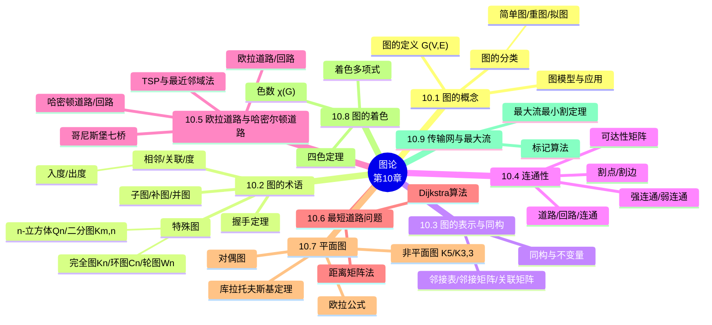

# 图论（Graph Theory）

> **本章主线**：图是什么（顶点与边的二元关系视角）→ 图的术语（相邻、度、握手定理）→ 图的表示（邻接表/矩阵）与同构 → 图的连通性（道路、连通分量、可达性矩阵）→ 两类经典路径问题（**欧拉**：每边恰走一次；**哈密顿**：每点恰访一次）→ 最短路（**Dijkstra 算法**）→ 平面图（欧拉公式）→ 图的着色（四色定理、着色多项式）→ 传输网与最大流。
> 一句话版本：**图是"对象之间如何相连"的通用数学模型**——欧拉管"边"、哈密顿管"顶点"、最短路管"代价"、平面图管"交叉"、着色管"冲突"。



---

## 10.1 图的概念（Introduction of Graph）

### 10.1.1 图的动机与定义

**图的动机**：现实世界中大量问题表现为"离散对象之间的相互关系"——计算机网络、交通路线、社交关系、课程先修、程序调用。**图（graph）**就是用来直观表示这些相互关系、研究其共性与特性、以便解决具体问题的数学结构。

**图与二元关系的关系**（两个视角）：

1. **简单图（simple graph）** $G = (V, E)$ 由两部分组成：
    - 一个**顶点集（vertices / nodes）** $V$，对应关系的论域；
    - 一个**边集（edges / arcs / links）** $E$：由 $V$ 中**两个互异元素**组成的无序对 $\{u, v\}$ 的集合，满足 $u\,R\,v$。
2. 从关系视角看：**简单图对应对称的、反自反的二元关系 $R$**——无序对 $\{u,v\}$ 天然"对称"（$\{u,v\} = \{v,u\}$），且要求 $u \ne v$ 天然"反自反"（无自环）。

**图的统一定义**：$V$ 是一个**非空有限集**，$E$ 是 $V$ 上的一个二元关系，有序对 $(V, E)$ 称为**有向图（directed graph）**；若将 $E$ 中的有序对 $(a,b)$ 看成无序的 $\{a,b\}$，则称 $(V, E)$ 为**无向图（undirected graph）**。有向图与无向图统称为**图（graph）**，记为 $G = (V, E)$。

**顶点与边**：

1. **顶点（vertex）**：$V$ 中的元素，用带标记的点表示，也称**结点**。
2. **边（edge）**：在有向图中，$e = (a, b) \in E$ 称为**有向边（directed edge）**，画成由 $a$ 到 $b$ 的带箭头线；在无向图中，$e = \{a, b\} \in E$ 称为**无向边（undirected edge）**，画成 $a$、$b$ 间的连线。有向边与无向边统称边。

### 10.1.2 图的分类

对图 $G = (V, E)$，按边集的"允许范围"分类：

1. **简单图（simple graph）**：对任意 $(a, b) \in E$ 都有 $a \ne b$——无自环、无重边。
2. **重图（multigraph）**：允许 $E$ 是**重集（multiset）**，即两个顶点之间可以有多条边，这些相同的边称为**重边（parallel edges）**；形式上 $G = (V, E, f)$，其中 $f: E \to \{\{u,v\} \mid u,v \in V,\ u \ne v\}$。
3. **拟图（pseudograph）**：既允许重图又允许非简单图，即**允许自环（loop）**；形式上 $f: E \to \{\{u,v\} \mid u,v \in V\}$，$f(e) = \{u,u\} = \{u\}$ 时称 $e$ 为自环。
4. **有向图（directed graph）**：$E$ 是 $V$ 上的**一般二元关系**（不必对称），即允许单向边，也允许自环。
5. **有向重图（directed multigraph）**：有向图且允许从一个结点到另一个结点的多条弧；$f: E \to V \times V$。
6. 一般的 $G$ 称为**线性图（linear graph）**。

**类型总览表**（各图允许的边类型、重边、自环）：

| 术语 | 边类型 | 允许多重边？ | 允许自环？ |
|---|---|---|---|
| 简单图 | 无向 | 否 | 否 |
| 重图 | 无向 | 是 | 否 |
| 拟图 | 无向 | 是 | 是 |
| 有向图 | 有向 | 否 | 是 |
| 有向重图 | 有向 | 是 | 是 |

> 口诀：**"简单"最干净（无重边无自环）；重图加"重边"；拟图再开"自环"；有向图放开"方向"**。注意：不同教材术语并不完全统一。

### 10.1.3 图模型与实际应用

**图的建模思想**：图可以表示关系，关系可以描述任意谓词的外延——因此**图几乎可以表示任何事物**：网络、调度、流优化、电路设计、路径规划，以及谱系分析、计算机博弈、程序编译、面向对象设计等。

**典型的图模型（Graph Models）**：

| 模型 | 顶点 | 边 |
|---|---|---|
| 生态位重叠图（niche overlap） | 物种 | 共享同一食物资源的两个物种 |
| 熟人图（acquaintanceship） | 人 | 互相认识 |
| 影响力图（influence） | 人 | 一个人影响另一个人 |
| 好莱坞图（Hollywood） | 演员 | 共同出演过同一部电影 |
| 循环赛图（round-robin tournaments） | 参赛队 | 一场比赛（有向：胜者指向败者） |
| 合作图（collaboration） | 学者 | 合作发表过论文 |
| 调用图（call graphs） | 程序模块 | 一个模块调用另一个模块 |
| Web 图（the Web graph） | 网页 | 超链接（有向） |
| 先序图（precedence graphs） | 语句/任务 | 必须先于（用于并发调度） |

**知识图谱（补充说明/拓展）**：知识图谱是图模型的现代大规模应用——用三元组（实体-属性-关系）描述现实世界中的实体（如张三）、概念（如人）及事件间的客观关系，从非结构化数据（图像）或半结构化数据（网页）中抽取信息构建结构化数据。典型如 Google 知识图谱、百度知识图谱等。

---

## 10.2 图的术语（Graph Terminology）

### 10.2.1 相邻、关联与端点

**无向图**：在无向图 $G$ 中，若 $e = \{a, b\} \in E$，则称 $a$ 与 $b$ **相邻（adjacent / neighbors / connected）**，或边 $e$ **关联（incident）** $a$、$b$，或 $e$ **联结（connect）** $a$、$b$。$a$、$b$ 称为边 $e$ 的**端点（endpoints）**。

**有向图**：在有向图 $G$ 中，若 $e = (a, b) \in E$，即箭头由 $a$ 到 $b$，则称 $a$ 相邻到 $b$（$u$ is adjacent **to** $v$），或 $a$ 关联（联结）$b$。$a$ 称为 $e$ 的**起点（initial vertex）**，$b$ 称为 $e$ 的**终点（terminal / end vertex）**。

**两个特殊顶点**：

1. **孤立顶点（isolated vertex）**：不与任何其他顶点相邻的顶点，即度为 0 的顶点。
2. **悬挂顶点（pendant vertex）**：度为 1 的顶点。
3. **自回路（loop）**：$(a,a) \in E$（或 $\{a,a\} \in E$）时，称该边为自回路。

### 10.2.2 顶点的度（Degree）

**无向图的度**：在无向图 $G$ 中，与顶点 $a$ 相邻的顶点的数目称为 $a$ 的**度（degree）**，记为 $\deg(a)$ 或 $d(a)$，即关联 $a$ 的边的条数（**自环按两条边计**）。

**有向图的入度与出度**：

1. 以 $a$ 为终点的边的条数称为 $a$ 的**入度（in-degree）**，记为 $\deg^-(a)$ 或 $d^-(a)$；
2. 以 $a$ 为起点的边的条数称为 $a$ 的**出度（out-degree）**，记为 $\deg^+(a)$ 或 $d^+(a)$；
3. $a$ 的**度** $\deg(a) := \deg^-(a) + \deg^+(a)$，即入度与出度之和。

### 10.2.3 握手定理（Handshaking Theorem）

**定理 1（无向图握手定理）**：设无向图 $G = (V, E)$ 有 $e$ 条边（简单图、重图或拟图均可），则 $G$ 中所有顶点的度之和等于 $e$ 的两倍：

$$\sum_{v \in V} \deg(v) = 2|E|$$

**证明思路**：每条边恰有两个端点，对"边"计数等价于对"端点-边关联"计数——每条边对度数总和的贡献恰好是 2。

**定理 2（推论）**：任何无向图中，**度为奇数的顶点个数必为偶数**。

**证明思路**：将顶点按度分类（奇/偶），由定理 1（总和为偶数）即得奇数度顶点个数为偶数。

**定理 3（有向图握手定理）**：设有向图 $G = (V, E)$ 有 $e$ 条边，则 $G$ 中所有顶点的**入度之和等于出度之和，也等于 $e$**：

$$\sum_{v \in V} \deg^-(v) = \sum_{v \in V} \deg^+(v) = |E|$$

**证明思路**：每条有向边恰有一个起点和一个终点，对出边与入边分别计数。

**例（握手定理验证）**：哥尼斯堡七桥问题的图有 4 个顶点，度数分别为 $5, 3, 3, 3$，总和 $14 = 2 \times 7$，恰为边数 7 的两倍。

> 口诀：**度数总和对"边"翻倍；奇数度顶点成双成对**——这是判断"是否存在欧拉回路"的第一手工具。

### 10.2.4 特殊图结构（Special Graph Structures）

以下都是无向简单图的特殊情形：

**完全图 $K_n$（complete graph）**：$n$ 个顶点中**每个顶点都与其余所有顶点相邻**（$\forall u, v \in V,\ u \ne v \Rightarrow \{u,v\} \in E$）。

- **定理 4**：$K_n$ 有 $\dfrac{n(n-1)}{2}$ 条边（每条边由 $n$ 个顶点中任取 2 个确定）。
- 例：$K_1, K_2, K_3, K_4, K_5, K_6$ 依次有 $0, 1, 3, 6, 10, 15$ 条边。

**环图 $C_n$（cycle）**（$n \ge 3$）：$V = \{v_1, v_2, \ldots, v_n\}$，$E = \{\{v_1,v_2\}, \{v_2,v_3\}, \ldots, \{v_{n-1},v_n\}, \{v_n,v_1\}\}$——一个"圈"。$C_n$ 恰有 $n$ 条边。

**轮图 $W_n$（wheel）**（$n \ge 3$）：在环图 $C_n$ 的基础上增加一个**中心顶点（hub）** $v_{hub}$，并连接中心与每个环上顶点 $\{v_{hub}, v_i\}$。$W_n$ 有 $n+1$ 个顶点、$2n$ 条边（环上 $n$ 条 + 辐条 $n$ 条）。

**$n$-立方体图 $Q_n$（hypercube）**：递归定义——$Q_0$ 是单个顶点；若 $Q_n = (V, E)$，则 $Q_{n+1}$ 由**两份 $Q_n$ 的拷贝**在对应顶点间逐一加边构成。$Q_n$ 有 $2^n$ 个顶点、$n \cdot 2^{n-1}$ 条边（补充说明/拓展：每条边的权重由 PDF 留作练习，此式为标准结论）。$Q_1$ 是一条边，$Q_2$ 是正方形，$Q_3$ 是立方体。

**二分图（bipartite graph）**：图 $G = (V, E)$ 是二分图，当且仅当 $V = V_1 \cup V_2$（$V_1 \cap V_2 = \varnothing$），且每条边 $e$ 都连接 $V_1$ 中的一个顶点与 $V_2$ 中的一个顶点——**所有边都"跨两派"**。该定义可自然推广到重图与有向图。

**完全二分图 $K_{m,n}$（complete bipartite graph）**：$|V_1| = m$，$|V_2| = n$，且 $V_1$ 中每个顶点都与 $V_2$ 中每个顶点相连：$E = \{\{v_1, v_2\} \mid v_1 \in V_1,\ v_2 \in V_2\}$。$K_{m,n}$ 有 $m + n$ 个顶点、$mn$ 条边。可用零一矩阵表示。

**特殊图结构对比表**：

| 图 | 记号 | 顶点数 | 边数 | 特征 |
|---|---|---|---|---|
| 完全图 | $K_n$ | $n$ | $n(n-1)/2$ | 每对顶点都相邻 |
| 环图 | $C_n$ | $n$ | $n$ | 单圈 |
| 轮图 | $W_n$ | $n+1$ | $2n$ | 环 + 中心轮毂 |
| $n$-立方体 | $Q_n$ | $2^n$ | $n \cdot 2^{n-1}$ | 两份 $Q_{n-1}$ 拷贝拼接 |
| 二分图 | — | $m+n$ | $\le mn$ | 边全跨两派 |
| 完全二分图 | $K_{m,n}$ | $m+n$ | $mn$ | 两派间全连 |

> 口诀：**$K_n$ 全连、$C_n$ 一圈、$W_n$ 加轮毂、$Q_n$ 翻倍拼接、$K_{m,n}$ 两派全连**。

### 10.2.5 其他特殊图

1. **有向完全图**：任意两个顶点之间都有**一对反向有向边**的有向图。
2. **零图**：边集为空、只含孤立顶点的图。
3. **平凡图**：只有一个顶点的图。
4. **正则图（regular graph）**：若图 $G = (V, E)$ 中每个顶点的度均为 $n$，则称 $G$ 是 **$n$-正则的**。例：$K_n$ 是 $(n-1)$-正则的，$C_n$ 是 2-正则的。

**计算机网络的拓扑表示**：

- **串行处理**：线性阵列网络（linear array network）；
- **并行处理**：$K_n$、星形（star）、$C_n$、$W_n$、二维阵列网络（2-dimensional array network）、超立方体网络（hypercube network）。

### 10.2.6 子图、补图与并图

**子图（subgraph）**：$G' = (V', E')$ 是 $G = (V, E)$ 的**子图**，若 $G'$ 也是图且满足：

1. $V' \subseteq V$；
2. $E' \subseteq E$。

**注**：

1. 当 $V' = V$ 时，称 $G'$ 为 $G$ 的**生成子图（spanning subgraph）**。
2. 当 $E' \ne E$ 或 $V' \ne V$ 时，称 $G'$ 为 $G$ 的**真子图（proper subgraph）**。

**补图（complementary graph）**：

1. **相对补图**：$G = (V,E)$ 是图，$G' = (V', E')$ 是 $G$ 的子图，令 $E'' = E - E'$，$V'' = V - V'$ 或 $E''$ 中边所关联的所有顶点的集合，则 $G'' = (V'', E'')$ 称为 $G'$ **关于 $G$ 的相对补图**。
2. **绝对补图**：关于**完全图**的子图的补图称为此子图的**绝对补图**，子图记为 $G$ 时补图记为 $\overline{G}$：$\overline{G}$ 与 $G$ 有相同的顶点集，两个顶点在 $\overline{G}$ 中相邻当且仅当它们在 $G$ 中不相邻。
3. **注意**：补图关系不一定是"对称的"——$G'$ 是 $G''$ 的补图，并不代表 $G''$ 是 $G'$ 的补图（补图定义依赖"相对谁"补）。

**例（子图与补图）**：设 $A$ 是无向完全图（顶点 $a,b,c,d,e$），$B, C, D, E, F$ 均为 $A$ 的子图：

- 图 $C$ 的顶点 $a$ 是孤立顶点；
- 图 $B$ 的边 $[a,b]$ 是孤立边；
- 图 $D$ 是图 $C$ 的子图；
- 图 $F$ 是图 $D$ **关于图 $C$ 的余图（相对补图）**；
- 图 $E$ 是图 $C$ 的**补图**（$A$ 是完全图，$C$ 是 $A$ 的子图）。
- 图 $C$ **不是** $E$ 的补图——因为 $E'' = E - E' = \{[b,c], [b,d], [b,e], [c,d], [c,e], [d,e]\}$，$V'' = \{b,c,d,e\}$，而图 $C$ 多了顶点 $a$。

**并图（union）**：$G = (V,E)$ 与 $G' = (V', E')$ 是两个简单无向图，它们的**并图**定义为

$$G \cup G' = (V \cup V',\ E \cup E')$$

---

## 10.3 图的表示与同构（Representing Graph and Graph Isomorphism）

### 10.3.1 表示方法总览

图 $G$ 的表示方法主要有三种：

1. **集合表示**：直接给出 $V$ 与 $E$（$E$ 用顶点对的集合列出）；
2. **邻接表（adjacency list）表示**：每行一个顶点，列出与其相邻的顶点；
3. **矩阵（matrix）表示**：
    - **邻接矩阵（adjacency matrix）**：顶点对是否相邻；
    - **关联矩阵（incidence matrix）**：顶点与边的关联关系。

### 10.3.2 邻接表表示

**邻接表**：一张表，每个顶点占一行，列出与该顶点**相邻的所有顶点**。

- 例（无向图）：顶点 $a$ 与 $b, c$ 相邻、$b$ 与 $a, c, e, f$ 相邻、$c$ 与 $a, b, f$ 相邻、$e$ 与 $b$ 相邻、$f$ 与 $b, c$ 相邻 → 邻接表为：

| 顶点 | 相邻顶点 |
|---|---|
| $a$ | $b, c$ |
| $b$ | $a, c, e, f$ |
| $c$ | $a, b, f$ |
| $d$ | （无，孤立） |
| $e$ | $b$ |
| $f$ | $b, c$ |

- **有向图的邻接表**：每行一个结点，列出从该结点出发的每条边指向的**终点（terminal nodes）**。

### 10.3.3 邻接矩阵表示

**邻接矩阵（adjacency matrix）**：设有向图 $G = (V, E)$，$V = \{v_1, v_2, \ldots, v_n\}$，用 $n \times n$ 方阵 $A = (a_{ij})_{n \times n}$ 表示：

$$a_{ij} = \begin{cases} 1, & (v_i, v_j) \in E \\ 0, & (v_i, v_j) \notin E \end{cases}$$

1. 无向图的邻接矩阵是**对称矩阵**（$a_{ij} = a_{ji}$）。
2. 该定义可扩展到**拟图**：让每个矩阵元素等于两个结点之间的**边数**（可 $> 1$），从而表示重边。
3. 邻接矩阵适合计算机处理；对角线元素 $a_{ii} = 1$ 表示顶点 $v_i$ 有自环。

### 10.3.4 关联矩阵表示

**关联矩阵（incidence matrix）**：设无向图 $G = (V, E)$，顶点为 $v_1, \ldots, v_n$，边为 $e_1, \ldots, e_m$，则关联矩阵是 $n \times m$ 矩阵 $M = (m_{ij})$，其中

$$m_{ij} = \begin{cases} 1, & \text{边 } e_j \text{ 与顶点 } v_i \text{ 关联} \\ 0, & \text{否则} \end{cases}$$

- 行对应顶点、列对应边；每列恰有两个 1（一条边关联两个端点），每行 1 的个数等于该顶点的度。

### 10.3.5 图的同构（Graph Isomorphism）

**同构（isomorphism）**：图 $G_1 = (V_1, E_1)$ 与 $G_2 = (V_2, E_2)$ **同构**（记作 $G_1 \cong G_2$），如果存在 $V_1$ 与 $V_2$ 之间的**一一对应** $f: V_1 \to V_2$，使得在此对应下 $E_1$ 与 $E_2$ 中的边也一一对应——即 $a$ 与 $b$ 在 $G_1$ 中相邻当且仅当 $f(a)$ 与 $f(b)$ 在 $G_2$ 中相邻；对有向图还保持关联方向的对应。

- 直观理解：$f$ 是"重新命名"函数，两个图**除顶点名字外完全相同**。
- 该定义可自然扩展到其他类型的图。

**同构不变量（graph invariants）**——同构的**必要但不充分**条件：

1. $|V_1| = |V_2|$（顶点数相同）且 $|E_1| = |E_2|$（边数相同）；
2. 度为 $n$ 的顶点数在两个图中相同（**度分布一致**）；
3. 一个图的每个真子图，在另一个图中都有与之同构的真子图。

**例（不同构判定）**：两个图顶点数、边数都相同，但**度为 2 的顶点数不同（1 个 vs 3 个）**→ 必不同构。这是最常用的"快速排除"技巧。

**同构判定算法（用邻接矩阵）**：

1. 根据图确定其邻接矩阵（$I$）；
2. 计算**行次**（矩阵每行 1 的个数，对应出度）与**列次**（每列 1 的个数，对应入度）；
3. 不考虑出现的次序不同，若行次与列次不同，则必不同构；否则继续；
4. 同时交换某一矩阵的 $i$ 行与 $j$ 行、$i$ 列与 $j$ 列；若此矩阵能变成与另一矩阵一样，则同构；对**所有顶点的排列**都试过仍不相同，则不同构。

**例（行次列次法）**：设两个图的邻接矩阵为

$$I = \begin{bmatrix} 0 & 1 & 0 & 1 \\ 0 & 0 & 0 & 1 \\ 1 & 1 & 0 & 0 \\ 0 & 0 & 1 & 0 \end{bmatrix}, \qquad II = \begin{bmatrix} 0 & 1 & 0 & 0 \\ 0 & 0 & 1 & 0 \\ 1 & 0 & 0 & 1 \\ 1 & 1 & 0 & 0 \end{bmatrix}$$

1. $I$ 的行次为 $(2, 1, 2, 1)$，列次为 $(1, 2, 1, 2)$；
2. $II$ 的行次为 $(1, 1, 2, 2)$，列次为 $(2, 2, 1, 1)$；
3. 两个矩阵的行次/列次**都是"两个 1、两个 2"**（多集相同），不能排除同构，继续；
4. 把 $II$ 的第 1 行与第 4 行交换、第 1 列与第 4 列交换，得 $\begin{bmatrix} 0 & 1 & 0 & 1 \\ 0 & 0 & 1 & 0 \\ 1 & 0 & 0 & 1 \\ 0 & 1 & 0 & 0 \end{bmatrix}$；再把第 2 行与第 4 行交换、第 2 列与第 4 列交换，得 $\begin{bmatrix} 0 & 1 & 0 & 1 \\ 0 & 0 & 0 & 1 \\ 1 & 1 & 0 & 0 \\ 0 & 1 & 0 & 0 \end{bmatrix}$；
5. 结果与 $I$ 完全相同 → **两个图同构**（行/列同步交换恰对应顶点重命名）。

> 该例演示的核心技巧：**行/列同步交换 = 顶点重命名；先比"行次列次多集"快速排除，再暴力重排验证**。

---

## 10.4 连通性（Connectivity）

### 10.4.1 道路与回路

**道路（path）**：无向图中，相邻边的序列 $(v_0, v_1), (v_1, v_2), \ldots, (v_{k-1}, v_k)$ 称为一条**道路（通路）**，长度为 $k$；也可写作 $(v_0, v_1, \ldots, v_k)$，$v_0$ 为起点，$v_k$ 为终点。当 $v_0 = v_k$ 时，该道路称为**回路（circuit）**。有向图中的道路必须**沿箭头方向**行走。

**道路的三种"纯度"**：

1. **简单道路（simple path）**：一条道路中**没有两条边相同**；是回路时称为**简单回路（simple circuit）**。
2. **基本道路（elementary path）**：一条道路中**除了起点和终点可以相同外，没有其他相同顶点出现**；是回路时称为**基本回路（elementary circuit）**。
3. 关系：基本道路 ⊆ 简单道路（顶点不重复 ⇒ 边必然不重复）。

**例（区分简单与基本道路）**：图中 $(e_5, e_1, e_2, e_3, e_4)$ 对应的顶点序列为 $(c, a, b, c, d, b)$——其中 $b$、$c$ 均出现两次，所以它是**简单道路但不是基本道路**；而 $(c, d, b, c)$ 是**基本道路**。

**道路与路径计数**：在熟人图中，两人之间存在道路即存在"认识链"；"六度分隔（Six Degrees of Separation）"断言世界上几乎任意两人都可由不超过六人（或五人）的链条相连。**Erdős 数**：合作图中某人 $m$ 与数学家 Erdős 之间的最短道路长度；**Bacon 数**：好莱坞图中演员与 Kevin Bacon 之间的最短道路长度。

### 10.4.2 无向图的连通性与连通分量

**连通（connectivity）**：设 $G = (V, E)$，$(v_0, v_1, \ldots, v_k)$ 是 $G$ 中的一条道路，则称 $v_0$ 到 $v_k$ **连通（或可达）**。

- 对无向图而言，若 $v_0$ 到 $v_k$ 可达，则 $v_k$ 到 $v_0$ 也可达；**对有向图则未必**。

**连通图（connected）**：若无向图 $G$ 中**任意两个不同顶点都连通**，则称 $G$ 是连通的。

**定理 1**：任意一个连通无向图的任意两个不同顶点之间**都存在一条简单道路**。

**连通分量（connected components）**：图 $G$ 可分为几个互不相连通的子图，每个子图本身都是连通的，这些子图称为 $G$ 的**连通分图（连通分量）**。等价定义：连通分量是 $G$ 的**极大连通子图**——它不是任何其他连通子图的真子图；不连通图的两个或多个连通分量互不相交且并集为 $G$。

### 10.4.3 有向图的连通性

1. **弱连通（weakly connected）**：若 $G = (V, E)$ 对应的**无向图**（去掉箭头，称为 underlying undirected graph）是连通图，则称 $G$ 为弱连通。
2. **强连通（strongly connected）**：若 $G$ 中任两点间都有路，即对任意 $a$、$b$，$a$ 到 $b$ 可达且 $b$ 到 $a$ 可达，则称 $G$ 为强连通。
3. **强连通蕴含弱连通，反之不然**（strongly implies weakly, but not vice-versa）。

> 口诀：**强连通"双向都到"，弱连通"剥掉箭头再连"**。

### 10.4.4 割点、割边与连通度

**割点（cut vertex / articulation point）**：删除某个顶点及其所有关联边会使连通分量数增加，这样的顶点称为割点。从连通图中删除割点会产生不连通子图。

- 注意：**并非所有图都有割点**——$K_n$（$n \ge 3$）删除一个顶点后仍是连通的 $K_{n-1}$，故无割点。没有割点的连通图称为**不可分图（nonseparable graph）**，可视为"更连通"。

**割边（cut edge / bridge）**：删除后使连通分量数增加的边称为割边。在计算机网络中，割边对应单点故障链路。

**点连通度（vertex connectivity）** $\kappa(G)$：非完全图 $G$ 中，**为了断连图所需删除的最少顶点数**（即顶点割中顶点数的最小值）。

**边连通度（edge connectivity）** $\lambda(G)$：连通图 $G$ 中，**为了断连图所需删除的最少边数**；被删除的使图不连通的边集 $E'$ 称为**边割（edge cut）**。若图有割边，则 $\lambda(G) = 1$。

### 10.4.5 邻接矩阵与路径计数、可达性矩阵

**定理 2（路径计数）**：设 $A$ 是图 $G$ 的邻接矩阵，则 $A^k$ 的元素 $(A^k)_{ij}$ **表示从 $v_i$ 到 $v_j$ 长度为 $k$ 的道路条数**。

- 特别地，$A^2 = A \cdot A$ 的元素 $b_{ij} = \sum_{k=1}^{n} a_{ik} a_{kj}$，表示 $v_i$ 到 $v_j$ **路长为 2 的道路条数**（枚举中转点 $k$，$v_i \to v_k$ 与 $v_k \to v_j$ 同时有边即构成一条长度为 2 的道路）。

**例（长度 2 路径计数）**：图有顶点 $a, b, c$，边 $a\text{-}b$、$a\text{-}c$，邻接矩阵 $A = \begin{bmatrix} 0 & 1 & 1 \\ 1 & 0 & 0 \\ 1 & 0 & 0 \end{bmatrix}$，则

$$A^2 = A \cdot A = \begin{bmatrix} 2 & 0 & 0 \\ 0 & 1 & 1 \\ 0 & 1 & 1 \end{bmatrix}$$

即从 $a$ 到 $a$ 有 2 条长度为 2 的道路（$a \to b \to a$ 与 $a \to c \to a$）；从 $b$ 到 $c$ 有 1 条（$b \to a \to c$）。

**定理 3（最短路长度上界）**：$n$ 个顶点的图 $G$ 中，若 $v_i$ 到 $v_j$（$v_i \ne v_j$）有道路，则**最短道路长度 $\le n - 1$**。

**定理 4（连通性的矩阵刻画）**：$n$ 个顶点的图 $G$ 中，$A$ 是 $G$ 的邻接矩阵，$v_i$、$v_j$ 是 $G$ 的顶点，令

$$B = A + A^2 + \cdots + A^{n-1}$$

则 $v_i$ 到 $v_j$（$v_i \ne v_j$）**连通当且仅当 $b_{ij}$ 非零**（存在某长度 $\le n-1$ 的道路）。

**可达性矩阵（reachability matrix）**：$n$ 个顶点的图 $G$ 中，

$$B = A + A^2 + \cdots + A^{n-1} + A^n$$

称为 $G$ 的**可达性矩阵**（普通矩阵乘法后，非零元视为 1）。由此得到连通性的判定：

1. **有向图（$n > 1$）**：$B$ 中元素全为 1 $\iff$ $G$ 强连通；
2. **有向图（$n > 1$）**：$A \vee A^T$ 的可达性矩阵元素全为 1 $\iff$ $G$ 弱连通；
3. **无向图（$n > 1$）**：$B$ 中元素全为 1 $\iff$ $G$ 连通。

**注**：连通性、是否存在长度为 $k$ 的回路/简单回路，都是**同构不变量**（isomorphism invariants）。

**例（用图建模：自动售货机）**：一台自动售货机只用 5 分、10 分两种硬币，满 15 分后压按钮选择一块巧克力，钱多了不找还。用有向加权图描述：

- **顶点**（已投入钱的状态）：$a$：0 分，$b$：5 分，$c$：10 分，$d$：$\ge 15$ 分；
- **边**（动作）：5：投 5 分，10：投 10 分，$p$：压按钮动作；
- 行为刻画：钱数不够压按钮不起作用（$a,b,c$ 上的 $p$ 自环）；钱数够了压按钮给出糖果回到 0 分状态（$d \xrightarrow{p} a$）；钱超过 15 分再加钱白加（$d$ 上 5、10 自环）。

> 该例演示的核心技巧：**用"状态作顶点、动作作带权有向边"把过程系统建模为图，连通性与可达性即对应系统行为是否可达**。

---

## 10.5 欧拉道路与哈密尔顿道路（Euler and Hamilton Paths）

### 10.5.1 哥尼斯堡七桥问题（Bridges of Königsberg）

**问题**：哥尼斯堡城被普雷格尔河分为河岸 $A$、$C$ 与两座小岛 $B$、$D$，其间有七座桥。能否从河岸或小岛出发，通过每一座桥**恰好一次**，最后回到出发点？

**欧拉（Euler）1736 年的解答**：将河岸与小岛作为图的顶点、七座桥作为边，构成一个无向重图。问题化为：**该图是否存在经过所有边恰一次的回路**。图中四个顶点 $A, B, C, D$ 的度分别为 $5, 3, 3, 3$——**全是奇数度**，故不存在欧拉回路（更不存在欧拉道路，因奇数度顶点多于 2 个）。**答案为否**。这是图论的诞生标志。

### 10.5.2 欧拉道路与欧拉回路（Euler Paths and Circuits）

**定义**：

1. **欧拉道路（Euler path / Euler trail）**：$G = (V, E)$ 中**包含 $E$ 中所有边**的简单道路，简称 E 道路（每条边恰用一次，不必回到起点）。
2. **欧拉回路（Euler circuit / Euler tour）**：包含 $E$ 中所有边的简单回路，简称 E 回路（每条边恰用一次且**回到起点**）。
3. **欧拉图（Eulerian graph）**：存在欧拉回路的图。

**核心区别**：欧拉回路走遍**每条边**恰一次（可重复经过顶点）；哈密顿回路访问**每个顶点**恰一次（可跳过边）。

### 10.5.3 欧拉定理（无向图）

**定理 1（欧拉定理）**：设 $G = (V, E)$ 是没有度为 0 的孤立顶点的无向图（连通重图），则

- **(a)** 若 $G$ 有奇数度顶点，则 $G$ 中**不存在欧拉回路**；
- **(b)** 若 $G$ **连通**且**每个顶点度均为偶数**，则 $G$ **存在欧拉回路**。

即：**无向连通图 $G$ 是欧拉图 $\iff$ $G$ 不含奇数度顶点**。

**推论（欧拉道路）**：非平凡连通图 $G$ **有欧拉道路（但没有欧拉回路）** $\iff$ $G$ **恰好有两个奇数度顶点**；且任何欧拉道路**必以其中一个奇数度顶点为起点、另一个为终点**。

1. 若 $G$ 有**超过两个**奇数度顶点，则不存在欧拉道路——每个奇数度顶点"有进无出"或"有出无进"，三个奇数度顶点中总有一个会留下未走完的边。
2. 若恰有两个奇数度顶点 $u$、$v$：加一条虚拟边 $(u,v)$ 使所有顶点为偶度 → 存在欧拉回路 → 从回路中删去 $(u,v)$ 即得欧拉道路。

**证明思路（充分性）**：任取一个奇数度顶点（若无则任取）作为起点，每次"进得去一定出得来"（偶度保证）；若走完的道路未覆盖所有边，则余图（关于已走子图的补图）与原道路有公共顶点 $c$（连通性保证），从 $c$ 出发在余图中走一个简单回路并拼接进去；因边有限，重复有限次即得欧拉道路。

**例（七桥问题再论）**：四顶点度数 $5, 3, 3, 3$ 全为奇数 → 不存在欧拉回路，也不存在欧拉道路。

**例（欧拉道路的构造）**（补充说明/拓展，PDF 示例图形印刷不清，此处给等价的清晰构造）：设图有顶点 $a,b,c,d$，边 $ab, bc, ca, ad, bd$，度数 $\deg(a) = 3, \deg(b) = 3, \deg(c) = 2, \deg(d) = 2$，恰有两个奇数度顶点 $a$、$b$，故存在欧拉道路：

1. 以 $a$ 为起点，贪心走边：$a \to c \to b \to a \to d \to b$；
2. 检验：每条边（$ac, cb, ba, ad, db$）恰好用了一次，且结束于另一个奇数度顶点 $b$ → 是欧拉道路 ✓。

> 该例演示的核心技巧：**偶度顶点"进得去出得来"，起终点锁定两个奇度顶点；构造时只要不"困死"在子图中即可**。

### 10.5.4 有向图的欧拉定理

**定理（有向图欧拉回路）**：连通有向图 $D$ 含有**有向欧拉回路**的充分必要条件是 $D$ 中**每个顶点的入度等于出度**。

**定理 2（有向图欧拉道路）**：不含度为 0 的孤立顶点的有向图具有**欧拉道路**的充要条件是：

1. **弱连通**；
2. 除可能有 2 个顶点——一个入度比出度大 1，一个出度比入度大 1——之外，**其余顶点出度等于入度**。

### 10.5.5 Fleury 算法与一笔画问题

**Fleury 算法（构造欧拉回路）**：设 $G = (V, E, \gamma)$ 是每个顶点度均为偶数的连通图：

1. **Step 1**：选择一条**不是桥（bridge）**的边 $e_1$，设其端点为 $v_1, v_2$；令道路 $\pi: v_1, v_2$，边集 $E_\pi: e_1$；从 $E$ 中删除 $e_1$ 及孤立顶点得到 $G_1$。
2. **Step 2**：设已构造 $\pi: v_1, v_2, \ldots, v_k$ 与 $E_\pi: e_1, \ldots, e_{k-1}$，且这些边与孤立顶点已从 $V, E$ 中删除形成 $G_{k-1}$。因 $v_k$ 在 $G_{k-1}$ 中度为偶数，必存在以 $v_k$ 为端点的边 $e_k$；若有多条可选，**选择一条对 $G_{k-1}$ 不是桥的边**。将 $e_k$ 的另一端点记为 $v_{k+1}$，扩展道路。
3. **Step 3**：重复 Step 2，直到 $E$ 中没有边剩余。

**核心思想**：**永远不要走"桥"**——走桥会把尚未走完的边困在另一侧。这也是欧拉回路算法（从任意结点出发构造回到起点的简单道路，再对每个剩余子图重复并**拼接（splicing）**回原回路）的变体。

**一笔画问题**：

1. 无向连通图**能一笔画**（回到起点）⇔ 所有顶点度数为偶数；
2. 无向连通图**能一笔画**（不必回到起点）⇔ 恰好有 0 或 2 个奇数度顶点；
3. 若奇数度顶点个数为 $2K$ 个，则该图是 **$K$ 笔画问题**——需 $K$ 笔才能画完。
    - 例：8 个顶点均为 3 次的图，$2K = 8$，**至少要 4 笔**。

### 10.5.6 中国邮递员问题（Chinese Postman Problem）

**问题（管梅谷提出）**：邮递员从邮局出发，走遍投递区域的所有街道，送完邮件后回到邮局，怎样使所走的路线全程最短？

**解答思路**：街道图的交叉口为顶点、街道为带权边（权为街道长度）。若街道图存在**欧拉回路**，则沿欧拉回路走显然全程最短（每条街恰好走一次）；若存在奇度顶点，则需重复走某些边使所有顶点变为偶度，问题化为"**如何选择重复边使总权最小**"——即欧拉道路的应用。

### 10.5.7 哈密顿道路与回路（Hamiltonian Paths and Circuits）

**起源（绕行世界问题）**：1859 年，Hamilton 发明一种游戏：在一个实心正十二面体的 20 个顶点上标上世界著名大城市的名字，要求从某一城市出发**遍历各城市一次**，最后回到原地。

**定义**：

1. **哈密顿道路（Hamilton path，H 道路）**：$G = (V, E)$ 中**经过 $V$ 中所有顶点**的基本道路（每个顶点恰访问一次）。
2. **哈密顿回路（Hamilton circuit，H 回路）**：经过 $V$ 中所有顶点的基本回路。
3. **哈密顿图（Hamiltonian graph）**：存在哈密顿回路的图。

**欧拉 vs 哈密顿对比表**：

| 维度 | 欧拉道路/回路 | 哈密顿道路/回路 |
|---|---|---|
| 覆盖对象 | 每条**边**恰一次 | 每个**顶点**恰一次 |
| 判定 | 有简洁充要条件（度数奇偶性） | **没有**简洁刻画（NP-complete） |
| 典型应用 | 一笔画、邮递员、鼓轮 | 旅行商、格雷码、配送路线 |

> 口诀：**欧拉管边、哈密顿管点；欧拉看度数、哈密顿看"足够多的边"**。

### 10.5.8 哈密顿图的判定定理

**现状**：判定一个图是否为哈密顿图是 **NP-complete** 问题——没有已知的多项式时间算法，很可能不存在像欧拉图那样简洁的刻画。

**充分条件（"边足够多"则必有 H 回路）**：

- **Dirac 定理**：若 $G$ 是连通简单图，$n \ge 3$ 个顶点，且每个顶点 $\deg(v) \ge \dfrac{n}{2}$，则 $G$ 有哈密顿回路。
- **Ore 定理（定理 4）**：若 $G$ 是 $n \ge 3$ 的简单图，且**任何一对不相邻顶点**的度之和 $\ge n$，则 $G$ 必有哈密顿回路。Dirac 定理是 Ore 定理的推论。
- **定理 3（H 道路）**：设 $G = (V, E)$ 是 $n$ 个顶点的简单图，若**任何一对顶点的度之和 $\ge n - 1$**，则 $G$ 中一定有哈密顿道路。
    - 证明思路：先证 $G$ 必连通（否则两个分图各取一顶点，度之和 $\le n_1 - 1 + n_2 - 1 = n - 2 < n - 1$ 矛盾）；再用逐步递推构造法——从含 2 个顶点的基本道路出发，每步扩充 1 个顶点：若道路外有顶点与 $V_1$ 或 $V_p$ 相邻则直接扩充；否则利用度之和条件把 $V_1, \ldots, V_p$ 重排成回路，再由连通性接到道路外顶点，形成 $p+1$ 个顶点的基本道路。
- **定理 2（边数条件）**：设 $G$ 的边数为 $m$，若 $m \ge \dfrac{n^2 - 3n + 6}{2}$，则 $G$ 有哈密顿回路。
    - 证明思路：任取不相邻的 $u, v$，删去它们及其关联边得 $H$（$n-2$ 个顶点），$H$ 的边数 $\le \binom{n-2}{2} = \dfrac{n^2 - 5n + 6}{2}$，故 $\deg(u) + \deg(v) \ge m - \dfrac{n^2 - 5n + 6}{2} \ge \dfrac{n^2 - 3n + 6}{2} - \dfrac{n^2 - 5n + 6}{2} = n$，由 Ore 定理得证。
- **定理 5**：**有向完全图一定存在 H 道路**。

**必要条件（用于排除非哈密顿图）**：设无向图 $G = \langle V, E \rangle$ 是哈密顿图，$V_1$ 是 $V$ 的任意非空子集，则

$$P(G - V_1) \le |V_1|$$

其中 $P(G - V_1)$ 是从 $G$ 中删除 $V_1$（删除其中各结点及其关联的边）后所得图的**连通分支数**。若存在 $V_1$ 使 $P(G - V_1) > |V_1|$，则 $G$ **不是**哈密顿图。

- 例：某图 $G'$ 中取 $V_1 = \{v_1, v_3\}$，有 $P(G' - V_1) = 3 > |V_1| = 2$ → $G'$ 不是哈密顿图。
- 注意：该条件是**必要而非充分**——**彼得森图（Petersen graph）**满足该条件，但它不是哈密顿图。

**重要提醒**：以上充分条件（Dirac / Ore / 边数）**都只是充分条件，不是必要条件**——例如 $n \ge 6$ 的 $n$ 边形，任意两顶点度之和 $= 4 < n - 1$，但 $n$ 边形显然有 H 道路。

### 10.5.9 应用：格雷码与鼓轮设计

**格雷码（Gray codes）**：旋转指针的位置可用数字形式表示——把圆周分成 $2^n$ 等份，给每份分配一个长度为 $n$ 的二进制串。**格雷码**是满足"**相邻弧的标记恰有一位不同**"的标记方式。

**计算机鼓轮的设计**：旋转鼓轮表面被等分成 24 个部分，问鼓轮上 16 个部分怎样安排导体（1）和绝缘体（0），才能使鼓轮每转一部分，四个触点得到**一组不同的四位二进制数**？

**建模**：构造一个有 8 个结点（对应所有三位二进制串）、16 条边的有向图——从结点 $a$ 到结点 $b$ 连边，当且仅当 $a$ 的最后两位等于 $b$ 的前两位。每条边对应一个四位二进制串；16 条边被记成 16 个不同的四位二进制数。

1. **定理（欧拉回路 ↔ 记忆鼓轮）**：每个结点的出度与入度都恰为 2（图连通且各点入度=出度）→ 该有向图是欧拉图 → **每条欧拉回路对应一个记忆鼓轮**：沿欧拉回路走，每转一格触点读到的四位二进制数互不相同，恰好覆盖全部 $2^4$ 个四位数。
2. **定理（推广）**：对每个 $n$，都存在大小为 $2^n$ 的记忆鼓轮，包含所有 $n$ 位二进制模式。
3. **哈密顿版本**：该图的**哈密顿回路与 8 位记忆鼓轮一一对应**——沿哈密顿回路，每个三位结点被访问一次，对应连续的四位输出。

> 该例演示的核心技巧：**把"连续滑动窗口"编码问题翻译成有向图，欧拉回路 = 覆盖全部边的编码序列，哈密顿回路 = 覆盖全部状态的编码序列**。

---

## 10.6 最短道路问题（Shortest Path Problem）

### 10.6.1 加权图与最短路

**加权图（weighted graph）**：给连接两个顶点的每条边赋予一个数（**权 weight**），表示两地间的旅行距离、每月开销或旅行时间等。**道路的长度**是道路中所有边的权之和（注意：与"边的条数"意义不同）。

**两类最短路问题**：

1. 求从一个指定顶点到另一个指定顶点的最短路（单源单目标）；
2. 求任意两个顶点之间的最短路（全源）。

**实际应用**：管线铺设、电力输配电网、通信网络、铁路车站调度等。

### 10.6.2 Dijkstra 算法

**Dijkstra（迪杰斯特拉）算法**：求加权连通简单图中从源点 $a = v_0$ 到终点 $z = v_n$ 的最短路（所有权均为正）。算法同时得到从 $v_1$ 到图中**每个其他顶点**的最短路。

**算法步骤（伪代码）**：

```
procedure Dijkstra(G: 加权连通简单图，所有权为正)
  {G 的顶点为 a = v0, v1, …, vn = z，边权 w(vi, vj)，无边时 w(vi, vj) = ∞}
  for i := 1 to n: L(vi) := ∞        {初始化标签}
  L(a) := 0
  S := ∅                             {S: 已确定最短路的顶点集}
  while z ∉ S
  begin
    u := 不在 S 中且 L(u) 最小的顶点
    S := S ∪ {u}
    for 所有不在 S 中的顶点 v:
      if L(u) + w(u, v) < L(v) then L(v) := L(u) + w(u, v)   {松弛更新}
  end
  {L(z) = 从 a 到 z 的最短路长度}
```

**核心思想（动态规划 + 贪心）**：每次从"未确定"顶点中挑出当前标签最小者 $u$ 加入 $S$（其最短路已确定，贪心正确性由**所有权非负**保证），再用 $u$ 去**松弛**（更新）其余顶点的标签。递推式：

$$L_k(a, v) = \min\{L_{k-1}(a, v),\ L_{k-1}(a, u) + w(u, v)\}$$

**例（完整手算）**：求下图中 $a$ 到 $z$ 的最短路。图的边权为：$a\text{-}b = 4$，$a\text{-}c = 2$，$c\text{-}b = 1$，$c\text{-}d = 8$，$b\text{-}d = 5$，$c\text{-}e = 10$，$d\text{-}e = 2$，$d\text{-}z = 6$，$e\text{-}z = 3$。

1. **初始化**：$L(a) = 0$，$L(b) = L(c) = L(d) = L(e) = L(z) = \infty$，$S = \varnothing$。
2. **选 $u = a$**（$L = 0$），$S = \{a\}$：松弛得 $L(b) = 4\,(a)$，$L(c) = 2\,(a)$。
3. **选 $u = c$**（$L = 2$），$S = \{a, c\}$：$L(b) = \min(4, 2+1) = 3\,(a,c)$；$L(d) = \min(\infty, 2+8) = 10\,(a,c)$；$L(e) = \min(\infty, 2+10) = 12\,(a,c)$。
4. **选 $u = b$**（$L = 3$），$S = \{a, c, b\}$：$L(d) = \min(10, 3+5) = 8\,(a,c,b)$。
5. **选 $u = d$**（$L = 8$），$S = \{a, c, b, d\}$：$L(z) = \min(\infty, 8+6) = 14\,(a,c,b,d)$；$L(e) = \min(12, 8+2) = 10\,(a,c,b,d)$。
6. **选 $u = e$**（$L = 10$），$S = \{a, c, b, d, e\}$：$L(z) = \min(14, 10+3) = 13\,(a,c,b,d,e)$。
7. **选 $u = z$**（$L = 13$），$S$ 含全部顶点，算法结束。

**最终答案**：从 $a$ 到 $z$ 的**最短路长度为 13**，路径为 **$a \to c \to b \to d \to e \to z$**（同时得到 $a$ 到其他各点的最短路：$c = 2$，$b = 3$，$d = 8$，$e = 10$）。

> 该例演示的核心技巧：**每一步只"认领"标签最小的顶点（贪心），并只沿该顶点做一次松弛；标签中记录前驱顶点以回溯路径**。

### 10.6.3 距离矩阵方法（任意两点最短路）

**距离矩阵（distance matrix）**：设 $G$ 是 $n$ 个顶点的图，距离矩阵 $D = (d_{ij})_{n \times n}$，其中 $d_{ij}$ 表示边 $(v_i, v_j)$ 的权；$v_i$ 与 $v_j$ 之间无边时 $d_{ij} = \infty$（对角线 $d_{ii} = 0$ 或 $\infty$ 视约定）。

**矩阵乘法推广（min-plus 积）**：令 $D^2 = D * D = (d^{(2)}_{ij})_{n \times n}$，其中

$$d^{(2)}_{ij} = \min\{d_{i1} + d_{1j},\ d_{i2} + d_{2j}, \ldots, d_{in} + d_{nj}\}$$

即 $d^{(2)}_{ij}$ 是**恰含两条边**的 $v_i \to v_j$ 道路的最短长度。一般地，$D^k = D^{k-1} * D$，$d^{(k)}_{ij}$ 是恰含 $k$ 条边的道路的最短长度。

**最短路径矩阵**：定义运算 $\oplus$ 为逐元素取小：$C = A \oplus B$，$c_{ij} = \min(a_{ij}, b_{ij})$，则

$$P = D \oplus D^2 \oplus D^3 \oplus \cdots \oplus D^n$$

其中 $p_{ij}$ 表示从 $v_i$ 到 $v_j$ 的**最短长度**（任意边数，最短路边数不超过 $n - 1$）。

**例（矩阵法求最短路）**：设 4 顶点的图距离矩阵为

$$D = \begin{bmatrix} \infty & 1 & 2 & \infty \\ \infty & \infty & 3 & 3 \\ \infty & \infty & \infty & 2 \\ \infty & \infty & \infty & \infty \end{bmatrix}$$

1. 求 $D^2$（枚举中转点，逐项取 min）：
   $$D^2 = \begin{bmatrix} \infty & \infty & 4 & 4 \\ \infty & \infty & \infty & 5 \\ \infty & \infty & \infty & \infty \\ \infty & \infty & \infty & \infty \end{bmatrix}$$
   其中 $d^{(2)}_{13} = d_{12} + d_{23} = 1 + 3 = 4$，$d^{(2)}_{14} = \min(d_{12} + d_{24},\ d_{13} + d_{34}) = \min(1+3,\ 2+2) = 4$，$d^{(2)}_{24} = d_{23} + d_{34} = 3 + 2 = 5$。
2. 求 $D^3 = D^2 * D$：$d^{(3)}_{14} = d^{(2)}_{13} + d_{34} = 4 + 2 = 6$，其余为 $\infty$。
3. $D^4 = D^3 * D = $ 零矩阵（$\infty$ 矩阵）。
4. 求 $P = D \oplus D^2 \oplus D^3 \oplus D^4$（逐元素取 min）：

$$P = \begin{bmatrix} \infty & 1 & 2 & 4 \\ \infty & \infty & 3 & 3 \\ \infty & \infty & \infty & 2 \\ \infty & \infty & \infty & \infty \end{bmatrix}$$

例如 $p_{14} = \min(d_{14}, d^{(2)}_{14}, d^{(3)}_{14}, d^{(4)}_{14}) = \min(\infty, 4, 6, \infty) = 4$，即 $v_1$ 到 $v_4$ 的最短路长为 4（路径 $v_1 \to v_3 \to v_4$）。

> 该例演示的核心技巧：**把普通矩阵乘法的"乘加"换成"加取小"，幂次对应边数上限，逐元素取小即得全源最短路**。

### 10.6.4 旅行商问题（TSP, Traveling Salesman Problem）

**问题**：从某地出发，恰好一次经过 $n$ 个城市，最后回到原地，寻找总路程最短的路线。

**实质**：无向简单**加权**图，寻找**最短哈密顿回路**的问题。

**说明**：

1. 哈密顿回路不一定存在，但**若图是完全图则必存在**；
2. 若图连通、任意两城市间总有路，以两城市间交通费用作为边的权，则是无向图的 H 回路问题；
3. $K_n$ 中 H 回路的数量是 $\dfrac{(n-1)!}{2}$ 种——$n$ 稍大即无法穷举，必须用近似算法。

**最近邻域算法（nearest neighbor，近似算法）**：

1. 从任一顶点出发，记为 $v_1$，找一个与 $v_1$ **最近**的顶点 $v_2$，$(v_1, v_2)$ 为两个顶点的基本道路；
2. 若已有 $p$ 个顶点的基本道路 $(v_1, v_2, \ldots, v_p)$（$p < n$），在道路外找一个**离 $v_p$ 最近**的顶点 $v_{p+1}$，加入得 $p+1$ 个顶点的基本道路；
3. 若 $p + 1 = n$ 转 4，否则转 2；
4. **闭合 H 回路**：增加一条边 $(v_n, v_1)$，得 $(v_1, v_2, \ldots, v_n, v_1)$ 作为近似最短回路。

**说明**：

1. 找最近顶点不唯一时按序取；
2. **不一定是最短 H 回路**（贪心的局部最优不等于全局最优）。

**例（最近邻域法 vs 最优）**：加权无向完全图，从 $a$ 点出发：

- **最近邻域法**得回路 $(a, c, e, d, b, a)$，总长 $7 + 6 + 8 + 5 + 14 = 40$；
- **实际最短回路**为 $(a, c, e, b, d, a)$，总长 $7 + 6 + 9 + 5 + 10 = 37$。
- 结论：最近邻域法**不一定最优**，本例相差 3。

**改进（双向起点法）**：

1. 找一条**最短的边** $e_i$；
2. 以关联 $e_i$ 的两个顶点 $v_1, v_2$ **分别作为起点**，用最近邻域法求最短 H 回路；
3. 比较两条回路的长度，取较短者。
**如上例**：$(b, d)$ 边长 5 最短；以 $b$ 为起点得 $(b, d, e, c, a, b)$ 总长 40；以 $d$ 为起点得 $(d, b, e, c, a, d)$ 总长 **37**——恰为最优。

**近似比估计**：设 $G = (V, E, W)$ 是 $n$ 个顶点的完全无向图，满足**三角不等式** $w(i,j) + w(j,k) \ge w(i,k)$，$d_0$ 是最短 H 回路的长度，$d$ 是最近邻域法所得 H 回路的长度，则

$$\frac{d}{d_0} \le \frac{1}{2}\lfloor \log_2 n \rfloor + \frac{1}{2}$$

**TSP 的求解方法**：最邻近法（近似）、分枝定界法（精确）、启发式方法。

> 口诀：**Dijkstra 求点到点（贪心认领 + 松弛）、距离矩阵求全源（min-plus 幂并取小）、TSP 求回路（近似靠最近邻，三角不等式给误差上界）**。

---

## 10.7 平面图（Planar Graphs）

### 10.7.1 平面图与平面嵌入

**平面图（planar graph）**：无向图 $G = \langle V, E \rangle$ 如果能够把它的所有结点和边画在平面上，使得**任何两条边除公共结点外没有其他交叉点**，则称 $G$ 为**平面图**；否则称 $G$ 为**非平面图**。

- 例：$K_4$（4 个顶点的完全图）是平面图——可以重画成无交叉的形式。
- 问题：$K_5$（5 个顶点的完全图）是平面图吗？$K_{3,3}$ 呢？——答案都是**否**（见 10.7.4）。
- **动机**：把图画在平面上的问题在 **VLSI 布局**（集成电路版图设计）中频繁出现。

**平面嵌入（plane graph）**：把平面图画在平面上且无交叉边时，这个特定的嵌入称为**平面图嵌入（plane graph）**。

### 10.7.2 面与欧拉公式

**面（regions / faces）**：平面图把平面切割成若干个区域，这些区域称为**面**。

**面相关概念**：

1. **面**：由连通平面图 $G$ 的边所包围的、其内部不包含图的结点和边的区域；
2. **边界**：面的各边所组成的回路；
3. **面的次数**：面边界回路的长度，记为 $\deg(r)$。

**定理 1（欧拉公式，Euler's formula, 1752）**：对任何一个**连通的平面简单图**，有

$$v - e + \gamma = 2$$

其中 $v$ 为顶点数，$e$ 为边数，$\gamma$ 为区域（面）数。**无论怎样重画平面图，面数不变**（$f = 2 - v + e$ 由 $v, e$ 唯一确定）。

**证明思路（对 $e$ 归纳）**：

1. $e = 1$：要么 $v = 2, \gamma = 1$（$2 - 1 + 1 = 2$），要么 $v = 1, \gamma = 2$（自环，$1 - 1 + 2 = 2$）；
2. $e = n$ 时：若图含有限区域，去掉该区域的一条边得 $G'$（$n-1$ 条边），$v' = v$，$e' = e - 1$，$\gamma' = \gamma - 1$，代入归纳假设成立；若图无有限区域（即无回路，是一棵树），去掉一个度为 1 的顶点及其关联边，$v' = v - 1$，$e' = e - 1$，$\gamma' = \gamma = 1$，同样代入即得。
**另一等价证明**：对圈的个数归纳——无圈时 $G$ 是树，$e = v - 1$，$f = 1$，$v - e + f = 2$；有圈时删去圈上一条边 $e$，$G' = G - e$ 仍连通且圈数更少，$v' = v$，$e' = e - 1$，$f' = f - 1$，代入归纳假设即得。

**例（欧拉公式验证）**：

1. 某平面图有 6 个顶点、8 条边、4 个面：$6 - 8 + 4 = 2$ ✓；
2. 某平面图有 7 个顶点、12 条边、7 个面：$7 - 12 + 7 = 2$ ✓。

**定理（面的次数和）**：在一个平面图 $G = \langle V, E \rangle$ 中，**所有面的次数之和等于其边数的两倍**：

$$\sum_{i=1}^{\gamma} \deg(r_i) = 2e$$

（每条边恰位于两个面的边界上，自环所在面计两次。）

### 10.7.3 欧拉公式的推论

**推论一**：如果 $G = (V, E)$ 是连通的平面简单图且 $v \ge 3$，则

$$e \le 3v - 6$$

**证明思路**：每个面至少由 3 条边围成（简单图无重边），每条边至多位于 2 个面的边界上，故 $2e \ge 3f$；代入欧拉公式 $v - e + f = 2$ 得 $3v - 3e + 3f = 6$，即 $3v - 3e + 2e \ge 6$，化简得 $e \le 3v - 6$。

**推论二**：如果 $G = (V, E)$ 是连通的平面简单图，$v \ge 3$，且**每个区域至少由 4 条边围成**，则

$$e \le 2v - 4$$

（此时 $4f \le 2e$ 即 $f \le e/2$，代入欧拉公式。）

**推论三**：每个（简单）$n$ 结点平面图至多有 $3n - 6$ 条边；**连通平面简单图必有度数不超过 5 的顶点**（若所有顶点度 $\ge 6$，则 $e \ge 3n$，与 $e \le 3n - 6$ 矛盾）。

### 10.7.4 非平面图的判定

**例 1（$K_5$ 不是平面图）**：$n = 5$，$e = \binom{5}{2} = 10$，而 $3v - 6 = 3 \times 5 - 6 = 9 < 10 = e$，违反推论一 → **$K_5$ 不是平面图**。

**例 2（$K_{3,3}$ 不是平面图）**：$v = 6$，$e = 9$；三管道图中每个区域都由 4 条边围成，故用推论二：$2v - 4 = 12 - 4 = 8 < 9 = e$ → **$K_{3,3}$ 不是平面图**。

**注意**：欧拉公式及其推论只能用来判定"**不是**平面图"（必要条件），**还没有简便方法直接确定一个图是平面图**——这需要库拉托夫斯基定理。

### 10.7.5 同胚与库拉托夫斯基定理

**2 度结点内同构（同胚，homeomorphic）**：给定两个图 $G_1$ 和 $G_2$，如果它们同构，或者通过**反复插入或去掉 2 度结点**后 $G_1$ 和 $G_2$ 同构，则称 $G_1$ 和 $G_2$ 是 2 度结点内同构的，也称 $G_1$ 和 $G_2$ **同胚**。

- 在给定图 $G$ 的边上插入一个 2 度结点（使一边分成两边），或去掉关联于一个 2 度结点的两边（使两边变成一边），**都不影响图的平面性**。

**库拉托夫斯基定理（Kuratowski's Theorem, 1930）**：**一个图是平面图的充分必要条件是它不含与 $K_5$ 或 $K_{3,3}$ 在 2 度结点内同构的子图**。

- 直观：$K_5$ 与 $K_{3,3}$ 称为**库拉托夫斯基图（Kuratowski graphs）**；把 $K_5$ / $K_{3,3}$ 中的边替换成任意长度的道路，所得图仍是非平面的；若图 $G$ 含这样的子图，则 $G$ 非平面。

### 10.7.6 对偶图与完全正则图

**对偶图（dual graph）**：给定平面图 $G = \langle V, E \rangle$，设 $F_1, F_2, \ldots, F_r$ 为 $G$ 的面。若存在图 $G^* = \langle V^*, E^* \rangle$ 满足：

1. 对于 $G$ 的任意一个面 $F_i$，在其内部仅取一点 $v_i^* \in V^*$；
2. 若 $G$ 的面 $F_i$、$F_j$ 有**公共边**，作边 $e_k^* = (v_i^*, v_j^*) \in E^*$，使 $e_k^*$ 与 $e_k$ 相交；
3. 当且仅当 $e_k$ 只是面 $F_i$ 的边界时，$v_i^*$ 存在一个环 $e_k^*$ 与 $e_k$ 相交；

则称 $G^*$ 是 $G$ 的**对偶图**。

- 直观：**把每个"面"变成顶点，有公共边界的面之间连边**——地图着色问题正是通过对偶图转化为图的顶点着色问题。
- **自对偶图（self-dual graph）**：如果平面图 $G$ 的对偶图 $G^*$ 同构于 $G$，则称 $G$ 为自对偶图。

**完全正则图与柏拉图体（Platonic solids）**：

1. **正则图**：每个结点度数相同的平面图；
2. **完全正则图**：一个正则图的对偶图也是正则图——完全正则图的**每个面的边数都相同**；
3. 完全正则图称为**柏拉图体**，被古人看作宇宙和谐的象征。

**柏拉图体分类（由 $kv = 2e$、$fl = 2e$ 与欧拉公式 $v - e + f = 2$ 联立求解，$(k-2)(l-2) < 4$，$k, l \ge 3$）**：

| 柏拉图体 | 顶点度 $k$ | 面边数 $l$ | 边数 $e$ | 顶点数 $v$ | 面数 $f$ |
|---|---|---|---|---|---|
| 正四面体（tetrahedron） | 3 | 3 | 6 | 4 | 4 |
| 立方体（cube） | 3 | 4 | 12 | 8 | 6 |
| 正八面体（octahedron） | 4 | 3 | 12 | 6 | 8 |
| 正十二面体（dodecahedron） | 3 | 5 | 30 | 20 | 12 |
| 正二十面体（icosahedron） | 5 | 3 | 30 | 12 | 20 |

> 口诀：**平面图三件宝——欧拉公式算面数、$e \le 3v-6$ 查 $K_5$、$e \le 2v-4$ 查 $K_{3,3}$；判平面终极武器是库拉托夫斯基（不许藏 $K_5$/$K_{3,3}$ 的"拉伸"子图）**。

---

## 10.8 图的着色（Graph Coloring）

### 10.8.1 着色与色数

**着色（coloring）**：设 $G = (V, E, \gamma)$ 是没有重边的图，$C = \{c_1, c_2, \ldots, c_n\}$ 是任意 $n$ 个"颜色"的集合。任意函数 $f: V \to C$ 称为 $G$ 的一个**用 $n$ 种颜色的着色**，$f(v)$ 是顶点 $v$ 的颜色。

- **合适着色（proper coloring）**：任意两个**相邻**顶点 $u$ 和 $v$ 的颜色不同的着色。

**色数（chromatic number）**：使 $G$ 存在合适着色所需的**最小颜色数**，记为 $\chi(G)$。

- 例：$L_4$（4 个顶点的线性图/路径图）的色数 $\chi(L_4) = 2$；$K_n$ 的色数 $\chi(K_n) = n$（每对顶点都相邻，必须两两异色）。

**判定色数的直接方法**：从少到多尝试颜色数，检查是否存在合适着色——$\chi(G) = 1$ 当且仅当 $G$ 无边的零图；$\chi(G) = 2$ 当且仅当 $G$ 是二分图。

### 10.8.2 四色定理与五色定理

**四色定理（four color theorem）**：**任意一个平面图的色数小于等于 4**——平面图的顶点可 4-着色，使任意两个相邻顶点颜色不同。

- 源自著名的**四色猜想**（地图着色问题）：把平面分成若干个区域，任何地图最多用 4 种颜色即可使相邻区域颜色不同。
- **历史**：猜想于 1976 年由 **Appel 与 Haken** 借助计算机（对近 2000 个图构型进行运算）证明成立；至今**仍没有不依赖计算机检验的证明**。
- 通过**对偶图**转化：地图的每个区域对应一个顶点、有公共边界对应一条边，地图着色问题化为平面图的顶点着色问题。

**五色定理（five color theorem）**：任意平面图都可以用 5 种颜色着色。

**证明思路（关键引理 + 收缩）**：

1. **引理**：每个平面图都含有度数 $\le 5$ 的结点（若所有结点度 $\ge 6$，则边数 $\ge 3n$，与 $e \le 3n - 6$ 矛盾）；
2. 取度 $\le 5$ 的结点 $q$，其邻居 $v_1, \ldots, v_5$ **不可能构成 $K_5$**（$K_5$ 非平面），故其中有两个邻居 $v_a, v_b$ **不相邻**；
3. 收缩边 $\langle q, v_a \rangle$ 与 $\langle q, v_b \rangle$（把 $q, v_a, v_b$ 合并为一个结点 $a$）得平面图 $G'$，$G'$ 结点更少，由归纳假设可 5-着色；
4. 把 $v_a, v_b$ 染成与 $a$ 相同颜色，其余结点照搬 $G'$ 的颜色，$q$ 染成其 5 个邻居未用到的第 5 种颜色——因为 $v_a, v_b$ 同色，$q$ 的邻居至多用 4 种颜色，必有空余。Q.E.D.

### 10.8.3 着色多项式（Chromatic Polynomial）

**着色多项式**：若 $G$ 是图且 $n \ge 0$ 是整数，令 $P_G(n)$ 为**用 $n$ 种或更少颜色对 $G$ 进行合适着色的方式数**，$P_G$ 称为 $G$ 的**着色多项式**。

**例 1（线性图 $L_4$）**：4 个顶点排成一条线，设共有 $x$ 种颜色：

$$P_{L_4}(x) = x(x-1)^3$$

（第一个顶点 $x$ 种选择，其后每个顶点只需与前一顶点不同，各 $x-1$ 种。）代入：$P_{L_4}(0) = 0$，$P_{L_4}(1) = 0$，$P_{L_4}(2) = 2$，$P_{L_4}(3) = 24$ → $\chi(L_4) = 2$（第一个使 $P_{L_4}(x) > 0$ 的 $x$）。

**例 2（完全图 $K_n$）**：$x < n$ 时不存在合适着色；$x \ge n$ 时：

$$P_{K_n}(x) = x(x-1)(x-2) \cdots (x-n+1)$$

（第一个顶点 $x$ 种选择，第二个 $x-1$ 种，……第 $n$ 个 $x-n+1$ 种。）$P_{K_5}(5) = 5!$ → $\chi(K_5) = 5$。

**定理 1（不连通图）**：若 $G$ 是不连通图，连通分量分别为 $G_1, G_2, \ldots, G_m$，则

$$P_G(x) = P_{G_1}(x) \cdot P_{G_2}(x) \cdots P_{G_m}(x)$$

（各分量独立着色，乘法原理。）

**定理 2（边删除-收缩公式）**：设 $G = (V, E, \gamma)$ 是没有重边的图，$e \in E$，$e = \{a, b\}$。令 $G_e$ 为删除 $e$ 得到的子图，$G_e$ 为**合并 $e$ 的两个端点**得到的商图，则

$$P_{G_e}(x) = P_G(x) + P_{G_e}(x) \quad \Longleftrightarrow \quad P_G(x) = P_{G_e}(x) - P_{G_e}(x)$$

**证明思路**：考虑 $G_e$ 的合适着色，$a$、$b$ 分两类：颜色不同（这类着色也是 $G$ 的合适着色，因为 $G$ 中 $a, b$ 有边相连）或颜色相同（等价于把 $a, b$ 合并后的 $G_e$ 的合适着色）。两者相加即 $G_e$ 的全部着色数。

**例 3（用删除-收缩公式计算）**：设 $G$ 为：三角形 $a\text{-}b\text{-}c$，再加顶点 $d$ 仅与 $a$ 相连（边 $e = \{a,d\}$）。

1. **删除** $e$：$G_e$ = 三角形 $K_3$ + 孤立点 $d$，由定理 1：
   $$P_{G_e}(x) = x \cdot x(x-1)(x-2) = x^2(x-1)(x-2)$$
2. **收缩** $e$：合并 $a, d$ 后恰为 $K_3$：
   $$P_{G_e}(x) = x(x-1)(x-2)$$
3. 由定理 2：
   $$P_G(x) = x^2(x-1)(x-2) - x(x-1)(x-2) = x(x-1)^2(x-2)$$
4. 使 $P_G(x) > 0$ 的最小 $x$ 为 3 → $\chi(G) = 3$。

> 该例演示的核心技巧：**"删边 + 收缩"把未知图递归到已知图（$K_n$、线性图、孤立点）；色数是使着色多项式取正的最小颜色数**。

### 10.8.4 着色的应用

**应用 1：期末考试排考（scheduling final exams）**：每个考试科目作一个顶点，两科若有**同一学生**选修则连边——两科不能同时考。则 $\chi(G)$ 就是安排全部考试所需的最少时间段数。

**应用 2：频率分配（frequency assignment）**：每个电台作一个顶点，互相干扰的电台连边；$\chi(G)$ 是最少所需的不同频率数。

**应用 3：冰箱食物分区（补充说明/拓展，PDF 原文例 3）**：15 种不同食物，必须分开放置的食物之间连边；$\chi(G)$ 就是所需的最少独立冷藏隔间数。

**应用 4：区域划分（补充说明/拓展）**：把平面分成 $\beta$ 个区域，使每两个区域都相邻，问 $\beta$ 最大为几？每个区域放一个结点、相邻区域连边，构造的是平面图且为完全图 $K_\beta$；而最大的平面完全图是 $K_4$，所以 $\beta$ 最大为 4（这正是四色定理的图论表述）。

---

## 10.9 传输网与最大流（Transport Networks）

### 10.9.1 传输网的基本概念

**传输网（transport network / network）**：带标记的有向连通图 $N$，满足：

1. 存在唯一**源端（source）**：入度为 0 的结点，一般标记为结点 1；
2. 存在唯一**宿端（sink）**：出度为 0 的结点，一般标记为结点 $n$；
3. $N$ 是带标记图：边 $(i,j)$ 上的标记 $C_{ij}$ 是一个非负数，称为该边的**容量（capacity）**——表示该边可承载的最大流量。

- 应用场景：石油管道、高速公路系统、通信网络、电网；顶点（结点）可表示泵站、货运仓库、中继站或高速公路枢纽。

### 10.9.2 流量与最大流问题

**流量（flow）**：网络 $N$ 中的流量是给每条边 $(i, j)$ 分配一个**不超过容量 $C_{ij}$** 的非负数 $F_{ij}$ 的函数。

**流量守恒（conservation of flow）**：对除源端与宿端外的每个中间结点，流入量等于流出量（结点不储存流量）。

**流的值（value of the flow）**：从源端流出的总流量（等于流入宿端的总流量），记为 $\operatorname{value}(F)$。通常把每条边标记为有序对 $(C_{ij}, F_{ij})$ 表示当前流量。

**最大流问题（maximum flow problem）**：确定网络中可通过的**流的最大值**，并描述达到该最大值的流。这是网络优化中最基本的问题之一。

### 10.9.3 标记算法（Labeling Algorithm, Ford-Fulkerson）

**记号**：设 $N$ 是 $n$ 个结点的网络，$G$ 是 $N$ 的**对称闭包**（每条有向边补上反向的虚拟边）。记 $e_{ij} = C_{ij} - F_{ij}$ 为边 $(i,j)$ 的**剩余容量（excess capacity）**。

- 若 $(i,j) \in N$ 且 $e_{ij} > 0$，称该边有**正的剩余容量**；
- 若 $(i,j) \notin N$（我们沿虚拟边反向行走），则 $E_{ij} = F_{ji}$（若 $F_{ji} > 0$）——增加 $(i,j)$ 方向的流量等价于**减少 $F_{ji}$**，即"反悔"。

**算法步骤**：

1. **Step 1**：设 $N_1$ 为所有通过**剩余容量为正的边**与源端相连的结点集。把每个 $j \in N_1$ 标记为 $[E_j, 1]$，其中 $E_j$ 是边 $(1, j)$ 的剩余容量 $e_{1j}$；标记中的"1"表示 $j$ 与源端（结点 1）相连。
2. **Step 2**：取 $N_1$ 中编号最小的结点 $j$，设 $N_2(j)$ 为所有**未标记**的、通过剩余容量为正的边与 $j$ 相连的结点（除源端外）。对 $k \in N_2(j)$，标记为 $[E_k, j]$，其中 $E_k = \min(E_j, e_{jk})$——**沿路径可取的最小增量**。对 $N_1$ 中其余结点重复此过程，得到 $N_2$。
3. **Step 3**：重复 Step 2，对 $N_2$ 中结点可达的未标记结点继续标记，形成 $N_3, N_4, \ldots$，直到：
    - **(i)** 宿端未被标记且无其他结点可标记 → 转 Step 4（算法终止）；
    - **(ii)** 宿端已被标记 → 转 Step 5（增广）。
4. **Step 4**：算法终止，**当前流量即为最大流**。
5. **Step 5**：宿端标记为 $[E_n, m]$，$E_n$ 是沿路径 $\pi$ 能到达宿端的**额外流量**。**反向检查路径 $\pi$**：
    - 若 $(i,j) \in N$：把 $(i,j)$ 的流量增加 $E_n$，剩余容量 $e_{ij}$ 减少 $E_n$；同时把虚拟边 $(j,i)$ 的剩余容量增加 $E_n$；
    - 若 $(i,j) \notin N$（反向行走）：把 $(j,i)$ 的流量减少 $E_n$、剩余容量增加 $E_n$；同时 $(i,j)$ 的剩余容量减少 $E_n$。
    - 得到流量增加 $E_n$ 的新流，**返回 Step 1**。

**例（标记算法完整手算）**：网络源端 1、宿端 6，边容量：$e_{12} = 5$，$e_{14} = 4$，$e_{23} = 3$，$e_{25} = 2$，$e_{45} = 3$，$e_{36} = 3$，$e_{56} = 4$。初始所有流量为 0。

1. **第一轮**：从源端出发，$N_1 = \{2, 4\}$，标记 $[5, 1]$ 与 $[4, 1]$；从结点 2 可达 5（$e_{25} = 2$ → $[2, 2]$）与 3（$e_{23} = 3$ → $[3, 2]$）；从 3 可达宿端 6（$e_{36} = 3$ → 宿端 $[3, 3]$）。沿路径 **1→2→3→6** 增广 $E = 3$：$e_{12} = 2$、$e_{21} = 3$，$e_{23} = 0$、$e_{32} = 3$，$e_{36} = 0$、$e_{63} = 3$。
2. **第二轮**：$N_1 = \{2, 4\}$，标记 $[2, 1]$ 与 $[4, 1]$；从 2 可达 5（$e_{25} = 2$ → $[2, 2]$）；从 5 可达宿端（$e_{56} = 4$，$E = \min(2, 4) = 2$ → 宿端 $[2, 5]$）。沿路径 **1→2→5→6** 增广 $E = 2$：$e_{12} = 0$、$e_{21} = 5$，$e_{25} = 0$、$e_{52} = 2$，$e_{56} = 2$、$e_{65} = 2$。
3. **第三轮**：$N_1 = \{4\}$（$e_{12} = 0$ 不能从源端直连 2），标记 $[4, 1]$；从 4 可达 5（$e_{45} = 3$ → $[3, 4]$）；从 5 可达宿端（$e_{56} = 2$ → 宿端 $[2, 5]$）。沿路径 **1→4→5→6** 增广 $E = 2$：$e_{14} = 2$、$e_{41} = 2$，$e_{45} = 1$、$e_{54} = 2$，$e_{56} = 0$、$e_{65} = 4$。
4. **第四轮**：源端可达 2（$e_{12} = 0$？否——但可经虚拟边：$e_{21} = 5 > 0$ 表示沿边 $(2,1)$ 的"反向剩余"，故 2 仍可从源端标记 $[2, 1]$）与 4（$[2, 1]$）；从 2 可达 4（$e_{24} = 2$ → $[2, 2]$）与 5（虚拟边 $e_{52} = 2$，表示可减少 2→5 的流量）；从 5 无法到达宿端（$e_{56} = 0$，$e_{65} = 4$ 是反向）；从 4 也无法到达宿端。**宿端未被标记且无结点可标记 → 算法终止（Step 4）**。

**最终结果**：最大流 $\operatorname{value}(F) = F_{12} + F_{14} = 5 + 2 = 7$（也等于流入宿端：$F_{36} + F_{56} = 3 + 4 = 7$）。

> 该例演示的核心技巧：**标记 = 沿正剩余容量边找增广路，$E$ 取路径上的"瓶颈"；走到死胡同（宿端标不上）即达最大流**。

### 10.9.4 割集与最大流最小割定理

**割集（cut）**：网络 $N$ 中的割是边集 $K$，满足**每条从源端到宿端的道路都至少包含 $K$ 中的一条边**。

**割的容量（capacity of a cut）**：割 $K$ 的容量 $c(K)$ 是 $K$ 中所有边的容量之和。

**引理（流值上界）**：若 $F$ 是任意流量，$K$ 是任意割，则

$$\operatorname{value}(F) \le c(K)$$

（任何从源到宿的流都必须"穿过"割 $K$，穿过量不超过 $K$ 的容量。）

**最大流最小割定理（Max Flow Min Cut Theorem）**：**网络中最大流的值等于该网络最小割的容量**：

$$\max_F \operatorname{value}(F) = \min_K c(K)$$

- 例：上例中取割 $K = \{(2,3), (5,6)\}$（源侧 $\{1,2,4,5\}$ 指向宿侧 $\{3,6\}$），$c(K) = 3 + 4 = 7$，恰等于最大流 7。

### 10.9.5 超源与超宿

**超源（supersource）与超宿（supersink）**：当网络有**多个源端/多个宿端**时，构造一个虚拟的**超源 $a$**（用容量为 $\infty$ 或足够大的边连到每个真实源端）与**超宿 $b$**（每个真实宿端用容量为 $\infty$ 的边连到超宿），从而把多源多宿问题化为**单源单宿**的标准最大流问题。

> 口诀：**增广沿"剩余容量 > 0"走，瓶颈定增量；标不动宿端就停；最大流 = 最小割**。

---

### 知识定位与框架衔接

#### 前置知识（地基，来自离散数学（上）与本章之前内容）

1. **集合与二元关系**：图 $G = (V, E)$ 中 $E$ 本质上是 $V$ 上的二元关系——简单图对应"对称、反自反"关系，有向图对应一般二元关系；关系的矩阵表示与图论的邻接矩阵一脉相承。
2. **矩阵与布尔运算**：邻接矩阵、矩阵乘法、可达性矩阵都建立在矩阵运算上；传递闭包（关系章）与"路径可达性"在本章连通性小节再次相遇。
3. **函数与映射**：同构是"保持边关系的双射"，建立在映射概念之上。

#### 后置知识（上层建筑，离散数学（下）后续章节）

1. **树（第 11 章）**：树是"连通且无回路"的特殊图；最短路径树的构造、生成树、连通分量都是本章图论概念的延续。
2. **递推关系**：图的道路计数 $(A^k)_{ij}$、$Q_n$ 超立方体的递归构造都与递推思想直接相关。
3. **算法与复杂性**：Dijkstra 算法、Ford-Fulkerson 算法是贪心与增广思想的代表；哈密顿回路问题是 **NP-complete** 的经典例子，是算法课"可计算性"的起点。
4. **数据结构与工程应用**：邻接表/邻接矩阵是图的两种标准存储结构；拓扑排序、最短路、最大流是操作系统、网络、编译器、物流调度中的标准工具。

#### 本章在整个课程中的位置（"建模工具箱"比喻）

- 本章是离散数学的**"建模工具箱"**：关系的"相不相关"被可视化成图的"连不连"，再配上度、路径、回路、平面性、着色、流量这些"度量与判定工具"。
- **欧拉定理 = 边的判据**（每边恰一次看度数奇偶），**哈密顿问题 = 顶点的难题**（每点恰一次是 NP-complete）——两者对比是理解"易解 vs 难解"的最佳入口。
- **平面图 = 画布约束**（VLSI 布局），**着色 = 冲突调度**（排考、频率分配），**最大流 = 输送瓶颈**（管道、网络、交通）——每一类都对应一类真实工程问题。
- 学习节奏建议：**先吃透表示与度数（10.1–10.3）→ 再抓连通性（10.4，含矩阵刻画）→ 集中火力攻克欧拉/哈密顿与 Dijkstra（10.5–10.6）→ 最后过平面图与着色（10.7–10.8）**；欧拉定理与 Dijkstra 是全章最常考、最核心的内容。

#### 核心灵魂问题（学完本章应能回答）

1. **为什么欧拉回路有简洁的判定（看度数奇偶），而哈密顿回路却连"快速判定"都不知道？** —— 欧拉回路覆盖的是"边"，每条边只贡献 2 个端点度，度数奇偶性直接刻画可行性；哈密顿回路覆盖的是"顶点"，顶点的访问顺序构成组合爆炸（$K_n$ 有 $\frac{(n-1)!}{2}$ 条候选回路），本质是 NP-complete。
2. **Dijkstra 算法为什么必须要求边权非负？如果存在负权边，贪心"认领最小标签"还会正确吗？** —— 非负保证"已认领顶点的标签永不再变"（任何绕路只会更长）；负权边会让"绕路变短"，贪心失效，需改用 Bellman-Ford 等算法。
3. **欧拉公式 $v - e + \gamma = 2$ 为什么能推出 $K_5$、$K_{3,3}$ 非平面？它的推论各自"卡"在哪个量上？** —— 推论一用"每面至少 3 条边"得 $e \le 3v-6$，卡住 $K_5$（$10 > 9$）；推论二用"每面至少 4 条边"得 $e \le 2v-4$，卡住 $K_{3,3}$（$9 > 8$）。
4. **标记算法（Ford-Fulkerson）为什么"标不动宿端"时流就是最大的？** —— 标不动的结点集 $S$ 的"出边"全是饱和边，$S$ 到其余结点的边构成一个割，其容量恰等于当前流值；由"流值 $\le$ 任意割容量"即知当前流已是最大值（最大流 = 最小割）。

> **一句话总结本章**：**图 = 顶点 + 边的二元结构**；**度**与**握手定理**是最基本的计数工具；**邻接矩阵**统一了表示、路径计数与可达性；**欧拉**看边（度数奇偶）、**哈密顿**看点（无简洁判据）；**Dijkstra** 用贪心+松弛求最短路；**平面图**由欧拉公式统治；**着色**由四色定理与着色多项式刻画；**最大流**由增广路与最小割定理收官——每一节都是一类现实问题的图论解法。

---

## 课件 PDF

<iframe src="https://naimore3.github.io/Naimore3-s-Learning-Notes/课程笔记/大二上/离散数学（下）/图论/Graph Theory.pdf" width="100%" height="800px" style="border: none;"></iframe>

[打开 PDF](https://naimore3.github.io/Naimore3-s-Learning-Notes/课程笔记/大二上/离散数学（下）/图论/Graph Theory.pdf)
