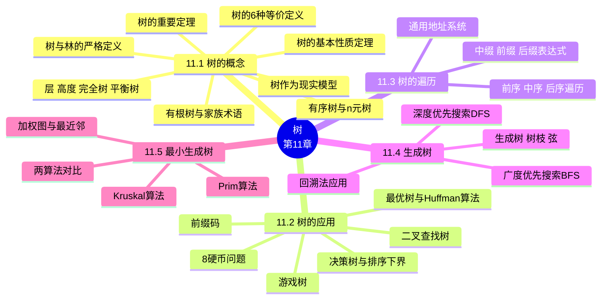

# 树（Trees）

> **本章主线**：以"**树是极简的连通图**"为起点，走一条"识别 → 加结构 → 用工具 → 访问 → 提炼 → 优化"的完整路径：先用**等价定义**（6 条）与**基本性质**（$v=e+1$ 等）识别一棵树；再为树**加上根与次序**（有根树、有序树、n 元树）获得家族术语；接着用树做**应用工具**（二叉查找树、决策树、前缀码、最优树/Huffman 编码）；随后研究**访问方式**（前序/中序/后序遍历与表达式表示）；最后从一般图中**提炼树**（生成树）并**优化其成本**（最小生成树：Prim 与 Kruskal 算法）。
> 一句话版本：**树 = 无回路的连通图，"$v=e+1$"是它的身份证；生成树是图的"骨架"，最小生成树是"最省钱的骨架"；遍历是"按顺序把每个结点都访问一遍"，Huffman 编码是"让高频符号的码最短"**。

---

## 11.1 树的概念（Introduction of Trees）

### 11.1.1 树与林的定义

**树（tree）**：一个**无简单回路**的**连通无向图**称为一棵树，记为 $T$。

**林（forest）**：一个**无简单回路**的无向图称为林（或森林）。可以把它看作一组**结点集合互不相交**的树的集合——林的每个连通分支都是一棵树。

**基本定理（树的特征性质）**：树中**任意两个结点之间都存在唯一的简单路径**。

1. 由连通性，任意两结点之间至少存在一条简单路径；
2. 若存在两条不同的路径，将两条路径合并考察，必然构成一个简单回路，与"无简单回路"矛盾；
3. 故路径唯一。该性质常被当作树的"操作型"定义，与后续 6 条等价定义相呼应。

**例（树的判别）**：给定无向图 $G_1, G_2, G_3, G_4$：

1. $G_1$、$G_3$ 连通且无回路 → 是树；
2. $G_2$ 不连通（有两个连通分支）→ 是林而非树；
3. $G_4$ 连通但含回路 → 既不是树也不是林。

### 11.1.2 树的等价定义

给定图 $T$，以下 6 条关于树的定义是**等价的**，任取其一均可作为树的定义：

| 编号 | 等价定义 | 解读 |
|---|---|---|
| 1) | 无回路的连通图 | 最常用的"基础版"定义 |
| 2) | 无回路且 $e = v - 1$ | 用边数-顶点数关系刻画 |
| 3) | 连通且 $e = v - 1$ | 用边数-顶点数关系刻画 |
| 4) | 无回路，但增加一条新边，得到一个且仅一个回路 | 描述"临界性" |
| 5) | 连通，但删去任一条边后便不连通 | 描述"极简连通性" |
| 6) | 每一对结点间有一条且仅有一条路 | 描述"唯一路径" |

1. 定义 2 与定义 3 分别从"无回路"与"连通"两个方向各取一半，再配合 $e = v-1$ 构成充要条件：$e = v-1$ 单独不足以判定树（还需保证连通或无回路二者其一）；
2. 定义 4 说明树是"回路临界"的：多一条边即生回路，且回路唯一；
3. 定义 5 说明树是"连通临界"的：少一条边即失连通；
4. 定义 6 即 11.1.1 中的基本定理。

> 归纳：**树 = 连通 + 无回路 = 连通 + $v=e+1$ = 无回路 + $v=e+1$**；"连通"与"无回路"加上边数条件可以互相替换，这是判定树的三套等价口径。

### 11.1.3 树的基本性质

**定理 1（树的基本性质）**：设 $T$ 是树，则：

1. **树是平面图**；
2. 树中任二顶点间都有**唯一道路**；
3. 去掉树的任一边，所得子图是**林**（恰好有两棵树）；
4. 在树上任添一条边，产生**唯一回路**；
5. 设 $T = (V, E)$，$|V| = v$，$|E| = e$，则 $v = e + 1$。

**性质 5 的证明一（借助欧拉公式）**：

1. 树是平面图且无回路，故区域数 $\gamma = 1$；
2. 代入欧拉公式 $v - e + \gamma = 2$，得 $v - e + 1 = 2$；
3. 即 **$v = e + 1$**。

**性质 5 的证明二（强归纳法，对顶点数 $v$ 归纳）**：

1. 基始：$v \le 2$ 时，树只有一条边（$v=2$）或无边（$v=1$），$v = e+1$ 显然成立；
2. 归纳假设：设 $v < p$ 时性质成立；
3. 归纳步骤：$v = p$ 时，先移去一条边，由性质 3 知树被分成两棵树 $T_1$ 与 $T_2$；
4. 由归纳假设 $v_1 = e_1 + 1$，$v_2 = e_2 + 1$，且 $e_1 + e_2 = e - 1$；
5. 于是 $v = v_1 + v_2 = (e_1 + 1) + (e_2 + 1) = (e_1 + e_2 + 1) + 1 = e + 1$，性质对 $v = p$ 成立。

**相关术语（按度数刻画）**：

1. 树中**度数为 1** 的结点称为**树叶（leaf）**；
2. 树中**度数大于 1** 的结点称为**分枝（branch）或内点（internal vertex）**。

> 口诀：**树是三"临界"合一——边数临界（$v=e+1$）、连通临界（去边即断）、回路临界（添边即环）**；而 $v=e+1$ 是所有"树特征"中最常用来解题的数量关系。

### 11.1.4 有根树与家族术语

**有向树（directed tree）**：如果有向图 $G = (V, E)$ 所对应的无向图是树，则称 $G$ 为有向树。

**有根树（rooted tree）**：如果有向树存在**唯一一个入次为 0** 的顶点，其余顶点的入次均为 1，则称此有向树为有根树。

1. **根（root）**：有根树中入次为 0 的顶点称为根；
2. **叶（leaf）**：有根树中出次为 0 的顶点称为叶；
3. **枝点（internal vertex）**：有根树中除叶以外的顶点（含根）均为枝点。

在英文语境中，有根树被定义为"指定了一个顶点为根（root）的树"，且所有边（显式或隐式）都**背离根**的方向。有根树的基本术语（家族关系）如下：

1. **父亲/儿子（parent/child）**：有根树 $G = (V, E)$ 中，若 $(a, b) \in E$，则称 $a$ 是 $b$ 的父亲，$b$ 是 $a$ 的儿子；
2. **兄弟（siblings）**：若 $(a, b_1) \in E$ 且 $(a, b_2) \in E$，则称 $b_1$ 与 $b_2$ 互为兄弟；
3. **祖先/后裔（ancestors/descendants）**：若有根树中从 $a$ 到 $c$ 存在道路，则称 $a$ 是 $c$ 的祖先，$c$ 是 $a$ 的后裔；
4. **子树（subtree）**：设 $T = (V, E)$ 是有根树，$a$ 是 $T$ 的枝点，$V_a$ 是 $a$ 及其所有后裔的集合，$E_a$ 是 $a$ 到各后裔道路上边的集合，则 $T_a = (V_a, E_a)$ 称为 **$T$ 的以 $a$ 为根的子树**；
    - 注：以 $a$ 为根的子树**包含根顶点 $a$**；"$a$ 的子树"则特指以 $a$ 的儿子为根的子树。

**顶点道路长度与层（level）**：顶点 $a$ 的道路长（即 $a$ 的层）是指从根到 $a$ 的边的条数，记为 $l(a)$。根的层为 0，往下每层依次为 1, 2, 3, …。

**树高（height）**：有根树的树高指到根最远的顶点的道路长度，即

$$h = \max_{a \in V} l(a)$$

**例（层次标注）**：在一棵有根树中，根在第 0 层，其儿子在第 1 层……以此类推；**高度**就是最大的层编号，也就是树中最长路径的长度。

### 11.1.5 有序树与 n 元树

**有序树（ordered tree）**：对枝点的儿子规定一个次序（如长子、次子等），则此有根树称为有序树。

**左儿子/右儿子（left child/right child）**：有序树中，枝点左边的儿子称为左儿子，右边的儿子称为右儿子；以左儿子为根的子树称为**左子树（left subtree）**，以右儿子为根的子树称为**右子树（right subtree）**。

**有序树 vs 有根树（同构差异）**：同一棵树的结点与边完全相同，仅当把"儿子的次序"也视为结构的一部分时：

1. 作为**有根树**看待：两种画法是**同构**的；
2. 作为**有序树**看待：儿子的左右次序不同 → **不同构**。

**n 元树（n-ary tree）**：每个枝点**最多**有 $n$ 个儿子的有根树称为 n 元树。英文教材定义为：每个内点至多有 $n$ 个儿子（$n \ge 2$）。

**n 元正规树（full n-ary tree）**：每个枝点**恰好**有 $n$ 个儿子的有根树称为 n 元正规树。英文教材定义为：每个内点恰好有 $n$ 个儿子。

**二元树/二叉树（binary tree）**：$n = 2$ 时的 n 元树称为二元树（二叉树）。

**中文教材的细化分类**：

1. **n 叉树**：每个结点的出度小于或等于 $n$ 的根树；
2. **完全 n 叉树**：每个结点的出度恰好等于 $n$ 或 0 的根树；
3. **正则 n 叉树**：所有树叶层次相同的完全 n 叉树。

> 口诀：**n 元树管"上限"（至多 n 子），n 元正规树管"恒量"（恰 n 子）；n 元完全树 = 高度 h 且叶数达到上限 $n^h$，完全树必为正规树**。

### 11.1.6 层、高度、完全树与平衡树

**性质（叶数上界）**：**n 元树高度为 $h$，最多能有 $n^h$ 片叶**。

- 理由：第 $k$ 层的顶点数至多为 $n^k$，故第 $h$ 层（最深层）的叶数不超过 $n^h$。

**n 元完全树（complete n-ary tree）**：如果树高为 $h$ 的 n 元树有 $n^h$ 片叶，称此树为 n 元完全树。

1. 注：**完全树当然是正规的**（既然叶数已达上限，每个内点必然恰好有 $n$ 个儿子）；
2. 例：$n = 2$ 时，高度为 2 的二元完全树有 $2^2 = 4$ 片叶。

**平衡树（balanced）**：高度为 $h$ 的有根 m 元树，若**所有叶都在第 $h$ 层或第 $h-1$ 层**，则称该树是平衡的。

**定理（高度与叶数的关系）**：高度为 $h$ 的 m 元树至多有 $m^h$ 片叶。

**推论**：具有 $\lambda$ 片叶的 m 元树，其高度满足

$$h \ge \lceil \log_m \lambda \rceil$$

若树是**完全且平衡**的，则 $h = \lceil \log_m \lambda \rceil$。

> 该推论是"用树做决策、用树做查找"的分析基石：树的高度决定了从根到叶的最大步数，而叶数决定了"结论的种数"——**结论种数越多，所需高度（步数）的对数下界越大**。

### 11.1.7 树的重要定理与应用模型

**定理 2（完全树的计数关系）**：设有完全 m 叉树，其树叶数为 $t$，分支点（非叶）数为 $i$，则

$$(m - 1)i = t - 1$$

**定理 3（一般树的计数下界）**：若 $T$ 为 m 元树，则 $(m - 1)i \ge t - 1$，其中 $i$ 为枝点数，$t$ 为叶数。

**相关定理（英文教材版本）**：

1. 有 $n$ 个结点的树有 $n - 1$ 条边；
2. 有 $i$ 个内点的**完全 m 元树**共有 $n = mi + 1$ 个结点，并有 $\lambda = (m - 1)i + 1$ 片叶；
    - 证明：内点共有 $mi$ 个儿子（每个内点恰好 $m$ 个），再加上根，即 $n = mi + 1$；而 $\lambda = n - i = (m-1)i + 1$；
    - 推论：给定 $m$，可从 $i$、$n$、$\lambda$ 中的任意一个算出其余两个。

**例 1（接线板问题）**：28 盏灯拟用一个电源插座，问需要多少块四插座接线板？

1. 把问题建模为**完全 4 叉树**：插座的每个插孔是"儿子"，接线板本身是"枝点"，28 盏灯是 28 片"叶"；
2. 由 $(m - 1)i = t - 1$，代入 $m = 4$，$t = 28$，得 $(4 - 1)i = 28 - 1 = 27$；
3. 解得 $i = 9$，故**需要 9 个接线板**。

> 该例演示的核心技巧：**把"物件的嵌套/包含关系"翻译成树的"叶-枝点"计数，用 $(m-1)i = t-1$ 一锤定音**。

**例 2（三地址计算机的加法次数）**：一台三地址计算机，用一个加法指令可求三个数之和，现要计算 12 个数之和，至少需要几次加法指令？

1. 建模：每个加法指令把三个输入合成一个和 → 三叉树的"枝点"；最终的和是根，12 个数是 12 片叶；
2. 由定理 3：$(m - 1)i \ge t - 1$，代入 $m = 3$，$t = 12$，得 $2i \ge 11$，即 $i \ge 5.5$；
3. 取整得 $i = 6$，即**至少需要 6 次加法指令**（这样的树不唯一，见课件图示）。

> 该例演示的核心技巧：**当"恰好"的条件不满足时，把等式 $(m-1)i = t-1$ 放宽为不等式 $(m-1)i \ge t-1$，向上取整得到下界**。

**树作为现实模型（Trees as Models）**：树可用来建模以下对象，建模时需判断用有根树还是无根树：

1. **饱和烃（saturated hydrocarbons）**：甲烷、乙烷、丙烷、丁烷、异丁烷的分子结构——碳原子为枝点、氢原子为叶，分子式为 $C_nH_{2n+2}$ 的烷烃同分异构体恰对应不同的树结构（**化学同分异构物**是树的经典应用）；
2. **组织结构（organizational structures）**：一个组织机构的层次体系——典型的有根树（树根是最高领导）；
3. **计算机文件系统（computer file systems）**：目录与文件的包含关系——典型的有根树（根目录为根）。

**其他树模型实例**：家族树（家谱）、图书十进制分类法、各种运算表达式、判断树（决策树）。课件还给出了数据挖掘中经典的 ID3 决策树示例——根据年龄（age）、是否学生（student）、信用等级（credit rating）、天气（outlook）等属性判断是否"购买电脑（buys_computer）"，并用 SGI/MineSet 3.0 可视化展示分类结果。这类"判断树"正是 11.2 决策树的实例。

---

## 11.2 树的应用（Applications of Trees）

> 本节主线：**用树来"组织数据、做出决策、压缩编码"**——二叉查找树（组织数据以加速检索）、决策树（组织判定以降低比较次数）、前缀码/Huffman 编码（组织码字以缩短总长）。

### 11.2.1 二叉查找树（Binary Search Trees）

**二叉查找树**：一棵二叉树，其中每个结点都存放一个关键字，且满足：左子树中的所有关键字都**小于**该结点关键字，右子树中的所有关键字都**大于**该结点关键字。

- 查找时从根出发：目标比当前结点小则向左，大则向右，等于则命中；
- 树的**高度越低，查找路径越短**——这正是 11.1.6 中"高度下界 $h \ge \lceil \log_2 \lambda \rceil$"的实际意义。

**例（按字母序构造二叉查找树）**：为单词 Mathematics, physics, geography, zoology, meteorology, geology, psychology, chemistry 按字母顺序构造一棵二叉查找树。

1. 按字母序，最小的单词是 chemistry，次小的是 geography，……最大的单词是 zoology；
2. 以字母序中位附近的单词为根，把字母序小于根的单词放入左子树、大于根的单词放入右子树，递归构造（课件给出构造结果图）；
3. 构造完成后，对这棵二叉树做**中序遍历**，恰好输出全部单词的字母序排列。

### 11.2.2 决策树（Decision Trees）

**决策树**：一棵有根树，其中每个**枝点对应一次判定/比较**，每个**叶对应一个结论**。从根到叶的一条路径就是一条完整的决策过程。

**应用一：排序算法的比较次数下界（Minimum Comparisons in Sorting）**

1. 基于两两比较（binary comparison）的排序算法可以表示为一棵**决策树**：每一次比较是一个枝点，叶对应 $n$ 个元素的一种排列；
2. 因此排序 $n$ 个元素的决策树共有 **$n!$ 片叶**；
3. 由 11.1.6 推论，$n!$ 片叶的二叉树高度至少为 $\lceil \log_2 n! \rceil$，故**至少需要 $\lceil \log_2 n! \rceil$ 次比较**；
4. 由斯特林公式，$\lceil \log_2 n! \rceil = \Theta(n \log n)$，故基于两两比较的排序算法平均比较次数为 **$\Omega(n \log n)$**。

**应用二：8 硬币问题（Eight Coins Problem）**

1. 题目：有 7 枚重量相同的硬币和 1 枚比它们都轻的假币，共 8 枚硬币。用一架天平，最少称几次必能找出那枚假币？
2. 分析：每次称量（左盘 vs 右盘）有**三种**结果（左轻/平衡/右轻），所以 $k$ 次称量最多能区分 $3^k$ 种情况；要区分 8 种可能（8 枚中哪一枚是假币），需 $3^k \ge 8$，即 $k \ge \lceil \log_3 8 \rceil = 2$——**2 次是理论下界**；
3. 可行方案（决策树式构造）：
    - 第一次：任取 6 枚，左 3 枚 vs 右 3 枚；
    - 若**不平衡**：假币在较轻的 3 枚中，第二次取其中 2 枚比较——轻者为假币，平衡则第 3 枚是假币；
    - 若**平衡**：假币在剩余 2 枚中，第二次比较这 2 枚——轻者为假币。
4. 结论：**最少 2 次称量必能找出假币**，且 2 次恰好是决策树高度下界 $\lceil \log_3 8 \rceil$ 给出的最优值。（补充说明/拓展）

> 该例演示的核心技巧：**每次比较的"结果分支数"决定了对数底数（天平三结果用 $\log_3$，两两比较用 $\log_2$），先算下界再构造达到下界的方案**。

### 11.2.3 前缀码（Prefix Codes）

**前缀（prefix）**：设 $a$、$b$、$c$ 均为二进制序列，如果 $b = a$ 并列 $c$ 且 $c$ 不是空序列，则称 $a$ 是 $b$ 的前缀——即 $a$ 是 $b$ 的前面一部分。

**前缀码（prefix code）**：一个二进制序列集合，如果其中任意两个二进制序列**互不为前缀**，则称此集合为前缀码。

**二元前缀码**：若符号串集合 $A = \{\beta_1, \beta_2, \ldots, \beta_m\}$ 中任意 $\beta_i$ 与 $\beta_j$（$i \ne j$）互不为前缀，则 $A$ 为前缀码；若其中只出现 0、1 两个符号，则称 $A$ 为**二元前缀码**。

**为什么要前缀码（二义性问题）**：

1. 计算机用 0、1 序列表示和存储信息，通讯编码亦然。26 个英文字母（a–z）用 $v$ 位可表示 $2^v$ 种，因 $2^4 = 16 < 26 < 2^5 = 32$，故需 5 位二进制才能区分 26 个字母；
2. 能否用**不同位数**的二进制数表示信息，以缩短通讯序列总长？可行，但要注意：若 00 表示 A、01 表示 B、0001 表示 z，则收到 0001 究竟是代表 AB 还是 z？
3. 采用**前缀码**即可避免二义性：任何码字都不是另一个码字的前缀，解码时从左到右唯一切分。

**例（前缀码判定）**：

1. $B_1 = \{0, 10, 110, 1111\}$：互不为前缀 → ✓ 前缀码；
2. $B_2 = \{1, 01, 001, 000\}$：互不为前缀 → ✓ 前缀码；
3. $B_3 = \{1, 11, 101, 001, 0011\}$：1 是 11 的前缀，11 是 0011 的前缀 → ✗ 非前缀码；
4. $B_4 = \{b, c, aa, ac, aba, abb, abc\}$：互不为前缀 → ✓ 前缀码；
5. $B_5 = \{b, c, a, aa, ac, aba, abb, abc\}$：a 是 aa、ac、aba 等的前缀 → ✗ 非前缀码。

**前缀码与二叉树的对应关系**：

1. **定理 1**：任意一棵二叉树都可产生一个前缀码（把根到每片叶的路径上 0/1 权值依次排列，即得每片叶对应的码字；因叶不可能成为另一叶的前缀，故所得码集是前缀码）；
2. **定理 2**：任何一个前缀码都对应一棵二叉树（反过来，把每个码字当作根到某叶的路径即可画出这棵树）。

**编码效率的量化**：设 $l_i$ 为第 $i$ 个字母前缀码的长度，$w_i$ 为此字母在 1000 个字母中出现的次数（频率/概率），则

$$\sum_{i=1}^{26} l_i w_i$$

就是这 1000 个字母所需二进制代码的总长度。**目标：构造一棵适当的二元有序加权树，使总长达到最小**——这就是下一小节的最优树问题。

1. 例（26 个字母）：构造树高为 5 的二元树，用其前缀码分别表示各字母，将**常用字母用较短的编码**表示，即可缩短整个通讯序列的长度、提高效率；
2. 由于枝点才可能是叶的前缀，而枝点不对应一个码，故这样的树所有叶对应的码构成前缀码；
3. 二元完全树的叶只有 $2^h$ 片（$h$ 为树高），用二元树的前缀码，最长码长是树高 $h$，最多不超过 $2^h$ 片叶。

### 11.2.4 最优树与 Huffman 算法

**树的权（weight of a tree）**：设树 $T$ 有 $t$ 片叶，对应的权为 $w_1, w_2, \ldots, w_t$（叶以权 $w_i$ 命名），根到叶 $w_i$ 的道路长为 $l(w_i) = l_i$，则称 $T$ 为关于权 $w_1, w_2, \ldots, w_t$ 的二元树，并定义树 $T$ 的**权**为

$$w(T) = \sum_{i=1}^{t} w_i l_i$$

**带权二叉树与最优树（optimal tree）**：

1. **带权二叉树**：每片树叶都带权的二叉树；
2. **带权二叉树的权**：$w(T) = \sum_{i=1}^{t} w_i L(w_i)$，其中 $L(w_i)$ 为带权 $w_i$ 的树叶的通路长度；
3. **最优树**：在所有带权 $w_1, w_2, \ldots, w_t$ 的二叉树中，$w(T)$ 最小的那棵树称为最优树；
4. 注：若对 $w_1, w_2, \ldots, w_t$ 作出了一棵最优的二元有序加权树，则**从根到叶的路径上的权序列集合就是前缀码**。

**最优树的结构定理**：设 $T$ 为带权 $w_1 \le w_2 \le \cdots \le w_t$ 的最优树，则：

1. **带权 $w_1$、$w_2$ 的树叶 $v_{w_1}$、$v_{w_2}$ 是兄弟**（权最小的两片叶深度最深且互为兄弟）；
2. 以树叶 $v_{w_1}$、$v_{w_2}$ 为儿子的分支点，其**通路长最长**；
3. 若将以带权 $w_1$、$w_2$ 的树叶为儿子的分支点改为带权 $w_1 + w_2$ 的树叶，得到的新树 $T'$ **也是最优树**（关于权 $w_1 + w_2, w_3, \ldots, w_t$）。

> 这三条定理把"全局最优化"归约为"局部合并"：**最小的两片叶必须先合并**——这正是 Huffman 算法的理论基础。

**Huffman 算法（构造最优树的递推算法）**：设 $w_1 \le w_2 \le w_3 \le \cdots \le w_t$ 为二元有序树的叶的权：

1. $t = 2$ 时，关于 $w_1, w_2$ 的最优树就是两片叶直接连到根，显然成立；
2. 若关于 $w_1 + w_2, w_3, w_4, \ldots, w_t$ 的最优树 $T'$ 已求出，则用"以 $w_1$、$w_2$ 为叶的子树"替换 $T'$ 中权为 $w_1 + w_2$ 的叶，即得到关于权 $w_1, w_2, \ldots, w_t$ 的最优树 $T$。

**算法执行流程（等价表述）**：

1. 把 $t$ 个权排成一列，每次取最小的两个权合并为一个新权（等于二者之和）；
2. 将新权放回序列中重新排序，重复此步直到只剩下一个权（即树根）；
3. 从根倒推回去，每个"合并点"就是内部结点，其两个儿子权之和等于它——得到完整的最优树；
4. 计算 $w(T) = \sum w_i l_i$ 验证最优性。

**例 3（求带权 7, 10, 11, 13, 17 的最优树）**：

1. 排序：7, 10, 11, 13, 17；
2. 合并最小的 7 和 10 得 17 → 序列变为 11, 13, 17, 17；
3. 合并 11 和 13 得 24 → 序列变为 17, 17, 24；
4. 合并两个 17 得 34 → 序列变为 24, 34；
5. 合并 24 和 34 得 58（根）；
6. 倒推还原：根 58 = 24 + 34；24 = 11 + 13；34 = 17 + 17；17 = 7 + 10；
7. 各叶深度：7 和 10 深度为 3，11、13、一个 17 深度为 2，故
   $$w(T) = 7 \times 3 + 10 \times 3 + 11 \times 2 + 13 \times 2 + 17 \times 2 = 21 + 30 + 22 + 26 + 34 = 133$$

**例 4（13 个权的 Huffman 构造）**：求带权 2, 3, 5, 7, 11, 13, 17, 19, 23, 29, 31, 37, 41 的最优树。

1. 逐轮合并最小的两个权：$2+3=5$，$5+5=10$，$7+10=17$，$11+13=24$，$17+17=34$，$19+23=42$，$24+29=53$，$31+34=65$，$37+41=78$，$42+53=95$，$65+78=143$，$95+143=238$；
2. 根权为 238，树的结构为：根 $238 = 95 + 143$，$95 = 42 + 53$，$143 = 65 + 78$，$42 = 19 + 23$，$53 = 24 + 29$，$65 = 34 + 31$，$78 = 37 + 41$，$34 = 17 + 17$，$24 = 11 + 13$，其中一个 $17 = 10 + 7$，$10 = 5 + 5$，$5 = 2 + 3$（课件图示）；
3. 该树即为这 13 个权的最优树。

**例 5（字母频率与 Huffman 编码，完整三步）**：已知字母 A, B, C, D, E, F, G 出现的频率分别为 A–35, B–20, C–15, D–10, E–10, F–5, G–5。

**第一步：求带权 5, 5, 10, 10, 15, 20, 35 的最优二叉树。**

1. 排序：5, 5, 10, 10, 15, 20, 35；
2. 合并 5 + 5 = 10 → 10, 10, 10, 15, 20, 35；
3. 合并两个 10 得 20 → 10, 15, 20, 20, 35；
4. 合并 10 + 15 = 25 → 20, 20, 25, 35；
5. 合并 20 + 20 = 40 → 25, 35, 40；
6. 合并 25 + 35 = 60 → 40, 60；
7. 合并 40 + 60 = 100（根）；
8. 树结构：根 100 = 40 + 60；40 = 20 + 20（一个 20 = 10 + 10，另一个 20 即 B）；60 = 25 + 35；25 = 10 + 15（10 是 F、G 合并所得，15 即 C）；35 即 A。

**第二步：求 T 所对应的前缀码（约定左儿子权 0、右儿子权 1，从根到叶的路径权值序列即码字）。**

$$A = \{01, 11, 001, 100, 101, 0000, 0001\}$$

**第三步：树叶 $v_i$ 带权 $w_i$，用其码字表示出现频率为 $w_i\%$ 的字母。**

1. 权 35（A）→ 码 11；
2. 权 20（B）→ 码 01；
3. 权 15（C）→ 码 101；
4. 权 10（D）→ 码 100；
5. 权 10（E）→ 码 001；
6. 权 5（F）→ 码 0001；
7. 权 5（G）→ 码 0000。

即 **11→A，01→B，101→C，100→D，001→E，0001→F，0000→G**。

1. 检验前缀性：七个码字互不为前缀 → 是前缀码；
2. 计算总长：$w(T) = 35 \times 2 + 20 \times 2 + 15 \times 3 + 10 \times 3 + 10 \times 3 + 5 \times 4 + 5 \times 4 = 70 + 40 + 45 + 30 + 30 + 20 + 20 = 255$，而等长编码需 $7 \times 3 = 21$ 位/字母 × 频率折算，前缀码显著缩短了高频字母（A、B）的码长。

> 该例演示的核心技巧：**Huffman 三步曲——先合并出最优树，再定 0/1 边标号，最后沿根到叶路径读出码字；"高频字母码短、低频字母码长"就是最优性的直观体现**。

**例 6（Huffman 构造与最优性验证）**：构造关于权 $\{2, 3, 4, 4, 5, 5, 7\}$ 的最优树。

1. 逐轮合并：$\{2,3,4,4,5,5,7\} \to \{4,4,5,5,5,7\} \to \{5,5,5,7,8\} \to \{5,7,8,10\} \to \{8,10,12\} \to \{12,18\} \to \{30\}$；
2. 倒推还原树：30 = 12 + 18；12 = 5 + 7；18 = 8 + 10；8 = 4 + 4；10 = 5 + 5；5 = 2 + 3；
3. 各叶深度：2、3 深度为 3；4、4 深度为 3；5、5 深度为 3；7 深度为 2；
4. 计算树的权：
   $$w(T) = 2 \times 3 + 3 \times 3 + 7 \times 2 + 4 \times 3 + 4 \times 3 + 5 \times 3 + 5 \times 3 = 6 + 9 + 14 + 12 + 12 + 15 + 15 = 83$$

**例 6 续（另构造 ≠ 最优）**：若不用 Huffman 方法而随意构造（把 7 放在深度 1、其余依次加深），如 $w_i$ 依次为 7, 5, 5, 4, 4, 3, 2，深度 $l_i$ 依次为 1, 2, 3, 4, 5, 6, 6，则

$$w(T) = 7 \times 1 + 5 \times 2 + 5 \times 3 + 4 \times 4 + 4 \times 5 + 3 \times 6 + 2 \times 6 = 7 + 10 + 15 + 16 + 20 + 18 + 12 = 98$$

1. $98 > 83$，可见**权大的叶放得越浅、权小的叶放得越深，总权越小**；
2. Huffman 算法正是把这一直觉形式化：**每次合并最小两权，保证大树"深而权小"、小树"浅而权大"**。

> 口诀：**Huffman 想省钱，就把"大权放浅层、小权沉底层"；每轮合并最小俩，倒推读出前缀码**。

**例 7（前缀码解码应用）**：给定一棵编码树（部分码字如 11100→a，000→h，10→i，01→o，001→v，010→e，110→y，11→u 等），对二进制串进行唯一解码：

1. 串 0000000111000101010110111 从根出发按 0/1 逐位下行，遇叶即输出一个字符，从根重新开始；
2. 按此规则解码可得到 "I love you"（以及另一种切分 "I have you" 的歧义演示，见课件图示）；
3. 串 010101000100001111 解码为 "Good bye"。

> 该例演示的核心技巧：**前缀码保证解码的"贪心切分"永远正确——从左到右能切多短就切多短，因为任何码字都不是其他码字的前缀**。

### 11.2.5 游戏树（Game Trees）

**游戏树**：把棋类等对弈过程建模为树——根是初始局面，每个枝点是一个局面，每个儿子是当前方的一步合法走法，叶是终局。

1. 游戏树在人工智能（博弈搜索、minimax 算法）中有重要应用；
2. 决策树与游戏树的共同点：**从根到叶的路径对应一条"完整决策序列"，树的深度即决策步数**。

---

## 11.3 树的遍历（Tree Traversal）

> 本节主线：**"访问"一棵树 = 按某种顺序不重不漏地拜访每个结点**。先引入通用地址系统（一种全局编号），再给出三种遍历顺序（前序/中序/后序），最后把遍历应用于表达式的三种表示法。

### 11.3.1 通用地址系统（Universal Address Systems）

**通用地址系统**：给有序根树的每个结点一个唯一的"点分十进制"地址：

1. 根记作 0；
2. 根的 $k$ 个儿子从左到右记作 1, 2, …, $k$；
3. 任一结点 $v$ 的地址由其父亲的地址后接".序号"构成（如根的第 1 个儿子的第 2 个儿子记作 1.2）；
4. 从根到叶逐层扩展，直到所有结点都有地址。

**通用地址系统与遍历的关系**：对所有地址按**字典序**（先比较第一段，再比较第二段，……）排列，恰好得到这棵有序树的前序遍历顺序。

**例（地址标注与字典序）**：对课件图示的有序树，根的 5 棵子树分别标 1, 2, 3, 4, 5，继续向下标注得：

$$0 < 1 < 1.1 < 1.2 < 1.3 < 2 < 3 < 3.1 < 3.1.1 < 3.1.2 < 3.1.2.1 < 3.1.2.2 < 3.1.2.3 < 3.1.2.4 < 3.1.3 < 3.2 < 4 < 4.1 < 5 < 5.1 < 5.1.1 < 5.2 < 5.3$$

1. 这个从小到大排列的地址序列，正是该树的前序遍历结果；
2. 通用地址系统把"树的遍历"转化为"字符串的字典序排序"，在计算机科学（目录编号、公文编号）中应用广泛。

### 11.3.2 前序、中序与后序遍历

**访问（visiting）**：在顶点处执行适当的任务（读取、输出、处理）。

**遍历/周游（traversal / tree search）**：按某种特定顺序访问树中每个顶点一次的过程，又称树的搜索（walking / traversing）。

**定义 1（前序遍历 preorder traversal）**：设 $T$ 是以 $r$ 为根的有序树。若 $T$ 只含 $r$，则 $r$ 就是 $T$ 的前序遍历；否则设 $T_1, T_2, \ldots, T_n$ 是 $r$ 处从左到右的各棵子树，前序遍历**先访问根 $r$，再依次按前序遍历 $T_1, T_2, \ldots, T_n$**。

**定义 2（中序遍历 inorder traversal）**：设 $T$ 是以 $r$ 为根的有序树。若 $T$ 只含 $r$，则 $r$ 就是 $T$ 的中序遍历；否则**先按中序遍历 $T_1$，再访问根 $r$，然后依次按中序遍历 $T_2, \ldots, T_n$**。

**定义 3（后序遍历 postorder traversal）**：设 $T$ 是以 $r$ 为根的有序树。若 $T$ 只含 $r$，则 $r$ 就是 $T$ 的后序遍历；否则**先按后序遍历 $T_1, T_2, \ldots, T_n$，最后访问根 $r$**。

**二元树的三种遍历（简洁版）**：

1. **前序周游（preorder）**：先游根，再游左子树，后游右子树；
2. **中序周游（inorder）**：先游左子树，再游根，后游右子树；
3. **后序周游（postorder）**：先游左子树，再游右子树，最后游根。

**递归算法实现**：设 $T(v_L)$、$T(v_R)$ 分别是以左、右儿子 $v_L$、$v_R$ 为根的子树：

1. **算法 preorder**：第 1 步访问 $v$；第 2 步若 $v_L$ 存在，则对 $(T(v_L), v_L)$ 应用本算法；第 3 步若 $v_R$ 存在，则对 $(T(v_R), v_R)$ 应用本算法；
2. **算法 inorder**：第 1 步若 $v_L$ 存在，则搜索左子树 $(T(v_L), v_L)$；第 2 步访问根 $v$；第 3 步若 $v_R$ 存在，则搜索右子树 $(T(v_R), v_R)$；
3. **算法 postorder**：第 1 步若 $v_L$ 存在，则搜索左子树；第 2 步若 $v_R$ 存在，则搜索右子树；第 3 步访问根 $v$。

> 口诀：**三种遍历的区别只在"根何时被访问"——前序根最先，中序根居中，后序根最后；左子树永远先于右子树**。

**例 8（大树的三种遍历）**：对课件图示的有根树（根 $a$，其儿子依次为 $b, c, d$；$b$ 的儿子为 $e$，$c$ 的儿子为 $f$，$d$ 的儿子为 $g, h, i$；$e$ 的儿子为 $j$，$f$ 的儿子为 $k$，$g$ 的儿子为 $l, m$；$j$ 的儿子为 $n$，$k$ 的儿子为 $o, p$），求三种遍历：

1. **前序**：$a, b, e, j, k, n, o, p, f, c, d, g, l, m, h, i$；
2. **中序**：$j, e, n, k, o, p, b, f, a, c, l, g, m, d, h, i$；
3. **后序**：$j, n, o, p, k, e, f, b, c, l, m, g, h, i, d, a$。

> 该例演示的核心技巧：**前序看"根先"，中序看"根居中"，后序看"根最后"——分别把每个子树当成一个整体递归套用即可，尤其要注意中序里根的位置决定了左右子树的先后**。

**例 9（另一棵树）**：对根 $a$（儿子 $b, c$；$b$ 的儿子 $d$；$d$ 的儿子 $g$；$c$ 的儿子 $e, f$；$e$ 的儿子 $h, i$）的树：

1. **前序**：$a, b, d, g, e, h, i, c, f$；
2. **中序**：$g, d, b, h, e, i, a, c, f$；
3. **后序**：$g, d, h, i, e, b, f, c, a$。

### 11.3.3 中缀、前缀与后缀表示法（Infix, Prefix, Postfix Notation）

用一棵**表达式树**（二元树）表示算术表达式：叶子是操作数，枝点是运算符。对表达式树做三种遍历，恰好得到表达式的三种写法：

| 表示法 | 遍历方式 | 别名 | 特点 |
|---|---|---|---|
| **中缀表示法（infix）** | 中序遍历 | 通常写法 | 有歧义（需括号定优先级） |
| **前缀表示法（prefix）** | 前序遍历 | 波兰式（Polish notation） | 无括号、无歧义，运算符号在操作数之前 |
| **后缀表示法（postfix）** | 后序遍历 | 逆波兰式（reverse Polish notation） | 无括号、无歧义，运算符号在操作数之后 |

**例 10（表达式树的三种表示）**：对表示 $((x+y)^2+((x-4)/3))$ 的表达式树：

1. **前缀（Prefix）**：$+\, \wedge\, +\, x\, y\, 2\, /\, -\, x\, 4\, 3$，即 `+^+xy2/-x43`；
2. **中缀（Infix）**：$x + y \, \wedge \, 2 + x - 4 / 3$，即 `x+y^2+x-4/3`（需靠括号消除歧义）；
3. **后缀（Postfix）**：$x\, y\, +\, 2\, \wedge\, x\, 4\, -\, 3\, /\, +$，即 `xy+2^x4-3/+`。

1. 前缀表达式的求值：**从右到左**扫描，遇到运算符即对其后的两个操作数运算（或从左到右扫描配合栈）；
2. 中缀表达式有歧义：$x+y^2+x-4/3$ 不借助括号无法确定运算优先级与结合次序；
3. 后缀表达式的求值：**从左到右扫描，遇到操作数压栈，遇到运算符弹出两个操作数运算后压回**，最终栈顶即结果。

**例 11（后缀表达式求值）**：计算后缀表达式 `n a b - c d e / + *`，其中 $n = 2$，$a = 2$，$b = 1$，$c = 3$。

1. 从左到右扫描：$n=2$ 压栈，$a=2$ 压栈，$b=1$ 压栈；
2. 遇 `-`：弹出 $1$ 与 $2$，算 $2 - 1 = 1$，压回；
3. $c=3$ 压栈，$d$、$e$ 依次压栈（课件演示中 $d$、$e$ 取相应数值）；
4. 遇 `/`：弹出 $e$ 与 $d$，算 $d / e$，压回；
5. 遇 `+`：弹出前两步结果，求和，压回；
6. 遇 `*`：弹出两个数相乘，得最终结果。

> 该例演示的核心技巧：**后缀表达式的求值是纯栈操作——"数字进栈、运算符出栈两数"，完全不依赖括号与优先级**；这正是逆波兰式在计算机中广泛使用的原因。

**公式的三种表示方法（应用总结）**：

1. **Infix notation**：中缀表示法——人类阅读习惯，但需要括号；
2. **Prefix notation（Polish notation）**：前缀表示法（波兰式）——运算符号位于其操作数之前，从左到右无需括号即可无歧义地表达；
3. **Postfix notation（reverse Polish notation）**：后缀表示法（逆波兰式）——运算符号位于其操作数之后，配合栈可直接求值。

---

## 11.4 生成树（Spanning Trees）

> 本节主线：**从"图"中提炼"树"**。一棵树是图的"最小连通骨架"：保留全部顶点、只删边，直到无回路为止。本节回答三个问题——什么样的图有生成树（存在性）、怎么找生成树（DFS/BFS）、生成树还能解决什么问题（回溯法）。

### 11.4.1 生成树的定义与存在性

**生成树（spanning tree）**：设 $G$ 是简单图，$G$ 的生成树是 $G$ 的一个**子图**，它是一棵树且**包含 $G$ 的全部顶点**。

1. $T$ 是与 $G$ **顶点完全相同**的一棵树；
2. $T$ 可由 $G$ **删去若干条边**得到；
3. 等价定义：$G$ 的**生成子图**（包含全部顶点）若是树，则称为 $G$ 的生成树，记为 $T = (V, E')$，其中 $E' \subseteq E$。

**相关术语**：

1. **树枝（branch）**：生成树 $T$ 中的边；
2. **弦（chord）**：$G$ 中不在生成树 $T$ 中的边；
3. **生成树的补（complement）**：所有弦的集合。

**定理 1（生成树的存在性）**：无向简单图 $G = (V, E)$ 存在生成树的**充要条件**是 $G$ **连通**。

1. **必要性**：$T$ 是生成子图，包含 $G$ 的所有顶点；$T$ 是树，故 $T$ 连通；$T$ 连通且含全部顶点，故 $G$ 连通；
2. **充分性**：若 $G$ 连通：
    - (1) 若 $G$ 无回路，则 $G$ 本身就是树，即 $G$ 的生成树；
    - (2) 若存在回路，**去掉回路中的任一边**，不影响连通性，也不减少顶点；把每个回路都移去一条边，剩下的子图包含所有顶点、无回路且连通，即为生成树。

**推论与注记**：

1. 移去边时可随意选择，故**一个连通图可有多个生成树**（生成树不唯一）；
2. 生成树是 $G$ 的**最小连通生成子图**：若把 $G = (V, E)$ 看成各顶点间的通讯联络图，则生成树 $T = (V, E')$ 就是各顶点间直接或间接联络的**最小通讯联络图**；
3. 每棵生成树恰有 $v - 1$ 条边（由 $v = e + 1$），故连通图 $G$ 中"删边数 = $e - v + 1$"，这个数称为 $G$ 的**回路秩**。

**应用实例（IP 组播 IP Multicasting）**：IP 组播是为优化网络资源而使用的技术，用于多点工作方式下的应用，是标准 IP 网络层协议的一个扩展。其核心思想是：**通过一个 IP 地址向一组主机发送数据（UDP 包）**——发送者只向一个组地址发送信息，接收者加入该组即可接收，所有接收者收到同一个数据流；组成员动态变化，可随时加入或退出，每台主机可同时加入多个组。组播可有效避免重复发送引起的广播风暴，并突破路由器的限制将数据包传送到其他网段。生成树（组播分发树）在其中承担"以最少边把数据送达所有接收者"的角色。

### 11.4.2 深度优先搜索（Depth-First Search, DFS）

**深度优先搜索**：从某个顶点出发构造连通图生成树的方法，核心思想是"**沿着一条路走到黑，走不动了再回头**"：

1. 从起始顶点开始，任选一条边走到一个新顶点，并把该边标为**树边（tree edge）**；
2. 持续"走到一个新顶点"的过程，直到当前顶点没有未访问的相邻顶点；
3. 此时**回溯（backtrack）**到最近的有未访问相邻顶点的顶点，继续深入；
4. 重复直到所有顶点都被访问，树边构成的子图即一棵生成树；
5. 被跳过（不选作树边）的边称为**回边（back edge）**。

**例（DFS 生成树）**：对课件图示的连通图，从顶点 $a$ 出发按深度优先搜索得到一棵生成树，树边与回边在图中明确区分（课件图示）。

**实现要点**：

1. 用**栈**（或递归）模拟"走到黑 + 回溯"的过程；
2. 需要维护"已访问"标记，避免重复访问与成环；
3. 对 $n$ 个顶点 $e$ 条边的图，DFS 的时间复杂度为 $O(n + e)$。

### 11.4.3 广度优先搜索（Breadth-First Search, BFS）

**广度优先搜索**：构造生成树的另一方法，核心思想是"**一层一层地推进**"：

1. 从起始顶点开始，把它的所有相邻顶点都访问一遍（各自与起始顶点的边均为树边）；
2. 然后按"先被访问的先扩展"的顺序，依次访问每个已访问顶点的未访问相邻顶点；
3. 逐层向外推进，直到所有顶点都被访问，树边构成的子图即一棵生成树。

**例（BFS 生成树）**：对课件图示的连通图，从顶点 $a$ 出发按广度优先搜索逐层访问，得到一棵以 $a$ 为根的生成树（课件图示）。

**DFS 与 BFS 对比**：

| 维度 | DFS（深度优先） | BFS（广度优先） |
|---|---|---|
| 推进策略 | 一条路走到底再回溯 | 一层一层向外扩张 |
| 数据结构 | 栈（或递归） | 队列 |
| 生成树形态 | "深而窄"的树 | "浅而宽"的树 |
| 适用场景 | 搜索所有解、回溯问题 | 最短路径、层次遍历 |

> 口诀：**DFS 用栈"走到底再回头"，BFS 用队列"逐层往外扫"；两者都能生成树，一个深一个浅**。

### 11.4.4 回溯法（Backtracking）

**回溯法**：一种系统化的搜索方法——把问题的解空间组织成**决策树/搜索树**，从根出发深度优先地探索；一旦发现当前分支不可能产生可行解（或已求出目标），就**回溯**到上一个枝点改走其他分支。

**应用一：图的着色问题（Graph Colorings）**：如何用回溯法判定一个图能否用 $n$ 种颜色着色？

1. 把顶点按顺序编号，决策树的第 $i$ 层对应"给第 $i$ 个顶点选颜色"；
2. 每个枝点有 $n$ 个分支（$n$ 种颜色可选）；
3. 若某顶点选色后与其已着色邻点冲突，则剪去该分支并回溯；
4. 若能给所有顶点都成功着色 → 可用 $n$ 色；否则尝试其他颜色组合，全部失败 → 不可用 $n$ 色。

**应用二：n 皇后问题（n-Queens Problem）**：

1. 把"逐行放皇后"作为决策树的层次结构，第 $i$ 层对应第 $i$ 行皇后放在哪一列；
2. 若新放的皇后与已有皇后同列或同对角线，则剪枝回溯；
3. 走完整棵树即可找出全部可行摆法。

**应用三：子集和问题（Sums of Subsets）**：给定正整数集合 $x_1, x_2, \ldots, x_n$，找和为 $M$ 的子集。

1. 把"是否选 $x_i$"作为决策树的二叉分支（选/不选），第 $i$ 层对应第 $i$ 个元素；
2. 已选和 $> M$ 或剩余元素全部选上也达不到 $M$ 时剪枝回溯；
3. 例：求集合 $\{31, 27, 15, 11, 7, 5\}$ 中和为 39 的子集——回溯可得 $\{31, 7\}$ 等可行解。

**应用延伸（Web Spiders 网络爬虫）**：搜索引擎蜘蛛（Spider/Robot/Crawler）是一个自动遍历 Web 的程序——它从历史 URL 列表出发请求文档，访问新网站时检查是否已收录，已收录则更新变化。爬虫抓取网页链接的过程本质上就是**对 Web 这张巨大的"图"做搜索/遍历**，其"从已发现链接继续向外发现新链接"的机制正是 BFS/DFS 思想的工程化应用。

---

## 11.5 最小生成树（Minimum Spanning Trees）

> 本节主线：**给图的边加上"成本"（权）后，求"最省的骨架"**。两个经典贪心算法——Prim（加点法）与 Kruskal（加边法），都通过"每步选当前最优的边"达到全局最优。

### 11.5.1 加权图与最小生成树

**加权图（weighted graph）**：每条边都被标注一个数值（称为该边的**权 weight**）的图。

1. 边 $(v_i, v_j)$ 的权有时被称为顶点 $v_i$ 与 $v_j$ 之间的**距离（distance）**；
2. **最近邻（nearest neighbor）**：若顶点 $u$ 与 $v$ 相邻，且没有其他顶点通过比 $(u, v)$ 权更小的边与 $v$ 相连，则称 $u$ 是 $v$ 的一个最近邻——注意 $v$ 可能有**多个**最近邻；
3. 推广到集合：$v$ 是顶点集合 $V = \{v_1, v_2, \ldots, v_k\}$ 的最近邻，若 $v$ 与 $V$ 中某个成员相邻，且没有其他与 $V$ 中成员相邻的顶点被权比 $(v, v_i)$ 更小的边相连（$v$ 本身可以属于 $V$）；
4. 例：$V = \{C, E, J\}$ 时，$D$ 是 $V$ 的最近邻（课件图示）。

**最小生成树（minimal spanning tree, MST）**：加权连通无向图的一棵生成树，若其所有边的权之和**尽可能小**，则称为最小生成树。

1. 最小生成树一定是生成树（含全部顶点、$v-1$ 条边、连通无回路）；
2. 目标：在全部 $v-1$ 条边的生成树中，找总权最小者。

### 11.5.2 Prim 算法

**Prim 算法（加点法）**：设 $G$ 是带权连通无向图，有 $n$ 个顶点：

1. 初始化：$T$ 取一条**权最小的边**；
2. 循环（$i := 1$ 到 $n - 2$）：
    - (1) 选一条**权最小**、**与 $T$ 中某个顶点关联**、且**加入 $T$ 后不形成简单回路**的边 $e$；
    - (2) 把 $e$ 加入 $T$；
3. 结束循环后，$T$ 就是 $G$ 的一棵最小生成树。

**算法特征**：

1. Prim 算法始终保持 $T$ 是一棵树（连通、无回路），每次只**向外添加一个顶点**，直到覆盖全部 $n$ 个顶点；
2. 每步贪心地选"当前可达的最小权边"，不回头调整。

**例（Prim 算法求最小生成树）**：（补充说明/拓展，以 6 顶点加权图为例演示）

给定带权图，顶点为 $v_1, v_2, \ldots, v_6$，边及权为：$v_1v_2=2$，$v_1v_3=3$，$v_1v_4=6$，$v_2v_3=4$，$v_2v_5=7$，$v_3v_4=5$，$v_3v_5=8$，$v_4v_5=9$，$v_4v_6=1$，$v_5v_6=10$：

1. 初始 $T$ 取最小权边 $v_4v_6$（权 1）；
2. $T$ 中顶点集 $\{v_4, v_6\}$，与其关联的最小权边为 $v_1v_4$（权 6）→ 加入 $T$；
3. 顶点集 $\{v_1, v_4, v_6\}$，关联最小权边为 $v_1v_2$（权 2）→ 加入 $T$；
4. 顶点集 $\{v_1, v_2, v_4, v_6\}$，关联最小权边为 $v_1v_3$（权 3）→ 加入 $T$；
5. 顶点集 $\{v_1, v_2, v_3, v_4, v_6\}$，关联最小权且不构成回路的边为 $v_3v_5$（权 8）→ 加入 $T$；
6. 共选 5 条边，最小生成树为 $\{v_4v_6, v_1v_4, v_1v_2, v_1v_3, v_3v_5\}$，总权 $1 + 6 + 2 + 3 + 8 = 20$。

> 该例演示的核心技巧：**Prim 每步只从"已入选顶点集"向外挑最小权边，且用"不成回路"排除会闭合的边——树始终是连通的**。

**定理 2（Prim 算法正确性）**：Prim 算法对图 $G$ 产生一棵最小生成树。

**证明思路（归纳法）**：

1. 设 Prim 算法选出的边依次为 $t_1, t_2, \ldots, t_{n-1}$，记 $T_i$ 为含 $t_1, \ldots, t_i$ 的树（$T_0 = \emptyset$），则 $T_0 \subset T_1 \subset \cdots \subset T_{n-1} = T$；
2. 用数学归纳法证明：每个 $T_i$ 都包含在 $G$ 的某棵最小生成树中；
3. **基始**：$P(0)$：$T_0 = \emptyset$ 显然包含在每棵最小生成树中；
4. **归纳步骤**：设 $P(k)$ 成立，即 $T_k$ 包含在某棵最小生成树 $T'$ 中（$\{t_1, \ldots, t_k\} \subseteq T'$）：
    - (1) 若 $t_{k+1} \in T'$，则 $T_{k+1} \subseteq T'$，$P(k+1)$ 成立；
    - (2) 若 $t_{k+1} \notin T'$，则 $T' \cup \{t_{k+1}\}$ 必含一个回路；该回路含若干条 $T'$ 的边，且不可能全部属于 $T_k$（否则 $T_{k+1}$ 含该回路）；
    - (3) 取该回路中**不在 $T_k$ 里、编号最小**的边 $s_l$：当 Prim 算法选择 $t_{k+1}$ 时，$s_l$ 也是可用候选边，故 $s_l$ 的权不小于 $t_{k+1}$ 的权；
    - (4) 于是 $(T' - \{s_l\}) \cup \{t_{k+1}\}$ 是含 $T_{k+1}$ 的生成树，其总权不超过 $T'$，故也是最小生成树，$P(k+1)$ 成立；
5. 由归纳法 $T_{n-1} = T$ 包含在某棵最小生成树中且边数相同（$n-1$ 条），故 $T$ 本身就是最小生成树。Q.E.D.

### 11.5.3 Kruskal 算法

**Kruskal 算法（加边法）**：设 $G$ 是带权连通无向图，有 $n$ 个顶点，$S = \{e_1, e_2, \ldots, e_k\}$ 是 $G$ 的全部加权边：

1. **第 1 步**：在 $S$ 中选一条**权最小**的边 $e_1$，令 $E = \{e_1\}$，并把 $S$ 替换为 $S - \{e_1\}$；
2. **第 2 步**：在 $S$ 中选一条**权最小**、且**与 $E$ 中成员不构成回路**的边 $e_i$，把 $E$ 替换为 $E \cup \{e_i\}$，$S$ 替换为 $S - \{e_i\}$；
3. **第 3 步**：重复第 2 步，直到 $|E| = n - 1$（此时 $E$ 中的边构成最小生成树）。

**算法特征**：

1. Kruskal 每步在**全局剩余边**中挑最小权边，只检查"是否成环"，不要求新边与已选边相邻；
2. 需要用到"并查集"等工具判断加入一条边后是否形成回路（两端点是否已在同一连通分量中）。

**例（Kruskal 算法求最小生成树）**：对课件图示的 8 顶点带权图（顶点 $v_1, \ldots, v_8$），用 Kruskal 算法求最小生成树。

**第 1 步：把全部边按权从小到大排序**：

$$(v_1,v_2),\, (v_2,v_7),\, (v_1,v_6),\, (v_6,v_7),\, (v_1,v_4),\, (v_5,v_6),\, (v_4,v_5),\, (v_3,v_4),\, (v_3,v_8),\, (v_5,v_8),\, (v_2,v_3),\, (v_7,v_8)$$

（权依次为 1, 2, 3, 4, 5, 6, 7, 8, 9, 10, 11, 12）

**第 2 步：从最小的边开始依次选边（跳过会成环的边）**：

1. 选 $e_1 = (v_1, v_2)$（权 1）；
2. 选 $e_2 = (v_2, v_7)$（权 2）；
3. 选 $e_3 = (v_1, v_6)$（权 3）；
4. 跳过 $(v_6, v_7)$（权 4）：$v_6$ 与 $v_7$ 已通过 $v_1$ 连通，加入会成环；
5. 选 $e_4 = (v_1, v_4)$（权 5）；
6. 选 $e_5 = (v_5, v_6)$（权 6）；
7. 跳过 $(v_4, v_5)$（权 7）：$v_4$ 与 $v_5$ 已连通，加入会成环；
8. 选 $e_6 = (v_3, v_4)$（权 8）；
9. 选 $e_7 = (v_3, v_8)$（权 9）；
10. 跳过 $(v_5, v_8)$（权 10）、$(v_2, v_3)$（权 11）、$(v_7, v_8)$（权 12）：两端均已连通，成环；
11. 此时 $|E| = 7 = n - 1$，算法结束。

**第 3 步：输出结果**。

最小生成树边集为

$$\{(v_1,v_2),\, (v_2,v_7),\, (v_1,v_6),\, (v_1,v_4),\, (v_5,v_6),\, (v_3,v_4),\, (v_3,v_8)\}$$

总权 $= 1 + 2 + 3 + 5 + 6 + 8 + 9 = 34$。

> 该例演示的核心技巧：**Kruskal 按权从小到大加边，唯一需要警惕的是"成环判断"——一旦两端点已在同一连通分量中（已通过若干树边连通），这条边就必须跳过**。

### 11.5.4 两种算法对比

| 维度 | Prim 算法 | Kruskal 算法 |
|---|---|---|
| 策略 | 加点法：从一点出发逐步扩成一棵树 | 加边法：从全图选边逐步连成一片 |
| 每步选择 | 与当前树相连的最小权边 | 全图中不构成回路的最小权边 |
| 边的来源 | 只从"树边集的关联边"中选 | 从全部剩余边中选 |
| 数据结构 | 邻接矩阵/优先队列维护最近距离 | 并查集判断是否成环 |
| 典型复杂度 | $O(n^2)$（稠密图合适） | $O(e \log e)$（稀疏图合适） |
| 正确性依据 | 定理 2（割性质/归纳证明） | 类似的"安全边"论证 |

> 口诀：**Prim 点扩张、Kruskal 边排序；稠密用 Prim、稀疏用 Kruskal——两者都贪心，且都能得到全局最优**（贪心选择性质 + 最优子结构保证）。

---

### 知识定位与框架衔接

#### 前置知识（地基，来自离散数学（上）与本章之前内容）

1. **图论基础（上一章）**：图、无向图、连通、回路/简单回路、子图、生成子图、度数等概念——树的定义（无回路连通图）完全建立在图论语言之上；欧拉公式 $v - e + \gamma = 2$ 直接给出 $v = e + 1$。
2. **集合与函数**：集合运算与子集概念——树的子树、生成树、前缀码的码集等都是集合语言的运用；$A \times A$ 上函数的"处处定义、单值性"在遍历算法中体现为"每个结点恰被访问一次"。
3. **数学归纳法**：树的基本性质（$v = e+1$ 的强归纳证明）、Prim 算法正确性证明都依赖归纳法——这是把"局部操作"推广为"全局结论"的核心工具。

#### 后置知识（上层建筑，离散数学（下）后续内容与计算机科学）

1. **群与编码（Groups and Coding）**：前缀码/Huffman 编码与纠错码、线性码共享"用代数结构设计高效通信方案"的思想；码字集合的代数性质是编码理论的核心。
2. **数据结构与算法（数据结构、算法设计课程）**：二叉查找树、堆、并查集、Huffman 编码是经典数据结构；DFS/BFS 是图算法的基础模板；Prim/Kruskal 是贪心算法的标准范例。
3. **算法设计与分析**：本章反复出现的"决策树下界"（$\lceil \log_2 n! \rceil$）、"贪心正确性证明"（归纳/交换论证）是复杂度理论与近似算法的预演。

#### 本章在整个课程中的位置（盖房子比喻）

- 本章相当于**盖房子时的"承重梁与桁架"**：树是"最省材料的连通结构"（$v-1$ 条边撑起 $v$ 个顶点），生成树是"从复杂图纸里抽出承重骨架"，最小生成树是"用最少的钢梁保证全屋连通"。
- **树的地位特殊**：它是图论中"既简单又处处出现"的结构——简单到只有 $v-1$ 条边，又强大到能编码、能决策、能压缩、能连通。全章主线可记为**"识别（11.1）→ 加构（11.1）→ 应用（11.2）→ 访问（11.3）→ 提炼（11.4）→ 优化（11.5）"**。
- 学习节奏建议：**先吃透 11.1 的等价定义与 $v=e+1$（一切树问题的数量基础）→ 再掌握 11.2 的 Huffman 构造流程（最常考的动手题）→ 然后熟练三种遍历与表达式转换（11.3）→ 最后理解 DFS/BFS 与 Prim/Kruskal 的贪心逻辑（11.4、11.5）**。

#### 核心灵魂问题（学完本章应能回答）

1. **为什么"树"有 6 条等价定义？$v = e + 1$ 为什么是其中最有力的"数量身份证"？** —— 因为"连通"与"无回路"这两个性质在"极简边数"处重合：边数恰为 $v-1$ 时，连通与无回路互相蕴含（只满足一个条件且 $e = v-1$，另一个自动成立）。$v = e+1$ 把"结构性质"转化为"可计算的等式"，是证明生成树存在性、计算回路秩等问题的万能钥匙。
2. **Huffman 编码为什么"每次合并最小的两个权"就必然得到全局最优？** —— 因为最优树的结构定理保证：权最小的两片叶必是兄弟且深度最深；把这两片叶合并成一片"和权"叶后，新问题仍是同一类型的更小最优树问题（最优子结构）。若违反"先合并最小两权"（例 6 的 98 vs 83），大权叶被放浅的收益远小于小权叶被放深的代价。
3. **Prim 与 Kruskal 都是"每步贪心"，为什么它们能保证全局最优，而一般贪心不行？** —— 因为最小生成树问题满足**贪心选择性质**（存在一棵 MST 包含当前安全边）与**最优子结构**（去掉安全边后，剩余问题的最优解仍是最优解）。Prim 的正确性由"$T_i$ 总包含在某个 MST 中"的归纳论证保证；Kruskal 的论证则是"最小权安全边必被某个 MST 包含"。缺了这两个性质，贪心就会掉进局部最优的陷阱——这正是学习本章最值得体会的"贪心为何有效"的样板。

> **一句话总结本章**：**树 = 无回路的连通图，$v = e + 1$ 是它的"身份证"**；加上根与次序得到有根树、有序树与 n 元树；**树的应用**（查找、决策、Huffman 压缩）让"结构"变成"工具"；**前/中/后序遍历**让"访问"有章可循（前缀/中缀/后缀表达式由此而生）；**生成树**是从图中提炼的最小连通骨架，**最小生成树**（Prim 加点、Kruskal 加边）则是"最省的骨架"——两个贪心算法都用严格的归纳证明确保了全局最优。

---

## 课件 PDF

<iframe src="https://naimore3.github.io/Naimore3-s-Learning-Notes/课程笔记/大二上/离散数学（下）/树/Trees.pdf" width="100%" height="800px" style="border: none;"></iframe>

[打开 PDF](https://naimore3.github.io/Naimore3-s-Learning-Notes/课程笔记/大二上/离散数学（下）/树/Trees.pdf)
