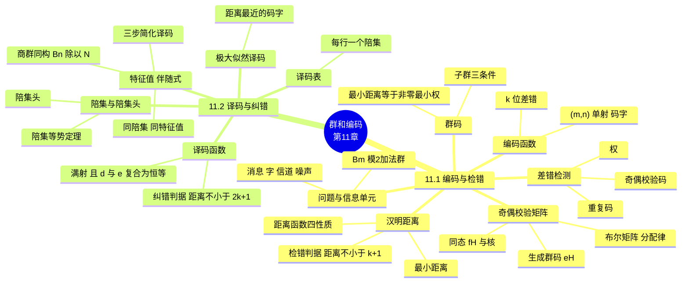
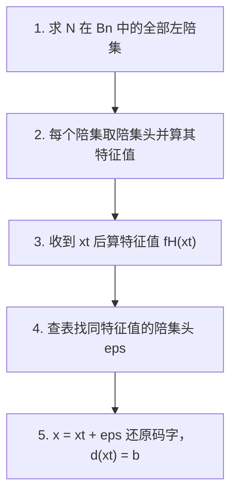

# 群和编码（Groups and Coding）

> **本章主线**：从"通信中数据会被噪声损坏"这一**问题**出发，按"建模 → 检错 → 纠错 → 高效化"的逻辑逐步展开：先建立**信息模型**（消息、字、$B^m$ 模 2 加法群、信道噪声），再引入**编码函数**（$e: B^m \to B^n$ 单射、引入冗余）与**汉明距离**（量化"两个字差多少"）完成**建模**；用**最小距离**给出**检错判据**（最小距离 $\ge k+1$）；用**群码**（码字集合是 $B^n$ 的子群）与**奇偶校验矩阵**（$H = \begin{bmatrix} H_{m\times r} \\ I_r \end{bmatrix}$）实现**高效构造**；最后转入**译码与纠错**——用**极大似然技术**（找最近码字）给出纠错判据（最小距离 $\ge 2k+1$），并用**陪集头**与**特征值（伴随式）**把译码从"全表扫描"优化为"查小表"。
> 一句话版本：**编码 = 用冗余换可靠性（$n > m$）；汉明距离 = 数差异的尺子；检错靠"错字不是码字"（距离 $\ge k+1$），纠错靠"错字离谁最近"（距离 $\ge 2k+1$）；群码让"距离计算"变成"数 1 的个数"，特征值让"全表译码"变成"查表译码"**。

---

## 11.1 二进制信息的编码与检错（Coding of Binary Information and Error Detection）

### 11.1.1 通信中的基本问题与信息单元

在现代通信世界中，数据不断从一点传输到另一点。传输数据的基本问题在于：**必须原样收到所发送的数据，而不是收到被扭曲的数据**。**编码理论（coding theory）**发展出了在传输数据中**引入冗余信息（redundant information）**的技术，这些冗余帮助**检测**、有时还能**纠正**传输中出现的错误。

**信息的基本单元**：

1. **消息（message）**：来自有限字母表 $B = \{0, 1\}$ 的字符构成的**有限序列**。
2. **字（word）**：$m$ 个 0 和 1 构成的序列（即 $B^m$ 中的元素）。

**$B^m$ 是群**：集合 $B = \{0, 1\}$ 在二元运算 $+$（**模 2 加法**）下构成群：$0 + 0 = 0$，$0 + 1 = 1$，$1 + 0 = 1$，$1 + 1 = 0$。于是 $B^m = B \times B \times \cdots \times B$（$m$ 个因子）在逐分量运算 $\oplus$ 下也构成群：

$$(x_1, x_2, \ldots, x_m) \oplus (y_1, y_2, \ldots, y_m) = (x_1 + y_1,\ x_2 + y_2,\ \ldots,\ x_m + y_m)$$

$B^m$ 中的元素写作 $(b_1, b_2, \ldots, b_m)$，更简单地写作 $b_1 b_2 \cdots b_m$。

**传输信道与噪声（noise）**：元素 $x \in B^m$ 经传输信道发送，被接收为元素 $x_t \in B^m$。信道中的**噪声**可能使 0 被接收为 1，或 1 被接收为 0，从而导致 $x \ne x_t$。噪声是编码理论存在的根本原因——**没有噪声，就不需要编码**。

> 口诀：**消息是"话"，字是"封装好的话"，$B^m$ 是"字的容器"（模 2 加法群），噪声是"捣乱的"——编码理论的全部工作就是对付噪声**。

### 11.1.2 编码函数（Encoding Function）

**编码函数**：选取整数 $n > m$ 与一个**单射（one-to-one）**函数 $e: B^m \to B^n$，则 $e$ 称为一个 **$(m, n)$ 编码函数**，它把 $B^m$ 中的每个字表示成 $B^n$ 中的一个字。若 $b \in B^m$，则 $e(b)$ 称为**表示 $b$ 的码字（code word）**。

**编码 - 传输 - 译码的整体流程**：

1. **无噪声情形**：若信道无噪声，则对一切 $x$ 有 $x_t = x$。此时对每个 $b \in B^m$ 收到的都是 $x = e(b)$，由于 $e$ 是已知函数，$b$ 可以被唯一识别——**单射性保证了"一码一字、互不混淆"**。
2. **有噪声情形**：一般传输都会出错。若码字 $x = e(b)$ 与接收字 $x_t$ 在**至少 1 个、至多 $k$ 个**位置上不同，则称 $x$ 是**带 $k$ 位或更少差错（with $k$ or fewer errors）被传输**的。

**为什么要 $n > m$**：码字比原消息长出的 $n - m$ 位就是**冗余位**——它们不携带新信息，只用于让码字之间"拉开距离"，从而能识别错误（补充说明/拓展：冗余是编码理论的根本代价，$n - m$ 越大，抗错能力通常越强，但传输效率越低）。

### 11.1.3 差错检测：权与奇偶校验码（Error Detection）

**差错检测**：设 $e: B^m \to B^n$ 是 $(m, n)$ 编码函数。若**每当码字 $x = e(b)$ 以 $k$ 位或更少差错传输时，$x_t$ 都不是码字**（从而 $x_t$ 不可能是 $x$，也就不可能是正确传输的结果），则称 **$e$ 能检测 $k$ 位或更少的差错（detects $k$ or fewer errors）**。

**权（weight）**：对 $x \in B^n$，$x$ 中 1 的个数称为 $x$ 的**权**，记作 $|x|$。权是后面一切距离概念的基石——**"有多少位是 1"是最基本的计数**。

**例 1（求权）**：求下列 $B^5$ 中字的权。

| 字 $x$ | 权 $|x|$ |
|---|---|
| $x = 01000$ | $|x| = 1$ |
| $x = 11100$ | $|x| = 3$ |
| $x = 00000$ | $|x| = 0$ |
| $x = 11111$ | $|x| = 5$ |

**例 2（奇偶校验码，parity check code）**：编码函数 $e: B^m \to B^{m+1}$ 称为**奇偶 $(m, m+1)$ 校验码**：若 $b = b_1 b_2 \cdots b_m \in B^m$，定义

$$e(b) = b_1 b_2 \cdots b_m b_{m+1}, \qquad b_{m+1} = b_1 + b_2 + \cdots + b_m \pmod 2$$

即**在消息末尾附加一位校验位，使整个码字中 1 的个数为偶数**（偶校验）。

1. **取 $m = 3$**，则全部码字为：

| $b$ | $e(b)$ | $b$ | $e(b)$ |
|---|---|---|---|
| $000$ | $0000$ | $100$ | $1001$ |
| $001$ | $0011$ | $101$ | $1010$ |
| $010$ | $0101$ | $110$ | $1100$ |
| $011$ | $0110$ | $111$ | $1111$ |

2. **检错演示**：设 $b = 111$，则 $x = e(b) = 1111$（4 个 1，权为偶数）。若传输中某 1 位出错（如第 2 位翻转为 0），收到 $x_t = 1011$——它有 3 个 1，**权为奇数，不是任何码字**，故错误被检出。

> 该例演示的核心技巧：**奇偶校验码把"检错"转化为"数 1 的个数"**——任何单个差错都会改变权的奇偶性，从而立刻暴露。

**例 3（$(m, 3m)$ 重复码）**：编码函数 $e: B^m \to B^{3m}$ 把每个字重复三次：

$$e(b) = b_1 b_2 \cdots b_m\ b_1 b_2 \cdots b_m\ b_1 b_2 \cdots b_m$$

1. 取 $m = 3$ 时，例如 $e(011) = 011\ 011\ 011$。
2. **检错演示**：若收到字 $011111011$——它**不是码字**（码字必须是三段完全相同），于是检测出了错误。

> 口诀：**奇偶校验码加 1 位校验位查"奇偶"，重复码加 2 份副本查"三段一致"——检错的本质都是"看是否还像个码字"**。

### 11.1.4 汉明距离（Hamming Distance）

**汉明距离**：设 $x, y \in B^m$，$x$ 与 $y$ 之间的**汉明距离** $\delta(x, y)$ 定义为 $x \oplus y$ 的权，即

$$\delta(x, y) = |x \oplus y|$$

由于 $\oplus$ 逐位运算，"$x \oplus y$ 中 1 的位置"恰是 $x$ 与 $y$ **不同的位置**，因此汉明距离就是**两个字中对应位不同的位置个数**——"用 $x \oplus y$ 的权来数不同的位置数"是计算距离的便捷手段。

**例 4（求距离）**：

1. $x = 110110$，$y = 000101$：$x \oplus y = 110011$，故 $\delta(x, y) = |110011| = 4$。
2. $x = 001100$，$y = 010110$：$x \oplus y = 011010$，故 $\delta(x, y) = |011010| = 3$。

**定理 1（距离函数的性质）**：设 $x, y, z \in B^m$，则：

1. $\delta(x, y) = \delta(y, x)$（**对称性**）；
2. $\delta(x, y) \ge 0$（**非负性**）；
3. $\delta(x, y) = 0$ 当且仅当 $x = y$（**同一性**）；
4. $\delta(x, y) \le \delta(x, z) + \delta(z, y)$（**三角不等式**）。

**性质 (d) 的证明**：

$$\delta(x, y) = |x \oplus y| = |x \oplus 0 \oplus y| = |x \oplus z \oplus z \oplus y| \le |x \oplus z| + |z \oplus y| = \delta(x, z) + \delta(z, y)$$

（其中用到了"两个字异或后的 1 的个数不超过两个字 1 的个数之和"这一事实——因为 $1 \oplus 1 = 0$ 只会让 1 的个数减少，不会增加。Q.E.D.）

> 这几条性质说明：**汉明距离是 $B^m$ 上的一个度量**——它和"平面几何中的直线距离"满足同样的四条公理（补充说明/拓展：这正是"度量空间"的概念，几何直觉在此完全适用）。

**几何直观（补充说明/拓展）**：$B^m$ 中的字可以看作 $m$ 维超立方体的顶点，汉明距离就是两个顶点之间"沿边走过的最少边数"。例如 $B^3$ 是一个立方体，码字就是其中的若干顶点——**编码的目标就是让码字顶点在立方体上尽量"散开"**。

### 11.1.5 最小距离与检错能力

**最小距离（minimum distance）**：编码函数 $e: B^m \to B^n$ 的**最小距离**是所有**不同码字对**之间距离的最小值：

$$\min\{\delta(e(x), e(y)) \mid x, y \in B^m,\ x \ne y\}$$

**例 5**：考虑如下 $(2, 5)$ 编码函数 $e$：

| $b$ | $e(b)$ |
|---|---|
| $00$ | $00000$ |
| $01$ | $00111$ |
| $10$ | $01110$ |
| $11$ | $11111$ |

其最小距离为 2（计算补充说明/拓展：六对码字距离分别为 $\delta(00000, 00111) = 3$、$\delta(00000, 01110) = 3$、$\delta(00000, 11111) = 5$、$\delta(00111, 01110) = 2$、$\delta(00111, 11111) = 2$、$\delta(01110, 11111) = 2$，取最小得 2）。由下述定理 2，它能检测 $k \le 1$，即**能检测 1 位差错**。

**定理 2（检错能力判据）**：$(m, n)$ 编码函数 $e: B^m \to B^n$ **能检测 $k$ 位或更少的差错，当且仅当其最小距离至少为 $k + 1$**。

**证明**（双向）：

1. **（$\Rightarrow$）最小距离 $\ge k+1$ 推出能检测 $k$ 位或更少差错**：设 $b \in B^m$，$x = e(b) \in B^n$ 是表示 $b$ 的码字。$x$ 被传输后收到 $x_t$。若 $x_t$ 是不同于 $x$ 的码字，则 $\delta(x, x_t) \ge k+1$，即 $x$ 以 $k+1$ 位或更多差错被传输。因此，**若 $x$ 以 $k$ 位或更少差错被传输，则 $x_t$ 不可能是码字**——这正是"能检测 $k$ 位或更少差错"的定义。
2. **（$\Leftarrow$）能检测 $k$ 位或更少差错推出最小距离 $\ge k+1$**：反设码字之间的最小距离为 $r \le k$，设 $x, y$ 是距离恰为 $r$ 的两个码字。若 $x$ 被传输却被误收为 $y$，则发生了 $r \le k$ 位差错而**未被检出**——与"能检测 $k$ 位或更少差错"矛盾。故最小距离必须 $\ge k+1$。Q.E.D.

> 口诀：**检错 = 最小距离 $\ge k+1$——"码字间的缝隙"要大于"差错的最大跨度"，错误字才挤不进码字集合**。

**例 6（求检错能力）**：考虑如下 $(3, 8)$ 编码函数 $e: B^3 \to B^8$：

| $b$ | $e(b)$ | $b$ | $e(b)$ |
|---|---|---|---|
| $000$ | $00000000$ | $100$ | $10100100$ |
| $001$ | $10011100$ | $101$ | $10001001$ |
| $010$ | $00101101$ | $110$ | $00011100$ |
| $011$ | $10010101$ | $111$ | $00110001$ |

问：$e$ 能检测几位差错？

**求解**（关键：该码**不是群码**，不能靠"非零码字最小权"偷懒，必须逐对比较距离）：

1. 观察码字可发现一个**距离极近的码字对**：$e(001) = 10011100$ 与 $e(110) = 00011100$，二者**仅在第 1 位不同**，故 $\delta(e(001), e(110)) = |10011100 \oplus 00011100| = |10000000| = 1$。
2. 因此最小距离 $\le 1$；又不同码字距离不可能为 0，故**最小距离恰为 1**。
3. 由定理 2，$k + 1 = 1$，故 $k = 0$——**该码不具备实际检错能力**：只要 1 位差错把 $e(001)$ 变成 $e(110)$，错误就无法被发现（此时收到的仍是一个合法的码字）。

> 该例演示的易错点：**非群码的最小距离必须逐对比较**，不能凭"码字含 3~4 个 1"就以为距离很大——两个码字可以只差 1 位，整个码的检错能力立刻归零。

### 11.1.6 群码（Group Codes）

**群码（group code）**：$(m, n)$ 编码函数 $e: B^m \to B^n$ 称为**群码**，若码字集合

$$e(B^m) = \{e(b) \mid b \in B^m\} = \operatorname{Ran}(e)$$

是 $B^n$ 的**子群**。

**子群的三条判定条件（回顾第 9 章）**：$N$ 是 $B^n$ 的子群，若：

1. $B^n$ 的幺元（即全零字 $00 \cdots 0$）在 $N$ 中；
2. 若 $x, y \in N$，则 $x \oplus y \in N$（**封闭**）；
3. 若 $x \in N$，则 $x$ 的逆元在 $N$ 中。

（在 $B^n$ 中每个元素以自身为逆元：$x \oplus x = 0$，故只要第 1、2 条满足，第 3 条自动成立——**群码判定实际只需检查"含零 + 封闭"**。）

**例 7（$e$ 是群码吗？）**：考虑 $(3, 6)$ 编码函数 $e: B^3 \to B^6$：

| $b$ | $e(b)$ | $b$ | $e(b)$ |
|---|---|---|---|
| $000$ | $000000$ | $100$ | $100101$ |
| $001$ | $001100$ | $101$ | $101001$ |
| $010$ | $010011$ | $110$ | $110110$ |
| $011$ | $011111$ | $111$ | $111010$ |

**验证 $N = \{000000, 001100, 010011, 011111, 100101, 101001, 110110, 111010\}$ 是 $B^6$ 的子群**：

1. **含零**：全零码字 $000000 \in N$，✓。
2. **封闭**：任取两个码字异或，结果仍在 $N$ 中。例如：$001100 \oplus 010011 = 011111 \in N$，$001100 \oplus 100101 = 101001 \in N$，$010011 \oplus 100101 = 110110 \in N$，$100101 \oplus 101001 = 001100 \in N$，其余组合同理可验，全部落在 $N$ 内，✓。
3. **逆元**：每个元素以自身为逆元（$x \oplus x = 000000$），✓。

故 $N$ 是 $B^6$ 的子群，$e$ 是**群码**。

**定理 3（群码的最小距离定理）**：设 $e: B^m \to B^n$ 是群码，则 **$e$ 的最小距离等于非零码字的最小权**。

**证明**：设 $\delta$ 为群码的最小距离，且 $\delta = \delta(x, y)$（$x, y$ 是不同的码字）；设 $\eta$ 为非零码字的最小权，且 $\eta = |z|$（$z$ 是某个码字）。

1. 因 $e$ 是群码，$x \oplus y$ 是非零码字，故 $\delta = \delta(x, y) = |x \oplus y| \ge \eta$。
2. 另一方面，全零码字 0 与 $z$ 是不同的码字，故 $\eta = |z| = |z \oplus 0| = \delta(z, 0) \ge \delta$。
3. 综合两式得 $\eta = \delta$。Q.E.D.

**例 8（用定理 3 省计算）**：例 7 中群码的最小距离为 2。直接验证需要 $\binom{8}{2} = 28$ 次两两比较；而用定理 3，只需求非零码字的最小权：各非零码字权为 $|001100| = 2$，$|010011| = 3$，$|011111| = 5$，$|100101| = 3$，$|101001| = 3$，$|110110| = 4$，$|111010| = 4$，最小者为 2。故**最小距离 = 2**（检 1 位错）。

> 口诀：**群码最小距离 = 非零码字最小权——把"两两比距离"（28 次）变成"数 1 的个数"（7 次），这就是群结构带来的第一笔红利**。

### 11.1.7 用奇偶校验矩阵构造群码（Parity Check Matrix）

**布尔矩阵复习**：零一矩阵（Boolean matrix）上的两种运算：

1. **模 2 和 $D \oplus E$**：逐位模 2 相加；
2. **模 2 布尔积 $D * E$**：与普通矩阵乘法类似，但行 - 列"点积"中用 $\lor$ 代替 $+$、用 $\land$ 代替 $\times$：若 $A = [a_{ij}]$ 是 $m \times k$ 零一矩阵，$B = [b_{ij}]$ 是 $k \times n$ 零一矩阵，则布尔积 $A * B = C = [c_{ij}]$：

$$c_{ij} = \bigvee_{\lambda = 1}^{k} (a_{i\lambda} \land b_{\lambda j})$$

**定理 4（分配律）**：设 $D$、$E$ 是 $m \times p$ 布尔矩阵，$F$ 是 $p \times n$ 布尔矩阵，则

$$(D \oplus E) * F = (D * F) \oplus (E * F)$$

即 $\oplus$ 与 $*$ 之间满足分配律（逐元素成立，由 0、1 的布尔运算性质直接验证）。

**记号约定**：把元素 $x = x_1 x_2 \cdots x_n \in B^n$ 看作 $1 \times n$ 矩阵 $[x_1\ x_2\ \cdots\ x_n]$，从而可以参与矩阵乘法。

**定理 5（$f_H$ 是同态）**：设 $m, n$ 是非负整数，$m < n$，$r = n - m$，$H$ 是 $n \times r$ 布尔矩阵。定义函数 $f_H: B^n \to B^r$：

$$f_H(x) = x * H, \qquad x \in B^n$$

则 $f_H$ 是群 $B^n$ 到群 $B^r$ 的**同态**。

**证明**：对任意 $x, y \in B^n$，由定理 4：

$$f_H(x \oplus y) = (x \oplus y) * H = (x * H) \oplus (y * H) = f_H(x) \oplus f_H(y)$$

故 $f_H$ 保持运算，是同态。Q.E.D.

**推论 1（核是正规子群）**：设 $m, n, r, H, f_H$ 如定理 5，则

$$N = \{x \in B^n \mid x * H = 0\}$$

是 $B^n$ 的**正规子群**。这是因为 $N$ 正是同态 $f_H$ 的**核**（回忆第 9 章：同态的核必是正规子群）。

**奇偶校验矩阵（parity check matrix，一致性检验矩阵）**：设 $m < n$，$r = n - m$，则如下 $n \times r$ 布尔矩阵称为**奇偶校验矩阵**：

$$H = \begin{bmatrix} H_{m \times r} \\[2pt] I_r \end{bmatrix}$$

其中上半块 $H_{m \times r}$ 是任意 $m \times r$ 布尔矩阵，下半块 $I_r$ 是 $r \times r$ **单位矩阵**（主对角线为 1，其余为 0）。

**由奇偶校验矩阵构造编码函数 $e_H: B^m \to B^n$**：若 $b = b_1 b_2 \cdots b_m$，令

$$x = e_H(b) = b_1 b_2 \cdots b_m\ x_1 x_2 \cdots x_r$$

其中校验位 $x_1, x_2, \ldots, x_r$ 由下式（模 2）决定：

$$x_i = b_1 \cdot h_{1i} + b_2 \cdot h_{2i} + \cdots + b_m \cdot h_{mi} \pmod 2 \qquad (i = 1, 2, \ldots, r)$$

即**校验位是消息各位对 $H_{m \times r}$ 各列的模 2 加权和**（$h_{ji}$ 是 $H_{m \times r}$ 第 $j$ 行第 $i$ 列的元素）。

**矩阵形式**：$e_H$ 可写成"消息向量 × 生成矩阵"：

$$e_H(B^m) = B^m * \begin{bmatrix} I_m & H_{m \times r} \end{bmatrix}$$

（消息先拼上 $m \times m$ 单位矩阵 $I_m$ 保证消息位原样保留，再乘 $H_{m \times r}$ 生成校验位。）

**定理 6（$x * H = 0$ 与码字等价）**：设 $x = y_1 y_2 \cdots y_m x_1 \cdots x_r \in B^n$，则

$$x * H = 0 \quad \Longleftrightarrow \quad x = e_H(b) \text{ 对某个 } b \in B^m$$

**证明**（双向）：

1. **（$\Rightarrow$）$x * H = 0$ 推出 $x = e_H(b)$**：由 $x * H = 0$ 逐分量写出：

   $$y_1 h_{1i} + y_2 h_{2i} + \cdots + y_m h_{mi} + x_i = 0 \qquad (i = 1, \ldots, r)$$

   注意 $x_i + x_i = 0$，把 $x_i$ 移到等式另一边得 $x_i = y_1 h_{1i} + \cdots + y_m h_{mi}$。令 $b_1 = y_1, \ldots, b_m = y_m$，则 $x_1, \ldots, x_r$ 恰好满足校验位的方程，故 $x = e_H(b)$。
2. **（$\Leftarrow$）$x = e_H(b)$ 推出 $x * H = 0$**：若 $x = e_H(b)$，把校验位方程两边同时加上 $x_i$（利用 $x_i + x_i = 0$）改写为

   $$b_1 h_{1i} + b_2 h_{2i} + \cdots + b_m h_{mi} + x_i = 0 \qquad (i = 1, \ldots, r)$$

   这正是 $x * H = 0$ 的逐分量形式。Q.E.D.

**推论 2（$e_H$ 是群码）**：$e_H(B^m) = \{e_H(b) \mid b \in B^m\}$ 是 $B^n$ 的子群。

**证明**：由定理 6，$e_H(B^m) = \{x \in B^n \mid x * H = 0\} = \ker(f_H)$，由推论 1 它是正规子群，从而**$e_H$ 是群码**。Q.E.D.

**例 11（构造群码）**：设 $m = 2$，$n = 5$（故 $r = 3$），奇偶校验矩阵

$$H = \begin{bmatrix} 1 & 1 & 0 \\ 0 & 1 & 1 \\ 1 & 0 & 0 \\ 0 & 1 & 0 \\ 0 & 0 & 1 \end{bmatrix}$$

求群码 $e_H: B^2 \to B^5$。

**求解**：

1. 写出生成矩阵（上半块取 $H$ 的前 2 行作为 $H_{2 \times 3}$，左接 $I_2$）：

   $$e_H(B^2) = B^2 * \begin{bmatrix} I_2 & H_{2 \times 3} \end{bmatrix} = \begin{bmatrix} 0 & 0 \\ 0 & 1 \\ 1 & 0 \\ 1 & 1 \end{bmatrix} * \begin{bmatrix} 1 & 0 & 1 & 1 & 0 \\ 0 & 1 & 0 & 1 & 1 \end{bmatrix}$$

2. 逐行计算（每一行 = 对应消息向量乘生成矩阵，模 2）：

   $$e_H(B^2) = \begin{bmatrix} 0 & 0 & 0 & 0 & 0 \\ 0 & 1 & 0 & 1 & 1 \\ 1 & 0 & 1 & 1 & 0 \\ 1 & 1 & 1 & 0 & 1 \end{bmatrix}$$

   即码字集合 $= \{00000,\ 01011,\ 10110,\ 11101\}$，对应 $e_H(00) = 00000$，$e_H(01) = 01011$，$e_H(10) = 10110$，$e_H(11) = 11101$。

3. **验证**（选做）：任一码字乘 $H$ 都得全零，例如 $01011 * H = 0$（由定理 6 保证），且任意两码字异或仍是码字——确认这是一个群码。

> 该例演示的核心技巧：**奇偶校验矩阵 $H$ 一锤定音**——只要给定 $H = \begin{bmatrix} H_{m \times r} \\ I_r \end{bmatrix}$，就自动得到"含零、封闭"的群码，无需逐对检验；且由定理 6，**"是否是码字"可统一用 $x * H = 0$ 判定**，这为后面的特征值译码埋下伏笔。

---

## 11.2 译码与纠错（Decoding and Error Correction）

### 11.2.1 译码函数（Decoding Function）

**译码问题**：考虑 $(m, n)$ 编码函数 $e: B^m \to B^n$。码字 $x = e(b) \in B^n$（$b \in B^m$）被接收为字 $x_t$ 后，面临的难题是**识别出原始消息 $b$**。

**译码函数（decoding function）**：与 $e$ 关联的 **$(n, m)$ 译码函数**是满足如下条件的**满射（onto）**函数 $d: B^n \to B^m$：当传输信道**无噪声**时，$d(x_t) = b' \in B^m$ 满足 $b' = b$，即

$$d \circ e = 1_{B^m}$$

（$1_{B^m}$ 是 $B^m$ 上的恒等映射。）

1. 译码函数要求**满射**，是为了保证每个接收字都能被译码成 $B^m$ 中的某个字。
2. 它把**正确接收的字译码正确**；而对**错误接收的字**，译码结果**可能对也可能错**——这正是后面纠错理论要解决的问题。

**例 1（奇偶校验码的译码）**：考虑 11.1 例 2 中定义的奇偶校验码 $e: B^m \to B^{m+1}$ 的关联译码函数 $d: B^{m+1} \to B^m$：若 $y = y_1 y_2 \cdots y_m y_{m+1} \in B^{m+1}$，则

$$d(y) = y_1 y_2 \cdots y_m$$

即**直接丢弃最后一位校验位**。验证：若 $b = b_1 b_2 \cdots b_m \in B^m$，则 $(d \circ e)(b) = d(e(b)) = b$，故 $d \circ e = 1_{B^m}$，✓。取 $m = 4$ 时：$d(10010) = 1001$，$d(11001) = 1100$。

**（$e, d$）纠正 $k$ 位或更少差错**：设 $e$ 是 $(m, n)$ 编码函数，$d$ 是与 $e$ 关联的 $(n, m)$ 译码函数。若**每当码字 $x = e(b)$ 被正确传输或带 $k$ 位或更少差错传输、$x_t$ 被接收时，都有 $d(x_t) = b$**，则称 $(e, d)$ **能纠正 $k$ 位或更少的差错（corrects $k$ or fewer errors）**——此时 $x_t$ 被译码为正确的消息 $b$。

**例 2（重复码的多数表决译码）**：考虑 11.1 例 3 的 $(m, 3m)$ 重复码，定义译码函数 $d: B^{3m} \to B^m$：若 $y = y_1 \cdots y_m\ y_{m+1} \cdots y_{2m}\ y_{2m+1} \cdots y_{3m}$，则 $d(y) = z_1 z_2 \cdots z_m$，其中**每位 $z_j$ 取三段对应位置上的"多数"**（三个 $y$ 中 0、1 哪个多取哪个，即多数表决）：

1. 例如收到 $x_t = 011\ 011\ 111$：三段分别是 $011$、$011$、$111$，逐位表决得 $z_1 = 0$（0、0、1 取 0）、$z_2 = 1$（1、1、1 取 1）、$z_3 = 1$（1、1、1 取 1），故 $d(x_t) = 011$。
2. 若只有一个副本被噪声破坏（如三段中一段有 1 位错），其余两段一致，多数表决仍能还原正确消息——**重复 + 表决 = 以冗余换纠错**。

### 11.2.2 极大似然译码技术（Maximum Likelihood Technique）

**极大似然技术**：$B^m$ 有 $2^m$ 个元素，故 $B^n$ 中有 $2^m$ 个码字，把它们列成 $x^{(1)}, x^{(2)}, \ldots, x^{(2^m)}$。若收到字 $x_t$，对 $1 \le i \le 2^m$ 逐一计算距离 $\delta(x^{(i)}, x_t)$，选出**第一个**（列表顺序）使距离最小的码字 $x^{(s)}$——即 $x^{(s)}$ 是**离 $x_t$ 最近**的码字（并列时取列表中靠前者）。

**极大似然译码函数**：若 $x^{(s)} = e(b)$，则定义与 $e$ 关联的**极大似然译码函数** $d$ 为

$$d(x_t) = b$$

直观含义：**收到什么字，就把它译成"离它最近的那个码字"所代表的消息**——假定噪声造成的差错尽可能少。

**定理 1（纠错能力判据）**：设 $e$ 是 $(m, n)$ 编码函数，$d$ 是与 $e$ 关联的极大似然译码函数，则

$$(e, d) \text{ 能纠正 } k \text{ 位或更少的差错} \quad \Longleftrightarrow \quad e \text{ 的最小距离至少为 } 2k + 1$$

**直观理解（补充说明/拓展）**：把每个码字 $x^{(i)}$ 看作"球心"，半径为 $k$ 的球覆盖所有"距它不超过 $k$ 的字"。要保证带 $k$ 位差错的接收字 $x_t$ 能**唯一**译回原码字，各球必须**互不相交**——两个球心（码字）间的距离须大于 $2k$，即最小距离 $\ge 2k + 1$。这正是纠错比检错"苛刻一倍"的原因。

**例 3（求纠错能力）**：考虑 11.1 例 6 中的 $(3, 8)$ 编码函数 $e$，$d$ 是与 $e$ 关联的 $(8, 3)$ 极大似然译码函数。问 $(e, d)$ 能纠正几位差错？

**求解**：由 11.1 例 6 已知该码**最小距离为 1**（$e(001)$ 与 $e(110)$ 仅差 1 位）。由定理 1，需 $2k + 1 \le 1$，故 $k = 0$——**该码不具实际纠错能力**。这再次印证：码字间距离过近的码，既不能检错也不能纠错。

**检错与纠错的判据对比**：

| 能力 | 判定条件 | 直观含义 |
|---|---|---|
| 检错 $k$ 位 | 最小距离 $\ge k+1$ | 错误字**不是**任何码字即可 |
| 纠错 $k$ 位 | 最小距离 $\ge 2k+1$ | 错误字必须**唯一地靠近**某个码字 |

> 口诀：**检错"不撞码"（$k+1$），纠错"认得家"（$2k+1$）——纠错比检错多一倍的缝隙要求，因为纠错还要"找得回"**。

### 11.2.3 陪集与陪集头（Coset Leader）

**定理 2（陪集等势）**：若 $K$ 是群 $G$ 的**有限**子群，则 $K$ 在 $G$ 中的**每个左陪集都与 $K$ 有同样多的元素**。

**证明**：设 $aK$ 是 $K$ 的一个左陪集（$a \in G$）。考虑函数 $f: K \to aK$，$f(k) = ak$（$k \in K$）：

1. **单射**：若 $f(k_1) = f(k_2)$，则 $ak_1 = ak_2$，两边左乘 $a^{-1}$ 得 $k_1 = k_2$。
2. **满射**：任取 $b \in aK$，则 $b = ak$ 对某个 $k \in K$，于是 $f(k) = ak = b$。

故 $f$ 是双射，$|K| = |aK|$。Q.E.D.

**群码的陪集结构**：设 $e: B^m \to B^n$ 是群码，则码字集合 $N$ 是 $B^n$ 的**阶为 $2^m$** 的子群，记 $N = \{x^{(1)}, x^{(2)}, \ldots, x^{(2^m)}\}$。由定理 2，$N$ 的每个左陪集都含 $2^m$ 个元素；$B^n$ 共有 $2^n$ 个元素，故 $N$ 在 $B^n$ 中有 $2^n / 2^m = 2^{n-m} = 2^r$ 个左陪集。

**陪集头（coset leader）**：设码字 $x = e(b)$ 被传输、字 $x_t$ 被接收。$x_t$ 的左陪集为

$$x_t \oplus N = \{\varepsilon_1, \varepsilon_2, \ldots, \varepsilon_{2^m}\}, \qquad \varepsilon_i = x_t \oplus x^{(i)}$$

若 $\varepsilon_j$ 是该陪集中**权最小**的元素，则 $x^{(j)}$ 必是**离 $x_t$ 最近的码字**（因为 $\delta(x_t, x^{(j)}) = |x_t \oplus x^{(j)}| = |\varepsilon_j|$）。**权最小的元素 $\varepsilon_j$ 称为该陪集的陪集头**——它是"这个陪集里最像没出错的字"。

**极大似然译码的通用程序**（对给定群码 $e: B^m \to B^n$ 求极大似然译码函数 $d$）：

1. **第 1 步**：确定 $N = e(B^m)$ 在 $B^n$ 中的**全部左陪集**。
2. **第 2 步**：对每个陪集，找出一个**陪集头**（权最小的字）。
3. **第 3 步**：收到字 $x_t$ 后，确定 $x_t$ 属于 $N$ 的**哪个左陪集**。
4. **第 4 步**：设 $\varepsilon$ 是第 3 步确定陪集的陪集头，计算 $x = x_t \oplus \varepsilon$。若 $x = e(b)$，则令 $d(x_t) = b$——**把 $x_t$ 译码为 $b$**。

> 口诀：**"先分组（陪集），每组选个代表（陪集头），来了新字先归队，减去代表还原码"**——极大似然译码被分解成"归队 + 减代表"两步。

### 11.2.4 译码表（Decoding Table）

**译码表**：构造一张表，**每一行是一个左陪集**，行首元素 $\varepsilon^{(i)}$ 是该陪集的**陪集头**。表的构造方式：

1. **第 1 行**：按顺序写码字 $x^{(1)} = 0, x^{(2)}, \ldots, x^{(2^m)}$（全零码字居首）；
2. **其余行**：每行由一个陪集头 $\varepsilon^{(i)}$ 与该行码字逐项异或得到（$B^n$ 被分划成 $2^r$ 行 × $2^m$ 列）。

**查表译码**：收到字 $x_t$ 后，在表中找到它所在的位置；若该列**列首的码字**是 $x$，则 $x$ 就是离 $x_t$ 最近的码字；若 $x = e(b)$，则 $d(x_t) = b$。

**例 4（构造译码表）**：考虑 11.1 例 7 的 $(3, 6)$ 群码 $N = \{x^{(1)}, \ldots, x^{(8)}\}$，其中 $x^{(1)} = 000000$，$x^{(2)} = 001100$，$x^{(3)} = 010011$，$x^{(4)} = 011111$，$x^{(5)} = 100101$，$x^{(6)} = 101001$，$x^{(7)} = 110110$，$x^{(8)} = 111010$。

**构造译码表**（$B^6$ 有 64 个字、8 个陪集，表共 8 行 × 8 列；每行选一个权最小的字作陪集头）：

| 陪集头 | | | | | | | |
|---|---|---|---|---|---|---|---|
| $000000$ | $001100$ | $010011$ | $011111$ | $100101$ | $101001$ | $110110$ | $111010$ |
| $000001$ | $001101$ | $010010$ | $011110$ | $100100$ | $101000$ | $110111$ | $111011$ |
| $000010$ | $001110$ | $010001$ | $011101$ | $100111$ | $101011$ | $110100$ | $111000$ |
| $000100$ | $001000$ | $010111$ | $011011$ | $100001$ | $101101$ | $110010$ | $111110$ |
| $010000$ | $011100$ | $000011$ | $001111$ | $110101$ | $111001$ | $100110$ | $101010$ |
| $100000$ | $101100$ | $110011$ | $111111$ | $000101$ | $001001$ | $010110$ | $011010$ |
| $000110$ | $001010$ | $010101$ | $011001$ | $100011$ | $101111$ | $110000$ | $111100$ |
| $010100$ | $011000$ | $000111$ | $001011$ | $110001$ | $111101$ | $100010$ | $101110$ |

（每个单元格 = 行首陪集头 $\oplus$ 列首码字，例如第 2 行第 2 列 $000001 \oplus 001100 = 001101$；每行 8 个字恰好互不重叠地铺满 $B^6$。）

**查表演示**：设收到 $x_t = 010011$——它恰是列首码字 $x^{(3)}$ 本身，说明传输无错，$d(x_t) = e^{-1}(010011) = 011$。若收到 $x_t = 001111$（第 5 行第 4 列，行首陪集头 $010000$），其所在列首是 $011111 = x^{(4)} = e(011)$，故 $d(001111) = 011$（此字被纠正回 $011$）。

> 该例演示的核心技巧：**译码表把"算 8 个距离"降为"查 1 个格子"**；但整张表需 $2^n$ 个格子（本例 64 格），当 $n$ 较大时存不下——这就引出了下面的特征值（伴随式）译码。

### 11.2.5 特征值（伴随式）与简化译码（Syndrome）

**定理 3（$f_H$ 是满射）**：设 $m, n, r, H, f_H$ 如前定义（$H$ 为奇偶校验矩阵），则 $f_H: B^n \to B^r$ 是**满射**。

**证明**：任取 $b = b_1 b_2 \cdots b_r \in B^r$，令 $x = \underbrace{0 \cdots 0}_{m \text{ 个}}\ b_1 b_2 \cdots b_r$（前 $m$ 位为 0、后 $r$ 位为 $b$）。因 $H$ 的下半块是单位矩阵 $I_r$，$x * H$ 恰好提取出 $x$ 的后 $r$ 位，故 $x * H = b$，即 $f_H(x) = b$。Q.E.D.

**特征值（伴随式，syndrome）**：由第 9 章的推论（同态基本定理），$B^r$ 与商群 $B^n / N$ **同构**，其中

$$N = \{x \in B^n \mid x * H = 0\} = \ker(f_H) = e_H(B^m)$$

同构映射为 $g: B^n / N \to B^r$，$g(xN) = f_H(x) = x * H$。**元素 $x * H$ 称为 $x$ 的特征值（伴随式）**——它是 $x$ 所在左陪集的"身份证号"。

**定理 4（同陪集 ⟺ 同特征值）**：设 $x, y \in B^n$，则 $x$ 与 $y$ 在 $N$ 的**同一个左陪集**中，当且仅当 $f_H(x) = f_H(y)$，当且仅当**它们有相同的特征值**。

**证明**：由第 9 章定理 4，$x$ 与 $y$ 在同一左陪集当且仅当 $x \oplus y = (-x) \oplus y \in N$（$B^n$ 中每个元素以自身为逆元）。因 $N = \ker(f_H)$：

$$x \oplus y \in N \iff f_H(x \oplus y) = 0_{B^r} \iff f_H(x) \oplus f_H(y) = 0_{B^r} \iff f_H(x) = f_H(y)$$

Q.E.D.

**简化译码程序（特征值译码）**：

1. **第 1 步**：确定 $N = e_H(B^m)$ 在 $B^n$ 中的全部左陪集；
2. **第 2 步**：对每个陪集找出**陪集头**，并计算**每个陪集头的特征值**；
3. **第 3 步**：收到 $x_t$ 后，计算 $x_t$ 的特征值 $f_H(x_t)$，找到**具有相同特征值的陪集头** $\varepsilon$；则 $x_t \oplus \varepsilon = x$ 是码字 $e_H(b)$，令 $d(x_t) = b$。

**例 5（特征值译码完整演示）**：考虑奇偶校验矩阵与 $(3, 6)$ 群码 $e_H: B^3 \to B^6$：

$$H = \begin{bmatrix} 1 & 1 & 0 \\ 1 & 0 & 1 \\ 0 & 1 & 1 \\ 1 & 0 & 0 \\ 0 & 1 & 0 \\ 0 & 0 & 1 \end{bmatrix}$$

1. **由 $H$ 生成码字**（$e_H(b) = b_1 b_2 b_3 x_1 x_2 x_3$，其中 $x = b * H_{3 \times 3}$，$H_{3 \times 3}$ 取 $H$ 的前 3 行）：

| $b$ | $e_H(b)$ | $b$ | $e_H(b)$ |
|---|---|---|---|
| $000$ | $000000$ | $100$ | $100110$ |
| $001$ | $001011$ | $101$ | $101101$ |
| $010$ | $010101$ | $110$ | $110011$ |
| $011$ | $011110$ | $111$ | $111000$ |

2. **计算各陪集头的特征值**（$x * H$ 即把 $x$ 中 1 所在的行取出来模 2 相加）：

| 陪集头 $\varepsilon$ | 特征值 $f_H(\varepsilon) = \varepsilon * H$ |
|---|---|
| $000000$ | $000$ |
| $000001$ | $001$ |
| $000010$ | $010$ |
| $001000$ | $011$ |
| $000100$ | $100$ |
| $010000$ | $101$ |
| $100000$ | $110$ |
| $001100$ | $111$ |

3. **译码演示**：若收到 $x_t = 001110$，则 $f_H(x_t) = x_t * H = 101$，与陪集头 $\varepsilon = 010000$ 的特征值相同。于是

   $$x = x_t \oplus \varepsilon = 001110 \oplus 010000 = 011110 = e_H(011)$$

   故 $d(001110) = 011$——把 $x_t$ 译码为消息 $011$。同时由 $x_t = e_H(011) \oplus 010000$ 可知：**收到的字 = 正确码字 $\oplus$ 陪集头（错误模式）**，$010000$ 正是被纠正的那 1 位差错。

**一般译码与特征值译码的对比**：

| 维度 | 极大似然译码 + 译码表 | 特征值（伴随式）译码 |
|---|---|---|
| 前置条件 | 任意群码 | 由奇偶校验矩阵 $H$ 生成的群码 |
| 需要存储 | 整张译码表（$2^n$ 格） | 仅 $2^r$ 个陪集头及其特征值 |
| 查表方式 | 全表扫描定位 $x_t$ | 算一次 $x_t * H$ 后查小表 |
| 复杂度 | 随 $n$ 指数膨胀 | 随冗余位数 $r = n - m$ 增长 |
| 本质 | 距离最近即最优 | 同陪集 ⟺ 同特征值（定理 4） |

> 口诀：**"全表译码靠眼力，特征值译码靠算力"——把'找 $x_t$ 在哪行'变成'算 $x_t$ 的特征值'，一张大表缩成一行小表，这就是群论同态基本定理在工程上的胜利**。

---

### 知识定位与框架衔接

#### 前置知识（地基，来自第 9 章与前序章节）

1. **第 9 章 半群和群**：群的三公理与**子群判定**（含零 + 封闭 + 逆元）——群码的定义直接调用；**正规子群、同态与核、商群与同态基本定理**（9.5）——$N = \ker(f_H)$ 是正规子群、$B^n / N \cong B^r$ 全部依赖该章结论；**陪集与左陪集等势定理**——陪集头与译码表的理论基础。
2. **关系章节**：等价关系与集合划分——左陪集正是把 $B^n$ 划分成互不相交的等价类，商群 $B^n / N$ 就是"按陪集分块"的商结构。
3. **函数**：单射/满射/双射——编码函数要求单射（不同消息必得不同码字），译码函数要求满射（任何接收字都能译码）。

#### 后置知识（上层建筑，编码理论的深化与应用）

1. **更一般的线性码**：本节由奇偶校验矩阵构造的群码正是**线性码（linear code）**的原型——码字集合是 $B^n$（即 $GF(2)$ 上的向量空间）的线性子空间，生成矩阵与校验矩阵是描述线性码的标准工具。
2. **经典纠错码**：汉明码（Hamming code）、循环码、BCH 码、RS 码等——它们在最小距离、编码效率与译码复杂度之间做更精细的权衡，是本节"群码 + 特征值译码"思想的直接推广。
3. **工程应用**：计算机内存的纠错（ECC 内存）、磁盘与 RAID 阵列、二维码（QR code）、深空通信与卫星传输、网络数据包校验——"用冗余换可靠性"的思想渗透到几乎所有数字系统。

#### 本章在整个课程中的位置（盖房子比喻）

- 本章相当于**给"代数结构"这栋楼装的"防弹门窗"**：第 9 章建立了群、正规子群、商群、同态等抽象骨架，本章把它们**落地**到通信问题——**群码 = 群论在纠错编码中的第一次实战**。
- **主线是"问题 → 建模 → 求解 → 优化"**：通信损坏问题（11.1.1）→ 编码函数 + 汉明距离建模（11.1.2~11.1.4）→ 检错判据（11.1.5）→ 群码 + 奇偶校验矩阵的高效构造（11.1.6~11.1.7）→ 译码问题与极大似然判据（11.2.1~11.2.2）→ 陪集头 + 特征值的优化译码（11.2.3~11.2.5）。
- 学习节奏建议：**先吃透 11.1 的"距离 → 检错"链条与群码的两大定理（定理 2、定理 3），再攻 11.2 的陪集头与特征值译码**；特征值译码是全章的"压轴戏"，把 9.5 的同态基本定理用到了极致。

#### 核心灵魂问题（学完本章应能回答）

1. **为什么检错只需最小距离 $\ge k+1$，而纠错必须 $\ge 2k+1$？** —— 检错只要"错误字不是任何码字"就能报警（$k+1$ 的缝隙足以把 $k$ 位差错挡在码字集合外）；纠错却要求"错误字唯一对应最近码字"（两个码字各自的 $k$ 半径球不能相交，否则一个错字会同时靠近两个码字、无法裁决），故缝隙需要翻倍为 $2k+1$。
2. **为什么群码的最小距离等于非零码字的最小权？** —— 群码中 $x \oplus y$ 仍是码字，于是"两码字距离"被翻译成"某码字的权"（$\delta(x, y) = |x \oplus y|$），28 次两两比较变成 7 次数 1 的个数。没有群结构（例 6 的 $(3, 8)$ 码），就只能老老实实逐对比较。
3. **为什么特征值（伴随式）能加速译码？** —— $x \mapsto x * H$ 把 $B^n$ 中 $2^n$ 个字按"同陪集"分成 $2^r$ 类，同类同特征值（定理 4），于是"找 $x_t$ 在哪个陪集"变成"算一次 $x_t * H$ 再查 $2^r$ 行的特征值小表"——把全表扫描（$2^n$ 格）压缩成"一次矩阵乘 + 小表查找"。

> **一句话总结本章**：**编码 = 引入冗余让码字"拉开距离"；汉明距离是量距离的尺子；最小距离 $\ge k+1$ 可检 $k$ 位错、$\ge 2k+1$ 可纠 $k$ 位错；群码（码字成子群）让最小距离退化为最小权，奇偶校验矩阵 $H$ 与特征值 $x * H$ 则把"构造码"与"译码"都变成一次矩阵运算——抽象群论的"核、正规子群、商群"在纠错编码中完成了第一次漂亮的实战**。

---

## 课件 PDF

<iframe src="https://naimore3.github.io/Naimore3-s-Learning-Notes/课程笔记/大二上/离散数学（下）/群和编码/Groups and Coding.pdf" width="100%" height="800px" style="border: none;"></iframe>

[打开 PDF](https://naimore3.github.io/Naimore3-s-Learning-Notes/课程笔记/大二上/离散数学（下）/群和编码/Groups and Coding.pdf)
