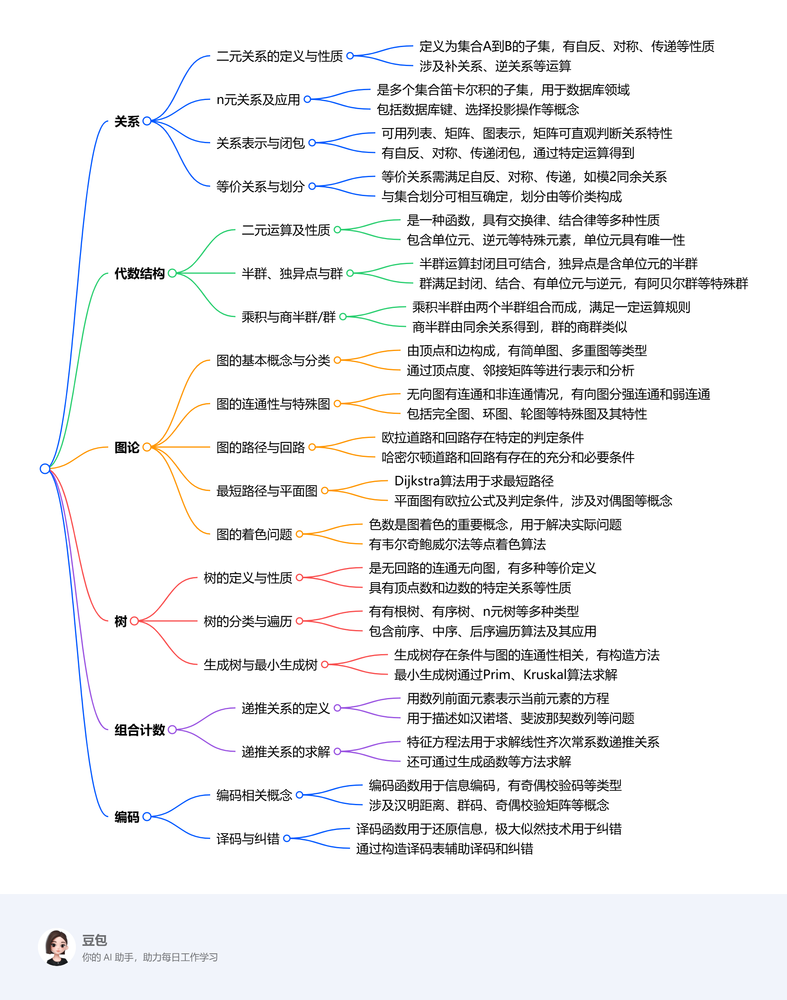

# 课程概览
## 基本信息
- 授课老师： 吴斌
- 课程成绩： 86分
- 这门课程整体难度较高，期中、期末考试也各有挑战，期中考试难度适中，我取得了 94 分的成绩，期末考试难度则偏大。授课老师的教学水平在中等偏上，讲解知识点时基本清晰明了，在解答问题方面也很有耐心，让我在学习过程中受益颇多。
## 知识结构
离散数学（下）课程主要包含关系、代数结构、图论、树、组合计数及编码等知识，具体框架如下：

1. **关系**
    - 二元关系定义、性质（自反、对称、传递等）及运算（并、交、差、复合等）。
    - n元关系及在数据库中的应用，如关系数据库、数据库键、选择与投影操作等。
    - 关系的表示（列表、矩阵、图）及闭包（自反、对称、传递闭包）运算。
    - 等价关系（满足自反、对称、传递）与集合划分的相互转换。
2. **代数结构**
    - 二元运算的定义、性质（交换律、结合律等），以及特殊元素（单位元、逆元）。
    - 半群（运算封闭、可结合）、独异点（含单位元的半群）、群（满足封闭性、结合律、有单位元与逆元）的概念与性质，子半群、子独异点、子群的判定。
    - 乘积半群、商半群，以及群的乘积与商群相关知识。
3. **图论**
    - 图的基本概念（顶点、边、度等）、分类（简单图、多重图等）及表示（邻接矩阵、关联矩阵）。
    - 图的连通性（无向图连通、有向图强连通与弱连通），以及特殊图（完全图、环图等）。
    - 欧拉道路与回路（存在条件及判定）、哈密尔顿道路与回路（存在的充分条件与必要条件）。
    - 最短路径问题（Dijkstra算法）、平面图（欧拉公式、判定条件）、图的着色（色数、应用）。
4. **树**
    - 树的定义（无回路的连通无向图）、性质及分类（有根树、有序树、n元树等）。
    - 树的遍历（前序、中序、后序遍历算法）及应用（如表达式树）。
    - 生成树（存在条件、构造方法）与最小生成树（Prim算法、Kruskal算法）。
5. **组合计数**：递推关系的定义、求解方法（如特征方程法），以及在汉诺塔、斐波那契数列等问题中的应用。
6. **编码**：编码函数、汉明距离、群码、奇偶校验矩阵等概念，以及译码函数、纠错技术（极大似然技术）和译码表的构造。
 
