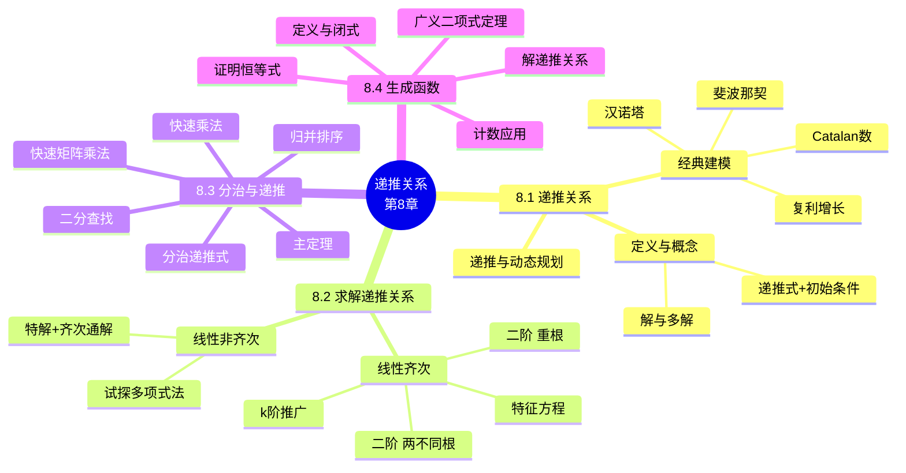

# 递推关系（Recurrence Relations）

> **本章主线**：用递推关系"建模"（把序列的规律写成 $a_n$ 与先前项的方程）→ 用各种工具"求解"（迭代展开、特征方程、生成函数）→ 把结果"应用"到计数问题与算法复杂度分析。其中 **8.1 负责建关系、8.2 负责解关系（特征方程路线）、8.3 负责分治算法的复杂度递推（主定理）、8.4 引入生成函数这把更强大的"代数钥匙"**。
> 一句话版本：**递推关系 = 用"前项算后项"的方式定义序列；求解的目标 = 把 $a_n$ 写成只含 $n$ 的显式公式**。

---

## 8.1 递推关系（Recurrence Relations）

### 8.1.1 递推关系的定义与基本概念

**递推关系（recurrence relation，简记 R.R.）**：对于序列 $\{a_n\}$，一个递推关系是**把 $a_n$ 用序列中一个或多个先前元素 $a_0, a_1, \ldots, a_{n-1}$ 表达的方程**，对一切 $n \ge n_0$ 成立。本质上是**去掉了基例（base case）的递归定义**。

**解（solution）**：某个（非递归方式描述的）特定序列称为该递推关系的解，如果它与递推关系的定义**一致**。

1. **一个递推关系可能有多个解**——因为递推关系只约束"后项与前项的关系"，不约束"初始值"；给定不同的初值就得到不同的序列。
2. 要使解**唯一**，必须补充**初始条件（initial conditions）**，即给出 $a_0, a_1, \ldots, a_{n_0 - 1}$ 的具体值。

**例（解的检验）**：考虑递推关系

$$a_n = 2a_{n-1} - a_{n-2} \quad (n \ge 2)$$

判断下列序列是否为其解：

| 候选解 | 代入验证 | 结论 |
|---|---|---|
| $a_n = 3n$ | $2 \cdot 3(n-1) - 3(n-2) = 6n - 6 - 3n + 6 = 3n$ ✓ | **是** |
| $a_n = 2^n$ | $2 \cdot 2^{n-1} - 2^{n-2} = 2^n - 2^{n-2} = \frac{3}{4} \cdot 2^n \ne 2^n$ ✗ | **否** |
| $a_n = 5$ | $2 \cdot 5 - 5 = 5$ ✓ | **是** |

> 该例演示的核心技巧：**验证"某序列是否为递推关系的解"只需做一步"代数代入化简"，不需要解方程**。同时它揭示：$a_n = 3n$ 与 $a_n = 5$ 对应不同的初值（$a_0=0$ 与 $a_0=5$），却都是同一递推关系的解——**递推关系本身不决定初值**。

### 8.1.2 递推关系的建立：经典计数模型

**例 1（银行复利 / 账户增长）**：设账户本金为 $M_0$，每期利率为 $P\%$，$M_n$ 表示第 $n$ 期末的金额。

1. **建模**：第 $n$ 期末金额 = 第 $n-1$ 期末金额 + 本期利息，即
   $$M_n = M_{n-1} + \frac{P}{100} M_{n-1} = \left(1 + \frac{P}{100}\right) M_{n-1}$$
2. **化简**：令 $r = 1 + \frac{P}{100}$，得 $M_n = r M_{n-1}$，初始条件 $M_0$ 已知。
3. **迭代求解**（逐步回代）：
   $$M_n = r M_{n-1} = r \cdot (r M_{n-2}) = r^2 M_{n-2} = \cdots = r^n M_0$$
4. **结论**：$M_n = \left(1 + \frac{P}{100}\right)^n M_0$——这正是复利公式。

> 该例演示的核心技巧：**形如 $a_n = r a_{n-1}$ 的一阶齐次递推，通过"展开回代"直接得到 $a_n = r^n a_0$**，这是最简单也最常用的求解模板。

**例 2（斐波那契 / 兔子繁殖问题）**：13 世纪意大利数学家斐波那契提出：一年初把一对刚出生的小兔放进养殖场，小兔满两个月后即可每月生育一对（一雌一雄）小兔。问一年后有多少对兔子？

1. **建模**：设 $F(n)$ 为第 $n$ 个月兔子对数。
    - 第 $n$ 个月的兔子 = 上个月已有的兔子 $F(n-1)$ + 这个月新出生的小兔（两个月前那批兔子恰好长成并各生一对）$F(n-2)$；
    - 得**斐波那契递推关系**：$F(n) = F(n-1) + F(n-2)$，初始条件 $F(0) = 0$，$F(1) = 1$。
2. **递推计算**：
   | $n$ | 0 | 1 | 2 | 3 | 4 | 5 | 6 | 7 | 8 | 9 | 10 | 11 | 12 | 13 |
   |---|---|---|---|---|---|---|---|---|---|---|---|---|---|---|
   | $F(n)$ | 0 | 1 | 1 | 2 | 3 | 5 | 8 | 13 | 21 | 34 | 55 | 89 | 144 | **233** |
3. **结论**：一年后（第 13 个月）养殖场有 **$F(13) = 233$** 对兔子。

> 该例演示的核心技巧：**识别"当前 = 上一期存量 + 新增量"的加法结构，直接写出二阶线性齐次递推**；斐波那契递推 $F(n) = F(n-1) + F(n-2)$ 是全章最经典、反复出现的模型。

**例 6（不含连续两个 0 的位串）**（补充说明/拓展：课件仅给出题目，以下为完整建模与求解）：求长度为 $n$、**不含两个连续 0** 的位串个数 $a_n$，并求长度为 5 时的个数。

1. **建模——按末位分类**（加法法则）：
    - 若末位为 **1**：前 $n-1$ 位只要不含连续 0 即可 → $a_{n-1}$ 种；
    - 若末位为 **0**：倒数第二位**必须为 1**（否则出现"00"），此时前 $n-2$ 位任意合法 → $a_{n-2}$ 种。
    - 得递推关系：$a_n = a_{n-1} + a_{n-2}$。
2. **初始条件**：$a_1 = 2$（位串 0、1 均合法）；$a_2 = 3$（合法的是 01、10、11，非法的是 00）。
3. **计算**：$a_3 = 3 + 2 = 5$，$a_4 = 5 + 3 = 8$，$a_5 = 8 + 5 = 13$。
4. **答案**：长度为 5 的合法位串共有 **13** 个。

> 该例演示的核心技巧：**"分类讨论末位/末两位"把 n 的问题归约到 n−1 与 n−2 的问题，是计数问题建模递推关系的标准套路（同类项合并后恰好是斐波那契）**。

**例 7（含偶数个 0 的十进制码字）**：计算机系统把**含偶数个 0 的数字串**视为合法码字（如 1230407869 合法，120987045608 不合法）。设 $a_n$ 为长度为 $n$ 的合法码字数，求 $a_n$ 的递推关系。

1. **建模**：考察第 $n$ 位（末位）：
    - 若前 $n-1$ 位已含偶数个 0（$a_{n-1}$ 种），则末位必须是 1~9 中的某个数（**9 种**），否则 0 的个数变奇；
    - 若前 $n-1$ 位含奇数个 0（共 $10^{n-1} - a_{n-1}$ 种），则末位必须为 **0**（1 种），把 0 的个数补成偶数。
2. **列式**：$a_n = 9a_{n-1} + 1 \cdot (10^{n-1} - a_{n-1}) = 8a_{n-1} + 10^{n-1}$。
3. **初始条件**：$a_1 = 9$（一位数 1~9 均合法；"0"含 1 个 0 为奇数，不合法）。

> 该例演示的核心技巧：**用"补集 + 分情况"把"偶数个 0"翻译成递推——合法 = 前段合法×末位非 0 + 前段不合法×末位为 0**；该递推 $a_n = 8a_{n-1} + 10^{n-1}$ 将在 §8.4 用生成函数再次求解。

### 8.1.3 汉诺塔（Tower of Hanoi）：迭代展开求解

**问题陈述**：有三个木桩 A、B、C，A 桩上有 $n$ 个大小不等的圆盘按"大在下、小在上"叠成塔形。现需把圆盘逐个移到 B 桩（可用 C 桩作辅助），始终保持大盘不压小盘。问完成转移至少要移动多少次？

1. **建模**：设 $H_n$ 为移动 $n$ 个圆盘所需的最少步数。最优策略分三步：
    - 把上面 $n-1$ 个盘借助 B 移到 C 桩：$H_{n-1}$ 步；
    - 把最下面的大盘直接移到 B 桩：$1$ 步；
    - 把 C 桩上的 $n-1$ 个盘移到 B 桩：$H_{n-1}$ 步。
    - 得**汉诺塔递推关系**：$H_n = 2H_{n-1} + 1$，初始条件 $H_1 = 1$。
2. **迭代展开**：
   $$\begin{aligned}
   H_n &= 2H_{n-1} + 1 \\
   &= 2(2H_{n-2} + 1) + 1 = 2^2 H_{n-2} + 2 + 1 \\
   &= 2^2(2H_{n-3} + 1) + 2 + 1 = 2^3 H_{n-3} + 2^2 + 2 + 1 \\
   &\vdots \\
   &= 2^{n-1} H_1 + 2^{n-2} + \cdots + 2 + 1 \\
   &= 2^{n-1} + 2^{n-2} + \cdots + 2 + 1
   \end{aligned}$$
3. **等比数列求和**：由 $\sum_{j=0}^{n-1} ar^j = \frac{ar^n - a}{r - 1}$（取 $a=1, r=2$）得
   $$H_n = \sum_{j=0}^{n-1} 2^j = \frac{2^n - 1}{2 - 1} = 2^n - 1$$
4. **答案**：$H_n = 2^n - 1$。例如 $H_3 = 7$（传说中 64 个盘需 $2^{64} - 1$ 步）。

> 该例演示的核心技巧：**"展开—找规律—套等比求和公式"是求解 $a_n = ca_{n-1} + d$ 型递推的通用流程**（展开后出现等比级数 $\sum 2^j$）。

### 8.1.4 Catalan 数：非线性递推的经典

**引言**：本小节讨论 **Catalan 数**。其递推关系是**非线性**的（出现 $h_i h_j$ 这样的乘积项），许多有意义的计数问题都归结为它。

**问题来源（凸多边形三角剖分）**：一个凸 $n$ 边形，用**互不相交的对角线**把它拆分成若干三角形，不同的拆分方案数记为 $h_n$。例如**五边形共有 5 种拆分方案**，故 $h_5 = 5$。

**定理（Catalan 数的递推关系）**：

- (a) $h_{n+1} = h_2 h_n + h_3 h_{n-1} + \cdots + h_n h_2$（即 $h_{n+1} = \sum_{k=2}^{n} h_k h_{n-k+2}$）　(2-11-1)
- (b) $\dfrac{n-3}{2}\, h_n = h_3 h_{n-1} + h_4 h_{n-2} + \cdots + h_{n-1} h_3$　(2-11-2)

**定理 (a) 的证明**：固定 $(n+1)$ 边形的边 $v_1 v_{n+1}$，它必属于某个三角形 $v_1 v_k v_{n+1}$（$k = 2, 3, \ldots, n$）。该三角形把 $(n+1)$ 边形分成两部分：一个 $k$ 边形和一个 $n-k+2$ 边形。由乘法原理，以 $v_k$ 为第三顶点的剖分数为 $h_k h_{n-k+2}$；再对 $k = 2, \ldots, n$ 用加法法则求和：

$$h_{n+1} = \sum_{k=2}^{n} h_k h_{n-k+2} = h_2 h_n + h_3 h_{n-1} + \cdots + h_{n-1} h_3 + h_n h_2$$

**定理 (b) 的证明思路（对角线计数法）**：

1. 从顶点 $v_1$ 可向其它 $n-3$ 个顶点 $\{v_3, v_4, \ldots, v_{n-1}\}$ 引出 $n-3$ 条对角线；以对角线 $v_1 v_k$ 作为拆分线的方案数为 $h_k h_{n-k+2}$，对 $k = 3, \ldots, n-1$ 求和得 $h_3 h_{n-1} + h_4 h_{n-2} + \cdots + h_{n-1} h_3$。
2. 以 $v_2, v_3, \ldots, v_n$ 取代 $v_1$ 也有类似结果，于是（对所有顶点求和后）得到 $\dfrac{n}{2}\big(h_3 h_{n-1} + h_4 h_{n-2} + \cdots + h_{n-1} h_3\big)$。
3. **重复计数说明**：一个凸 $n$ 边形的剖分共有 $n-3$ 条对角线，上述"对每条边/每个顶点计数"时，同一个剖分被重复计数了 $n-3$ 次。因此除以 $n-3$ 即得 (b) 式。

**Catalan 数计算公式的推导**：

1. 由 (2-11-1) 式及 $h_2 = 1$，移项得
   $$h_{n+1} - 2h_n = h_3 h_{n-1} + h_4 h_{n-2} + \cdots + h_{n-1} h_3$$
2. 代入 (2-11-2) 式：
   $$\frac{n-3}{2}\, h_n = \frac{n}{2}\left(h_{n+1} - 2h_n\right)$$
3. 整理：$2(n-3)h_n = n\, h_{n+1} - 2n\, h_n$，即
   $$n\, h_{n+1} = (4n - 6)\, h_n$$
4. 令 $a_{n+1} = n\, h_{n+1}$（即 $a_n = (n-1)h_n$），则 $a_2 = h_2 = 1$，且
   $$\frac{a_{n+1}}{a_n} = \frac{n\, h_{n+1}}{(n-1)h_n} = \frac{4n - 6}{n - 1} = \frac{(2n-2)(2n-3)}{(n-1)(n-1)}$$
5. **连乘消去**（望远镜积）：
   $$a_{n+1} = \frac{a_{n+1}}{a_n} \cdot \frac{a_n}{a_{n-1}} \cdots \frac{a_3}{a_2} \cdot a_2 = \frac{(2n-2)!}{(n-1)!\,(n-1)!} = \binom{2n-2}{n-1}$$
6. **结论（Catalan 数公式）**：
   $$h_{n+1} = \frac{a_{n+1}}{n} = \frac{1}{n} \binom{2n-2}{n-1}$$

**例 1（$h_6$）**：$h_6 = \dfrac{1}{5} \dbinom{8}{4} = \dfrac{1}{5} \times 70 = 14$，即凸六边形有 14 种三角剖分。

**例 2（括号化方案数）**：$x_1 x_2 \cdots x_n$ 是 $n$ 个数的乘积，依据乘法结合律、不改变顺序，只用括号表示成对的乘积。问有多少种不同的加括号方案？

1. **建模**：设 $b_n$ 为 $n$ 个数乘积的 $n-1$ 对括号插入方案数。按**最后一次乘法**的位置分成两部分（前 $i$ 个数与后 $n-i$ 个数）：
   $$b_n = b_1 b_{n-1} + b_2 b_{n-2} + \cdots + b_{n-1} b_1, \quad b_1 = b_2 = 1$$
2. **与 Catalan 数挂钩**：令 $b_n = h_{n+1}$（$n = 1, 2, 3, \ldots$），得 $h_{n+1} = h_2 h_n + h_3 h_{n-1} + \cdots + h_n h_2$，且 $b_1 = h_2 = 1$、$b_2 = h_3 = 1$——与 (2-11-1) 完全一致，故 $b_n$ **就是 Catalan 数** $h_{n+1}$。
3. **计算（以 $n = 4$ 为例）**：$b_4 = h_5 = \dfrac{1}{4} \dbinom{6}{3} = 5$。四种数 $x_1, x_2, x_3, x_4$ 的 5 种加括号方案为：
   $$((x_1 x_2) x_3) x_4, \quad (x_1 (x_2 x_3)) x_4, \quad (x_1 x_2)(x_3 x_4), \quad x_1 ((x_2 x_3) x_4), \quad x_1 (x_2 (x_3 x_4))$$
4. **几何解释**：每个加括号方案与一个 5 边形的三角剖分**一一对应**——把 $x_1 \times x_2$ 等二元运算用**二叉树**表示（两片叶子为乘数与被乘数、分支点为运算符），恰对应剖分中的三角形。例如 $((x_1 x_2) x_3) x_4$ 对应自根到叶依次展开的二叉树。

**例 3（前缀 1 的累计数不小于 0 的累计数）**：由 $n$ 个 1 和 $n$ 个 0 组成一个 $2n$ 位二进制数，要求从左到右扫描时 **1 的累计数始终不小于 0 的累计数**。求满足条件的数的个数。

- **解法 1（排除不合要求的数）**：
    1. 在 $2n$ 位上填入 $n$ 个 1（其余自动填 0）的方案总数为 $\binom{2n}{n}$。
    2. **不合要求**的数指：扫描时出现 0 的累计数超过 1 的累计数。其结构特征：必然在**某一奇数位 $2m+1$** 上首次出现 $m+1$ 个 0 与 $m$ 个 1；此后还剩 $2(n-m)-1$ 位，其中有 $n-m-1$ 个 1 与 $n-m$ 个 0。
    3. **关键变换（0 与 1 互换）**：把"首次失衡点之后"的部分做 0↔1 互换，则该数变成由 $n+1$ 个 0 与 $n-1$ 个 1 组成的 $2n$ 位数。
    4. **一一对应**：反过来，任何由 $n+1$ 个 0、$n-1$ 个 1 组成的 $2n$ 位数，因 0 比 1 多 2 个且位数 $2n$ 为偶数，必在某个奇数位首次出现 0 累计超过 1 累计；再做同样的互换即还原。故**不合要求的 $2n$ 位数与"$n+1$ 个 0、$n-1$ 个 1 的排列"一一对应**，其个数为 $\binom{2n}{n+1}$。
    5. **结果**：
     $$a_{2n} = \binom{2n}{n} - \binom{2n}{n+1} = (2n)! \left(\frac{1}{n!\, n!} - \frac{1}{(n-1)!\,(n+1)!}\right) = \frac{1}{n+1} \binom{2n}{n} = h_{n+2}$$
- **例示**：$10100101$ 是由 4 个 0、4 个 1 组成的 8 位二进制数，扫描到第 5 位（打 \* 处）时 0 的累计数 3 超过 1 的累计数 2，它对应由 3 个 1、5 个 0 组成的 $10100010$。
- **解法 2（路径法）**：
    1. 把该问题与**格点路径**一一对应：从原点 $(0,0)$ 出发，从左到右扫描 $2n$ 位数，遇 1 沿 $y$ 轴正方向走一格，遇 0 沿 $x$ 轴正方向走一格，恰好到达 $(n,n)$ 点。
    2. "1 的累计数不小于 0 的累计数" ⟺ 路径可途经对角线 $y = x$ 上的点，但**不允许穿越对角线下方**。
    3. 于是问题转化为：**从 $(0,0)$ 出发、途经对角线及对角线上方的点到达 $(n,n)$ 的路径数**。
    4. 总路径数为 $\binom{2n}{n}$；穿越对角线的路径数，由**反射原理**（把起点 $(0,0)$ 关于直线 $y = x + 1$ 反射到 $(-1, 1)$）知等于从 $(-1,1)$ 到 $(n,n)$ 的路径数 $\binom{2n}{n+1}$。
    5. 结果同上：$a_{2n} = \binom{2n}{n} - \binom{2n}{n+1} = \dfrac{1}{n+1} \binom{2n}{n} = h_{n+2}$。

**例 4（严格大于版本）**：由 $n$ 个 1、$n$ 个 0 组成的 $2n$ 位二进制数，要求扫描**前 $2n-1$ 位**时 1 的累计数**大于** 0 的累计数。求满足条件的数的个数。

1. **路径化归**：该条件 ⟺ 从 $(0,1)$ 点出发、**只经过对角线 $y=x$ 上方的点**抵达 $(n-1, n)$ 点（即把例 3 的起点抬高一格、终点平移一格）。
2. **套用例 3 的结果**：从 $(0,1)$ 点通过"对角线及其上方"到达 $(n-1,n)$ 点的路径数为
   $$\binom{2n-2}{n-1} - \binom{2n-2}{n} = (2n-2)! \left(\frac{1}{(n-1)!\,(n-1)!} - \frac{1}{n!\,(n-2)!}\right) = \frac{1}{n} \binom{2n-2}{n-1} = h_{n+1}$$

**Catalan 数小结**：

| 计数对象 | 结果 |
|---|---|
| 凸 $n$ 边形三角剖分数 | $h_n = \dfrac{1}{n-1} \dbinom{2n-2}{n-1}$ |
| $n$ 个数乘积的加括号方案数 | $b_n = h_{n+1} = \dfrac{1}{n} \dbinom{2n-2}{n-1}$ |
| $n$ 个 1、$n$ 个 0 的 $2n$ 位数（前缀 1 累计 $\ge$ 0 累计） | $a_{2n} = h_{n+2} = \dfrac{1}{n+1} \dbinom{2n}{n}$ |
| 前缀（前 $2n-1$ 位）1 累计 $>$ 0 累计 | $h_{n+1} = \dfrac{1}{n} \dbinom{2n-2}{n-1}$ |

> 口诀：**"剖分、括号、括号路径一家亲"——三角形剖分、乘积加括号、前缀条件二进制数、不越对角线的路径，全部同构于 Catalan 数**；核心递推 $h_{n+1} = \sum h_k h_{n-k+2}$ 是非线性递推的代表。

### 8.1.5 递推关系与动态规划

**动态规划（dynamic programming）**：当一个算法**递归地把问题分解成更简单的、相互重叠的子问题**，并用子问题的解拼出整体解时，称其遵循动态规划范式。一般地，**递推关系正是"从子问题的解得到整体解"的载体**。

1. **基本思想**：把待求解的问题分解成若干子问题，先求解子问题，再从子问题的解得到原问题的解——动态规划分解出的子问题**往往不是互相独立的**（大量重叠）。
2. **重叠子问题与记忆化**：为避免反复求解同样的子问题，把子问题的结果**逐步计算并保存**（从最简单的问题一直算到整个问题）。因此动态规划**保存递归时的结果**，不会在解决相同问题上重复花费时间。
3. **最优子结构**：动态规划只能应用于**具有最优子结构**的问题——即**局部最优解能决定全局最优解**（对某些问题这一要求不能完全满足，故有时需引入近似）。简单地说：问题能够分解成子问题来解决。
4. **应用领域**：经济学、计算机视觉、语音识别、人工智能、计算机图形学、生物信息学等。

**加权区间调度（Weighted Interval Scheduling）的关键递推**：设 $p(j)$ 为与工作 $j$ 兼容（$f_i \le s_j$）的最大下标 $i < j$，则最优值满足

$$T(j) = \max\big(w_j + T(p(j)),\ T(j-1)\big)$$

含义：要么选择工作 $j$（收益 $w_j$ 加上与它兼容的前驱最优解 $T(p(j))$），要么不选 $j$（沿用前 $j-1$ 个工作的最优解 $T(j-1)$），二者取最大。

> 该例演示的核心技巧：**动态规划算法的"灵魂"就是一条递推关系——写出正确的递推（转移方程）+ 正确的初值，算法就完成了一半**；本章 §8.2 的求解工具（特征方程、生成函数）能给出这类递推的闭式解。

---

## 8.2 求解递推关系（Solving Recurrence Relations）

### 8.2.1 线性齐次常系数递推关系（k-LiHoReCoCo）

**定义（k 阶线性齐次常系数递推关系）**：形如

$$a_n = c_1 a_{n-1} + c_2 a_{n-2} + \cdots + c_k a_{n-k}$$

的递推关系称为 **k 阶线性齐次常系数递推关系**（"k-LiHoReCoCo"），其中 $c_i$（$i = 1, \ldots, k$）为实常数，且 $c_k \ne 0$。

1. **线性**：右边是先前项的**常数倍之和**（每个被加数都是"某个 $c_i$ × 一个前项"，不出现 $a_i^2$、$a_i a_j$ 等非线性项）。
2. **齐次**：右边没有**只依赖 $n$ 的独立项**（如常数、$n$、$2^n$ 等）。
3. **常系数**：系数 $c_i$ 不随 $n$ 变化。
4. **阶数 k**：依赖最近的 $k$ 个前项；$c_k \ne 0$ 保证"名副其实"。
5. **唯一解**：给定 $k$ 个初始条件 $a_0, a_1, \ldots, a_{k-1}$ 后，解**唯一确定**。

**例（递推关系的分类）**：

| 递推关系 | 类别 |
|---|---|
| $c_n = (-2)c_{n-1}$ | 1 阶线性齐次常系数 |
| $a_n = a_{n-1} + 3$ | **不是**线性齐次（含常数项 3） |
| $f_n = f_{n-1} + f_{n-2}$ | 2 阶线性齐次常系数（斐波那契） |
| $g_n = g_{n-1}^2 + g_{n-2}$ | **不是**线性齐次（出现 $g_{n-1}^2$） |

**特征方程（characteristic equation）**：对 k-LiHoReCoCo $a_n = c_1 a_{n-1} + \cdots + c_k a_{n-k}$，其**特征方程**为

$$r^k - c_1 r^{k-1} - c_2 r^{k-2} - \cdots - c_{k-1} r - c_k = 0$$

**基本思想**：尝试形如 $a_n = r^n$（$r$ 为常数）的解，代入递推式得 $r^n = c_1 r^{n-1} + \cdots + c_k r^{n-k}$，两边除以 $r^{n-k}$ 即得特征方程。特征方程的**根（特征根）**决定了序列显式公式的形式。

### 8.2.2 二阶情形：两不同实根与重根

**定理 1（二阶线性齐次）**：设 $a_n = c_1 a_{n-1} + c_2 a_{n-2}$ 的特征方程为 $r^2 - c_1 r - c_2 = 0$。

- (a) 若特征方程有两个**不同**的实根 $r_1 \ne r_2$，则
  $$a_n = \alpha_1 r_1^n + \alpha_2 r_2^n \quad (n \ge 0)$$
  其中 $\alpha_1, \alpha_2$ 由初始条件确定。
- (b) 若特征方程只有一个根 $r_0$（重根），则
  $$a_n = \alpha_1 r_0^n + \alpha_2 n r_0^n \quad (n \ge 0)$$
  其中 $\alpha_1, \alpha_2$ 由初始条件确定。

**定理 1(a) 的证明**：设 $s_1, s_2$ 是 $x^2 - c_1 x - c_2 = 0$ 的两根，则 $s_1^2 = c_1 s_1 + c_2$、$s_2^2 = c_1 s_2 + c_2$。取 $a_n = u s_1^n + v s_2^n$：

1. 先保证初始条件：取 $u, v$ 使 $a_0 = u + v$、$a_1 = u s_1 + v s_2$ 成立。
2. 再验证满足递推关系（用 $s_1^2 = c_1 s_1 + c_2$ 替换平方项）：
   $$\begin{aligned}
   a_n &= u s_1^n + v s_2^n = u s_1^{n-2} s_1^2 + v s_2^{n-2} s_2^2 \\
   &= u s_1^{n-2}(c_1 s_1 + c_2) + v s_2^{n-2}(c_1 s_2 + c_2) \\
   &= c_1 (u s_1^{n-1} + v s_2^{n-1}) + c_2 (u s_1^{n-2} + v s_2^{n-2}) \\
   &= c_1 a_{n-1} + c_2 a_{n-2}
   \end{aligned}$$
3. 故 $a_n = u s_1^n + v s_2^n$ 正是该递推关系 + 初始条件定义的序列。Q.E.D.（(b) 的证明类似，略）

**例（两不同根）**：求解 $a_n = a_{n-1} + 2a_{n-2}$，初始条件 $a_0 = 2$、$a_1 = 7$。

1. **写特征方程**：$c_1 = 1$、$c_2 = 2$，故 $r^2 - r - 2 = 0$。
2. **求根**：$r = \dfrac{1 \pm \sqrt{1 + 8}}{2} = \dfrac{1 \pm 3}{2}$，得 $r_1 = 2$、$r_2 = -1$。
3. **写通解**：$a_n = \alpha_1 \cdot 2^n + \alpha_2 \cdot (-1)^n$。
4. **代入初始条件解 $\alpha$**：
   $$\begin{cases} a_0 = 2 = \alpha_1 + \alpha_2 \\ a_1 = 7 = 2\alpha_1 - \alpha_2 \end{cases}$$
   由 $\alpha_2 = 2 - \alpha_1$ 代入第二式：$7 = 2\alpha_1 - (2 - \alpha_1) = 3\alpha_1 - 2$，得 $\alpha_1 = 3$、$\alpha_2 = -1$。
5. **答案**：$a_n = 3 \cdot 2^n - (-1)^n$。
6. **检验**：$n \ge 0$ 时序列为 $2, 7, 11, 25, 47, 97, \ldots$（$a_2 = 3 \cdot 4 - 1 = 11$，满足 $a_2 = a_1 + 2a_0 = 7 + 4 = 11$ ✓）。

**例（重根）**：求解 $a_n = 6a_{n-1} - 9a_{n-2}$，初始条件 $a_0 = 1$、$a_1 = 6$。

1. **特征方程**：$r^2 - 6r + 9 = 0$，唯一根 $r = 3$（重根）。
2. **写通解**（定理 1(b)）：$a_n = \alpha_1 \cdot 3^n + \alpha_2 \cdot n \cdot 3^n$。
3. **代入初始条件**：$a_0 = 1 = \alpha_1$；$a_1 = 6 = 3\alpha_1 + 3\alpha_2$，解得 $\alpha_2 = 1$。
4. **答案**：$a_n = 3^n + n \cdot 3^n = (n+1)\, 3^n$。

> 口诀：**"两根不同各取 $r^n$，一根重了补个 $n$"**——重根时第二项由 $r_0^n$ 变成 $n r_0^n$，这是二阶情形最容易出错的地方。

### 8.2.3 k 阶情形的推广

**定理 3（k 个不同根）**：设 k-LiHoReCoCo

$$a_n = c_1 a_{n-1} + c_2 a_{n-2} + \cdots + c_k a_{n-k}$$

的特征方程 $r^k - c_1 r^{k-1} - \cdots - c_k = 0$ 有 **k 个不同**的根 $r_1, r_2, \ldots, r_k$，则

$$a_n = \alpha_1 r_1^n + \alpha_2 r_2^n + \cdots + \alpha_k r_k^n = \sum_{i=1}^{k} \alpha_i r_i^n \quad (n \ge 0)$$

其中 $\alpha_i$ 为常数，由 $k$ 个初始条件确定。

**重根情形的推广（Degenerate k-LiHoReCoCos）**：若特征方程有 $t$ 个**互不相同的根** $r_1, \ldots, r_t$，其重数分别为 $m_1, \ldots, m_t$，则

$$a_n = \sum_{i=1}^{t} \left( \sum_{j=0}^{m_i - 1} \alpha_{i,j}\, n^j \right) r_i^n$$

其中所有 $\alpha_{i,j}$ 为常数。即：**重数 $m$ 的根 $r_i$ 贡献 $r_i^n$ 乘以一个 $n$ 的 $m-1$ 次多项式**（二阶重根情形是 $t=1, m=2$ 的特例）。

### 8.2.4 线性非齐次递推关系（LiNoReCoCo）

**定义**：线性非齐次常系数递推关系（"LiNoReCoCo"）形如

$$a_n = c_1 a_{n-1} + c_2 a_{n-2} + \cdots + c_k a_{n-k} + F(n)$$

其中 $F(n)$ 是**只依赖 $n$（而不依赖任何 $a_i$）**的项，称为**非齐次项**。去掉 $F(n)$ 后得到的齐次递推关系 $a_n = c_1 a_{n-1} + \cdots + c_k a_{n-k}$ 称为它的**相伴齐次递推关系（associated LiHoReCoCo）**。

**定理（LiNoReCoCo 的解结构）**：若 $a_n = p(n)$ 是 LiNoReCoCo 的**一个特解**，则该递推关系的**全部解**形如

$$a_n = p(n) + h(n)$$

其中 $a_n = h(n)$ 是相伴齐次递推关系的任意解（齐次通解）。

> 记忆：**非齐次方程的解 = 一个特解 + 齐次通解**，这与微分方程、线性方程组的解结构完全同构。

**试探解法（Trial Solutions）**：若非齐次项 $F(n)$ 是 $n$ 的 $t$ 次多项式，则**试取 $t$ 次多项式**作为特解 $p(n)$（若与齐次解冲突需乘 $n$ 调整，本课程主要处理不冲突情形）。

**例（完整求解）**：求 $a_n = 3a_{n-1} + 2n$ 的全部解，并求出满足 $a_1 = 3$ 的那个解。

1. **求齐次通解**：相伴齐次递推 $a_n = 3a_{n-1}$ 的特征方程 $r - 3 = 0$，通解为 $h(n) = \alpha \cdot 3^n$。
2. **试特解**：$F(n) = 2n$ 是 $n$ 的一次多项式，试 $p(n) = cn + d$。代入递推式：
   $$cn + d = 3\big(c(n-1) + d\big) + 2n = 3cn - 3c + 3d + 2n$$
3. **比较系数**：$cn + d = (3c + 2)n + (3d - 3c)$，故
   $$\begin{cases} c = 3c + 2 \Rightarrow c = -1 \\ d = 3d - 3c \Rightarrow 2d = -3 \Rightarrow d = -\tfrac{3}{2} \end{cases}$$
   得特解 $p(n) = -n - \dfrac{3}{2}$（验证：代入得 $a_n$ 序列 $-\tfrac{5}{2}, -\tfrac{7}{2}, -\tfrac{9}{2}, \ldots$ ✓）。
4. **写通解**：$a_n = -n - \dfrac{3}{2} + \alpha \cdot 3^n$。
5. **定 $\alpha$（用 $a_1 = 3$）**：$3 = -1 - \dfrac{3}{2} + 3\alpha \Rightarrow 3\alpha = \dfrac{11}{2} \Rightarrow \alpha = \dfrac{11}{6}$。
6. **答案**：$a_n = -n - \dfrac{3}{2} + \dfrac{11}{6} \cdot 3^n$。

> 该例演示的核心技巧：**"特解"用待定系数法（试 $cn+d$ 代入比较系数）求，"通解"只来自齐次部分，最后用初始条件定出唯一常数**。

### 8.2.5 求解方法对照

| 递推类型 | 判定标准 | 解法路线 | 通解形式 |
|---|---|---|---|
| 一阶齐次 $a_n = r a_{n-1}$ | $k=1$，无 $F(n)$ | 直接迭代展开 | $a_n = r^n a_0$ |
| k 阶线性齐次（不同根） | 特征方程有 $k$ 个不同根 | 特征方程 + 待定系数 | $a_n = \sum \alpha_i r_i^n$ |
| k 阶线性齐次（有重根） | 特征方程有重根 | 重根处补 $n^j$ | $a_n = \sum_i \big(\sum_j \alpha_{i,j} n^j\big) r_i^n$ |
| 线性非齐次 | 含只依赖 $n$ 的 $F(n)$ | 特解（待定系数）+ 齐次通解 | $a_n = p(n) + h(n)$ |

> 口诀：**"齐次看特征根，非齐次先凑特解；根不同就幂次加，根重复再乘 $n$"**。特征方程路线适用于"线性齐次"，$F(n)$ 一出现就要走"特解 + 通解"路线。

---

## 8.3 分治算法与递推关系（Divide-and-Conquer Algorithms and Recurrence Relations）

### 8.3.1 分治递推的一般形式

**分治（Divide and Conquer）模式**：许多问题可通过把规模为 $n$ 的问题**分解成 $a$ 个相互独立的子问题**（每个规模 $\le \lceil n/b \rceil$，其中 $a \ge 1$、$b > 1$）来解决。

**分治递推关系**：解决这类问题的时间复杂度满足

$$T(n) = a \cdot T(\lceil n/b \rceil) + g(n)$$

1. $a \cdot T(\lceil n/b \rceil)$：求解 $a$ 个子问题的时间（每个子问题规模约 $n/b$）；
2. $g(n)$：**把问题分解成子问题 + 把子问题结果合并成原问题结果**的额外时间。

### 8.3.2 典型分治算法及其递推

**二分查找（Binary Search）**：在递增序列中查找 $x$。

1. 每次把区间对半砍，只进入**一个**子问题：$a = 1$，$b = 2$；
2. 分解/合并开销是常数：$g(n) = c$；
3. 递推：$T(n) = T(\lceil n/2 \rceil) + c$。

**归并排序（Merge Sort）**：把长度为 $n$ 的序列分成两个子序列排序后再合并。

1. 分成 **2** 个子序列：$a = 2$，每个规模 $\le \lceil n/2 \rceil$：$b = 2$；
2. 合并两半需 $\Theta(n)$ 时间：$g(n) = \Theta(n)$；
3. 递推：$T(n) = 2T(\lceil n/2 \rceil) + cn$（粗略地，对某个常数 $c$）。

**二进制整数的普通乘法**：两个 $n$ 位二进制整数相乘。

1. 算法：对每个 $b_j = 1$ 生成一个"被 $a$ 左移 $j$ 位"的部分积 $c_j$，再把所有 $c_j$ 相加；
2. 复杂度：需要 $n$ 次移位生成部分积、$n$ 次加法合并，位加法总数为 **$n^2$**（$\Theta(n^2)$ 量级）。

**快速乘法（Fast Multiplication）**：把两个 $2n$ 位（$b$ 进制）大数 $c, d$ 各拆成两半：$c = b^n C_1 + C_0$、$d = b^n D_1 + D_0$。

1. **展开并重组**：
   $$\begin{aligned}
   cd &= (b^n C_1 + C_0)(b^n D_1 + D_0) \\
   &= b^{2n} C_1 D_1 + b^n (C_1 D_0 + C_0 D_1) + C_0 D_0 \\
   &= (b^{2n} + b^n) C_1 D_1 + (b^n + 1) C_0 D_0 + b^n (C_1 - C_0)(D_0 - D_1)
   \end{aligned}$$
   （第二个等号后补了 $C_1 D_1 - C_1 D_1$ 与 $C_0 D_0 - C_0 D_0$ 作差分解，并把最后一个多项式因式分解为 $(C_1 - C_0)(D_0 - D_1)$。）
2. **关键**：重组后只需要 **3 个 $n$ 位数乘法**（$C_1 D_1$、$C_0 D_0$、$(C_1-C_0)(D_0-D_1)$），其余都是加减法（$\Theta(n)$）。
3. **递推**：$T(2n) = 3T(n) + \Theta(n)$，即 $T(n) = 3T(n/2) + \Theta(n)$，其中 $a = 3$、$b = 2$。

**矩阵乘法的定义算法**：$C = A B$（$A$ 为 $m \times k$，$B$ 为 $k \times n$）。

1. 三重循环 $i, j, q$ 逐项计算 $c_{ij} = \sum_q a_{iq} b_{qj}$；
2. **复杂度**：乘积有 $n^2$ 个元素（对 $n \times n$ 矩阵），每个元素需要 $n$ 次乘法和 $n-1$ 次加法，共 $n^3$ 次乘法、$n^2(n-1)$ 次加法；
3. **结论**：矩阵乘法的复杂度为 $O(n^3)$。

**快速矩阵乘法（Fast Matrix Multiplication，Strassen 思想）**：

1. 把两个 $n \times n$ 矩阵分成四个 $\frac{n}{2} \times \frac{n}{2}$ 子块；
2. 只需 **7 次** $\frac{n}{2} \times \frac{n}{2}$ 矩阵乘法 + **15 次** $\frac{n}{2} \times \frac{n}{2}$ 矩阵加法；
3. 递推：$f(n) = 7 f(n/2) + \dfrac{15 n^2}{4}$，即 $a = 7$、$b = 2$。

### 8.3.3 定理 1：$f(n) = af(n/b) + c$ 的精确解

**定理 1**：设 $f$ 是递增函数，满足递推关系

$$f(n) = a f(n/b) + c$$

其中 $a \ge 1$、$b > 1$（整数）、$c > 0$（实数）。则

- 若 $a > 1$：$f(n) = O\big(n^{\log_b a}\big)$；
- 若 $a = 1$：$f(n) = O(\log n)$。

**精确形式**：当 $n = b^k$（$k \in \mathbb{Z}^+$）时

$$f(n) = C_1\, n^{\log_b a} + C_2, \qquad C_1 = f(1) + \frac{c}{a-1},\quad C_2 = -\frac{c}{a-1}$$

**推导**（迭代展开）：$f(b^k) = a f(b^{k-1}) + c = a^k f(1) + c(a^{k-1} + \cdots + 1) = a^k f(1) + \dfrac{c(a^k - 1)}{a-1}$（$a \ne 1$ 时）。

**例**：设 $f(n) = 5f(n/2) + 3$，$f(1) = 7$。

1. 取 $a = 5$、$b = 2$、$c = 3$，则 $C_1 = 7 + \dfrac{3}{4} = \dfrac{31}{4}$，$C_2 = -\dfrac{3}{4}$；
2. 精确解：$f(2^k) = \dfrac{31}{4} \cdot 5^k - \dfrac{3}{4}$；
3. 若 $f$ 递增，则 $f(n) = O\big(n^{\log_2 5}\big) \approx O(n^{2.32})$。

**例（二分查找）**：$f(n) = f(n/2) + 2$：$a = 1$，属于第二类，$f(n) = O(\log n)$。

### 8.3.4 主定理（The Master Theorem）

**主定理**：考虑对一切 $n = b^k$（$k \in \mathbb{Z}^+$）满足

$$f(n) = a f(n/b) + c n^d$$

的函数 $f(n)$，其中 $a \ge 1$、$b > 1$（整数）、$c > 0$、$d \ge 0$。则

$$f(n) \in \begin{cases} O\big(n^{d}\big) & \text{若 } a < b^d \\[4pt] O\big(n^{d} \log n\big) & \text{若 } a = b^d \\[4pt] O\big(n^{\log_b a}\big) & \text{若 } a > b^d \end{cases}$$

**直觉**：比较"分治代价" $a$（每层子问题个数）与"合并代价" $b^d$（每层缩减量）：

| 情形 | 比较 | 结论 | 直觉 |
|---|---|---|---|
| 情形 1 | $a < b^d$ | $O(n^d)$ | 合并开销占主导（子问题增长慢） |
| 情形 2 | $a = b^d$ | $O(n^d \log n)$ | 每层代价相同，共 $\log n$ 层 |
| 情形 3 | $a > b^d$ | $O(n^{\log_b a})$ | 叶子（子问题）占主导 |

**例（归并排序）**：$M(n) = 2M(n/2) + n$，其中 $a = 2$、$b = 2$、$d = 1$，故 $a = b^d$（情形 2）→ $M(n) = O(n \log n)$。

**例（快速乘法）**：$T(n) = 3T(n/2) + \Theta(n)$，其中 $a = 3$、$b = 2$、$d = 1$，故 $a > b^d$（情形 3）→ $T(n) = O\big(n^{\log_2 3}\big) \approx O(n^{1.585})$，**严格快于普通乘法的 $\Theta(n^2)$**。

**例（快速矩阵乘法）**：$f(n) = 7f(n/2) + \dfrac{15 n^2}{4}$，其中 $a = 7$、$b = 2$、$d = 2$，故 $a > b^d$（情形 3）→ $f(n) = O\big(n^{\log_2 7}\big) \approx O(n^{2.807})$，**快于普通矩阵乘法的 $O(n^3)$**。

### 8.3.5 归并排序递推的完整求解：$T(n) = 2T(n/2) + n$

**题目**：求解 $T(1) = 0$、$T(n) = 2T(n/2) + n$（$n = 2^k$，$k = 0, 1, 2, \ldots$）。

**解法 1：猜测—验证法（Guess and Check）**：

1. **猜测**：分治算法通常复杂度为 $\Theta(n \log n)$，猜测 $T(n) = n \log_2 n$；
2. **验证**：
   $$T(n) = 2T(n/2) + n = 2\left(\frac{n}{2} \log_2 \frac{n}{2}\right) + n = n \log_2 n - n + n = n \log_2 n \quad \checkmark$$
3. **更一般的猜测**：设 $T(n) = a n \log_2 n + b n + c$，由 $T(1) = 0$ 得 $b + c = 0$；代入递推：
   $$T(n) = 2\left(a \frac{n}{2} \log_2 \frac{n}{2} + b\frac{n}{2} + c\right) + n = a n \log_2 n + (b + 1 - a)n + 2c$$
   应与 $a n \log_2 n + b n + c$ 相等，故 $b + 1 - a = b \Rightarrow a = 1$，$2c = c \Rightarrow c = 0$，进而 $b = 0$；
4. **结论**：$T(n) = n \log_2 n$。

**解法 2：换元 + 二阶齐次法**：

1. **换元**：令 $n = 2^k$，$S(k) = T(2^k)$，则 $S(k) = 2S(k-1) + 2^k$，$S(0) = 0$，$S(1) = 2$；
2. **消去非齐次项**：$S(k) = 2S(k-1) + 2^k$，$S(k-1) = 2S(k-2) + 2^{k-1}$。由后者 $2^k = 2S(k-1) - 4S(k-2)$，代入前者：
   $$S(k) = 2S(k-1) + \big(2S(k-1) - 4S(k-2)\big) = 4S(k-1) - 4S(k-2)$$
3. **特征方程**：$r^2 - 4r + 4 = 0$，唯一根 $r = 2$（重根）→ $S(k) = (u + vk)\, 2^k$；
4. **定系数**：$S(0) = 0 \Rightarrow u = 0$；$S(1) = 2 \Rightarrow 2v = 2 \Rightarrow v = 1$；
5. **结论**：$S(k) = k \cdot 2^k$，故 $T(n) = T(2^k) = k 2^k = n \log_2 n$。

> 该例演示的核心技巧：**换元 $n = 2^k$ 把"分治递推"化为"普通递推"后，§8.2 的特征方程工具就能直接复用**；两种解法互相印证。

---

## 8.4 生成函数（Generating Functions）

### 8.4.1 生成函数的定义与基本闭式

**定义 1（生成函数）**：序列 $\{a_n\}$ 的**生成函数**是无穷幂级数

$$G(x) = a_0 + a_1 x + a_2 x^2 + \cdots + a_n x^n + \cdots = \sum_{k=0}^{\infty} a_k x^k$$

- 若 $\{a_n\}$ 是有限序列，可视为无穷序列（后面的项都等于 0）；
- 生成函数把"数列"编码成"形式幂级数"，使**序列的运算变成多项式的代数运算**。

**常用生成函数闭式**：

| 序列 $\{a_k\}$ | 生成函数 $G(x)$ | 依据 |
|---|---|---|
| $1, 1, 1, 1, 1, 1$（6 个 1） | $1 + x + x^2 + \cdots + x^5 = \dfrac{x^6 - 1}{x - 1}$ | 有限等比求和 |
| $\binom{m}{k}$（$k = 0, \ldots, m$） | $(1 + x)^m$ | 二项式定理 |
| $1, 1, 1, 1, \ldots$（全 1） | $\dfrac{1}{1 - x} = \sum_{k=0}^{\infty} x^k$（$|x| < 1$） | 无穷等比 |
| $1, a, a^2, a^3, \ldots$（公比 $a$） | $\dfrac{1}{1 - ax} = \sum_{k=0}^{\infty} a^k x^k$（$|ax| < 1$，$a \ne 0$） | 无穷等比 |

**例 3**：设 $m \in \mathbb{Z}^+$，$a_k = \binom{m}{k}$（$k = 0, 1, \ldots, m$），则

$$G(x) = \binom{m}{0} + \binom{m}{1} x + \binom{m}{2} x^2 + \cdots + \binom{m}{m} x^m = (1 + x)^m$$

### 8.4.2 生成函数的运算（定理 1）

**定理 1**：设 $f(x) = \sum_{k=0}^{\infty} a_k x^k$、$g(x) = \sum_{k=0}^{\infty} b_k x^k$，则

$$f(x) + g(x) = \sum_{k=0}^{\infty} (a_k + b_k) x^k$$

$$f(x)\, g(x) = \sum_{k=0}^{\infty} \left( \sum_{j=0}^{k} a_j b_{k-j} \right) x^k$$

- 加法：对应项系数相加；
- 乘法：系数做**卷积**（$\sum_{j=0}^{k} a_j b_{k-j}$）——这正是"组合计数中乘法原理"的代数化身。

**例 6**：利用 $\dfrac{1}{1-x} = 1 + x + x^2 + x^3 + \cdots$，求 $f(x) = \dfrac{1}{(1-x)^2} = \sum_{k=0}^{\infty} a_k x^k$ 的系数 $a_k$。

1. $f(x) = \dfrac{1}{1-x} \cdot \dfrac{1}{1-x}$ 是两个全 1 序列的生成函数之积；
2. 由卷积公式：$a_k = \sum_{j=0}^{k} 1 \cdot 1 = k + 1$；
3. **结论**：$\dfrac{1}{(1-x)^2} = \sum_{k=0}^{\infty} (k+1) x^k$（系数 $a_k = k+1$）。

### 8.4.3 广义二项式系数与广义二项式定理

**定义 2（广义二项式系数）**：设 $u \in \mathbb{R}$、$k \in \mathbb{Z}^+ \cup \{0\}$，广义二项式系数 $\binom{u}{k}$ 定义为

$$\binom{u}{k} = \begin{cases} \dfrac{u(u-1)(u-2) \cdots (u-k+1)}{k!} & \text{若 } k > 0 \\[6pt] 1 & \text{若 } k = 0 \end{cases}$$

即把"阶乘公式"推广到 $u$ 为任意实数（$u$ 为自然数时与普通组合数一致）。

**例 7**：

- $\binom{-2}{3} = \dfrac{(-2)(-3)(-4)}{3!} = -4$；
- $\binom{\frac{1}{2}}{3} = \dfrac{1}{3!} \cdot \dfrac{1}{2} \cdot \left(-\dfrac{1}{2}\right) \cdot \left(-\dfrac{3}{2}\right) = \dfrac{1}{16}$。

**定理 2（广义二项式定理）**：设 $x \in \mathbb{R}$ 且 $|x| < 1$，$u \in \mathbb{R}$，则

$$(1 + x)^u = \sum_{k=0}^{\infty} \binom{u}{k} x^k$$

**例 9**：求 $(1+x)^{-n}$ 与 $(1-x)^{-n}$ 的生成函数（$n \in \mathbb{Z}^+$）。

1. 由广义二项式定理：
   $$(1+x)^{-n} = \sum_{k=0}^{\infty} \binom{-n}{k} x^k = \sum_{k=0}^{\infty} (-1)^k \binom{n+k-1}{k} x^k$$
   （用恒等式 $\binom{-n}{k} = (-1)^k \binom{n+k-1}{k}$。）
2. 以 $-x$ 替换 $x$：
   $$(1-x)^{-n} = \sum_{k=0}^{\infty} \binom{n+k-1}{k} x^k$$
3. **结论**：$\dfrac{1}{(1-x)^n}$ 中 $x^k$ 的系数为 $\binom{n+k-1}{k}$——这正是"$n$ 种元素可重复取 $k$ 个"的组合数，生成函数自动给出了答案。

### 8.4.4 生成函数在计数中的应用

**例 10（带约束的整数解）**：求方程 $e_1 + e_2 + e_3 = 17$ 的**非负整数解**个数，其中 $2 \le e_1 \le 5$、$3 \le e_2 \le 6$、$4 \le e_3 \le 7$。

1. **构造生成函数**：$e_1$ 的取值 $2,3,4,5$ 对应因子 $(x^2 + x^3 + x^4 + x^5)$，$e_2$ 对应 $(x^3 + x^4 + x^5 + x^6)$，$e_3$ 对应 $(x^4 + x^5 + x^6 + x^7)$；
2. **答案即系数**：解的个数 = 乘积
   $$(x^2 + x^3 + x^4 + x^5)(x^3 + x^4 + x^5 + x^6)(x^4 + x^5 + x^6 + x^7)$$
   中 $x^{17}$ 的系数；
3. **计算**：提出 $x^{2+3+4} = x^9$ 后，等价于求 $(1+x+x^2+x^3)^3$ 中 $x^8$ 的系数。由 $(1+x+x^2+x^3)^3 = \left(\frac{1-x^4}{1-x}\right)^3 = (1 - 3x^4 + 3x^8 - x^{12})\sum_{k \ge 0} \binom{k+2}{2} x^k$，得系数
   $$\binom{10}{2} - 3\binom{6}{2} + 3\binom{2}{2} = 45 - 45 + 3 = 3$$
4. **答案**：共有 **3** 组解（$(e_1, e_2, e_3) = (4,6,7), (5,5,7), (5,6,6)$）。

> 该例演示的核心技巧：**"每个变量的取值范围 → 一个因子多项式；方程取和 → 多项式相乘；解的个数 → 对应次数的系数"**——计数问题就这样被"代数化"了。

**例 13/14（k-组合）**：

1. **不允许重复**：$n$ 个元素集合的 $k$-组合数 = $(1+x)^n$ 中 $x^k$ 的系数 = $\binom{n}{k}$（二项式定理）；
2. **允许重复**：$n$ 个元素可重复取 $k$ 个的组合数 = $\dfrac{1}{(1-x)^n}$ 中 $x^k$ 的系数 = $\binom{n+k-1}{k}$（例 9 的结论）。

### 8.4.5 用生成函数求解递推关系

**例 16**：求解递推关系 $a_k = 3a_{k-1}$（$k = 1, 2, 3, \ldots$），初始条件 $a_0 = 2$。

1. **设生成函数**：$G(x) = \sum_{k=0}^{\infty} a_k x^k$。
2. **把递推代入**：由 $a_k x^k = 3a_{k-1} x^k$，对 $k \ge 1$ 求和：
   $$\sum_{k=1}^{\infty} a_k x^k = 3 \sum_{k=1}^{\infty} a_{k-1} x^k = 3x \sum_{k=0}^{\infty} a_k x^k = 3x\, G(x)$$
   左边即 $G(x) - a_0$，故 $G(x) - a_0 = 3x\, G(x)$。
3. **解出 $G(x)$**：$a_0 = 2$，故 $G(x)(1 - 3x) = 2$，即
   $$G(x) = \frac{2}{1 - 3x} = 2 \sum_{k=0}^{\infty} (3x)^k = \sum_{k=0}^{\infty} 2 \cdot 3^k x^k$$
4. **读出系数**：$a_k = 2 \cdot 3^k$。（对照 §8.2 特征方程法：$r - 3 = 0 \Rightarrow r = 3 \Rightarrow a_n = \alpha \cdot 3^n$，由 $a_0 = 2$ 得 $\alpha = 2$，结果一致。）

**例 17（偶数个 0 的码字）**：设 $a_n$ 为"含偶数个 0 的 $n$ 位十进制码字"个数。用生成函数求解递推关系

$$a_n = 8a_{n-1} + 10^{n-1} \quad (n = 1, 2, 3, \ldots), \qquad a_1 = 9$$

1. **设生成函数**：$G(x) = \sum_{n \ge 1} a_n x^n$，注意 $\sum_{n \ge 1} 10^{n-1} x^n = \dfrac{x}{1 - 10x}$；
2. **代入递推**：
   $$G(x) - 9x = 8x\, G(x) + \frac{x}{1 - 10x}$$
3. **解出 $G(x)$**：
   $$G(x) = \frac{1 - 9x}{(1 - 8x)(1 - 10x)}$$
4. **（补充说明/拓展）部分分式展开**：$\dfrac{1 - 9x}{(1-8x)(1-10x)} = \dfrac{1}{2}\left(\dfrac{1}{1-8x} + \dfrac{1}{1-10x}\right)$，故
   $$a_n = \frac{8^n + 10^n}{2}$$
   检验：$a_1 = \frac{8+10}{2} = 9$ ✓；$a_2 = \frac{64+100}{2} = 82$ ✓。

> 该例演示的核心技巧：**生成函数法把"递推关系"变成"关于 $G(x)$ 的代数方程"，解出 $G(x)$ 后做部分分式/幂级数展开，直接读出 $a_n$ 的闭式**——对非齐次递推尤其省力。

### 8.4.6 用生成函数证明恒等式

**例 18**：用生成函数证明 $\sum_{k=0}^{n} \binom{n}{k}^2 = \binom{2n}{n}$。

1. **两侧都是同一函数的系数**：$(1+x)^{2n} = \big((1+x)^n\big)^2$；
2. 左边：$(1+x)^{2n}$ 中 $x^n$ 的系数为 $\binom{2n}{n}$；
3. 右边：$\big((1+x)^n\big)^2 = \left(\sum_{k=0}^{n} \binom{n}{k} x^k\right)^2$ 中 $x^n$ 的系数由卷积公式为 $\sum_{k=0}^{n} \binom{n}{k}\binom{n}{n-k} = \sum_{k=0}^{n} \binom{n}{k}^2$（$\binom{n}{n-k} = \binom{n}{k}$）；
4. **结论**：$\sum_{k=0}^{n} \binom{n}{k}^2 = \binom{2n}{n}$，证毕。

> 该例演示的核心技巧：**"同一个函数，两种展开方式，系数必须相等"——这是生成函数证明组合恒等式的万能套路**。

---

### 知识定位与框架衔接

#### 前置知识（地基，来自离散数学（上）与本章之前内容）

1. **数列与求和**：等差/等比数列、求和公式 $\sum_{j=0}^{n-1} ar^j = \frac{ar^n - a}{r-1}$——汉诺塔求解、生成函数闭式都直接依赖它。
2. **组合计数**：$\binom{n}{k}$、加法法则、乘法法则、二项式定理——建模（例 6、例 7、Catalan 数）与生成函数（例 3、例 13/14）的计数基础。
3. **函数与幂级数**：多项式乘法、无穷级数收敛（$|x| < 1$）——生成函数本质上是"形式幂级数"，多项式的运算规则直接搬过来用。

#### 后置知识（上层建筑，离散数学（下）后续章节与算法课程）

1. **图论与算法分析（后续章节）**：分治递推与主定理是归并排序、快速排序、二分查找等算法复杂度分析的标配工具；递推关系与复杂度分析在数据结构/算法课程中反复出现。
2. **计数原理进阶（第 8 章后半）**：容斥原理（Inclusion-Exclusion）与生成函数一样是高级计数工具，二者常联手处理"至少/至多/恰好"类计数问题。
3. **概率论与组合优化**：动态规划（§8.1.5）是运筹学、机器学习、图算法（最短路、背包、序列比对）的核心范式；生成函数还可用于概率母函数（probability generating function），是概率论中计算期望与方差的利器。

#### 本章在整个课程中的位置（打地基比喻）

- 本章是离散数学的**"算法复杂度工具箱"与"高级计数武器库"**：递推关系把"序列规律"写成方程，特征方程与生成函数两套求解体系给出闭式解，主定理则把分治算法的复杂度"一键读出"。
- **8.1 是"建模"**（把现实问题翻译成递推式），**8.2 是"求解"**（特征方程：线性齐次的专用钥匙），**8.3 是"应用"**（分治算法复杂度：主定理），**8.4 是"更通用的钥匙"**（生成函数：一套工具通吃计数、解递推、证恒等式）。
- 学习节奏建议：**先会"建"（8.1 每个例题都自己推一遍）→ 再会"解"（8.2 特征方程三种情形烂熟）→ 再会"估"（8.3 主定理三情形对照）→ 最后会"代数化"（8.4 生成函数五类用法）**。Fibonacci、Hanoi、Catalan 三个模型要能脱口而出。

#### 核心灵魂问题（学完本章应能回答）

1. **为什么 $a_n = 2a_{n-1} - a_{n-2}$ 有三个"解"（$3n$、$5$、$2^n$ 中两个成立）？一个递推关系到底确定了什么？** —— 递推关系只约束"后项与前项的关系"，不约束初值；只有补上 $k$ 个初始条件，解才唯一（§8.2 特征方程法的 $\alpha_i$ 正是由初值确定的）。
2. **若特征方程出现重根，通解为什么要在 $r_0^n$ 后面"乘 $n$"？为什么 $k$ 重根要乘 $n^{0}, n^{1}, \ldots, n^{k-1}$？** —— 重根意味着 $r_0^n$ 与 $n r_0^n$ 都是解（否则独立的解数量不够 $k$ 个，无法匹配 $k$ 个初始条件）；$n^j$ 项正是为了凑满解的"维度"。
3. **主定理三种情形的分界线是什么？如何"一眼"判断归并排序、快速乘法、Strassen 矩阵乘法分别落入哪一档？** —— 分界线是 $a$ 与 $b^d$ 的比大小（子问题增长速度 vs 每层缩减速度）；$2 \text{ vs } 2^1$（情形 2，$O(n \log n)$）、$3 \text{ vs } 2^1$（情形 3，$O(n^{\log_2 3})$）、$7 \text{ vs } 2^2$（情形 3，$O(n^{\log_2 7})$）。
4. **为什么"1 的累计数不小于 0 的累计数"的计数会等于 Catalan 数？生成函数是如何把"递推"变成"解代数方程"的？** —— 该问题与三角剖分/括号化/路径不越对角线同构，统一到 $h_{n+1} = \sum h_k h_{n-k+2}$；生成函数把递推式两边同时"加个 $x^k$ 求和"，$G(x)$ 的系数关系就变成关于 $G(x)$ 本身的代数方程。

> **一句话总结本章**：**递推关系 = 用前项定义后项**（8.1 建模：Fibonacci、Hanoi、Catalan、DP）；**特征方程**（8.2）把线性齐次递推变成代数求根，**重根乘 $n$、非齐次加特解**；**分治递推**（8.3）由主定理三情形直接给出复杂度 $O(n^d)$ / $O(n^d \log n)$ / $O(n^{\log_b a})$；**生成函数**（8.4）把序列编码成幂级数，用系数运算一举解决计数、解递推与证恒等式——**"建模 → 求解 → 应用"是贯穿全章的主线**。

---

## 课件 PDF

<iframe src="https://naimore3.github.io/Naimore3-s-Learning-Notes/课程笔记/大二上/离散数学（下）/递推关系/Recurrence Relations.pdf" width="100%" height="800px" style="border: none;"></iframe>

[打开 PDF](https://naimore3.github.io/Naimore3-s-Learning-Notes/课程笔记/大二上/离散数学（下）/递推关系/Recurrence Relations.pdf)
