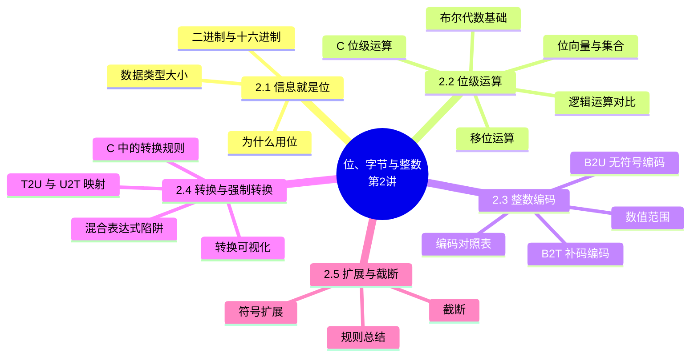

# 位、字节与整数（一）：信息的位表示与整数编码（Bits, Bytes, and Integers – Part 1）

> **本章主线**：信息就是位（为什么用位、如何编码）→ 位级运算（布尔代数、移位）→ 整数编码（无符号 B2U 与补码 B2T）→ 有符号/无符号转换与强制类型转换 → 扩展与截断。
> 一句话版本：**计算机里一切皆位（bit）**——本讲解决"数字在机器里长什么样"，并揭示"看似相同的位模式，解释不同则数值天差地别"。



---

## 2.1 信息就是位（Everything is bits）

### 2.1.1 为什么用位：二进制与电子实现

**计算机中的所有信息最终都是位（bit）**——每一位非 0 即 1。通过对位集合进行不同的**编码/解释**，计算机既能确定"要做什么"（指令），也能表示和操作数、集合、字符串等各种数据。

**为什么偏偏用位（电子实现的考量）**：

1. **易于存储**：用**双稳态元件**（bistable elements）实现——只有两个稳定状态，天然对应 0/1。
2. **抗噪声、可靠传输**：在不精确、有噪声的线路上，只要电压能区分两个区间（如 1.1V/0.9V 视为 1，0.2V/0.0V 视为 0），就能可靠传递——**噪声容限**的存在让 0/1 比多电平更抗干扰。

**基数 2 表示法（Base 2 Number Representation）**：

1. **整数**：$15213_{10} = 11101101101101_2$。
2. **小数**：$1.20_{10} = 1.0011001100110011[0011]\ldots_2$（二进制小数可能无限循环）。
3. **科学计数法**：$1.5213 \times 10^4 = 1.1101101101101_2 \times 2^{13}$。

> 口诀：**用 0/1 表达一切，靠"解释"赋予意义**——同样的位串，解释为指令、整数、浮点还是字符串，含义完全不同。

### 2.1.2 字节与十六进制编码

**字节（byte）= 8 位**，是内存寻址的基本单位：

1. **二进制**：$00000000_2$ 到 $11111111_2$；
2. **十进制**：$0_{10}$ 到 $255_{10}$；
3. **十六进制**：$00_{16}$ 到 $FF_{16}$——基数 16 表示法，字符用 `0`–`9` 与 `A`–`F`（对应 10–15）。

**十六进制与二进制的快速互换**：每个十六进制位对应 4 个二进制位，逐位转换即可。例如：

| 十六进制 | 3 | B | 6 | D |
|---|---|---|---|---|
| 二进制 | 0011 | 1011 | 0110 | 1101 |

- $15213_{10} = 0011\ 1011\ 0110\ 1101_2 = \text{0x3B6D}$。
- 在 C 语言中书写十六进制常量：`0xFA1D37B`（大写）或 `0xfa1d37b`（小写）均可。

> 口诀：**十六进制是二进制的"速记本"——1 位十六进制 = 4 位二进制**。

### 2.1.3 C 数据类型的大小

不同机器上 C 基本数据类型的字节数不同（**平台相关**）：

| C 数据类型 | 典型 32 位 | 典型 64 位 | x86-64 |
|---|---|---|---|
| char | 1 | 1 | 1 |
| short | 2 | 2 | 2 |
| int | 4 | 4 | 4 |
| long | 4 | 8 | 8 |
| float | 4 | 4 | 4 |
| double | 8 | 8 | 8 |
| pointer | 4 | 8 | 8 |

**要点**：`long` 与 `pointer` 在 32 位与 64 位机器上大小不同——这是跨平台代码最常见的隐患之一。

## 2.2 位级运算（Bit-level manipulations）

### 2.2.1 布尔代数基础

**布尔代数（Boolean Algebra）**：由 **George Boole** 于 19 世纪提出，是**逻辑的代数表示**——把"真"编码为 1、"假"编码为 0。四种基本运算：

| 运算 | 记号 | 规则 |
|---|---|---|
| 与 AND | $A\ \&\ B$ | 当 $A=1$ 且 $B=1$ 时为 1 |
| 或 OR | $A\ \|\ B$ | 当 $A=1$ 或 $B=1$ 时为 1 |
| 非 NOT | $\sim A$ | 当 $A=0$ 时为 1 |
| 异或 XOR | $A\ \hat{}\ B$ | 当 $A=1$ 或 $B=1$、但不同时为 1 时为 1 |

### 2.2.2 位向量与集合表示

**位向量（bit vector）上的布尔运算**：运算**逐位（bitwise）**进行。例如：

$$
01101001\ \&\ 01010101 = 01000001;\qquad 01101001\ |\ 01010101 = 01111101
$$

$$
01101001\ \hat{}\ 01010101 = 00111100;\qquad \sim 01101001 = 10101010
$$

**布尔代数的全部性质**（交换律、结合律、分配律、德摩根律等）对位向量依然成立。

**用位向量表示集合**：宽度 $w$ 的位向量表示集合 $\{0, 1, \ldots, w-1\}$ 的一个子集——第 $j$ 位 $a_j = 1$ 当且仅当 $j \in A$：

| 位向量 | 表示的集合 | 运算 | 结果 | 对应集合运算 |
|---|---|---|---|---|
| 01101001 | $\{0,3,5,6\}$ | $\&$ | 01000001 | **交集** $\{0,6\}$ |
| 01010101 | $\{0,2,4,6\}$ | $\|$ | 01111101 | **并集** $\{0,2,3,4,5,6\}$ |
|  |  | $\hat{}$ | 00111100 | **对称差** $\{2,3,4,5\}$ |
|  |  | $\sim$ | 10101010 | **补集** $\{1,3,5,7\}$ |

> 口诀：**位向量即集合，位运算即集合运算**——& 是交、| 是并、^ 是异或（对称差）、~ 是补。

### 2.2.3 C 中的位级运算

C 语言提供位级运算 `&`、`|`、`~`、`^`：

1. 可作用于任何"整型"（integral）数据类型：`long`、`int`、`short`、`char`、`unsigned`；
2. 把参数**视为位向量**，运算**逐位**进行。

**完整例题：字符型（char）位运算**

**题目陈述**：求 `~0x41`、`~0x00`、`0x69 & 0x55`、`0x69 | 0x55` 的结果（char 类型，8 位）。

**完整解题步骤**（每一步注明依据）：

1. $\sim\text{0x41}$：$0\text{x41} = 0100\ 0001_2$，逐位取反 → $1011\ 1110_2 = \text{0xBE}$。
2. $\sim\text{0x00}$：$0000\ 0000_2$ 逐位取反 → $1111\ 1111_2 = \text{0xFF}$。
3. $0\text{x69}\ \&\ 0\text{x55}$：$0110\ 1001_2 \ \&\ 0101\ 0101_2$，逐位与 → $0100\ 0001_2 = \text{0x41}$。
4. $0\text{x69}\ |\ 0\text{x55}$：$0110\ 1001_2 \ |\ 0101\ 0101_2$，逐位或 → $0111\ 1101_2 = \text{0x7D}$。
5. **最终答案**：`~0x41 → 0xBE`；`~0x00 → 0xFF`；`0x69 & 0x55 → 0x41`；`0x69 | 0x55 → 0x7D`。

> 该例演示的核心技巧/易错点：**先把十六进制转成二进制再逐位运算，最后转回十六进制**——不要在十六进制层面直接心算位运算。

### 2.2.4 对比：C 中的逻辑运算

**逻辑运算** `&&`、`||`、`!` 与位级运算完全不同：

1. 把 **0 视为"假"**，**任何非零值视为"真"**；
2. **总是返回 0 或 1**；
3. **短路求值（early termination）**：`&&` 左侧为假或 `||` 左侧为真时，右侧不再求值——`&&` 与 `&`（`||` 与 `|`）的混用是**最常见的高频错误之一**。

**完整例题：逻辑运算示例（char 类型）**

1. `!0x41 → 0x00`（非零为真，取非得假 0）；
2. `!0x00 → 0x01`（0 为假，取非得真 1）；
3. `!!0x41 → 0x01`（双重取非归一到 1）；
4. `0x69 && 0x55 → 0x01`（两非零，逻辑与为真）；
5. `0x69 || 0x55 → 0x01`；
6. `p && *p`——**利用短路避免空指针解引用**（`p` 为 NULL 时不再求值 `*p`）。

**位级 vs 逻辑对照表**：

| 维度 | 位级 `& \| ~ ^` | 逻辑 `&& \|\| !` |
|---|---|---|
| 操作对象 | 逐位运算 | 整体真值（0/非零） |
| 返回结果 | 位向量 | 仅 0 或 1 |
| 求值 | 无短路 | 有短路 |

> 口诀：**`&` 是"按位"，`&&` 是"布尔"——一个管位，一个管真假**。

### 2.2.5 移位运算

**左移** `x << y`：把位向量 `x` 左移 `y` 位——**左边丢弃**超出的位，**右边补 0**。

**右移** `x >> y`：把位向量 `x` 右移 `y` 位——**右边丢弃**超出的位，左边填充方式有两种：

1. **逻辑右移（Logical）**：左边补 0；
2. **算术右移（Arithmetic）**：左边**复制最高位（符号位）**。

**未定义行为（Undefined Behavior）**：移位量 $y < 0$ 或 $y \ge$ 字长时行为未定义。

**完整例题：移位运算**（参数 x 为 8 位）

**题目陈述**：对 $x = 01100010_2$ 与 $x = 10100010_2$，分别求 `<< 3`、逻辑 `>> 2`、算术 `>> 2`。

**完整解题步骤**（每一步注明依据）：

1. $x = 01100010_2$：
    - `<< 3`：左移 3 位，左边 3 位 `011` 丢弃，右边补 3 个 0 → $00010000_2$；
    - 逻辑 `>> 2`：右移 2 位，右边 2 位 `10` 丢弃，左边补 0 → $00011000_2$；
    - 算术 `>> 2`：最高位为 0，补 0 → $00011000_2$（与逻辑右移相同）。
2. $x = 10100010_2$：
    - `<< 3`：左移 3 位，左边 `101` 丢弃 → $00010000_2$；
    - 逻辑 `>> 2`：右边 `10` 丢弃，左边补 0 → $00101000_2$；
    - 算术 `>> 2`：最高位为 1，左边**复制 1** → $11101000_2$（与逻辑右移不同！）。
3. **最终答案**：见下表。

| 参数 x | `<< 3` | 逻辑 `>> 2` | 算术 `>> 2` |
|---|---|---|---|
| 01100010 | 00010000 | 00011000 | 00011000 |
| 10100010 | 00010000 | 00101000 | 11101000 |

> 该例演示的核心技巧/易错点：**当最高位为 1 时，逻辑右移与算术右移结果不同**——有符号数右移用算术右移（保持符号），无符号数右移用逻辑右移。

## 2.3 整数编码（Encoding Integers）

### 2.3.1 无符号编码 B2U 与补码编码 B2T

**无符号编码（Unsigned）**——宽度 $w$ 的位向量 $\vec{x}$ 表示非负整数：

$$
B2U_w(\vec{x}) = \sum_{i=0}^{w-1} x_i \cdot 2^i
$$

**补码编码（Two's Complement）**——最高位是**符号位（sign bit）**，权重为负：

$$
B2T_w(\vec{x}) = -x_{w-1} \cdot 2^{w-1} + \sum_{i=0}^{w-2} x_i \cdot 2^i
$$

1. **符号位**：最高位 $x_{w-1}$——0 表示非负，1 表示负数；
2. 例（`short` 占 2 字节 = 16 位）：`short int x = 15213;`、`short int y = -15213;` 的位模式见下节。

> 一句话记忆：**B2U 每位权重为正；B2T 的最高位权重为负，其余位权重为正**——这是两者唯一的结构差异。

### 2.3.2 补码示例

**例（w = 5）**：

1. $10 = 01010_2$：$8 + 2 = 10$（无符号与补码解释一致）；
2. $-10 = 10110_2$：$-16 + 4 + 2 = -10$（最高位 $-16$ 的负权重起作用）。

**例（16 位 short）**：

1. $x = 15213$：$0011\ 1011\ 0110\ 1101_2$（即 0x3B6D）；
2. $y = -15213$：$1100\ 0100\ 1001\ 0011_2$（即 0xC493）。（补充说明/拓展：计算依据——$\sim 0\text{x3B6D} = 0\text{xC492}$，$+1$ 得 $0\text{xC493}$，这正是"取反加一"求相反数）。

### 2.3.3 数值范围

宽度 $w$ 的编码范围：

| 数值 | 表达式 | 位模式 |
|---|---|---|
| UMin | 0 | $000\ldots 0$ |
| UMax | $2^w - 1$ | $111\ldots 1$ |
| TMin | $-2^{w-1}$ | $100\ldots 0$ |
| TMax | $2^{w-1} - 1$ | $011\ldots 1$ |
| $-1$ | $-1$ | $111\ldots 1$ |

**两个关键观察**：

1. **范围不对称**：$|TMin| = TMax + 1$——补码的负数比正数多一个（因为 0 占据了一个正数位模式）；
2. **UMax 与 TMax 的关系**：$UMax = 2 \times TMax + 1$。

**W = 16 的具体数值**（补充说明/拓展）：$UMax = 65535$，$TMax = 32767$，$TMin = -32768$。

**C 编程实践**：`#include <limits.h>` 提供平台相关常量（`ULONG_MAX`、`LONG_MAX`、`LONG_MIN` 等），不要手写魔数。

### 2.3.4 无符号与有符号编码对照（w = 4）

| 位模式 X | B2U(X) | B2T(X) | 位模式 X | B2U(X) | B2T(X) |
|---|---|---|---|---|---|
| 0000 | 0 | 0 | 1000 | 8 | -8 |
| 0001 | 1 | 1 | 1001 | 9 | -7 |
| 0010 | 2 | 2 | 1010 | 10 | -6 |
| 0011 | 3 | 3 | 1011 | 11 | -5 |
| 0100 | 4 | 4 | 1100 | 12 | -4 |
| 0101 | 5 | 5 | 1101 | 13 | -3 |
| 0110 | 6 | 6 | 1110 | 14 | -2 |
| 0111 | 7 | 7 | 1111 | 15 | -1 |

**三条基本性质**：

1. **等价性**：非负值的编码在两种解释下相同；
2. **唯一性**：每个位模式表示唯一整数，每个可表示整数有唯一位编码；
3. **可逆性**：映射可以求逆——$U2B(x) = B2U^{-1}(x)$（无符号整数的位模式）、$T2B(x) = B2T^{-1}(x)$（补码整数的位模式）。

> 口诀：**非负区域"双面一致"，负区域"同一编码两种说法"**——8 位模式既是无符号 8 也是补码 -8。

## 2.4 有符号与无符号的转换（Conversion & Casting）

### 2.4.1 T2U 与 U2T 映射

**核心规则**：有符号 ↔ 无符号的转换**保持位模式不变，只改变解释方式**：

1. **T2U（补码 → 无符号）**：$T2U_w(x) = B2U_w(T2B_w(x))$；
2. **U2T（无符号 → 补码）**：$U2T_w(u) = B2T_w(U2B_w(u))$。

**数值关系（w = 4 示例，相差 $2^4 = 16$）**：

| 位模式 | 补码解释 | 无符号解释 | 关系 |
|---|---|---|---|
| 0111 | 7 | 7 | 相等 |
| 1000 | -8 | 8 | 差 16 |
| 1111 | -1 | 15 | 差 16 |

**一般规律**（补充说明/拓展，源于权重公式）：对 $x < 0$ 有 $ux = x + 2^w$——**"大的负权重"变成了"大的正权重"**；对 $x \ge 0$ 两者相等。

**转换可视化**：补码 → 无符号存在**顺序反转**——负数映射到大正数（-1 → UMax），整个取值区间发生"折叠"。

> 口诀：**位模式不动，解释换一换；负数变正数，加个 $2^w$**。

### 2.4.2 C 中的常量与强制转换

1. **常量**：默认视为**有符号**整数；带 `U` 后缀才是无符号（如 `0U`、`4294967259U`）；
2. **显式强制转换**：`tx = (int) ux;`、`uy = (unsigned) ty;`——等价于 U2T / T2U；
3. **隐式转换**：通过**赋值**（`tx = ux;`）与**函数调用**（`uy = fun(tx);`）自动发生。

### 2.4.3 转换陷阱：混合表达式（Casting Surprises）

**规则（最重要的一条）**：当单个表达式中**同时出现有符号与无符号**时，**有符号值会隐式转换为无符号**——包括比较运算 `<`、`>`、`==`、`<=`、`>=`。

**完整例题：混合比较求值**（W = 32，$TMin = -2147483648$，$TMax = 2147483647$）

**题目陈述**：判断下列每个比较表达式**按何种类型求值**并给出真值。

**完整解题步骤**（每一步注明依据——凡混合类型必转无符号）：

| 表达式 | 求值类型 | 推理 | 结果 |
|---|---|---|---|
| `0 == 0U` | 无符号 | 0 转无符号仍为 0 | 真 |
| `-1 < 0` | 有符号 | 两者均为有符号，直接比较 | 真 |
| `-1 > 0U` | 无符号 | -1 转无符号 = UMax = 4294967295 > 0 | 真 |
| `2147483647 > -2147483647-1` | 有符号 | TMax > TMin | 真 |
| `2147483647U < -2147483647-1` | 无符号 | 右侧转无符号 = 2147483648 > 2147483647U | 真 |
| `-1 > -2` | 有符号 | 直接比较 | 真 |
| `(unsigned)-1 > -2` | 无符号 | 左侧 = UMax，右侧 -2 转无符号 = UMax-1 | 真 |
| `2147483647 < 2147483648U` | 无符号 | 左侧转无符号后仍为 2147483647 < 2147483648 | 真 |
| `2147483647 > (int)2147483648U` | 有符号 | `(int)2147483648U` = TMin = -2147483648 | 真 |

**最终答案**：这 9 个表达式**全部为真**——它们的"坑"不在结果，而在**求值类型**：不懂规则的人会以为某些比较按有符号进行，从而误解数值大小关系。

> 该例演示的核心技巧/易错点：**看到混合类型比较，先问"它按有符号还是无符号算"再下结论**——尤其是把负数与 `U` 后缀常量比较时。

**规则总结**：

1. 位模式保持，但被重新解释；
2. 可能产生意料之外的效果：**加或减 $2^w$**；
3. 含 `int` 与 `unsigned` 的表达式：**`int` 被转换为 `unsigned`**。

### 2.4.4 常见错误：无符号循环陷阱

**陷阱 1（死循环）**：

```c
unsigned i;
for (i = cnt - 2; i >= 0; i--)
    a[i] += a[i + 1];
```

当 `i` 减到 0 后再减 1 时，`0 - 1` 在无符号下回绕为 UMax，`i >= 0` 恒真——**死循环**。

**陷阱 2（微妙错误）**：

```c
#define DELTA sizeof(int)
int i;
for (i = CNT; i - DELTA >= 0; i -= DELTA)
    ...
```

`sizeof` 返回无符号类型，`i - DELTA` 被转成**无符号**运算——当 `i < DELTA` 时结果为巨大的正数，`>= 0` 恒真，同样导致**死循环**（补充说明/拓展：除非 `i` 恰好减到 DELTA 的整数倍且不再减）。

> 口诀：**无符号恒非负，循环下界别写 0**——`i >= 0` 对无符号是无意义的永真条件。

## 2.5 扩展与截断（Expanding & Truncating）

### 2.5.1 符号扩展（Sign Extension）

**任务**：把 $w$ 位有符号整数 $x$ 转换为 $w+k$ 位且**数值不变**。

**规则**：**复制 $k$ 份符号位**放在高位：

$$
x' = \underbrace{x_{w-1}, \ldots, x_{w-1}}_{k \text{ 份 MSB}}, x_{w-2}, \ldots, x_0
$$

**完整例题：符号扩展**

**题目陈述**：把 5 位的 10 与 -10 扩展到 6 位；再把 `short` 的 15213 与 -15213 扩展到 `int`。

**完整解题步骤**（每一步注明依据）：

1. $10 = 01010_2$（5 位）→ 符号位为 0，高位补 0 → $001010_2 = 10$ ✓（$8 + 2$）。
2. $-10 = 10110_2$（5 位）→ 符号位为 1，高位补 1 → $110110_2 = -32 + 16 + 4 + 2 = -10$ ✓。
3. `short` 的 $x = 15213 = 0\text{x3B6D}$ → `int`：符号位 0，补 16 个 0 → `0x00003B6D`（`00 00 3B 6D`）。
4. `short` 的 $y = -15213 = 0\text{xC493}$ → `int`：符号位 1，补 16 个 1 → `0xFFFFC493`（`FF FF C4 93`）。
5. **最终答案**：C 语言从较小类型转较大类型时**自动执行符号扩展**，数值保持不变。

| 变量 | 十进制 | Hex（16 位） | 扩展后 Hex（32 位） |
|---|---|---|---|
| x | 15213 | 3B 6D | 00 00 3B 6D |
| ix = (int)x | 15213 | — | 00 00 3B 6D |
| y | -15213 | C4 93 | FF FF C4 93 |
| iy = (int)y | -15213 | — | FF FF C4 93 |

> 该例演示的核心技巧/易错点：**负数扩展时高位必须补 1（复制符号位），补 0 会改变数值**——这是符号扩展与零扩展（无符号）的本质区别。

### 2.5.2 截断（Truncation）

**任务**：把 $k+w$ 位的有符号或无符号整数 $X$ 转换为 $w$ 位整数 $X'$（对"足够小"的 $X$ 保持数值）。

**规则**：**丢弃顶部 $k$ 位**，只保留低 $w$ 位。

**完整例题：截断（5 位 → 4 位）**

**题目陈述**：将 2、10、-6、-10 从 5 位截断为 4 位，分别按无符号与补码解释。

**完整解题步骤**（每一步注明依据——截断后的 4 位模式按新宽度重新解释）：

1. $2 = 00010_2$ → 截断为 $0010_2$：无符号 2、补码 2——**无符号下 $2 \bmod 16 = 2$**，无符号 2 = 补码 2 ✓（无符号与补码解释一致，数值不变）。
2. $10 = 01010_2$ → 截断为 $1010_2$：无符号 10、补码 **-6**——$10 \bmod 16 = 10U$，而 $10U$ 按补码解释为 -6（**解释变了，数值变了**）。
3. $-6 = 11010_2$ → 截断为 $1010_2$：无符号 10、补码 -6——$-6 \bmod 16 = 10U$，$10U = -6$ ✓（数值恰好保持）。
4. $-10 = 10110_2$ → 截断为 $0110_2$：无符号 6、补码 6——$-10 \bmod 16 = 22U \bmod 16 = 6U$，按补码解释为 6（**符号翻转！**）。
5. **最终答案**：截断 = 模 $2^w$ 运算——无符号下就是取模；有符号下先按无符号取模再按补码重新解释，小数值可能保持不变也可能改变符号。

> 该例演示的核心技巧/易错点：**截断是"模运算"不是"四舍五入"**——$-10$ 截断后变成正的 6，符号都可能反转。

### 2.5.3 扩展与截断规则总结

| 操作 | 规则 | 结果 |
|---|---|---|
| 扩展（如 short → int） | 无符号：**高位补 0**；有符号：**符号扩展**（补符号位） | 两者都得到**预期数值** |
| 截断（如 int → short） | 丢弃高位，**位模式被重新解释** | 无符号：**模 $2^w$**；有符号：类似取模；对数值较小者符合预期 |

> 口诀：**扩展补位看符号，截断取模要小心**——扩展安全，截断可能"变脸"。

## 知识定位与框架衔接

### 前置知识（地基）

1. **课程导论的"现实一"**：整数不是整数——本讲正是从"位"的角度解释为什么会溢出、为什么有符号与无符号行为不同，是五大现实之第一的现实的技术化落地。
2. **C 语言基础**：基本数据类型、`short`/`int`/`unsigned`、强制类型转换语法、`&`/`|`/`~`/`^`/`<<`/`>>` 运算符——本讲赋予这些运算符"位级"的含义。

### 后置知识（上层建筑）

1. **第 3 讲（03-bits-ints-part2）**：在编码基础上继续研究**整数运算**——加法、乘法、移位优化、取负，以及**内存中的表示**（字节序、指针、字符串）。
2. **浮点数（第 4 讲）**：B2U/B2T 的编码思想直接延伸到浮点编码（IEEE 754）。
3. **datalab 实验（L1）**：本讲内容（位运算、移位、补码）正是 datalab 的全部知识基础。
4. **安全编程**：符号扩展、截断、溢出是经典漏洞（如整数溢出攻击）的根源。

### 本讲在整个课程中的位置（数字地基比喻）

本讲是整门课**"数字的地基"**——后续所有关于程序行为、性能、安全的讨论，最终都要回到"数据在机器里是什么位模式"。**B2U/B2T 两个公式 + 转换规则 + 扩展截断规则**是本讲的三块基石：公式回答"怎么编码"，转换规则回答"解释切换"，扩展截断回答"位宽变化"。把它们刻进脑子，后续章节事半功倍。

### 核心灵魂问题（学完本讲应能回答）

1. **为什么补码的负数范围比正数大 1（$|TMin| = TMax + 1$）？** ——因为 0 的编码 $000\ldots 0$ 属于"非负区"，正数少了一个位模式；而 $100\ldots 0$ 的负权重 $-2^{w-1}$ 没有对应的正数。
2. **混合类型表达式里到底按有符号还是无符号算？** 规则是什么？——**只要表达式里出现无符号，有符号就隐式转无符号**（包括比较运算）；`-1 > 0U` 为真就是最经典的例子。
3. **符号扩展与截断分别在什么情况下"改变数值"？** ——扩展从不改变数值（补符号位保证数值不变）；截断是模 $2^w$ 运算，小数值不变，但如 $-10$ 截断为 4 位会变成 6——**符号都可能翻转**。

> **一句话总结本讲**：**信息即位、运算逐位、整数两种编码、转换保位重释、扩展安全截断危险**——把这五句话内化，你就掌握了机器看待数字的全部"世界观"。

---

## 课件 PDF

<iframe src="https://naimore3.github.io/Naimore3-s-Learning-Notes/课程笔记/大二上/计算机系统基础/bits_ints/02-bits-ints-part1.pdf" width="100%" height="800px" style="border: none;"></iframe>

[打开 PDF](https://naimore3.github.io/Naimore3-s-Learning-Notes/课程笔记/大二上/计算机系统基础/bits_ints/02-bits-ints-part1.pdf)
